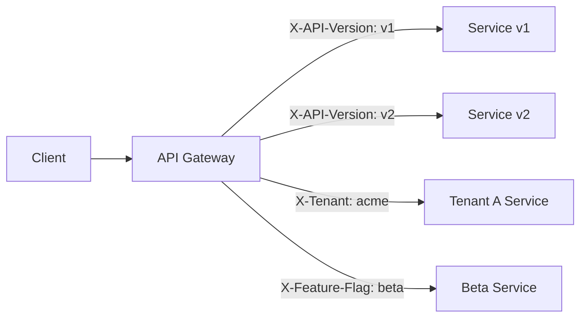
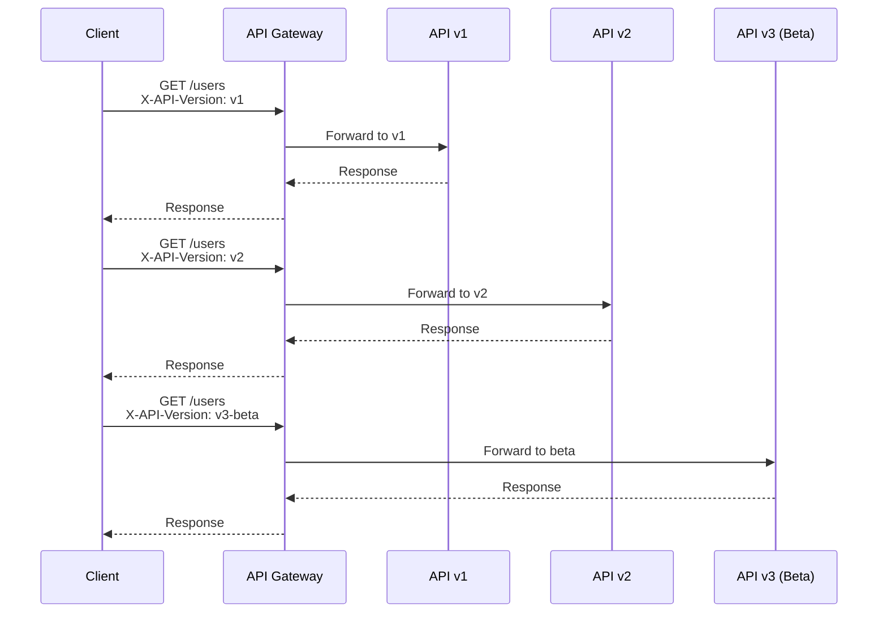
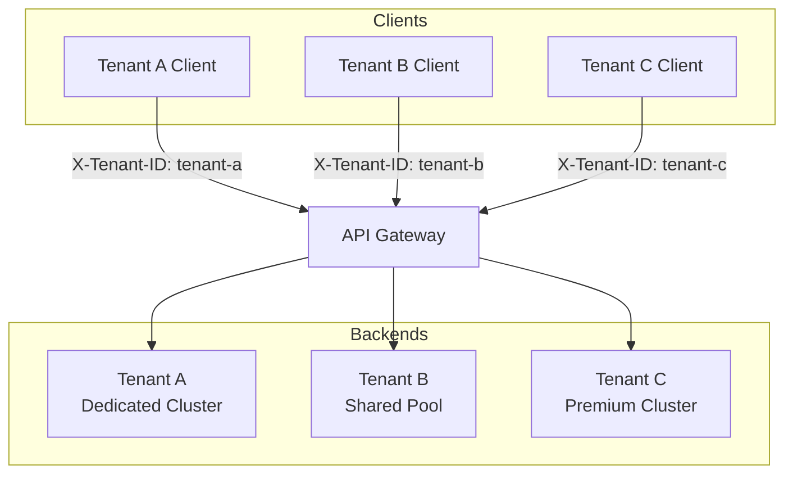
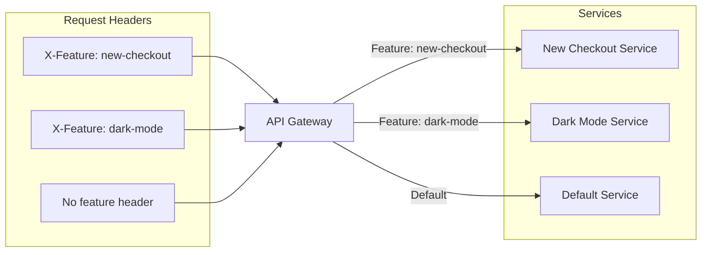
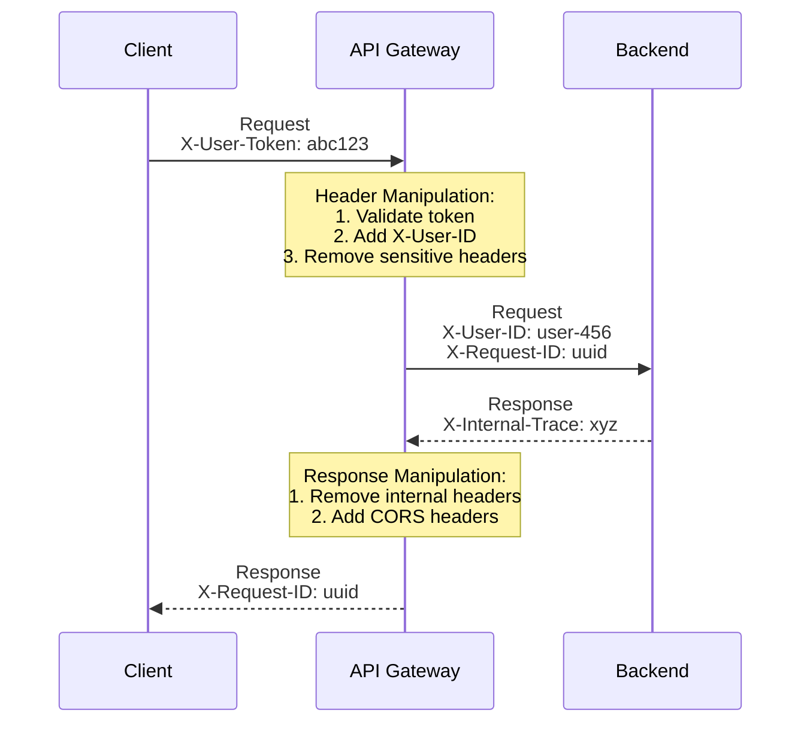
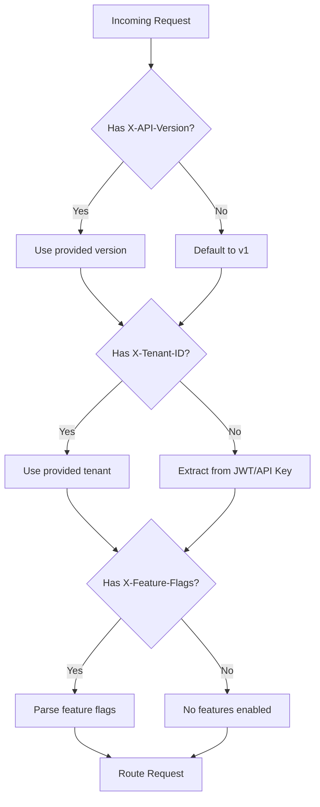

# How to Build Header-Based Routing

Author: [nawazdhandala](https://github.com/nawazdhandala)

Tags: API Gateway, Routing, Headers, Traffic Management

Description: Learn how to implement header-based routing for traffic control.

---

Header-based routing is a powerful technique that lets your API gateway direct traffic to different backend services based on HTTP header values. This enables sophisticated traffic management patterns like API versioning, multi-tenancy, A/B testing, and feature flags without changing URLs.

## Understanding Header-Based Routing

Traditional routing uses URL paths to determine where requests go. Header-based routing adds another dimension by inspecting HTTP headers to make routing decisions.



### Why Use Header-Based Routing?

- **API Versioning**: Route to different API versions without changing URLs
- **Multi-tenancy**: Direct tenant traffic to dedicated backends
- **Feature Flags**: Enable/disable features for specific users
- **A/B Testing**: Split traffic for experiments
- **Canary Deployments**: Gradually roll out new versions

## Header Matching Patterns

API gateways support various header matching strategies. Understanding these patterns is essential for building flexible routing rules.

### Exact Match

The simplest pattern - header value must match exactly.

```yaml
# NGINX Ingress Controller
apiVersion: networking.k8s.io/v1
kind: Ingress
metadata:
  name: api-ingress
  annotations:
    nginx.ingress.kubernetes.io/canary: "true"
    nginx.ingress.kubernetes.io/canary-by-header: "X-API-Version"
    nginx.ingress.kubernetes.io/canary-by-header-value: "v2"
spec:
  rules:
    - host: api.example.com
      http:
        paths:
          - path: /
            pathType: Prefix
            backend:
              service:
                name: api-v2
                port:
                  number: 80
```

### Regex Match

Pattern matching for flexible header values.

```yaml
# Traefik IngressRoute
apiVersion: traefik.io/v1alpha1
kind: IngressRoute
metadata:
  name: api-route
spec:
  entryPoints:
    - web
  routes:
    - match: Host(`api.example.com`) && HeadersRegexp(`X-API-Version`, `^v[2-9].*`)
      kind: Rule
      services:
        - name: api-v2
          port: 80
```

### Presence Check

Route based on whether a header exists, regardless of value.

```yaml
# Istio VirtualService
apiVersion: networking.istio.io/v1beta1
kind: VirtualService
metadata:
  name: api-routing
spec:
  hosts:
    - api.example.com
  http:
    - match:
        - headers:
            X-Debug-Mode:
              exact: "*"  # Any value
      route:
        - destination:
            host: api-debug
    - route:
        - destination:
            host: api-production
```

### Multiple Header Conditions

Combine multiple header checks for complex routing logic.

```yaml
# Kong Ingress
apiVersion: configuration.konghq.com/v1
kind: KongIngress
metadata:
  name: multi-header-route
route:
  headers:
    X-Tenant-ID:
      - "enterprise"
    X-Region:
      - "us-east"
      - "us-west"
```

## Version Header Routing

API versioning through headers keeps URLs clean while supporting multiple API versions simultaneously.



### Implementing Version Routing with Istio

```yaml
apiVersion: networking.istio.io/v1beta1
kind: VirtualService
metadata:
  name: api-versioning
  namespace: production
spec:
  hosts:
    - api.example.com
  http:
    # Route v3-beta requests to beta service
    - match:
        - headers:
            X-API-Version:
              prefix: "v3"
      route:
        - destination:
            host: api-service
            subset: v3-beta
            port:
              number: 8080

    # Route v2 requests
    - match:
        - headers:
            X-API-Version:
              exact: "v2"
      route:
        - destination:
            host: api-service
            subset: v2
            port:
              number: 8080

    # Default to v1
    - route:
        - destination:
            host: api-service
            subset: v1
            port:
              number: 8080
---
apiVersion: networking.istio.io/v1beta1
kind: DestinationRule
metadata:
  name: api-service-versions
spec:
  host: api-service
  subsets:
    - name: v1
      labels:
        version: v1
    - name: v2
      labels:
        version: v2
    - name: v3-beta
      labels:
        version: v3-beta
```

### Version Header in Express.js Middleware

Handle version routing at the application level.

```javascript
// versionRouter.js
const express = require('express');
const router = express.Router();

// Version routing middleware
const versionMiddleware = (req, res, next) => {
  const version = req.headers['x-api-version'] || 'v1';

  // Validate version format
  if (!/^v\d+(-\w+)?$/.test(version)) {
    return res.status(400).json({
      error: 'Invalid API version format',
      message: 'Use format: v1, v2, v3-beta'
    });
  }

  req.apiVersion = version;
  next();
};

// Apply to all routes
router.use(versionMiddleware);

// Route to version-specific handlers
router.get('/users', (req, res) => {
  switch (req.apiVersion) {
    case 'v1':
      return handleUsersV1(req, res);
    case 'v2':
      return handleUsersV2(req, res);
    default:
      return handleUsersLatest(req, res);
  }
});

// V1 handler - legacy response format
function handleUsersV1(req, res) {
  res.json({
    users: [{ id: 1, name: 'John' }],
    total: 1
  });
}

// V2 handler - paginated response
function handleUsersV2(req, res) {
  res.json({
    data: [{ id: 1, name: 'John', email: 'john@example.com' }],
    pagination: {
      page: 1,
      limit: 10,
      total: 1
    }
  });
}

module.exports = router;
```

## Tenant Header Routing

Multi-tenant architectures often need to route requests to tenant-specific backends for data isolation or resource allocation.



### Kong Configuration for Tenant Routing

```yaml
# Kong Service and Route Configuration
apiVersion: configuration.konghq.com/v1
kind: KongPlugin
metadata:
  name: tenant-router
plugin: request-transformer
config:
  add:
    headers:
      - "X-Routed-Tenant:$(headers.x-tenant-id)"
---
apiVersion: configuration.konghq.com/v1
kind: KongIngress
metadata:
  name: tenant-a-route
route:
  headers:
    X-Tenant-ID:
      - "tenant-a"
      - "tenant-alpha"  # Alias support
---
apiVersion: networking.k8s.io/v1
kind: Ingress
metadata:
  name: tenant-a-ingress
  annotations:
    konghq.com/override: tenant-a-route
    konghq.com/plugins: tenant-router
spec:
  ingressClassName: kong
  rules:
    - host: api.example.com
      http:
        paths:
          - path: /
            pathType: Prefix
            backend:
              service:
                name: tenant-a-service
                port:
                  number: 8080
```

### Tenant Routing with Envoy

```yaml
# Envoy configuration for tenant-based routing
static_resources:
  listeners:
    - name: listener_0
      address:
        socket_address:
          address: 0.0.0.0
          port_value: 8080
      filter_chains:
        - filters:
            - name: envoy.filters.network.http_connection_manager
              typed_config:
                "@type": type.googleapis.com/envoy.extensions.filters.network.http_connection_manager.v3.HttpConnectionManager
                stat_prefix: ingress_http
                route_config:
                  name: tenant_routes
                  virtual_hosts:
                    - name: api_service
                      domains: ["*"]
                      routes:
                        # Premium tenant - dedicated cluster
                        - match:
                            prefix: "/"
                            headers:
                              - name: "X-Tenant-ID"
                                exact_match: "premium-corp"
                          route:
                            cluster: premium_cluster
                            timeout: 60s

                        # Enterprise tenants - high-performance pool
                        - match:
                            prefix: "/"
                            headers:
                              - name: "X-Tenant-Tier"
                                exact_match: "enterprise"
                          route:
                            cluster: enterprise_pool
                            timeout: 30s

                        # Default - shared pool
                        - match:
                            prefix: "/"
                          route:
                            cluster: shared_pool
                            timeout: 15s
                http_filters:
                  - name: envoy.filters.http.router
                    typed_config:
                      "@type": type.googleapis.com/envoy.extensions.filters.http.router.v3.Router

  clusters:
    - name: premium_cluster
      connect_timeout: 5s
      type: STRICT_DNS
      lb_policy: ROUND_ROBIN
      load_assignment:
        cluster_name: premium_cluster
        endpoints:
          - lb_endpoints:
              - endpoint:
                  address:
                    socket_address:
                      address: premium-api.internal
                      port_value: 8080

    - name: enterprise_pool
      connect_timeout: 5s
      type: STRICT_DNS
      lb_policy: LEAST_REQUEST
      load_assignment:
        cluster_name: enterprise_pool
        endpoints:
          - lb_endpoints:
              - endpoint:
                  address:
                    socket_address:
                      address: enterprise-api.internal
                      port_value: 8080

    - name: shared_pool
      connect_timeout: 5s
      type: STRICT_DNS
      lb_policy: ROUND_ROBIN
      load_assignment:
        cluster_name: shared_pool
        endpoints:
          - lb_endpoints:
              - endpoint:
                  address:
                    socket_address:
                      address: shared-api.internal
                      port_value: 8080
```

## Feature Flag Header Routing

Route traffic based on feature flags to enable gradual rollouts and A/B testing.



### Istio Feature Flag Routing

```yaml
apiVersion: networking.istio.io/v1beta1
kind: VirtualService
metadata:
  name: feature-routing
spec:
  hosts:
    - api.example.com
  http:
    # New checkout experience
    - match:
        - headers:
            X-Feature-Flags:
              regex: ".*new-checkout.*"
      route:
        - destination:
            host: checkout-service
            subset: new-checkout
      headers:
        response:
          add:
            X-Feature-Active: "new-checkout"

    # Beta features for internal testing
    - match:
        - headers:
            X-Feature-Flags:
              regex: ".*beta.*"
            X-Internal-User:
              exact: "true"
      route:
        - destination:
            host: api-service
            subset: beta

    # Canary deployment - 10% of traffic with feature flag
    - match:
        - headers:
            X-Enable-Canary:
              exact: "true"
      route:
        - destination:
            host: api-service
            subset: canary
          weight: 10
        - destination:
            host: api-service
            subset: stable
          weight: 90

    # Default route
    - route:
        - destination:
            host: api-service
            subset: stable
```

### Feature Flag Middleware in Node.js

```javascript
// featureFlagRouter.js
const express = require('express');

// Feature flag configuration
const featureConfig = {
  'new-checkout': {
    service: 'http://checkout-v2.internal:8080',
    rolloutPercentage: 25,
    allowedTenants: ['tenant-a', 'tenant-b']
  },
  'enhanced-search': {
    service: 'http://search-v2.internal:8080',
    rolloutPercentage: 50,
    allowedTenants: ['*']
  },
  'dark-mode': {
    service: 'http://ui-dark.internal:8080',
    rolloutPercentage: 100,
    allowedTenants: ['*']
  }
};

// Parse feature flags from header
function parseFeatureFlags(header) {
  if (!header) return [];
  return header.split(',').map(f => f.trim().toLowerCase());
}

// Check if feature is enabled for request
function isFeatureEnabled(feature, tenantId) {
  const config = featureConfig[feature];
  if (!config) return false;

  // Check tenant allowlist
  if (config.allowedTenants[0] !== '*' &&
      !config.allowedTenants.includes(tenantId)) {
    return false;
  }

  // Check rollout percentage
  const hash = hashString(tenantId + feature);
  return (hash % 100) < config.rolloutPercentage;
}

// Simple hash function for consistent routing
function hashString(str) {
  let hash = 0;
  for (let i = 0; i < str.length; i++) {
    const char = str.charCodeAt(i);
    hash = ((hash << 5) - hash) + char;
    hash = hash & hash;
  }
  return Math.abs(hash);
}

// Feature flag routing middleware
const featureFlagMiddleware = (req, res, next) => {
  const flagsHeader = req.headers['x-feature-flags'];
  const tenantId = req.headers['x-tenant-id'] || 'default';

  const flags = parseFeatureFlags(flagsHeader);
  const enabledFeatures = [];

  for (const flag of flags) {
    if (isFeatureEnabled(flag, tenantId)) {
      enabledFeatures.push(flag);
    }
  }

  req.enabledFeatures = enabledFeatures;
  res.setHeader('X-Features-Active', enabledFeatures.join(','));

  next();
};

module.exports = { featureFlagMiddleware, featureConfig };
```

## Header Manipulation

Sometimes you need to modify headers before forwarding requests or returning responses.



### NGINX Header Manipulation

```nginx
# nginx.conf
http {
    upstream api_backend {
        server api-1.internal:8080;
        server api-2.internal:8080;
    }

    server {
        listen 80;
        server_name api.example.com;

        location / {
            # Add request headers
            proxy_set_header X-Request-ID $request_id;
            proxy_set_header X-Real-IP $remote_addr;
            proxy_set_header X-Forwarded-For $proxy_add_x_forwarded_for;
            proxy_set_header X-Forwarded-Proto $scheme;

            # Remove sensitive headers before forwarding
            proxy_set_header Authorization "";
            proxy_set_header Cookie "";

            # Add authenticated user info (after auth module validates)
            proxy_set_header X-User-ID $http_x_authenticated_user;

            proxy_pass http://api_backend;

            # Manipulate response headers
            proxy_hide_header X-Internal-Debug;
            proxy_hide_header X-Backend-Server;

            # Add security headers to response
            add_header X-Content-Type-Options "nosniff" always;
            add_header X-Frame-Options "DENY" always;
            add_header X-Request-ID $request_id always;
        }
    }
}
```

### Traefik Header Middleware

```yaml
# Traefik middleware for header manipulation
apiVersion: traefik.io/v1alpha1
kind: Middleware
metadata:
  name: headers-middleware
spec:
  headers:
    # Request header modifications
    customRequestHeaders:
      X-Gateway: "traefik"
      X-Forwarded-Proto: "https"

    # Remove headers from requests
    customRequestHeaders:
      X-Internal-Token: ""  # Empty string removes header

    # Response header modifications
    customResponseHeaders:
      X-Powered-By: ""  # Remove
      X-Content-Type-Options: "nosniff"
      X-Frame-Options: "DENY"
      Strict-Transport-Security: "max-age=31536000; includeSubDomains"

    # CORS configuration
    accessControlAllowMethods:
      - GET
      - POST
      - PUT
      - DELETE
    accessControlAllowHeaders:
      - Content-Type
      - Authorization
      - X-API-Version
    accessControlAllowOriginList:
      - "https://app.example.com"
    accessControlMaxAge: 86400
---
apiVersion: traefik.io/v1alpha1
kind: IngressRoute
metadata:
  name: api-route
spec:
  entryPoints:
    - websecure
  routes:
    - match: Host(`api.example.com`)
      kind: Rule
      middlewares:
        - name: headers-middleware
      services:
        - name: api-service
          port: 8080
```

### Kong Header Transformation Plugin

```yaml
apiVersion: configuration.konghq.com/v1
kind: KongPlugin
metadata:
  name: request-transformer
plugin: request-transformer
config:
  remove:
    headers:
      - "X-Internal-Secret"
      - "Cookie"
  rename:
    headers:
      - "Authorization:X-Original-Auth"
  add:
    headers:
      - "X-Gateway-Time:$(now)"
      - "X-Request-ID:$(uuid)"
  append:
    headers:
      - "X-Forwarded-For:$(client_ip)"
---
apiVersion: configuration.konghq.com/v1
kind: KongPlugin
metadata:
  name: response-transformer
plugin: response-transformer
config:
  remove:
    headers:
      - "X-Backend-Server"
      - "X-Debug-Info"
  add:
    headers:
      - "X-Response-Time:$(latency)"
      - "X-Served-By:kong-gateway"
```

## Default Header Handling

Establish sensible defaults when expected headers are missing.



### Default Header Middleware

```javascript
// defaultHeaders.js
const defaultHeadersMiddleware = (config = {}) => {
  const defaults = {
    apiVersion: 'v1',
    contentType: 'application/json',
    acceptLanguage: 'en-US',
    timeout: '30000',
    ...config
  };

  return (req, res, next) => {
    // Set default API version
    if (!req.headers['x-api-version']) {
      req.headers['x-api-version'] = defaults.apiVersion;
      res.setHeader('X-Default-Version-Applied', 'true');
    }

    // Set default content type for POST/PUT
    if (['POST', 'PUT', 'PATCH'].includes(req.method)) {
      if (!req.headers['content-type']) {
        req.headers['content-type'] = defaults.contentType;
      }
    }

    // Set default accept language
    if (!req.headers['accept-language']) {
      req.headers['accept-language'] = defaults.acceptLanguage;
    }

    // Generate request ID if not present
    if (!req.headers['x-request-id']) {
      req.headers['x-request-id'] = generateRequestId();
    }

    // Set timeout header
    if (!req.headers['x-timeout-ms']) {
      req.headers['x-timeout-ms'] = defaults.timeout;
    }

    // Always add these to response
    res.setHeader('X-Request-ID', req.headers['x-request-id']);
    res.setHeader('X-API-Version', req.headers['x-api-version']);

    next();
  };
};

function generateRequestId() {
  return `req_${Date.now()}_${Math.random().toString(36).substr(2, 9)}`;
}

module.exports = defaultHeadersMiddleware;
```

### Envoy Default Header Configuration

```yaml
# Envoy route configuration with header defaults
route_config:
  name: default_headers_route
  virtual_hosts:
    - name: api
      domains: ["*"]
      routes:
        - match:
            prefix: "/"
          route:
            cluster: api_cluster
          request_headers_to_add:
            # Add default headers if not present
            - header:
                key: "X-Request-ID"
                value: "%REQ(X-REQUEST-ID)%"
              append: false
            - header:
                key: "X-API-Version"
                value: "v1"
              append: false  # Only add if not present
            - header:
                key: "X-Gateway-Timestamp"
                value: "%START_TIME(%s)%"
              append: false
          response_headers_to_add:
            - header:
                key: "X-Response-Time"
                value: "%RESP(X-ENVOY-UPSTREAM-SERVICE-TIME)%ms"
              append: false
```

## Complete Example: Multi-Tenant API Gateway

Here's a complete example combining all header-based routing patterns.

```yaml
# Complete Istio configuration for multi-tenant API gateway
apiVersion: networking.istio.io/v1beta1
kind: VirtualService
metadata:
  name: api-gateway
  namespace: production
spec:
  hosts:
    - api.example.com
  http:
    # Health check - no auth required
    - match:
        - uri:
            exact: /health
      route:
        - destination:
            host: api-service
      headers:
        response:
          set:
            Cache-Control: "no-cache"

    # Premium tenant routing
    - match:
        - headers:
            X-Tenant-ID:
              exact: "premium-corp"
      route:
        - destination:
            host: premium-api-service
            port:
              number: 8080
      timeout: 60s
      retries:
        attempts: 5
        perTryTimeout: 10s
      headers:
        request:
          add:
            X-Priority: "high"

    # Beta features for opted-in users
    - match:
        - headers:
            X-Feature-Flags:
              regex: ".*beta.*"
            X-API-Version:
              prefix: "v3"
      route:
        - destination:
            host: api-service
            subset: beta
      headers:
        response:
          add:
            X-Beta-Warning: "This is a beta feature"

    # API v2 routing
    - match:
        - headers:
            X-API-Version:
              exact: "v2"
      route:
        - destination:
            host: api-service
            subset: v2

    # Canary deployment (10% traffic)
    - match:
        - headers:
            X-Enable-Canary:
              exact: "true"
      route:
        - destination:
            host: api-service
            subset: canary
          weight: 10
        - destination:
            host: api-service
            subset: stable
          weight: 90

    # Default route - API v1
    - route:
        - destination:
            host: api-service
            subset: stable
      headers:
        request:
          add:
            X-API-Version: "v1"  # Default version
        response:
          add:
            X-Served-By: "istio-gateway"
---
apiVersion: networking.istio.io/v1beta1
kind: DestinationRule
metadata:
  name: api-service-destinations
spec:
  host: api-service
  trafficPolicy:
    connectionPool:
      http:
        h2UpgradePolicy: UPGRADE
        maxRequestsPerConnection: 100
  subsets:
    - name: stable
      labels:
        version: stable
      trafficPolicy:
        connectionPool:
          http:
            maxRetries: 3
    - name: canary
      labels:
        version: canary
    - name: v2
      labels:
        version: v2
    - name: beta
      labels:
        version: beta
      trafficPolicy:
        outlierDetection:
          consecutive5xxErrors: 3
          interval: 30s
          baseEjectionTime: 60s
---
apiVersion: security.istio.io/v1beta1
kind: AuthorizationPolicy
metadata:
  name: require-tenant-header
  namespace: production
spec:
  selector:
    matchLabels:
      app: api-service
  rules:
    - from:
        - source:
            principals: ["cluster.local/ns/production/sa/api-gateway"]
      when:
        - key: request.headers[x-tenant-id]
          notValues: [""]  # Header must be present and non-empty
```

## Testing Header-Based Routing

```bash
#!/bin/bash
# test-header-routing.sh

API_HOST="api.example.com"

echo "=== Testing Version Routing ==="
echo "V1 (default):"
curl -s -H "Host: $API_HOST" http://localhost/version | jq .

echo "V2:"
curl -s -H "Host: $API_HOST" -H "X-API-Version: v2" http://localhost/version | jq .

echo "V3-beta:"
curl -s -H "Host: $API_HOST" -H "X-API-Version: v3-beta" http://localhost/version | jq .

echo -e "\n=== Testing Tenant Routing ==="
echo "Default tenant:"
curl -s -H "Host: $API_HOST" http://localhost/tenant | jq .

echo "Premium tenant:"
curl -s -H "Host: $API_HOST" -H "X-Tenant-ID: premium-corp" http://localhost/tenant | jq .

echo -e "\n=== Testing Feature Flags ==="
echo "No features:"
curl -s -H "Host: $API_HOST" http://localhost/features | jq .

echo "Beta features:"
curl -s -H "Host: $API_HOST" -H "X-Feature-Flags: beta,new-checkout" http://localhost/features | jq .

echo -e "\n=== Testing Header Manipulation ==="
echo "Response headers:"
curl -s -I -H "Host: $API_HOST" http://localhost/ | grep -E "^X-"

echo -e "\n=== Testing Canary Routing ==="
echo "Running 100 requests with canary flag..."
for i in {1..100}; do
  curl -s -H "Host: $API_HOST" -H "X-Enable-Canary: true" http://localhost/version
done | sort | uniq -c
```

## Best Practices

1. **Document your headers**: Maintain clear documentation of all routing headers and their expected values
2. **Validate header values**: Always validate header formats to prevent injection attacks
3. **Set sensible defaults**: Ensure requests without headers still work correctly
4. **Use consistent naming**: Follow a convention like `X-Company-HeaderName`
5. **Monitor header usage**: Track which headers and values are being used for capacity planning
6. **Version your routing rules**: Keep routing configurations in version control
7. **Test thoroughly**: Verify all routing combinations before deploying

## Troubleshooting

| Issue | Cause | Solution |
|-------|-------|----------|
| Header not reaching backend | Gateway stripping header | Check proxy_set_header or header forwarding config |
| Routing not working | Case sensitivity | Most matchers are case-sensitive; normalize headers |
| Intermittent routing | Load balancer caching | Ensure sticky sessions or consistent hashing |
| Missing default route | No catch-all rule | Always add a default route at the end |

---

Header-based routing transforms your API gateway from a simple traffic cop into an intelligent traffic controller. By combining version routing, tenant isolation, and feature flags, you can build sophisticated traffic management patterns that support continuous deployment, A/B testing, and multi-tenant architectures without URL proliferation.
