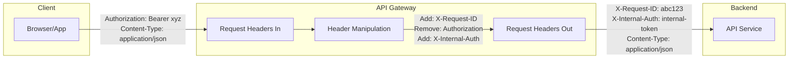
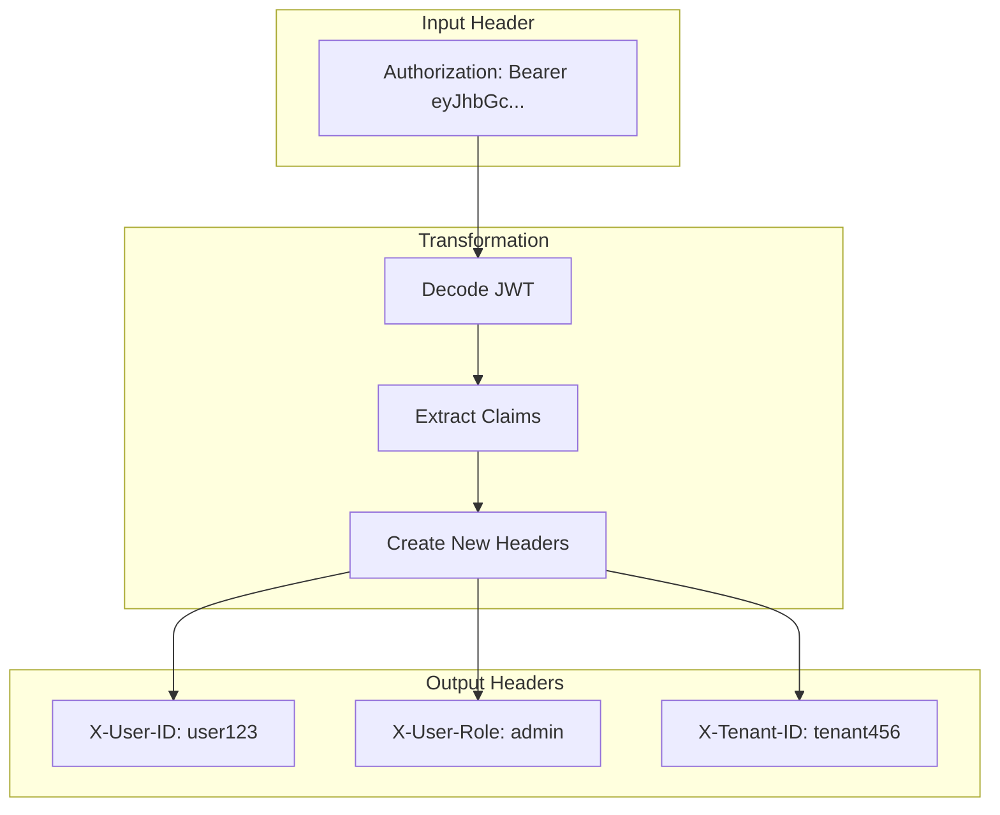
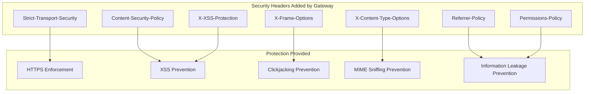
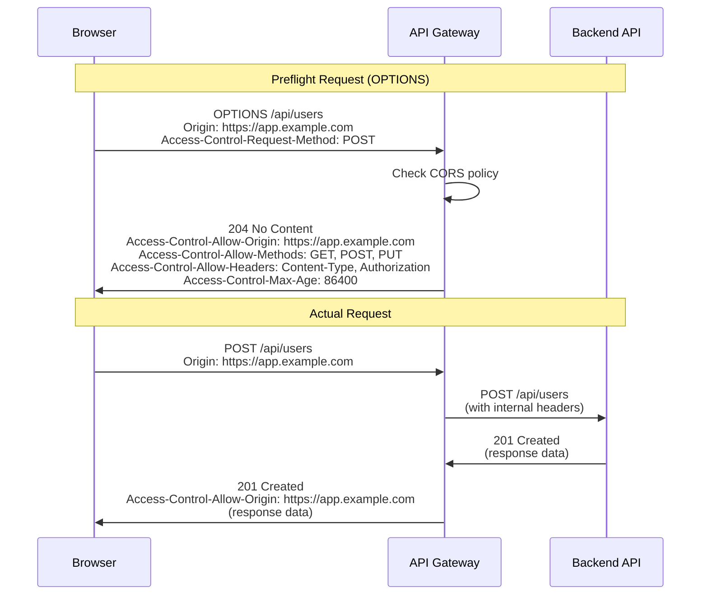
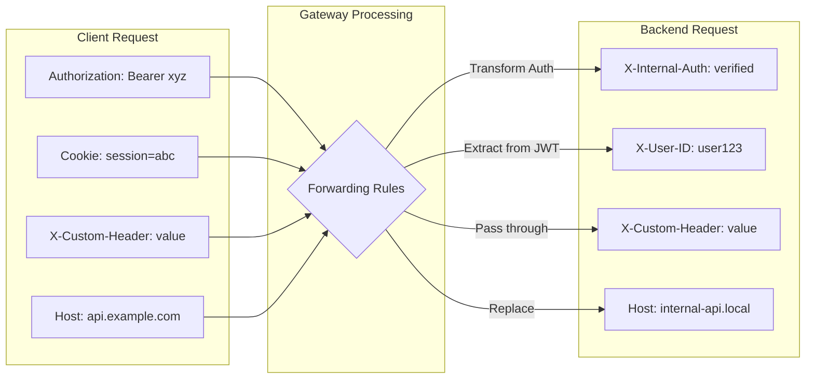
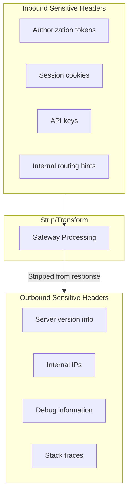

# How to Build Header Manipulation

Author: [nawazdhandala](https://github.com/nawazdhandala)

Tags: API Gateway, Headers, Transformation, Security

Description: Learn how to manipulate request and response headers in API gateways.

---

HTTP headers are the silent workhorses of web communication. They carry authentication tokens, control caching, enable CORS, and transmit metadata that shapes how requests and responses behave. In API gateways, header manipulation is a fundamental capability that lets you transform, add, remove, and forward headers to implement security policies, enable cross-origin requests, and protect sensitive information.

## Understanding Header Flow in API Gateways

Before diving into implementation, let's understand how headers flow through an API gateway.



The gateway sits between clients and backends, giving you a single point to:
- Add headers to requests before forwarding
- Remove sensitive headers from requests
- Transform header values
- Inject security headers into responses
- Manage CORS headers automatically

## Header Addition and Removal

The most basic operations are adding and removing headers. Here's how to implement a header manipulation middleware.

### Basic Header Middleware in Node.js

```javascript
// headerManipulation.js
class HeaderManipulator {
  constructor(config = {}) {
    this.requestHeadersToAdd = config.requestHeadersToAdd || {};
    this.requestHeadersToRemove = config.requestHeadersToRemove || [];
    this.responseHeadersToAdd = config.responseHeadersToAdd || {};
    this.responseHeadersToRemove = config.responseHeadersToRemove || [];
  }

  // Process incoming request headers
  manipulateRequest(headers) {
    const result = { ...headers };

    // Remove specified headers (case-insensitive)
    for (const headerToRemove of this.requestHeadersToRemove) {
      const lowerHeader = headerToRemove.toLowerCase();
      for (const key of Object.keys(result)) {
        if (key.toLowerCase() === lowerHeader) {
          delete result[key];
        }
      }
    }

    // Add or override headers
    for (const [key, value] of Object.entries(this.requestHeadersToAdd)) {
      result[key] = typeof value === 'function' ? value() : value;
    }

    return result;
  }

  // Process outgoing response headers
  manipulateResponse(headers) {
    const result = { ...headers };

    // Remove specified headers
    for (const headerToRemove of this.responseHeadersToRemove) {
      const lowerHeader = headerToRemove.toLowerCase();
      for (const key of Object.keys(result)) {
        if (key.toLowerCase() === lowerHeader) {
          delete result[key];
        }
      }
    }

    // Add or override headers
    for (const [key, value] of Object.entries(this.responseHeadersToAdd)) {
      result[key] = typeof value === 'function' ? value() : value;
    }

    return result;
  }
}

// Usage example
const manipulator = new HeaderManipulator({
  requestHeadersToAdd: {
    'X-Request-ID': () => crypto.randomUUID(),
    'X-Gateway-Version': '1.0.0',
    'X-Forwarded-For': (req) => req.ip
  },
  requestHeadersToRemove: [
    'X-Powered-By',
    'Server'
  ],
  responseHeadersToAdd: {
    'X-Content-Type-Options': 'nosniff',
    'X-Frame-Options': 'DENY'
  },
  responseHeadersToRemove: [
    'X-Powered-By',
    'Server'
  ]
});
```

### Express Middleware Implementation

```javascript
// middleware/headerManipulation.js
const crypto = require('crypto');

function createHeaderMiddleware(config) {
  return function headerMiddleware(req, res, next) {
    // Generate request ID if not present
    if (!req.headers['x-request-id']) {
      req.headers['x-request-id'] = crypto.randomUUID();
    }

    // Add forwarding headers
    req.headers['x-forwarded-for'] = req.ip || req.connection.remoteAddress;
    req.headers['x-forwarded-proto'] = req.protocol;
    req.headers['x-forwarded-host'] = req.get('host');

    // Remove sensitive headers before forwarding
    const sensitiveHeaders = [
      'x-powered-by',
      'server',
      'x-aspnet-version',
      'x-aspnetmvc-version'
    ];

    sensitiveHeaders.forEach(header => {
      delete req.headers[header];
    });

    // Override response headers
    const originalSetHeader = res.setHeader.bind(res);
    res.setHeader = function(name, value) {
      // Block certain headers from being set
      if (config.blockedResponseHeaders?.includes(name.toLowerCase())) {
        return;
      }
      originalSetHeader(name, value);
    };

    // Add security headers to response
    res.on('finish', () => {
      // Headers already sent, but we can log discrepancies
    });

    // Inject headers before response is sent
    const originalEnd = res.end.bind(res);
    res.end = function(...args) {
      // Add security headers if not already set
      if (!res.headersSent) {
        const securityHeaders = {
          'X-Content-Type-Options': 'nosniff',
          'X-Frame-Options': 'DENY',
          'X-XSS-Protection': '1; mode=block',
          'Referrer-Policy': 'strict-origin-when-cross-origin'
        };

        for (const [header, value] of Object.entries(securityHeaders)) {
          if (!res.getHeader(header)) {
            res.setHeader(header, value);
          }
        }
      }
      return originalEnd(...args);
    };

    next();
  };
}

module.exports = createHeaderMiddleware;
```

## Header Value Transformation

Sometimes you need to transform header values, not just add or remove them. Common use cases include:
- Converting authentication schemes
- Encoding/decoding values
- Extracting information from complex headers



### JWT to Header Transformation

```javascript
// transforms/jwtTransform.js
const jwt = require('jsonwebtoken');

class JWTHeaderTransformer {
  constructor(options = {}) {
    this.headerPrefix = options.headerPrefix || 'X-User-';
    this.claimsToExtract = options.claimsToExtract || ['sub', 'role', 'tenant'];
    this.removeAuthHeader = options.removeAuthHeader ?? true;
  }

  transform(headers) {
    const result = { ...headers };
    const authHeader = headers['authorization'] || headers['Authorization'];

    if (!authHeader || !authHeader.startsWith('Bearer ')) {
      return result;
    }

    try {
      const token = authHeader.substring(7);
      // Note: In production, verify the token signature
      const decoded = jwt.decode(token);

      if (decoded) {
        // Extract claims and add as headers
        for (const claim of this.claimsToExtract) {
          if (decoded[claim]) {
            const headerName = this.claimToHeaderName(claim);
            result[headerName] = String(decoded[claim]);
          }
        }

        // Add token expiry as header for downstream caching
        if (decoded.exp) {
          result['X-Token-Expires'] = new Date(decoded.exp * 1000).toISOString();
        }
      }

      // Optionally remove the original auth header
      if (this.removeAuthHeader) {
        delete result['authorization'];
        delete result['Authorization'];
      }

    } catch (error) {
      // Log error but don't fail - let the backend handle invalid tokens
      console.error('JWT decode error:', error.message);
    }

    return result;
  }

  claimToHeaderName(claim) {
    const mapping = {
      'sub': 'ID',
      'role': 'Role',
      'tenant': 'Tenant-ID',
      'email': 'Email',
      'name': 'Name'
    };
    return `${this.headerPrefix}${mapping[claim] || claim}`;
  }
}

// Usage
const transformer = new JWTHeaderTransformer({
  claimsToExtract: ['sub', 'role', 'tenant', 'email'],
  removeAuthHeader: true
});

// In middleware
const transformedHeaders = transformer.transform(req.headers);
```

### Header Value Encoding Transform

```javascript
// transforms/encodingTransform.js
class HeaderEncodingTransformer {
  // Base64 encode header values (useful for binary data or special characters)
  static encodeHeader(value) {
    return Buffer.from(value).toString('base64');
  }

  // Base64 decode header values
  static decodeHeader(value) {
    return Buffer.from(value, 'base64').toString('utf-8');
  }

  // URL encode header values
  static urlEncodeHeader(value) {
    return encodeURIComponent(value);
  }

  // Transform complex objects to JSON header
  static objectToHeader(obj) {
    return Buffer.from(JSON.stringify(obj)).toString('base64');
  }

  // Parse JSON header back to object
  static headerToObject(value) {
    try {
      return JSON.parse(Buffer.from(value, 'base64').toString('utf-8'));
    } catch {
      return null;
    }
  }
}

// Example: Passing user context through headers
function addUserContextHeader(req, userContext) {
  const encoded = HeaderEncodingTransformer.objectToHeader({
    userId: userContext.id,
    permissions: userContext.permissions,
    metadata: userContext.metadata
  });
  req.headers['x-user-context'] = encoded;
}
```

## Security Header Injection

Security headers are critical for protecting your APIs and web applications. The API gateway is the ideal place to enforce these headers consistently.



### Comprehensive Security Headers Implementation

```javascript
// security/securityHeaders.js
class SecurityHeaderInjector {
  constructor(options = {}) {
    this.options = {
      hstsMaxAge: options.hstsMaxAge || 31536000, // 1 year
      hstsIncludeSubdomains: options.hstsIncludeSubdomains ?? true,
      hstsPreload: options.hstsPreload ?? false,
      frameOptions: options.frameOptions || 'DENY',
      contentTypeOptions: options.contentTypeOptions || 'nosniff',
      xssProtection: options.xssProtection || '1; mode=block',
      referrerPolicy: options.referrerPolicy || 'strict-origin-when-cross-origin',
      csp: options.csp || null,
      permissionsPolicy: options.permissionsPolicy || null,
      ...options
    };
  }

  getSecurityHeaders() {
    const headers = {};

    // HTTP Strict Transport Security
    let hstsValue = `max-age=${this.options.hstsMaxAge}`;
    if (this.options.hstsIncludeSubdomains) {
      hstsValue += '; includeSubDomains';
    }
    if (this.options.hstsPreload) {
      hstsValue += '; preload';
    }
    headers['Strict-Transport-Security'] = hstsValue;

    // X-Frame-Options - Clickjacking protection
    headers['X-Frame-Options'] = this.options.frameOptions;

    // X-Content-Type-Options - MIME sniffing protection
    headers['X-Content-Type-Options'] = this.options.contentTypeOptions;

    // X-XSS-Protection - XSS filter (legacy but still useful)
    headers['X-XSS-Protection'] = this.options.xssProtection;

    // Referrer-Policy
    headers['Referrer-Policy'] = this.options.referrerPolicy;

    // Content-Security-Policy
    if (this.options.csp) {
      headers['Content-Security-Policy'] = this.buildCSP(this.options.csp);
    }

    // Permissions-Policy (formerly Feature-Policy)
    if (this.options.permissionsPolicy) {
      headers['Permissions-Policy'] = this.buildPermissionsPolicy(
        this.options.permissionsPolicy
      );
    }

    return headers;
  }

  buildCSP(cspConfig) {
    const directives = [];
    for (const [directive, value] of Object.entries(cspConfig)) {
      if (Array.isArray(value)) {
        directives.push(`${directive} ${value.join(' ')}`);
      } else {
        directives.push(`${directive} ${value}`);
      }
    }
    return directives.join('; ');
  }

  buildPermissionsPolicy(config) {
    const policies = [];
    for (const [feature, value] of Object.entries(config)) {
      if (value === 'none') {
        policies.push(`${feature}=()`);
      } else if (value === 'self') {
        policies.push(`${feature}=(self)`);
      } else if (Array.isArray(value)) {
        policies.push(`${feature}=(${value.map(v => `"${v}"`).join(' ')})`);
      }
    }
    return policies.join(', ');
  }

  // Express middleware
  middleware() {
    const headers = this.getSecurityHeaders();
    return (req, res, next) => {
      for (const [header, value] of Object.entries(headers)) {
        res.setHeader(header, value);
      }
      next();
    };
  }
}

// Usage with comprehensive configuration
const securityHeaders = new SecurityHeaderInjector({
  hstsMaxAge: 63072000, // 2 years
  hstsIncludeSubdomains: true,
  hstsPreload: true,
  frameOptions: 'SAMEORIGIN',
  csp: {
    'default-src': ["'self'"],
    'script-src': ["'self'", "'unsafe-inline'", 'https://cdn.example.com'],
    'style-src': ["'self'", "'unsafe-inline'"],
    'img-src': ["'self'", 'data:', 'https:'],
    'connect-src': ["'self'", 'https://api.example.com'],
    'frame-ancestors': ["'none'"],
    'base-uri': ["'self'"],
    'form-action': ["'self'"]
  },
  permissionsPolicy: {
    'geolocation': 'none',
    'microphone': 'none',
    'camera': 'none',
    'payment': 'self',
    'usb': 'none'
  }
});

app.use(securityHeaders.middleware());
```

## CORS Header Management

Cross-Origin Resource Sharing (CORS) is essential for APIs that need to be accessed from web browsers. The API gateway can centralize CORS handling.



### Flexible CORS Configuration

```javascript
// cors/corsHandler.js
class CORSHandler {
  constructor(config = {}) {
    this.config = {
      // Allowed origins - can be array, string, regex, or function
      allowedOrigins: config.allowedOrigins || '*',

      // Allowed HTTP methods
      allowedMethods: config.allowedMethods || [
        'GET', 'POST', 'PUT', 'PATCH', 'DELETE', 'OPTIONS'
      ],

      // Allowed headers
      allowedHeaders: config.allowedHeaders || [
        'Content-Type',
        'Authorization',
        'X-Requested-With',
        'X-Request-ID'
      ],

      // Headers exposed to the browser
      exposedHeaders: config.exposedHeaders || [
        'X-Request-ID',
        'X-RateLimit-Limit',
        'X-RateLimit-Remaining',
        'X-RateLimit-Reset'
      ],

      // Allow credentials (cookies, authorization headers)
      allowCredentials: config.allowCredentials ?? false,

      // Preflight cache duration
      maxAge: config.maxAge || 86400, // 24 hours

      // Per-route overrides
      routeOverrides: config.routeOverrides || {}
    };
  }

  isOriginAllowed(origin, route = null) {
    // Check route-specific overrides first
    if (route && this.config.routeOverrides[route]?.allowedOrigins) {
      return this.checkOrigin(origin, this.config.routeOverrides[route].allowedOrigins);
    }
    return this.checkOrigin(origin, this.config.allowedOrigins);
  }

  checkOrigin(origin, allowedOrigins) {
    if (allowedOrigins === '*') {
      return true;
    }

    if (typeof allowedOrigins === 'function') {
      return allowedOrigins(origin);
    }

    if (allowedOrigins instanceof RegExp) {
      return allowedOrigins.test(origin);
    }

    if (Array.isArray(allowedOrigins)) {
      return allowedOrigins.some(allowed => {
        if (allowed instanceof RegExp) {
          return allowed.test(origin);
        }
        return allowed === origin;
      });
    }

    return allowedOrigins === origin;
  }

  getCORSHeaders(origin, route = null) {
    const headers = {};

    if (!origin) {
      return headers;
    }

    if (!this.isOriginAllowed(origin, route)) {
      return headers; // Return empty headers for disallowed origins
    }

    // Access-Control-Allow-Origin
    // Note: Can't use '*' with credentials
    if (this.config.allowCredentials) {
      headers['Access-Control-Allow-Origin'] = origin;
    } else {
      headers['Access-Control-Allow-Origin'] =
        this.config.allowedOrigins === '*' ? '*' : origin;
    }

    // Access-Control-Allow-Credentials
    if (this.config.allowCredentials) {
      headers['Access-Control-Allow-Credentials'] = 'true';
    }

    // Access-Control-Expose-Headers
    if (this.config.exposedHeaders.length > 0) {
      headers['Access-Control-Expose-Headers'] =
        this.config.exposedHeaders.join(', ');
    }

    return headers;
  }

  getPreflightHeaders(origin, requestMethod, requestHeaders, route = null) {
    const headers = this.getCORSHeaders(origin, route);

    if (Object.keys(headers).length === 0) {
      return headers; // Origin not allowed
    }

    // Access-Control-Allow-Methods
    headers['Access-Control-Allow-Methods'] =
      this.config.allowedMethods.join(', ');

    // Access-Control-Allow-Headers
    headers['Access-Control-Allow-Headers'] =
      this.config.allowedHeaders.join(', ');

    // Access-Control-Max-Age
    headers['Access-Control-Max-Age'] = String(this.config.maxAge);

    return headers;
  }

  // Express middleware
  middleware() {
    return (req, res, next) => {
      const origin = req.get('Origin');
      const route = req.path;

      if (req.method === 'OPTIONS') {
        // Preflight request
        const headers = this.getPreflightHeaders(
          origin,
          req.get('Access-Control-Request-Method'),
          req.get('Access-Control-Request-Headers'),
          route
        );

        for (const [header, value] of Object.entries(headers)) {
          res.setHeader(header, value);
        }

        if (Object.keys(headers).length > 0) {
          res.status(204).end();
        } else {
          res.status(403).json({ error: 'CORS not allowed for this origin' });
        }
        return;
      }

      // Regular request
      const headers = this.getCORSHeaders(origin, route);
      for (const [header, value] of Object.entries(headers)) {
        res.setHeader(header, value);
      }

      next();
    };
  }
}

// Usage with flexible configuration
const cors = new CORSHandler({
  allowedOrigins: [
    'https://app.example.com',
    'https://admin.example.com',
    /^https:\/\/.*\.example\.com$/  // All subdomains
  ],
  allowCredentials: true,
  exposedHeaders: ['X-Request-ID', 'X-Total-Count'],
  routeOverrides: {
    '/api/public/*': {
      allowedOrigins: '*',
      allowCredentials: false
    }
  }
});

app.use(cors.middleware());
```

## Header Forwarding Rules

When proxying requests to backend services, you need to control which headers are forwarded and how.



### Header Forwarding Configuration

```javascript
// forwarding/headerForwarder.js
class HeaderForwarder {
  constructor(config = {}) {
    this.config = {
      // Headers to always forward (whitelist approach)
      forwardHeaders: config.forwardHeaders || [
        'content-type',
        'accept',
        'accept-language',
        'accept-encoding',
        'user-agent',
        'x-request-id'
      ],

      // Headers to never forward (blacklist approach)
      blockHeaders: config.blockHeaders || [
        'host',
        'connection',
        'keep-alive',
        'transfer-encoding',
        'te',
        'trailer',
        'upgrade',
        'proxy-authorization',
        'proxy-connection'
      ],

      // Headers to rename when forwarding
      renameHeaders: config.renameHeaders || {},

      // Headers to add based on incoming headers
      deriveHeaders: config.deriveHeaders || {},

      // Custom host header for backend
      backendHost: config.backendHost || null,

      // Forward all headers except blocked (allow-list vs block-list mode)
      mode: config.mode || 'allowlist' // 'allowlist' or 'blocklist'
    };
  }

  forwardHeaders(incomingHeaders, context = {}) {
    const result = {};
    const normalizedIncoming = this.normalizeHeaders(incomingHeaders);

    if (this.config.mode === 'blocklist') {
      // Forward all except blocked
      for (const [key, value] of Object.entries(normalizedIncoming)) {
        if (!this.config.blockHeaders.includes(key)) {
          result[key] = value;
        }
      }
    } else {
      // Forward only allowed (allowlist mode)
      for (const header of this.config.forwardHeaders) {
        if (normalizedIncoming[header] !== undefined) {
          result[header] = normalizedIncoming[header];
        }
      }
    }

    // Apply header renames
    for (const [original, renamed] of Object.entries(this.config.renameHeaders)) {
      const normalizedOriginal = original.toLowerCase();
      if (result[normalizedOriginal] !== undefined) {
        result[renamed.toLowerCase()] = result[normalizedOriginal];
        delete result[normalizedOriginal];
      }
    }

    // Apply derived headers
    for (const [newHeader, deriveFn] of Object.entries(this.config.deriveHeaders)) {
      const derivedValue = deriveFn(normalizedIncoming, context);
      if (derivedValue !== undefined && derivedValue !== null) {
        result[newHeader.toLowerCase()] = derivedValue;
      }
    }

    // Set backend host if configured
    if (this.config.backendHost) {
      result['host'] = this.config.backendHost;
    }

    // Add X-Forwarded headers
    result['x-forwarded-for'] = this.buildForwardedFor(
      normalizedIncoming['x-forwarded-for'],
      context.clientIP
    );
    result['x-forwarded-proto'] = context.protocol || 'https';
    result['x-forwarded-host'] = normalizedIncoming['host'] || '';

    return result;
  }

  normalizeHeaders(headers) {
    const normalized = {};
    for (const [key, value] of Object.entries(headers)) {
      normalized[key.toLowerCase()] = value;
    }
    return normalized;
  }

  buildForwardedFor(existing, clientIP) {
    if (existing && clientIP) {
      return `${existing}, ${clientIP}`;
    }
    return clientIP || existing || '';
  }
}

// Example usage
const forwarder = new HeaderForwarder({
  mode: 'blocklist',
  blockHeaders: [
    'host',
    'connection',
    'authorization', // We'll handle auth separately
    'cookie'         // Don't forward cookies to backend
  ],
  renameHeaders: {
    'x-custom-client-id': 'x-client-id'
  },
  deriveHeaders: {
    'x-user-id': (headers, context) => context.userId,
    'x-tenant-id': (headers, context) => context.tenantId,
    'x-internal-auth': (headers, context) => {
      // Generate internal auth token for backend
      return generateInternalToken(context);
    }
  },
  backendHost: 'internal-api.cluster.local'
});
```

## Sensitive Header Stripping

Protecting sensitive information is crucial. The gateway should strip sensitive headers from both requests and responses.



### Comprehensive Sensitive Header Handler

```javascript
// security/sensitiveHeaderStripper.js
class SensitiveHeaderStripper {
  constructor(config = {}) {
    // Headers that reveal server information
    this.serverInfoHeaders = [
      'server',
      'x-powered-by',
      'x-aspnet-version',
      'x-aspnetmvc-version',
      'x-runtime',
      'x-version',
      'x-generator'
    ];

    // Headers that might contain internal information
    this.internalHeaders = [
      'x-debug',
      'x-debug-token',
      'x-debug-token-link',
      'x-internal-request',
      'x-backend-server',
      'x-upstream-response-time',
      'x-cache-status',
      'via'
    ];

    // Headers containing sensitive auth/session data
    this.authHeaders = [
      'authorization',
      'x-api-key',
      'x-auth-token',
      'x-session-token',
      'set-cookie', // Be careful with this one
      'www-authenticate' // Might reveal auth schemes
    ];

    // Custom patterns to match (regex)
    this.customPatterns = config.customPatterns || [
      /^x-amz-/i,        // AWS internal headers
      /^x-goog-/i,       // Google Cloud headers
      /^x-azure-/i,      // Azure headers
      /^cf-/i,           // Cloudflare headers
      /^x-envoy-/i       // Envoy proxy headers
    ];

    // Headers to strip from requests before forwarding
    this.stripFromRequest = new Set([
      ...this.internalHeaders,
      ...(config.stripFromRequest || [])
    ].map(h => h.toLowerCase()));

    // Headers to strip from responses before sending to client
    this.stripFromResponse = new Set([
      ...this.serverInfoHeaders,
      ...this.internalHeaders,
      ...(config.stripFromResponse || [])
    ].map(h => h.toLowerCase()));

    // Headers to redact (replace value with [REDACTED])
    this.redactHeaders = new Set(
      (config.redactHeaders || []).map(h => h.toLowerCase())
    );

    // Preserve certain headers even if they match patterns
    this.preserveHeaders = new Set(
      (config.preserveHeaders || []).map(h => h.toLowerCase())
    );
  }

  shouldStripHeader(headerName, headerSet) {
    const lowerName = headerName.toLowerCase();

    // Check preserve list first
    if (this.preserveHeaders.has(lowerName)) {
      return false;
    }

    // Check explicit strip list
    if (headerSet.has(lowerName)) {
      return true;
    }

    // Check custom patterns
    for (const pattern of this.customPatterns) {
      if (pattern.test(headerName)) {
        return true;
      }
    }

    return false;
  }

  stripRequestHeaders(headers) {
    const result = {};

    for (const [key, value] of Object.entries(headers)) {
      if (!this.shouldStripHeader(key, this.stripFromRequest)) {
        if (this.redactHeaders.has(key.toLowerCase())) {
          result[key] = '[REDACTED]';
        } else {
          result[key] = value;
        }
      }
    }

    return result;
  }

  stripResponseHeaders(headers) {
    const result = {};

    for (const [key, value] of Object.entries(headers)) {
      if (!this.shouldStripHeader(key, this.stripFromResponse)) {
        if (this.redactHeaders.has(key.toLowerCase())) {
          result[key] = '[REDACTED]';
        } else {
          result[key] = this.sanitizeHeaderValue(key, value);
        }
      }
    }

    return result;
  }

  sanitizeHeaderValue(headerName, value) {
    const lowerName = headerName.toLowerCase();

    // Sanitize specific headers
    if (lowerName === 'set-cookie') {
      // Ensure secure flags are set
      return this.sanitizeCookie(value);
    }

    // Remove internal IPs from values
    if (typeof value === 'string') {
      return this.removeInternalIPs(value);
    }

    return value;
  }

  sanitizeCookie(cookieValue) {
    if (typeof cookieValue !== 'string') {
      return cookieValue;
    }

    let sanitized = cookieValue;

    // Ensure Secure flag
    if (!sanitized.toLowerCase().includes('secure')) {
      sanitized += '; Secure';
    }

    // Ensure HttpOnly flag
    if (!sanitized.toLowerCase().includes('httponly')) {
      sanitized += '; HttpOnly';
    }

    // Ensure SameSite flag
    if (!sanitized.toLowerCase().includes('samesite')) {
      sanitized += '; SameSite=Strict';
    }

    return sanitized;
  }

  removeInternalIPs(value) {
    // Remove private IP addresses from header values
    const privateIPPatterns = [
      /\b10\.\d{1,3}\.\d{1,3}\.\d{1,3}\b/g,
      /\b172\.(1[6-9]|2[0-9]|3[0-1])\.\d{1,3}\.\d{1,3}\b/g,
      /\b192\.168\.\d{1,3}\.\d{1,3}\b/g
    ];

    let result = value;
    for (const pattern of privateIPPatterns) {
      result = result.replace(pattern, '[internal]');
    }
    return result;
  }

  // Express middleware
  middleware() {
    return (req, res, next) => {
      // Strip sensitive headers from request
      const originalHeaders = { ...req.headers };
      const strippedRequestHeaders = this.stripRequestHeaders(originalHeaders);

      // Replace headers object (be careful with this approach)
      for (const key of Object.keys(req.headers)) {
        if (!(key.toLowerCase() in strippedRequestHeaders)) {
          delete req.headers[key];
        }
      }

      // Intercept response headers
      const originalSetHeader = res.setHeader.bind(res);
      res.setHeader = (name, value) => {
        if (this.shouldStripHeader(name, this.stripFromResponse)) {
          return; // Don't set the header
        }

        const sanitizedValue = this.sanitizeHeaderValue(name, value);
        originalSetHeader(name, sanitizedValue);
      };

      next();
    };
  }
}

// Usage
const stripper = new SensitiveHeaderStripper({
  stripFromResponse: [
    'x-request-processing-time',
    'x-cache-hit',
    'x-served-by'
  ],
  redactHeaders: [
    'x-correlation-id' // Keep header but hide value in logs
  ],
  preserveHeaders: [
    'x-request-id' // Don't strip even though it starts with x-
  ],
  customPatterns: [
    /^x-internal-/i,
    /^x-debug-/i
  ]
});

app.use(stripper.middleware());
```

## Complete API Gateway Header Management

Let's put it all together in a complete header management system for an API gateway.

```javascript
// gateway/headerManager.js
const crypto = require('crypto');

class APIGatewayHeaderManager {
  constructor(config = {}) {
    this.config = config;

    // Initialize sub-components
    this.securityHeaders = new SecurityHeaderInjector(config.security);
    this.corsHandler = new CORSHandler(config.cors);
    this.headerForwarder = new HeaderForwarder(config.forwarding);
    this.sensitiveStripper = new SensitiveHeaderStripper(config.sensitive);
  }

  // Process request headers before forwarding to backend
  processRequestHeaders(req, context = {}) {
    let headers = { ...req.headers };

    // Step 1: Strip sensitive/internal headers
    headers = this.sensitiveStripper.stripRequestHeaders(headers);

    // Step 2: Add request tracking headers
    headers['x-request-id'] = headers['x-request-id'] || crypto.randomUUID();
    headers['x-request-timestamp'] = new Date().toISOString();

    // Step 3: Apply forwarding rules
    headers = this.headerForwarder.forwardHeaders(headers, {
      clientIP: req.ip,
      protocol: req.protocol,
      userId: context.userId,
      tenantId: context.tenantId
    });

    return headers;
  }

  // Process response headers before sending to client
  processResponseHeaders(res, backendHeaders, req) {
    let headers = { ...backendHeaders };

    // Step 1: Strip sensitive backend headers
    headers = this.sensitiveStripper.stripResponseHeaders(headers);

    // Step 2: Add security headers
    const securityHeaders = this.securityHeaders.getSecurityHeaders();
    headers = { ...headers, ...securityHeaders };

    // Step 3: Add CORS headers
    const origin = req.get('Origin');
    const corsHeaders = this.corsHandler.getCORSHeaders(origin, req.path);
    headers = { ...headers, ...corsHeaders };

    // Step 4: Add response tracking headers
    headers['x-request-id'] = req.headers['x-request-id'];
    headers['x-response-time'] = `${Date.now() - req.startTime}ms`;

    return headers;
  }

  // Express middleware
  middleware() {
    return (req, res, next) => {
      req.startTime = Date.now();

      // Handle CORS preflight
      if (req.method === 'OPTIONS') {
        return this.corsHandler.middleware()(req, res, next);
      }

      // Store original headers for processing
      req.originalHeaders = { ...req.headers };

      // Process request headers
      const processedHeaders = this.processRequestHeaders(req, {
        userId: req.user?.id,
        tenantId: req.user?.tenantId
      });

      // Replace request headers
      req.processedHeaders = processedHeaders;

      // Intercept response
      const originalSend = res.send.bind(res);
      res.send = (body) => {
        // Process response headers if not already sent
        if (!res.headersSent) {
          const currentHeaders = res.getHeaders();
          const processedResponseHeaders = this.processResponseHeaders(
            res,
            currentHeaders,
            req
          );

          // Clear and reset headers
          for (const [key, value] of Object.entries(processedResponseHeaders)) {
            res.setHeader(key, value);
          }
        }

        return originalSend(body);
      };

      next();
    };
  }
}

// Example configuration
const gatewayHeaderManager = new APIGatewayHeaderManager({
  security: {
    hstsMaxAge: 63072000,
    hstsIncludeSubdomains: true,
    frameOptions: 'DENY',
    csp: {
      'default-src': ["'self'"],
      'script-src': ["'self'"],
      'connect-src': ["'self'", 'https://api.example.com']
    }
  },
  cors: {
    allowedOrigins: [
      'https://app.example.com',
      'https://admin.example.com'
    ],
    allowCredentials: true,
    exposedHeaders: ['X-Request-ID', 'X-RateLimit-Remaining']
  },
  forwarding: {
    mode: 'blocklist',
    blockHeaders: ['cookie', 'authorization'],
    deriveHeaders: {
      'x-internal-auth': (headers, ctx) => `internal:${ctx.userId}`
    },
    backendHost: 'api-internal.cluster.local'
  },
  sensitive: {
    stripFromResponse: ['x-powered-by', 'server'],
    customPatterns: [/^x-internal-/i]
  }
});

// Apply to Express app
const app = express();
app.use(gatewayHeaderManager.middleware());
```

## Best Practices

### 1. Always Generate Request IDs

```javascript
// Every request should have a unique, traceable ID
function ensureRequestId(req) {
  if (!req.headers['x-request-id']) {
    req.headers['x-request-id'] = crypto.randomUUID();
  }
  return req.headers['x-request-id'];
}
```

### 2. Log Header Changes

```javascript
// Log what headers were added/removed for debugging
function logHeaderChanges(original, processed, requestId) {
  const added = Object.keys(processed).filter(k => !(k in original));
  const removed = Object.keys(original).filter(k => !(k in processed));

  if (added.length || removed.length) {
    console.log({
      requestId,
      headersAdded: added,
      headersRemoved: removed
    });
  }
}
```

### 3. Use Header Versioning

```javascript
// Include gateway version for debugging
const GATEWAY_VERSION = process.env.GATEWAY_VERSION || '1.0.0';

function addGatewayHeaders(headers) {
  return {
    ...headers,
    'x-gateway-version': GATEWAY_VERSION,
    'x-gateway-region': process.env.REGION || 'unknown'
  };
}
```

### 4. Handle Header Size Limits

```javascript
// Check header sizes to prevent attacks
function validateHeaderSize(headers, maxSize = 8192) {
  let totalSize = 0;

  for (const [key, value] of Object.entries(headers)) {
    totalSize += key.length + (value?.length || 0);

    if (totalSize > maxSize) {
      throw new Error('Headers too large');
    }
  }

  return true;
}
```

---

Header manipulation is a foundational capability for any API gateway. By implementing proper header management, you can enforce security policies consistently, enable CORS for your APIs, protect sensitive information, and provide better observability across your microservices architecture. Start with security headers, add CORS support, then build out more sophisticated transformations as your needs evolve.
