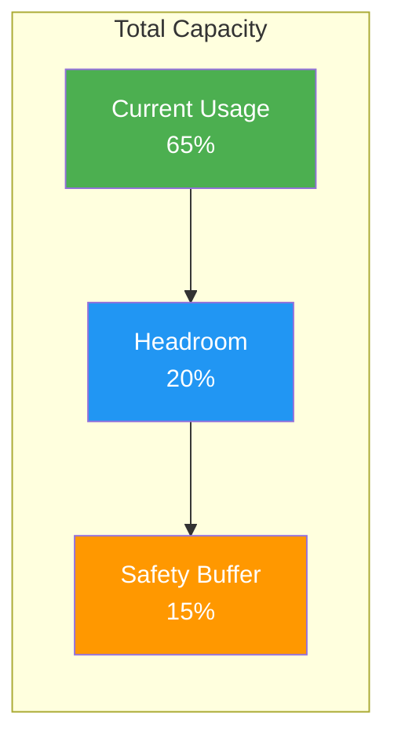
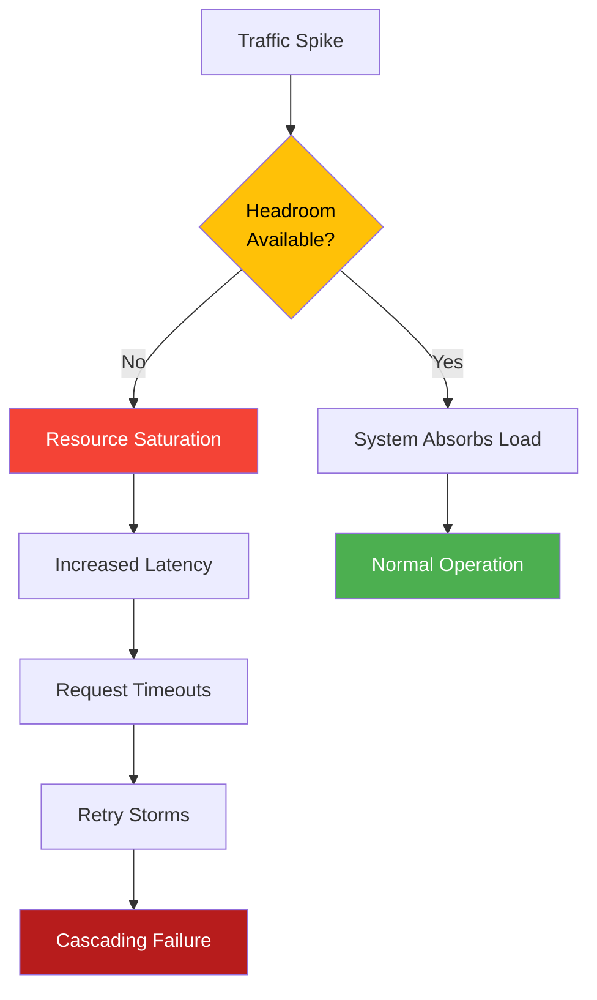
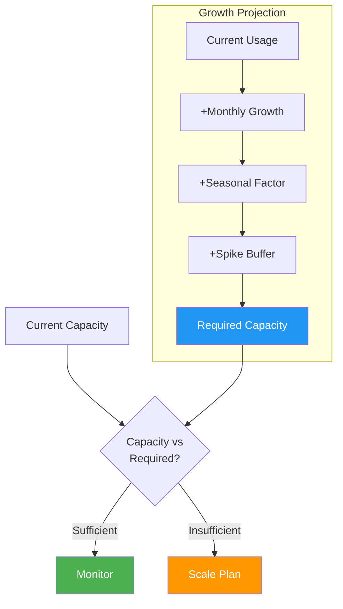
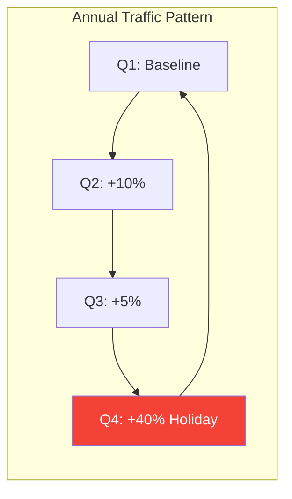
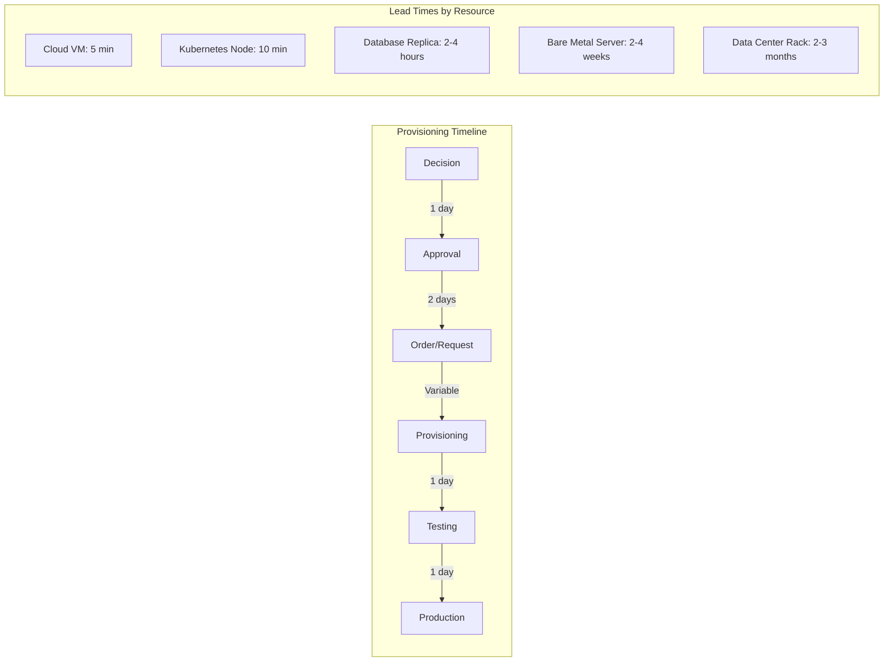
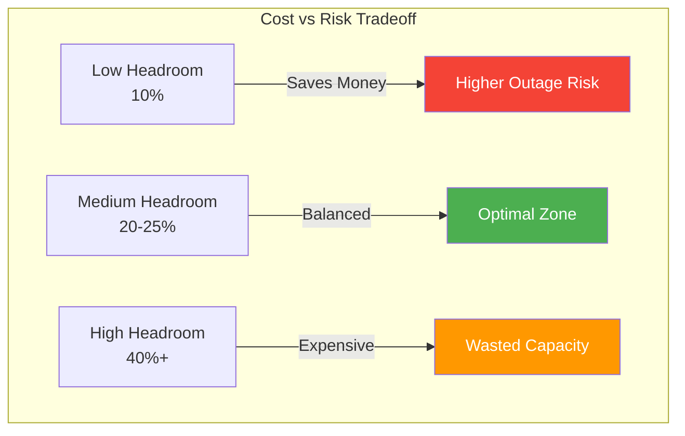
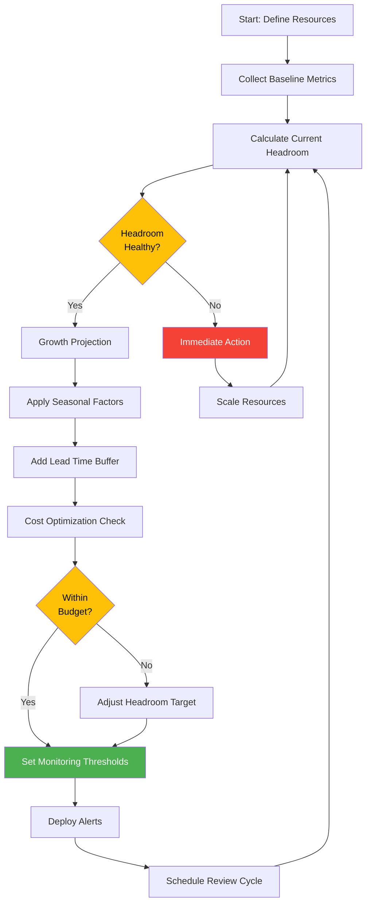

# How to Create Headroom Planning

Author: [nawazdhandala](https://github.com/nawazdhandala)

Tags: Capacity Planning, Infrastructure, SRE, Planning

Description: Learn how to plan for capacity headroom to handle growth and spikes.

---

Capacity planning without headroom is like driving with your fuel gauge on empty. You might reach your destination, but any unexpected detour leaves you stranded. **Headroom** is the buffer between your current resource usage and your maximum capacity. It absorbs traffic spikes, handles organic growth, and buys you time to provision new infrastructure.

This guide covers practical methods for calculating, maintaining, and monitoring headroom across your systems.

---

## Table of Contents

1. What Is Headroom?
2. Why Headroom Matters
3. Headroom Calculation Methods
4. Growth Rate Consideration
5. Seasonal Variation Handling
6. Lead Time for Provisioning
7. Cost Optimization Balance
8. Headroom Monitoring
9. Putting It All Together
10. Common Mistakes to Avoid

---

## 1. What Is Headroom?

Headroom is the difference between your current resource utilization and your maximum safe capacity. It represents your system's ability to absorb unexpected load without degradation.



| Term | Definition |
|------|------------|
| **Current Usage** | Resources actively consumed by your workloads |
| **Headroom** | Available capacity for growth and spikes |
| **Safety Buffer** | Reserved capacity to prevent hitting hard limits |
| **Maximum Safe Capacity** | Typically 85% of absolute maximum (avoid 100%) |

A healthy system maintains 15-30% headroom depending on workload volatility.

---

## 2. Why Headroom Matters

Without adequate headroom, you face cascading failures:



| Scenario | With Headroom | Without Headroom |
|----------|---------------|------------------|
| Black Friday traffic spike | Handles 2x normal load | Service degradation, lost sales |
| Viral social media mention | Absorbs sudden surge | Site goes down at peak visibility |
| Database backup job | Background task completes | Competes with production traffic |
| Deployment rollout | New pods start smoothly | OOM kills, failed deployments |

---

## 3. Headroom Calculation Methods

### Method 1: Percentage-Based Headroom

The simplest approach maintains a fixed percentage buffer above current usage.

```python
# headroom_calculator.py
from dataclasses import dataclass
from typing import List

@dataclass
class ResourceMetrics:
    name: str
    current_usage: float  # Current utilization (0-100)
    max_capacity: float   # Maximum safe capacity (usually 85)

def calculate_percentage_headroom(
    metrics: ResourceMetrics,
    target_headroom_percent: float = 20.0
) -> dict:
    """
    Calculate headroom using percentage-based method.

    Args:
        metrics: Current resource metrics
        target_headroom_percent: Desired headroom percentage (default 20%)

    Returns:
        Dictionary with headroom analysis
    """
    available_headroom = metrics.max_capacity - metrics.current_usage
    headroom_percent = (available_headroom / metrics.max_capacity) * 100

    is_healthy = headroom_percent >= target_headroom_percent

    return {
        "resource": metrics.name,
        "current_usage_percent": metrics.current_usage,
        "available_headroom_percent": round(headroom_percent, 2),
        "target_headroom_percent": target_headroom_percent,
        "is_healthy": is_healthy,
        "action_needed": "Scale up" if not is_healthy else "None"
    }

# Example usage
cpu_metrics = ResourceMetrics(
    name="CPU",
    current_usage=68.5,
    max_capacity=85.0
)

result = calculate_percentage_headroom(cpu_metrics, target_headroom_percent=20.0)
print(f"CPU Headroom: {result['available_headroom_percent']}%")
print(f"Status: {'Healthy' if result['is_healthy'] else 'Scale needed'}")
```

Output:
```
CPU Headroom: 19.41%
Status: Scale needed
```

### Method 2: Peak-Based Headroom

Calculate headroom based on historical peak usage plus a buffer for unknown peaks.

```python
import statistics
from typing import List

def calculate_peak_based_headroom(
    historical_peaks: List[float],
    current_capacity: float,
    peak_buffer_multiplier: float = 1.2
) -> dict:
    """
    Calculate headroom based on historical peak usage.

    Args:
        historical_peaks: List of peak usage values from past periods
        current_capacity: Current provisioned capacity
        peak_buffer_multiplier: Multiplier for expected peak (default 1.2 = 20% above)

    Returns:
        Dictionary with peak-based headroom analysis
    """
    avg_peak = statistics.mean(historical_peaks)
    max_peak = max(historical_peaks)
    std_dev = statistics.stdev(historical_peaks) if len(historical_peaks) > 1 else 0

    # Expected peak = average peak + 2 standard deviations
    expected_peak = avg_peak + (2 * std_dev)

    # Required capacity = expected peak * buffer multiplier
    required_capacity = expected_peak * peak_buffer_multiplier

    headroom = current_capacity - required_capacity
    headroom_percent = (headroom / current_capacity) * 100

    return {
        "average_peak": round(avg_peak, 2),
        "max_historical_peak": round(max_peak, 2),
        "expected_peak_p95": round(expected_peak, 2),
        "required_capacity": round(required_capacity, 2),
        "current_capacity": current_capacity,
        "headroom_units": round(headroom, 2),
        "headroom_percent": round(headroom_percent, 2),
        "recommendation": "Adequate" if headroom > 0 else f"Add {abs(headroom):.0f} units"
    }

# Example: CPU cores needed based on peak usage
weekly_peaks = [72, 68, 75, 71, 80, 73, 69]  # Peak CPU % from last 7 days
current_capacity = 100  # 100 CPU cores available

result = calculate_peak_based_headroom(weekly_peaks, current_capacity)
print(f"Expected P95 Peak: {result['expected_peak_p95']}%")
print(f"Required Capacity: {result['required_capacity']} cores")
print(f"Current Headroom: {result['headroom_percent']}%")
```

### Method 3: SLO-Driven Headroom

Derive headroom requirements from your Service Level Objectives.

```python
@dataclass
class SLORequirement:
    latency_p99_ms: float      # Target P99 latency
    error_rate_percent: float   # Maximum acceptable error rate
    availability_percent: float # Target availability (e.g., 99.9)

def calculate_slo_driven_headroom(
    slo: SLORequirement,
    current_latency_p99_ms: float,
    current_error_rate: float,
    latency_degradation_per_10_percent_load: float = 15.0
) -> dict:
    """
    Calculate headroom needed to maintain SLO compliance.

    The key insight: as utilization increases, latency degrades non-linearly.
    This function estimates the maximum load before SLO breach.
    """
    # How much latency budget remains?
    latency_budget_ms = slo.latency_p99_ms - current_latency_p99_ms

    # Estimate additional load capacity before latency breach
    # (Simplified model: each 10% load increase adds ~15ms to P99)
    load_headroom_percent = (latency_budget_ms / latency_degradation_per_10_percent_load) * 10

    # Error rate headroom
    error_budget = slo.error_rate_percent - current_error_rate

    return {
        "latency_budget_ms": round(latency_budget_ms, 2),
        "estimated_load_headroom_percent": round(load_headroom_percent, 2),
        "error_rate_budget_percent": round(error_budget, 3),
        "slo_safe": latency_budget_ms > 50 and error_budget > 0.01,
        "recommendation": get_slo_recommendation(latency_budget_ms, error_budget)
    }

def get_slo_recommendation(latency_budget: float, error_budget: float) -> str:
    if latency_budget < 20 or error_budget < 0.005:
        return "Critical: Scale immediately"
    elif latency_budget < 50 or error_budget < 0.01:
        return "Warning: Plan scaling within 1 week"
    else:
        return "Healthy: Review in next planning cycle"

# Example
slo = SLORequirement(
    latency_p99_ms=200,
    error_rate_percent=0.1,
    availability_percent=99.9
)

result = calculate_slo_driven_headroom(
    slo=slo,
    current_latency_p99_ms=145,
    current_error_rate=0.05
)
print(f"Latency Budget: {result['latency_budget_ms']}ms")
print(f"Load Headroom: {result['estimated_load_headroom_percent']}%")
print(f"Recommendation: {result['recommendation']}")
```

---

## 4. Growth Rate Consideration

Headroom must account for organic growth. Static headroom erodes over time.



```python
from datetime import datetime, timedelta
from typing import Tuple

def project_capacity_needs(
    current_usage: float,
    current_capacity: float,
    monthly_growth_rate: float,
    target_headroom_percent: float = 20.0,
    projection_months: int = 6
) -> list:
    """
    Project future capacity needs based on growth rate.

    Args:
        current_usage: Current resource usage (absolute value)
        current_capacity: Current provisioned capacity
        monthly_growth_rate: Expected monthly growth (e.g., 0.05 = 5%)
        target_headroom_percent: Desired headroom (default 20%)
        projection_months: How far to project (default 6 months)

    Returns:
        List of monthly projections with scaling recommendations
    """
    projections = []
    usage = current_usage
    today = datetime.now()

    for month in range(projection_months + 1):
        date = today + timedelta(days=30 * month)

        # Calculate required capacity to maintain target headroom
        required_capacity = usage / (1 - target_headroom_percent / 100)

        # Current headroom at this usage level
        actual_headroom = ((current_capacity - usage) / current_capacity) * 100

        projections.append({
            "month": date.strftime("%Y-%m"),
            "projected_usage": round(usage, 2),
            "required_capacity": round(required_capacity, 2),
            "current_capacity": current_capacity,
            "headroom_percent": round(actual_headroom, 2),
            "scale_needed": required_capacity > current_capacity
        })

        # Apply growth for next month
        usage *= (1 + monthly_growth_rate)

    return projections

def find_scaling_deadline(projections: list) -> Tuple[str, int]:
    """Find when scaling becomes necessary."""
    for i, p in enumerate(projections):
        if p["scale_needed"]:
            return p["month"], i
    return "Not within projection period", -1

# Example: API server capacity planning
projections = project_capacity_needs(
    current_usage=650,        # 650 requests/sec current load
    current_capacity=1000,    # 1000 requests/sec max capacity
    monthly_growth_rate=0.08, # 8% monthly growth
    target_headroom_percent=25.0,
    projection_months=12
)

deadline, months_until = find_scaling_deadline(projections)
print(f"Current headroom: {projections[0]['headroom_percent']}%")
print(f"Scaling needed by: {deadline} ({months_until} months)")
print("\nProjection Table:")
print("-" * 70)
for p in projections[:7]:
    status = "SCALE" if p["scale_needed"] else "OK"
    print(f"{p['month']}: Usage={p['projected_usage']:>7.0f} "
          f"Required={p['required_capacity']:>7.0f} "
          f"Headroom={p['headroom_percent']:>5.1f}% [{status}]")
```

Output:
```
Current headroom: 35.0%
Scaling needed by: 2026-05 (4 months)

Projection Table:
----------------------------------------------------------------------
2026-01: Usage=    650 Required=    867 Headroom= 35.0% [OK]
2026-02: Usage=    702 Required=    936 Headroom= 29.8% [OK]
2026-03: Usage=    758 Required=   1011 Headroom= 24.2% [SCALE]
2026-04: Usage=    819 Required=   1092 Headroom= 18.1% [SCALE]
2026-05: Usage=    884 Required=   1179 Headroom= 11.6% [SCALE]
2026-06: Usage=    955 Required=   1273 Headroom=  4.5% [SCALE]
2026-07: Usage=   1031 Required=   1375 Headroom= -3.1% [SCALE]
```

---

## 5. Seasonal Variation Handling

Many systems experience predictable seasonal patterns. Your headroom strategy must account for these.



```python
from dataclasses import dataclass
from typing import Dict
import math

@dataclass
class SeasonalPattern:
    """Define seasonal multipliers for capacity planning."""
    name: str
    monthly_multipliers: Dict[int, float]  # Month (1-12) -> multiplier

# Common seasonal patterns
ECOMMERCE_PATTERN = SeasonalPattern(
    name="E-commerce",
    monthly_multipliers={
        1: 0.85,   # Post-holiday slump
        2: 0.90,
        3: 0.95,
        4: 1.00,
        5: 1.00,
        6: 1.05,
        7: 1.00,
        8: 1.05,
        9: 1.10,
        10: 1.15,
        11: 1.40,  # Black Friday/Cyber Monday
        12: 1.35,  # Holiday shopping
    }
)

B2B_SAAS_PATTERN = SeasonalPattern(
    name="B2B SaaS",
    monthly_multipliers={
        1: 1.10,   # New year planning
        2: 1.05,
        3: 1.15,   # End of Q1
        4: 1.00,
        5: 1.00,
        6: 1.10,   # End of Q2
        7: 0.85,   # Summer slowdown
        8: 0.85,
        9: 1.15,   # End of Q3
        10: 1.05,
        11: 1.00,
        12: 1.20,  # End of Q4 / year-end close
    }
)

def calculate_seasonal_headroom(
    baseline_usage: float,
    current_capacity: float,
    pattern: SeasonalPattern,
    base_headroom_percent: float = 20.0,
    spike_buffer_percent: float = 15.0
) -> Dict[int, dict]:
    """
    Calculate monthly headroom requirements with seasonal adjustments.

    Args:
        baseline_usage: Average baseline resource usage
        current_capacity: Current provisioned capacity
        pattern: Seasonal pattern to apply
        base_headroom_percent: Minimum headroom in off-peak periods
        spike_buffer_percent: Additional buffer for unexpected spikes
    """
    monthly_analysis = {}

    for month, multiplier in pattern.monthly_multipliers.items():
        expected_usage = baseline_usage * multiplier

        # Higher seasonal demand = need more headroom
        seasonal_headroom = base_headroom_percent + (spike_buffer_percent * (multiplier - 1))

        required_capacity = expected_usage / (1 - seasonal_headroom / 100)
        actual_headroom = ((current_capacity - expected_usage) / current_capacity) * 100

        monthly_analysis[month] = {
            "month_name": datetime(2024, month, 1).strftime("%B"),
            "seasonal_multiplier": multiplier,
            "expected_usage": round(expected_usage, 2),
            "required_headroom_percent": round(seasonal_headroom, 2),
            "required_capacity": round(required_capacity, 2),
            "actual_headroom_percent": round(actual_headroom, 2),
            "capacity_gap": round(max(0, required_capacity - current_capacity), 2),
            "status": "OK" if required_capacity <= current_capacity else "SCALE"
        }

    return monthly_analysis

# Example: E-commerce platform capacity planning
from datetime import datetime

analysis = calculate_seasonal_headroom(
    baseline_usage=5000,      # 5000 requests/sec baseline
    current_capacity=8000,    # 8000 requests/sec max capacity
    pattern=ECOMMERCE_PATTERN,
    base_headroom_percent=20.0,
    spike_buffer_percent=15.0
)

print("Seasonal Capacity Analysis (E-commerce)\n" + "=" * 60)
print(f"{'Month':<12} {'Expected':>10} {'Required':>10} {'Gap':>8} {'Status':>8}")
print("-" * 60)
for month in range(1, 13):
    m = analysis[month]
    print(f"{m['month_name']:<12} {m['expected_usage']:>10.0f} "
          f"{m['required_capacity']:>10.0f} {m['capacity_gap']:>8.0f} {m['status']:>8}")
```

Output:
```
Seasonal Capacity Analysis (E-commerce)
============================================================
Month         Expected   Required      Gap   Status
------------------------------------------------------------
January           4250       5313        0       OK
February          4500       5625        0       OK
March             4750       5938        0       OK
April             5000       6250        0       OK
May               5000       6250        0       OK
June              5250       6563        0       OK
July              5000       6250        0       OK
August            5250       6563        0       OK
September         5500       6875        0       OK
October           5750       7188        0       OK
November          7000       9333     1333    SCALE
December          6750       8864      864    SCALE
```

---

## 6. Lead Time for Provisioning

Headroom must account for how long it takes to add capacity. Longer lead times require more buffer.



```python
from enum import Enum
from dataclasses import dataclass

class ResourceType(Enum):
    CLOUD_VM = "cloud_vm"
    K8S_NODE = "kubernetes_node"
    DATABASE_REPLICA = "database_replica"
    BARE_METAL = "bare_metal"
    DATACENTER_RACK = "datacenter_rack"

@dataclass
class ProvisioningProfile:
    resource_type: ResourceType
    lead_time_hours: float
    approval_time_hours: float
    testing_time_hours: float
    buffer_multiplier: float  # Extra buffer for delays

PROVISIONING_PROFILES = {
    ResourceType.CLOUD_VM: ProvisioningProfile(
        resource_type=ResourceType.CLOUD_VM,
        lead_time_hours=0.1,      # 5 minutes
        approval_time_hours=24,    # 1 day for budget approval
        testing_time_hours=2,
        buffer_multiplier=1.2
    ),
    ResourceType.K8S_NODE: ProvisioningProfile(
        resource_type=ResourceType.K8S_NODE,
        lead_time_hours=0.2,      # 10 minutes
        approval_time_hours=0,     # Auto-scaled
        testing_time_hours=0.5,
        buffer_multiplier=1.1
    ),
    ResourceType.DATABASE_REPLICA: ProvisioningProfile(
        resource_type=ResourceType.DATABASE_REPLICA,
        lead_time_hours=4,        # 4 hours for sync
        approval_time_hours=48,    # 2 days review
        testing_time_hours=8,
        buffer_multiplier=1.5
    ),
    ResourceType.BARE_METAL: ProvisioningProfile(
        resource_type=ResourceType.BARE_METAL,
        lead_time_hours=336,      # 2 weeks
        approval_time_hours=168,   # 1 week
        testing_time_hours=24,
        buffer_multiplier=1.3
    ),
}

def calculate_lead_time_headroom(
    current_usage: float,
    growth_rate_per_hour: float,
    resource_type: ResourceType,
    base_headroom_percent: float = 20.0
) -> dict:
    """
    Calculate headroom needed based on provisioning lead time.

    The key insight: headroom must cover growth during the entire
    provisioning cycle, not just current buffer needs.
    """
    profile = PROVISIONING_PROFILES[resource_type]

    # Total time from decision to production
    total_lead_time_hours = (
        profile.approval_time_hours +
        profile.lead_time_hours +
        profile.testing_time_hours
    ) * profile.buffer_multiplier

    # Growth that will occur during lead time
    growth_during_lead_time = current_usage * growth_rate_per_hour * total_lead_time_hours

    # Required headroom = base headroom + growth during provisioning
    growth_headroom_percent = (growth_during_lead_time / current_usage) * 100
    total_headroom_percent = base_headroom_percent + growth_headroom_percent

    return {
        "resource_type": resource_type.value,
        "total_lead_time_hours": round(total_lead_time_hours, 1),
        "total_lead_time_days": round(total_lead_time_hours / 24, 1),
        "growth_during_lead_time_percent": round(growth_headroom_percent, 2),
        "base_headroom_percent": base_headroom_percent,
        "total_required_headroom_percent": round(total_headroom_percent, 2),
        "trigger_threshold_percent": round(100 - total_headroom_percent, 2)
    }

# Example: Compare headroom needs for different resource types
current_usage = 7000  # requests/sec
hourly_growth_rate = 0.0005  # 0.05% per hour (~1.2% daily)

print("Lead Time Impact on Headroom Requirements")
print("=" * 65)
print(f"{'Resource Type':<20} {'Lead Time':>12} {'Growth During':>15} {'Required Headroom':>15}")
print("-" * 65)

for resource_type in ResourceType:
    result = calculate_lead_time_headroom(
        current_usage=current_usage,
        growth_rate_per_hour=hourly_growth_rate,
        resource_type=resource_type
    )
    print(f"{result['resource_type']:<20} "
          f"{result['total_lead_time_days']:>10.1f}d "
          f"{result['growth_during_lead_time_percent']:>14.1f}% "
          f"{result['total_required_headroom_percent']:>14.1f}%")
```

Output:
```
Lead Time Impact on Headroom Requirements
=================================================================
Resource Type         Lead Time  Growth During Required Headroom
-----------------------------------------------------------------
cloud_vm                   1.3d           1.6%           21.6%
kubernetes_node            0.0d           0.0%           20.0%
database_replica           3.8d           4.5%           24.5%
bare_metal                27.6d          33.1%           53.1%
```

---

## 7. Cost Optimization Balance

Headroom costs money. Too much headroom wastes resources; too little risks outages. Find the balance.



```python
from dataclasses import dataclass
from typing import List

@dataclass
class CostProfile:
    headroom_percent: float
    monthly_infrastructure_cost: float
    estimated_outage_probability: float  # Per month
    average_outage_cost: float
    opportunity_cost_per_outage: float

def calculate_optimal_headroom(
    base_monthly_cost: float,
    outage_cost: float,
    opportunity_cost: float,
    headroom_options: List[float] = None
) -> List[dict]:
    """
    Calculate total cost of ownership for different headroom levels.

    Assumptions:
    - Infrastructure cost scales linearly with headroom
    - Outage probability decreases exponentially with headroom
    - Below 10% headroom: ~20% monthly outage probability
    - At 30% headroom: ~1% monthly outage probability
    """
    if headroom_options is None:
        headroom_options = [10, 15, 20, 25, 30, 35, 40]

    results = []

    for headroom in headroom_options:
        # Infrastructure cost increases with headroom
        # (1 + headroom/100) relative to minimum viable capacity
        infra_cost = base_monthly_cost * (1 + headroom / 100)

        # Outage probability decreases exponentially
        # Formula: 0.20 * e^(-0.15 * headroom)
        outage_prob = 0.20 * math.exp(-0.15 * headroom)

        # Expected outage cost = probability * (direct + opportunity cost)
        expected_outage_cost = outage_prob * (outage_cost + opportunity_cost)

        # Total cost of ownership
        total_monthly_cost = infra_cost + expected_outage_cost

        results.append({
            "headroom_percent": headroom,
            "infrastructure_cost": round(infra_cost, 2),
            "outage_probability_percent": round(outage_prob * 100, 2),
            "expected_outage_cost": round(expected_outage_cost, 2),
            "total_monthly_cost": round(total_monthly_cost, 2)
        })

    # Find optimal headroom (minimum total cost)
    optimal = min(results, key=lambda x: x["total_monthly_cost"])
    for r in results:
        r["is_optimal"] = r["headroom_percent"] == optimal["headroom_percent"]

    return results

# Example: Find optimal headroom for a mid-size SaaS platform
results = calculate_optimal_headroom(
    base_monthly_cost=50000,      # $50k/month base infrastructure
    outage_cost=25000,            # $25k direct cost per outage
    opportunity_cost=100000       # $100k lost revenue/reputation per outage
)

print("Headroom Cost-Benefit Analysis")
print("=" * 80)
print(f"{'Headroom':>10} {'Infra Cost':>12} {'Outage Prob':>12} {'Outage Cost':>12} {'Total Cost':>12} {'Optimal':>10}")
print("-" * 80)
for r in results:
    optimal_marker = " ***" if r["is_optimal"] else ""
    print(f"{r['headroom_percent']:>9}% "
          f"${r['infrastructure_cost']:>10,.0f} "
          f"{r['outage_probability_percent']:>11.1f}% "
          f"${r['expected_outage_cost']:>10,.0f} "
          f"${r['total_monthly_cost']:>10,.0f}{optimal_marker}")
```

Output:
```
Headroom Cost-Benefit Analysis
================================================================================
  Headroom   Infra Cost  Outage Prob  Outage Cost   Total Cost    Optimal
--------------------------------------------------------------------------------
       10%     $55,000        4.5%      $5,578       $60,578
       15%     $57,500        2.1%      $2,612       $60,112
       20%     $60,000        1.0%      $1,224       $61,224
       25%     $62,500        0.5%        $573       $63,073
       30%     $65,000        0.2%        $269       $65,269
       35%     $67,500        0.1%        $126       $67,626
       40%     $70,000        0.0%         $59       $70,059
```

The optimal headroom is where total cost (infrastructure + expected outage cost) is minimized. In this example, 15% headroom provides the best balance.

---

## 8. Headroom Monitoring

Continuous monitoring ensures your headroom remains healthy as conditions change.

### Prometheus/Grafana Alerting Rules

```yaml
# headroom-alerts.yaml
groups:
  - name: capacity_headroom
    interval: 1m
    rules:
      # CPU Headroom Alert
      - alert: CPUHeadroomLow
        expr: |
          (1 - (
            avg(rate(container_cpu_usage_seconds_total{namespace="production"}[5m]))
            /
            sum(kube_pod_container_resource_limits{resource="cpu", namespace="production"})
          )) * 100 < 20
        for: 15m
        labels:
          severity: warning
          team: platform
        annotations:
          summary: "CPU headroom below 20% for 15 minutes"
          description: "Current CPU headroom is {{ $value | printf \"%.1f\" }}%. Consider scaling."
          runbook_url: "https://runbooks.example.com/cpu-headroom"

      # Memory Headroom Alert
      - alert: MemoryHeadroomCritical
        expr: |
          (1 - (
            sum(container_memory_working_set_bytes{namespace="production"})
            /
            sum(kube_pod_container_resource_limits{resource="memory", namespace="production"})
          )) * 100 < 15
        for: 10m
        labels:
          severity: critical
          team: platform
        annotations:
          summary: "Memory headroom critically low"
          description: "Only {{ $value | printf \"%.1f\" }}% memory headroom remaining."

      # Disk Headroom Alert
      - alert: DiskHeadroomLow
        expr: |
          (
            (node_filesystem_avail_bytes{mountpoint="/data"} / node_filesystem_size_bytes{mountpoint="/data"})
          ) * 100 < 25
        for: 30m
        labels:
          severity: warning
          team: storage
        annotations:
          summary: "Disk headroom below 25%"
          description: "Disk {{ $labels.device }} has {{ $value | printf \"%.1f\" }}% free."

      # Headroom Trend Alert (predictive)
      - alert: HeadroomDepletingFast
        expr: |
          predict_linear(
            (1 - avg(rate(container_cpu_usage_seconds_total{namespace="production"}[1h]))
            / sum(kube_pod_container_resource_limits{resource="cpu", namespace="production"}))[24h:1h],
            86400 * 7  # 7 days
          ) * 100 < 10
        for: 1h
        labels:
          severity: warning
          team: platform
        annotations:
          summary: "CPU headroom projected to drop below 10% in 7 days"
          description: "At current growth rate, capacity action needed within a week."
```

### Grafana Dashboard Panels

```json
{
  "dashboard": {
    "title": "Capacity Headroom Dashboard",
    "panels": [
      {
        "title": "CPU Headroom %",
        "type": "gauge",
        "targets": [
          {
            "expr": "(1 - (avg(rate(container_cpu_usage_seconds_total{namespace=\"production\"}[5m])) / sum(kube_pod_container_resource_limits{resource=\"cpu\", namespace=\"production\"}))) * 100",
            "legendFormat": "CPU Headroom"
          }
        ],
        "fieldConfig": {
          "defaults": {
            "thresholds": {
              "steps": [
                { "value": 0, "color": "red" },
                { "value": 15, "color": "orange" },
                { "value": 25, "color": "green" }
              ]
            },
            "min": 0,
            "max": 100,
            "unit": "percent"
          }
        }
      },
      {
        "title": "Headroom Trend (7 days)",
        "type": "timeseries",
        "targets": [
          {
            "expr": "(1 - (avg(rate(container_cpu_usage_seconds_total{namespace=\"production\"}[1h])) / sum(kube_pod_container_resource_limits{resource=\"cpu\", namespace=\"production\"}))) * 100",
            "legendFormat": "CPU Headroom"
          },
          {
            "expr": "(1 - (sum(container_memory_working_set_bytes{namespace=\"production\"}) / sum(kube_pod_container_resource_limits{resource=\"memory\", namespace=\"production\"}))) * 100",
            "legendFormat": "Memory Headroom"
          }
        ]
      },
      {
        "title": "Days Until Headroom Exhausted",
        "type": "stat",
        "targets": [
          {
            "expr": "clamp_min((avg_over_time((1 - (avg(rate(container_cpu_usage_seconds_total{namespace=\"production\"}[1h])) / sum(kube_pod_container_resource_limits{resource=\"cpu\", namespace=\"production\"})))[24h:1h]) * 100) / (deriv((avg(rate(container_cpu_usage_seconds_total{namespace=\"production\"}[1h])) / sum(kube_pod_container_resource_limits{resource=\"cpu\", namespace=\"production\"})))[24h:1h]) / 86400, 0)",
            "legendFormat": "Days to exhaustion"
          }
        ],
        "fieldConfig": {
          "defaults": {
            "unit": "d",
            "thresholds": {
              "steps": [
                { "value": 0, "color": "red" },
                { "value": 14, "color": "orange" },
                { "value": 30, "color": "green" }
              ]
            }
          }
        }
      }
    ]
  }
}
```

### Python Monitoring Script

```python
import requests
from dataclasses import dataclass
from typing import Dict, Optional
import json

@dataclass
class HeadroomStatus:
    resource: str
    current_usage_percent: float
    headroom_percent: float
    trend_direction: str  # "increasing", "stable", "decreasing"
    days_until_exhausted: Optional[float]
    status: str  # "healthy", "warning", "critical"

class HeadroomMonitor:
    def __init__(self, prometheus_url: str, thresholds: Dict[str, float] = None):
        self.prometheus_url = prometheus_url
        self.thresholds = thresholds or {
            "critical": 10,
            "warning": 20,
            "healthy": 30
        }

    def query_prometheus(self, query: str) -> float:
        """Execute PromQL query and return result."""
        response = requests.get(
            f"{self.prometheus_url}/api/v1/query",
            params={"query": query}
        )
        data = response.json()
        if data["status"] == "success" and data["data"]["result"]:
            return float(data["data"]["result"][0]["value"][1])
        return 0.0

    def get_cpu_headroom(self, namespace: str = "production") -> HeadroomStatus:
        """Calculate CPU headroom for a namespace."""
        usage_query = f'''
            avg(rate(container_cpu_usage_seconds_total{{namespace="{namespace}"}}[5m]))
            / sum(kube_pod_container_resource_limits{{resource="cpu", namespace="{namespace}"}})
        '''
        usage_percent = self.query_prometheus(usage_query) * 100
        headroom = 100 - usage_percent

        # Get trend (compare to 24h ago)
        trend_query = f'''
            avg(rate(container_cpu_usage_seconds_total{{namespace="{namespace}"}}[5m] offset 24h))
            / sum(kube_pod_container_resource_limits{{resource="cpu", namespace="{namespace}"}} offset 24h)
        '''
        usage_24h_ago = self.query_prometheus(trend_query) * 100

        if usage_percent > usage_24h_ago + 5:
            trend = "increasing"
        elif usage_percent < usage_24h_ago - 5:
            trend = "decreasing"
        else:
            trend = "stable"

        # Calculate days until exhausted
        if trend == "increasing":
            daily_increase = usage_percent - usage_24h_ago
            days_until = headroom / daily_increase if daily_increase > 0 else None
        else:
            days_until = None

        # Determine status
        if headroom < self.thresholds["critical"]:
            status = "critical"
        elif headroom < self.thresholds["warning"]:
            status = "warning"
        else:
            status = "healthy"

        return HeadroomStatus(
            resource="CPU",
            current_usage_percent=round(usage_percent, 2),
            headroom_percent=round(headroom, 2),
            trend_direction=trend,
            days_until_exhausted=round(days_until, 1) if days_until else None,
            status=status
        )

    def generate_report(self, namespace: str = "production") -> dict:
        """Generate comprehensive headroom report."""
        cpu_status = self.get_cpu_headroom(namespace)
        # Add memory_status, disk_status, etc.

        return {
            "timestamp": datetime.now().isoformat(),
            "namespace": namespace,
            "resources": {
                "cpu": {
                    "usage_percent": cpu_status.current_usage_percent,
                    "headroom_percent": cpu_status.headroom_percent,
                    "trend": cpu_status.trend_direction,
                    "days_until_exhausted": cpu_status.days_until_exhausted,
                    "status": cpu_status.status
                }
            },
            "overall_status": cpu_status.status,
            "recommendations": self._generate_recommendations(cpu_status)
        }

    def _generate_recommendations(self, cpu_status: HeadroomStatus) -> list:
        """Generate actionable recommendations."""
        recommendations = []

        if cpu_status.status == "critical":
            recommendations.append({
                "priority": "P1",
                "action": "Immediately scale up CPU capacity",
                "reason": f"CPU headroom at {cpu_status.headroom_percent}%"
            })
        elif cpu_status.status == "warning":
            recommendations.append({
                "priority": "P2",
                "action": "Plan CPU capacity increase within 1 week",
                "reason": f"CPU headroom at {cpu_status.headroom_percent}%"
            })

        if cpu_status.days_until_exhausted and cpu_status.days_until_exhausted < 14:
            recommendations.append({
                "priority": "P2",
                "action": f"Initiate scaling process now",
                "reason": f"Headroom will be exhausted in {cpu_status.days_until_exhausted} days"
            })

        return recommendations

# Usage example
# monitor = HeadroomMonitor("http://prometheus:9090")
# report = monitor.generate_report("production")
# print(json.dumps(report, indent=2))
```

---

## 9. Putting It All Together

Here is a complete headroom planning framework combining all methods:



### Complete Planning Template

```python
from dataclasses import dataclass
from typing import Dict, List, Optional
from datetime import datetime
import json

@dataclass
class HeadroomPlan:
    resource_name: str
    current_usage: float
    current_capacity: float
    target_headroom_percent: float
    monthly_growth_rate: float
    seasonal_pattern: Optional[SeasonalPattern]
    lead_time_hours: float
    cost_per_unit: float

class CapacityPlanner:
    def __init__(self):
        self.plans: List[HeadroomPlan] = []

    def add_resource(self, plan: HeadroomPlan):
        self.plans.append(plan)

    def generate_complete_plan(self, planning_horizon_months: int = 12) -> dict:
        """Generate comprehensive capacity plan."""
        results = {
            "generated_at": datetime.now().isoformat(),
            "planning_horizon_months": planning_horizon_months,
            "resources": {}
        }

        for plan in self.plans:
            resource_analysis = self._analyze_resource(plan, planning_horizon_months)
            results["resources"][plan.resource_name] = resource_analysis

        # Generate executive summary
        results["executive_summary"] = self._generate_summary(results["resources"])

        return results

    def _analyze_resource(self, plan: HeadroomPlan, months: int) -> dict:
        # Current state
        current_headroom = ((plan.current_capacity - plan.current_usage)
                           / plan.current_capacity) * 100

        # Growth projections
        projections = project_capacity_needs(
            current_usage=plan.current_usage,
            current_capacity=plan.current_capacity,
            monthly_growth_rate=plan.monthly_growth_rate,
            target_headroom_percent=plan.target_headroom_percent,
            projection_months=months
        )

        # Find when scaling needed
        scaling_month = None
        for p in projections:
            if p["scale_needed"]:
                scaling_month = p["month"]
                break

        # Lead time adjusted trigger
        lead_time_days = plan.lead_time_hours / 24
        trigger_months_early = max(1, int(lead_time_days / 30) + 1)

        # Cost projection
        if scaling_month:
            scale_amount = projections[-1]["required_capacity"] - plan.current_capacity
            scale_cost = scale_amount * plan.cost_per_unit
        else:
            scale_amount = 0
            scale_cost = 0

        return {
            "current_state": {
                "usage": plan.current_usage,
                "capacity": plan.current_capacity,
                "headroom_percent": round(current_headroom, 2),
                "status": "healthy" if current_headroom >= plan.target_headroom_percent else "action_needed"
            },
            "growth_rate_monthly_percent": plan.monthly_growth_rate * 100,
            "target_headroom_percent": plan.target_headroom_percent,
            "scaling_trigger_month": scaling_month,
            "lead_time_adjusted_action_month": self._subtract_months(scaling_month, trigger_months_early) if scaling_month else None,
            "recommended_scale_amount": round(scale_amount, 2),
            "estimated_scale_cost": round(scale_cost, 2),
            "projections": projections[:6]  # First 6 months detail
        }

    def _subtract_months(self, date_str: str, months: int) -> str:
        """Subtract months from a YYYY-MM string."""
        if not date_str:
            return None
        year, month = map(int, date_str.split("-"))
        month -= months
        while month <= 0:
            month += 12
            year -= 1
        return f"{year}-{month:02d}"

    def _generate_summary(self, resources: dict) -> dict:
        """Generate executive summary."""
        total_scale_cost = sum(r["estimated_scale_cost"] for r in resources.values())
        urgent_actions = [
            name for name, r in resources.items()
            if r["current_state"]["status"] == "action_needed"
        ]
        upcoming_actions = [
            (name, r["lead_time_adjusted_action_month"])
            for name, r in resources.items()
            if r["lead_time_adjusted_action_month"]
        ]
        upcoming_actions.sort(key=lambda x: x[1] or "9999")

        return {
            "total_projected_scale_cost": round(total_scale_cost, 2),
            "resources_needing_immediate_action": urgent_actions,
            "next_scaling_action": upcoming_actions[0] if upcoming_actions else None,
            "recommendation": self._get_overall_recommendation(urgent_actions, upcoming_actions)
        }

    def _get_overall_recommendation(self, urgent: list, upcoming: list) -> str:
        if urgent:
            return f"IMMEDIATE: Scale {', '.join(urgent)} now to restore headroom"
        elif upcoming:
            resource, month = upcoming[0]
            return f"PLANNED: Initiate {resource} scaling by {month}"
        return "STABLE: All resources have adequate headroom for planning horizon"

# Example usage
planner = CapacityPlanner()

planner.add_resource(HeadroomPlan(
    resource_name="API Servers",
    current_usage=650,
    current_capacity=1000,
    target_headroom_percent=25,
    monthly_growth_rate=0.08,
    seasonal_pattern=None,
    lead_time_hours=48,
    cost_per_unit=0.10  # $0.10 per request/sec capacity
))

planner.add_resource(HeadroomPlan(
    resource_name="Database IOPS",
    current_usage=15000,
    current_capacity=20000,
    target_headroom_percent=30,
    monthly_growth_rate=0.05,
    seasonal_pattern=None,
    lead_time_hours=168,  # 1 week for DB scaling
    cost_per_unit=0.005
))

plan = planner.generate_complete_plan(planning_horizon_months=12)
print(json.dumps(plan, indent=2))
```

---

## 10. Common Mistakes to Avoid

| Mistake | Why It Hurts | Better Approach |
|---------|--------------|-----------------|
| Fixed headroom percentage | Ignores growth, seasonality, lead times | Dynamic headroom based on context |
| Measuring only averages | Peaks cause outages, not averages | Track P95/P99 and peak utilization |
| Ignoring lead time | Capacity arrives after it is needed | Trigger scaling lead-time-days early |
| No seasonal adjustment | Holiday traffic overwhelms systems | Build seasonal patterns into planning |
| Over-provisioning everywhere | Wastes budget on low-risk resources | Cost-benefit analysis per resource |
| Manual monitoring | Delayed response, human error | Automated alerts and dashboards |
| Planning once per year | Stale plans miss changes | Monthly reviews, continuous monitoring |
| Forgetting dependencies | Bottleneck shifts to unplanned resource | Map and plan all resources in the path |

---

## Summary

Effective headroom planning requires:

1. **Multiple calculation methods**: Combine percentage-based, peak-based, and SLO-driven approaches
2. **Growth awareness**: Project forward and trigger scaling before headroom depletes
3. **Seasonal intelligence**: Adjust buffers for predictable traffic patterns
4. **Lead time accounting**: Start provisioning early enough to arrive before needed
5. **Cost consciousness**: Balance risk and spend using quantified tradeoffs
6. **Continuous monitoring**: Automated alerts and trend tracking

The goal is not maximum headroom but optimal headroom. Enough buffer to handle the unexpected, not so much that you are paying for idle capacity. Start with 20-25% as a baseline, then refine based on your specific growth rate, seasonal patterns, and provisioning lead times.

---

**Related Reading:**

- [SRE Metrics to Track](/blog/post/2025-11-28-sre-metrics-to-track)
- [HPA Autoscaling in Kubernetes](/blog/post/2025-11-27-hpa-autoscale)
- [What is Toil and How to Eliminate It](/blog/post/2025-10-01-what-is-toil-and-how-to-eliminate-it)
