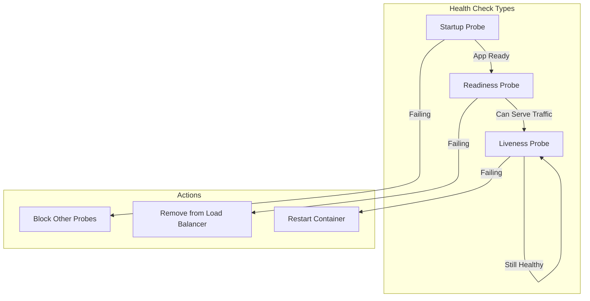
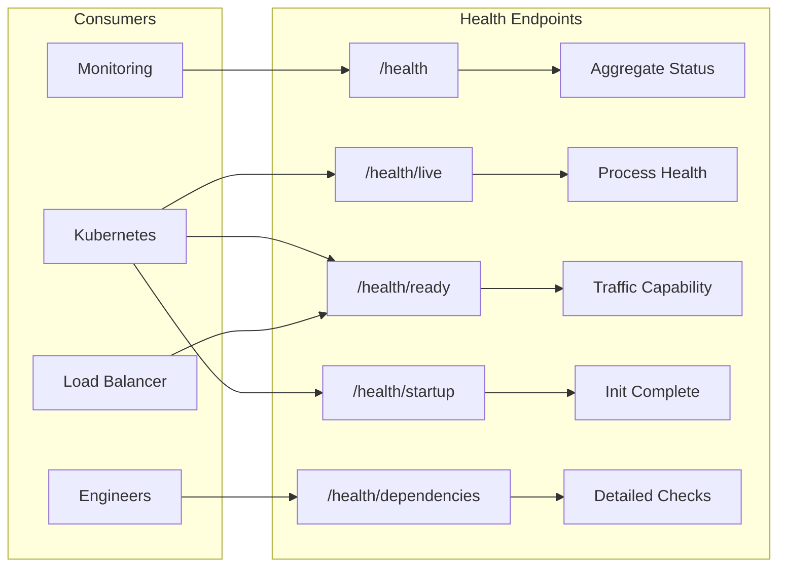
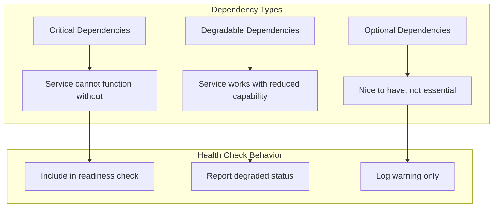
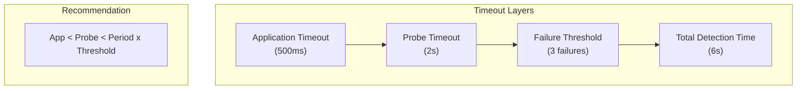
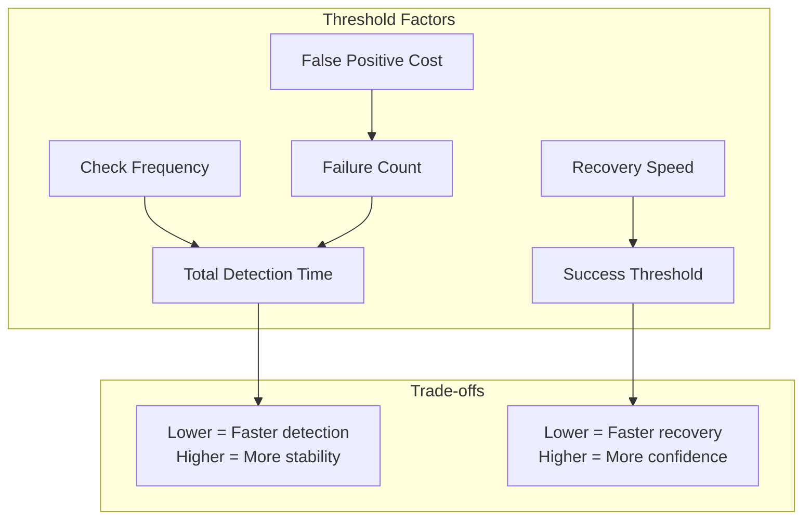
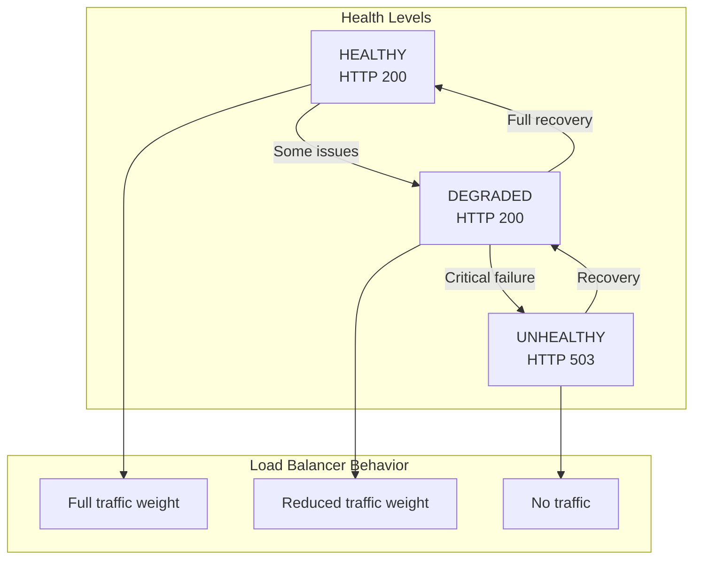

# How to Implement Health Check Design

Author: [nawazdhandala](https://github.com/nawazdhandala)

Tags: High Availability, Health Checks, Kubernetes, Load Balancing

Description: Learn how to design effective health checks for high availability systems.

---

Health checks are the nervous system of high availability infrastructure. They tell load balancers, orchestrators, and monitoring systems whether your services can handle traffic. Get them wrong and you face cascading failures, false positives, or zombie instances serving errors. Get them right and your system self-heals before users notice problems.

This guide walks through the core patterns for designing health checks that actually improve availability.

## Health Check Types

Modern infrastructure uses three distinct health check types, each serving a different purpose in the availability lifecycle:



### Startup Checks

Startup checks determine when an application has finished its initialization sequence. They gate all other health checks until the application signals readiness to begin serving.

Use startup checks when your application:
- Loads large datasets or ML models into memory
- Warms caches from external sources
- Runs database migrations on boot
- Establishes connection pools to dependencies

```python
# startup_check.py
import time
from flask import Flask, jsonify

app = Flask(__name__)

# Track initialization state
startup_state = {
    "config_loaded": False,
    "db_connected": False,
    "cache_warmed": False,
    "startup_complete": False,
    "startup_time": None
}

def initialize_application():
    """Simulate slow startup tasks."""
    time.sleep(2)  # Load configuration
    startup_state["config_loaded"] = True

    time.sleep(3)  # Establish database connections
    startup_state["db_connected"] = True

    time.sleep(5)  # Warm caches
    startup_state["cache_warmed"] = True

    startup_state["startup_complete"] = True
    startup_state["startup_time"] = time.time()

@app.route("/startup")
def startup_check():
    """
    Startup probe endpoint.
    Returns 200 only when all initialization is complete.
    Returns 503 during startup sequence.
    """
    if startup_state["startup_complete"]:
        return jsonify({
            "status": "started",
            "startup_time": startup_state["startup_time"]
        }), 200

    # Return current progress for debugging
    return jsonify({
        "status": "starting",
        "progress": startup_state
    }), 503
```

### Readiness Checks

Readiness checks indicate whether an instance can accept new requests. Unlike liveness checks, a failing readiness check removes the instance from the load balancer pool without restarting it.

This distinction matters for temporary conditions:
- Connection pool exhaustion
- Dependency downtime
- Memory pressure during garbage collection
- Deployment in progress

```python
# readiness_check.py
from flask import Flask, jsonify
import psycopg2
import redis

app = Flask(__name__)

# Connection instances (initialized elsewhere)
db_pool = None
redis_client = None

@app.route("/ready")
def readiness_check():
    """
    Readiness probe endpoint.
    Verifies the instance can serve production traffic.
    """
    checks = {}
    all_ready = True

    # Check database connectivity
    try:
        conn = db_pool.getconn()
        cursor = conn.cursor()
        cursor.execute("SELECT 1")
        cursor.close()
        db_pool.putconn(conn)
        checks["database"] = "ok"
    except Exception as e:
        checks["database"] = f"failed: {str(e)}"
        all_ready = False

    # Check Redis connectivity
    try:
        redis_client.ping()
        checks["redis"] = "ok"
    except Exception as e:
        checks["redis"] = f"failed: {str(e)}"
        all_ready = False

    # Check available connection pool capacity
    if db_pool:
        available = db_pool.maxconn - len(db_pool._used)
        if available < 2:
            checks["db_pool_capacity"] = f"low: {available} connections"
            all_ready = False
        else:
            checks["db_pool_capacity"] = f"ok: {available} available"

    if all_ready:
        return jsonify({"status": "ready", "checks": checks}), 200
    else:
        return jsonify({"status": "not_ready", "checks": checks}), 503
```

### Liveness Checks

Liveness checks detect when an application has entered an unrecoverable state: deadlocks, infinite loops, or corrupted internal state. A failing liveness check triggers a restart.

Keep liveness checks simple. They should verify the process can respond, not whether dependencies are healthy:

```python
# liveness_check.py
from flask import Flask, jsonify
import threading
import time

app = Flask(__name__)

# Track application health state
health_state = {
    "last_heartbeat": time.time(),
    "request_count": 0,
    "error_count": 0
}

# Lock for thread safety
health_lock = threading.Lock()

def update_heartbeat():
    """Called periodically by background worker to prove app is not deadlocked."""
    with health_lock:
        health_state["last_heartbeat"] = time.time()

@app.route("/live")
def liveness_check():
    """
    Liveness probe endpoint.
    Checks if the application process is functioning.
    Does NOT check external dependencies.
    """
    with health_lock:
        # Check if heartbeat is stale (possible deadlock)
        heartbeat_age = time.time() - health_state["last_heartbeat"]

        if heartbeat_age > 30:
            return jsonify({
                "status": "unhealthy",
                "reason": "heartbeat_stale",
                "last_heartbeat_seconds_ago": heartbeat_age
            }), 503

        # Check for high error rate (possible corrupted state)
        if health_state["request_count"] > 100:
            error_rate = health_state["error_count"] / health_state["request_count"]
            if error_rate > 0.5:
                return jsonify({
                    "status": "unhealthy",
                    "reason": "high_error_rate",
                    "error_rate": error_rate
                }), 503

        return jsonify({
            "status": "healthy",
            "uptime_seconds": heartbeat_age,
            "request_count": health_state["request_count"]
        }), 200
```

## Endpoint Design

The structure of your health check endpoints affects debuggability, performance, and integration with infrastructure tooling.

### Endpoint Hierarchy

Organize health checks into a clear URL hierarchy:

```
/health              # Aggregate status (for humans and dashboards)
/health/live         # Liveness probe (for Kubernetes)
/health/ready        # Readiness probe (for load balancers)
/health/startup      # Startup probe (for orchestrators)
/health/dependencies # Detailed dependency status (for debugging)
```



### Response Structure

Return structured JSON with consistent fields across all endpoints:

```python
# health_response.py
from flask import Flask, jsonify
from datetime import datetime
import os

app = Flask(__name__)

# Application metadata
APP_VERSION = os.getenv("APP_VERSION", "unknown")
APP_NAME = os.getenv("APP_NAME", "my-service")
INSTANCE_ID = os.getenv("HOSTNAME", "local")

def build_health_response(status, checks=None, details=None):
    """
    Build a standardized health check response.

    Args:
        status: "healthy", "degraded", or "unhealthy"
        checks: Dict of individual check results
        details: Additional context for debugging
    """
    response = {
        "status": status,
        "timestamp": datetime.utcnow().isoformat() + "Z",
        "version": APP_VERSION,
        "service": APP_NAME,
        "instance": INSTANCE_ID
    }

    if checks:
        response["checks"] = checks
        # Calculate summary
        passed = sum(1 for c in checks.values() if c.get("status") == "ok")
        response["summary"] = f"{passed}/{len(checks)} checks passing"

    if details:
        response["details"] = details

    return response

@app.route("/health")
def aggregate_health():
    """
    Aggregate health endpoint for dashboards and humans.
    Returns overall status with individual check details.
    """
    checks = {
        "database": check_database(),
        "cache": check_cache(),
        "disk": check_disk_space(),
        "memory": check_memory()
    }

    # Determine aggregate status
    statuses = [c["status"] for c in checks.values()]
    if all(s == "ok" for s in statuses):
        status = "healthy"
        http_code = 200
    elif any(s == "critical" for s in statuses):
        status = "unhealthy"
        http_code = 503
    else:
        status = "degraded"
        http_code = 200  # Degraded but functional

    return jsonify(build_health_response(status, checks)), http_code

def check_database():
    """Check database connectivity and response time."""
    # Implementation details omitted for brevity
    return {"status": "ok", "latency_ms": 2.3}

def check_cache():
    """Check cache connectivity."""
    return {"status": "ok", "latency_ms": 0.5}

def check_disk_space():
    """Check available disk space."""
    return {"status": "ok", "available_gb": 45.2}

def check_memory():
    """Check memory usage."""
    return {"status": "ok", "used_percent": 67}
```

### Security Considerations

Health endpoints expose internal state. Protect sensitive information:

```python
# secure_health.py
from flask import Flask, jsonify, request
from functools import wraps
import os

app = Flask(__name__)

# Internal network CIDR ranges
INTERNAL_NETWORKS = ["10.0.0.0/8", "172.16.0.0/12", "192.168.0.0/16"]
HEALTH_TOKEN = os.getenv("HEALTH_CHECK_TOKEN")

def is_internal_request():
    """Check if request originates from internal network."""
    import ipaddress
    client_ip = request.remote_addr

    for network in INTERNAL_NETWORKS:
        if ipaddress.ip_address(client_ip) in ipaddress.ip_network(network):
            return True
    return False

def require_internal_or_token(f):
    """Decorator to restrict access to health endpoints."""
    @wraps(f)
    def decorated(*args, **kwargs):
        # Allow internal requests
        if is_internal_request():
            return f(*args, **kwargs)

        # Check for valid token
        auth_header = request.headers.get("Authorization", "")
        if HEALTH_TOKEN and auth_header == f"Bearer {HEALTH_TOKEN}":
            return f(*args, **kwargs)

        return jsonify({"error": "unauthorized"}), 401
    return decorated

@app.route("/health/live")
def public_liveness():
    """Liveness check - safe to expose publicly."""
    return jsonify({"status": "ok"}), 200

@app.route("/health/dependencies")
@require_internal_or_token
def detailed_dependencies():
    """
    Detailed dependency check - internal only.
    Exposes connection strings, versions, and topology.
    """
    return jsonify({
        "database": {
            "host": "db-primary.internal",
            "version": "PostgreSQL 15.2",
            "connections": {"active": 12, "idle": 8, "max": 50}
        },
        "cache": {
            "host": "redis-cluster.internal",
            "version": "Redis 7.0.5",
            "memory_used_mb": 1024
        }
    }), 200
```

## Dependency Checking

Health checks must carefully balance thoroughness against the risk of cascading failures. Check dependencies selectively based on their criticality.

### Dependency Classification



### Selective Dependency Checks

```python
# dependency_health.py
from flask import Flask, jsonify
from enum import Enum
from dataclasses import dataclass
from typing import Callable, Dict, List
import time

app = Flask(__name__)

class DependencyType(Enum):
    CRITICAL = "critical"      # Failure = not ready
    DEGRADABLE = "degradable"  # Failure = degraded mode
    OPTIONAL = "optional"      # Failure = log warning

@dataclass
class Dependency:
    name: str
    type: DependencyType
    check_fn: Callable
    timeout_ms: int = 1000

class DependencyChecker:
    def __init__(self):
        self.dependencies: List[Dependency] = []

    def register(self, dep: Dependency):
        self.dependencies.append(dep)

    def check_all(self) -> Dict:
        results = {}
        overall_status = "healthy"

        for dep in self.dependencies:
            start = time.time()
            try:
                # Run check with timeout
                result = dep.check_fn()
                latency_ms = (time.time() - start) * 1000

                results[dep.name] = {
                    "status": "ok",
                    "latency_ms": round(latency_ms, 2),
                    "type": dep.type.value
                }
            except Exception as e:
                latency_ms = (time.time() - start) * 1000
                results[dep.name] = {
                    "status": "failed",
                    "error": str(e),
                    "latency_ms": round(latency_ms, 2),
                    "type": dep.type.value
                }

                # Update overall status based on dependency type
                if dep.type == DependencyType.CRITICAL:
                    overall_status = "unhealthy"
                elif dep.type == DependencyType.DEGRADABLE and overall_status != "unhealthy":
                    overall_status = "degraded"
                # Optional failures don't change overall status

        return {"status": overall_status, "dependencies": results}

# Initialize checker
checker = DependencyChecker()

# Register dependencies with their types
checker.register(Dependency(
    name="postgres",
    type=DependencyType.CRITICAL,
    check_fn=lambda: check_postgres(),
    timeout_ms=2000
))

checker.register(Dependency(
    name="redis_cache",
    type=DependencyType.DEGRADABLE,
    check_fn=lambda: check_redis(),
    timeout_ms=500
))

checker.register(Dependency(
    name="analytics_service",
    type=DependencyType.OPTIONAL,
    check_fn=lambda: check_analytics(),
    timeout_ms=1000
))

@app.route("/health/ready")
def readiness_with_dependencies():
    """
    Readiness check that considers dependency health.
    Only critical dependencies affect readiness.
    """
    result = checker.check_all()

    # Ready if not unhealthy (allows degraded)
    if result["status"] == "unhealthy":
        return jsonify(result), 503
    return jsonify(result), 200

def check_postgres():
    # Actual implementation would test connection
    return True

def check_redis():
    return True

def check_analytics():
    return True
```

### Circuit Breaker Integration

Prevent health checks from overwhelming already-struggling dependencies:

```python
# circuit_breaker_health.py
import time
from threading import Lock
from enum import Enum

class CircuitState(Enum):
    CLOSED = "closed"      # Normal operation
    OPEN = "open"          # Failing fast, no calls
    HALF_OPEN = "half_open"  # Testing recovery

class CircuitBreaker:
    def __init__(
        self,
        failure_threshold: int = 5,
        recovery_timeout: int = 30,
        half_open_max_calls: int = 3
    ):
        self.failure_threshold = failure_threshold
        self.recovery_timeout = recovery_timeout
        self.half_open_max_calls = half_open_max_calls

        self.state = CircuitState.CLOSED
        self.failure_count = 0
        self.last_failure_time = None
        self.half_open_calls = 0
        self.lock = Lock()

    def can_execute(self) -> bool:
        """Check if a call should be attempted."""
        with self.lock:
            if self.state == CircuitState.CLOSED:
                return True

            if self.state == CircuitState.OPEN:
                # Check if recovery timeout elapsed
                if time.time() - self.last_failure_time > self.recovery_timeout:
                    self.state = CircuitState.HALF_OPEN
                    self.half_open_calls = 0
                    return True
                return False

            if self.state == CircuitState.HALF_OPEN:
                if self.half_open_calls < self.half_open_max_calls:
                    self.half_open_calls += 1
                    return True
                return False

        return False

    def record_success(self):
        """Record a successful call."""
        with self.lock:
            if self.state == CircuitState.HALF_OPEN:
                self.state = CircuitState.CLOSED
            self.failure_count = 0

    def record_failure(self):
        """Record a failed call."""
        with self.lock:
            self.failure_count += 1
            self.last_failure_time = time.time()

            if self.failure_count >= self.failure_threshold:
                self.state = CircuitState.OPEN

            if self.state == CircuitState.HALF_OPEN:
                self.state = CircuitState.OPEN

# Usage in health checks
db_circuit = CircuitBreaker(failure_threshold=3, recovery_timeout=60)

def check_database_with_circuit():
    """
    Check database health with circuit breaker protection.
    Prevents overwhelming a struggling database with health checks.
    """
    if not db_circuit.can_execute():
        return {
            "status": "circuit_open",
            "message": "Skipping check - circuit breaker open",
            "recovery_in_seconds": db_circuit.recovery_timeout
        }

    try:
        # Actual database check
        result = perform_database_check()
        db_circuit.record_success()
        return {"status": "ok", "result": result}
    except Exception as e:
        db_circuit.record_failure()
        return {"status": "failed", "error": str(e)}

def perform_database_check():
    # Implementation
    return True
```

## Timeout Configuration

Timeouts in health checks require careful tuning. Too short and you get false positives during normal load spikes. Too long and unhealthy instances serve traffic while checks hang.

### Timeout Hierarchy



### Kubernetes Probe Timeout Configuration

```yaml
# deployment-with-timeouts.yaml
apiVersion: apps/v1
kind: Deployment
metadata:
  name: api-server
  namespace: production
spec:
  replicas: 3
  selector:
    matchLabels:
      app: api-server
  template:
    metadata:
      labels:
        app: api-server
    spec:
      containers:
        - name: api
          image: api-server:v2.1.0
          ports:
            - containerPort: 8080

          # Startup probe: Allow up to 5 minutes for slow starts
          # Total time = failureThreshold * periodSeconds = 30 * 10 = 300s
          startupProbe:
            httpGet:
              path: /health/startup
              port: 8080
            initialDelaySeconds: 0
            periodSeconds: 10
            timeoutSeconds: 5
            failureThreshold: 30

          # Readiness probe: Quick detection of traffic-handling issues
          # Detection time = failureThreshold * periodSeconds = 3 * 5 = 15s
          readinessProbe:
            httpGet:
              path: /health/ready
              port: 8080
            initialDelaySeconds: 0
            periodSeconds: 5
            timeoutSeconds: 3
            successThreshold: 1
            failureThreshold: 3

          # Liveness probe: Detect hung processes
          # Detection time = failureThreshold * periodSeconds = 3 * 10 = 30s
          # Longer period to avoid restart loops
          livenessProbe:
            httpGet:
              path: /health/live
              port: 8080
            initialDelaySeconds: 0
            periodSeconds: 10
            timeoutSeconds: 5
            failureThreshold: 3
```

### Application-Level Timeouts

```python
# timeout_health_check.py
from flask import Flask, jsonify
import asyncio
import concurrent.futures
from functools import partial
import time

app = Flask(__name__)

# Thread pool for running checks with timeouts
executor = concurrent.futures.ThreadPoolExecutor(max_workers=10)

def run_with_timeout(fn, timeout_seconds: float, **kwargs):
    """
    Run a function with a timeout.
    Returns (success, result_or_error, duration_ms)
    """
    start = time.time()
    future = executor.submit(fn, **kwargs)

    try:
        result = future.result(timeout=timeout_seconds)
        duration = (time.time() - start) * 1000
        return True, result, duration
    except concurrent.futures.TimeoutError:
        duration = (time.time() - start) * 1000
        return False, "timeout", duration
    except Exception as e:
        duration = (time.time() - start) * 1000
        return False, str(e), duration

# Define check timeouts based on expected performance
CHECK_TIMEOUTS = {
    "database": 2.0,      # Database queries should complete in 2s
    "cache": 0.5,         # Cache should respond in 500ms
    "external_api": 5.0,  # External APIs get more time
}

@app.route("/health/ready")
def readiness_with_timeouts():
    """
    Readiness check with per-dependency timeouts.
    Each check runs with its own timeout to prevent one
    slow dependency from blocking the entire health check.
    """
    checks = {}
    all_passed = True

    # Run database check with 2s timeout
    success, result, duration = run_with_timeout(
        check_database,
        CHECK_TIMEOUTS["database"]
    )
    checks["database"] = {
        "status": "ok" if success else "failed",
        "latency_ms": round(duration, 2),
        "result": result if not success else None
    }
    if not success:
        all_passed = False

    # Run cache check with 500ms timeout
    success, result, duration = run_with_timeout(
        check_cache,
        CHECK_TIMEOUTS["cache"]
    )
    checks["cache"] = {
        "status": "ok" if success else "failed",
        "latency_ms": round(duration, 2),
        "result": result if not success else None
    }
    if not success:
        all_passed = False

    status_code = 200 if all_passed else 503
    return jsonify({
        "status": "ready" if all_passed else "not_ready",
        "checks": checks
    }), status_code

def check_database():
    # Simulated database check
    time.sleep(0.1)
    return True

def check_cache():
    # Simulated cache check
    time.sleep(0.05)
    return True
```

## Failure Thresholds

Single health check failures should not trigger immediate action. Configure thresholds to filter transient issues while still detecting genuine problems quickly.

### Threshold Design Principles



### Configuring Thresholds by Probe Type

```yaml
# threshold-configuration.yaml
apiVersion: apps/v1
kind: Deployment
metadata:
  name: payment-service
spec:
  template:
    spec:
      containers:
        - name: payment
          image: payment-service:v3.0.0

          # Startup: Be patient with slow starts
          # Allow 60 attempts * 5s = 5 minutes to start
          startupProbe:
            httpGet:
              path: /health/startup
              port: 8080
            periodSeconds: 5
            failureThreshold: 60  # High threshold for startup
            successThreshold: 1   # One success is enough

          # Readiness: Balance responsiveness with stability
          # Remove from LB after 3 failures (15s)
          # Re-add after 2 successes (10s)
          readinessProbe:
            httpGet:
              path: /health/ready
              port: 8080
            periodSeconds: 5
            failureThreshold: 3
            successThreshold: 2   # Require consecutive successes

          # Liveness: Conservative to avoid restart loops
          # Restart after 5 failures (50s of unhealthy state)
          livenessProbe:
            httpGet:
              path: /health/live
              port: 8080
            periodSeconds: 10
            failureThreshold: 5   # Higher threshold prevents flapping
            successThreshold: 1
```

### Application-Level Threshold Implementation

```python
# threshold_tracker.py
from collections import deque
from dataclasses import dataclass
from datetime import datetime, timedelta
from typing import Optional
import threading

@dataclass
class CheckResult:
    success: bool
    timestamp: datetime
    latency_ms: float
    error: Optional[str] = None

class ThresholdTracker:
    """
    Track health check results and determine status based on
    configurable failure and success thresholds.
    """

    def __init__(
        self,
        failure_threshold: int = 3,
        success_threshold: int = 2,
        window_size: int = 10,
        window_duration_seconds: int = 60
    ):
        self.failure_threshold = failure_threshold
        self.success_threshold = success_threshold
        self.window_size = window_size
        self.window_duration = timedelta(seconds=window_duration_seconds)

        self.results: deque = deque(maxlen=window_size)
        self.is_healthy = True
        self.consecutive_failures = 0
        self.consecutive_successes = 0
        self.lock = threading.Lock()

    def record(self, result: CheckResult):
        """Record a health check result and update status."""
        with self.lock:
            self.results.append(result)
            self._prune_old_results()
            self._update_status(result)

    def _prune_old_results(self):
        """Remove results outside the time window."""
        cutoff = datetime.utcnow() - self.window_duration
        while self.results and self.results[0].timestamp < cutoff:
            self.results.popleft()

    def _update_status(self, latest: CheckResult):
        """Update health status based on thresholds."""
        if latest.success:
            self.consecutive_failures = 0
            self.consecutive_successes += 1

            # Transition to healthy after success_threshold consecutive successes
            if not self.is_healthy and self.consecutive_successes >= self.success_threshold:
                self.is_healthy = True
        else:
            self.consecutive_successes = 0
            self.consecutive_failures += 1

            # Transition to unhealthy after failure_threshold consecutive failures
            if self.is_healthy and self.consecutive_failures >= self.failure_threshold:
                self.is_healthy = False

    def get_status(self) -> dict:
        """Get current health status with statistics."""
        with self.lock:
            recent_results = list(self.results)

            if not recent_results:
                return {
                    "status": "unknown",
                    "message": "No health check results yet"
                }

            successes = sum(1 for r in recent_results if r.success)
            failures = len(recent_results) - successes
            avg_latency = sum(r.latency_ms for r in recent_results) / len(recent_results)

            return {
                "status": "healthy" if self.is_healthy else "unhealthy",
                "consecutive_failures": self.consecutive_failures,
                "consecutive_successes": self.consecutive_successes,
                "window": {
                    "successes": successes,
                    "failures": failures,
                    "total": len(recent_results),
                    "success_rate": successes / len(recent_results)
                },
                "avg_latency_ms": round(avg_latency, 2),
                "thresholds": {
                    "failure": self.failure_threshold,
                    "success": self.success_threshold
                }
            }

# Usage example
db_tracker = ThresholdTracker(failure_threshold=3, success_threshold=2)

def perform_health_check():
    """Run health check and record result."""
    start = datetime.utcnow()
    try:
        # Actual health check logic
        check_database()
        result = CheckResult(
            success=True,
            timestamp=start,
            latency_ms=5.2
        )
    except Exception as e:
        result = CheckResult(
            success=False,
            timestamp=start,
            latency_ms=1000.0,
            error=str(e)
        )

    db_tracker.record(result)
    return db_tracker.get_status()

def check_database():
    # Implementation
    pass
```

## Graceful Degradation Signals

Health checks should communicate more than binary healthy/unhealthy states. Implement degradation signals that allow load balancers and orchestrators to make intelligent routing decisions.

### Degradation Levels



### Implementing Degradation Signals

```python
# degradation_signals.py
from flask import Flask, jsonify, Response
from enum import Enum
from dataclasses import dataclass
from typing import Dict, List
import json

app = Flask(__name__)

class HealthLevel(Enum):
    HEALTHY = ("healthy", 200, 1.0)      # Full capacity
    DEGRADED = ("degraded", 200, 0.5)    # Reduced capacity
    CRITICAL = ("critical", 503, 0.0)    # No traffic

    def __init__(self, status: str, http_code: int, weight: float):
        self.status = status
        self.http_code = http_code
        self.weight = weight

@dataclass
class ComponentHealth:
    name: str
    level: HealthLevel
    message: str
    metrics: Dict = None

class DegradationAwareHealthCheck:
    def __init__(self):
        self.components: List[ComponentHealth] = []

    def add_component(self, component: ComponentHealth):
        self.components.append(component)

    def get_aggregate_level(self) -> HealthLevel:
        """
        Determine aggregate health level from component health.
        - Any CRITICAL = CRITICAL
        - Any DEGRADED (no CRITICAL) = DEGRADED
        - All HEALTHY = HEALTHY
        """
        levels = [c.level for c in self.components]

        if HealthLevel.CRITICAL in levels:
            return HealthLevel.CRITICAL
        if HealthLevel.DEGRADED in levels:
            return HealthLevel.DEGRADED
        return HealthLevel.HEALTHY

    def build_response(self) -> tuple:
        """Build health check response with degradation signals."""
        aggregate = self.get_aggregate_level()

        response = {
            "status": aggregate.status,
            "weight": aggregate.weight,
            "components": [
                {
                    "name": c.name,
                    "status": c.level.status,
                    "message": c.message,
                    "metrics": c.metrics
                }
                for c in self.components
            ]
        }

        # Add custom headers for load balancer integration
        headers = {
            "X-Health-Status": aggregate.status,
            "X-Health-Weight": str(aggregate.weight),
            "X-Health-Components": ",".join(c.name for c in self.components if c.level != HealthLevel.HEALTHY)
        }

        return response, aggregate.http_code, headers

@app.route("/health/weighted")
def weighted_health_check():
    """
    Health check endpoint that returns degradation signals.
    Load balancers can use the weight header to adjust traffic distribution.
    """
    checker = DegradationAwareHealthCheck()

    # Check database
    db_health = check_database_health()
    checker.add_component(db_health)

    # Check cache
    cache_health = check_cache_health()
    checker.add_component(cache_health)

    # Check external dependencies
    external_health = check_external_dependencies()
    checker.add_component(external_health)

    response, status_code, headers = checker.build_response()

    return Response(
        json.dumps(response),
        status=status_code,
        headers=headers,
        mimetype="application/json"
    )

def check_database_health() -> ComponentHealth:
    """Check database and return health with degradation level."""
    try:
        # Check primary database
        primary_ok = check_primary_db()
        # Check read replicas
        replica_count = count_healthy_replicas()

        if not primary_ok:
            return ComponentHealth(
                name="database",
                level=HealthLevel.CRITICAL,
                message="Primary database unreachable",
                metrics={"replicas_healthy": replica_count}
            )

        if replica_count < 2:
            return ComponentHealth(
                name="database",
                level=HealthLevel.DEGRADED,
                message=f"Only {replica_count} replicas healthy",
                metrics={"replicas_healthy": replica_count}
            )

        return ComponentHealth(
            name="database",
            level=HealthLevel.HEALTHY,
            message="All database nodes healthy",
            metrics={"replicas_healthy": replica_count}
        )
    except Exception as e:
        return ComponentHealth(
            name="database",
            level=HealthLevel.CRITICAL,
            message=str(e)
        )

def check_cache_health() -> ComponentHealth:
    """Check cache layer health."""
    # Implementation
    return ComponentHealth(
        name="cache",
        level=HealthLevel.HEALTHY,
        message="Cache responding normally",
        metrics={"hit_rate": 0.95}
    )

def check_external_dependencies() -> ComponentHealth:
    """Check external service dependencies."""
    return ComponentHealth(
        name="external",
        level=HealthLevel.HEALTHY,
        message="All external services reachable"
    )

def check_primary_db():
    return True

def count_healthy_replicas():
    return 3
```

### Load Balancer Integration with Weights

For NGINX or HAProxy, use the weight headers to dynamically adjust traffic:

```nginx
# nginx-health-weighted.conf
upstream backend {
    server backend1:8080 weight=10;
    server backend2:8080 weight=10;
    server backend3:8080 weight=10;
}

# Health check configuration (NGINX Plus)
server {
    listen 80;

    location / {
        proxy_pass http://backend;

        # Pass health weight header from upstream
        add_header X-Backend-Weight $upstream_http_x_health_weight;
    }
}

# Active health checks (NGINX Plus feature)
# Adjusts weight based on X-Health-Weight header
match health_check {
    status 200;
    header X-Health-Status ~ "healthy|degraded";
}
```

### Kubernetes Custom Health Metrics

Expose degradation signals as Prometheus metrics for advanced routing:

```python
# metrics_health.py
from prometheus_client import Gauge, Counter, generate_latest
from flask import Flask, Response

app = Flask(__name__)

# Health metrics
health_status = Gauge(
    'app_health_status',
    'Current health status (1=healthy, 0.5=degraded, 0=unhealthy)',
    ['component']
)

health_weight = Gauge(
    'app_health_weight',
    'Current traffic weight recommendation',
    ['instance']
)

health_check_total = Counter(
    'app_health_checks_total',
    'Total health checks performed',
    ['component', 'result']
)

def update_health_metrics(component: str, level: str, weight: float):
    """Update Prometheus metrics with health status."""
    # Map level to numeric value
    level_values = {"healthy": 1.0, "degraded": 0.5, "unhealthy": 0.0}
    health_status.labels(component=component).set(level_values.get(level, 0))

    # Update weight recommendation
    health_weight.labels(instance="self").set(weight)

    # Increment check counter
    health_check_total.labels(component=component, result=level).inc()

@app.route("/metrics")
def metrics():
    """Prometheus metrics endpoint."""
    return Response(generate_latest(), mimetype="text/plain")
```

## Complete Implementation Example

Here is a complete health check implementation combining all the patterns:

```python
# complete_health_check.py
"""
Complete health check implementation for high availability systems.
Implements startup, readiness, and liveness checks with:
- Dependency classification
- Timeout management
- Threshold tracking
- Graceful degradation signals
"""

from flask import Flask, jsonify, Response
from dataclasses import dataclass, field
from datetime import datetime, timedelta
from enum import Enum
from typing import Callable, Dict, List, Optional
from collections import deque
import concurrent.futures
import threading
import time
import json
import os

app = Flask(__name__)

# Configuration from environment
INSTANCE_ID = os.getenv("HOSTNAME", "local")
APP_VERSION = os.getenv("APP_VERSION", "1.0.0")

# ============================================================
# Enums and Data Classes
# ============================================================

class HealthLevel(Enum):
    HEALTHY = ("healthy", 200, 1.0)
    DEGRADED = ("degraded", 200, 0.5)
    UNHEALTHY = ("unhealthy", 503, 0.0)

    def __init__(self, status: str, http_code: int, weight: float):
        self.status = status
        self.http_code = http_code
        self.weight = weight

class DependencyType(Enum):
    CRITICAL = "critical"
    DEGRADABLE = "degradable"
    OPTIONAL = "optional"

@dataclass
class CheckResult:
    success: bool
    level: HealthLevel
    latency_ms: float
    message: str
    timestamp: datetime = field(default_factory=datetime.utcnow)
    error: Optional[str] = None

@dataclass
class Dependency:
    name: str
    type: DependencyType
    check_fn: Callable
    timeout_seconds: float = 2.0

# ============================================================
# Circuit Breaker
# ============================================================

class CircuitBreaker:
    def __init__(self, failure_threshold: int = 5, recovery_timeout: int = 30):
        self.failure_threshold = failure_threshold
        self.recovery_timeout = recovery_timeout
        self.failures = 0
        self.last_failure = None
        self.state = "closed"
        self.lock = threading.Lock()

    def can_execute(self) -> bool:
        with self.lock:
            if self.state == "closed":
                return True
            if self.state == "open":
                if time.time() - self.last_failure > self.recovery_timeout:
                    self.state = "half_open"
                    return True
            return self.state == "half_open"

    def record_success(self):
        with self.lock:
            self.failures = 0
            self.state = "closed"

    def record_failure(self):
        with self.lock:
            self.failures += 1
            self.last_failure = time.time()
            if self.failures >= self.failure_threshold:
                self.state = "open"

# ============================================================
# Health Check Engine
# ============================================================

class HealthCheckEngine:
    def __init__(self):
        self.dependencies: List[Dependency] = []
        self.circuit_breakers: Dict[str, CircuitBreaker] = {}
        self.startup_complete = False
        self.startup_time = None
        self.executor = concurrent.futures.ThreadPoolExecutor(max_workers=10)

    def register_dependency(self, dep: Dependency):
        self.dependencies.append(dep)
        self.circuit_breakers[dep.name] = CircuitBreaker()

    def mark_startup_complete(self):
        self.startup_complete = True
        self.startup_time = datetime.utcnow()

    def check_dependency(self, dep: Dependency) -> CheckResult:
        """Run a single dependency check with timeout and circuit breaker."""
        circuit = self.circuit_breakers[dep.name]

        if not circuit.can_execute():
            return CheckResult(
                success=False,
                level=HealthLevel.UNHEALTHY,
                latency_ms=0,
                message="Circuit breaker open",
                error="circuit_open"
            )

        start = time.time()
        future = self.executor.submit(dep.check_fn)

        try:
            future.result(timeout=dep.timeout_seconds)
            latency = (time.time() - start) * 1000
            circuit.record_success()

            return CheckResult(
                success=True,
                level=HealthLevel.HEALTHY,
                latency_ms=latency,
                message=f"{dep.name} healthy"
            )
        except concurrent.futures.TimeoutError:
            latency = (time.time() - start) * 1000
            circuit.record_failure()

            return CheckResult(
                success=False,
                level=HealthLevel.UNHEALTHY,
                latency_ms=latency,
                message=f"{dep.name} timeout",
                error="timeout"
            )
        except Exception as e:
            latency = (time.time() - start) * 1000
            circuit.record_failure()

            return CheckResult(
                success=False,
                level=HealthLevel.UNHEALTHY,
                latency_ms=latency,
                message=f"{dep.name} failed",
                error=str(e)
            )

    def run_all_checks(self) -> Dict:
        """Run all dependency checks and aggregate results."""
        results = {}
        aggregate_level = HealthLevel.HEALTHY

        for dep in self.dependencies:
            result = self.check_dependency(dep)
            results[dep.name] = {
                "status": result.level.status,
                "latency_ms": round(result.latency_ms, 2),
                "type": dep.type.value,
                "message": result.message
            }
            if result.error:
                results[dep.name]["error"] = result.error

            # Update aggregate level based on dependency type
            if not result.success:
                if dep.type == DependencyType.CRITICAL:
                    aggregate_level = HealthLevel.UNHEALTHY
                elif dep.type == DependencyType.DEGRADABLE:
                    if aggregate_level == HealthLevel.HEALTHY:
                        aggregate_level = HealthLevel.DEGRADED

        return {
            "status": aggregate_level.status,
            "http_code": aggregate_level.http_code,
            "weight": aggregate_level.weight,
            "checks": results,
            "instance": INSTANCE_ID,
            "version": APP_VERSION,
            "timestamp": datetime.utcnow().isoformat() + "Z"
        }

# ============================================================
# Initialize Engine
# ============================================================

engine = HealthCheckEngine()

# Mock dependency check functions
def check_postgres():
    time.sleep(0.05)
    return True

def check_redis():
    time.sleep(0.02)
    return True

def check_external_api():
    time.sleep(0.1)
    return True

# Register dependencies
engine.register_dependency(Dependency(
    name="postgres",
    type=DependencyType.CRITICAL,
    check_fn=check_postgres,
    timeout_seconds=2.0
))

engine.register_dependency(Dependency(
    name="redis",
    type=DependencyType.DEGRADABLE,
    check_fn=check_redis,
    timeout_seconds=0.5
))

engine.register_dependency(Dependency(
    name="external_api",
    type=DependencyType.OPTIONAL,
    check_fn=check_external_api,
    timeout_seconds=5.0
))

# Simulate startup completion
engine.mark_startup_complete()

# ============================================================
# Endpoints
# ============================================================

@app.route("/health/startup")
def startup_check():
    """Startup probe - checks if application has initialized."""
    if engine.startup_complete:
        return jsonify({
            "status": "started",
            "startup_time": engine.startup_time.isoformat() + "Z"
        }), 200

    return jsonify({
        "status": "starting"
    }), 503

@app.route("/health/live")
def liveness_check():
    """Liveness probe - checks if process is running."""
    return jsonify({
        "status": "alive",
        "instance": INSTANCE_ID,
        "timestamp": datetime.utcnow().isoformat() + "Z"
    }), 200

@app.route("/health/ready")
def readiness_check():
    """Readiness probe - checks if instance can serve traffic."""
    result = engine.run_all_checks()

    response = Response(
        json.dumps(result),
        status=result["http_code"],
        mimetype="application/json"
    )

    # Add headers for load balancer integration
    response.headers["X-Health-Status"] = result["status"]
    response.headers["X-Health-Weight"] = str(result["weight"])

    return response

@app.route("/health")
def aggregate_health():
    """Aggregate health endpoint for dashboards."""
    result = engine.run_all_checks()
    return jsonify(result), result["http_code"]

if __name__ == "__main__":
    app.run(host="0.0.0.0", port=8080)
```

### Kubernetes Deployment

```yaml
# deployment.yaml
apiVersion: apps/v1
kind: Deployment
metadata:
  name: api-service
  labels:
    app: api-service
spec:
  replicas: 3
  selector:
    matchLabels:
      app: api-service
  template:
    metadata:
      labels:
        app: api-service
    spec:
      containers:
        - name: api
          image: api-service:v1.0.0
          ports:
            - containerPort: 8080
          env:
            - name: APP_VERSION
              value: "1.0.0"

          startupProbe:
            httpGet:
              path: /health/startup
              port: 8080
            periodSeconds: 5
            failureThreshold: 30

          readinessProbe:
            httpGet:
              path: /health/ready
              port: 8080
            periodSeconds: 5
            timeoutSeconds: 3
            failureThreshold: 3
            successThreshold: 2

          livenessProbe:
            httpGet:
              path: /health/live
              port: 8080
            periodSeconds: 10
            timeoutSeconds: 5
            failureThreshold: 5

          resources:
            requests:
              cpu: 100m
              memory: 128Mi
            limits:
              cpu: 500m
              memory: 512Mi
```

---

## Summary

Effective health check design requires understanding the distinct purposes of startup, readiness, and liveness probes. Each serves a different role in maintaining high availability:

- **Startup probes** gate other checks until initialization completes
- **Readiness probes** control traffic routing to healthy instances
- **Liveness probes** trigger restarts for unrecoverable failures

Key implementation principles:

1. **Classify dependencies** by criticality to avoid cascading failures
2. **Configure timeouts** at both application and probe levels
3. **Set thresholds** that balance detection speed with stability
4. **Signal degradation** levels to enable intelligent load balancing
5. **Protect checks** with circuit breakers to prevent overwhelming failing dependencies

The payoff for thoughtful health check design is a system that self-heals transparently, routes around problems before users notice, and provides operators with clear signals about system state.
