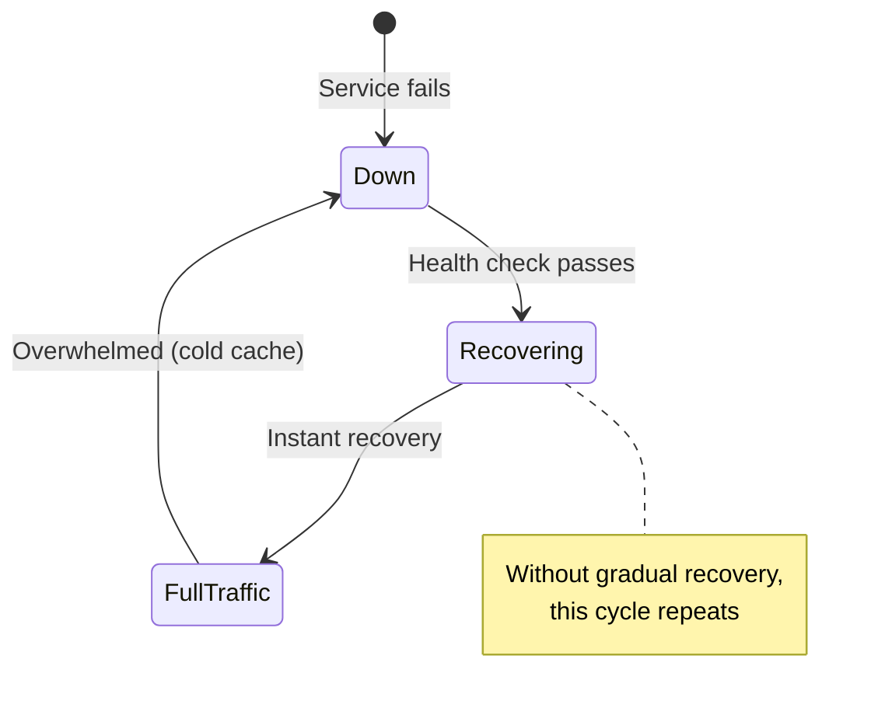
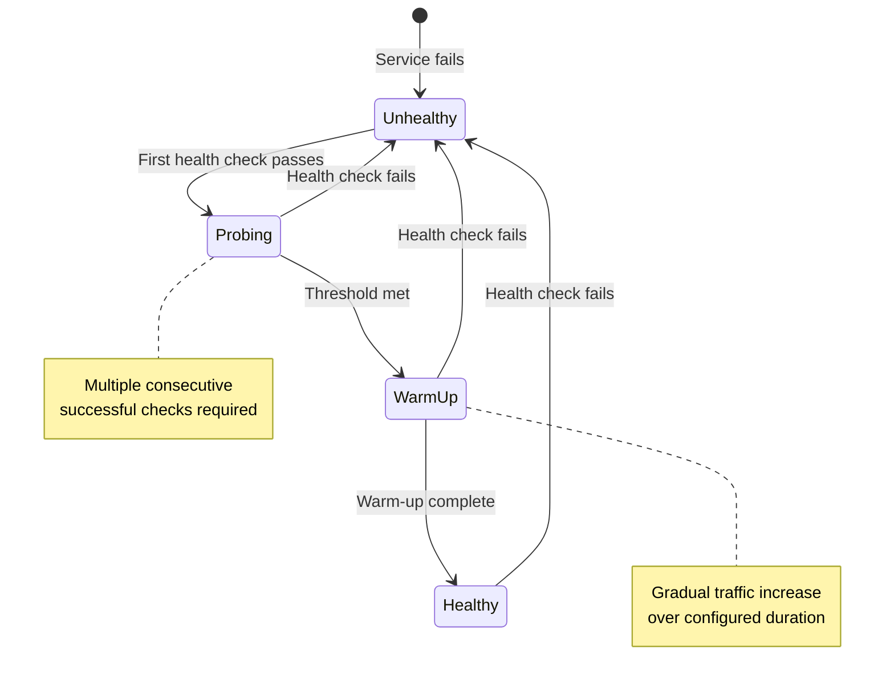
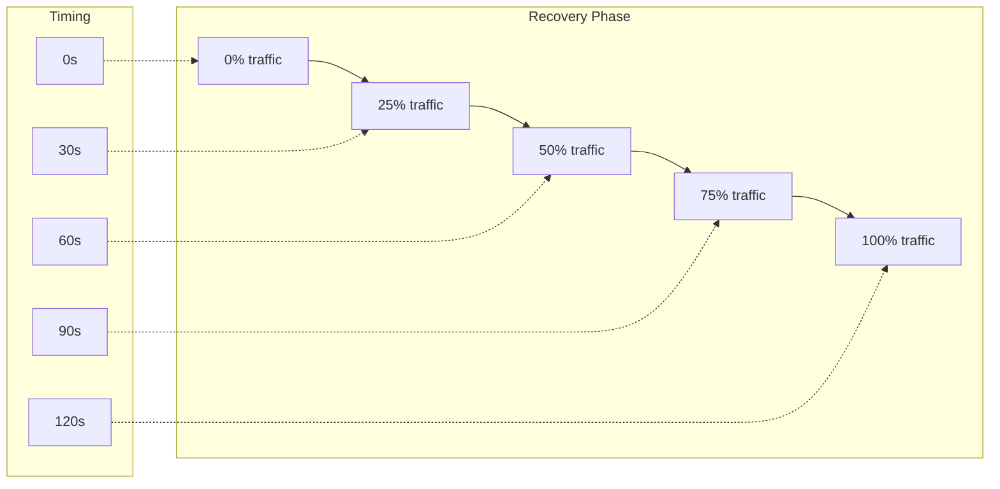
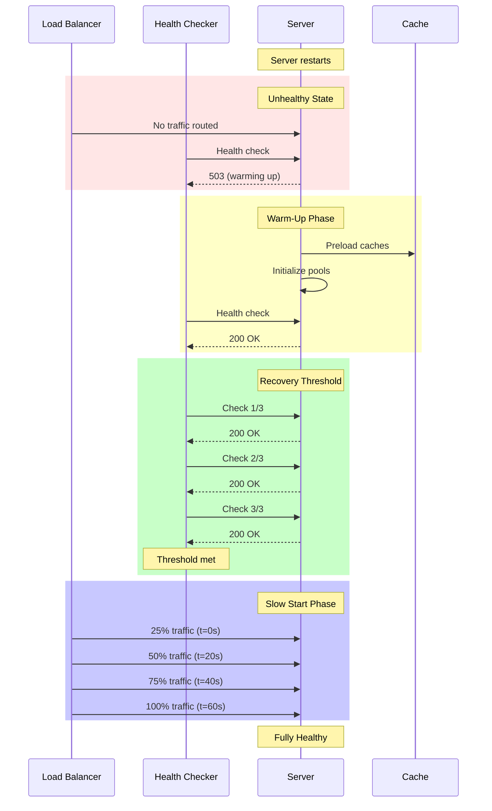

# How to Build Health Check Recovery

Author: [nawazdhandala](https://github.com/nawazdhandala)

Tags: Health Checks, Recovery, Load Balancing, Reliability

Description: Learn to implement health check recovery patterns including recovery thresholds, gradual traffic return, and warm-up periods for reliable services.

---

A server that passes its first health check after being down is not necessarily ready for full traffic. Without proper recovery handling, you risk overwhelming a cold instance with requests, causing it to fail again immediately. This post covers recovery patterns that prevent this cycle.

## The Problem with Instant Recovery

Most load balancers have a simple mental model: healthy or unhealthy. The moment a health check passes, traffic floods in. For many applications this works fine. But some services need time to warm up caches, establish connection pools, or load data into memory.

Consider what happens when your application restarts:

1. Container starts, begins initialization
2. Health endpoint becomes responsive
3. Load balancer immediately sends full traffic share
4. Cold caches cause slow responses
5. Timeouts trigger, load balancer marks unhealthy again
6. Restart loop begins



## Recovery State Machine

A proper recovery system moves through distinct states before considering a service fully healthy.



Each state serves a purpose:

- **Unhealthy**: No traffic routed to this instance
- **Probing**: Verifying the instance is stable, not just momentarily responsive
- **WarmUp**: Gradually increasing traffic while caches populate
- **Healthy**: Full traffic participation

## Recovery Thresholds

A recovery threshold requires multiple consecutive successful health checks before considering an instance recovered. This prevents flapping where a service oscillates between healthy and unhealthy states.

### NGINX Configuration

```nginx
upstream backend {
    zone backend_zone 64k;

    server 10.0.0.1:8080 max_fails=3 fail_timeout=30s;
    server 10.0.0.2:8080 max_fails=3 fail_timeout=30s;
    server 10.0.0.3:8080 max_fails=3 fail_timeout=30s;
}

server {
    location / {
        proxy_pass http://backend;

        # Health check configuration (NGINX Plus)
        health_check interval=5s
                     passes=3        # Recovery threshold: 3 consecutive passes
                     fails=2         # Mark unhealthy after 2 failures
                     uri=/healthz;
    }
}
```

### HAProxy Configuration

HAProxy provides fine-grained control over recovery behavior.

```haproxy
defaults
    mode http
    timeout connect 5s
    timeout client 30s
    timeout server 30s

backend api_servers
    balance roundrobin
    option httpchk GET /healthz

    # Health check timing
    default-server inter 3s fall 2 rise 3

    # inter: Check interval (every 3 seconds)
    # fall: Mark unhealthy after 2 consecutive failures
    # rise: Mark healthy after 3 consecutive successes (recovery threshold)

    server api1 10.0.0.1:8080 check
    server api2 10.0.0.2:8080 check
    server api3 10.0.0.3:8080 check
```

### Kubernetes Readiness Probe

Kubernetes readiness probes control traffic routing to pods. The `successThreshold` parameter sets the recovery threshold.

```yaml
apiVersion: apps/v1
kind: Deployment
metadata:
  name: api-server
spec:
  replicas: 3
  template:
    spec:
      containers:
        - name: api
          image: myregistry/api:v2.0.0
          ports:
            - containerPort: 8080

          readinessProbe:
            httpGet:
              path: /healthz
              port: 8080
            initialDelaySeconds: 5
            periodSeconds: 5
            timeoutSeconds: 3
            failureThreshold: 2      # Remove from service after 2 failures
            successThreshold: 3      # Recovery threshold: 3 consecutive passes
```

With this configuration, a pod must pass three consecutive readiness checks before receiving traffic again.

## Gradual Traffic Return

Recovery thresholds verify stability, but they do not address the cold cache problem. Gradual traffic return solves this by slowly increasing the traffic percentage to a recovering instance.

### Traffic Ramp-Up Pattern



### HAProxy Slow Start

HAProxy supports slow start natively with the `slowstart` parameter.

```haproxy
backend api_servers
    balance roundrobin
    option httpchk GET /healthz

    default-server inter 3s fall 2 rise 3

    # slowstart: Time to ramp from 0 to full weight
    # After recovery, traffic increases linearly over 60 seconds
    server api1 10.0.0.1:8080 check slowstart 60s
    server api2 10.0.0.2:8080 check slowstart 60s
    server api3 10.0.0.3:8080 check slowstart 60s
```

The `slowstart` parameter defines the ramp-up duration. A server recovering from failure starts at near-zero weight and linearly increases to its configured weight over the specified time.

### Envoy Proxy Slow Start

Envoy provides slow start configuration through its cluster settings.

```yaml
clusters:
  - name: api_cluster
    type: STRICT_DNS
    lb_policy: ROUND_ROBIN

    # Slow start configuration
    slow_start_config:
      slow_start_window: 60s       # Ramp-up duration
      aggression:
        default_value: 1.0         # Linear ramp (higher = more aggressive)

    health_checks:
      - timeout: 3s
        interval: 5s
        healthy_threshold: 3       # Recovery threshold
        unhealthy_threshold: 2
        http_health_check:
          path: /healthz

    load_assignment:
      cluster_name: api_cluster
      endpoints:
        - lb_endpoints:
            - endpoint:
                address:
                  socket_address:
                    address: 10.0.0.1
                    port_value: 8080
            - endpoint:
                address:
                  socket_address:
                    address: 10.0.0.2
                    port_value: 8080
```

### Custom Slow Start with Weights

For load balancers without native slow start, implement it using dynamic weight adjustment.

```python
# slow_start_controller.py
import time
import requests
from dataclasses import dataclass
from typing import Dict

@dataclass
class ServerState:
    address: str
    current_weight: int
    target_weight: int
    recovery_start: float | None
    ramp_duration: float

class SlowStartController:
    def __init__(self, haproxy_stats_url: str, ramp_duration: float = 60.0):
        self.haproxy_url = haproxy_stats_url
        self.ramp_duration = ramp_duration
        self.servers: Dict[str, ServerState] = {}

    def on_server_recovered(self, server_name: str, target_weight: int = 100):
        """Called when a server passes its recovery threshold."""
        self.servers[server_name] = ServerState(
            address=server_name,
            current_weight=1,           # Start at minimum weight
            target_weight=target_weight,
            recovery_start=time.time(),
            ramp_duration=self.ramp_duration
        )
        self.set_server_weight(server_name, 1)

    def update_weights(self):
        """Update weights for all recovering servers."""
        current_time = time.time()

        for name, state in list(self.servers.items()):
            if state.recovery_start is None:
                continue

            elapsed = current_time - state.recovery_start

            if elapsed >= state.ramp_duration:
                # Ramp complete
                self.set_server_weight(name, state.target_weight)
                state.recovery_start = None
                state.current_weight = state.target_weight
            else:
                # Calculate proportional weight
                progress = elapsed / state.ramp_duration
                new_weight = max(1, int(state.target_weight * progress))

                if new_weight != state.current_weight:
                    self.set_server_weight(name, new_weight)
                    state.current_weight = new_weight

    def set_server_weight(self, server_name: str, weight: int):
        """Update server weight via HAProxy Runtime API."""
        command = f"set server backend/{server_name} weight {weight}"
        requests.post(
            f"{self.haproxy_url}/runtime",
            data={"command": command}
        )
        print(f"Set {server_name} weight to {weight}")

    def run(self, check_interval: float = 1.0):
        """Main loop to update weights."""
        while True:
            self.update_weights()
            time.sleep(check_interval)
```

## Warm-Up Periods

Some applications need explicit warm-up time regardless of traffic levels. This might involve:

- Preloading reference data into memory
- Establishing database connection pools
- Populating caches with frequently accessed data
- Running JIT compilation warmup

### Application-Side Warm-Up

Build warm-up into your application's startup sequence.

```javascript
// warmup.js - Express application with warmup
const express = require('express');
const app = express();

let isWarmedUp = false;
let isHealthy = false;

async function warmUp() {
    console.log('Starting warm-up sequence...');

    // Step 1: Establish database connections
    await initializeDatabasePool();
    console.log('Database pool initialized');

    // Step 2: Load reference data
    await loadReferenceData();
    console.log('Reference data loaded');

    // Step 3: Warm caches with common queries
    await warmCaches();
    console.log('Caches warmed');

    // Step 4: Make test requests to trigger JIT
    await triggerJITWarmup();
    console.log('JIT warmup complete');

    isWarmedUp = true;
    console.log('Warm-up sequence complete');
}

async function loadReferenceData() {
    const tables = ['products', 'categories', 'regions', 'config'];

    for (const table of tables) {
        const data = await db.query(`SELECT * FROM ${table}`);
        cache.set(`ref:${table}`, data);
    }
}

async function warmCaches() {
    // Fetch most frequently accessed items
    const topItems = await db.query(`
        SELECT item_id FROM access_stats
        ORDER BY access_count DESC
        LIMIT 1000
    `);

    for (const item of topItems) {
        await getItemWithCaching(item.item_id);
    }
}

async function triggerJITWarmup() {
    // Make internal requests to trigger code path compilation
    const warmupEndpoints = [
        '/api/products',
        '/api/categories',
        '/api/search?q=test'
    ];

    for (const endpoint of warmupEndpoints) {
        await fetch(`http://localhost:8080${endpoint}`);
    }
}

// Liveness probe: Is the process running?
app.get('/health/live', (req, res) => {
    res.status(200).json({ status: 'ok' });
});

// Readiness probe: Can we serve traffic?
app.get('/health/ready', (req, res) => {
    if (!isWarmedUp) {
        return res.status(503).json({
            status: 'warming_up',
            message: 'Application is still warming up'
        });
    }

    if (!isHealthy) {
        return res.status(503).json({
            status: 'unhealthy',
            message: 'Dependencies unavailable'
        });
    }

    res.status(200).json({ status: 'ready' });
});

// Startup
async function start() {
    await warmUp();
    isHealthy = true;

    app.listen(8080, () => {
        console.log('Server ready on port 8080');
    });
}

start();
```

### Kubernetes Startup Probe for Warm-Up

Use startup probes to give applications time for warm-up without triggering liveness restarts.

```yaml
apiVersion: apps/v1
kind: Deployment
metadata:
  name: api-server
spec:
  template:
    spec:
      containers:
        - name: api
          image: myregistry/api:v2.0.0

          # Startup probe: Allow time for warm-up
          startupProbe:
            httpGet:
              path: /health/ready
              port: 8080
            initialDelaySeconds: 10
            periodSeconds: 5
            failureThreshold: 60     # 60 * 5s = 5 minutes max warm-up

          # Liveness probe: Only starts after startup succeeds
          livenessProbe:
            httpGet:
              path: /health/live
              port: 8080
            periodSeconds: 10
            failureThreshold: 3

          # Readiness probe: Controls traffic routing
          readinessProbe:
            httpGet:
              path: /health/ready
              port: 8080
            periodSeconds: 5
            failureThreshold: 2
            successThreshold: 3      # Recovery threshold
```

The startup probe allows up to 5 minutes for warm-up. During this time, liveness and readiness probes are suspended.

## Complete Recovery Configuration

Here is a complete example combining all recovery patterns.

### Envoy with Full Recovery Logic

```yaml
# envoy-recovery.yaml
static_resources:
  listeners:
    - name: listener_0
      address:
        socket_address:
          address: 0.0.0.0
          port_value: 8080
      filter_chains:
        - filters:
            - name: envoy.filters.network.http_connection_manager
              typed_config:
                "@type": type.googleapis.com/envoy.extensions.filters.network.http_connection_manager.v3.HttpConnectionManager
                stat_prefix: ingress_http
                route_config:
                  name: local_route
                  virtual_hosts:
                    - name: backend
                      domains: ["*"]
                      routes:
                        - match:
                            prefix: "/"
                          route:
                            cluster: api_cluster
                http_filters:
                  - name: envoy.filters.http.router
                    typed_config:
                      "@type": type.googleapis.com/envoy.extensions.filters.http.router.v3.Router

  clusters:
    - name: api_cluster
      type: STRICT_DNS
      lb_policy: ROUND_ROBIN

      # Circuit breaker to prevent cascading failures
      circuit_breakers:
        thresholds:
          - priority: DEFAULT
            max_connections: 1000
            max_pending_requests: 1000
            max_requests: 1000
            max_retries: 3

      # Slow start: Gradual traffic return
      slow_start_config:
        slow_start_window: 60s
        aggression:
          default_value: 1.0

      # Outlier detection: Remove unhealthy hosts
      outlier_detection:
        consecutive_5xx: 5
        interval: 10s
        base_ejection_time: 30s
        max_ejection_percent: 50
        enforcing_consecutive_5xx: 100

      # Health checks with recovery threshold
      health_checks:
        - timeout: 3s
          interval: 5s
          healthy_threshold: 3     # Recovery threshold
          unhealthy_threshold: 2
          http_health_check:
            path: /health/ready
            expected_statuses:
              - start: 200
                end: 299

      load_assignment:
        cluster_name: api_cluster
        endpoints:
          - lb_endpoints:
              - endpoint:
                  address:
                    socket_address:
                      address: api-server-1
                      port_value: 8080
              - endpoint:
                  address:
                    socket_address:
                      address: api-server-2
                      port_value: 8080
              - endpoint:
                  address:
                    socket_address:
                      address: api-server-3
                      port_value: 8080
```

### Kubernetes Deployment with Recovery

```yaml
apiVersion: apps/v1
kind: Deployment
metadata:
  name: api-server
  namespace: production
spec:
  replicas: 3
  strategy:
    type: RollingUpdate
    rollingUpdate:
      maxUnavailable: 1
      maxSurge: 1
  selector:
    matchLabels:
      app: api-server
  template:
    metadata:
      labels:
        app: api-server
      annotations:
        prometheus.io/scrape: "true"
        prometheus.io/port: "8080"
        prometheus.io/path: "/metrics"
    spec:
      terminationGracePeriodSeconds: 60

      containers:
        - name: api
          image: myregistry/api:v2.0.0
          ports:
            - containerPort: 8080
              name: http

          env:
            - name: WARMUP_ENABLED
              value: "true"
            - name: WARMUP_DURATION_SECONDS
              value: "30"

          # Startup probe for warm-up period
          startupProbe:
            httpGet:
              path: /health/ready
              port: http
            initialDelaySeconds: 5
            periodSeconds: 5
            timeoutSeconds: 3
            failureThreshold: 60    # 5 minute max startup

          # Liveness: Process health only
          livenessProbe:
            httpGet:
              path: /health/live
              port: http
            periodSeconds: 10
            timeoutSeconds: 3
            failureThreshold: 3

          # Readiness: Full dependency check with recovery threshold
          readinessProbe:
            httpGet:
              path: /health/ready
              port: http
            periodSeconds: 5
            timeoutSeconds: 3
            failureThreshold: 2
            successThreshold: 3     # Recovery threshold

          resources:
            requests:
              cpu: 200m
              memory: 512Mi
            limits:
              cpu: 1000m
              memory: 1Gi

---
apiVersion: v1
kind: Service
metadata:
  name: api-server
  namespace: production
spec:
  selector:
    app: api-server
  ports:
    - port: 80
      targetPort: http
      protocol: TCP
```

## Recovery Flow Visualization

The complete recovery flow combines all patterns into a coherent system.



## Metrics and Monitoring

Track recovery behavior to tune your configuration.

```promql
# Recovery events per service
increase(health_check_recovery_total{service="api"}[1h])

# Average recovery duration (warm-up + threshold)
histogram_quantile(0.95,
    rate(recovery_duration_seconds_bucket{service="api"}[5m])
)

# Traffic ramp progress
server_weight_ratio{backend="api", server=~"api-.*"}

# Failed recoveries (passed threshold then failed again within 5 min)
increase(recovery_failures_total{service="api"}[1h])
```

Set alerts for recovery anomalies:

```yaml
groups:
  - name: recovery_alerts
    rules:
      - alert: FrequentRecovery
        expr: increase(health_check_recovery_total[1h]) > 10
        for: 5m
        labels:
          severity: warning
        annotations:
          summary: "Service {{ $labels.service }} recovering too frequently"
          description: "More than 10 recoveries in the past hour indicates instability"

      - alert: SlowRecovery
        expr: histogram_quantile(0.95, rate(recovery_duration_seconds_bucket[5m])) > 120
        for: 5m
        labels:
          severity: warning
        annotations:
          summary: "Service {{ $labels.service }} taking too long to recover"
          description: "95th percentile recovery time exceeds 2 minutes"
```

## Best Practices

1. **Set recovery thresholds based on check interval**: If your health check runs every 5 seconds, a threshold of 3 means 15 seconds of stability verification.

2. **Match slow start duration to warm-up time**: Measure how long your caches take to warm and set the slow start window accordingly.

3. **Separate liveness from readiness**: Liveness should only check if the process is alive. Readiness should check if the service can handle traffic, including warm-up status.

4. **Monitor recovery metrics**: Track how often services recover, how long it takes, and whether recoveries are stable.

5. **Test recovery under load**: Simulate failures during peak traffic to verify your recovery configuration works under real conditions.

6. **Document expected warm-up time**: Make it clear in runbooks how long a service needs to warm up so operators know what to expect.

## Conclusion

Health check recovery is more than just passing a probe. A well-designed recovery system uses multiple layers of protection: recovery thresholds to verify stability, gradual traffic return to prevent overwhelming cold instances, and explicit warm-up periods to prepare the application before receiving load.

Start by adding recovery thresholds to your existing health checks. Once that is stable, add slow start to your load balancer. Finally, build warm-up into your application startup. Each layer adds resilience and reduces the chance of recovery-triggered failures.

**Related Reading:**

- [How to Add Liveness, Readiness, and Startup Probes So Kubernetes Auto-Heals Your Apps](https://oneuptime.com/blog/post/2025-11-27-probes-auto-healing/view)
- [How to Build Self-Healing Systems](https://oneuptime.com/blog/post/2026-01-30-self-healing-systems/view)
- [How to Implement Health Checks and Readiness Probes in Node.js for Kubernetes](https://oneuptime.com/blog/post/2026-01-06-nodejs-health-checks-kubernetes/view)
