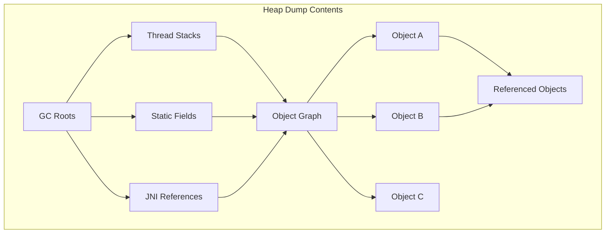
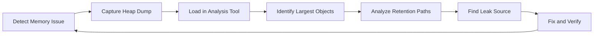
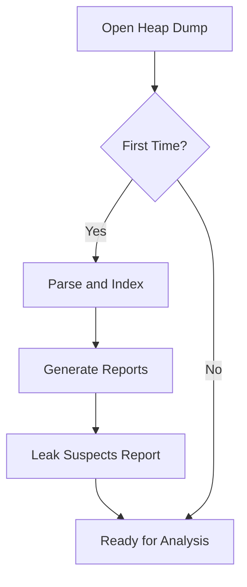
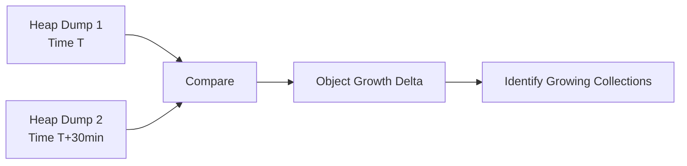
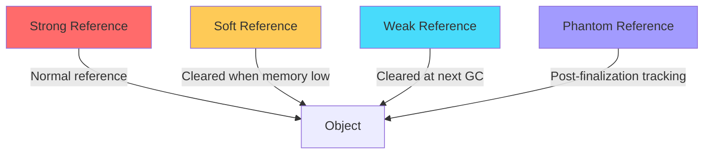
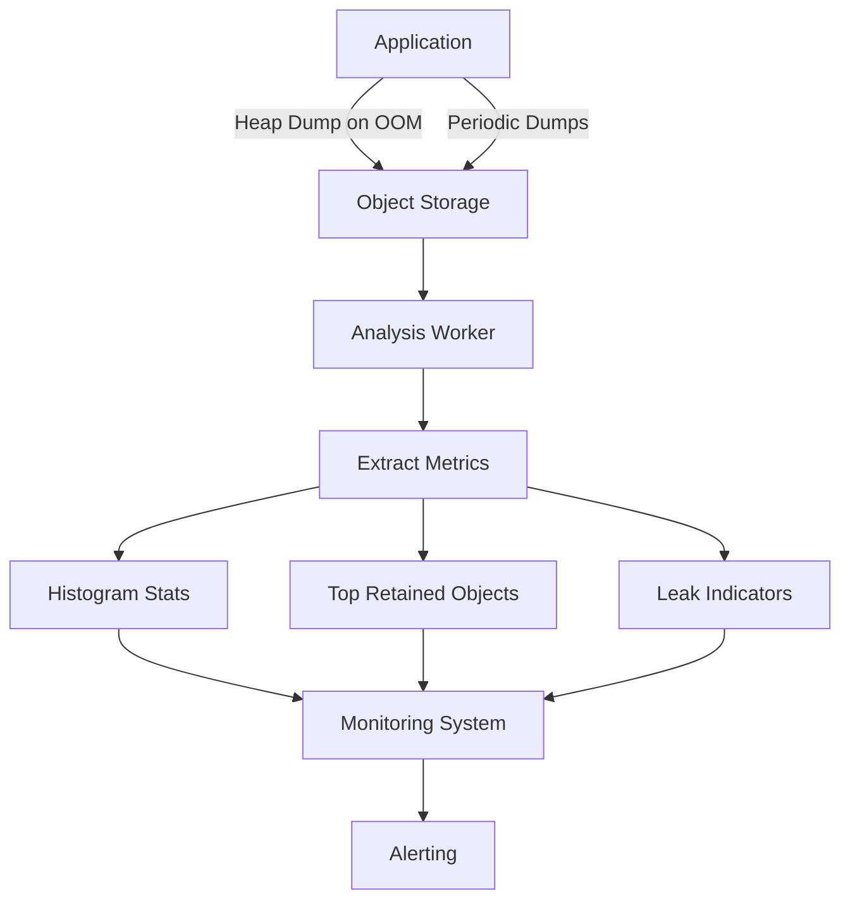

# How to Build Heap Dump Analysis

Author: [nawazdhandala](https://github.com/nawazdhandala)

Tags: Performance, Memory, JVM, Debugging

Description: A practical guide to capturing heap dumps, analyzing memory leaks, and understanding object retention in Java applications.

---

When your Java application starts consuming more memory than expected, or worse, crashes with an OutOfMemoryError, heap dump analysis becomes your primary diagnostic tool. A heap dump is a snapshot of all objects in the JVM heap at a specific point in time. This guide covers how to capture heap dumps, analyze them effectively, and find memory leaks using tools like jmap, Eclipse MAT, and VisualVM.

## What Is a Heap Dump?

A heap dump contains:

- All objects currently in the heap
- Class information for each object
- References between objects (the object graph)
- Root references (GC roots)
- Thread stack traces



| Content Type | Description | Why It Matters |
|--------------|-------------|----------------|
| **Objects** | All live objects with field values | Shows what consumes memory |
| **Classes** | Class metadata and static fields | Identifies types causing issues |
| **References** | Links between objects | Reveals retention chains |
| **GC Roots** | Entry points for garbage collector | Shows why objects are retained |

## Heap Dump Analysis Workflow

Before diving into tools, understand the typical workflow for analyzing memory issues:



The key steps are:

1. **Detect**: Notice memory growth through monitoring or OOM errors
2. **Capture**: Take heap dump at the right moment
3. **Analyze**: Find objects consuming most memory
4. **Trace**: Follow retention paths to understand why objects stay in memory
5. **Fix**: Address the root cause in code
6. **Verify**: Confirm the fix resolves the issue

## Capturing Heap Dumps with jmap

The `jmap` tool ships with the JDK and is the most direct way to capture heap dumps.

### Basic Heap Dump

```bash
# Find the Java process ID
jps -l

# Output:
# 12345 com.example.MyApplication
# 12346 jdk.jcmd/sun.tools.jps.Jps

# Capture heap dump
jmap -dump:format=b,file=heapdump.hprof 12345
```

### Heap Dump Options

```bash
# Dump only live objects (forces full GC first)
jmap -dump:live,format=b,file=heapdump_live.hprof 12345

# Dump all objects including unreachable ones
jmap -dump:format=b,file=heapdump_all.hprof 12345
```

| Option | Effect | When to Use |
|--------|--------|-------------|
| `live` | Triggers GC, dumps only reachable objects | Analyzing memory leaks |
| No `live` | Dumps all objects including garbage | Analyzing allocation patterns |
| `format=b` | Binary format (standard hprof) | Always use this for analysis tools |

### Automatic Heap Dump on OOM

Configure the JVM to automatically capture a heap dump when OutOfMemoryError occurs:

```bash
java -XX:+HeapDumpOnOutOfMemoryError \
     -XX:HeapDumpPath=/var/log/heapdumps/ \
     -XX:OnOutOfMemoryError="kill -9 %p" \
     -jar myapp.jar
```

This is critical for production. Memory issues often occur at unpredictable times, and having an automatic dump ensures you capture the state when it matters.

### Using jcmd (Preferred for Modern JVMs)

The `jcmd` tool is more versatile and safer than jmap:

```bash
# List available commands
jcmd 12345 help

# Capture heap dump
jcmd 12345 GC.heap_dump /path/to/heapdump.hprof

# Capture with live objects only
jcmd 12345 GC.heap_dump -all=false /path/to/heapdump.hprof

# Get heap histogram without full dump
jcmd 12345 GC.class_histogram
```

## Analyzing Heap Dumps with Eclipse MAT

Eclipse Memory Analyzer (MAT) is the industry standard for heap dump analysis. It can handle multi-gigabyte heap dumps and provides powerful querying capabilities.

### Installation and Setup

Download MAT from the Eclipse website or install via your package manager. For large heaps, increase MAT's own memory:

```bash
# Edit MemoryAnalyzer.ini
-vmargs
-Xmx8g
```

### Loading a Heap Dump



When you open a heap dump, MAT creates index files that speed up subsequent analysis. For a 4GB heap, initial parsing might take 10-15 minutes.

### Key MAT Views

**Histogram View**: Shows all classes sorted by memory usage.

```
Class Name                           | Objects | Shallow Heap | Retained Heap
------------------------------------|---------|--------------|---------------
byte[]                              | 125,432 | 524,288,000  | 524,288,000
char[]                              | 89,234  | 178,468,000  | 178,468,000
java.lang.String                    | 89,234  | 2,141,616    | 180,609,616
com.example.CachedEntity            | 50,000  | 1,600,000    | 312,000,000
java.util.HashMap$Node              | 200,432 | 6,413,824    | 45,234,112
```

**Dominator Tree**: Shows objects that "dominate" retained memory. If object A is the only path through which object B is reachable, A dominates B.

```
Object                              | Shallow Heap | Retained Heap | Percentage
------------------------------------|--------------|---------------|------------
com.example.CacheManager            | 32           | 312,000,000   | 45.2%
  com.example.CachedEntity[50000]   | 1,600,000    | 310,400,000   | 45.0%
java.util.concurrent.Executor       | 64           | 89,000,000    | 12.9%
  java.lang.Thread[200]             | 16,000       | 88,984,000    | 12.9%
```

### Finding Memory Leaks with MAT

**Step 1: Run Leak Suspects Report**

MAT automatically identifies suspicious objects. The report shows objects that hold unusually large amounts of memory.

**Step 2: Analyze Retention Paths**

Right-click on a suspect object and select "Path to GC Roots > exclude weak/soft references":

```
com.example.CachedEntity @0x7f3a4b2c1000
  <- elementData[] @0x7f3a4b2c0f00 (array element)
    <- java.util.ArrayList @0x7f3a4b2c0e00 (field)
      <- cache (field) in com.example.CacheManager @0x7f3a4b2c0d00
        <- instance (static field) in com.example.CacheManager
          <- <Java Local> in Thread "main"
```

This path shows exactly why the object is retained. In this case, a static CacheManager holds a list that never gets cleared.

**Step 3: OQL Queries**

Object Query Language lets you search for specific patterns:

```sql
-- Find all strings longer than 10000 characters
SELECT s FROM java.lang.String s WHERE s.value.length > 10000

-- Find duplicate strings (memory waste)
SELECT toString(s), count(s) AS cnt
FROM java.lang.String s
GROUP BY toString(s)
HAVING cnt > 100

-- Find objects with specific field values
SELECT c FROM com.example.CachedEntity c
WHERE c.lastAccessTime < 1706500000000

-- Find all instances holding references to a class
SELECT * FROM INSTANCEOF com.example.ExpensiveResource
```

### Comparing Heap Dumps

To find memory leaks, compare two heap dumps taken at different times:



In MAT, use "Compare Tables" feature:

1. Open both heap dumps
2. Generate histograms for each
3. Use "Compare Tables" to see class count differences

```
Class Name                    | Dump 1 Objects | Dump 2 Objects | Delta
------------------------------|----------------|----------------|--------
com.example.SessionData       | 1,000          | 15,000         | +14,000
java.util.HashMap$Node        | 50,000         | 750,000        | +700,000
byte[]                        | 100,000        | 1,500,000      | +1,400,000
```

A growing count over time with no corresponding reduction indicates a leak.

## Analyzing Heap Dumps with VisualVM

VisualVM provides a more visual and interactive approach to heap analysis. It's particularly good for live monitoring combined with heap dump analysis.

### Starting VisualVM

```bash
# VisualVM is bundled with JDK or download separately
jvisualvm

# Or for standalone version
visualvm
```

### Capturing Heap Dumps in VisualVM

1. Connect to a running application (local or remote)
2. Go to the "Monitor" tab
3. Click "Heap Dump" button

For remote applications, start them with JMX enabled:

```bash
java -Dcom.sun.management.jmxremote \
     -Dcom.sun.management.jmxremote.port=9010 \
     -Dcom.sun.management.jmxremote.authenticate=false \
     -Dcom.sun.management.jmxremote.ssl=false \
     -jar myapp.jar
```

### VisualVM Heap Analysis Features

**Summary View**: Quick overview of heap contents.

```
Heap Size: 4,096 MB
Used: 3,245 MB
Classes: 12,456
Instances: 45,234,112
```

**Classes View**: Similar to MAT's histogram.

**Instances View**: Browse individual instances of a class.

**OQL Console**: Query heap contents with Object Query Language.

```javascript
// Find all strings containing 'password'
select s from java.lang.String s where s.toString().contains("password")

// Find hashmaps with more than 10000 entries
select m from java.util.HashMap m where m.size > 10000

// Find threads in BLOCKED state
select t from java.lang.Thread t where t.threadStatus == 1
```

### Comparing with VisualVM

VisualVM can compare heap dumps using the comparison feature:

1. Load two heap dumps
2. Right-click one and select "Compare with another heap dump"
3. View class and instance count differences

## Object Retention Analysis

Understanding why objects stay in memory is the core of leak detection.

### Types of References



| Reference Type | GC Behavior | Common Use Case |
|----------------|-------------|-----------------|
| **Strong** | Never collected while referenced | Normal object relationships |
| **Soft** | Collected when memory is low | Memory-sensitive caches |
| **Weak** | Collected at next GC | Canonicalizing mappings |
| **Phantom** | Enqueued after finalization | Resource cleanup tracking |

When analyzing leaks, focus on strong references. Soft and weak references are usually not the source of leaks.

### Common Retention Patterns

**Pattern 1: Static Collections**

```java
// LEAK: Static collection grows forever
public class EventHistory {
    private static final List<Event> history = new ArrayList<>();

    public void recordEvent(Event e) {
        history.add(e);  // Never removed
    }
}
```

In heap dump: Look for static fields holding large collections.

**Pattern 2: Listener Leaks**

```java
// LEAK: Listeners never unregistered
public class DataConsumer {
    public DataConsumer(EventSource source) {
        source.addListener(this::onEvent);
        // No removeListener call in cleanup
    }
}
```

In heap dump: Find objects retained only through listener/callback references.

**Pattern 3: ThreadLocal Leaks**

```java
// LEAK: ThreadLocal not cleaned up in thread pools
public class RequestContext {
    private static final ThreadLocal<UserSession> context = new ThreadLocal<>();

    public static void set(UserSession session) {
        context.set(session);
    }

    // Missing: context.remove() after request completes
}
```

In heap dump: Look for ThreadLocalMap entries in thread objects.

**Pattern 4: Classloader Leaks**

```java
// LEAK: Classes holding references prevent classloader collection
public class PluginManager {
    private static final Map<String, Plugin> plugins = new HashMap<>();

    // When plugin is "unloaded", its classloader cannot be GC'd
    // if any static reference remains to plugin classes
}
```

In heap dump: Multiple classloaders with duplicate class definitions.

## Building an Analysis Pipeline

For production systems, build an automated pipeline:



### Automated Heap Dump Collection

```bash
#!/bin/bash
# collect_heapdump.sh

APP_PID=$1
DUMP_DIR="/var/heapdumps"
TIMESTAMP=$(date +%Y%m%d_%H%M%S)
FILENAME="${DUMP_DIR}/heap_${TIMESTAMP}.hprof"

# Check disk space before dump
AVAILABLE=$(df -P ${DUMP_DIR} | awk 'NR==2 {print $4}')
HEAP_SIZE=$(jcmd ${APP_PID} GC.heap_info | grep "used" | awk '{print $3}')

if [ ${AVAILABLE} -lt ${HEAP_SIZE} ]; then
    echo "Insufficient disk space for heap dump"
    exit 1
fi

# Capture dump
jcmd ${APP_PID} GC.heap_dump ${FILENAME}

# Compress older dumps
find ${DUMP_DIR} -name "*.hprof" -mtime +1 -exec gzip {} \;

# Clean up old dumps
find ${DUMP_DIR} -name "*.hprof.gz" -mtime +7 -delete

echo "Heap dump saved to ${FILENAME}"
```

### Extracting Metrics with MAT API

```java
import org.eclipse.mat.parser.internal.SnapshotFactory;
import org.eclipse.mat.snapshot.ISnapshot;
import org.eclipse.mat.snapshot.model.IClass;

public class HeapAnalyzer {

    public Map<String, Long> getClassHistogram(String heapDumpPath)
            throws Exception {
        ISnapshot snapshot = SnapshotFactory.openSnapshot(
            new File(heapDumpPath),
            new VoidProgressListener()
        );

        Map<String, Long> histogram = new HashMap<>();

        for (IClass clazz : snapshot.getClasses()) {
            long retainedHeap = snapshot.getRetainedHeapSize(
                clazz.getObjectId()
            );
            histogram.put(clazz.getName(), retainedHeap);
        }

        snapshot.dispose();
        return histogram;
    }

    public List<String> findSuspects(String heapDumpPath) throws Exception {
        // Use MAT's leak detector API
        ISnapshot snapshot = SnapshotFactory.openSnapshot(
            new File(heapDumpPath),
            new VoidProgressListener()
        );

        LeakHunterQuery query = new LeakHunterQuery();
        IResult result = query.execute(snapshot,
            new VoidProgressListener());

        List<String> suspects = new ArrayList<>();
        // Extract suspect descriptions from result

        snapshot.dispose();
        return suspects;
    }
}
```

## Performance Considerations

Heap dump analysis can be resource intensive. Keep these factors in mind:

| Factor | Impact | Mitigation |
|--------|--------|------------|
| **Dump Size** | Large heaps = large files (1:1 ratio) | Compress old dumps, use live-only dumps |
| **Capture Time** | Application paused during dump | Schedule during low traffic |
| **Analysis Memory** | MAT needs 1-1.5x heap size | Use dedicated analysis machine |
| **Parsing Time** | First load builds indexes | Keep index files for repeated analysis |

### Tips for Large Heaps

1. **Use jcmd over jmap**: More reliable for large heaps
2. **Capture live objects only**: Reduces dump size significantly
3. **Allocate enough memory to MAT**: Set -Xmx to at least heap size
4. **Use SSD storage**: Parsing is I/O intensive
5. **Consider sampling**: For very large heaps, sample instead of full analysis

## Summary

Effective heap dump analysis requires:

| Step | Tool | Key Action |
|------|------|------------|
| **Capture** | jmap/jcmd | Configure automatic dumps on OOM |
| **Initial Analysis** | Eclipse MAT | Run leak suspects report |
| **Deep Dive** | MAT/VisualVM | Trace retention paths |
| **Comparison** | MAT | Compare dumps over time |
| **Automation** | Custom scripts | Build analysis pipeline |

Memory leaks are inevitable in long-running applications. The difference between a minor annoyance and a production outage is having the tools and knowledge to diagnose them quickly. Set up heap dump collection before you need it, practice with the analysis tools, and build automation to surface issues before they become incidents.

**Related Reading:**
- [Basics of Profiling: Turning CPU and Memory Hotspots into Action](https://oneuptime.com/blog/post/2025-09-09-basics-of-profiling/view)
- [How to Optimize Node.js Memory Usage and Prevent Memory Leaks](https://oneuptime.com/blog/post/2026-01-06-nodejs-memory-optimization-prevent-leaks/view)
- [The Three Pillars of Observability: Logs, Metrics, and Traces](https://oneuptime.com/blog/post/2025-08-20-three-pillars-of-observability-logs-metrics-traces/view)

---

*Want visibility into your application's memory behavior before issues hit production? Send your metrics and traces to OneUptime and correlate memory trends with application performance.*
