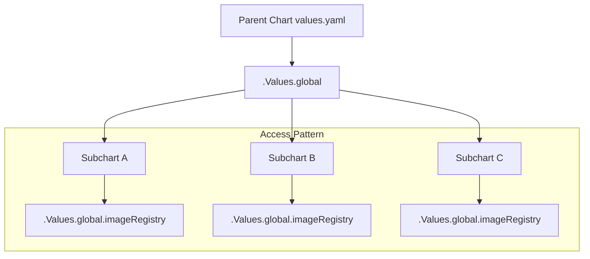
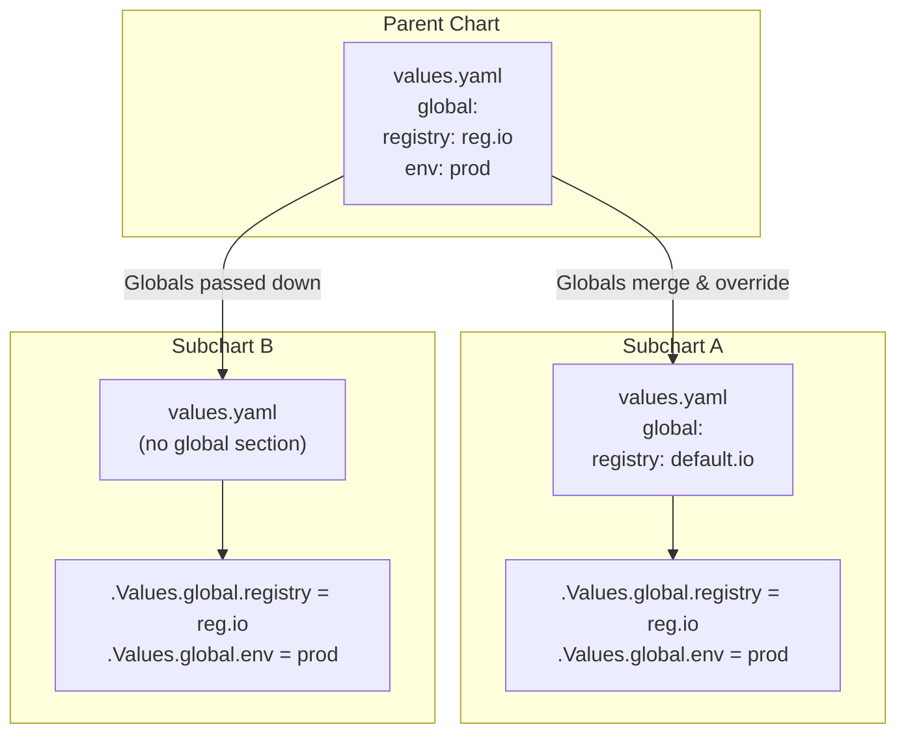
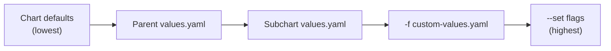
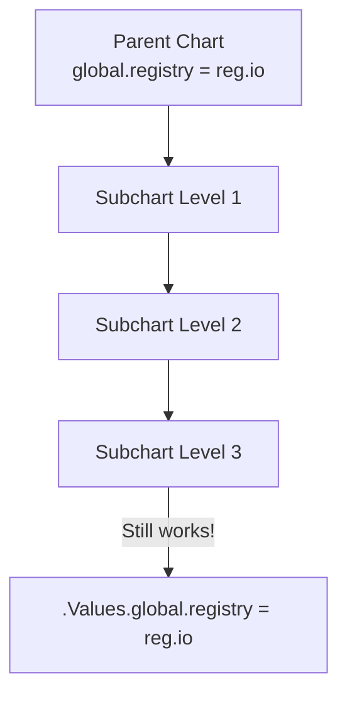

# How to Create Helm Global Values

Author: [nawazdhandala](https://github.com/nawazdhandala)

Tags: Helm, Kubernetes, Values, Configuration

Description: Learn how to define and use global values in Helm charts to share configuration across parent charts and subcharts.

---

Helm global values let you define configuration once and share it across your entire chart hierarchy. Instead of repeating the same values in every subchart, you define them at the top level and access them anywhere with `.Values.global`. This keeps your charts DRY and makes multi-service deployments easier to manage.

## What Are Global Values?

Global values are a special section in your `values.yaml` that Helm automatically passes down to all subcharts. Unlike regular values that stay scoped to their chart, globals flow through the entire dependency tree.



The key difference between regular values and global values:

| Value Type | Scope | Access Pattern | Inheritance |
| --- | --- | --- | --- |
| Regular | Current chart only | `.Values.myValue` | Must be explicitly passed |
| Global | All charts and subcharts | `.Values.global.myValue` | Automatic |

## Defining Global Values

Create a `global` section at the root of your `values.yaml`:

```yaml
# values.yaml
global:
  imageRegistry: registry.example.com
  imagePullSecrets:
    - name: registry-credentials
  storageClass: fast-ssd
  environment: production
  domain: app.example.com

# Chart-specific values
replicaCount: 3
image:
  repository: myapp
  tag: v1.2.0
```

## Using Global Values in Templates

Access global values with `.Values.global` in any template:

```yaml
# templates/deployment.yaml
apiVersion: apps/v1
kind: Deployment
metadata:
  name: {{ .Release.Name }}
spec:
  replicas: {{ .Values.replicaCount }}
  template:
    spec:
      {{- with .Values.global.imagePullSecrets }}
      imagePullSecrets:
        {{- toYaml . | nindent 8 }}
      {{- end }}
      containers:
        - name: {{ .Chart.Name }}
          image: "{{ .Values.global.imageRegistry }}/{{ .Values.image.repository }}:{{ .Values.image.tag }}"
```

This deployment pulls from `registry.example.com/myapp:v1.2.0` because it combines the global registry with local image settings.

## Global Values in Subcharts

The real power of globals shows when you have subcharts. Here is a typical umbrella chart structure:

```
my-platform/
├── Chart.yaml
├── values.yaml
├── charts/
│   ├── api-service/
│   │   ├── Chart.yaml
│   │   ├── values.yaml
│   │   └── templates/
│   │       └── deployment.yaml
│   ├── worker-service/
│   │   ├── Chart.yaml
│   │   ├── values.yaml
│   │   └── templates/
│   │       └── deployment.yaml
│   └── frontend/
│       ├── Chart.yaml
│       ├── values.yaml
│       └── templates/
│           └── deployment.yaml
└── templates/
```

### Parent Chart Values

```yaml
# my-platform/values.yaml
global:
  imageRegistry: registry.example.com
  imagePullSecrets:
    - name: registry-credentials
  environment: production
  postgresql:
    host: postgres.database.svc
    port: 5432
    database: platform_db
  redis:
    host: redis.cache.svc
    port: 6379

api-service:
  replicaCount: 3
  resources:
    limits:
      memory: 512Mi

worker-service:
  replicaCount: 2
  resources:
    limits:
      memory: 1Gi

frontend:
  replicaCount: 2
```

### Subchart Template Using Globals

```yaml
# charts/api-service/templates/deployment.yaml
apiVersion: apps/v1
kind: Deployment
metadata:
  name: {{ include "api-service.fullname" . }}
spec:
  replicas: {{ .Values.replicaCount }}
  template:
    spec:
      {{- with .Values.global.imagePullSecrets }}
      imagePullSecrets:
        {{- toYaml . | nindent 8 }}
      {{- end }}
      containers:
        - name: api
          image: "{{ .Values.global.imageRegistry }}/api-service:{{ .Chart.AppVersion }}"
          env:
            - name: ENVIRONMENT
              value: {{ .Values.global.environment | quote }}
            - name: DATABASE_HOST
              value: {{ .Values.global.postgresql.host | quote }}
            - name: DATABASE_PORT
              value: {{ .Values.global.postgresql.port | quote }}
            - name: DATABASE_NAME
              value: {{ .Values.global.postgresql.database | quote }}
            - name: REDIS_HOST
              value: {{ .Values.global.redis.host | quote }}
            - name: REDIS_PORT
              value: {{ .Values.global.redis.port | quote }}
```

The subchart accesses `global.postgresql` and `global.redis` without needing these values defined in its own `values.yaml`.

## How Value Inheritance Works



Helm merges global values following these rules:

1. Parent chart globals override subchart globals
2. Subcharts can define default globals that get overwritten
3. Values set via `--set global.key=value` override everything

## Overriding Global Values

### From Command Line

```bash
helm install my-release ./my-platform \
  --set global.imageRegistry=staging-registry.example.com \
  --set global.environment=staging
```

### From a Values File

```yaml
# staging-values.yaml
global:
  imageRegistry: staging-registry.example.com
  environment: staging
  postgresql:
    host: staging-postgres.database.svc
```

```bash
helm install my-release ./my-platform -f staging-values.yaml
```

### Override Priority



## Common Global Value Patterns

### Pattern 1: Shared Image Configuration

```yaml
global:
  imageRegistry: registry.example.com
  imagePullPolicy: IfNotPresent
  imagePullSecrets:
    - name: regcred
```

Template usage:

```yaml
image: "{{ .Values.global.imageRegistry }}/{{ .Values.image.repository }}:{{ .Values.image.tag }}"
imagePullPolicy: {{ .Values.global.imagePullPolicy }}
```

### Pattern 2: Database Connection Sharing

```yaml
global:
  postgresql:
    host: postgres.database.svc
    port: 5432
    auth:
      username: app_user
      existingSecret: postgres-credentials
      secretKeys:
        passwordKey: password
```

Template usage:

```yaml
env:
  - name: DB_HOST
    value: {{ .Values.global.postgresql.host | quote }}
  - name: DB_PORT
    value: {{ .Values.global.postgresql.port | quote }}
  - name: DB_USER
    value: {{ .Values.global.postgresql.auth.username | quote }}
  - name: DB_PASSWORD
    valueFrom:
      secretKeyRef:
        name: {{ .Values.global.postgresql.auth.existingSecret }}
        key: {{ .Values.global.postgresql.auth.secretKeys.passwordKey }}
```

### Pattern 3: Environment-Specific Labels and Annotations

```yaml
global:
  environment: production
  team: platform
  costCenter: engineering
  commonLabels:
    app.kubernetes.io/managed-by: helm
    app.kubernetes.io/part-of: my-platform
  commonAnnotations:
    prometheus.io/scrape: "true"
```

Template helper:

```yaml
# templates/_helpers.tpl
{{- define "common.labels" -}}
{{- with .Values.global.commonLabels }}
{{- toYaml . }}
{{- end }}
environment: {{ .Values.global.environment }}
team: {{ .Values.global.team }}
{{- end -}}
```

### Pattern 4: Service Discovery

```yaml
global:
  serviceMesh:
    enabled: true
    provider: istio
  services:
    api:
      name: api-service
      port: 8080
    worker:
      name: worker-service
      port: 8081
    frontend:
      name: frontend
      port: 3000
```

Cross-service communication:

```yaml
env:
  - name: API_URL
    value: "http://{{ .Values.global.services.api.name }}:{{ .Values.global.services.api.port }}"
```

### Pattern 5: TLS and Security Settings

```yaml
global:
  tls:
    enabled: true
    secretName: platform-tls
    issuer: letsencrypt-prod
  networkPolicy:
    enabled: true
  podSecurityContext:
    runAsNonRoot: true
    runAsUser: 1000
    fsGroup: 1000
```

## Subchart Default Values

Subcharts can define their own global defaults that get overridden by parent charts:

```yaml
# charts/api-service/values.yaml
global:
  imageRegistry: docker.io
  environment: development

replicaCount: 1
```

When installed standalone:
```bash
helm install api ./charts/api-service
# Uses docker.io and development
```

When installed as part of parent:
```bash
helm install platform ./my-platform
# Uses registry.example.com and production from parent
```

## Accessing Globals in Nested Subcharts

Global values pass through multiple levels of nesting:



No matter how deep your chart hierarchy goes, `.Values.global` remains accessible.

## Conditional Logic with Globals

Use globals to enable or disable features across all subcharts:

```yaml
# values.yaml
global:
  monitoring:
    enabled: true
    serviceMonitor: true
  tracing:
    enabled: true
    endpoint: http://jaeger-collector:14268/api/traces
```

Template conditional:

```yaml
# templates/servicemonitor.yaml
{{- if and .Values.global.monitoring.enabled .Values.global.monitoring.serviceMonitor }}
apiVersion: monitoring.coreos.com/v1
kind: ServiceMonitor
metadata:
  name: {{ include "myapp.fullname" . }}
spec:
  selector:
    matchLabels:
      {{- include "myapp.selectorLabels" . | nindent 6 }}
  endpoints:
    - port: http
      path: /metrics
{{- end }}
```

## Validating Global Values

Add schema validation for your globals:

```yaml
# values.schema.json
{
  "$schema": "https://json-schema.org/draft-07/schema#",
  "type": "object",
  "properties": {
    "global": {
      "type": "object",
      "properties": {
        "imageRegistry": {
          "type": "string",
          "pattern": "^[a-z0-9.-]+$"
        },
        "environment": {
          "type": "string",
          "enum": ["development", "staging", "production"]
        }
      },
      "required": ["imageRegistry", "environment"]
    }
  }
}
```

Helm validates values against this schema during `helm install` and `helm upgrade`.

## Debugging Global Values

Check what global values Helm sees:

```bash
# Render templates with debug output
helm template my-release ./my-platform --debug

# Show computed values
helm get values my-release

# Show all values including defaults
helm get values my-release --all
```

Test global value access in templates:

```yaml
# Add temporarily to debug
apiVersion: v1
kind: ConfigMap
metadata:
  name: debug-globals
data:
  globals: |
    {{- .Values.global | toYaml | nindent 4 }}
```

## Best Practices

1. **Keep globals minimal.** Only put values that genuinely need sharing. Too many globals create tight coupling between charts.

2. **Use sensible defaults.** Subcharts should work standalone with their own default globals.

3. **Document your globals.** Add comments in `values.yaml` explaining what each global controls.

4. **Namespace your globals.** Group related settings under meaningful keys like `global.postgresql` rather than flat `global.dbHost`.

5. **Avoid secrets in globals.** Reference secret names, not actual credentials. Use `existingSecret` patterns.

6. **Version your global schema.** When globals change, update your chart version and document breaking changes.

---

Global values simplify multi-chart deployments by eliminating repetition. Start with image registry and pull secrets, then expand to database connections and feature flags as your platform grows. The investment in proper global value structure pays off every time you add a new service to your umbrella chart.
