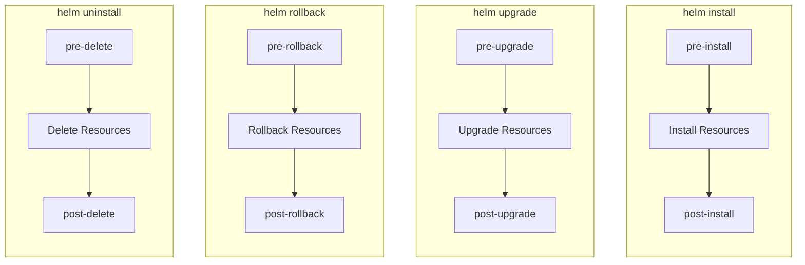
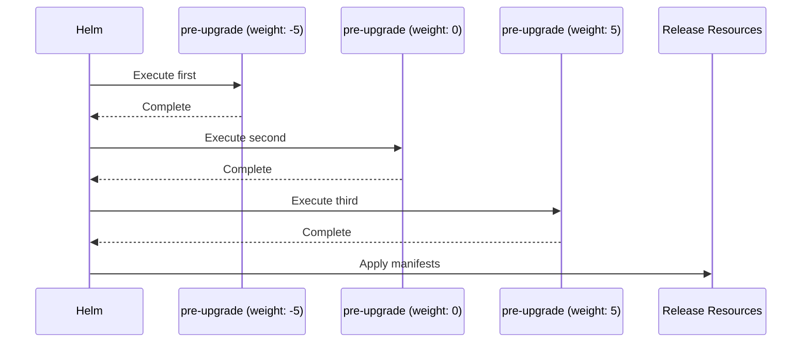
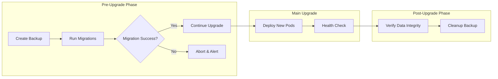
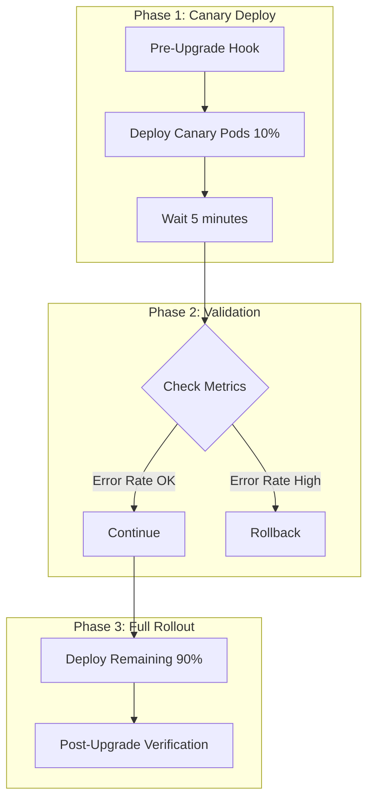
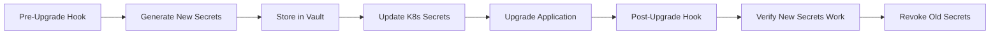
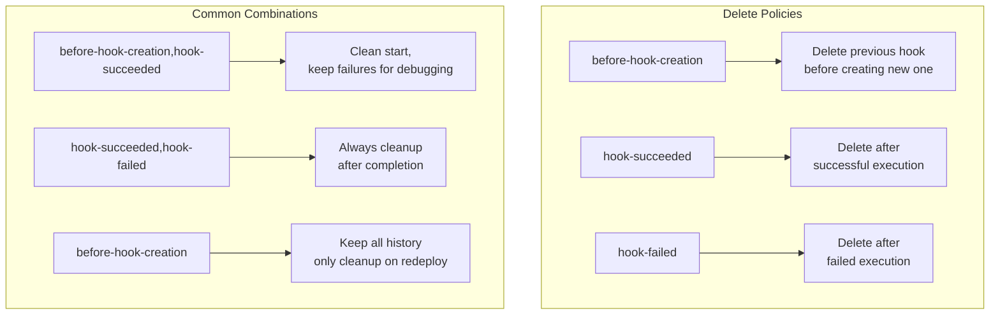

# How to Build Helm Hooks Advanced

Author: [nawazdhandala](https://github.com/nawazdhandala)

Tags: Helm, Kubernetes, Hooks, Lifecycle

Description: A comprehensive guide to mastering Helm hooks for advanced deployment scenarios, including database migrations, backup strategies, canary deployments, and troubleshooting techniques.

---

Helm hooks give you precise control over your Kubernetes deployments by letting you execute actions at specific points in a release lifecycle. While basic hooks are straightforward, advanced patterns unlock powerful automation capabilities that can transform your deployment workflows.

## Understanding Helm Hook Lifecycle

Before diving into advanced patterns, let's visualize when hooks execute during the Helm lifecycle:



### Hook Types and Their Purposes

| Hook | Timing | Common Use Cases |
|------|--------|------------------|
| `pre-install` | Before any release resources are installed | Database setup, namespace preparation |
| `post-install` | After all release resources are installed | Registration, notifications |
| `pre-upgrade` | Before any resources are upgraded | Database migrations, backups |
| `post-upgrade` | After all resources are upgraded | Cache warming, health checks |
| `pre-rollback` | Before rollback begins | State preservation |
| `post-rollback` | After rollback completes | Recovery verification |
| `pre-delete` | Before deletion begins | Data export, cleanup preparation |
| `post-delete` | After deletion completes | External resource cleanup |
| `test` | When `helm test` is invoked | Integration testing |

## Hook Weight and Execution Order

When you have multiple hooks of the same type, Helm executes them based on weight (lower weights run first):



### Basic Hook Structure

```yaml
apiVersion: batch/v1
kind: Job
metadata:
  name: "{{ .Release.Name }}-pre-upgrade-hook"
  labels:
    app.kubernetes.io/managed-by: {{ .Release.Service | quote }}
    app.kubernetes.io/instance: {{ .Release.Name | quote }}
    helm.sh/chart: "{{ .Chart.Name }}-{{ .Chart.Version }}"
  annotations:
    # This is what makes it a hook
    "helm.sh/hook": pre-upgrade
    # Weight determines execution order (lower runs first)
    "helm.sh/hook-weight": "-5"
    # Delete policy controls cleanup
    "helm.sh/hook-delete-policy": before-hook-creation,hook-succeeded
spec:
  template:
    metadata:
      name: "{{ .Release.Name }}-pre-upgrade"
    spec:
      restartPolicy: Never
      containers:
        - name: pre-upgrade-job
          image: "alpine:3.18"
          command: ["/bin/sh", "-c", "echo 'Running pre-upgrade tasks'"]
```

## Advanced Pattern 1: Database Migrations

Database migrations are one of the most critical use cases for Helm hooks. Here's a production-ready pattern:



### Step 1: Backup Hook (Weight -10)

```yaml
# templates/hooks/pre-upgrade-backup.yaml
apiVersion: batch/v1
kind: Job
metadata:
  name: "{{ .Release.Name }}-db-backup"
  annotations:
    "helm.sh/hook": pre-upgrade
    "helm.sh/hook-weight": "-10"
    "helm.sh/hook-delete-policy": before-hook-creation,hook-succeeded
spec:
  ttlSecondsAfterFinished: 600
  backoffLimit: 3
  template:
    spec:
      restartPolicy: Never
      serviceAccountName: {{ .Values.serviceAccount.name }}
      containers:
        - name: backup
          image: postgres:15-alpine
          env:
            - name: PGHOST
              valueFrom:
                secretKeyRef:
                  name: {{ .Values.database.secretName }}
                  key: host
            - name: PGUSER
              valueFrom:
                secretKeyRef:
                  name: {{ .Values.database.secretName }}
                  key: username
            - name: PGPASSWORD
              valueFrom:
                secretKeyRef:
                  name: {{ .Values.database.secretName }}
                  key: password
            - name: PGDATABASE
              value: {{ .Values.database.name }}
            - name: BACKUP_BUCKET
              value: {{ .Values.backup.s3Bucket }}
          command:
            - /bin/sh
            - -c
            - |
              set -e

              TIMESTAMP=$(date +%Y%m%d_%H%M%S)
              BACKUP_FILE="/tmp/backup_${TIMESTAMP}.sql.gz"

              echo "Starting database backup..."
              pg_dump -Fc --no-owner --no-acl | gzip > "${BACKUP_FILE}"

              echo "Uploading to S3..."
              aws s3 cp "${BACKUP_FILE}" "s3://${BACKUP_BUCKET}/pre-upgrade/${TIMESTAMP}/"

              echo "Backup completed successfully"
          volumeMounts:
            - name: aws-credentials
              mountPath: /root/.aws
              readOnly: true
      volumes:
        - name: aws-credentials
          secret:
            secretName: {{ .Values.backup.awsSecretName }}
```

### Step 2: Migration Hook (Weight -5)

```yaml
# templates/hooks/pre-upgrade-migrate.yaml
apiVersion: batch/v1
kind: Job
metadata:
  name: "{{ .Release.Name }}-db-migrate"
  annotations:
    "helm.sh/hook": pre-upgrade,pre-install
    "helm.sh/hook-weight": "-5"
    "helm.sh/hook-delete-policy": before-hook-creation,hook-succeeded
spec:
  ttlSecondsAfterFinished: 600
  backoffLimit: 0
  template:
    spec:
      restartPolicy: Never
      initContainers:
        - name: wait-for-db
          image: busybox:1.36
          command:
            - /bin/sh
            - -c
            - |
              until nc -z {{ .Values.database.host }} {{ .Values.database.port }}; do
                echo "Waiting for database..."
                sleep 2
              done
              echo "Database is ready"
      containers:
        - name: migrate
          image: "{{ .Values.image.repository }}:{{ .Values.image.tag }}"
          command:
            - /bin/sh
            - -c
            - |
              set -e

              echo "Running database migrations..."

              # Run migrations with retry logic
              MAX_RETRIES=3
              RETRY_COUNT=0

              until [ $RETRY_COUNT -ge $MAX_RETRIES ]; do
                if ./migrate up; then
                  echo "Migrations completed successfully"
                  exit 0
                fi
                RETRY_COUNT=$((RETRY_COUNT + 1))
                echo "Migration attempt $RETRY_COUNT failed, retrying..."
                sleep 5
              done

              echo "Migrations failed after $MAX_RETRIES attempts"
              exit 1
          env:
            - name: DATABASE_URL
              valueFrom:
                secretKeyRef:
                  name: {{ .Values.database.secretName }}
                  key: url
          resources:
            requests:
              cpu: 100m
              memory: 256Mi
            limits:
              cpu: 500m
              memory: 512Mi
```

### Step 3: Verification Hook (Weight 5)

```yaml
# templates/hooks/post-upgrade-verify.yaml
apiVersion: batch/v1
kind: Job
metadata:
  name: "{{ .Release.Name }}-verify-migration"
  annotations:
    "helm.sh/hook": post-upgrade
    "helm.sh/hook-weight": "5"
    "helm.sh/hook-delete-policy": before-hook-creation,hook-succeeded
spec:
  ttlSecondsAfterFinished: 300
  backoffLimit: 2
  template:
    spec:
      restartPolicy: Never
      containers:
        - name: verify
          image: "{{ .Values.image.repository }}:{{ .Values.image.tag }}"
          command:
            - /bin/sh
            - -c
            - |
              set -e

              echo "Verifying migration integrity..."

              # Check schema version
              CURRENT_VERSION=$(./migrate version 2>&1 | tail -1)
              EXPECTED_VERSION="{{ .Values.database.expectedVersion }}"

              if [ "$CURRENT_VERSION" != "$EXPECTED_VERSION" ]; then
                echo "ERROR: Version mismatch. Expected $EXPECTED_VERSION, got $CURRENT_VERSION"
                exit 1
              fi

              # Run data integrity checks
              echo "Running integrity checks..."
              ./verify-data-integrity

              echo "All verifications passed"
          env:
            - name: DATABASE_URL
              valueFrom:
                secretKeyRef:
                  name: {{ .Values.database.secretName }}
                  key: url
```

## Advanced Pattern 2: Canary Deployments with Hooks

Use hooks to implement safe canary deployments:



### Canary Analysis Hook

```yaml
# templates/hooks/canary-analysis.yaml
apiVersion: batch/v1
kind: Job
metadata:
  name: "{{ .Release.Name }}-canary-analysis"
  annotations:
    "helm.sh/hook": post-upgrade
    "helm.sh/hook-weight": "0"
    "helm.sh/hook-delete-policy": before-hook-creation,hook-succeeded
spec:
  ttlSecondsAfterFinished: 300
  backoffLimit: 0
  template:
    spec:
      restartPolicy: Never
      containers:
        - name: canary-analyzer
          image: curlimages/curl:8.4.0
          command:
            - /bin/sh
            - -c
            - |
              set -e

              PROMETHEUS_URL="{{ .Values.monitoring.prometheusUrl }}"
              APP_NAME="{{ .Release.Name }}"
              THRESHOLD="{{ .Values.canary.errorRateThreshold | default "0.01" }}"
              WAIT_TIME="{{ .Values.canary.analysisWaitTime | default 300 }}"

              echo "Waiting ${WAIT_TIME}s for metrics to stabilize..."
              sleep ${WAIT_TIME}

              echo "Querying error rate from Prometheus..."

              # Query error rate for the new version
              ERROR_RATE=$(curl -s "${PROMETHEUS_URL}/api/v1/query" \
                --data-urlencode "query=sum(rate(http_requests_total{app=\"${APP_NAME}\",status=~\"5..\"}[5m])) / sum(rate(http_requests_total{app=\"${APP_NAME}\"}[5m]))" \
                | jq -r '.data.result[0].value[1] // "0"')

              echo "Current error rate: ${ERROR_RATE}"

              # Compare with threshold
              RESULT=$(echo "${ERROR_RATE} > ${THRESHOLD}" | bc -l)

              if [ "$RESULT" = "1" ]; then
                echo "ERROR: Error rate ${ERROR_RATE} exceeds threshold ${THRESHOLD}"
                echo "Canary deployment failed - manual rollback required"
                exit 1
              fi

              echo "Canary analysis passed"
```

## Advanced Pattern 3: External Service Registration

Register or deregister services with external systems:

```yaml
# templates/hooks/service-registration.yaml
apiVersion: batch/v1
kind: Job
metadata:
  name: "{{ .Release.Name }}-register-service"
  annotations:
    "helm.sh/hook": post-install,post-upgrade
    "helm.sh/hook-weight": "10"
    "helm.sh/hook-delete-policy": before-hook-creation,hook-succeeded
spec:
  ttlSecondsAfterFinished: 120
  backoffLimit: 3
  template:
    spec:
      restartPolicy: Never
      containers:
        - name: register
          image: curlimages/curl:8.4.0
          env:
            - name: SERVICE_REGISTRY_URL
              value: {{ .Values.serviceRegistry.url }}
            - name: SERVICE_NAME
              value: {{ .Release.Name }}
            - name: SERVICE_VERSION
              value: {{ .Chart.AppVersion }}
            - name: SERVICE_ENDPOINT
              value: "http://{{ .Release.Name }}.{{ .Release.Namespace }}.svc.cluster.local:{{ .Values.service.port }}"
            - name: API_KEY
              valueFrom:
                secretKeyRef:
                  name: {{ .Values.serviceRegistry.secretName }}
                  key: api-key
          command:
            - /bin/sh
            - -c
            - |
              set -e

              echo "Registering service with registry..."

              RESPONSE=$(curl -s -w "%{http_code}" -o /tmp/response.json \
                -X POST "${SERVICE_REGISTRY_URL}/v1/services" \
                -H "Authorization: Bearer ${API_KEY}" \
                -H "Content-Type: application/json" \
                -d "{
                  \"name\": \"${SERVICE_NAME}\",
                  \"version\": \"${SERVICE_VERSION}\",
                  \"endpoint\": \"${SERVICE_ENDPOINT}\",
                  \"healthCheck\": \"${SERVICE_ENDPOINT}/health\",
                  \"metadata\": {
                    \"namespace\": \"{{ .Release.Namespace }}\",
                    \"chart\": \"{{ .Chart.Name }}-{{ .Chart.Version }}\"
                  }
                }")

              if [ "$RESPONSE" != "200" ] && [ "$RESPONSE" != "201" ]; then
                echo "Registration failed with status $RESPONSE"
                cat /tmp/response.json
                exit 1
              fi

              echo "Service registered successfully"
---
# templates/hooks/service-deregistration.yaml
apiVersion: batch/v1
kind: Job
metadata:
  name: "{{ .Release.Name }}-deregister-service"
  annotations:
    "helm.sh/hook": pre-delete
    "helm.sh/hook-weight": "-5"
    "helm.sh/hook-delete-policy": before-hook-creation,hook-succeeded
spec:
  ttlSecondsAfterFinished: 120
  backoffLimit: 3
  template:
    spec:
      restartPolicy: Never
      containers:
        - name: deregister
          image: curlimages/curl:8.4.0
          env:
            - name: SERVICE_REGISTRY_URL
              value: {{ .Values.serviceRegistry.url }}
            - name: SERVICE_NAME
              value: {{ .Release.Name }}
            - name: API_KEY
              valueFrom:
                secretKeyRef:
                  name: {{ .Values.serviceRegistry.secretName }}
                  key: api-key
          command:
            - /bin/sh
            - -c
            - |
              set -e

              echo "Deregistering service from registry..."

              curl -s -X DELETE "${SERVICE_REGISTRY_URL}/v1/services/${SERVICE_NAME}" \
                -H "Authorization: Bearer ${API_KEY}"

              echo "Service deregistered successfully"
```

## Advanced Pattern 4: Secret Rotation

Automate secret rotation during upgrades:



```yaml
# templates/hooks/secret-rotation.yaml
apiVersion: batch/v1
kind: Job
metadata:
  name: "{{ .Release.Name }}-rotate-secrets"
  annotations:
    "helm.sh/hook": pre-upgrade
    "helm.sh/hook-weight": "-15"
    "helm.sh/hook-delete-policy": before-hook-creation,hook-succeeded
spec:
  ttlSecondsAfterFinished: 300
  backoffLimit: 1
  template:
    spec:
      restartPolicy: Never
      serviceAccountName: {{ .Values.serviceAccount.name }}
      containers:
        - name: rotate-secrets
          image: hashicorp/vault:1.15
          env:
            - name: VAULT_ADDR
              value: {{ .Values.vault.address }}
            - name: VAULT_ROLE
              value: {{ .Values.vault.role }}
            - name: SECRET_PATH
              value: {{ .Values.vault.secretPath }}
            - name: NAMESPACE
              valueFrom:
                fieldRef:
                  fieldPath: metadata.namespace
          command:
            - /bin/sh
            - -c
            - |
              set -e

              echo "Authenticating with Vault..."
              export VAULT_TOKEN=$(vault write -field=token auth/kubernetes/login \
                role=${VAULT_ROLE} \
                jwt=$(cat /var/run/secrets/kubernetes.io/serviceaccount/token))

              echo "Rotating database credentials..."

              # Generate new credentials
              NEW_CREDS=$(vault read -format=json ${SECRET_PATH}/creds/app)
              NEW_USERNAME=$(echo $NEW_CREDS | jq -r '.data.username')
              NEW_PASSWORD=$(echo $NEW_CREDS | jq -r '.data.password')

              echo "Updating Kubernetes secret..."

              # Create or update the Kubernetes secret
              kubectl create secret generic {{ .Release.Name }}-db-creds \
                --from-literal=username="${NEW_USERNAME}" \
                --from-literal=password="${NEW_PASSWORD}" \
                --dry-run=client -o yaml | kubectl apply -f -

              # Store lease ID for later revocation
              LEASE_ID=$(echo $NEW_CREDS | jq -r '.lease_id')
              kubectl create configmap {{ .Release.Name }}-vault-lease \
                --from-literal=lease-id="${LEASE_ID}" \
                --dry-run=client -o yaml | kubectl apply -f -

              echo "Secret rotation completed"
```

## Advanced Pattern 5: Multi-Stage Testing Hooks

Implement comprehensive testing during deployment:

```yaml
# templates/hooks/test-suite.yaml
{{- if .Values.testing.enabled }}
apiVersion: batch/v1
kind: Job
metadata:
  name: "{{ .Release.Name }}-smoke-tests"
  annotations:
    "helm.sh/hook": test
    "helm.sh/hook-weight": "0"
    "helm.sh/hook-delete-policy": before-hook-creation
spec:
  ttlSecondsAfterFinished: 600
  backoffLimit: 0
  template:
    spec:
      restartPolicy: Never
      initContainers:
        - name: wait-for-ready
          image: bitnami/kubectl:1.28
          command:
            - /bin/sh
            - -c
            - |
              echo "Waiting for deployment to be ready..."
              kubectl rollout status deployment/{{ .Release.Name }} -n {{ .Release.Namespace }} --timeout=300s
      containers:
        - name: smoke-tests
          image: "{{ .Values.testing.image }}"
          env:
            - name: TARGET_URL
              value: "http://{{ .Release.Name }}.{{ .Release.Namespace }}.svc.cluster.local:{{ .Values.service.port }}"
            - name: TEST_TIMEOUT
              value: "{{ .Values.testing.timeout | default 60 }}"
          command:
            - /bin/sh
            - -c
            - |
              set -e

              echo "Running smoke tests against ${TARGET_URL}..."

              # Test 1: Health endpoint
              echo "Test 1: Health check..."
              HEALTH_STATUS=$(curl -s -o /dev/null -w "%{http_code}" "${TARGET_URL}/health")
              if [ "$HEALTH_STATUS" != "200" ]; then
                echo "FAILED: Health check returned $HEALTH_STATUS"
                exit 1
              fi
              echo "PASSED: Health check"

              # Test 2: Readiness endpoint
              echo "Test 2: Readiness check..."
              READY_STATUS=$(curl -s -o /dev/null -w "%{http_code}" "${TARGET_URL}/ready")
              if [ "$READY_STATUS" != "200" ]; then
                echo "FAILED: Readiness check returned $READY_STATUS"
                exit 1
              fi
              echo "PASSED: Readiness check"

              # Test 3: API endpoint
              echo "Test 3: API smoke test..."
              API_RESPONSE=$(curl -s -w "\n%{http_code}" "${TARGET_URL}/api/v1/status")
              API_STATUS=$(echo "$API_RESPONSE" | tail -1)
              if [ "$API_STATUS" != "200" ]; then
                echo "FAILED: API returned $API_STATUS"
                exit 1
              fi
              echo "PASSED: API smoke test"

              # Test 4: Response time
              echo "Test 4: Response time check..."
              RESPONSE_TIME=$(curl -s -o /dev/null -w "%{time_total}" "${TARGET_URL}/health")
              MAX_TIME="2.0"
              if [ "$(echo "$RESPONSE_TIME > $MAX_TIME" | bc)" = "1" ]; then
                echo "FAILED: Response time ${RESPONSE_TIME}s exceeds ${MAX_TIME}s"
                exit 1
              fi
              echo "PASSED: Response time ${RESPONSE_TIME}s"

              echo ""
              echo "All smoke tests passed successfully!"
---
apiVersion: batch/v1
kind: Job
metadata:
  name: "{{ .Release.Name }}-integration-tests"
  annotations:
    "helm.sh/hook": test
    "helm.sh/hook-weight": "5"
    "helm.sh/hook-delete-policy": before-hook-creation
spec:
  ttlSecondsAfterFinished: 600
  backoffLimit: 0
  template:
    spec:
      restartPolicy: Never
      containers:
        - name: integration-tests
          image: "{{ .Values.testing.image }}"
          env:
            - name: TARGET_URL
              value: "http://{{ .Release.Name }}.{{ .Release.Namespace }}.svc.cluster.local:{{ .Values.service.port }}"
            - name: DATABASE_URL
              valueFrom:
                secretKeyRef:
                  name: {{ .Values.database.secretName }}
                  key: url
          command:
            - /bin/sh
            - -c
            - |
              set -e

              echo "Running integration tests..."

              # Run your integration test suite
              npm run test:integration

              echo "Integration tests completed successfully!"
{{- end }}
```

## Hook Delete Policies

Understanding delete policies is crucial for proper hook management:



### Policy Examples

```yaml
# Keep failed jobs for debugging
annotations:
  "helm.sh/hook-delete-policy": before-hook-creation,hook-succeeded

# Always cleanup - useful for sensitive operations
annotations:
  "helm.sh/hook-delete-policy": hook-succeeded,hook-failed

# Never auto-delete - manual cleanup required
annotations:
  "helm.sh/hook-delete-policy": ""
```

## Handling Hook Failures

Implement robust error handling:

```yaml
# templates/hooks/safe-migration.yaml
apiVersion: batch/v1
kind: Job
metadata:
  name: "{{ .Release.Name }}-safe-migrate"
  annotations:
    "helm.sh/hook": pre-upgrade
    "helm.sh/hook-weight": "-5"
    "helm.sh/hook-delete-policy": before-hook-creation
spec:
  ttlSecondsAfterFinished: 3600
  backoffLimit: 0
  activeDeadlineSeconds: 600
  template:
    spec:
      restartPolicy: Never
      containers:
        - name: migrate
          image: "{{ .Values.image.repository }}:{{ .Values.image.tag }}"
          command:
            - /bin/sh
            - -c
            - |
              set -e

              # Function for cleanup on failure
              cleanup() {
                local exit_code=$?
                if [ $exit_code -ne 0 ]; then
                  echo "Migration failed with exit code $exit_code"
                  echo "Attempting to rollback migration..."

                  # Rollback logic
                  ./migrate down -all || echo "Rollback also failed"

                  # Send alert
                  curl -X POST "${SLACK_WEBHOOK}" \
                    -H "Content-Type: application/json" \
                    -d "{\"text\": \"Migration failed for {{ .Release.Name }} in {{ .Release.Namespace }}\"}"
                fi
              }

              trap cleanup EXIT

              # Dry run first
              echo "Running migration dry-run..."
              if ! ./migrate up --dry-run; then
                echo "Dry-run failed, aborting"
                exit 1
              fi

              # Actual migration
              echo "Running actual migration..."
              ./migrate up

              # Verify migration
              echo "Verifying migration..."
              ./migrate verify

              echo "Migration completed successfully"
          env:
            - name: DATABASE_URL
              valueFrom:
                secretKeyRef:
                  name: {{ .Values.database.secretName }}
                  key: url
            - name: SLACK_WEBHOOK
              valueFrom:
                secretKeyRef:
                  name: {{ .Values.alerting.secretName }}
                  key: slack-webhook
          resources:
            requests:
              cpu: 200m
              memory: 256Mi
            limits:
              cpu: 1000m
              memory: 512Mi
```

## Conditional Hooks with Templates

Use Helm templating to make hooks conditional:

```yaml
# templates/hooks/conditional-backup.yaml
{{- if and .Values.backup.enabled (or (eq .Values.environment "production") (eq .Values.environment "staging")) }}
apiVersion: batch/v1
kind: Job
metadata:
  name: "{{ .Release.Name }}-backup"
  annotations:
    "helm.sh/hook": pre-upgrade,pre-delete
    "helm.sh/hook-weight": "-10"
    "helm.sh/hook-delete-policy": before-hook-creation,hook-succeeded
spec:
  template:
    spec:
      restartPolicy: Never
      containers:
        - name: backup
          image: {{ .Values.backup.image }}
          env:
            - name: ENVIRONMENT
              value: {{ .Values.environment }}
          command:
            - /bin/sh
            - -c
            - |
              echo "Running backup for {{ .Values.environment }} environment..."
              {{- if eq .Values.environment "production" }}
              # Production gets full backup with verification
              ./backup.sh --full --verify --retention=30d
              {{- else }}
              # Other environments get lightweight backup
              ./backup.sh --incremental --retention=7d
              {{- end }}
{{- end }}
```

## Debugging Hooks

When hooks fail, use these debugging techniques:

```bash
# List all hook jobs
kubectl get jobs -l "app.kubernetes.io/instance=my-release" -n my-namespace

# Check hook job status
kubectl describe job my-release-pre-upgrade-hook -n my-namespace

# View hook pod logs
kubectl logs -l "job-name=my-release-pre-upgrade-hook" -n my-namespace

# Check events for failures
kubectl get events --sort-by='.lastTimestamp' -n my-namespace | grep -i hook

# Force delete stuck hooks
kubectl delete job my-release-pre-upgrade-hook -n my-namespace --force --grace-period=0
```

### Hook Debugging Template

```yaml
# templates/hooks/debug-hook.yaml
{{- if .Values.debug.hooksEnabled }}
apiVersion: batch/v1
kind: Job
metadata:
  name: "{{ .Release.Name }}-debug-hook"
  annotations:
    "helm.sh/hook": pre-upgrade
    "helm.sh/hook-weight": "-100"
    "helm.sh/hook-delete-policy": before-hook-creation
spec:
  ttlSecondsAfterFinished: 86400
  backoffLimit: 0
  template:
    spec:
      restartPolicy: Never
      containers:
        - name: debug
          image: bitnami/kubectl:1.28
          command:
            - /bin/sh
            - -c
            - |
              echo "=== Debug Information ==="
              echo "Release: {{ .Release.Name }}"
              echo "Namespace: {{ .Release.Namespace }}"
              echo "Chart: {{ .Chart.Name }}-{{ .Chart.Version }}"
              echo "App Version: {{ .Chart.AppVersion }}"
              echo ""
              echo "=== Current Resources ==="
              kubectl get all -l "app.kubernetes.io/instance={{ .Release.Name }}" -n {{ .Release.Namespace }}
              echo ""
              echo "=== Recent Events ==="
              kubectl get events -n {{ .Release.Namespace }} --sort-by='.lastTimestamp' | tail -20
              echo ""
              echo "=== ConfigMaps ==="
              kubectl get configmaps -l "app.kubernetes.io/instance={{ .Release.Name }}" -n {{ .Release.Namespace }}
              echo ""
              echo "=== Secrets (names only) ==="
              kubectl get secrets -l "app.kubernetes.io/instance={{ .Release.Name }}" -n {{ .Release.Namespace }}
{{- end }}
```

## Best Practices Summary

1. **Always use hook weights** - Ensure predictable execution order
2. **Set appropriate delete policies** - Balance debugging needs with cleanup
3. **Use TTL for cleanup** - Set `ttlSecondsAfterFinished` to auto-cleanup completed jobs
4. **Implement idempotency** - Hooks may run multiple times on retries
5. **Add timeout limits** - Use `activeDeadlineSeconds` to prevent hung jobs
6. **Include health checks** - Wait for dependencies before proceeding
7. **Log extensively** - Make debugging easier with detailed output
8. **Test hooks locally** - Use `helm template` to verify hook definitions
9. **Use init containers** - Handle dependency waiting separately from main logic
10. **Implement rollback strategies** - Plan for hook failures

---

Helm hooks transform deployments from simple resource application into sophisticated orchestrated workflows. By mastering these advanced patterns, you can build reliable, automated deployment pipelines that handle database migrations, service registration, secret rotation, and comprehensive testing. Start with simple hooks and gradually add complexity as your deployment requirements grow.
