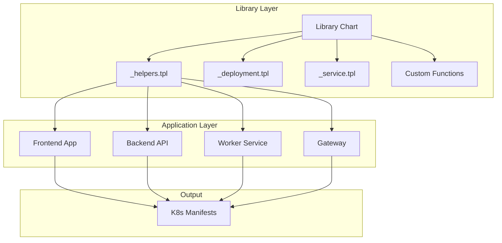
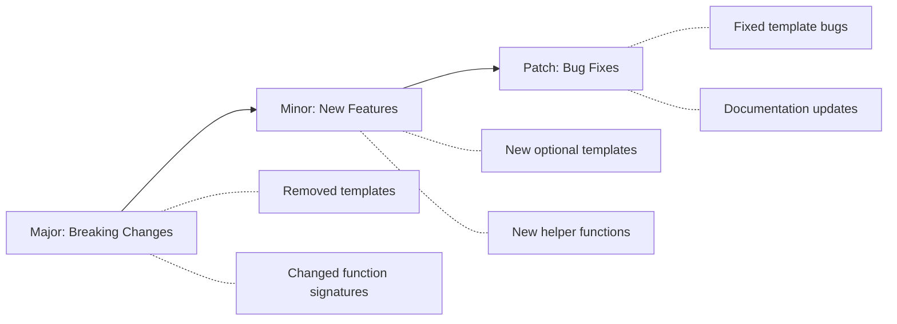

# How to Build Helm Library Charts Advanced

Author: [nawazdhandala](https://www.github.com/nawazdhandala)

Tags: Helm, Kubernetes, Charts, DevOps, Templates

Description: Create reusable Helm library charts with shared templates, helper functions, and common patterns for consistent Kubernetes deployments.

---

If you have been working with Helm for a while, you have probably noticed that your charts start looking eerily similar. The same deployment patterns, the same service definitions, the same ingress configurations - copy-pasted across dozens of applications. This is where library charts come in, and today we are going to explore the advanced patterns that make them truly powerful.

## Understanding the Library Chart Architecture

Before diving into code, let's visualize how library charts fit into your Helm ecosystem.



The library chart acts as a foundation layer that application charts build upon. Unlike regular charts, library charts never render resources directly - they only provide templates that other charts can include.

## Setting Up an Advanced Library Chart

Let's create a library chart that goes beyond basic templates. We will implement dynamic resource generation, conditional logic, and multi-component support.

First, the Chart.yaml needs to declare this as a library chart.

```yaml
# common-library/Chart.yaml
apiVersion: v2
name: common-library
description: Advanced Helm library with reusable templates
type: library  # This is the key - declares it as a library chart
version: 2.0.0
appVersion: "1.0.0"
keywords:
  - library
  - templates
  - kubernetes
maintainers:
  - name: Platform Team
    email: platform@yourcompany.com
```

## Building Flexible Helper Functions

The real power of library charts comes from well-designed helper functions. Here is a set of advanced helpers that handle common scenarios.

```yaml
# common-library/templates/_helpers.tpl

{{/*
Generate a fully qualified name with component support.
Handles multi-component applications gracefully.
*/}}
{{- define "common.fullname" -}}
{{- $name := default .Chart.Name .Values.nameOverride -}}
{{- $fullname := default (printf "%s-%s" .Release.Name $name) .Values.fullnameOverride -}}
{{- if .component -}}
{{- printf "%s-%s" $fullname .component | trunc 63 | trimSuffix "-" -}}
{{- else -}}
{{- $fullname | trunc 63 | trimSuffix "-" -}}
{{- end -}}
{{- end -}}

{{/*
Generate standard Kubernetes labels following best practices.
Includes app.kubernetes.io labels plus custom labels from values.
*/}}
{{- define "common.labels" -}}
app.kubernetes.io/name: {{ include "common.fullname" . }}
app.kubernetes.io/instance: {{ .Release.Name }}
app.kubernetes.io/version: {{ .Chart.AppVersion | default "unknown" | quote }}
app.kubernetes.io/managed-by: {{ .Release.Service }}
helm.sh/chart: {{ printf "%s-%s" .Chart.Name .Chart.Version | replace "+" "_" }}
{{- with .Values.commonLabels }}
{{ toYaml . }}
{{- end }}
{{- end -}}

{{/*
Build the container image reference from components.
Supports registry, repository, tag, and digest.
*/}}
{{- define "common.image" -}}
{{- $registry := .Values.image.registry | default "" -}}
{{- $repository := required "image.repository is required" .Values.image.repository -}}
{{- $tag := .Values.image.tag | default .Chart.AppVersion -}}
{{- $digest := .Values.image.digest | default "" -}}
{{- if $digest -}}
{{- if $registry -}}
{{- printf "%s/%s@%s" $registry $repository $digest -}}
{{- else -}}
{{- printf "%s@%s" $repository $digest -}}
{{- end -}}
{{- else -}}
{{- if $registry -}}
{{- printf "%s/%s:%s" $registry $repository $tag -}}
{{- else -}}
{{- printf "%s:%s" $repository $tag -}}
{{- end -}}
{{- end -}}
{{- end -}}
```

## Dynamic Resource Generation

One advanced pattern is generating resources based on a list in values. This works great for applications that need multiple ConfigMaps or Secrets.

```yaml
# common-library/templates/_configmaps.tpl

{{/*
Generate multiple ConfigMaps from a list.
Each item in the list becomes a separate ConfigMap.
Usage: {{ include "common.configmaps" . }}
*/}}
{{- define "common.configmaps" -}}
{{- range $name, $config := .Values.configMaps }}
---
apiVersion: v1
kind: ConfigMap
metadata:
  name: {{ include "common.fullname" $ }}-{{ $name }}
  labels:
    {{- include "common.labels" $ | nindent 4 }}
    config-type: {{ $name }}
data:
  {{- range $key, $value := $config.data }}
  {{ $key }}: {{ $value | quote }}
  {{- end }}
  {{- if $config.files }}
  {{- range $filename, $content := $config.files }}
  {{ $filename }}: |
    {{- $content | nindent 4 }}
  {{- end }}
  {{- end }}
{{- end }}
{{- end -}}
```

To use this, your consuming chart would define values like this.

```yaml
# myapp/values.yaml
configMaps:
  app-config:
    data:
      LOG_LEVEL: "info"
      CACHE_TTL: "3600"
  feature-flags:
    data:
      ENABLE_NEW_UI: "true"
      BETA_FEATURES: "false"
    files:
      features.json: |
        {
          "darkMode": true,
          "newDashboard": false
        }
```

## Advanced Deployment Template with Probes

Here is a deployment template that handles health probes, resource limits, and security contexts in a flexible way.

```yaml
# common-library/templates/_deployment.tpl

{{/*
Generate a Deployment with full configuration options.
Supports sidecars, init containers, and volume mounts.
*/}}
{{- define "common.deployment" -}}
apiVersion: apps/v1
kind: Deployment
metadata:
  name: {{ include "common.fullname" . }}
  labels:
    {{- include "common.labels" . | nindent 4 }}
spec:
  {{- if not .Values.autoscaling.enabled }}
  replicas: {{ .Values.replicaCount | default 1 }}
  {{- end }}
  selector:
    matchLabels:
      app.kubernetes.io/name: {{ include "common.fullname" . }}
      app.kubernetes.io/instance: {{ .Release.Name }}
  template:
    metadata:
      labels:
        {{- include "common.labels" . | nindent 8 }}
      annotations:
        # Force rollout when ConfigMap changes
        checksum/config: {{ include (print $.Template.BasePath "/configmap.yaml") . | sha256sum }}
        {{- with .Values.podAnnotations }}
        {{- toYaml . | nindent 8 }}
        {{- end }}
    spec:
      {{- with .Values.imagePullSecrets }}
      imagePullSecrets:
        {{- toYaml . | nindent 8 }}
      {{- end }}
      serviceAccountName: {{ .Values.serviceAccount.name | default (include "common.fullname" .) }}
      securityContext:
        {{- toYaml .Values.podSecurityContext | nindent 8 }}
      {{- with .Values.initContainers }}
      initContainers:
        {{- toYaml . | nindent 8 }}
      {{- end }}
      containers:
        - name: {{ .Chart.Name }}
          image: {{ include "common.image" . | quote }}
          imagePullPolicy: {{ .Values.image.pullPolicy | default "IfNotPresent" }}
          securityContext:
            {{- toYaml .Values.containerSecurityContext | nindent 12 }}
          ports:
            - name: http
              containerPort: {{ .Values.containerPort | default 8080 }}
              protocol: TCP
          {{- if .Values.probes.liveness.enabled }}
          livenessProbe:
            httpGet:
              path: {{ .Values.probes.liveness.path | default "/health" }}
              port: http
            initialDelaySeconds: {{ .Values.probes.liveness.initialDelaySeconds | default 10 }}
            periodSeconds: {{ .Values.probes.liveness.periodSeconds | default 10 }}
            timeoutSeconds: {{ .Values.probes.liveness.timeoutSeconds | default 5 }}
            failureThreshold: {{ .Values.probes.liveness.failureThreshold | default 3 }}
          {{- end }}
          {{- if .Values.probes.readiness.enabled }}
          readinessProbe:
            httpGet:
              path: {{ .Values.probes.readiness.path | default "/ready" }}
              port: http
            initialDelaySeconds: {{ .Values.probes.readiness.initialDelaySeconds | default 5 }}
            periodSeconds: {{ .Values.probes.readiness.periodSeconds | default 5 }}
            timeoutSeconds: {{ .Values.probes.readiness.timeoutSeconds | default 3 }}
            failureThreshold: {{ .Values.probes.readiness.failureThreshold | default 3 }}
          {{- end }}
          resources:
            {{- toYaml .Values.resources | nindent 12 }}
          {{- with .Values.env }}
          env:
            {{- toYaml . | nindent 12 }}
          {{- end }}
          {{- with .Values.volumeMounts }}
          volumeMounts:
            {{- toYaml . | nindent 12 }}
          {{- end }}
        {{- with .Values.sidecars }}
        {{- toYaml . | nindent 8 }}
        {{- end }}
      {{- with .Values.volumes }}
      volumes:
        {{- toYaml . | nindent 8 }}
      {{- end }}
      {{- with .Values.nodeSelector }}
      nodeSelector:
        {{- toYaml . | nindent 8 }}
      {{- end }}
      {{- with .Values.affinity }}
      affinity:
        {{- toYaml . | nindent 8 }}
      {{- end }}
      {{- with .Values.tolerations }}
      tolerations:
        {{- toYaml . | nindent 8 }}
      {{- end }}
{{- end -}}
```

## Consuming the Library Chart

To use your library chart in an application chart, add it as a dependency.

```yaml
# myapp/Chart.yaml
apiVersion: v2
name: myapp
version: 1.0.0
dependencies:
  - name: common-library
    version: "2.x.x"
    repository: "https://charts.yourcompany.com"
```

Then include the templates in your application chart.

```yaml
# myapp/templates/deployment.yaml
{{- include "common.deployment" . -}}

# myapp/templates/configmap.yaml
{{- include "common.configmaps" . -}}
```

## Testing Your Library Chart

Testing library charts requires a slightly different approach since they do not render anything on their own.

```bash
# Create a test chart that uses the library
helm create test-consumer
cd test-consumer

# Add the library as a local dependency
# In Chart.yaml, add:
# dependencies:
#   - name: common-library
#     version: "2.0.0"
#     repository: "file://../common-library"

# Update dependencies
helm dependency update

# Test rendering
helm template test-release . --debug

# Validate against Kubernetes schemas
helm template test-release . | kubectl apply --dry-run=client -f -
```

## Versioning Strategy

When maintaining library charts, follow semantic versioning carefully.



Consumer charts should pin to major versions using constraints like `2.x.x` to automatically receive minor updates and patches while avoiding breaking changes.

## Wrapping Up

Library charts transform how teams manage Kubernetes deployments at scale. By centralizing common patterns into a shared library, you reduce duplication, enforce standards, and make updates significantly easier. Start with the basics - common labels and image helpers - then gradually add more templates as patterns emerge in your application charts.

The key is to keep your library chart focused and well-documented. Each template should do one thing well, accept sensible defaults, and remain flexible enough to handle edge cases through value overrides. Your future self (and your team) will thank you when updating a common pattern means changing one file instead of fifty.
