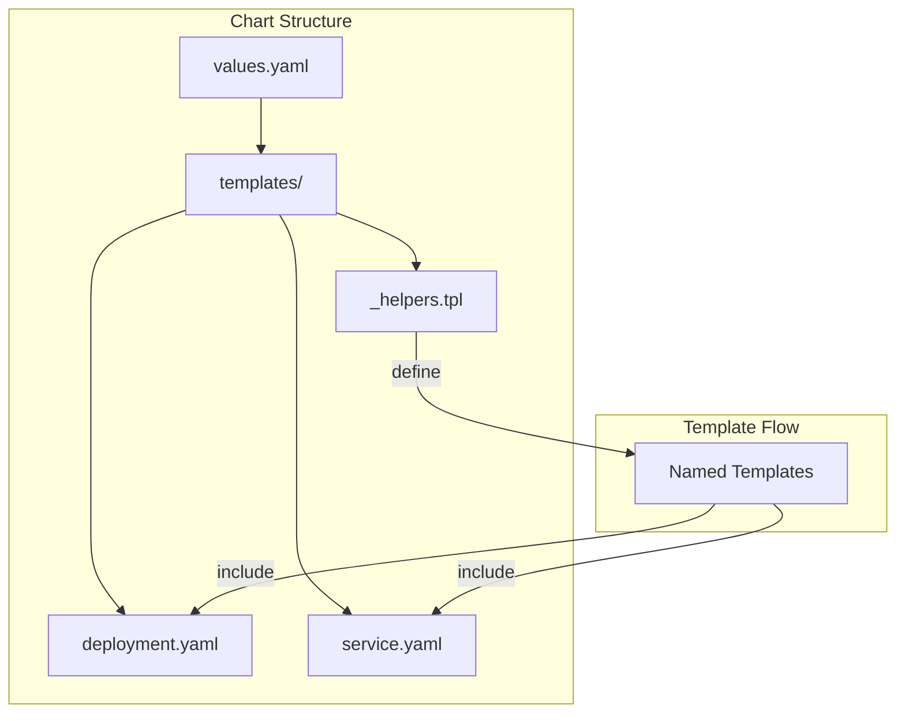
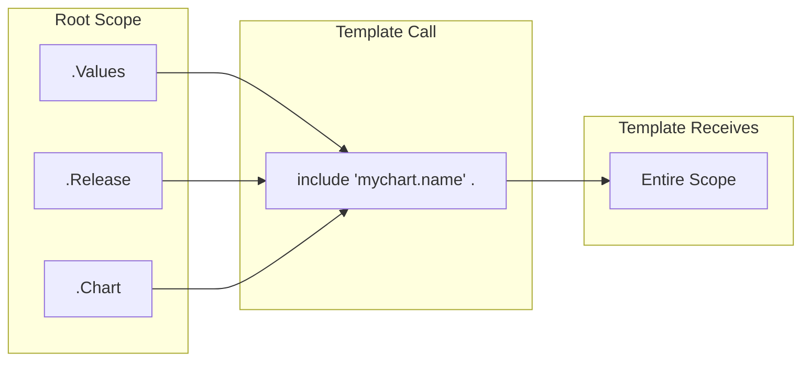
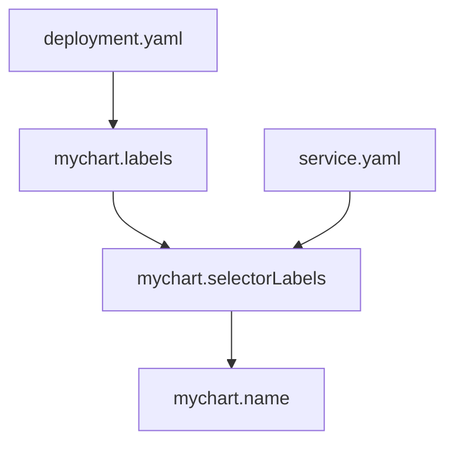

# How to Build Helm Named Templates

Author: [nawazdhandala](https://github.com/nawazdhandala)

Tags: Helm, Kubernetes, Templates, Reusability

Description: Learn to create reusable template snippets in Helm using the _helpers.tpl file with define and include directives.

---

Helm charts often contain repeated YAML blocks. Labels, annotations, resource names, and selector configurations show up in multiple places. Named templates let you define these once and reuse them everywhere.

## What Are Named Templates?

Named templates are reusable template snippets defined with the `define` action and called with `include` or `template`. They live in files prefixed with an underscore, typically `_helpers.tpl`.



## The _helpers.tpl File

Helm ignores files starting with underscore during manifest generation. This makes `_helpers.tpl` the perfect place for template definitions.

```
mychart/
├── Chart.yaml
├── values.yaml
└── templates/
    ├── _helpers.tpl      # Named template definitions
    ├── deployment.yaml
    ├── service.yaml
    └── configmap.yaml
```

## Defining Templates

Use the `define` action to create a named template:

```yaml
# templates/_helpers.tpl

{{- define "mychart.name" -}}
{{- default .Chart.Name .Values.nameOverride | trunc 63 | trimSuffix "-" }}
{{- end }}
```

Breaking this down:
- `define "mychart.name"` starts the template definition
- `end` closes the definition
- The hyphen `-` trims whitespace before and after

### Template Naming Convention

Always prefix template names with your chart name to avoid collisions:

```yaml
{{- define "mychart.fullname" -}}
{{- if .Values.fullnameOverride }}
{{- .Values.fullnameOverride | trunc 63 | trimSuffix "-" }}
{{- else }}
{{- $name := default .Chart.Name .Values.nameOverride }}
{{- printf "%s-%s" .Release.Name $name | trunc 63 | trimSuffix "-" }}
{{- end }}
{{- end }}
```

## Using Templates with include

The `include` function calls a named template and returns the result as a string:

```yaml
# templates/deployment.yaml
apiVersion: apps/v1
kind: Deployment
metadata:
  name: {{ include "mychart.fullname" . }}
  labels:
    {{- include "mychart.labels" . | nindent 4 }}
spec:
  selector:
    matchLabels:
      {{- include "mychart.selectorLabels" . | nindent 6 }}
```

The dot `.` passes the current scope to the template. The `nindent 4` function adds a newline and indents by 4 spaces.

## Template vs Include

Both call named templates, but they differ:

| Feature | template | include |
|---------|----------|---------|
| Returns | Outputs directly | Returns string |
| Pipeline | Not supported | Supported |
| Indentation | Manual | Use nindent |

Prefer `include` because it works with pipelines:

```yaml
# Works
{{- include "mychart.labels" . | nindent 4 }}

# Does not work
{{- template "mychart.labels" . | nindent 4 }}
```

## Passing Scope to Templates

The second argument to `include` is the scope. Use `.` for root scope:

```yaml
{{- include "mychart.name" . }}
```

Or pass a specific scope:

```yaml
{{- include "mychart.container" .Values.app }}
```



## Common Named Templates

### Labels Template

```yaml
# templates/_helpers.tpl

{{- define "mychart.labels" -}}
helm.sh/chart: {{ include "mychart.chart" . }}
{{ include "mychart.selectorLabels" . }}
{{- if .Chart.AppVersion }}
app.kubernetes.io/version: {{ .Chart.AppVersion | quote }}
{{- end }}
app.kubernetes.io/managed-by: {{ .Release.Service }}
{{- end }}

{{- define "mychart.selectorLabels" -}}
app.kubernetes.io/name: {{ include "mychart.name" . }}
app.kubernetes.io/instance: {{ .Release.Name }}
{{- end }}

{{- define "mychart.chart" -}}
{{- printf "%s-%s" .Chart.Name .Chart.Version | replace "+" "_" | trunc 63 | trimSuffix "-" }}
{{- end }}
```

### Service Account Name

```yaml
{{- define "mychart.serviceAccountName" -}}
{{- if .Values.serviceAccount.create }}
{{- default (include "mychart.fullname" .) .Values.serviceAccount.name }}
{{- else }}
{{- default "default" .Values.serviceAccount.name }}
{{- end }}
{{- end }}
```

### Image Reference

```yaml
{{- define "mychart.image" -}}
{{- $registry := .Values.image.registry | default "" }}
{{- $repository := .Values.image.repository }}
{{- $tag := .Values.image.tag | default .Chart.AppVersion }}
{{- if $registry }}
{{- printf "%s/%s:%s" $registry $repository $tag }}
{{- else }}
{{- printf "%s:%s" $repository $tag }}
{{- end }}
{{- end }}
```

## Composing Templates

Named templates can call other named templates:

```yaml
{{- define "mychart.labels" -}}
{{ include "mychart.selectorLabels" . }}
app.kubernetes.io/managed-by: {{ .Release.Service }}
{{- end }}

{{- define "mychart.selectorLabels" -}}
app.kubernetes.io/name: {{ include "mychart.name" . }}
app.kubernetes.io/instance: {{ .Release.Name }}
{{- end }}
```



## Template Scope Deep Dive

Understanding scope is critical. Consider this setup:

```yaml
# values.yaml
app:
  name: myapp
  replicas: 3
  image:
    repository: nginx
    tag: latest
```

### Passing Subsets

```yaml
{{- define "mychart.container" -}}
name: {{ .name }}
image: {{ .image.repository }}:{{ .image.tag }}
{{- end }}

# Usage
spec:
  containers:
    {{- include "mychart.container" .Values.app | nindent 4 }}
```

### Creating Custom Context

```yaml
{{- define "mychart.deployment" -}}
{{- $ctx := dict "Release" .Release "Values" .Values "name" .name }}
metadata:
  name: {{ $ctx.name }}
  namespace: {{ $ctx.Release.Namespace }}
{{- end }}
```

## Conditional Templates

Add logic inside templates:

```yaml
{{- define "mychart.annotations" -}}
{{- if .Values.annotations }}
{{- toYaml .Values.annotations }}
{{- end }}
{{- if .Values.metrics.enabled }}
prometheus.io/scrape: "true"
prometheus.io/port: {{ .Values.metrics.port | quote }}
{{- end }}
{{- end }}
```

## Looping in Templates

```yaml
{{- define "mychart.env" -}}
{{- range $key, $value := .Values.env }}
- name: {{ $key }}
  value: {{ $value | quote }}
{{- end }}
{{- end }}
```

Usage:

```yaml
# values.yaml
env:
  LOG_LEVEL: info
  DEBUG: "false"

# deployment.yaml
spec:
  containers:
    - name: app
      env:
        {{- include "mychart.env" . | nindent 8 }}
```

## Handling Whitespace

Whitespace control matters in YAML:

```yaml
# Bad: leaves empty lines
{{ define "mychart.labels" }}
app: myapp
{{ end }}

# Good: trims whitespace
{{- define "mychart.labels" -}}
app: myapp
{{- end }}
```

The hyphen works on both sides:
- `{{-` trims whitespace before
- `-}}` trims whitespace after

## Default Values in Templates

Set fallbacks within templates:

```yaml
{{- define "mychart.resources" -}}
resources:
  limits:
    cpu: {{ .Values.resources.limits.cpu | default "500m" }}
    memory: {{ .Values.resources.limits.memory | default "512Mi" }}
  requests:
    cpu: {{ .Values.resources.requests.cpu | default "100m" }}
    memory: {{ .Values.resources.requests.memory | default "128Mi" }}
{{- end }}
```

## Required Values

Fail early when values are missing:

```yaml
{{- define "mychart.imageTag" -}}
{{- required "image.tag is required" .Values.image.tag }}
{{- end }}
```

## Complete Example

Here is a full `_helpers.tpl` file:

```yaml
# templates/_helpers.tpl

{{- define "mychart.name" -}}
{{- default .Chart.Name .Values.nameOverride | trunc 63 | trimSuffix "-" }}
{{- end }}

{{- define "mychart.fullname" -}}
{{- if .Values.fullnameOverride }}
{{- .Values.fullnameOverride | trunc 63 | trimSuffix "-" }}
{{- else }}
{{- $name := default .Chart.Name .Values.nameOverride }}
{{- if contains $name .Release.Name }}
{{- .Release.Name | trunc 63 | trimSuffix "-" }}
{{- else }}
{{- printf "%s-%s" .Release.Name $name | trunc 63 | trimSuffix "-" }}
{{- end }}
{{- end }}
{{- end }}

{{- define "mychart.chart" -}}
{{- printf "%s-%s" .Chart.Name .Chart.Version | replace "+" "_" | trunc 63 | trimSuffix "-" }}
{{- end }}

{{- define "mychart.labels" -}}
helm.sh/chart: {{ include "mychart.chart" . }}
{{ include "mychart.selectorLabels" . }}
{{- if .Chart.AppVersion }}
app.kubernetes.io/version: {{ .Chart.AppVersion | quote }}
{{- end }}
app.kubernetes.io/managed-by: {{ .Release.Service }}
{{- end }}

{{- define "mychart.selectorLabels" -}}
app.kubernetes.io/name: {{ include "mychart.name" . }}
app.kubernetes.io/instance: {{ .Release.Name }}
{{- end }}

{{- define "mychart.serviceAccountName" -}}
{{- if .Values.serviceAccount.create }}
{{- default (include "mychart.fullname" .) .Values.serviceAccount.name }}
{{- else }}
{{- default "default" .Values.serviceAccount.name }}
{{- end }}
{{- end }}

{{- define "mychart.image" -}}
{{- $tag := .Values.image.tag | default .Chart.AppVersion }}
{{- printf "%s:%s" .Values.image.repository $tag }}
{{- end }}
```

Using these templates in deployment.yaml:

```yaml
# templates/deployment.yaml
apiVersion: apps/v1
kind: Deployment
metadata:
  name: {{ include "mychart.fullname" . }}
  labels:
    {{- include "mychart.labels" . | nindent 4 }}
spec:
  replicas: {{ .Values.replicaCount }}
  selector:
    matchLabels:
      {{- include "mychart.selectorLabels" . | nindent 6 }}
  template:
    metadata:
      labels:
        {{- include "mychart.selectorLabels" . | nindent 8 }}
    spec:
      serviceAccountName: {{ include "mychart.serviceAccountName" . }}
      containers:
        - name: {{ .Chart.Name }}
          image: {{ include "mychart.image" . }}
          ports:
            - name: http
              containerPort: {{ .Values.service.port }}
              protocol: TCP
```

## Template Development Tips

### Debug with helm template

```bash
helm template myrelease ./mychart --debug
```

### Check specific templates

```bash
helm template myrelease ./mychart -s templates/deployment.yaml
```

### Lint your chart

```bash
helm lint ./mychart
```

### Test with different values

```bash
helm template myrelease ./mychart -f custom-values.yaml
```

## Organization for Large Charts

For complex charts, split helpers into multiple files:

```
templates/
├── _helpers.tpl          # Core helpers (name, fullname, labels)
├── _images.tpl           # Image-related templates
├── _resources.tpl        # Resource definitions
├── _probes.tpl           # Health check templates
└── _volumes.tpl          # Volume configurations
```

All underscore-prefixed files get processed together, so templates defined in any of them are available everywhere.

---

Named templates transform messy, repetitive Helm charts into clean, maintainable code. Start with the standard helpers (name, fullname, labels), add application-specific templates as patterns emerge, and keep your templates focused on single responsibilities.
