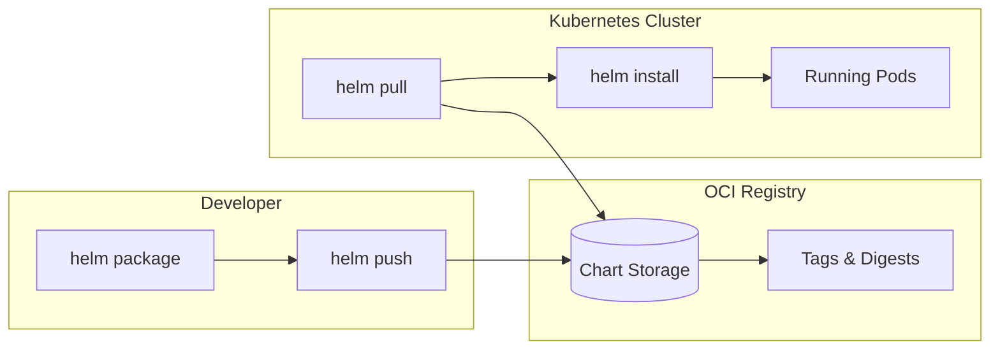
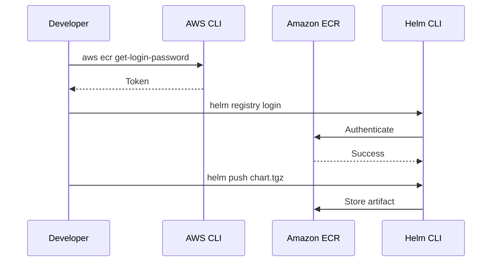
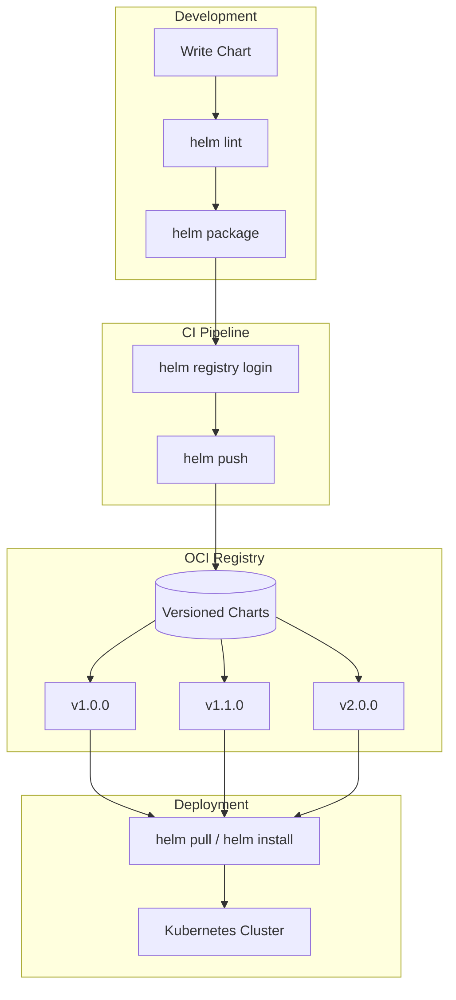

# How to Create a Helm OCI Registry

Author: [nawazdhandala](https://github.com/nawazdhandala)

Tags: Helm, OCI, Registry, Kubernetes

Description: A practical guide to hosting and distributing Helm charts using OCI-compliant container registries.

---

Helm charts no longer need their own artifact servers. Since Helm 3.8, OCI (Open Container Initiative) support moved from experimental to stable, letting you store charts alongside container images in the same registry. One registry, one authentication flow, one set of access controls.

## Why OCI for Helm Charts?

Traditional Helm repositories use HTTP index files that require a web server and periodic reindexing. OCI registries treat charts as first-class artifacts:

- **Single source of truth:** Charts live next to the images they deploy.
- **Native versioning:** Tags and digests work exactly like container images.
- **Unified auth:** Use the same credentials for `docker pull` and `helm pull`.
- **Content addressing:** SHA256 digests guarantee artifact integrity.



## Basic Workflow

### Package Your Chart

Start with a valid Helm chart directory:

```bash
# Create a new chart (or use an existing one)
helm create myapp

# Package it into a .tgz file
helm package myapp
# Output: myapp-0.1.0.tgz
```

### Push to an OCI Registry

```bash
# Push the packaged chart
helm push myapp-0.1.0.tgz oci://registry.example.com/charts

# Output:
# Pushed: registry.example.com/charts/myapp:0.1.0
# Digest: sha256:abc123...
```

### Pull from the Registry

```bash
# Pull a specific version
helm pull oci://registry.example.com/charts/myapp --version 0.1.0

# Pull and untar in one step
helm pull oci://registry.example.com/charts/myapp --version 0.1.0 --untar
```

### Install Directly from OCI

```bash
# Install without downloading first
helm install myapp oci://registry.example.com/charts/myapp --version 0.1.0

# Upgrade works the same way
helm upgrade myapp oci://registry.example.com/charts/myapp --version 0.2.0
```

## Authentication

### Login to Your Registry

```bash
# Interactive login
helm registry login registry.example.com

# Non-interactive (CI/CD)
helm registry login registry.example.com \
  --username $REGISTRY_USER \
  --password $REGISTRY_PASSWORD
```

Helm stores credentials in the same location as Docker:

```bash
# Check where credentials are stored
cat ~/.docker/config.json
```

### Logout When Done

```bash
helm registry logout registry.example.com
```

## Using Major Cloud Registries

### Amazon ECR



First, create an ECR repository:

```bash
# Create repository for your chart
aws ecr create-repository \
  --repository-name charts/myapp \
  --region us-east-1
```

Login and push:

```bash
# Get ECR login token and authenticate Helm
aws ecr get-login-password --region us-east-1 | \
  helm registry login \
    --username AWS \
    --password-stdin \
    123456789012.dkr.ecr.us-east-1.amazonaws.com

# Push your chart
helm push myapp-0.1.0.tgz oci://123456789012.dkr.ecr.us-east-1.amazonaws.com/charts
```

Pull and install:

```bash
# Pull the chart
helm pull oci://123456789012.dkr.ecr.us-east-1.amazonaws.com/charts/myapp --version 0.1.0

# Install directly
helm install myapp oci://123456789012.dkr.ecr.us-east-1.amazonaws.com/charts/myapp --version 0.1.0
```

### Google Container Registry (GCR) / Artifact Registry

For Artifact Registry (recommended):

```bash
# Create a repository
gcloud artifacts repositories create helm-charts \
  --repository-format=docker \
  --location=us-central1

# Configure Docker/Helm authentication
gcloud auth configure-docker us-central1-docker.pkg.dev

# Push your chart
helm push myapp-0.1.0.tgz oci://us-central1-docker.pkg.dev/my-project/helm-charts
```

For legacy GCR:

```bash
# Authenticate
gcloud auth print-access-token | helm registry login \
  --username oauth2accesstoken \
  --password-stdin \
  gcr.io

# Push
helm push myapp-0.1.0.tgz oci://gcr.io/my-project/charts
```

### Azure Container Registry (ACR)

```bash
# Create ACR if needed
az acr create --name myregistry --resource-group mygroup --sku Basic

# Login with Azure CLI
az acr login --name myregistry

# Or login with Helm directly
helm registry login myregistry.azurecr.io \
  --username $ACR_USERNAME \
  --password $ACR_PASSWORD

# Push your chart
helm push myapp-0.1.0.tgz oci://myregistry.azurecr.io/charts

# Pull and install
helm install myapp oci://myregistry.azurecr.io/charts/myapp --version 0.1.0
```

### Docker Hub

```bash
# Login to Docker Hub
helm registry login registry-1.docker.io \
  --username myusername \
  --password $DOCKER_PASSWORD

# Push (namespace is your Docker Hub username or org)
helm push myapp-0.1.0.tgz oci://registry-1.docker.io/myusername

# Pull
helm pull oci://registry-1.docker.io/myusername/myapp --version 0.1.0
```

### GitHub Container Registry (GHCR)

```bash
# Login with personal access token
echo $GITHUB_TOKEN | helm registry login ghcr.io \
  --username $GITHUB_USER \
  --password-stdin

# Push
helm push myapp-0.1.0.tgz oci://ghcr.io/myorg/charts

# Pull
helm pull oci://ghcr.io/myorg/charts/myapp --version 0.1.0
```

## Self-Hosted OCI Registry

### Using Docker Distribution (registry:2)

Run a local registry:

```bash
docker run -d -p 5000:5000 --name registry registry:2
```

Push and pull without TLS (development only):

```bash
# Push to localhost
helm push myapp-0.1.0.tgz oci://localhost:5000/charts

# Pull from localhost
helm pull oci://localhost:5000/charts/myapp --version 0.1.0
```

### Using Harbor

Harbor provides enterprise features like vulnerability scanning and replication:

```bash
# Login to Harbor
helm registry login harbor.example.com \
  --username admin \
  --password Harbor12345

# Push to a project
helm push myapp-0.1.0.tgz oci://harbor.example.com/myproject
```

## CI/CD Integration

### GitHub Actions Example

```yaml
name: Publish Helm Chart

on:
  push:
    tags:
      - 'v*'

jobs:
  publish:
    runs-on: ubuntu-latest
    steps:
      - uses: actions/checkout@v4

      - name: Install Helm
        uses: azure/setup-helm@v3

      - name: Package chart
        run: helm package ./charts/myapp

      - name: Login to GHCR
        run: |
          echo ${{ secrets.GITHUB_TOKEN }} | helm registry login ghcr.io \
            --username ${{ github.actor }} \
            --password-stdin

      - name: Push chart
        run: |
          helm push myapp-*.tgz oci://ghcr.io/${{ github.repository_owner }}/charts
```

### GitLab CI Example

```yaml
publish-chart:
  image: alpine/helm:latest
  stage: publish
  script:
    - helm package ./charts/myapp
    - helm registry login $CI_REGISTRY --username $CI_REGISTRY_USER --password $CI_REGISTRY_PASSWORD
    - helm push myapp-*.tgz oci://$CI_REGISTRY/$CI_PROJECT_PATH/charts
  only:
    - tags
```

## Working with Chart Dependencies

OCI charts can reference other OCI charts as dependencies:

```yaml
# Chart.yaml
apiVersion: v2
name: myapp
version: 1.0.0
dependencies:
  - name: postgresql
    version: "12.1.0"
    repository: "oci://registry-1.docker.io/bitnamicharts"
  - name: redis
    version: "17.0.0"
    repository: "oci://registry-1.docker.io/bitnamicharts"
```

Update dependencies:

```bash
# Download dependencies
helm dependency update ./myapp

# Build with dependencies included
helm dependency build ./myapp
```

## OCI Registry Workflow



## Inspecting OCI Charts

View chart metadata without downloading:

```bash
# Show chart info
helm show chart oci://registry.example.com/charts/myapp --version 0.1.0

# Show default values
helm show values oci://registry.example.com/charts/myapp --version 0.1.0

# Show README
helm show readme oci://registry.example.com/charts/myapp --version 0.1.0

# Show everything
helm show all oci://registry.example.com/charts/myapp --version 0.1.0
```

## Troubleshooting

### Common Issues

**Error: failed to authorize**

```bash
# Check if you are logged in
cat ~/.docker/config.json | jq '.auths'

# Re-authenticate
helm registry logout registry.example.com
helm registry login registry.example.com
```

**Error: OCI artifact not found**

```bash
# Verify the chart exists (use your registry's API or CLI)
# For ECR:
aws ecr describe-images --repository-name charts/myapp

# For GCR/Artifact Registry:
gcloud artifacts docker images list us-central1-docker.pkg.dev/my-project/helm-charts
```

**Error: unsupported protocol scheme**

Make sure you use `oci://` prefix, not `https://`:

```bash
# Wrong
helm push myapp-0.1.0.tgz https://registry.example.com/charts

# Correct
helm push myapp-0.1.0.tgz oci://registry.example.com/charts
```

### Debug Mode

Enable verbose output:

```bash
helm push myapp-0.1.0.tgz oci://registry.example.com/charts --debug
helm pull oci://registry.example.com/charts/myapp --version 0.1.0 --debug
```

## Best Practices

1. **Version your charts semantically.** Use `x.y.z` format and bump versions with each change.

2. **Sign your charts.** Use `helm package --sign` with GPG keys for supply chain security.

3. **Use digests in production.** Pin deployments to SHA256 digests instead of mutable tags.

4. **Separate environments.** Use different registry paths or repositories for dev, staging, and production charts.

5. **Automate publishing.** Push charts from CI/CD pipelines, not developer laptops.

6. **Clean up old versions.** Set retention policies on your registry to avoid storage bloat.

---

OCI support in Helm removes the need for separate chart repositories and their maintenance overhead. Your charts travel through the same pipeline as your container images: one registry, one set of credentials, one workflow. Start by pushing a single chart to your existing container registry and expand from there.
