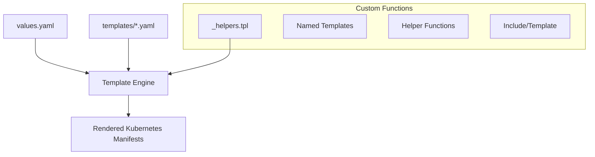
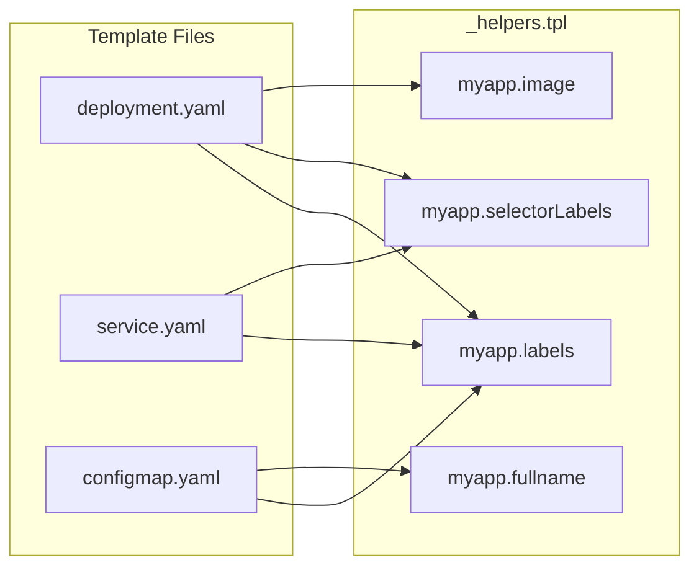
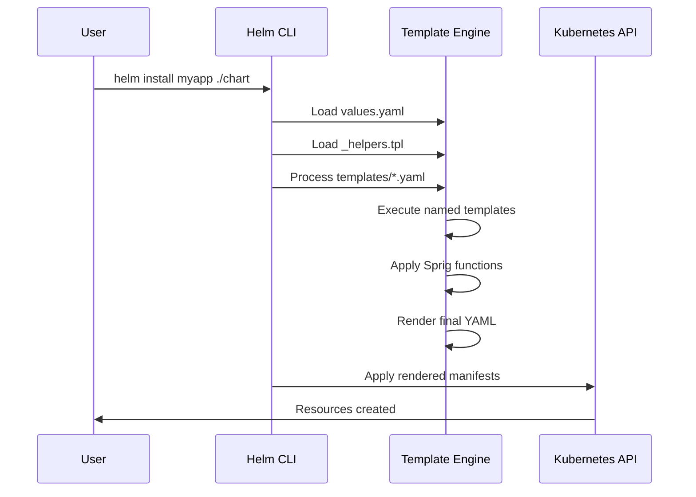
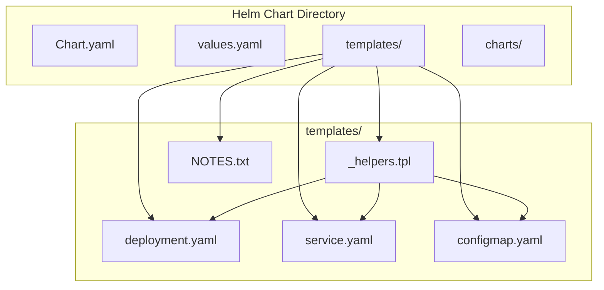

# How to Build Helm Template Functions Custom

Author: [nawazdhandala](https://github.com/nawazdhandala)

Tags: Helm, Kubernetes, Templates, Functions

Description: Learn how to create custom Helm template functions to simplify Kubernetes deployments. This guide covers defining reusable templates, named templates, helper functions, and best practices for maintainable Helm charts.

---

> Custom Helm template functions transform repetitive YAML into reusable, maintainable code. Instead of copying the same configuration across dozens of files, define it once and use it everywhere. Master custom templates to build production-ready Helm charts.

Helm templates are Go templates with superpowers. Custom functions make them even more powerful.

---

## Overview

Helm uses Go's text/template package enhanced with Sprig functions and custom Helm-specific functions. Understanding how to create and use custom template functions is essential for building maintainable charts.



---

## Helm Template Basics

### Template Syntax

Helm templates use double curly braces for expressions:

```yaml
# Basic value substitution from values.yaml
apiVersion: v1
kind: ConfigMap
metadata:
  name: {{ .Release.Name }}-config
  labels:
    app: {{ .Values.app.name }}
    version: {{ .Values.app.version }}
```

### Built-in Objects

Helm provides several built-in objects accessible in templates:

```yaml
# Common built-in objects
metadata:
  name: {{ .Release.Name }}           # Release name
  namespace: {{ .Release.Namespace }} # Target namespace
  labels:
    chart: {{ .Chart.Name }}          # Chart name from Chart.yaml
    version: {{ .Chart.Version }}     # Chart version
    app.kubernetes.io/managed-by: {{ .Release.Service }}
```

---

## Creating Named Templates

Named templates (also called partials or subtemplates) are the foundation of custom Helm functions. They are defined in files starting with underscore, typically `_helpers.tpl`.

### Basic Named Template

Define reusable templates using the `define` action:

```yaml
# templates/_helpers.tpl

{{/*
Generate standard labels for all resources.
This template creates consistent labeling across your entire chart.
*/}}
{{- define "myapp.labels" -}}
app.kubernetes.io/name: {{ .Chart.Name }}
app.kubernetes.io/instance: {{ .Release.Name }}
app.kubernetes.io/version: {{ .Chart.AppVersion | quote }}
app.kubernetes.io/managed-by: {{ .Release.Service }}
helm.sh/chart: {{ .Chart.Name }}-{{ .Chart.Version | replace "+" "_" }}
{{- end }}
```

### Using Named Templates

Use the `include` function to call named templates:

```yaml
# templates/deployment.yaml
apiVersion: apps/v1
kind: Deployment
metadata:
  name: {{ .Release.Name }}-deployment
  labels:
    {{- include "myapp.labels" . | nindent 4 }}
spec:
  selector:
    matchLabels:
      {{- include "myapp.selectorLabels" . | nindent 6 }}
  template:
    metadata:
      labels:
        {{- include "myapp.selectorLabels" . | nindent 8 }}
```

---

## Template Function Architecture



---

## Advanced Custom Functions

### Fullname Template

Create a consistent naming convention across all resources:

```yaml
# templates/_helpers.tpl

{{/*
Create a fully qualified app name.
Truncate at 63 chars because some Kubernetes name fields are limited.
*/}}
{{- define "myapp.fullname" -}}
{{- if .Values.fullnameOverride }}
{{- .Values.fullnameOverride | trunc 63 | trimSuffix "-" }}
{{- else }}
{{- $name := default .Chart.Name .Values.nameOverride }}
{{- if contains $name .Release.Name }}
{{- .Release.Name | trunc 63 | trimSuffix "-" }}
{{- else }}
{{- printf "%s-%s" .Release.Name $name | trunc 63 | trimSuffix "-" }}
{{- end }}
{{- end }}
{{- end }}
```

### Selector Labels Template

Define minimal labels for pod selection:

```yaml
# templates/_helpers.tpl

{{/*
Selector labels - used for matching pods to services and deployments.
Keep these minimal and immutable after initial deployment.
*/}}
{{- define "myapp.selectorLabels" -}}
app.kubernetes.io/name: {{ include "myapp.name" . }}
app.kubernetes.io/instance: {{ .Release.Name }}
{{- end }}
```

### Image Template

Generate container image references with proper formatting:

```yaml
# templates/_helpers.tpl

{{/*
Create the image reference string.
Handles registry, repository, and tag configuration.
*/}}
{{- define "myapp.image" -}}
{{- $registry := .Values.image.registry | default "docker.io" -}}
{{- $repository := .Values.image.repository -}}
{{- $tag := .Values.image.tag | default .Chart.AppVersion -}}
{{- printf "%s/%s:%s" $registry $repository $tag -}}
{{- end }}
```

Usage in deployment:

```yaml
# templates/deployment.yaml
spec:
  containers:
    - name: {{ .Chart.Name }}
      image: {{ include "myapp.image" . }}
      imagePullPolicy: {{ .Values.image.pullPolicy }}
```

---

## Passing Data to Templates

### Using the Dot Context

The dot (`.`) represents the current scope. Pass it to include the full context:

```yaml
# Pass full context
{{- include "myapp.labels" . }}

# The template receives .Values, .Release, .Chart, etc.
```

### Creating Custom Contexts

Pass custom data using the `dict` function:

```yaml
# templates/_helpers.tpl

{{/*
Generate resource annotations with custom data.
Accepts a dict with 'root' (global context) and 'extra' (additional annotations).
*/}}
{{- define "myapp.annotations" -}}
{{- $root := .root -}}
{{- $extra := .extra | default dict -}}
checksum/config: {{ include (print $root.Template.BasePath "/configmap.yaml") $root | sha256sum }}
{{- range $key, $value := $extra }}
{{ $key }}: {{ $value | quote }}
{{- end }}
{{- end }}
```

Usage with custom context:

```yaml
# templates/deployment.yaml
metadata:
  annotations:
    {{- include "myapp.annotations" (dict "root" . "extra" .Values.podAnnotations) | nindent 4 }}
```

---

## Conditional Logic in Templates

### If-Else Statements

Create templates with conditional behavior:

```yaml
# templates/_helpers.tpl

{{/*
Generate service account name.
Returns the specified name or generates one based on fullname.
*/}}
{{- define "myapp.serviceAccountName" -}}
{{- if .Values.serviceAccount.create }}
{{- default (include "myapp.fullname" .) .Values.serviceAccount.name }}
{{- else }}
{{- default "default" .Values.serviceAccount.name }}
{{- end }}
{{- end }}
```

### With Blocks

Use `with` to change the current scope:

```yaml
# templates/_helpers.tpl

{{/*
Generate resource requests and limits.
Only outputs if resources are defined in values.
*/}}
{{- define "myapp.resources" -}}
{{- with .Values.resources }}
resources:
  {{- toYaml . | nindent 2 }}
{{- end }}
{{- end }}
```

---

## Iterating in Templates

### Range Over Lists

Create templates that iterate over collections:

```yaml
# templates/_helpers.tpl

{{/*
Generate environment variables from a list.
Handles both direct values and secret references.
*/}}
{{- define "myapp.env" -}}
{{- range .Values.env }}
- name: {{ .name }}
  {{- if .value }}
  value: {{ .value | quote }}
  {{- else if .valueFrom }}
  valueFrom:
    {{- toYaml .valueFrom | nindent 4 }}
  {{- end }}
{{- end }}
{{- end }}
```

### Range Over Maps

Iterate over key-value pairs:

```yaml
# templates/_helpers.tpl

{{/*
Generate ConfigMap data from a map of values.
*/}}
{{- define "myapp.configData" -}}
{{- range $key, $value := .Values.config }}
{{ $key }}: {{ $value | quote }}
{{- end }}
{{- end }}
```

---

## Template Processing Flow



---

## Reusable Component Templates

### Container Template

Create a complete container specification template:

```yaml
# templates/_helpers.tpl

{{/*
Generate a complete container specification.
Accepts container config from values with sensible defaults.
*/}}
{{- define "myapp.container" -}}
{{- $name := .name | default "app" -}}
{{- $image := .image -}}
{{- $port := .port | default 8080 -}}
- name: {{ $name }}
  image: {{ $image.repository }}:{{ $image.tag | default "latest" }}
  imagePullPolicy: {{ $image.pullPolicy | default "IfNotPresent" }}
  ports:
    - name: http
      containerPort: {{ $port }}
      protocol: TCP
  {{- with .resources }}
  resources:
    {{- toYaml . | nindent 4 }}
  {{- end }}
  {{- with .env }}
  env:
    {{- toYaml . | nindent 4 }}
  {{- end }}
  {{- with .volumeMounts }}
  volumeMounts:
    {{- toYaml . | nindent 4 }}
  {{- end }}
{{- end }}
```

### Probe Templates

Create health check probe templates:

```yaml
# templates/_helpers.tpl

{{/*
Generate liveness probe configuration.
*/}}
{{- define "myapp.livenessProbe" -}}
{{- with .Values.livenessProbe }}
livenessProbe:
  {{- if .httpGet }}
  httpGet:
    path: {{ .httpGet.path | default "/healthz" }}
    port: {{ .httpGet.port | default "http" }}
  {{- else if .exec }}
  exec:
    command:
      {{- toYaml .exec.command | nindent 6 }}
  {{- end }}
  initialDelaySeconds: {{ .initialDelaySeconds | default 10 }}
  periodSeconds: {{ .periodSeconds | default 10 }}
  timeoutSeconds: {{ .timeoutSeconds | default 5 }}
  failureThreshold: {{ .failureThreshold | default 3 }}
{{- end }}
{{- end }}

{{/*
Generate readiness probe configuration.
*/}}
{{- define "myapp.readinessProbe" -}}
{{- with .Values.readinessProbe }}
readinessProbe:
  {{- if .httpGet }}
  httpGet:
    path: {{ .httpGet.path | default "/ready" }}
    port: {{ .httpGet.port | default "http" }}
  {{- else if .exec }}
  exec:
    command:
      {{- toYaml .exec.command | nindent 6 }}
  {{- end }}
  initialDelaySeconds: {{ .initialDelaySeconds | default 5 }}
  periodSeconds: {{ .periodSeconds | default 5 }}
  timeoutSeconds: {{ .timeoutSeconds | default 3 }}
  failureThreshold: {{ .failureThreshold | default 3 }}
{{- end }}
{{- end }}
```

---

## Working with Sprig Functions

Helm includes the Sprig library, providing many useful functions. Combine them in your custom templates:

### String Manipulation

```yaml
# templates/_helpers.tpl

{{/*
Generate a DNS-safe name from input.
Converts to lowercase, replaces invalid characters, and truncates.
*/}}
{{- define "myapp.dnsSafeName" -}}
{{- . | lower | replace "_" "-" | replace "." "-" | trunc 63 | trimSuffix "-" -}}
{{- end }}

{{/*
Generate a secret name with proper formatting.
*/}}
{{- define "myapp.secretName" -}}
{{- printf "%s-%s-secret" (include "myapp.fullname" .root) .suffix | trunc 63 | trimSuffix "-" -}}
{{- end }}
```

### Data Transformation

```yaml
# templates/_helpers.tpl

{{/*
Convert a map to environment variable format.
Useful for creating env vars from configmap data.
*/}}
{{- define "myapp.mapToEnv" -}}
{{- range $key, $value := . }}
- name: {{ $key | upper | replace "-" "_" | replace "." "_" }}
  value: {{ $value | quote }}
{{- end }}
{{- end }}

{{/*
Merge multiple maps together.
Later maps override earlier ones.
*/}}
{{- define "myapp.mergeLabels" -}}
{{- $result := dict -}}
{{- range . -}}
{{- $result = merge $result . -}}
{{- end -}}
{{- toYaml $result -}}
{{- end }}
```

---

## Template Debugging

### Using Template Functions for Debugging

```yaml
# templates/_helpers.tpl

{{/*
Debug helper - outputs the type and value of input.
Use during development, remove in production.
*/}}
{{- define "myapp.debug" -}}
{{- printf "Type: %T\nValue: %v" . . -}}
{{- end }}
```

### Testing Templates

Use `helm template` to test your templates without deploying:

```bash
# Render templates locally
helm template myrelease ./mychart

# Render with custom values
helm template myrelease ./mychart -f custom-values.yaml

# Render specific template
helm template myrelease ./mychart -s templates/deployment.yaml

# Show computed values
helm template myrelease ./mychart --debug
```

---

## Complete Helper File Example

Here is a comprehensive `_helpers.tpl` file:

```yaml
# templates/_helpers.tpl

{{/*
Expand the name of the chart.
*/}}
{{- define "myapp.name" -}}
{{- default .Chart.Name .Values.nameOverride | trunc 63 | trimSuffix "-" }}
{{- end }}

{{/*
Create a default fully qualified app name.
*/}}
{{- define "myapp.fullname" -}}
{{- if .Values.fullnameOverride }}
{{- .Values.fullnameOverride | trunc 63 | trimSuffix "-" }}
{{- else }}
{{- $name := default .Chart.Name .Values.nameOverride }}
{{- if contains $name .Release.Name }}
{{- .Release.Name | trunc 63 | trimSuffix "-" }}
{{- else }}
{{- printf "%s-%s" .Release.Name $name | trunc 63 | trimSuffix "-" }}
{{- end }}
{{- end }}
{{- end }}

{{/*
Create chart name and version as used by the chart label.
*/}}
{{- define "myapp.chart" -}}
{{- printf "%s-%s" .Chart.Name .Chart.Version | replace "+" "_" | trunc 63 | trimSuffix "-" }}
{{- end }}

{{/*
Common labels for all resources.
*/}}
{{- define "myapp.labels" -}}
helm.sh/chart: {{ include "myapp.chart" . }}
{{ include "myapp.selectorLabels" . }}
{{- if .Chart.AppVersion }}
app.kubernetes.io/version: {{ .Chart.AppVersion | quote }}
{{- end }}
app.kubernetes.io/managed-by: {{ .Release.Service }}
{{- with .Values.commonLabels }}
{{ toYaml . }}
{{- end }}
{{- end }}

{{/*
Selector labels for pod matching.
*/}}
{{- define "myapp.selectorLabels" -}}
app.kubernetes.io/name: {{ include "myapp.name" . }}
app.kubernetes.io/instance: {{ .Release.Name }}
{{- end }}

{{/*
Create the name of the service account to use.
*/}}
{{- define "myapp.serviceAccountName" -}}
{{- if .Values.serviceAccount.create }}
{{- default (include "myapp.fullname" .) .Values.serviceAccount.name }}
{{- else }}
{{- default "default" .Values.serviceAccount.name }}
{{- end }}
{{- end }}

{{/*
Generate image pull secrets.
*/}}
{{- define "myapp.imagePullSecrets" -}}
{{- with .Values.global.imagePullSecrets }}
imagePullSecrets:
  {{- toYaml . | nindent 2 }}
{{- end }}
{{- with .Values.imagePullSecrets }}
  {{- toYaml . | nindent 2 }}
{{- end }}
{{- end }}

{{/*
Generate pod security context.
*/}}
{{- define "myapp.podSecurityContext" -}}
{{- with .Values.podSecurityContext }}
securityContext:
  {{- toYaml . | nindent 2 }}
{{- end }}
{{- end }}

{{/*
Generate container security context.
*/}}
{{- define "myapp.containerSecurityContext" -}}
{{- with .Values.securityContext }}
securityContext:
  {{- toYaml . | nindent 2 }}
{{- end }}
{{- end }}
```

---

## Chart Structure



---

## Best Practices

### 1. Naming Conventions

Use consistent prefixes for your templates:

```yaml
# Good - namespaced templates
{{- define "myapp.labels" -}}
{{- define "myapp.fullname" -}}
{{- define "myapp.serviceAccountName" -}}

# Bad - generic names that might conflict
{{- define "labels" -}}
{{- define "fullname" -}}
```

### 2. Document Your Templates

Add comments explaining purpose and parameters:

```yaml
{{/*
myapp.image generates the full container image reference.

Parameters:
  - .Values.image.registry (optional): Container registry, defaults to docker.io
  - .Values.image.repository (required): Image repository name
  - .Values.image.tag (optional): Image tag, defaults to Chart.AppVersion

Example values.yaml:
  image:
    registry: gcr.io
    repository: myproject/myapp
    tag: v1.2.3

Output: gcr.io/myproject/myapp:v1.2.3
*/}}
{{- define "myapp.image" -}}
...
{{- end }}
```

### 3. Handle Empty Values

Always provide defaults or check for empty values:

```yaml
{{/*
Safe port definition with default.
*/}}
{{- define "myapp.port" -}}
{{- .Values.service.port | default 80 -}}
{{- end }}

{{/*
Optional annotations - only render if defined.
*/}}
{{- define "myapp.podAnnotations" -}}
{{- if .Values.podAnnotations }}
annotations:
  {{- toYaml .Values.podAnnotations | nindent 2 }}
{{- end }}
{{- end }}
```

### 4. Use Include Over Template

Prefer `include` over `template` for better control:

```yaml
# Good - include returns string, can be piped
labels:
  {{- include "myapp.labels" . | nindent 4 }}

# Less flexible - template outputs directly
labels:
  {{ template "myapp.labels" . }}
```

### 5. Test with Multiple Value Combinations

Create test values files for different scenarios:

```yaml
# values-minimal.yaml - test with minimal configuration
replicaCount: 1

# values-production.yaml - test production settings
replicaCount: 3
resources:
  limits:
    cpu: 1000m
    memory: 1Gi
```

Test command:

```bash
# Test minimal values
helm template test ./mychart -f values-minimal.yaml

# Test production values
helm template test ./mychart -f values-production.yaml

# Validate output
helm lint ./mychart
```

---

## Using Library Charts

For large projects, create library charts with shared templates:

```yaml
# library-chart/Chart.yaml
apiVersion: v2
name: common-templates
type: library
version: 1.0.0

# library-chart/templates/_labels.tpl
{{- define "common.labels" -}}
app.kubernetes.io/managed-by: {{ .Release.Service }}
helm.sh/chart: {{ .Chart.Name }}-{{ .Chart.Version }}
{{- end }}
```

Use the library in your application chart:

```yaml
# myapp/Chart.yaml
apiVersion: v2
name: myapp
version: 1.0.0
dependencies:
  - name: common-templates
    version: 1.0.0
    repository: file://../library-chart

# myapp/templates/deployment.yaml
metadata:
  labels:
    {{- include "common.labels" . | nindent 4 }}
```

---

## Conclusion

Custom Helm template functions transform how you manage Kubernetes deployments. Key takeaways:

- **Named templates** create reusable configuration blocks
- **The `include` function** provides flexibility with piping and indentation
- **Proper documentation** makes templates maintainable
- **Testing** ensures templates work across different configurations
- **Library charts** share common patterns across projects

Start with the basic patterns shown here, then build more complex functions as your charts grow. Well-designed templates reduce duplication and make your Helm charts easier to maintain.

---

*Building Kubernetes applications? [OneUptime](https://oneuptime.com) provides comprehensive monitoring for your containerized workloads with built-in Helm chart deployment support.*
