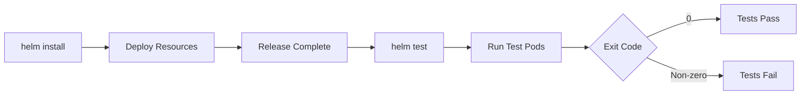
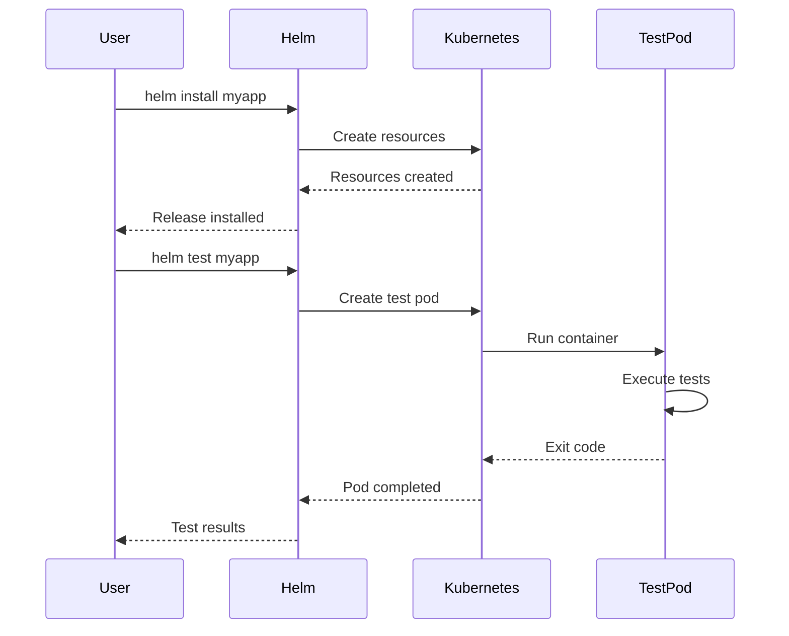
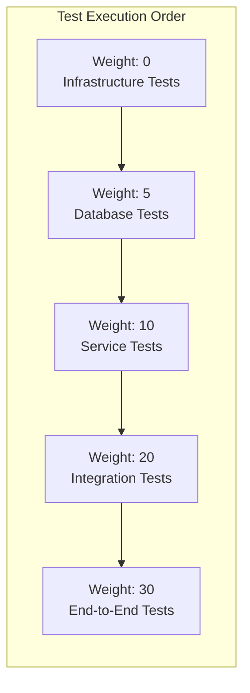

# How to Build Helm Test Hooks

Author: [nawazdhandala](https://github.com/nawazdhandala)

Tags: Helm, Kubernetes, Testing, Hooks

Description: A practical guide to building Helm test hooks for validating your Kubernetes deployments, from simple connectivity tests to comprehensive integration test suites.

---

Deploying applications to Kubernetes is only half the battle. The real question is: does it actually work? Helm test hooks let you validate that your release is functioning correctly after deployment. Instead of manually checking pods and services, you can automate verification and catch issues before they reach production.

## What Are Helm Test Hooks?

Helm test hooks are Kubernetes resources (typically Pods or Jobs) that run after a release is installed or upgraded. They execute validation logic and report success or failure based on the exit code.



Test hooks are defined using the `helm.sh/hook: test` annotation. When you run `helm test <release-name>`, Helm creates these resources, waits for them to complete, and reports the results.

## Basic Test Hook Structure

A test hook is simply a Pod manifest with a special annotation. Place test files in your chart's `templates/` directory.

### Minimal Test Hook

```yaml
# templates/tests/test-connection.yaml
apiVersion: v1
kind: Pod
metadata:
  name: "{{ include "myapp.fullname" . }}-test-connection"
  labels:
    {{- include "myapp.labels" . | nindent 4 }}
  annotations:
    "helm.sh/hook": test
spec:
  containers:
    - name: wget
      image: busybox
      command: ['wget']
      args: ['{{ include "myapp.fullname" . }}:{{ .Values.service.port }}']
  restartPolicy: Never
```

This test attempts to connect to your service. If the connection succeeds, the pod exits with code 0 (success). If it fails, the exit code is non-zero (failure).

### Running Tests

```bash
# Install your chart
helm install myapp ./myapp

# Run tests
helm test myapp

# View test results
helm test myapp --logs
```

## Test Hook Lifecycle

Understanding when test hooks run is crucial for writing effective tests.



### Hook Annotations

| Annotation | Description |
|------------|-------------|
| `helm.sh/hook: test` | Marks resource as a test hook |
| `helm.sh/hook-weight` | Controls execution order (lower runs first) |
| `helm.sh/hook-delete-policy` | When to delete the test resource |

### Delete Policies

Control what happens to test pods after execution:

```yaml
annotations:
  "helm.sh/hook": test
  "helm.sh/hook-delete-policy": before-hook-creation,hook-succeeded
```

Available policies:
- `before-hook-creation` - Delete previous test pod before creating new one
- `hook-succeeded` - Delete if test passes
- `hook-failed` - Delete if test fails

## Practical Test Examples

### Example 1: HTTP Health Check

Test that your application responds to health checks:

```yaml
# templates/tests/test-health.yaml
apiVersion: v1
kind: Pod
metadata:
  name: "{{ include "myapp.fullname" . }}-test-health"
  annotations:
    "helm.sh/hook": test
    "helm.sh/hook-delete-policy": before-hook-creation,hook-succeeded
spec:
  containers:
    - name: curl
      image: curlimages/curl:8.5.0
      command:
        - /bin/sh
        - -c
        - |
          set -e
          echo "Testing health endpoint..."

          # Test liveness
          curl -sf http://{{ include "myapp.fullname" . }}:{{ .Values.service.port }}/health/live
          echo "Liveness check passed"

          # Test readiness
          curl -sf http://{{ include "myapp.fullname" . }}:{{ .Values.service.port }}/health/ready
          echo "Readiness check passed"

          echo "All health checks passed!"
  restartPolicy: Never
```

### Example 2: Database Connectivity Test

Verify your application can connect to its database:

```yaml
# templates/tests/test-database.yaml
apiVersion: v1
kind: Pod
metadata:
  name: "{{ include "myapp.fullname" . }}-test-db"
  annotations:
    "helm.sh/hook": test
    "helm.sh/hook-weight": "5"
    "helm.sh/hook-delete-policy": before-hook-creation,hook-succeeded
spec:
  containers:
    - name: psql
      image: postgres:16-alpine
      env:
        - name: PGPASSWORD
          valueFrom:
            secretKeyRef:
              name: {{ include "myapp.fullname" . }}-db-secret
              key: password
      command:
        - /bin/sh
        - -c
        - |
          set -e
          echo "Testing database connection..."

          psql -h {{ .Values.database.host }} \
               -U {{ .Values.database.user }} \
               -d {{ .Values.database.name }} \
               -c "SELECT 1;"

          echo "Database connection successful!"
  restartPolicy: Never
```

### Example 3: API Endpoint Validation

Test that critical API endpoints return expected responses:

```yaml
# templates/tests/test-api.yaml
apiVersion: v1
kind: Pod
metadata:
  name: "{{ include "myapp.fullname" . }}-test-api"
  annotations:
    "helm.sh/hook": test
    "helm.sh/hook-weight": "10"
    "helm.sh/hook-delete-policy": before-hook-creation,hook-succeeded
spec:
  containers:
    - name: test
      image: curlimages/curl:8.5.0
      command:
        - /bin/sh
        - -c
        - |
          set -e
          BASE_URL="http://{{ include "myapp.fullname" . }}:{{ .Values.service.port }}"

          echo "Testing API version endpoint..."
          VERSION=$(curl -sf "$BASE_URL/api/version" | grep -o '"version":"[^"]*"')
          if [ -z "$VERSION" ]; then
            echo "FAIL: Version endpoint did not return expected format"
            exit 1
          fi
          echo "PASS: Version endpoint returned $VERSION"

          echo "Testing API authentication..."
          STATUS=$(curl -s -o /dev/null -w "%{http_code}" "$BASE_URL/api/protected")
          if [ "$STATUS" != "401" ]; then
            echo "FAIL: Protected endpoint should return 401, got $STATUS"
            exit 1
          fi
          echo "PASS: Protected endpoint correctly returns 401"

          echo "All API tests passed!"
  restartPolicy: Never
```

### Example 4: Redis Connectivity Test

Verify Redis is accessible and functional:

```yaml
# templates/tests/test-redis.yaml
apiVersion: v1
kind: Pod
metadata:
  name: "{{ include "myapp.fullname" . }}-test-redis"
  annotations:
    "helm.sh/hook": test
    "helm.sh/hook-weight": "5"
    "helm.sh/hook-delete-policy": before-hook-creation,hook-succeeded
spec:
  containers:
    - name: redis
      image: redis:7-alpine
      command:
        - /bin/sh
        - -c
        - |
          set -e
          REDIS_HOST="{{ .Values.redis.host }}"
          REDIS_PORT="{{ .Values.redis.port }}"

          echo "Testing Redis connection..."

          # Test PING
          PONG=$(redis-cli -h $REDIS_HOST -p $REDIS_PORT PING)
          if [ "$PONG" != "PONG" ]; then
            echo "FAIL: Redis PING failed"
            exit 1
          fi
          echo "PASS: Redis PING successful"

          # Test SET/GET
          redis-cli -h $REDIS_HOST -p $REDIS_PORT SET helm-test-key "helm-test-value" EX 10
          VALUE=$(redis-cli -h $REDIS_HOST -p $REDIS_PORT GET helm-test-key)
          if [ "$VALUE" != "helm-test-value" ]; then
            echo "FAIL: Redis SET/GET failed"
            exit 1
          fi
          echo "PASS: Redis SET/GET successful"

          echo "All Redis tests passed!"
  restartPolicy: Never
```

## Using Jobs Instead of Pods

For more complex tests, use Jobs for better retry handling and parallelism:

```yaml
# templates/tests/test-integration.yaml
apiVersion: batch/v1
kind: Job
metadata:
  name: "{{ include "myapp.fullname" . }}-test-integration"
  annotations:
    "helm.sh/hook": test
    "helm.sh/hook-weight": "20"
    "helm.sh/hook-delete-policy": before-hook-creation,hook-succeeded
spec:
  backoffLimit: 2
  activeDeadlineSeconds: 300
  template:
    spec:
      containers:
        - name: integration-tests
          image: "{{ .Values.image.repository }}:{{ .Values.image.tag }}"
          command:
            - /bin/sh
            - -c
            - |
              set -e
              echo "Running integration tests..."

              # Run your test suite
              npm run test:integration

              echo "Integration tests completed!"
          env:
            - name: API_URL
              value: "http://{{ include "myapp.fullname" . }}:{{ .Values.service.port }}"
            - name: NODE_ENV
              value: "test"
      restartPolicy: Never
```

## Organizing Multiple Tests

For complex applications, organize tests by category and control execution order:



### Test Directory Structure

```
myapp/
  templates/
    tests/
      test-connection.yaml      # Weight: 0
      test-database.yaml        # Weight: 5
      test-redis.yaml           # Weight: 5
      test-api-health.yaml      # Weight: 10
      test-api-endpoints.yaml   # Weight: 10
      test-integration.yaml     # Weight: 20
```

### Conditional Tests

Enable or disable tests based on values:

```yaml
# templates/tests/test-database.yaml
{{- if .Values.database.enabled }}
apiVersion: v1
kind: Pod
metadata:
  name: "{{ include "myapp.fullname" . }}-test-db"
  annotations:
    "helm.sh/hook": test
spec:
  # ... test definition
{{- end }}
```

## Advanced Patterns

### Pattern 1: Test with ConfigMap Scripts

Keep test logic maintainable by storing scripts in ConfigMaps:

```yaml
# templates/tests/test-scripts-configmap.yaml
apiVersion: v1
kind: ConfigMap
metadata:
  name: "{{ include "myapp.fullname" . }}-test-scripts"
  annotations:
    "helm.sh/hook": test
    "helm.sh/hook-weight": "-5"
    "helm.sh/hook-delete-policy": before-hook-creation,hook-succeeded
data:
  run-tests.sh: |
    #!/bin/sh
    set -e

    test_health() {
      echo "Testing health..."
      curl -sf "$API_URL/health" || return 1
    }

    test_api() {
      echo "Testing API..."
      curl -sf "$API_URL/api/v1/status" || return 1
    }

    main() {
      test_health
      test_api
      echo "All tests passed!"
    }

    main
---
# templates/tests/test-runner.yaml
apiVersion: v1
kind: Pod
metadata:
  name: "{{ include "myapp.fullname" . }}-test-runner"
  annotations:
    "helm.sh/hook": test
    "helm.sh/hook-weight": "0"
    "helm.sh/hook-delete-policy": before-hook-creation,hook-succeeded
spec:
  containers:
    - name: test
      image: curlimages/curl:8.5.0
      command: ["/bin/sh", "/scripts/run-tests.sh"]
      env:
        - name: API_URL
          value: "http://{{ include "myapp.fullname" . }}:{{ .Values.service.port }}"
      volumeMounts:
        - name: scripts
          mountPath: /scripts
  volumes:
    - name: scripts
      configMap:
        name: "{{ include "myapp.fullname" . }}-test-scripts"
        defaultMode: 0755
  restartPolicy: Never
```

### Pattern 2: Test with Service Account

When tests need Kubernetes API access:

```yaml
# templates/tests/test-k8s-resources.yaml
apiVersion: v1
kind: ServiceAccount
metadata:
  name: "{{ include "myapp.fullname" . }}-test-sa"
  annotations:
    "helm.sh/hook": test
    "helm.sh/hook-weight": "-10"
    "helm.sh/hook-delete-policy": before-hook-creation,hook-succeeded
---
apiVersion: rbac.authorization.k8s.io/v1
kind: Role
metadata:
  name: "{{ include "myapp.fullname" . }}-test-role"
  annotations:
    "helm.sh/hook": test
    "helm.sh/hook-weight": "-10"
    "helm.sh/hook-delete-policy": before-hook-creation,hook-succeeded
rules:
  - apiGroups: [""]
    resources: ["pods", "services"]
    verbs: ["get", "list"]
---
apiVersion: rbac.authorization.k8s.io/v1
kind: RoleBinding
metadata:
  name: "{{ include "myapp.fullname" . }}-test-rolebinding"
  annotations:
    "helm.sh/hook": test
    "helm.sh/hook-weight": "-10"
    "helm.sh/hook-delete-policy": before-hook-creation,hook-succeeded
subjects:
  - kind: ServiceAccount
    name: "{{ include "myapp.fullname" . }}-test-sa"
roleRef:
  kind: Role
  name: "{{ include "myapp.fullname" . }}-test-role"
  apiGroup: rbac.authorization.k8s.io
---
apiVersion: v1
kind: Pod
metadata:
  name: "{{ include "myapp.fullname" . }}-test-k8s"
  annotations:
    "helm.sh/hook": test
    "helm.sh/hook-weight": "15"
    "helm.sh/hook-delete-policy": before-hook-creation,hook-succeeded
spec:
  serviceAccountName: "{{ include "myapp.fullname" . }}-test-sa"
  containers:
    - name: kubectl
      image: bitnami/kubectl:1.29
      command:
        - /bin/sh
        - -c
        - |
          set -e

          echo "Verifying pod count..."
          PODS=$(kubectl get pods -l app.kubernetes.io/instance={{ .Release.Name }} --no-headers | wc -l)
          if [ "$PODS" -lt "{{ .Values.replicaCount }}" ]; then
            echo "FAIL: Expected at least {{ .Values.replicaCount }} pods, found $PODS"
            exit 1
          fi
          echo "PASS: Found $PODS pods"

          echo "Verifying all pods are running..."
          NOT_RUNNING=$(kubectl get pods -l app.kubernetes.io/instance={{ .Release.Name }} --no-headers | grep -v Running | wc -l)
          if [ "$NOT_RUNNING" -gt "0" ]; then
            echo "FAIL: Some pods are not running"
            kubectl get pods -l app.kubernetes.io/instance={{ .Release.Name }}
            exit 1
          fi
          echo "PASS: All pods are running"

          echo "Kubernetes resource tests passed!"
  restartPolicy: Never
```

### Pattern 3: Wait for Dependencies

Ensure dependencies are ready before testing:

```yaml
# templates/tests/test-with-wait.yaml
apiVersion: v1
kind: Pod
metadata:
  name: "{{ include "myapp.fullname" . }}-test-full"
  annotations:
    "helm.sh/hook": test
    "helm.sh/hook-weight": "25"
    "helm.sh/hook-delete-policy": before-hook-creation,hook-succeeded
spec:
  initContainers:
    - name: wait-for-api
      image: busybox:1.36
      command:
        - /bin/sh
        - -c
        - |
          echo "Waiting for API to be ready..."
          until wget -q --spider http://{{ include "myapp.fullname" . }}:{{ .Values.service.port }}/health/ready; do
            echo "API not ready, waiting..."
            sleep 5
          done
          echo "API is ready!"
  containers:
    - name: test
      image: curlimages/curl:8.5.0
      command:
        - /bin/sh
        - -c
        - |
          set -e
          BASE_URL="http://{{ include "myapp.fullname" . }}:{{ .Values.service.port }}"

          echo "Running full test suite..."

          # Add your comprehensive tests here
          curl -sf "$BASE_URL/api/v1/users" > /dev/null
          curl -sf "$BASE_URL/api/v1/products" > /dev/null

          echo "Full test suite passed!"
  restartPolicy: Never
```

## CI/CD Integration

### GitHub Actions Example

```yaml
# .github/workflows/helm-test.yml
name: Helm Test

on:
  pull_request:
    paths:
      - 'charts/**'

jobs:
  test:
    runs-on: ubuntu-latest
    steps:
      - uses: actions/checkout@v4

      - name: Set up Kubernetes
        uses: helm/kind-action@v1

      - name: Install Helm
        uses: azure/setup-helm@v4

      - name: Install chart
        run: |
          helm install myapp ./charts/myapp \
            --wait \
            --timeout 5m

      - name: Run Helm tests
        run: |
          helm test myapp --logs --timeout 10m

      - name: Get test logs on failure
        if: failure()
        run: |
          kubectl logs -l helm.sh/hook=test --tail=100
```

### GitLab CI Example

```yaml
# .gitlab-ci.yml
helm-test:
  stage: test
  image: alpine/helm:3.14
  services:
    - docker:dind
  before_script:
    - apk add --no-cache curl
    - curl -LO https://storage.googleapis.com/kubernetes-release/release/v1.29.0/bin/linux/amd64/kubectl
    - chmod +x kubectl && mv kubectl /usr/local/bin/
  script:
    - helm install myapp ./charts/myapp --wait --timeout 5m
    - helm test myapp --logs --timeout 10m
  after_script:
    - kubectl logs -l helm.sh/hook=test --tail=100 || true
```

## Debugging Failed Tests

When tests fail, use these commands to investigate:

```bash
# View test pod status
kubectl get pods -l helm.sh/hook=test

# Get detailed pod information
kubectl describe pod <test-pod-name>

# View test logs
kubectl logs <test-pod-name>

# Run tests with verbose output
helm test myapp --logs

# Keep failed test pods for debugging
# (Remove hook-failed from delete policy)
kubectl exec -it <test-pod-name> -- /bin/sh
```

### Common Issues and Solutions

| Issue | Cause | Solution |
|-------|-------|----------|
| Test pod stuck in Pending | Missing resources or node selector | Check events with `kubectl describe pod` |
| Connection refused | Service not ready | Add init container to wait for readiness |
| DNS resolution failed | DNS not propagated | Add retry logic or wait for DNS |
| Permission denied | Missing RBAC | Add ServiceAccount with proper Role |
| Timeout | Slow startup or deadlock | Increase timeout or check application logs |

## Best Practices

1. **Keep tests fast** - Tests should complete in seconds, not minutes. Long-running tests slow down deployments.

2. **Test one thing per hook** - Make tests focused and independent. This makes failures easier to diagnose.

3. **Use meaningful exit codes** - Exit 0 for success, non-zero for failure. Include clear error messages.

4. **Clean up after tests** - Use appropriate delete policies to avoid cluttering the cluster.

5. **Version your test images** - Pin specific image versions to ensure reproducible tests.

6. **Handle transient failures** - Add retry logic for network-dependent tests.

7. **Document test requirements** - Include comments explaining what each test validates.

8. **Test in staging first** - Run helm test in non-production environments before production deployments.

## Summary

Helm test hooks provide a powerful mechanism for validating deployments automatically. By implementing comprehensive tests, you can:

- Catch configuration errors before they impact users
- Verify connectivity between services
- Validate database migrations completed successfully
- Ensure API endpoints respond correctly
- Automate post-deployment verification in CI/CD pipelines

Start with simple connectivity tests and gradually add more comprehensive validation as your application matures. Remember that the goal is confidence in your deployments, not perfect test coverage.

---

Helm test hooks transform deployment verification from a manual checklist into an automated safety net. Build them into your charts from the start, and you will catch issues before they become incidents.
