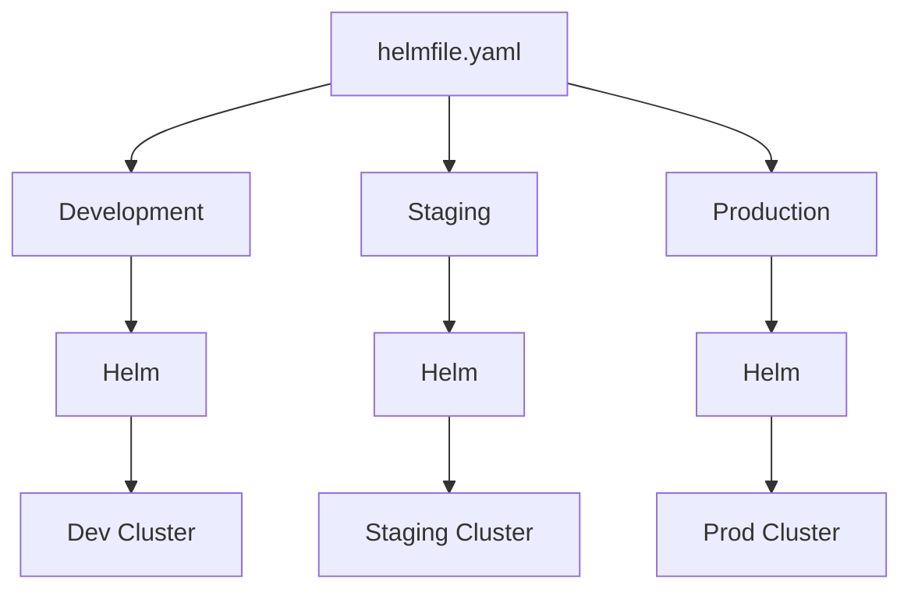
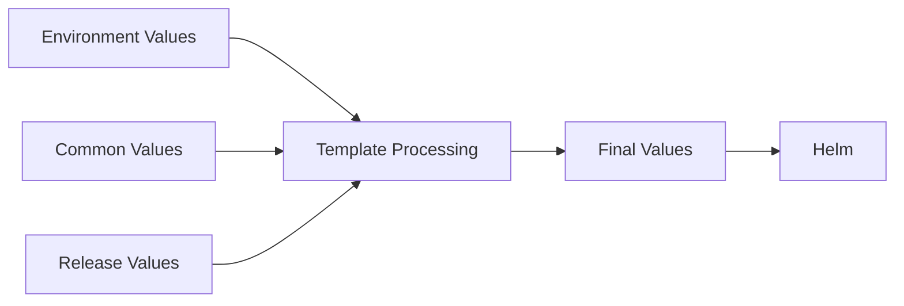
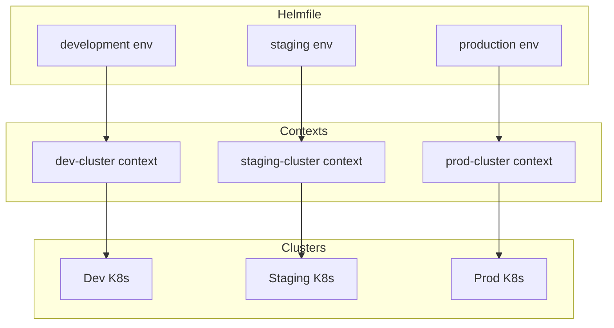
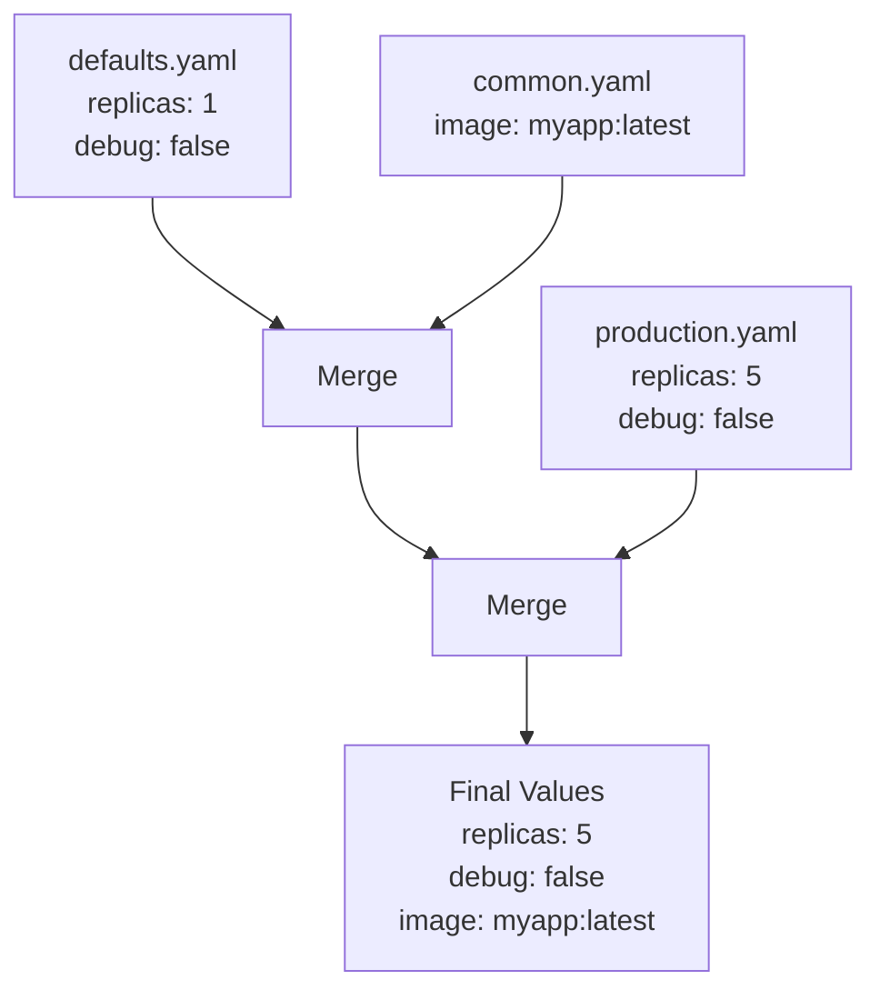

# How to Create Helmfile Environments

Author: [nawazdhandala](https://github.com/nawazdhandala)

Tags: Helmfile, Helm, Kubernetes, Configuration

Description: Learn how to structure and manage multiple Kubernetes environments using Helmfile with environment-specific values, secrets, and release configurations.

---

Helmfile is a declarative spec for deploying Helm charts. It lets you define multiple environments (dev, staging, production) in a single file and deploy consistently across all of them. No more copy-pasting values files or running manual Helm commands.

## What Is Helmfile?

Helmfile sits on top of Helm and adds environment management, templating, and orchestration.



Key benefits:
1. **DRY Configuration** - Define releases once, override per environment
2. **Consistent Deployments** - Same command deploys to any environment
3. **Version Control** - All configuration lives in Git
4. **Templating** - Use Go templates for dynamic values

## Installing Helmfile

Install Helmfile on your system.

```bash
# macOS
brew install helmfile

# Linux
curl -Lo helmfile https://github.com/helmfile/helmfile/releases/latest/download/helmfile_linux_amd64
chmod +x helmfile
sudo mv helmfile /usr/local/bin/

# Verify installation
helmfile version
```

You also need the Helm diff plugin for preview functionality.

```bash
helm plugin install https://github.com/databus23/helm-diff
```

## Basic Helmfile Structure

A minimal helmfile.yaml defines repositories and releases.

```yaml
# helmfile.yaml
repositories:
  - name: bitnami
    url: https://charts.bitnami.com/bitnami

releases:
  - name: redis
    namespace: cache
    chart: bitnami/redis
    version: 18.6.1
    values:
      - auth:
          enabled: true
          password: dev-password
```

Deploy with a single command.

```bash
helmfile sync
```

## Creating Environment-Specific Configurations

Environments let you define different values for each deployment target. The environments block at the top of your helmfile defines available environments and their values files.

```yaml
# helmfile.yaml
environments:
  development:
    values:
      - environments/development/values.yaml
  staging:
    values:
      - environments/staging/values.yaml
  production:
    values:
      - environments/production/values.yaml

repositories:
  - name: bitnami
    url: https://charts.bitnami.com/bitnami

releases:
  - name: redis
    namespace: cache
    chart: bitnami/redis
    version: 18.6.1
    values:
      - values/redis/common.yaml
      - values/redis/{{ .Environment.Name }}.yaml
```

Create the environment values files with settings specific to each environment.

```yaml
# environments/development/values.yaml
clusterName: dev-cluster
replicas: 1
resources:
  limits:
    memory: 256Mi
    cpu: 100m
```

```yaml
# environments/staging/values.yaml
clusterName: staging-cluster
replicas: 2
resources:
  limits:
    memory: 512Mi
    cpu: 250m
```

```yaml
# environments/production/values.yaml
clusterName: prod-cluster
replicas: 3
resources:
  limits:
    memory: 1Gi
    cpu: 500m
```

## Recommended Directory Structure

Organize your Helmfile project for clarity and maintainability.

```
helmfile-project/
├── helmfile.yaml              # Main helmfile
├── environments/
│   ├── development/
│   │   ├── values.yaml        # Dev environment variables
│   │   └── secrets.yaml       # Dev secrets (encrypted)
│   ├── staging/
│   │   ├── values.yaml
│   │   └── secrets.yaml
│   └── production/
│       ├── values.yaml
│       └── secrets.yaml
├── values/
│   ├── redis/
│   │   ├── common.yaml        # Shared across all environments
│   │   ├── development.yaml   # Dev-specific overrides
│   │   ├── staging.yaml
│   │   └── production.yaml
│   └── postgresql/
│       ├── common.yaml
│       ├── development.yaml
│       ├── staging.yaml
│       └── production.yaml
└── releases/
    ├── databases.yaml         # Database releases
    └── monitoring.yaml        # Monitoring stack releases
```

## Using Environment Variables in Values

Reference environment-level values inside your release configurations using Go templating.

```yaml
# helmfile.yaml
environments:
  development:
    values:
      - environments/development/values.yaml
  production:
    values:
      - environments/production/values.yaml

releases:
  - name: myapp
    namespace: {{ .Environment.Values.namespace | default "default" }}
    chart: ./charts/myapp
    values:
      - replicas: {{ .Environment.Values.replicas | default 1 }}
      - resources:
          limits:
            memory: {{ .Environment.Values.resources.limits.memory }}
            cpu: {{ .Environment.Values.resources.limits.cpu }}
```

The flow of value resolution looks like this.



## Deploying to Specific Environments

Use the `-e` flag to target a specific environment.

```bash
# Deploy to development
helmfile -e development sync

# Deploy to staging
helmfile -e staging sync

# Deploy to production
helmfile -e production sync
```

Preview changes before applying them.

```bash
# Show what will change
helmfile -e staging diff

# Show rendered values
helmfile -e staging template
```

## Managing Secrets with SOPS

Helmfile integrates with SOPS for encrypted secrets. First, create an encrypted secrets file.

```bash
# Create .sops.yaml for encryption rules
cat > .sops.yaml << 'EOF'
creation_rules:
  - path_regex: .*secrets.*\.yaml$
    age: age1ql3z7hjy54pw3hyww5ayyfg7zqgvc7w3j2elw8zmrj2kg5sfn9aqmcac8p
EOF

# Encrypt a secrets file
sops -e secrets.yaml > secrets.enc.yaml
```

Reference encrypted secrets in your helmfile.

```yaml
# helmfile.yaml
environments:
  production:
    values:
      - environments/production/values.yaml
    secrets:
      - environments/production/secrets.yaml

releases:
  - name: myapp
    chart: ./charts/myapp
    values:
      - database:
          password: {{ .Environment.Values.dbPassword }}
```

The secrets file contains sensitive values that SOPS encrypts.

```yaml
# environments/production/secrets.yaml (before encryption)
dbPassword: super-secret-password
apiKey: sk-1234567890abcdef
```

## Conditional Releases per Environment

Enable or disable releases based on the environment using the `installed` field.

```yaml
# helmfile.yaml
environments:
  development:
    values:
      - installMonitoring: false
      - installDebugTools: true
  production:
    values:
      - installMonitoring: true
      - installDebugTools: false

releases:
  - name: prometheus
    chart: prometheus-community/prometheus
    installed: {{ .Environment.Values.installMonitoring }}

  - name: debug-toolkit
    chart: ./charts/debug-toolkit
    installed: {{ .Environment.Values.installDebugTools }}
```

## Using Multiple Helmfiles

Split large configurations into multiple files for better organization.

```yaml
# helmfile.yaml
helmfiles:
  - path: releases/databases.yaml
    values:
      - environment: {{ .Environment.Name }}
  - path: releases/monitoring.yaml
    values:
      - environment: {{ .Environment.Name }}
  - path: releases/applications.yaml
    values:
      - environment: {{ .Environment.Name }}
```

Each sub-helmfile can define its own releases.

```yaml
# releases/databases.yaml
releases:
  - name: postgresql
    namespace: databases
    chart: bitnami/postgresql
    version: 13.2.24
    values:
      - ../values/postgresql/common.yaml
      - ../values/postgresql/{{ .Values.environment }}.yaml

  - name: redis
    namespace: databases
    chart: bitnami/redis
    version: 18.6.1
    values:
      - ../values/redis/common.yaml
      - ../values/redis/{{ .Values.environment }}.yaml
```

## Environment-Specific Kubernetes Contexts

Configure different Kubernetes contexts for each environment.

```yaml
# helmfile.yaml
environments:
  development:
    kubeContext: dev-cluster
    values:
      - environments/development/values.yaml
  staging:
    kubeContext: staging-cluster
    values:
      - environments/staging/values.yaml
  production:
    kubeContext: prod-cluster
    values:
      - environments/production/values.yaml
```

This ensures deployments go to the correct cluster automatically.



## Layered Values with Precedence

Helmfile merges values in order, with later files overriding earlier ones.

```yaml
releases:
  - name: myapp
    chart: ./charts/myapp
    values:
      # Layer 1: Defaults (lowest priority)
      - values/myapp/defaults.yaml
      # Layer 2: Common settings
      - values/myapp/common.yaml
      # Layer 3: Environment-specific (highest priority)
      - values/myapp/{{ .Environment.Name }}.yaml
```

The merge order ensures environment-specific settings always win.



## Complete Example

Here is a full helmfile.yaml demonstrating all the concepts.

```yaml
# helmfile.yaml
environments:
  development:
    kubeContext: dev-cluster
    values:
      - environments/development/values.yaml
    secrets:
      - environments/development/secrets.yaml
  staging:
    kubeContext: staging-cluster
    values:
      - environments/staging/values.yaml
    secrets:
      - environments/staging/secrets.yaml
  production:
    kubeContext: prod-cluster
    values:
      - environments/production/values.yaml
    secrets:
      - environments/production/secrets.yaml

repositories:
  - name: bitnami
    url: https://charts.bitnami.com/bitnami
  - name: prometheus-community
    url: https://prometheus-community.github.io/helm-charts

releases:
  # Core application
  - name: myapp
    namespace: {{ .Environment.Values.namespace }}
    chart: ./charts/myapp
    version: 1.0.0
    values:
      - values/myapp/common.yaml
      - values/myapp/{{ .Environment.Name }}.yaml
      - image:
          tag: {{ .Environment.Values.imageTag | default "latest" }}
      - secrets:
          dbPassword: {{ .Environment.Values.dbPassword }}
    wait: true
    timeout: 300

  # Database
  - name: postgresql
    namespace: {{ .Environment.Values.namespace }}
    chart: bitnami/postgresql
    version: 13.2.24
    values:
      - values/postgresql/common.yaml
      - values/postgresql/{{ .Environment.Name }}.yaml
    installed: {{ .Environment.Values.installDatabase | default true }}

  # Monitoring (production only)
  - name: prometheus
    namespace: monitoring
    chart: prometheus-community/prometheus
    version: 25.8.0
    values:
      - values/prometheus/{{ .Environment.Name }}.yaml
    installed: {{ .Environment.Values.installMonitoring | default false }}
```

## Best Practices

1. **Always use environment-specific namespaces** - Prevent accidental cross-environment deployments
2. **Encrypt all secrets** - Use SOPS or another encryption tool for sensitive values
3. **Version pin charts** - Always specify chart versions to ensure reproducible deployments
4. **Use diff before sync** - Always preview changes before applying
5. **Separate concerns** - Split large helmfiles into logical groups
6. **Use CI/CD** - Automate deployments through pipelines, not manual commands

## Common Commands Reference

```bash
# List all releases for an environment
helmfile -e production list

# Show differences before deploying
helmfile -e production diff

# Deploy all releases
helmfile -e production sync

# Deploy specific releases
helmfile -e production -l name=myapp sync

# Render templates without deploying
helmfile -e production template

# Destroy all releases
helmfile -e production destroy

# Update chart repositories
helmfile repos
```

---

Helmfile transforms Helm chart management from scattered scripts into declarative, reproducible infrastructure. Start with a simple setup, add environments as you need them, and let Helmfile handle the complexity of multi-environment deployments.
