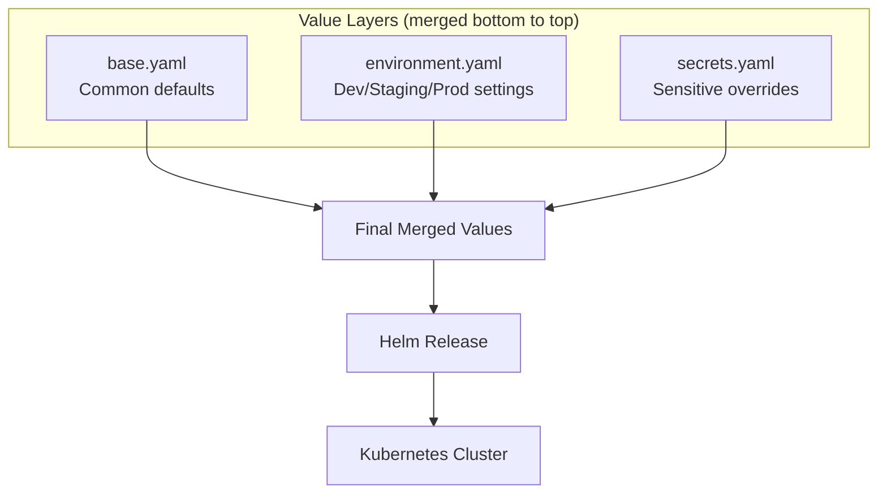
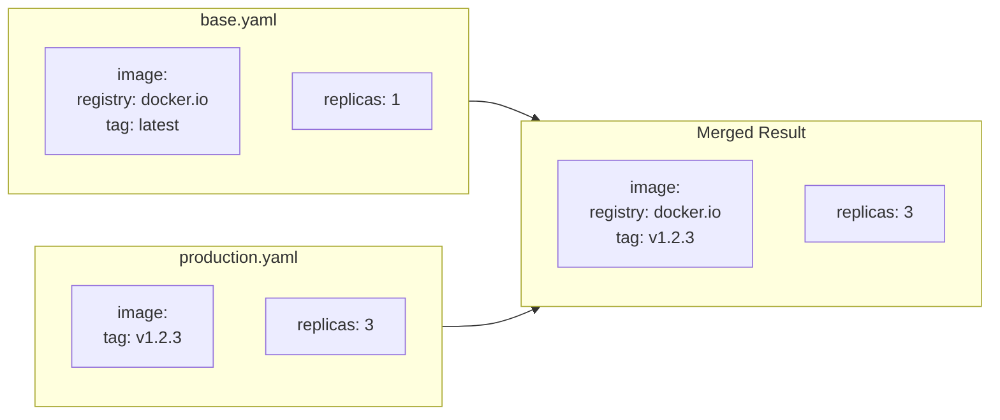
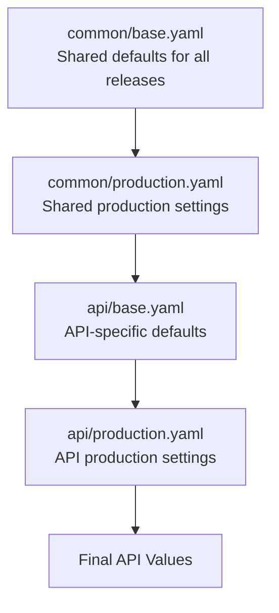

# How to Create Helmfile Layering

Author: [nawazdhandala](https://github.com/nawazdhandala)

Tags: Helmfile, Helm, Kubernetes, Configuration

Description: Learn how to structure Helmfile configurations using layered values files for managing multiple environments with minimal duplication.

---

Helmfile layering lets you organize your Helm releases with shared base configurations and environment-specific overrides. Instead of duplicating values across dev, staging, and production, you define common settings once and layer environment-specific values on top.

## What Is Helmfile Layering?

Helmfile layering is a pattern where you split your Helm values into multiple files that get merged in order. Base values provide defaults, and environment-specific files override only what needs to change.



Benefits of layering:
1. **DRY Configuration** - Write common settings once
2. **Clear Overrides** - See exactly what differs per environment
3. **Reduced Errors** - Less copy-paste means fewer mistakes
4. **Easy Auditing** - Track environment differences in version control

## Basic Helmfile Structure

Here is a minimal helmfile.yaml that defines releases and their values.

```yaml
# helmfile.yaml
repositories:
  - name: bitnami
    url: https://charts.bitnami.com/bitnami

releases:
  - name: nginx
    namespace: web
    chart: bitnami/nginx
    version: 15.0.0
    values:
      - values/base.yaml
      - values/{{ .Environment.Name }}.yaml
```

The values files are merged in order. Later files override earlier ones.

## Directory Structure

Organize your Helmfile project with a clear hierarchy.

```
helmfile-project/
├── helmfile.yaml
├── environments/
│   ├── default.yaml
│   ├── development.yaml
│   ├── staging.yaml
│   └── production.yaml
├── values/
│   ├── base.yaml
│   ├── development.yaml
│   ├── staging.yaml
│   └── production.yaml
└── releases/
    ├── nginx.yaml
    ├── redis.yaml
    └── postgres.yaml
```

## Environment Configuration

Define your environments at the top of your helmfile.yaml.

```yaml
# helmfile.yaml
environments:
  default:
    values:
      - environments/default.yaml
  development:
    values:
      - environments/development.yaml
  staging:
    values:
      - environments/staging.yaml
  production:
    values:
      - environments/production.yaml

repositories:
  - name: bitnami
    url: https://charts.bitnami.com/bitnami

releases:
  - name: nginx
    namespace: {{ .Values.namespace }}
    chart: bitnami/nginx
    version: 15.0.0
    values:
      - values/base.yaml
      - values/{{ .Environment.Name }}.yaml
```

Environment files define variables available throughout your helmfile.

```yaml
# environments/development.yaml
namespace: dev
domain: dev.example.com
replicas: 1
resources:
  requests:
    cpu: 100m
    memory: 128Mi
  limits:
    cpu: 200m
    memory: 256Mi
```

```yaml
# environments/production.yaml
namespace: prod
domain: example.com
replicas: 3
resources:
  requests:
    cpu: 500m
    memory: 512Mi
  limits:
    cpu: 1000m
    memory: 1Gi
```

## Layered Values Files

The real power comes from layered values. Start with a base that works for all environments.

```yaml
# values/base.yaml
image:
  registry: docker.io
  repository: nginx
  pullPolicy: IfNotPresent

service:
  type: ClusterIP
  port: 80

ingress:
  enabled: true
  pathType: Prefix
  path: /

metrics:
  enabled: true
  serviceMonitor:
    enabled: true

resources: {}
```

Then override specific values per environment.

```yaml
# values/development.yaml
replicaCount: 1

image:
  tag: latest
  pullPolicy: Always

ingress:
  hostname: dev.example.com
  tls: false

resources:
  requests:
    cpu: 100m
    memory: 128Mi
```

```yaml
# values/staging.yaml
replicaCount: 2

image:
  tag: staging

ingress:
  hostname: staging.example.com
  tls: true
  annotations:
    cert-manager.io/cluster-issuer: letsencrypt-staging

resources:
  requests:
    cpu: 250m
    memory: 256Mi
  limits:
    cpu: 500m
    memory: 512Mi
```

```yaml
# values/production.yaml
replicaCount: 3

image:
  tag: v1.2.3

ingress:
  hostname: example.com
  tls: true
  annotations:
    cert-manager.io/cluster-issuer: letsencrypt-prod

resources:
  requests:
    cpu: 500m
    memory: 512Mi
  limits:
    cpu: 1000m
    memory: 1Gi

podDisruptionBudget:
  enabled: true
  minAvailable: 2
```

## How Merging Works

Understanding merge behavior is critical. Helmfile uses deep merge by default.



Nested objects are merged recursively. In this example, image.registry from base is preserved while image.tag from production overrides the base value.

## Multiple Release Layers

For complex deployments, layer values at the release level too.

```yaml
# helmfile.yaml
environments:
  development:
    values:
      - environments/development.yaml
  production:
    values:
      - environments/production.yaml

releases:
  - name: api
    namespace: {{ .Values.namespace }}
    chart: ./charts/api
    values:
      - values/common/base.yaml
      - values/common/{{ .Environment.Name }}.yaml
      - values/api/base.yaml
      - values/api/{{ .Environment.Name }}.yaml

  - name: worker
    namespace: {{ .Values.namespace }}
    chart: ./charts/worker
    values:
      - values/common/base.yaml
      - values/common/{{ .Environment.Name }}.yaml
      - values/worker/base.yaml
      - values/worker/{{ .Environment.Name }}.yaml

  - name: scheduler
    namespace: {{ .Values.namespace }}
    chart: ./charts/scheduler
    values:
      - values/common/base.yaml
      - values/common/{{ .Environment.Name }}.yaml
      - values/scheduler/base.yaml
      - values/scheduler/{{ .Environment.Name }}.yaml
```

The merge order is: common base, common environment, release base, release environment.



## Conditional Values Files

Sometimes a values file might not exist for every environment. Use missingFileHandler to handle this gracefully.

```yaml
# helmfile.yaml
helmDefaults:
  missingFileHandler: Warn  # Options: Error, Warn, Debug

releases:
  - name: nginx
    chart: bitnami/nginx
    values:
      - values/base.yaml
      - values/{{ .Environment.Name }}.yaml
      - values/{{ .Environment.Name }}-secrets.yaml  # May not exist
```

Or check for file existence with a conditional.

```yaml
releases:
  - name: nginx
    chart: bitnami/nginx
    values:
      - values/base.yaml
      - values/{{ .Environment.Name }}.yaml
      {{ if eq .Environment.Name "production" }}
      - values/production-ha.yaml
      {{ end }}
```

## Using Go Templates

Helmfile supports Go templates for dynamic configuration.

```yaml
# helmfile.yaml
environments:
  development:
    values:
      - cluster: dev-cluster
        region: us-east-1
  production:
    values:
      - cluster: prod-cluster
        region: us-west-2

releases:
  - name: app
    chart: ./charts/app
    values:
      - values/base.yaml
      - |
        cluster: {{ .Values.cluster }}
        region: {{ .Values.region }}
        fullDomain: {{ .Values.cluster }}.{{ .Values.region }}.example.com
```

## Secrets Management

Keep secrets separate from regular values.

```yaml
# helmfile.yaml
releases:
  - name: app
    chart: ./charts/app
    values:
      - values/base.yaml
      - values/{{ .Environment.Name }}.yaml
    secrets:
      - secrets/{{ .Environment.Name }}.yaml
```

Secrets files are decrypted at runtime using helm-secrets or SOPS.

```yaml
# secrets/production.yaml (encrypted with SOPS)
database:
    password: ENC[AES256_GCM,data:...,type:str]
api:
    key: ENC[AES256_GCM,data:...,type:str]
```

Encrypt secrets with SOPS.

```bash
# Encrypt a secrets file
sops -e secrets/production.yaml.dec > secrets/production.yaml

# Edit encrypted file in place
sops secrets/production.yaml
```

## Helmfile Subhelmfiles

For large projects, split into multiple helmfiles.

```yaml
# helmfile.yaml
helmfiles:
  - path: helmfile.d/infrastructure.yaml
    values:
      - environments/{{ .Environment.Name }}.yaml
  - path: helmfile.d/applications.yaml
    values:
      - environments/{{ .Environment.Name }}.yaml
  - path: helmfile.d/monitoring.yaml
    values:
      - environments/{{ .Environment.Name }}.yaml
```

Each subhelmfile inherits the environment context.

```yaml
# helmfile.d/infrastructure.yaml
releases:
  - name: cert-manager
    namespace: cert-manager
    chart: jetstack/cert-manager
    values:
      - ../values/cert-manager/base.yaml
      - ../values/cert-manager/{{ .Environment.Name }}.yaml

  - name: ingress-nginx
    namespace: ingress-nginx
    chart: ingress-nginx/ingress-nginx
    values:
      - ../values/ingress-nginx/base.yaml
      - ../values/ingress-nginx/{{ .Environment.Name }}.yaml
```

## Complete Example

Here is a full working example with proper layering.

```yaml
# helmfile.yaml
environments:
  development:
    values:
      - environments/development.yaml
  staging:
    values:
      - environments/staging.yaml
  production:
    values:
      - environments/production.yaml
    secrets:
      - environments/production-secrets.yaml

repositories:
  - name: bitnami
    url: https://charts.bitnami.com/bitnami
  - name: ingress-nginx
    url: https://kubernetes.github.io/ingress-nginx

helmDefaults:
  wait: true
  timeout: 300
  createNamespace: true
  missingFileHandler: Warn

releases:
  - name: ingress
    namespace: ingress-nginx
    chart: ingress-nginx/ingress-nginx
    version: 4.8.0
    values:
      - values/ingress/base.yaml
      - values/ingress/{{ .Environment.Name }}.yaml

  - name: redis
    namespace: {{ .Values.namespace }}
    chart: bitnami/redis
    version: 18.0.0
    values:
      - values/redis/base.yaml
      - values/redis/{{ .Environment.Name }}.yaml

  - name: postgresql
    namespace: {{ .Values.namespace }}
    chart: bitnami/postgresql
    version: 13.0.0
    values:
      - values/postgresql/base.yaml
      - values/postgresql/{{ .Environment.Name }}.yaml
    secrets:
      - secrets/postgresql/{{ .Environment.Name }}.yaml

  - name: app
    namespace: {{ .Values.namespace }}
    chart: ./charts/app
    values:
      - values/app/base.yaml
      - values/app/{{ .Environment.Name }}.yaml
    secrets:
      - secrets/app/{{ .Environment.Name }}.yaml
    needs:
      - {{ .Values.namespace }}/redis
      - {{ .Values.namespace }}/postgresql
```

## Deploying with Helmfile

Run helmfile commands with the target environment.

```bash
# Preview changes for development
helmfile -e development diff

# Deploy to staging
helmfile -e staging apply

# Deploy to production with confirmation
helmfile -e production apply --interactive

# Sync specific release
helmfile -e production -l name=app sync

# Destroy all releases in development
helmfile -e development destroy
```

## Debugging Layers

When values are not merging as expected, use template to see the final result.

```bash
# Show final values for a release
helmfile -e production template --include-crds | less

# Write rendered values to file
helmfile -e production write-values --output-file-template "rendered-{{ .Release.Name }}.yaml"

# Show what helmfile would do
helmfile -e production --debug diff
```

## Best Practices

### 1. Keep Base Values Minimal

Only include settings that are truly common across all environments.

```yaml
# values/base.yaml - Good
image:
  pullPolicy: IfNotPresent
service:
  type: ClusterIP

# values/base.yaml - Bad (environment-specific)
replicaCount: 3  # Varies by environment
ingress:
  hostname: example.com  # Different per environment
```

### 2. Use Explicit Override Files

Name files clearly to show their purpose.

```
values/
├── base.yaml              # Shared defaults
├── development.yaml       # Dev overrides
├── staging.yaml           # Staging overrides
├── production.yaml        # Prod overrides
└── production-ha.yaml     # Prod high-availability extras
```

### 3. Document Layer Order

Add comments explaining the merge order.

```yaml
releases:
  - name: app
    values:
      # Layer 1: Chart defaults (implicit)
      # Layer 2: Organization-wide defaults
      - values/org-defaults.yaml
      # Layer 3: Application base
      - values/app/base.yaml
      # Layer 4: Environment-specific
      - values/app/{{ .Environment.Name }}.yaml
      # Layer 5: Secrets (highest priority)
    secrets:
      - secrets/app/{{ .Environment.Name }}.yaml
```

### 4. Validate Before Deploy

Always diff before applying.

```bash
# Make diff part of your CI/CD
helmfile -e production diff --detailed-exitcode
if [ $? -eq 2 ]; then
  echo "Changes detected, proceeding with deployment"
  helmfile -e production apply
fi
```

---

Helmfile layering keeps your Kubernetes configurations organized and maintainable. Start with a simple base plus environment structure, then expand to multiple layers as your needs grow. The key is making the merge order predictable and keeping each layer focused on its specific purpose.
