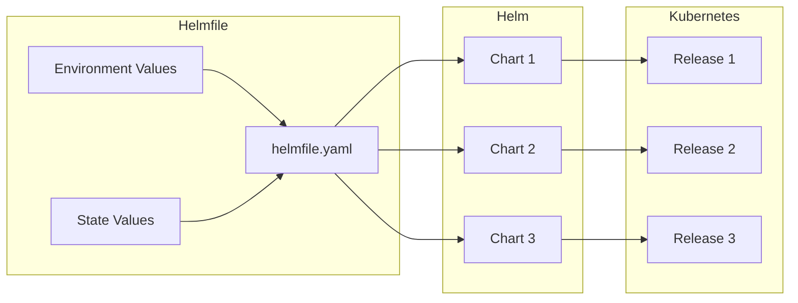
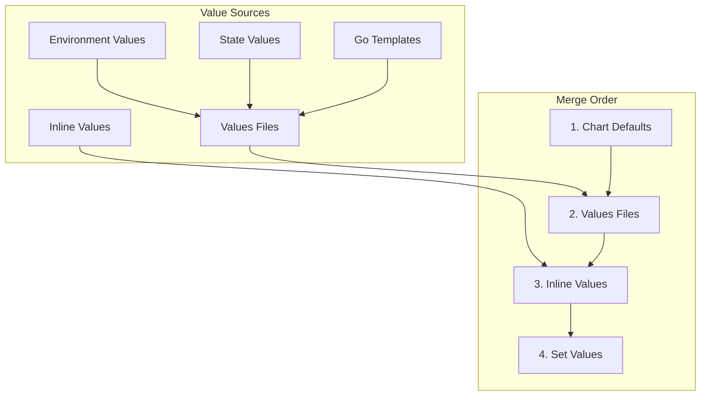
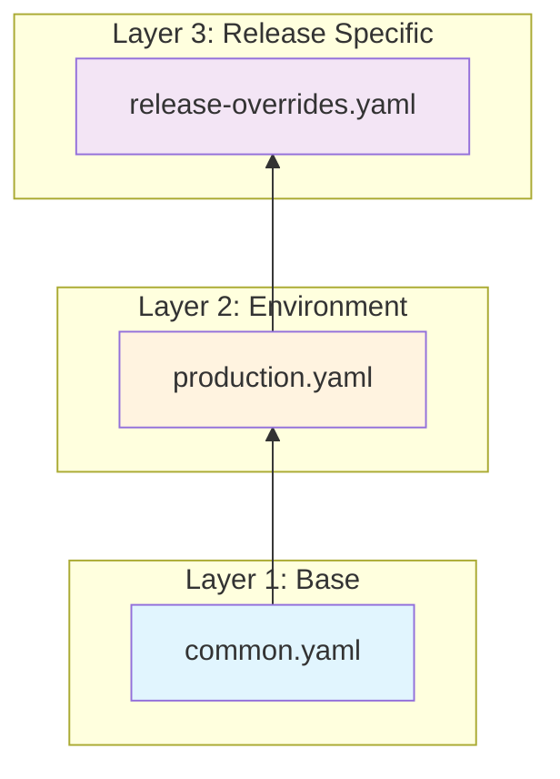

# How to Build Helmfile State Values

Author: [nawazdhandala](https://github.com/nawazdhandala)

Tags: Helmfile, Helm, Kubernetes, State

Description: A comprehensive guide to structuring and managing Helmfile state values for scalable, maintainable Kubernetes deployments across multiple environments.

---

Helmfile is a declarative spec for deploying Helm charts. While Helm manages individual releases, Helmfile orchestrates multiple releases across environments. The key to mastering Helmfile lies in understanding how to structure your state values effectively.

## What Is Helmfile?

Helmfile wraps Helm with a declarative layer that defines your entire cluster state in a single file or set of files. Instead of running multiple `helm install` commands, you define everything in `helmfile.yaml` and run `helmfile apply`.



## Installing Helmfile

Before diving into state values, install Helmfile on your system.

```bash
# macOS
brew install helmfile

# Linux
curl -Lo helmfile https://github.com/helmfile/helmfile/releases/latest/download/helmfile_linux_amd64
chmod +x helmfile
sudo mv helmfile /usr/local/bin/

# Verify installation
helmfile --version
```

You also need the helm-diff plugin for previewing changes.

```bash
helm plugin install https://github.com/databus23/helm-diff
```

## Basic Helmfile Structure

Here is a minimal helmfile.yaml that deploys a single chart.

```yaml
# helmfile.yaml
repositories:
  - name: bitnami
    url: https://charts.bitnami.com/bitnami

releases:
  - name: redis
    namespace: cache
    chart: bitnami/redis
    version: 18.6.1
    values:
      - replica:
          replicaCount: 3
```

Apply it with a single command.

```bash
helmfile apply
```

## Understanding State Values

State values in Helmfile determine how your releases behave across different environments. There are several ways to inject values into your releases.



### Inline Values

Define values directly in the release.

```yaml
releases:
  - name: nginx
    namespace: web
    chart: bitnami/nginx
    values:
      - replicaCount: 2
        service:
          type: LoadBalancer
```

### Values Files

Reference external YAML files for cleaner organization.

```yaml
releases:
  - name: nginx
    namespace: web
    chart: bitnami/nginx
    values:
      - values/nginx/common.yaml
      - values/nginx/production.yaml
```

### Set Values

Override specific values using the set directive.

```yaml
releases:
  - name: nginx
    namespace: web
    chart: bitnami/nginx
    values:
      - values/nginx/common.yaml
    set:
      - name: replicaCount
        value: 5
      - name: image.tag
        value: "1.25.0"
```

## Environment-Based State Values

The real power of Helmfile comes from managing multiple environments. Define environments at the top of your helmfile.yaml.

```yaml
environments:
  development:
    values:
      - environments/development/values.yaml
  staging:
    values:
      - environments/staging/values.yaml
  production:
    values:
      - environments/production/values.yaml

releases:
  - name: myapp
    namespace: {{ .Environment.Name }}
    chart: ./charts/myapp
    values:
      - values/myapp/common.yaml
      - values/myapp/{{ .Environment.Name }}.yaml
```

The environments/development/values.yaml might look like this.

```yaml
# environments/development/values.yaml
replicas: 1
resources:
  requests:
    cpu: 100m
    memory: 128Mi
  limits:
    cpu: 500m
    memory: 512Mi
logLevel: debug
```

The production version scales up significantly.

```yaml
# environments/production/values.yaml
replicas: 5
resources:
  requests:
    cpu: 500m
    memory: 1Gi
  limits:
    cpu: 2000m
    memory: 4Gi
logLevel: info
```

Deploy to a specific environment using the -e flag.

```bash
# Deploy to development
helmfile -e development apply

# Deploy to production
helmfile -e production apply
```

## Structuring Your Values Directory

A well-organized values directory makes maintenance easier. Here is a recommended structure.

```
helmfile/
├── helmfile.yaml
├── environments/
│   ├── development/
│   │   ├── values.yaml
│   │   └── secrets.yaml
│   ├── staging/
│   │   ├── values.yaml
│   │   └── secrets.yaml
│   └── production/
│       ├── values.yaml
│       └── secrets.yaml
├── values/
│   ├── nginx/
│   │   ├── common.yaml
│   │   ├── development.yaml
│   │   ├── staging.yaml
│   │   └── production.yaml
│   ├── redis/
│   │   ├── common.yaml
│   │   └── production.yaml
│   └── postgres/
│       ├── common.yaml
│       └── production.yaml
└── charts/
    └── myapp/
        ├── Chart.yaml
        └── templates/
```

## Using Go Templates in Values

Helmfile supports Go templating in values files. This enables dynamic value generation.

```yaml
# values/nginx/common.yaml.gotmpl
replicaCount: {{ .Values.replicas | default 1 }}

resources:
  requests:
    cpu: {{ .Values.resources.requests.cpu }}
    memory: {{ .Values.resources.requests.memory }}

ingress:
  enabled: true
  hostname: {{ .Values.domain }}
  annotations:
    kubernetes.io/ingress.class: nginx
    {{- if eq .Environment.Name "production" }}
    cert-manager.io/cluster-issuer: letsencrypt-prod
    {{- else }}
    cert-manager.io/cluster-issuer: letsencrypt-staging
    {{- end }}
```

Reference the templated file in your release.

```yaml
releases:
  - name: nginx
    namespace: web
    chart: bitnami/nginx
    values:
      - values/nginx/common.yaml.gotmpl
```

## Layered Values Strategy

Build values in layers: base, environment, and release-specific. This approach reduces duplication and makes overrides predictable.



Implement this in your helmfile.yaml.

```yaml
releases:
  - name: api
    namespace: {{ .Environment.Name }}
    chart: ./charts/api
    values:
      # Layer 1: Base values shared across all environments
      - values/api/common.yaml
      # Layer 2: Environment-specific values
      - values/api/{{ .Environment.Name }}.yaml
      # Layer 3: Optional release-specific overrides
      - values/api/{{ .Environment.Name }}-overrides.yaml
```

Handle missing optional files with missingFileHandler.

```yaml
helmDefaults:
  missingFileHandler: Warn

releases:
  - name: api
    chart: ./charts/api
    values:
      - values/api/common.yaml
      - values/api/{{ .Environment.Name }}.yaml
      - values/api/{{ .Environment.Name }}-overrides.yaml
```

## State Values with Secrets

Never commit secrets in plain text. Use SOPS or Helm Secrets for encrypted values.

First, install the helm-secrets plugin.

```bash
helm plugin install https://github.com/jkroepke/helm-secrets
```

Create an encrypted secrets file.

```bash
# Create a secrets file
sops --encrypt --age $(cat ~/.sops/age/keys.txt | grep public | cut -d: -f2 | tr -d ' ') \
  secrets.yaml > secrets.enc.yaml
```

Reference encrypted secrets in your helmfile.

```yaml
releases:
  - name: myapp
    namespace: production
    chart: ./charts/myapp
    secrets:
      - secrets/production.enc.yaml
    values:
      - values/myapp/common.yaml
      - values/myapp/production.yaml
```

The secrets file structure mirrors regular values.

```yaml
# secrets/production.enc.yaml (before encryption)
database:
  password: supersecretpassword
apiKeys:
  stripe: sk_live_xxxxx
  sendgrid: SG.xxxxx
```

## Conditional Releases

Enable or disable releases based on environment values.

```yaml
environments:
  development:
    values:
      - enableMonitoring: false
        enableIngress: true
  production:
    values:
      - enableMonitoring: true
        enableIngress: true

releases:
  - name: prometheus
    namespace: monitoring
    chart: prometheus-community/prometheus
    installed: {{ .Values.enableMonitoring }}
    values:
      - values/prometheus/common.yaml

  - name: nginx-ingress
    namespace: ingress
    chart: ingress-nginx/ingress-nginx
    installed: {{ .Values.enableIngress }}
    values:
      - values/ingress/common.yaml
```

## State Value Functions

Helmfile provides built-in functions for common operations.

### Reading Files

Load values from external files dynamically.

```yaml
releases:
  - name: configmap-loader
    chart: ./charts/config
    values:
      - config: |
          {{ readFile "configs/app-config.json" | nindent 10 }}
```

### Fetching Environment Variables

Inject environment variables into your values.

```yaml
releases:
  - name: myapp
    chart: ./charts/myapp
    values:
      - image:
          tag: {{ env "IMAGE_TAG" | default "latest" }}
        cluster:
          name: {{ requiredEnv "CLUSTER_NAME" }}
```

### Executing Commands

Run shell commands to generate values.

```yaml
releases:
  - name: myapp
    chart: ./charts/myapp
    values:
      - gitCommit: {{ exec "git" (list "rev-parse" "--short" "HEAD") | trim }}
        buildDate: {{ now | date "2006-01-02" }}
```

## Multi-File Helmfile Setup

For large deployments, split your helmfile into multiple files.

```yaml
# helmfile.yaml
bases:
  - environments.yaml

helmfiles:
  - path: helmfiles/infrastructure.yaml
  - path: helmfiles/monitoring.yaml
  - path: helmfiles/applications.yaml
```

Each sub-helmfile manages a subset of releases.

```yaml
# helmfiles/infrastructure.yaml
releases:
  - name: cert-manager
    namespace: cert-manager
    chart: jetstack/cert-manager
    values:
      - values/cert-manager/common.yaml

  - name: external-dns
    namespace: external-dns
    chart: bitnami/external-dns
    values:
      - values/external-dns/{{ .Environment.Name }}.yaml
```

```yaml
# helmfiles/applications.yaml
releases:
  - name: frontend
    namespace: {{ .Environment.Name }}
    chart: ./charts/frontend
    values:
      - values/frontend/common.yaml
      - values/frontend/{{ .Environment.Name }}.yaml

  - name: backend
    namespace: {{ .Environment.Name }}
    chart: ./charts/backend
    values:
      - values/backend/common.yaml
      - values/backend/{{ .Environment.Name }}.yaml
```

## Common Patterns

### Pattern 1: Environment Namespacing

Run all environments in separate namespaces on the same cluster.

```yaml
environments:
  development:
    values:
      - namespace: dev
  staging:
    values:
      - namespace: staging
  production:
    values:
      - namespace: prod

releases:
  - name: myapp
    namespace: {{ .Values.namespace }}
    chart: ./charts/myapp
```

### Pattern 2: Cluster-Specific Values

Target different clusters for different environments.

```yaml
environments:
  development:
    kubeContext: dev-cluster
    values:
      - environments/development/values.yaml
  production:
    kubeContext: prod-cluster
    values:
      - environments/production/values.yaml
```

### Pattern 3: Feature Flags

Enable features per environment using boolean flags.

```yaml
environments:
  development:
    values:
      - features:
          debugMode: true
          caching: false
          metrics: false
  production:
    values:
      - features:
          debugMode: false
          caching: true
          metrics: true

releases:
  - name: myapp
    chart: ./charts/myapp
    values:
      - debug:
          enabled: {{ .Values.features.debugMode }}
        cache:
          enabled: {{ .Values.features.caching }}
        metrics:
          enabled: {{ .Values.features.metrics }}
```

## Validating State Values

Before applying, validate your helmfile configuration.

```bash
# Lint all releases
helmfile lint

# Show the diff before applying
helmfile -e production diff

# Template without applying
helmfile -e production template

# Dry run
helmfile -e production apply --dry-run
```

## Debugging State Values

When values do not merge as expected, debug with these commands.

```bash
# Show computed values for a release
helmfile -e production write-values --output-file-template "{{ .Release.Name }}.yaml"

# Print the rendered helmfile
helmfile -e production template --skip-deps
```

## Best Practices

### 1. Keep Common Values DRY

Extract shared configurations into common.yaml and override only what differs per environment.

### 2. Use Explicit Versioning

Pin chart versions to avoid unexpected upgrades.

```yaml
releases:
  - name: redis
    chart: bitnami/redis
    version: 18.6.1  # Always pin versions
```

### 3. Document Value Dependencies

Add comments explaining why certain values exist.

```yaml
# values/api/production.yaml
# High replica count for production traffic
# Coordinated with HPA settings in common.yaml
replicaCount: 5

# Resource requests based on 90th percentile usage metrics
resources:
  requests:
    cpu: 500m
    memory: 1Gi
```

### 4. Test Environment Parity

Keep staging as close to production as possible, differing only in scale.

```yaml
# staging and production should share structure
# Only replica counts and resource limits should differ
```

### 5. Version Control Everything

Track all values files in Git. Use branch protection for production values.

---

Helmfile state values transform Kubernetes deployment from a sequence of manual commands into a declarative, reproducible process. Start with a simple structure, layer your values by environment, and expand complexity only as needed. The patterns covered here scale from single-app deployments to enterprise platforms managing hundreds of releases across multiple clusters.
