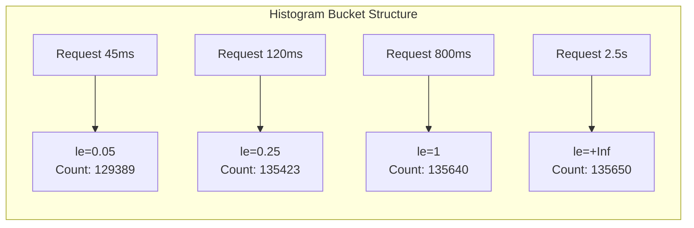
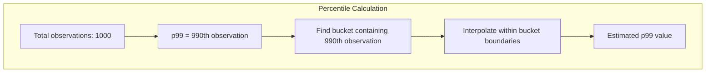
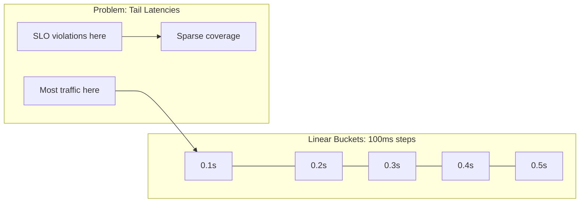
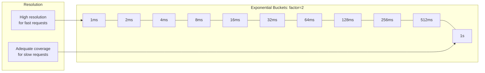
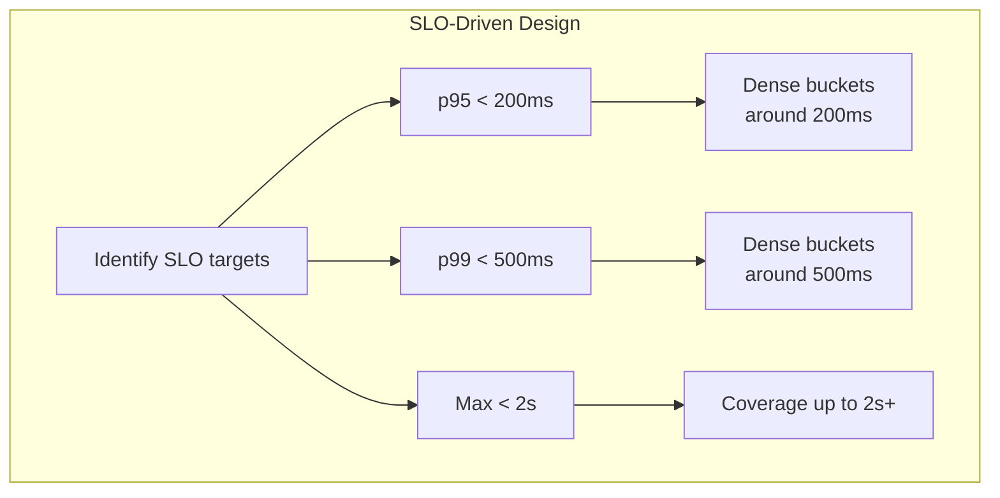
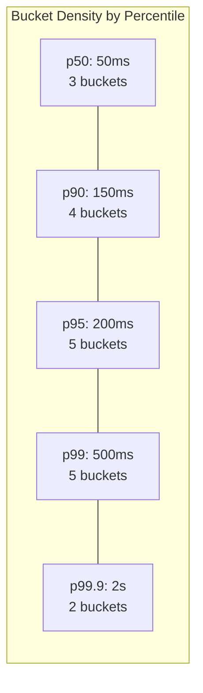
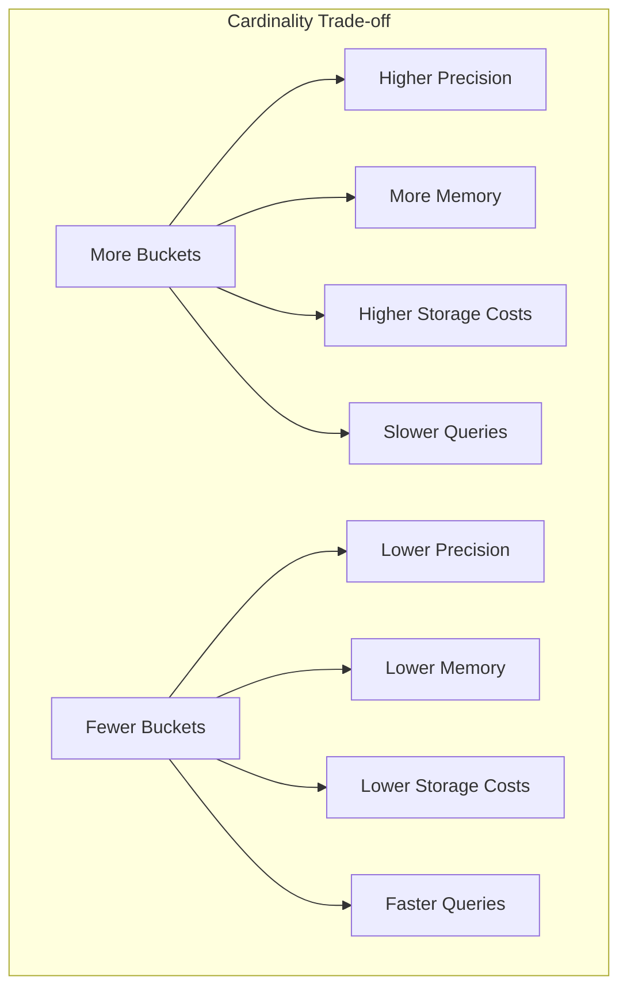
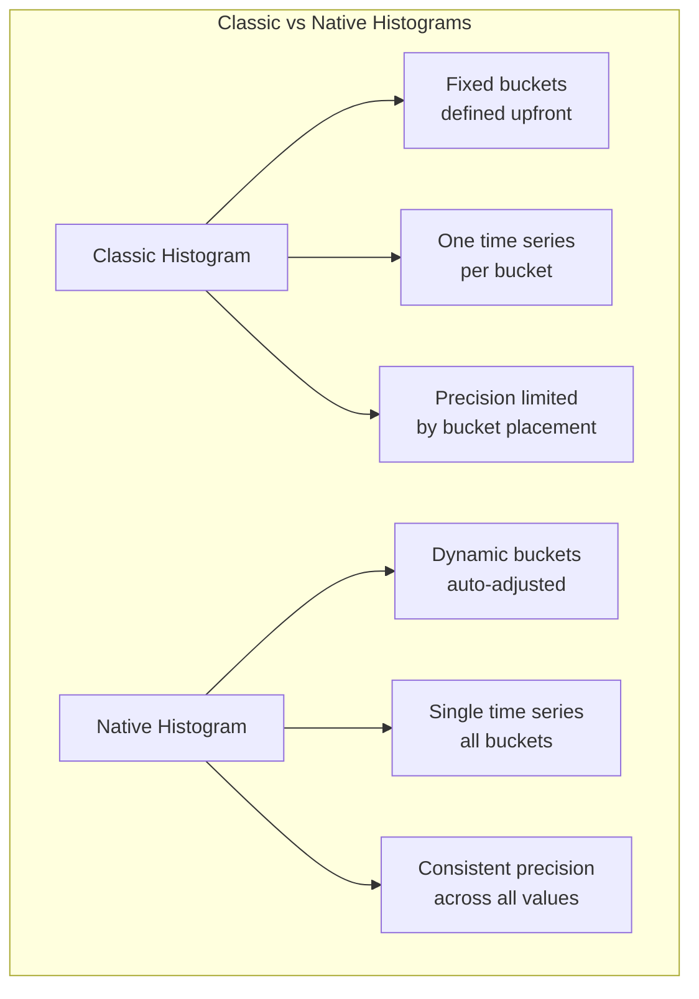

# How to Implement Histogram Bucket Design

Author: [nawazdhandala](https://github.com/nawazdhandala)

Tags: Observability, Prometheus, Metrics, Monitoring

Description: Learn how to design histogram buckets for effective latency and distribution measurements in Prometheus monitoring.

---

You're staring at a dashboard that says your p99 latency is 500ms. But something feels wrong. Users are complaining about requests taking 2-3 seconds. You dig deeper and realize your histogram buckets top out at 1 second. Every request slower than that gets lumped into the same bucket, making your percentile calculations wildly inaccurate.

This is the silent killer of observability: **poorly designed histogram buckets**.

Histograms are one of the most powerful metric types in Prometheus and OpenTelemetry, but they're also the most misunderstood. Get the bucket boundaries wrong, and your latency measurements become meaningless. Get them right, and you unlock precise SLO tracking, accurate percentile calculations, and actionable alerting.

This guide walks you through the art and science of histogram bucket design.

---

## What Are Histogram Buckets?

A histogram tracks the distribution of values by counting how many observations fall into predefined ranges called **buckets**. Each bucket has an upper bound, and observations are counted cumulatively.

```yaml
# Example: HTTP request duration histogram
http_request_duration_seconds_bucket{le="0.005"} 24054
http_request_duration_seconds_bucket{le="0.01"}  33444
http_request_duration_seconds_bucket{le="0.025"} 100392
http_request_duration_seconds_bucket{le="0.05"}  129389
http_request_duration_seconds_bucket{le="0.1"}   133988
http_request_duration_seconds_bucket{le="0.25"}  135423
http_request_duration_seconds_bucket{le="0.5"}   135590
http_request_duration_seconds_bucket{le="1"}     135640
http_request_duration_seconds_bucket{le="+Inf"}  135650
```

The `le` label means "less than or equal to." So `le="0.1"` counts all requests that took 100ms or less. The `+Inf` bucket captures everything.



---

## Why Bucket Design Matters

The accuracy of your percentile calculations depends entirely on where you place your bucket boundaries.

### The Interpolation Problem

Prometheus calculates percentiles by interpolating within buckets. If your p99 falls between bucket boundaries, Prometheus assumes a linear distribution within that bucket.



**Example of the problem:**

If your buckets are `[100ms, 500ms, 1s]` and your actual p99 is 450ms, Prometheus interpolates linearly between 100ms and 500ms. If most of the values in that range are clustered near 400-450ms, the interpolation might estimate 300ms or 350ms instead.

Wide buckets = inaccurate percentiles.

---

## Bucket Boundary Selection Strategies

### Strategy 1: Linear Buckets

Linear buckets use a constant step size between boundaries.

```python
# Linear buckets: start=0.1, step=0.1, count=10
buckets = [0.1, 0.2, 0.3, 0.4, 0.5, 0.6, 0.7, 0.8, 0.9, 1.0]
```

**Prometheus Python client:**
```python
from prometheus_client import Histogram

# Linear buckets from 0.1 to 1.0 in 0.1 increments
http_latency = Histogram(
    'http_request_duration_seconds',
    'HTTP request latency',
    buckets=[0.1 * i for i in range(1, 11)] + [float('inf')]
)
```

**When to use linear buckets:**
- Values are uniformly distributed
- The range of values is narrow and predictable
- You need consistent resolution across the entire range

**When NOT to use linear buckets:**
- Latency distributions (typically exponential)
- Values span multiple orders of magnitude
- You care more about tail latencies



### Strategy 2: Exponential Buckets

Exponential buckets multiply each boundary by a constant factor.

```python
# Exponential buckets: start=0.001, factor=2, count=15
# Results in: [0.001, 0.002, 0.004, 0.008, 0.016, 0.032, 0.064, 0.128,
#              0.256, 0.512, 1.024, 2.048, 4.096, 8.192, 16.384]
```

**Prometheus Python client:**
```python
from prometheus_client import Histogram
import math

def exponential_buckets(start, factor, count):
    return [start * (factor ** i) for i in range(count)]

http_latency = Histogram(
    'http_request_duration_seconds',
    'HTTP request latency',
    buckets=exponential_buckets(0.001, 2, 15) + [float('inf')]
)
```

**When to use exponential buckets:**
- Latency measurements (the default choice)
- Values span multiple orders of magnitude
- You need high resolution for common values and coverage for outliers



### Strategy 3: SLO-Driven Buckets

Design buckets around your Service Level Objectives.

```python
# SLO-driven buckets for an API with:
# - Target: 95% of requests < 200ms
# - Alert: p99 > 500ms
# - Hard limit: No requests > 2s

slo_buckets = [
    0.010,   # 10ms - fast path
    0.025,   # 25ms
    0.050,   # 50ms
    0.100,   # 100ms - good performance
    0.150,   # 150ms
    0.200,   # 200ms - SLO target boundary
    0.300,   # 300ms
    0.400,   # 400ms
    0.500,   # 500ms - p99 alert threshold
    0.750,   # 750ms
    1.000,   # 1s
    2.000,   # 2s - hard limit
    5.000,   # 5s - outliers
]
```

**The key insight:** Place more buckets around your SLO boundaries for precise measurements where it matters most.



### Strategy 4: Hybrid Approach

Combine strategies for different ranges.

```python
def hybrid_buckets():
    buckets = []

    # Fine-grained linear for fast path (1-50ms)
    buckets.extend([0.001 * i for i in range(1, 51)])  # 1ms steps

    # Exponential for medium latencies (50ms - 1s)
    current = 0.050
    while current < 1.0:
        current *= 1.5
        buckets.append(round(current, 3))

    # Coarse for tail (1s+)
    buckets.extend([1.0, 2.0, 5.0, 10.0])

    return sorted(set(buckets))
```

---

## Latency Percentile Requirements

Different percentiles serve different purposes. Design your buckets to support all of them.

| Percentile | Purpose | Bucket Requirement |
|------------|---------|-------------------|
| p50 (median) | Typical user experience | Moderate resolution in common range |
| p90 | Most users' worst case | Good resolution around expected value |
| p95 | SLO target (common) | High resolution at SLO boundary |
| p99 | Tail latency, alerting | High resolution at alert threshold |
| p99.9 | Extreme outliers | Coverage, not precision |

**Rule of thumb:** Place at least 3-5 buckets around each critical percentile boundary.



---

## Memory and Cardinality Trade-offs

Every bucket is a separate time series. More buckets = more memory and storage.

### The Cardinality Formula

```
Total time series = buckets * label_combinations
```

**Example calculation:**
```
- Histogram with 20 buckets
- Labels: method (5 values), endpoint (50 values), status (5 values)
- Total: 20 * 5 * 50 * 5 = 25,000 time series per histogram
```

### Cardinality Budget Guidelines

| Environment | Max Buckets Recommendation |
|-------------|---------------------------|
| Low traffic (< 100 RPS) | 20-30 buckets |
| Medium traffic (100-1000 RPS) | 10-20 buckets |
| High traffic (> 1000 RPS) | 8-15 buckets |
| Per-endpoint histograms | 8-12 buckets |



### Strategies to Reduce Cardinality

1. **Drop unused buckets:**
```yaml
# In OpenTelemetry Collector
processors:
  filter:
    metrics:
      exclude:
        match_type: regexp
        metric_names:
          - ".*_bucket"
        resource_attributes:
          - key: le
            value: "0.001|0.002"  # Drop very small buckets if unused
```

2. **Use views to re-bucket:**
```python
# OpenTelemetry Python - reduce buckets at export
from opentelemetry.sdk.metrics import MeterProvider
from opentelemetry.sdk.metrics.view import View, ExplicitBucketHistogramAggregation

reduced_view = View(
    instrument_name="http.server.duration",
    aggregation=ExplicitBucketHistogramAggregation(
        boundaries=[0.005, 0.01, 0.025, 0.05, 0.1, 0.25, 0.5, 1, 2.5, 5, 10]
    )
)
```

3. **Aggregate labels:**
```python
# Instead of per-endpoint histograms
http_latency = Histogram(
    'http_request_duration_seconds',
    'HTTP request latency',
    ['method', 'status_class'],  # status_class: 2xx, 3xx, 4xx, 5xx
    buckets=DEFAULT_BUCKETS
)
```

---

## Native Histograms vs Classic Histograms

Prometheus 2.40+ introduced **native histograms** (also called sparse histograms), which solve many bucket design problems.

### Classic Histograms

```yaml
# Fixed buckets defined at instrumentation time
http_request_duration_seconds_bucket{le="0.1"} 24054
http_request_duration_seconds_bucket{le="0.5"} 129389
http_request_duration_seconds_bucket{le="1"}   135640
http_request_duration_seconds_bucket{le="+Inf"} 135650
http_request_duration_seconds_sum 5765.234
http_request_duration_seconds_count 135650
```

### Native Histograms

```yaml
# Dynamic bucket boundaries, stored as a single time series
http_request_duration_seconds{} <native histogram>
# Internally: exponential buckets with automatic resolution
```



### Comparison Table

| Feature | Classic Histogram | Native Histogram |
|---------|------------------|------------------|
| Bucket boundaries | Fixed at instrumentation | Dynamic, exponential |
| Cardinality | O(buckets * labels) | O(labels) |
| Precision | Depends on bucket design | Consistent (~1-2% error) |
| Query compatibility | Full PromQL support | Requires Prometheus 2.40+ |
| Storage efficiency | Lower | Higher |

### When to Use Native Histograms

- Prometheus 2.40+ available
- Cardinality is a concern
- You don't want to predict value distributions upfront
- You need consistent precision across all percentiles

### Enabling Native Histograms

**Prometheus config:**
```yaml
# prometheus.yml
global:
  scrape_interval: 15s

scrape_configs:
  - job_name: 'myapp'
    static_configs:
      - targets: ['localhost:8080']
    # Enable native histogram scraping
    scrape_protocols:
      - PrometheusProto
      - OpenMetricsText1.0.0
      - OpenMetricsText0.0.1
      - PrometheusText0.0.4
```

**Go instrumentation:**
```go
import (
    "github.com/prometheus/client_golang/prometheus"
    "github.com/prometheus/client_golang/prometheus/promauto"
)

var httpDuration = promauto.NewHistogram(prometheus.HistogramOpts{
    Name:                        "http_request_duration_seconds",
    Help:                        "HTTP request duration",
    NativeHistogramBucketFactor: 1.1,  // ~10% bucket width
})
```

---

## Practical Examples

### Example 1: API Latency Histogram

For a typical REST API with SLOs:
- p95 < 200ms
- p99 < 500ms

```python
from prometheus_client import Histogram

api_latency = Histogram(
    'api_request_duration_seconds',
    'API request latency in seconds',
    ['method', 'endpoint', 'status'],
    buckets=[
        0.005,  # 5ms
        0.010,  # 10ms
        0.025,  # 25ms
        0.050,  # 50ms
        0.075,  # 75ms
        0.100,  # 100ms
        0.150,  # 150ms
        0.200,  # 200ms - p95 SLO
        0.250,  # 250ms
        0.300,  # 300ms
        0.400,  # 400ms
        0.500,  # 500ms - p99 SLO
        0.750,  # 750ms
        1.000,  # 1s
        2.500,  # 2.5s
        5.000,  # 5s
        10.00,  # 10s
    ]
)
```

### Example 2: Database Query Histogram

For database queries with higher expected latencies:

```python
db_query_duration = Histogram(
    'db_query_duration_seconds',
    'Database query latency',
    ['query_type', 'table'],
    buckets=[
        0.001,  # 1ms - cached
        0.005,  # 5ms
        0.010,  # 10ms
        0.025,  # 25ms
        0.050,  # 50ms
        0.100,  # 100ms
        0.250,  # 250ms
        0.500,  # 500ms
        1.000,  # 1s
        2.500,  # 2.5s
        5.000,  # 5s
        10.00,  # 10s
        30.00,  # 30s - long queries
        60.00,  # 60s - very long queries
    ]
)
```

### Example 3: Request Size Histogram

For tracking payload sizes (non-latency use case):

```python
request_size = Histogram(
    'http_request_size_bytes',
    'HTTP request body size',
    ['method', 'endpoint'],
    buckets=[
        100,        # 100B
        500,        # 500B
        1000,       # 1KB
        5000,       # 5KB
        10000,      # 10KB
        50000,      # 50KB
        100000,     # 100KB
        500000,     # 500KB
        1000000,    # 1MB
        5000000,    # 5MB
        10000000,   # 10MB
    ]
)
```

---

## Validating Your Bucket Design

### Step 1: Analyze Actual Distribution

Before finalizing buckets, collect raw latency data and analyze the distribution:

```python
import numpy as np

# Collect sample latencies
latencies = [...]  # Your actual latency samples

# Calculate percentiles
percentiles = [50, 75, 90, 95, 99, 99.9]
for p in percentiles:
    value = np.percentile(latencies, p)
    print(f"p{p}: {value:.3f}s")

# Identify natural clustering
hist, edges = np.histogram(latencies, bins=100)
```

### Step 2: Check Bucket Coverage

```promql
# Find buckets with significant traffic
histogram_quantile(0.5, rate(http_request_duration_seconds_bucket[5m]))
histogram_quantile(0.95, rate(http_request_duration_seconds_bucket[5m]))
histogram_quantile(0.99, rate(http_request_duration_seconds_bucket[5m]))

# Check for bucket overflow (values hitting +Inf)
rate(http_request_duration_seconds_bucket{le="+Inf"}[5m])
-
rate(http_request_duration_seconds_bucket{le="10"}[5m])
```

### Step 3: Monitor Bucket Utilization

Create a dashboard showing observations per bucket to identify:
- Empty buckets (waste of cardinality)
- Overcrowded buckets (need finer granularity)
- Overflow to +Inf (need higher upper bounds)

```promql
# Observations per bucket (non-cumulative)
rate(http_request_duration_seconds_bucket{le="0.1"}[5m])
-
rate(http_request_duration_seconds_bucket{le="0.05"}[5m])
```

---

## Common Pitfalls and Fixes

| Pitfall | Symptom | Fix |
|---------|---------|-----|
| Buckets too wide | Percentiles jump erratically | Add buckets around SLO boundaries |
| Buckets too narrow | Cardinality explosion | Use exponential spacing, fewer buckets |
| Missing high buckets | Many values in +Inf | Add 2x-5x your expected max |
| Missing low buckets | p50 interpolation errors | Add sub-millisecond buckets |
| Same buckets everywhere | Some histograms useless | Tailor buckets to each metric's distribution |

---

## Bucket Design Checklist

- [ ] Identify your SLO boundaries (p95, p99 targets)
- [ ] Choose base strategy (linear, exponential, or hybrid)
- [ ] Place 3-5 buckets around each SLO boundary
- [ ] Ensure upper bound is 2-5x expected maximum
- [ ] Calculate total cardinality (buckets * label combinations)
- [ ] Validate with real traffic data
- [ ] Consider native histograms for new deployments
- [ ] Monitor bucket utilization monthly
- [ ] Document bucket rationale for future maintainers

---

## Integration with OneUptime

OneUptime provides native support for Prometheus histograms through its OTLP ingestion pipeline. You can:

1. **Ingest histograms** via OpenTelemetry Collector with OTLP exporter
2. **Visualize percentiles** with built-in histogram queries
3. **Set SLO alerts** based on percentile thresholds
4. **Track histogram cardinality** to manage costs

```yaml
# OpenTelemetry Collector config for OneUptime
exporters:
  otlp:
    endpoint: "https://otlp.oneuptime.com:4317"
    headers:
      Authorization: "Bearer YOUR_API_KEY"

processors:
  batch:
    timeout: 10s

service:
  pipelines:
    metrics:
      receivers: [prometheus]
      processors: [batch]
      exporters: [otlp]
```

---

## Final Thoughts

Histogram bucket design is one of those "boring" decisions that has outsized impact on your observability practice. Get it wrong, and your percentile calculations are meaningless. Get it right, and you have precise, actionable latency data that drives real improvements.

The key principles:
1. **Start with your SLOs** - design buckets around what matters
2. **Use exponential spacing** - it matches real latency distributions
3. **Validate with real data** - don't guess, measure
4. **Monitor cardinality** - buckets have costs
5. **Consider native histograms** - they solve many problems automatically

Your future self debugging a 3 AM incident will thank you for spending the time to get this right.

---

**Related Reading:**
- [SRE Metrics to Track](https://oneuptime.com/blog/post/2025-11-28-sre-metrics-to-track/view)
- [Three Pillars of Observability: Logs, Metrics, Traces](https://oneuptime.com/blog/post/2025-08-20-three-pillars-of-observability-logs-metrics-traces/view)
- [Python Custom Metrics with Prometheus](https://oneuptime.com/blog/post/2025-01-06-python-custom-metrics-prometheus/view)
