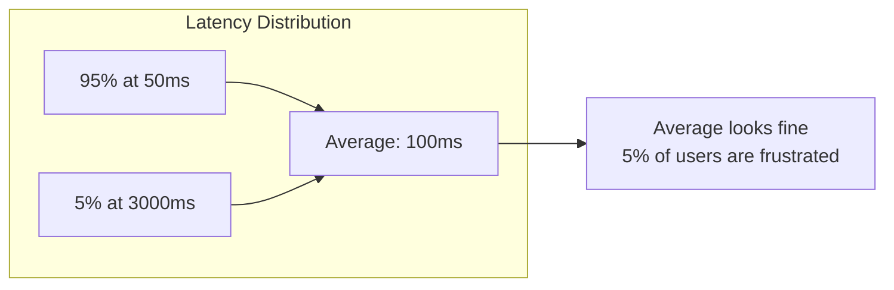
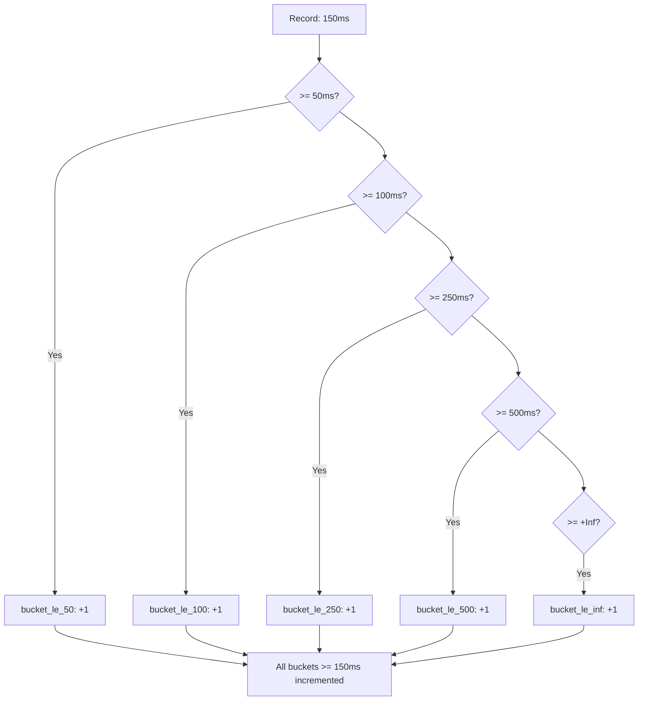
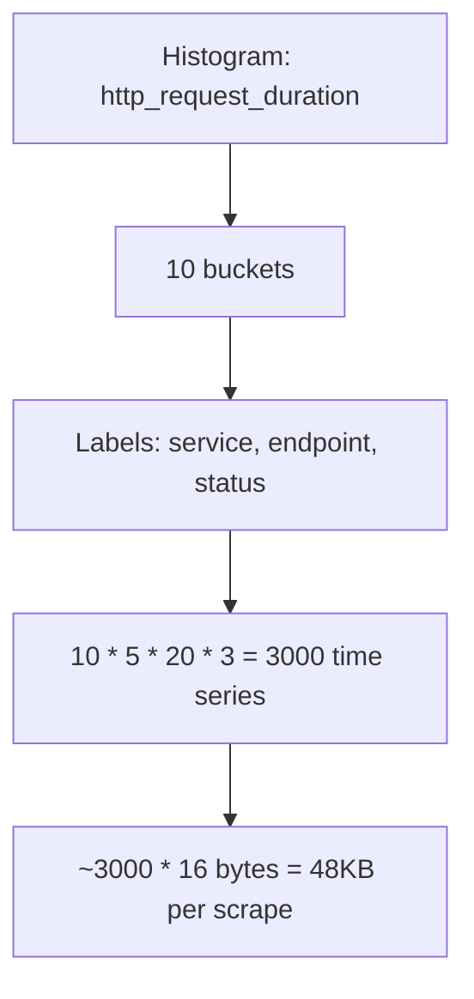
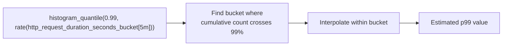

# How to Create Histogram Metrics Design Details

Author: [nawazdhandala](https://github.com/nawazdhandala)

Tags: Metrics, Histograms, Prometheus, Latency

Description: Learn to create histogram metrics design for measuring distributions and percentiles.

---

Averages lie. A service with 50ms average latency might have 1% of requests taking 2 seconds. Users hitting those slow requests have a terrible experience, but the average hides the problem. Histograms reveal what averages conceal by capturing the full distribution of values.

When you need to answer questions like "What is the 99th percentile latency?" or "How many requests took between 100ms and 500ms?", histograms are the right tool. They let you compute percentiles, understand distribution shapes, and set meaningful SLOs based on user experience rather than misleading averages.

This guide covers the internal design of histogram metrics, bucket selection strategies, memory and cardinality tradeoffs, and practical implementation patterns you can use in production.

---

## Why Histograms Matter

Consider a payment service processing transactions. Most complete in 50ms, but some hit fraud detection and take 3 seconds. The average latency is 100ms, which looks fine. But 5% of users wait 3 seconds, and they are frustrated.



Histograms solve this by recording how many observations fall into predefined ranges called buckets. Instead of a single number, you get a distribution that shows where values cluster and where outliers live.

| Metric Type | What It Tells You | Limitation |
|-------------|-------------------|------------|
| Counter | Total count of events | No value information |
| Gauge | Current value | No history or distribution |
| Average | Central tendency | Hides outliers and skew |
| Histogram | Full distribution | Higher cardinality and memory |

---

## Histogram Internal Structure

A histogram consists of buckets, each representing a range of values. When you record an observation, the histogram increments the count for every bucket whose upper bound is greater than or equal to the observed value. This cumulative approach lets you compute percentiles efficiently.



The cumulative structure means `bucket_le_500` contains all observations less than or equal to 500ms, not just those between 250ms and 500ms. This design makes percentile calculation straightforward: find the bucket where the cumulative count crosses your target percentile.

---

## Bucket Selection Strategies

Choosing bucket boundaries is the most important design decision. Buckets that are too wide lose precision. Buckets that are too narrow waste memory and increase cardinality. The goal is to place boundaries where they reveal meaningful differences in your data.

### Linear Buckets

Linear buckets work well when values are uniformly distributed within a known range.

```typescript
// linear-buckets.ts - Evenly spaced bucket boundaries
function createLinearBuckets(start: number, width: number, count: number): number[] {
  const buckets: number[] = [];
  for (let i = 0; i < count; i++) {
    buckets.push(start + (width * i));
  }
  return buckets;
}

// Example: buckets at 10, 20, 30, 40, 50ms
const linearBuckets = createLinearBuckets(10, 10, 5);
// Result: [10, 20, 30, 40, 50]
```

Linear buckets are rarely ideal for latency because latency distributions are typically skewed, with most values clustered at the low end and a long tail of slow requests.

### Exponential Buckets

Exponential buckets provide high resolution at low values and progressively coarser resolution at higher values. This matches how humans perceive latency: the difference between 10ms and 20ms matters more than the difference between 1000ms and 1010ms.

```typescript
// exponential-buckets.ts - Geometrically growing boundaries
function createExponentialBuckets(start: number, factor: number, count: number): number[] {
  const buckets: number[] = [];
  let current = start;
  for (let i = 0; i < count; i++) {
    buckets.push(current);
    current *= factor;
  }
  return buckets;
}

// Example: buckets doubling from 5ms
const expBuckets = createExponentialBuckets(5, 2, 8);
// Result: [5, 10, 20, 40, 80, 160, 320, 640]
```

A factor of 2 doubles each bucket. Smaller factors like 1.5 provide more resolution but require more buckets to cover the same range.

### SLO-Aligned Buckets

The most practical approach is to place buckets at boundaries that matter for your SLOs. If your SLO targets p50 at 100ms and p99 at 500ms, place buckets near those boundaries.

```typescript
// slo-aligned-buckets.ts - Boundaries matching SLO targets
const sloBuckets = [
  10,    // Fast responses
  25,    // Very good
  50,    // Good - below p50 target
  100,   // p50 SLO boundary
  250,   // Degraded
  500,   // p99 SLO boundary
  1000,  // Slow
  2500,  // Very slow
  5000,  // Timeout territory
  10000, // Failure
];
```

This design gives you precise percentile calculations at the boundaries that matter for alerting and reporting.

---

## Memory and Cardinality Tradeoffs

Each bucket is a separate time series. A histogram with 10 buckets and 3 labels (service, endpoint, status) creates 10 * (service_values * endpoint_values * status_values) time series. This multiplies quickly.



Strategies to manage cardinality:

| Strategy | Implementation | Tradeoff |
|----------|----------------|----------|
| Fewer buckets | Use 5-8 instead of 15-20 | Less precision |
| Lower cardinality labels | Aggregate endpoints by pattern | Less granularity |
| Summary for high-cardinality | Use summary metric type | No aggregation across instances |
| Separate histograms | Critical endpoints get detailed buckets | More configuration |

---

## Implementation in Prometheus Client

Here is a complete example using the Prometheus client library for Node.js.

```typescript
// histogram-metrics.ts - Production histogram setup
import { Registry, Histogram, collectDefaultMetrics } from 'prom-client';

// Create a dedicated registry for custom metrics
const registry = new Registry();
collectDefaultMetrics({ register: registry });

// HTTP request duration histogram with SLO-aligned buckets
const httpRequestDuration = new Histogram({
  name: 'http_request_duration_seconds',
  help: 'Duration of HTTP requests in seconds',
  labelNames: ['method', 'route', 'status_code'],
  buckets: [0.01, 0.025, 0.05, 0.1, 0.25, 0.5, 1, 2.5, 5, 10],
  registers: [registry],
});

// Database query duration with finer resolution at low latencies
const dbQueryDuration = new Histogram({
  name: 'db_query_duration_seconds',
  help: 'Duration of database queries in seconds',
  labelNames: ['operation', 'table'],
  buckets: [0.001, 0.005, 0.01, 0.025, 0.05, 0.1, 0.25, 0.5, 1],
  registers: [registry],
});

// Helper function to time async operations
async function timeOperation<T>(
  histogram: Histogram<string>,
  labels: Record<string, string>,
  operation: () => Promise<T>
): Promise<T> {
  const end = histogram.startTimer(labels);
  try {
    return await operation();
  } finally {
    end();
  }
}

// Usage in an Express handler
import express from 'express';
const app = express();

app.get('/users/:id', async (req, res) => {
  const user = await timeOperation(
    httpRequestDuration,
    { method: 'GET', route: '/users/:id', status_code: '200' },
    async () => {
      // Simulate database query
      return timeOperation(
        dbQueryDuration,
        { operation: 'SELECT', table: 'users' },
        async () => {
          await new Promise(r => setTimeout(r, Math.random() * 100));
          return { id: req.params.id, name: 'Test User' };
        }
      );
    }
  );
  res.json(user);
});

// Metrics endpoint
app.get('/metrics', async (req, res) => {
  res.set('Content-Type', registry.contentType);
  res.end(await registry.metrics());
});

app.listen(3000);
```

---

## Percentile Calculation

Prometheus uses linear interpolation within buckets to estimate percentiles. The histogram_quantile function finds the bucket containing the target percentile and interpolates within it.



The accuracy depends on bucket placement. If the p99 falls in a wide bucket spanning 500ms to 1000ms, the interpolation might be off by hundreds of milliseconds. Placing bucket boundaries near your SLO targets improves accuracy where it matters.

```promql
# PromQL query for p99 latency by route
histogram_quantile(0.99,
  sum(rate(http_request_duration_seconds_bucket[5m])) by (route, le)
)

# Apdex score calculation using histogram buckets
# Satisfied: < 100ms, Tolerating: < 500ms, Frustrated: >= 500ms
(
  sum(rate(http_request_duration_seconds_bucket{le="0.1"}[5m])) +
  sum(rate(http_request_duration_seconds_bucket{le="0.5"}[5m])) -
  sum(rate(http_request_duration_seconds_bucket{le="0.1"}[5m]))
) / 2 /
sum(rate(http_request_duration_seconds_count[5m]))
```

---

## Native Histograms in Prometheus

Prometheus 2.40+ introduced native histograms that automatically adjust bucket boundaries based on observed data. This reduces the configuration burden and improves accuracy.

```yaml
# prometheus.yml - Enable native histograms
global:
  scrape_interval: 15s

scrape_configs:
  - job_name: 'app'
    static_configs:
      - targets: ['localhost:3000']
    # Enable native histogram scraping
    scrape_protocols:
      - PrometheusProto
```

Native histograms use exponential bucketing with a configurable resolution. They adapt to your data distribution automatically, but require newer Prometheus versions and compatible client libraries.

---

## Common Pitfalls

Several mistakes can undermine your histogram design.

**Too many buckets**: More buckets mean more time series. Start with 8-10 buckets and add more only if you need finer resolution at specific ranges.

**Wrong bucket boundaries**: If your p99 target is 500ms but your nearest bucket is at 1000ms, you cannot accurately measure whether you are meeting your SLO.

**High cardinality labels**: Adding user_id or request_id as labels creates unbounded cardinality. Use these identifiers in traces and logs, not metrics.

**Ignoring the +Inf bucket**: Every histogram needs a +Inf bucket to capture values above your highest explicit bucket. Without it, extreme outliers are lost.

```typescript
// bad-histogram.ts - Common mistakes
const badHistogram = new Histogram({
  name: 'bad_example',
  help: 'Example of poor bucket design',
  // Too many buckets, wasting cardinality
  buckets: [1, 2, 3, 4, 5, 6, 7, 8, 9, 10, 20, 30, 40, 50],
  // High cardinality label
  labelNames: ['user_id'],  // Do not do this
});

// good-histogram.ts - Better design
const goodHistogram = new Histogram({
  name: 'good_example',
  help: 'Example of good bucket design',
  // SLO-aligned buckets
  buckets: [0.01, 0.05, 0.1, 0.25, 0.5, 1, 2.5, 5],
  // Bounded cardinality labels
  labelNames: ['endpoint_group', 'status_class'],
});
```

---

## Key Takeaways

Histograms are essential for understanding latency distributions and setting meaningful SLOs.

- **Choose buckets strategically**: Align boundaries with SLO targets for accurate percentile calculation
- **Watch cardinality**: Each bucket multiplies your time series count
- **Use exponential spacing**: Matches how latency naturally distributes
- **Start simple**: Begin with 8-10 buckets and refine based on actual needs
- **Test your queries**: Verify that histogram_quantile returns sensible values at your SLO boundaries

The effort invested in histogram design pays off in better alerting, accurate SLO reporting, and genuine insight into user experience. Averages tell you what the system is doing on average. Histograms tell you what the system is doing to your users.

---

**Related Reading:**

- [What are Metrics in OpenTelemetry](https://oneuptime.com/blog/post/2025-08-26-what-are-metrics-in-opentelemetry/view)
- [SRE Metrics to Track](https://oneuptime.com/blog/post/2025-11-28-sre-metrics-to-track/view)
- [The Three Pillars of Observability: Logs, Metrics, and Traces](https://oneuptime.com/blog/post/2025-08-20-three-pillars-of-observability-logs-metrics-traces/view)
