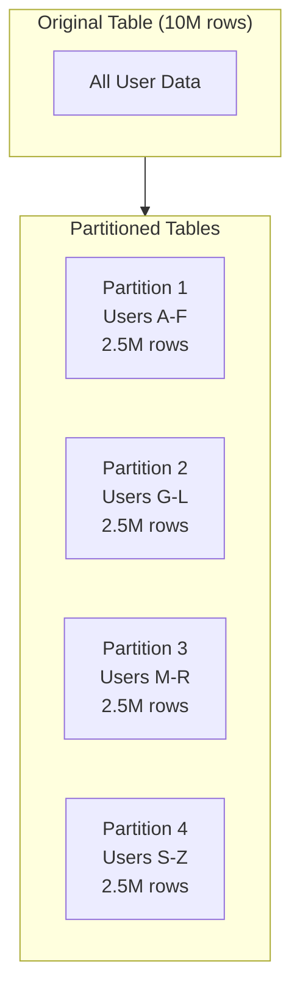
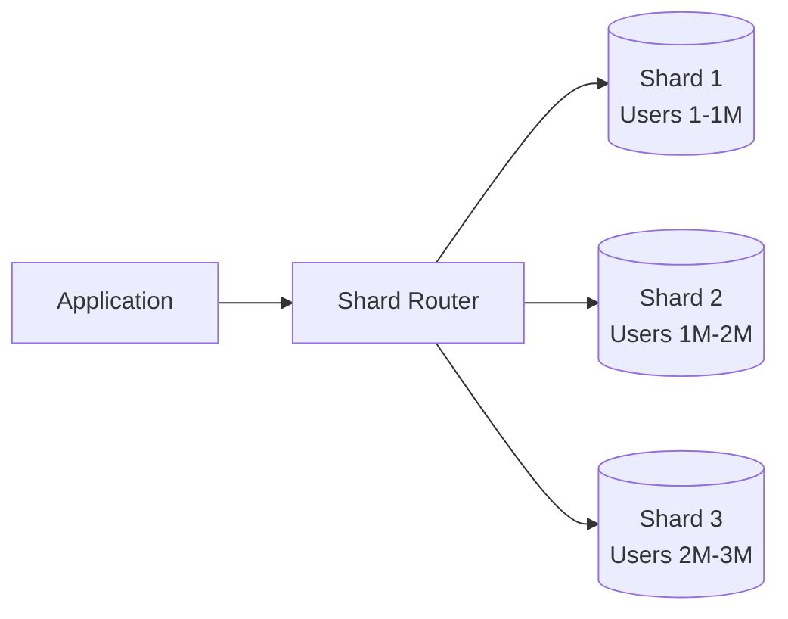
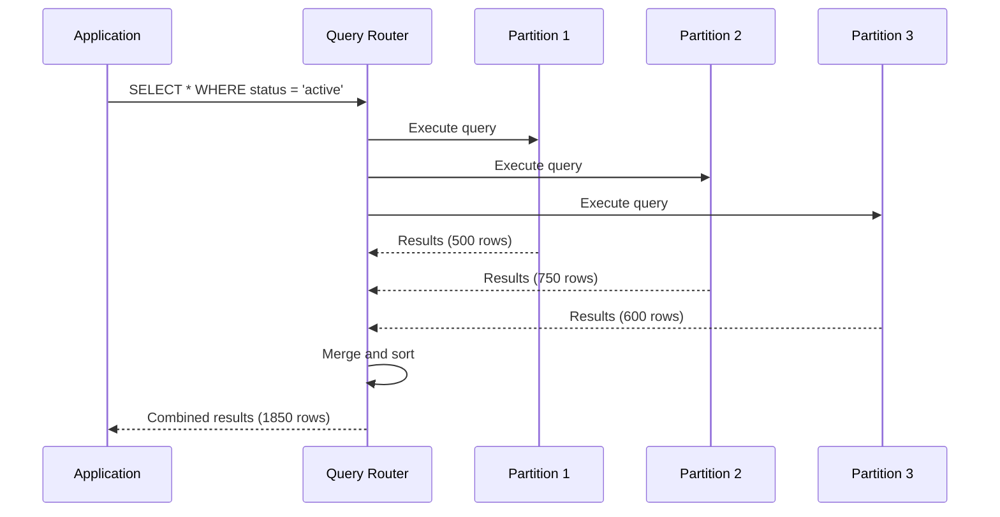

# How to Implement Horizontal Partitioning

Author: [nawazdhandala](https://github.com/nawazdhandala)

Tags: Database, Partitioning, Scalability, Performance

Description: Learn to implement horizontal partitioning (sharding) for distributing rows across multiple tables or databases.

---

When your database grows to millions or billions of rows, query performance starts to degrade. Horizontal partitioning solves this problem by splitting your data across multiple tables or databases based on a partition key. This guide walks you through implementing horizontal partitioning from scratch.

## What is Horizontal Partitioning?

Horizontal partitioning divides a table into smaller chunks where each partition contains a subset of rows. Unlike vertical partitioning (which splits columns), horizontal partitioning keeps all columns intact but distributes rows based on a partitioning strategy.

The following diagram shows how a single large table gets split into multiple partitions:



## Choosing a Partition Key

The partition key determines how data gets distributed. A good partition key should have high cardinality, even distribution, and align with your most common query patterns.

| Partition Key Type | Best For | Considerations |
|-------------------|----------|----------------|
| User ID | Multi-tenant applications | Even distribution if IDs are sequential |
| Geographic Region | Location-based queries | May cause uneven distribution |
| Date/Time | Time-series data | Old partitions become cold storage |
| Hash of Primary Key | General purpose | Loses range query efficiency |

## Implementation Strategies

### Strategy 1: Range-Based Partitioning

Range partitioning assigns rows to partitions based on value ranges. This works well for time-series data or sequential IDs.

Here is how to create range-based partitions in PostgreSQL:

```sql
-- Create the parent table with partitioning enabled
CREATE TABLE orders (
    order_id BIGSERIAL,
    customer_id INTEGER NOT NULL,
    order_date DATE NOT NULL,
    total_amount DECIMAL(10,2),
    PRIMARY KEY (order_id, order_date)
) PARTITION BY RANGE (order_date);

-- Create partitions for each quarter
CREATE TABLE orders_q1_2026 PARTITION OF orders
    FOR VALUES FROM ('2026-01-01') TO ('2026-04-01');

CREATE TABLE orders_q2_2026 PARTITION OF orders
    FOR VALUES FROM ('2026-04-01') TO ('2026-07-01');

CREATE TABLE orders_q3_2026 PARTITION OF orders
    FOR VALUES FROM ('2026-07-01') TO ('2026-10-01');

CREATE TABLE orders_q4_2026 PARTITION OF orders
    FOR VALUES FROM ('2026-10-01') TO ('2027-01-01');
```

### Strategy 2: Hash-Based Partitioning

Hash partitioning uses a hash function to distribute data evenly across partitions. This prevents hotspots when you cannot predict data distribution.

The following example demonstrates hash partitioning by customer ID:

```sql
-- Create parent table with hash partitioning
CREATE TABLE customer_events (
    event_id BIGSERIAL,
    customer_id INTEGER NOT NULL,
    event_type VARCHAR(50),
    event_data JSONB,
    created_at TIMESTAMP DEFAULT NOW(),
    PRIMARY KEY (event_id, customer_id)
) PARTITION BY HASH (customer_id);

-- Create 4 hash partitions
CREATE TABLE customer_events_p0 PARTITION OF customer_events
    FOR VALUES WITH (MODULUS 4, REMAINDER 0);

CREATE TABLE customer_events_p1 PARTITION OF customer_events
    FOR VALUES WITH (MODULUS 4, REMAINDER 1);

CREATE TABLE customer_events_p2 PARTITION OF customer_events
    FOR VALUES WITH (MODULUS 4, REMAINDER 2);

CREATE TABLE customer_events_p3 PARTITION OF customer_events
    FOR VALUES WITH (MODULUS 4, REMAINDER 3);
```

### Strategy 3: Application-Level Sharding

When you need to distribute data across multiple database servers, implement sharding at the application level. This approach gives you full control over routing logic.



Here is a Python implementation of a shard router:

```python
import hashlib
from typing import Dict, Any
import psycopg2

class ShardRouter:
    def __init__(self, shard_configs: list):
        # Store connection configs for each shard
        self.shards = {}
        for i, config in enumerate(shard_configs):
            self.shards[i] = psycopg2.connect(**config)
        self.num_shards = len(shard_configs)

    def get_shard_id(self, partition_key: str) -> int:
        # Use consistent hashing to determine shard
        hash_value = int(hashlib.md5(
            str(partition_key).encode()
        ).hexdigest(), 16)
        return hash_value % self.num_shards

    def get_connection(self, partition_key: str):
        # Return the appropriate database connection
        shard_id = self.get_shard_id(partition_key)
        return self.shards[shard_id]

    def execute_on_shard(self, partition_key: str, query: str, params: tuple):
        # Execute query on the correct shard
        conn = self.get_connection(partition_key)
        cursor = conn.cursor()
        cursor.execute(query, params)
        return cursor.fetchall()

    def execute_on_all_shards(self, query: str, params: tuple = None):
        # Fan out query to all shards and combine results
        results = []
        for shard_id, conn in self.shards.items():
            cursor = conn.cursor()
            cursor.execute(query, params)
            results.extend(cursor.fetchall())
        return results


# Usage example
shard_configs = [
    {"host": "shard1.db.example.com", "database": "app", "user": "admin", "password": "secret"},
    {"host": "shard2.db.example.com", "database": "app", "user": "admin", "password": "secret"},
    {"host": "shard3.db.example.com", "database": "app", "user": "admin", "password": "secret"},
]

router = ShardRouter(shard_configs)

# Insert goes to the correct shard automatically
user_id = "user_12345"
router.execute_on_shard(
    user_id,
    "INSERT INTO users (id, name, email) VALUES (%s, %s, %s)",
    (user_id, "John Doe", "john@example.com")
)
```

## Managing Cross-Partition Queries

Queries that span multiple partitions require special handling. The database must scan all relevant partitions and combine results.

This diagram illustrates the query flow for cross-partition operations:



To minimize cross-partition queries, design your partition key to match your access patterns. If 90% of your queries filter by user ID, partition by user ID.

## Partition Maintenance

Partitions require ongoing maintenance. For time-based partitions, you need to create new partitions before they are needed and archive old ones.

The following script automates partition creation for PostgreSQL:

```sql
-- Function to create monthly partitions automatically
CREATE OR REPLACE FUNCTION create_monthly_partition(
    parent_table TEXT,
    partition_date DATE
) RETURNS VOID AS $$
DECLARE
    partition_name TEXT;
    start_date DATE;
    end_date DATE;
BEGIN
    -- Calculate partition boundaries
    start_date := date_trunc('month', partition_date);
    end_date := start_date + INTERVAL '1 month';
    partition_name := parent_table || '_' || to_char(start_date, 'YYYY_MM');

    -- Create the partition if it does not exist
    EXECUTE format(
        'CREATE TABLE IF NOT EXISTS %I PARTITION OF %I
         FOR VALUES FROM (%L) TO (%L)',
        partition_name, parent_table, start_date, end_date
    );

    RAISE NOTICE 'Created partition: %', partition_name;
END;
$$ LANGUAGE plpgsql;

-- Create partitions for the next 3 months
SELECT create_monthly_partition('orders', CURRENT_DATE + INTERVAL '1 month');
SELECT create_monthly_partition('orders', CURRENT_DATE + INTERVAL '2 months');
SELECT create_monthly_partition('orders', CURRENT_DATE + INTERVAL '3 months');
```

## Performance Considerations

Horizontal partitioning improves performance when implemented correctly. Keep these factors in mind:

| Factor | Recommendation |
|--------|----------------|
| Partition Size | Keep each partition under 100GB for optimal performance |
| Index Strategy | Create indexes on each partition separately |
| Query Planning | Include partition key in WHERE clauses |
| Connection Pooling | Use separate pools per shard in distributed setups |
| Backup Strategy | Back up partitions independently for faster recovery |

## Conclusion

Horizontal partitioning transforms a monolithic database into a scalable system capable of handling billions of rows. Start with native database partitioning for simpler use cases, and move to application-level sharding when you need to distribute across multiple servers. The key to success lies in choosing the right partition key and designing queries that respect partition boundaries.

Test your partitioning strategy with realistic data volumes before deploying to production. Monitor query performance and partition sizes regularly to catch issues before they impact your users.
