# How to Implement Horizontal Scaling Decisions

Author: [nawazdhandala](https://github.com/nawazdhandala)

Tags: Scaling, Kubernetes, Infrastructure, DevOps

Description: Learn when and how to make horizontal scaling decisions for applications.

Your application is slowing down under load. Users are complaining. The monitoring dashboard shows CPU at 85% and response times climbing. You need to scale, but should you add more instances (scale horizontally) or upgrade to bigger machines (scale vertically)?

This decision shapes your architecture, your costs, and your operational complexity for years to come. Making the wrong choice early means painful migrations later.

This guide provides a framework for making horizontal scaling decisions that align with your workload characteristics, business requirements, and operational capabilities.

---

## Understanding Horizontal vs Vertical Scaling

Before diving into decision frameworks, let's establish clear definitions:

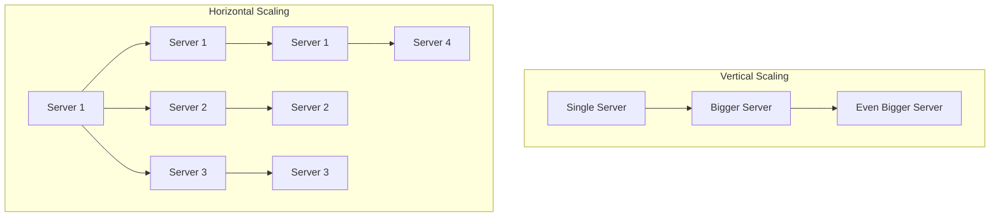

**Vertical scaling** (scaling up): Adding more resources (CPU, RAM, storage) to existing machines.

**Horizontal scaling** (scaling out): Adding more machines to distribute the workload.

Both have their place. The art is knowing when to use which.

---

## Horizontal Scaling Indicators

Not every application benefits from horizontal scaling. Here are the signals that suggest horizontal scaling is the right approach:

### Signal 1: Traffic Patterns Show High Variability

If your traffic varies significantly throughout the day, week, or season, horizontal scaling allows you to match capacity to demand:

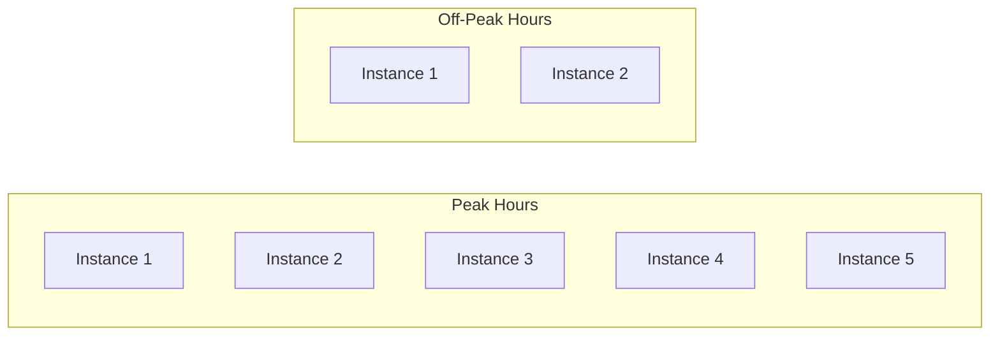

**Indicator metrics:**
- Peak-to-trough traffic ratio > 3:1
- Predictable daily or weekly patterns
- Seasonal spikes (Black Friday, end of quarter)

```yaml
# HPA configuration for variable traffic
apiVersion: autoscaling/v2
kind: HorizontalPodAutoscaler
metadata:
  name: web-api
  namespace: production
spec:
  scaleTargetRef:
    apiVersion: apps/v1
    kind: Deployment
    name: web-api
  minReplicas: 2          # Baseline for off-peak
  maxReplicas: 20         # Ceiling for peak traffic
  metrics:
    - type: Resource
      resource:
        name: cpu
        target:
          type: Utilization
          averageUtilization: 70  # Scale when avg CPU > 70%
  behavior:
    scaleDown:
      stabilizationWindowSeconds: 300  # Wait 5 min before scaling down
      policies:
        - type: Percent
          value: 10           # Remove max 10% of pods at a time
          periodSeconds: 60
    scaleUp:
      stabilizationWindowSeconds: 0    # Scale up immediately
      policies:
        - type: Percent
          value: 100          # Can double capacity if needed
          periodSeconds: 60
```

### Signal 2: Single Instance Cannot Handle the Load

When your largest available machine cannot handle peak load, horizontal scaling becomes mandatory:

```bash
# Check if you're hitting the ceiling
kubectl top pods -n production

# Sample output showing resource pressure
NAME                      CPU(cores)   MEMORY(bytes)
web-api-7d4f8c9b5-abc12   3800m        14Gi    # Near 4-core limit
web-api-7d4f8c9b5-def34   3750m        13Gi    # Also maxed out
```

### Signal 3: Availability Requirements Demand Redundancy

A single instance is a single point of failure. If you need high availability, you need multiple instances:

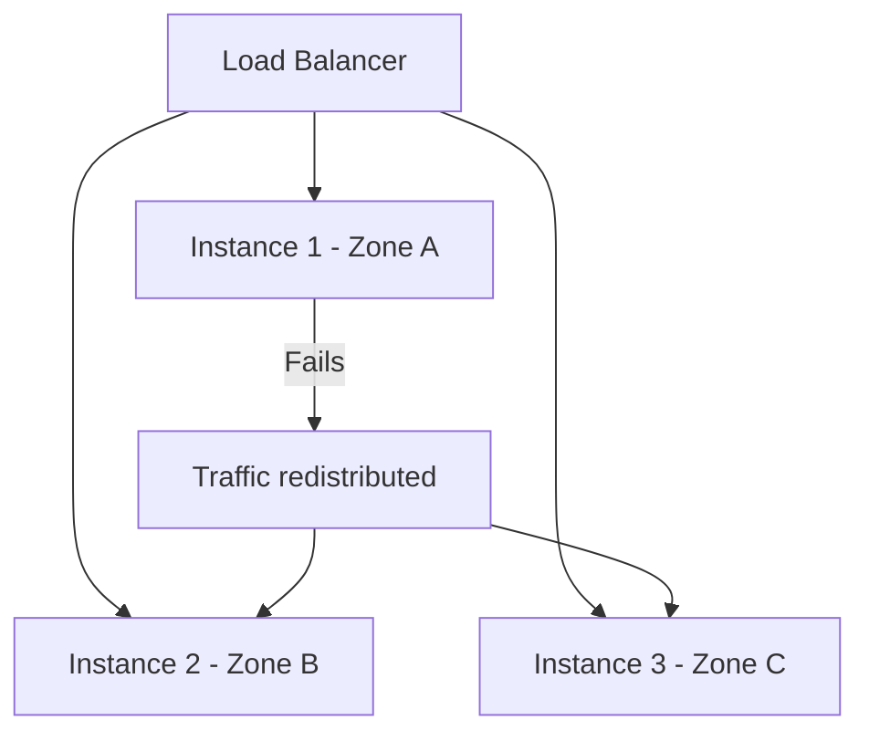

For any SLA above 99.9%, horizontal scaling with multi-zone deployment is effectively mandatory.

### Signal 4: Cost Optimization Through Right-Sizing

Horizontal scaling often provides better cost efficiency than vertical scaling:

| Configuration | Monthly Cost | Capacity | Utilization |
|---------------|--------------|----------|-------------|
| 1x 64-core server | $2,400 | Fixed | 45% average |
| 8x 8-core servers | $1,600 | Elastic | 75% average |
| Auto-scaled 2-12x 4-core | $800-$1,200 | Dynamic | 70-85% |

```yaml
# Cost-optimized scaling configuration
apiVersion: autoscaling/v2
kind: HorizontalPodAutoscaler
metadata:
  name: api-cost-optimized
spec:
  scaleTargetRef:
    apiVersion: apps/v1
    kind: Deployment
    name: api
  minReplicas: 2
  maxReplicas: 12
  metrics:
    - type: Resource
      resource:
        name: cpu
        target:
          type: Utilization
          averageUtilization: 75  # Higher target = better utilization
    - type: Resource
      resource:
        name: memory
        target:
          type: Utilization
          averageUtilization: 80
```

---

## Workload Characteristics Analysis

Different workloads have different scaling characteristics. Analyze yours before deciding.

### CPU-Bound Workloads

Workloads limited by processing power (encryption, compression, computation) scale horizontally when work can be parallelized:

```python
# Example: Image processing service that scales horizontally
# Each request is independent - perfect for horizontal scaling

from fastapi import FastAPI, File, UploadFile
from PIL import Image
import io

app = FastAPI()

@app.post("/resize")
async def resize_image(file: UploadFile = File(...), width: int = 800):
    # Each request processes one image independently
    # No shared state between requests
    # Perfect horizontal scaling candidate
    image_data = await file.read()
    image = Image.open(io.BytesIO(image_data))

    ratio = width / image.width
    new_height = int(image.height * ratio)
    resized = image.resize((width, new_height), Image.LANCZOS)

    output = io.BytesIO()
    resized.save(output, format='JPEG', quality=85)
    return Response(content=output.getvalue(), media_type="image/jpeg")
```

### Memory-Bound Workloads

Workloads requiring large datasets in memory may benefit more from vertical scaling or specialized architectures:

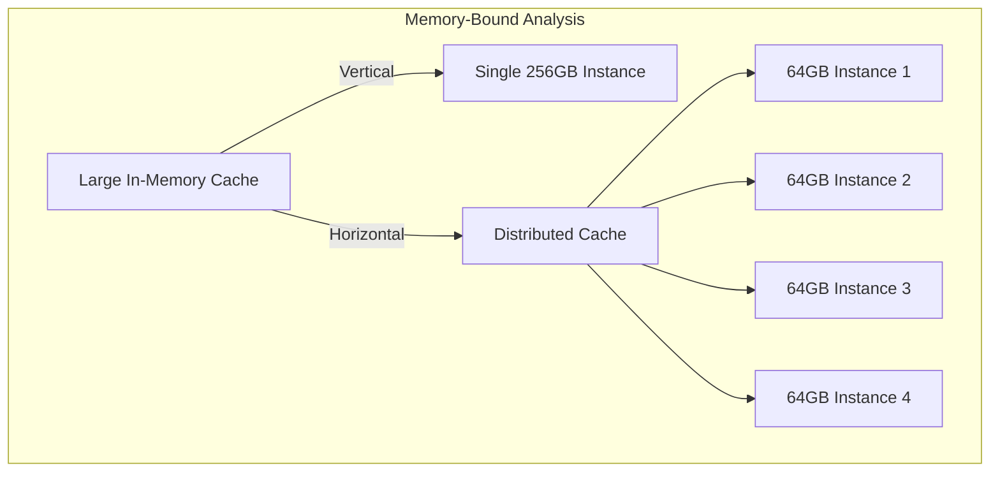

**Decision factors:**
- Can the dataset be partitioned? -> Horizontal with sharding
- Is data access pattern random? -> Vertical may be simpler
- Is consistency critical? -> Consider distributed database tradeoffs

### I/O-Bound Workloads

Workloads limited by disk or network I/O often scale well horizontally because waiting can be parallelized:

```yaml
# Deployment for I/O-bound workload
apiVersion: apps/v1
kind: Deployment
metadata:
  name: file-processor
spec:
  replicas: 10  # Many small instances
  template:
    spec:
      containers:
        - name: processor
          resources:
            requests:
              cpu: 500m      # Low CPU - we're I/O bound
              memory: 512Mi
            limits:
              cpu: 1000m
              memory: 1Gi
```

---

## Stateless vs Stateful Considerations

The statefulness of your application is the single biggest factor in horizontal scaling complexity.

### Stateless Applications

Stateless applications are ideal for horizontal scaling. Any instance can handle any request:

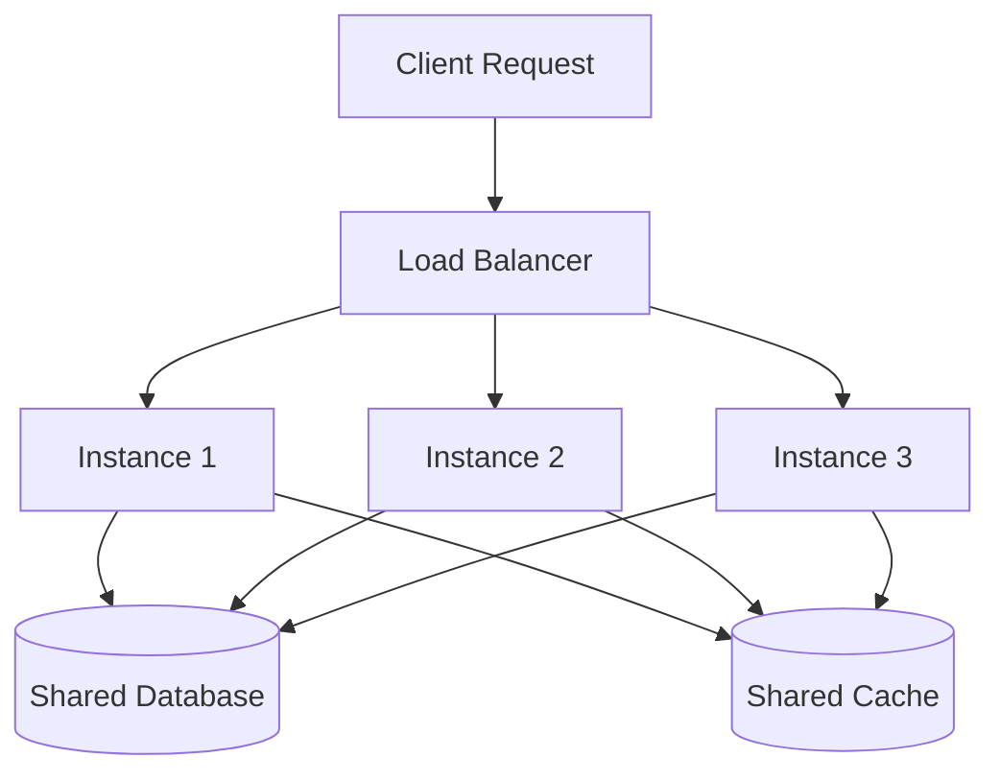

**Checklist for stateless design:**

```yaml
# Kubernetes Deployment for stateless app
apiVersion: apps/v1
kind: Deployment
metadata:
  name: stateless-api
spec:
  replicas: 5
  strategy:
    type: RollingUpdate
    rollingUpdate:
      maxSurge: 25%        # Can add 25% extra during update
      maxUnavailable: 25%   # Can remove 25% during update
  template:
    spec:
      containers:
        - name: api
          image: api:v1.2.3
          env:
            # Session stored externally
            - name: SESSION_STORE
              value: "redis://redis-cluster:6379"
            # No local file storage
            - name: UPLOAD_BACKEND
              value: "s3://uploads-bucket"
            # Config from environment, not files
            - name: DATABASE_URL
              valueFrom:
                secretKeyRef:
                  name: db-credentials
                  key: url
```

**Making applications stateless:**

1. **Externalize session state** to Redis or a database
2. **Use object storage** (S3, MinIO) instead of local disk
3. **Store configuration** in environment variables or ConfigMaps
4. **Make requests idempotent** - same request produces same result

### Stateful Applications

Stateful applications require more careful horizontal scaling strategies:

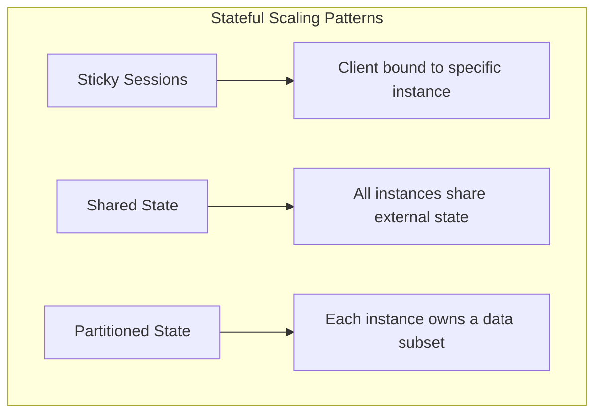

**Pattern 1: Sticky Sessions**

```yaml
# Ingress with session affinity
apiVersion: networking.k8s.io/v1
kind: Ingress
metadata:
  name: stateful-app
  annotations:
    nginx.ingress.kubernetes.io/affinity: "cookie"
    nginx.ingress.kubernetes.io/session-cookie-name: "SERVERID"
    nginx.ingress.kubernetes.io/session-cookie-max-age: "3600"
spec:
  rules:
    - host: app.example.com
      http:
        paths:
          - path: /
            pathType: Prefix
            backend:
              service:
                name: stateful-app
                port:
                  number: 80
```

**Pattern 2: StatefulSets for Ordered Scaling**

```yaml
# StatefulSet for databases or services needing stable identity
apiVersion: apps/v1
kind: StatefulSet
metadata:
  name: database
spec:
  serviceName: database
  replicas: 3
  podManagementPolicy: OrderedReady  # Scale one at a time
  selector:
    matchLabels:
      app: database
  template:
    metadata:
      labels:
        app: database
    spec:
      containers:
        - name: db
          image: postgres:15
          volumeMounts:
            - name: data
              mountPath: /var/lib/postgresql/data
  volumeClaimTemplates:
    - metadata:
        name: data
      spec:
        accessModes: ["ReadWriteOnce"]
        resources:
          requests:
            storage: 100Gi
```

---

## Cost-Benefit Analysis Framework

Every scaling decision has cost implications. Use this framework to analyze options:

### Direct Costs

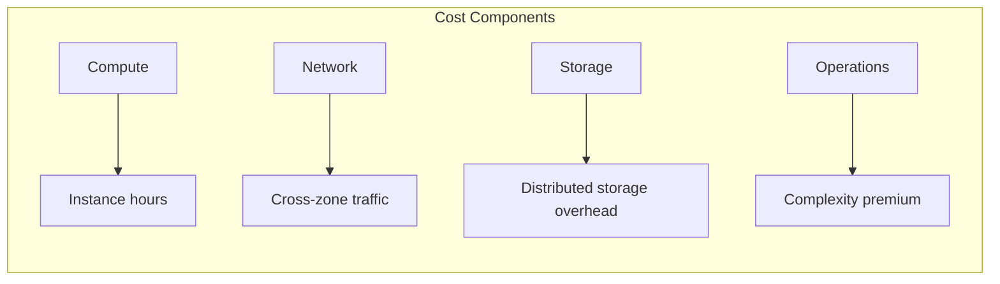

**Cost comparison template:**

| Factor | Vertical Scaling | Horizontal Scaling |
|--------|------------------|-------------------|
| Compute | Premium for large instances | Standard rates, more flexibility |
| Network | Minimal inter-node traffic | Cross-instance communication |
| Storage | Single volume, simpler | Distributed, replication overhead |
| Operations | Simpler to manage | More complex, requires automation |
| Downtime | Required for upgrades | Rolling updates possible |

### Hidden Costs of Horizontal Scaling

```python
# Hidden complexity costs to consider

# 1. Distributed Tracing Requirement
# Without proper tracing, debugging distributed systems is painful
OTEL_EXPORTER_OTLP_ENDPOINT = "https://oneuptime.com/otlp"

# 2. Service Mesh Overhead
# ~10-15% CPU overhead for sidecar proxies
resource_overhead = base_cpu * 0.15

# 3. Coordination Costs
# Leader election, distributed locks, consensus
coordination_latency_ms = 5  # Added to every coordinated operation

# 4. Testing Complexity
# Need chaos engineering, failure injection
test_environments_needed = ["single", "multi-node", "failure-mode"]
```

### Break-Even Analysis

Calculate when horizontal scaling becomes cost-effective:

```python
# Simplified cost model for scaling decision

def calculate_break_even():
    # Vertical scaling costs
    large_instance_hourly = 2.50  # 64-core instance
    vertical_monthly = large_instance_hourly * 730  # $1,825

    # Horizontal scaling costs
    small_instance_hourly = 0.20  # 4-core instance
    load_balancer_monthly = 25
    network_overhead_percent = 0.10

    # At what replica count does horizontal become cheaper?
    for replicas in range(1, 20):
        horizontal_monthly = (
            small_instance_hourly * 730 * replicas +
            load_balancer_monthly +
            (small_instance_hourly * 730 * replicas * network_overhead_percent)
        )

        if horizontal_monthly < vertical_monthly:
            return replicas, horizontal_monthly

    return None, None

# Result: At ~8 replicas with autoscaling (avg 5),
# horizontal is typically cheaper
```

---

## Scaling Speed Requirements

How fast you need to scale determines your architecture choices.

### Reactive Scaling (Minutes)

Standard Kubernetes HPA responds in 1-5 minutes:

```yaml
apiVersion: autoscaling/v2
kind: HorizontalPodAutoscaler
metadata:
  name: standard-scaling
spec:
  scaleTargetRef:
    apiVersion: apps/v1
    kind: Deployment
    name: api
  minReplicas: 3
  maxReplicas: 50
  metrics:
    - type: Resource
      resource:
        name: cpu
        target:
          type: Utilization
          averageUtilization: 70
  # Default behavior: scales within 1-5 minutes
```

**Suitable for:**
- Gradual traffic increases
- Predictable growth patterns
- Services tolerant of brief latency spikes

### Proactive Scaling (Seconds to Minutes)

KEDA enables event-driven scaling based on external metrics:

```yaml
# KEDA ScaledObject for queue-based scaling
apiVersion: keda.sh/v1alpha1
kind: ScaledObject
metadata:
  name: queue-processor
spec:
  scaleTargetRef:
    name: queue-processor
  minReplicaCount: 1
  maxReplicaCount: 100
  pollingInterval: 15          # Check queue every 15 seconds
  cooldownPeriod: 30           # Wait 30s before scaling down
  triggers:
    - type: rabbitmq
      metadata:
        queueName: jobs
        host: amqp://rabbitmq:5672
        queueLength: "50"      # Scale up when queue > 50 messages
```

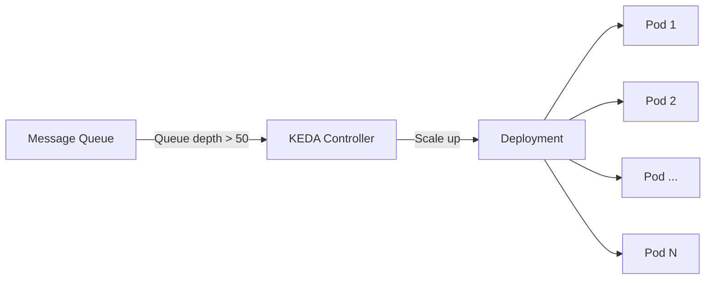

### Predictive Scaling (Pre-provisioned)

For known events, schedule scaling in advance:

```yaml
# CronJob to pre-scale before known traffic spike
apiVersion: batch/v1
kind: CronJob
metadata:
  name: pre-scale-for-morning-rush
spec:
  schedule: "0 7 * * 1-5"  # 7 AM on weekdays
  jobTemplate:
    spec:
      template:
        spec:
          containers:
            - name: scaler
              image: bitnami/kubectl:latest
              command:
                - /bin/sh
                - -c
                - |
                  kubectl scale deployment/api --replicas=20
                  echo "Pre-scaled to 20 replicas for morning rush"
          restartPolicy: OnFailure
---
# Scale back down after rush hour
apiVersion: batch/v1
kind: CronJob
metadata:
  name: scale-down-after-rush
spec:
  schedule: "0 10 * * 1-5"  # 10 AM on weekdays
  jobTemplate:
    spec:
      template:
        spec:
          containers:
            - name: scaler
              image: bitnami/kubectl:latest
              command:
                - /bin/sh
                - -c
                - |
                  kubectl scale deployment/api --replicas=5
                  echo "Scaled down to baseline"
          restartPolicy: OnFailure
```

### Instant Scaling (Serverless)

For truly instant scaling, consider serverless or pre-warmed pools:

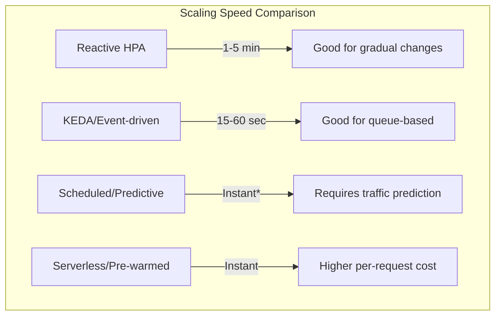

---

## Data Distribution Impact

Horizontal scaling creates data distribution challenges. Plan for these from day one.

### Database Scaling Patterns

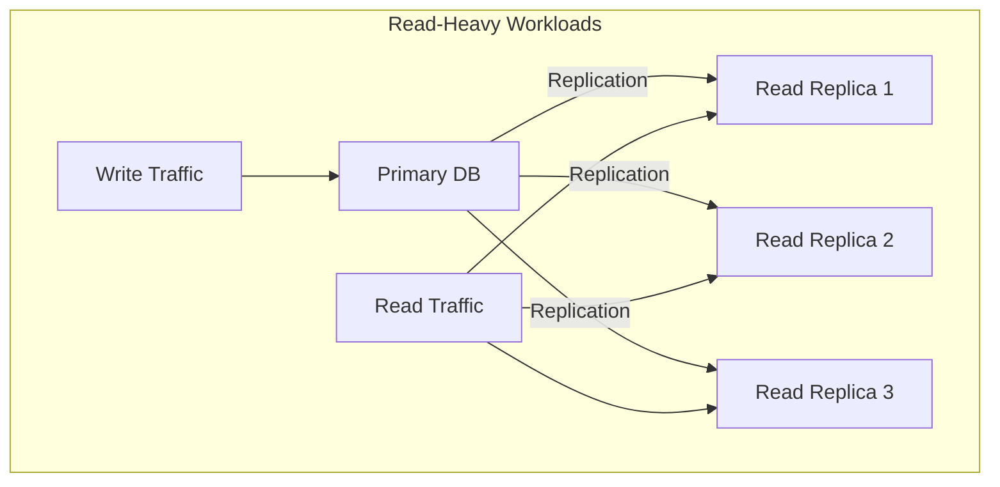

**Read replicas for read-heavy workloads:**

```yaml
# Application configuration for read replicas
apiVersion: v1
kind: ConfigMap
metadata:
  name: db-config
data:
  # Primary for writes
  DATABASE_WRITE_URL: "postgresql://primary.db:5432/app"
  # Read replicas for queries
  DATABASE_READ_URL: "postgresql://replica-1.db:5432,replica-2.db:5432/app"
  # Connection pooling is essential
  DATABASE_POOL_SIZE: "20"
  DATABASE_POOL_MODE: "transaction"
```

### Caching Strategies

Horizontal scaling increases cache importance:

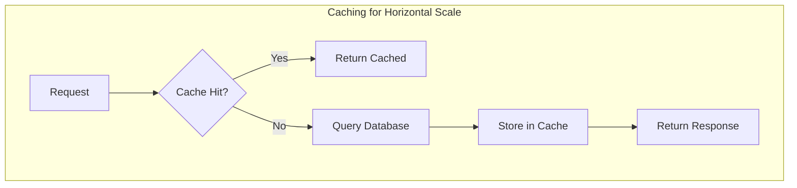

```yaml
# Redis cluster for distributed caching
apiVersion: apps/v1
kind: StatefulSet
metadata:
  name: redis-cluster
spec:
  serviceName: redis-cluster
  replicas: 6  # 3 masters + 3 replicas
  selector:
    matchLabels:
      app: redis-cluster
  template:
    metadata:
      labels:
        app: redis-cluster
    spec:
      containers:
        - name: redis
          image: redis:7
          command:
            - redis-server
            - /conf/redis.conf
            - --cluster-enabled yes
            - --cluster-node-timeout 5000
          ports:
            - containerPort: 6379
            - containerPort: 16379
          volumeMounts:
            - name: data
              mountPath: /data
  volumeClaimTemplates:
    - metadata:
        name: data
      spec:
        accessModes: ["ReadWriteOnce"]
        resources:
          requests:
            storage: 10Gi
```

### Session Management

With horizontal scaling, sessions must be externalized:

```python
# Session configuration for horizontal scaling
from fastapi import FastAPI, Request
from starlette.middleware.sessions import SessionMiddleware
import redis

app = FastAPI()

# Use Redis for session storage instead of local memory
redis_client = redis.Redis(
    host='redis-cluster',
    port=6379,
    decode_responses=True
)

app.add_middleware(
    SessionMiddleware,
    secret_key="your-secret-key",
    session_cookie="session_id",
    backend=RedisSessionBackend(redis_client)  # External session store
)

@app.get("/")
async def root(request: Request):
    # Session works the same regardless of which instance handles the request
    visits = request.session.get("visits", 0) + 1
    request.session["visits"] = visits
    return {"visits": visits}
```

---

## Decision Framework: When to Scale Horizontally

Use this decision tree to guide your scaling choices:

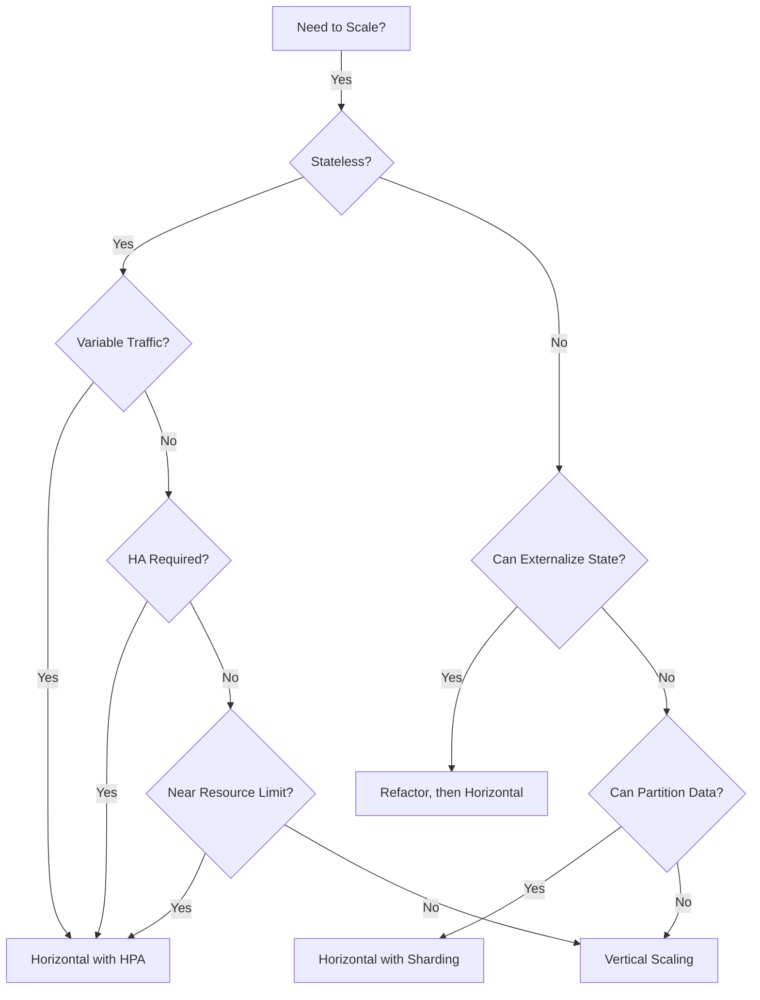

### Quick Assessment Checklist

Score your application (1-5 scale):

| Factor | Score 1 (Vertical) | Score 5 (Horizontal) |
|--------|-------------------|---------------------|
| Statefulness | Heavy local state | Fully stateless |
| Traffic pattern | Constant | Highly variable |
| Availability needs | Can tolerate downtime | Must be always-on |
| Team expertise | Limited K8s experience | Strong K8s/cloud-native |
| Time to implement | Need solution today | Can invest in architecture |

**Total score:**
- 5-12: Consider vertical scaling first
- 13-18: Either approach viable, evaluate costs
- 19-25: Horizontal scaling recommended

---

## Implementation Roadmap

Once you've decided to scale horizontally, follow this phased approach:

### Phase 1: Foundation (Week 1-2)

```yaml
# Start with basic multi-replica deployment
apiVersion: apps/v1
kind: Deployment
metadata:
  name: api
spec:
  replicas: 3  # Start with fixed replicas
  selector:
    matchLabels:
      app: api
  template:
    metadata:
      labels:
        app: api
    spec:
      containers:
        - name: api
          image: api:v1.0
          resources:
            requests:
              cpu: 500m
              memory: 512Mi
            limits:
              cpu: 1000m
              memory: 1Gi
          readinessProbe:
            httpGet:
              path: /health
              port: 8080
            initialDelaySeconds: 5
            periodSeconds: 10
          livenessProbe:
            httpGet:
              path: /health
              port: 8080
            initialDelaySeconds: 15
            periodSeconds: 20
```

### Phase 2: Observability (Week 2-3)

```yaml
# Add metrics for scaling decisions
apiVersion: monitoring.coreos.com/v1
kind: ServiceMonitor
metadata:
  name: api-metrics
spec:
  selector:
    matchLabels:
      app: api
  endpoints:
    - port: metrics
      interval: 15s
      path: /metrics
---
# Custom metrics for business-level scaling
apiVersion: monitoring.coreos.com/v1
kind: PrometheusRule
metadata:
  name: api-scaling-rules
spec:
  groups:
    - name: scaling
      rules:
        - record: api:requests:rate5m
          expr: sum(rate(http_requests_total[5m])) by (service)
        - record: api:latency:p99
          expr: histogram_quantile(0.99, sum(rate(http_request_duration_seconds_bucket[5m])) by (le))
```

### Phase 3: Autoscaling (Week 3-4)

```yaml
# Enable HPA with proven metrics
apiVersion: autoscaling/v2
kind: HorizontalPodAutoscaler
metadata:
  name: api
spec:
  scaleTargetRef:
    apiVersion: apps/v1
    kind: Deployment
    name: api
  minReplicas: 3
  maxReplicas: 20
  metrics:
    - type: Resource
      resource:
        name: cpu
        target:
          type: Utilization
          averageUtilization: 70
  behavior:
    scaleDown:
      stabilizationWindowSeconds: 300
      policies:
        - type: Percent
          value: 10
          periodSeconds: 60
    scaleUp:
      stabilizationWindowSeconds: 0
      policies:
        - type: Percent
          value: 50
          periodSeconds: 60
```

### Phase 4: Optimization (Ongoing)

- Monitor scaling events and adjust thresholds
- Add custom metrics for business-driven scaling
- Implement pod disruption budgets for stability
- Set up alerts for scaling limits

```yaml
# Pod Disruption Budget to maintain availability during scaling
apiVersion: policy/v1
kind: PodDisruptionBudget
metadata:
  name: api-pdb
spec:
  minAvailable: 2  # Always keep at least 2 pods running
  selector:
    matchLabels:
      app: api
```

---

## Common Mistakes to Avoid

| Mistake | Consequence | Prevention |
|---------|-------------|------------|
| Scaling without load testing | Unknown breaking points | Load test at 2x expected peak |
| No resource requests/limits | Uneven distribution, OOM | Set requests = typical, limits = peak |
| Ignoring network latency | Cross-instance calls add latency | Benchmark inter-pod communication |
| Same scaling for all services | Over/under-provisioning | Tune HPA per service profile |
| No scaling limits | Runaway costs during incidents | Set maxReplicas based on budget |

---

## Measuring Success

Track these metrics to validate your horizontal scaling implementation:

```promql
# Scaling efficiency - are we right-sized?
avg(container_cpu_usage_seconds_total) / avg(container_spec_cpu_quota)
# Target: 60-80%

# Scaling responsiveness - how fast do we react?
histogram_quantile(0.95, rate(kube_hpa_status_desired_replicas[5m]))
# Track desired vs actual replica count

# Cost per request - is scaling cost-effective?
sum(rate(container_cpu_usage_seconds_total[1h])) * cost_per_cpu_hour
/ sum(rate(http_requests_total[1h]))
# Should decrease or stay flat as traffic grows
```

---

## Final Thoughts

Horizontal scaling isn't just a technical decision - it's an architectural commitment. Done right, it provides:

- **Resilience**: No single point of failure
- **Elasticity**: Match capacity to demand
- **Cost efficiency**: Pay for what you use
- **Deployment flexibility**: Rolling updates without downtime

But it also demands:
- **Stateless design** or careful state management
- **Observability investment** to understand distributed behavior
- **Operational maturity** to manage more moving parts

Start with the decision framework. Analyze your workload characteristics. Calculate the cost-benefit. Then implement incrementally, measuring at each step.

The goal isn't to scale horizontally because it's trendy. The goal is to scale in the way that best serves your users, your team, and your budget.

---

**Related Reading:**

- [How to Autoscale Deployments with the Horizontal Pod Autoscaler](https://oneuptime.com/blog/post/2025-11-27-hpa-autoscale/view)
- [Kubernetes Multi-Cluster High Availability](https://oneuptime.com/blog/post/2026-01-06-kubernetes-multi-cluster-high-availability/view)
- [SRE Metrics to Track](https://oneuptime.com/blog/post/2025-11-28-sre-metrics-to-track/view)
