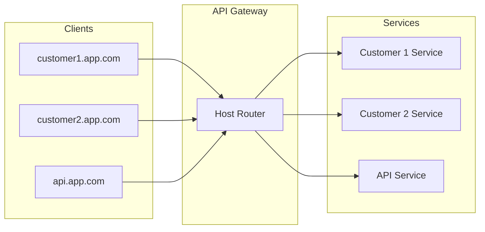
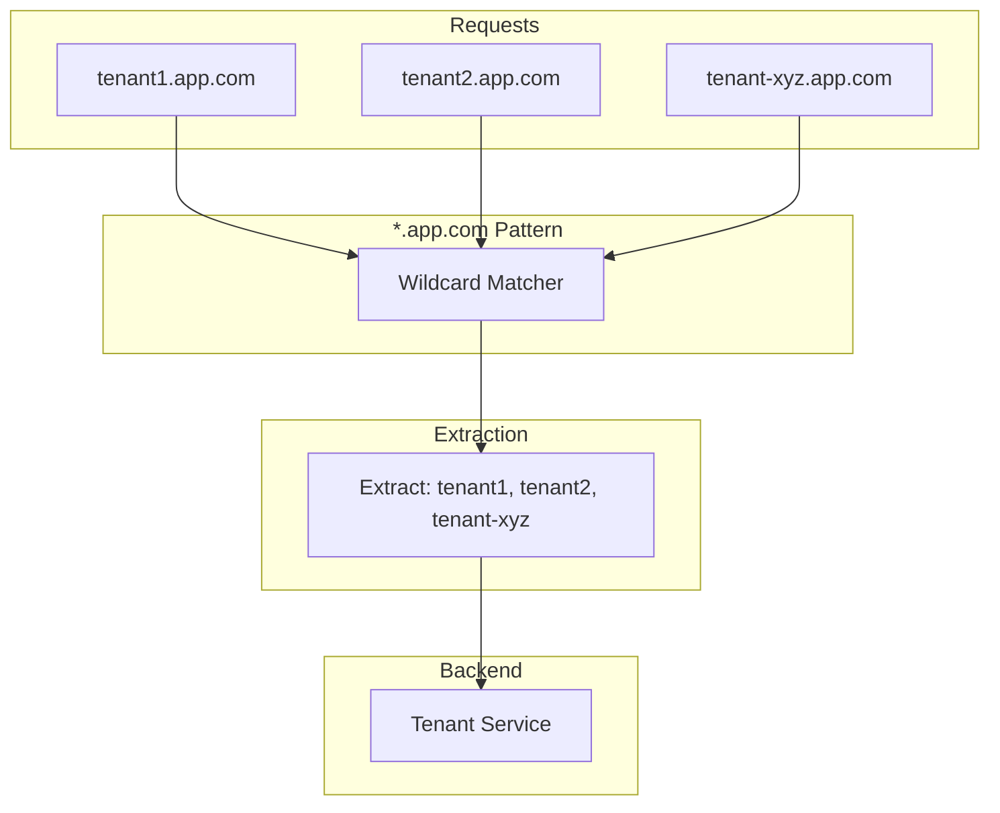
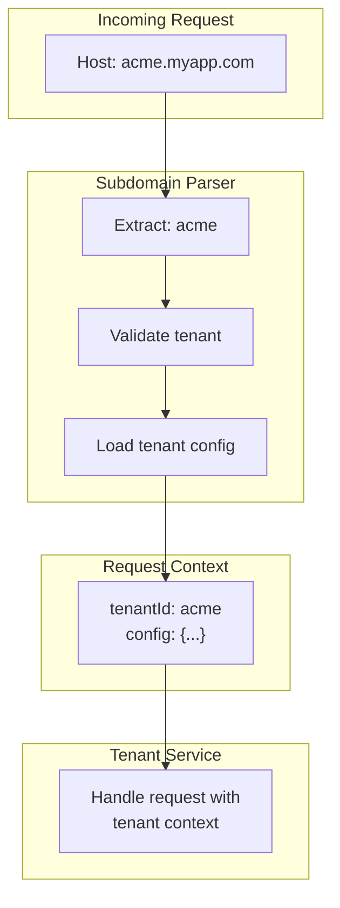
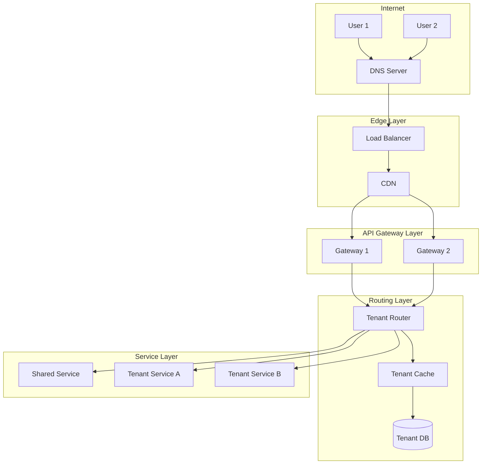
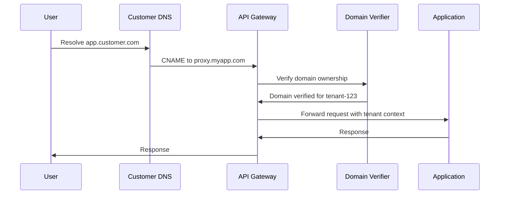
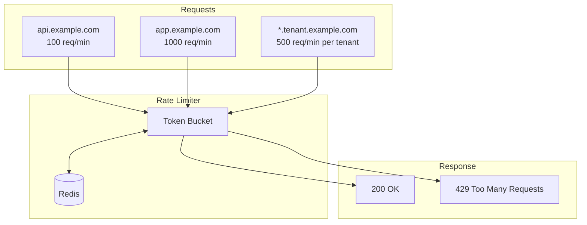

# How to Build Host-Based Routing

Author: [nawazdhandala](https://github.com/nawazdhandala)

Tags: API Gateway, Routing, DNS, Multi-Tenant

Description: Learn how to route requests based on host headers for multi-tenant applications.

---

Host-based routing is the backbone of multi-tenant applications. Instead of routing based on URL paths, you route based on the hostname in the request. This lets you serve `customer1.yourapp.com` and `customer2.yourapp.com` from the same infrastructure while keeping their traffic completely separate.

## Understanding Host-Based Routing

When a request hits your API gateway, it contains a `Host` header that tells you which domain the client is trying to reach. Host-based routing uses this header to determine where to send the request.



### Why Host-Based Routing?

- **Clean URLs**: `/dashboard` instead of `/customer1/dashboard`
- **Tenant isolation**: Each tenant gets their own subdomain
- **Custom domains**: Let customers use their own domains
- **Microservices flexibility**: Route different hosts to different services

## Host Header Matching

The simplest form of host-based routing matches the exact hostname.

### Basic Implementation in Node.js

```javascript
const http = require('http');

const routes = {
  'api.example.com': { target: 'http://api-service:3000' },
  'app.example.com': { target: 'http://app-service:3000' },
  'admin.example.com': { target: 'http://admin-service:3000' }
};

const server = http.createServer((req, res) => {
  // Extract host without port
  const host = req.headers.host?.split(':')[0];

  const route = routes[host];

  if (!route) {
    res.writeHead(404, { 'Content-Type': 'application/json' });
    res.end(JSON.stringify({ error: 'Unknown host', host }));
    return;
  }

  // Forward to target service
  proxyRequest(req, res, route.target);
});

function proxyRequest(req, res, target) {
  const url = new URL(target);

  const options = {
    hostname: url.hostname,
    port: url.port,
    path: req.url,
    method: req.method,
    headers: {
      ...req.headers,
      'X-Forwarded-Host': req.headers.host,
      'X-Forwarded-Proto': 'https'
    }
  };

  const proxy = http.request(options, (proxyRes) => {
    res.writeHead(proxyRes.statusCode, proxyRes.headers);
    proxyRes.pipe(res);
  });

  req.pipe(proxy);
}

server.listen(8080, () => {
  console.log('Host-based router listening on port 8080');
});
```

### Using Express.js with vhost

```javascript
const express = require('express');
const vhost = require('vhost');

const app = express();

// Create separate apps for each host
const apiApp = express();
apiApp.get('/', (req, res) => res.json({ service: 'api' }));
apiApp.get('/health', (req, res) => res.json({ status: 'healthy' }));

const appApp = express();
appApp.get('/', (req, res) => res.json({ service: 'app' }));

const adminApp = express();
adminApp.use((req, res, next) => {
  // Admin-specific middleware
  if (!req.headers['x-admin-token']) {
    return res.status(401).json({ error: 'Admin token required' });
  }
  next();
});
adminApp.get('/', (req, res) => res.json({ service: 'admin' }));

// Mount apps on their respective hosts
app.use(vhost('api.example.com', apiApp));
app.use(vhost('app.example.com', appApp));
app.use(vhost('admin.example.com', adminApp));

// Catch-all for unknown hosts
app.use((req, res) => {
  res.status(404).json({
    error: 'Unknown host',
    host: req.headers.host,
    hint: 'Valid hosts: api.example.com, app.example.com, admin.example.com'
  });
});

app.listen(8080);
```

## Wildcard Host Patterns

Wildcard patterns let you match dynamic subdomains without configuring each one individually.



### Wildcard Matching Implementation

```javascript
class HostRouter {
  constructor() {
    this.exactRoutes = new Map();
    this.wildcardRoutes = [];
  }

  addRoute(pattern, handler) {
    if (pattern.startsWith('*.')) {
      // Wildcard pattern: *.example.com
      const suffix = pattern.slice(1); // .example.com
      this.wildcardRoutes.push({ suffix, handler });
    } else {
      // Exact match
      this.exactRoutes.set(pattern, handler);
    }
  }

  match(host) {
    // Remove port if present
    const hostname = host.split(':')[0].toLowerCase();

    // Try exact match first
    if (this.exactRoutes.has(hostname)) {
      return {
        handler: this.exactRoutes.get(hostname),
        params: {}
      };
    }

    // Try wildcard matches
    for (const { suffix, handler } of this.wildcardRoutes) {
      if (hostname.endsWith(suffix) && hostname.length > suffix.length) {
        const subdomain = hostname.slice(0, -suffix.length);
        return {
          handler,
          params: { subdomain }
        };
      }
    }

    return null;
  }
}

// Usage
const router = new HostRouter();

router.addRoute('api.example.com', (req, res) => {
  res.json({ type: 'api' });
});

router.addRoute('*.tenant.example.com', (req, res, params) => {
  res.json({
    type: 'tenant',
    tenantId: params.subdomain
  });
});

router.addRoute('*.example.com', (req, res, params) => {
  res.json({
    type: 'app',
    subdomain: params.subdomain
  });
});
```

### Priority-Based Wildcard Matching

When multiple patterns could match, you need clear priority rules.

```javascript
class PriorityHostRouter {
  constructor() {
    this.routes = [];
  }

  addRoute(pattern, handler, priority = 0) {
    this.routes.push({ pattern, handler, priority });
    // Sort by priority (higher first), then by specificity
    this.routes.sort((a, b) => {
      if (b.priority !== a.priority) return b.priority - a.priority;
      // More specific patterns (longer, fewer wildcards) first
      return this.specificity(b.pattern) - this.specificity(a.pattern);
    });
  }

  specificity(pattern) {
    let score = pattern.length;
    if (pattern.startsWith('*.')) score -= 100; // Wildcards are less specific
    return score;
  }

  match(host) {
    const hostname = host.split(':')[0].toLowerCase();

    for (const route of this.routes) {
      const result = this.matchPattern(hostname, route.pattern);
      if (result) {
        return { handler: route.handler, params: result };
      }
    }

    return null;
  }

  matchPattern(hostname, pattern) {
    if (pattern.startsWith('*.')) {
      const suffix = pattern.slice(1);
      if (hostname.endsWith(suffix) && hostname.length > suffix.length) {
        return { subdomain: hostname.slice(0, -suffix.length) };
      }
    } else if (hostname === pattern) {
      return {};
    }
    return null;
  }
}

// Example: api.tenant.example.com should match specific pattern
const router = new PriorityHostRouter();

router.addRoute('*.example.com', handleGeneric, 0);
router.addRoute('*.tenant.example.com', handleTenant, 10);
router.addRoute('api.tenant.example.com', handleTenantApi, 20);
```

## Subdomain-Based Routing

Subdomain routing is perfect for multi-tenant SaaS applications where each customer gets their own subdomain.



### Subdomain Extraction Middleware

```javascript
const express = require('express');
const app = express();

// Tenant configuration store (in production, use a database)
const tenants = new Map([
  ['acme', { id: 'acme', plan: 'enterprise', dbName: 'acme_db' }],
  ['startup', { id: 'startup', plan: 'basic', dbName: 'startup_db' }],
  ['bigcorp', { id: 'bigcorp', plan: 'enterprise', dbName: 'bigcorp_db' }]
]);

// Subdomain extraction middleware
function extractTenant(baseDomain) {
  return async (req, res, next) => {
    const host = req.headers.host?.split(':')[0];

    if (!host) {
      return res.status(400).json({ error: 'Host header required' });
    }

    // Check if host matches base domain pattern
    if (!host.endsWith(baseDomain)) {
      return res.status(400).json({
        error: 'Invalid domain',
        expected: `*.${baseDomain}`
      });
    }

    // Extract subdomain
    const subdomain = host.slice(0, -(baseDomain.length + 1));

    if (!subdomain || subdomain.includes('.')) {
      return res.status(400).json({ error: 'Invalid subdomain' });
    }

    // Look up tenant
    const tenant = tenants.get(subdomain);

    if (!tenant) {
      return res.status(404).json({
        error: 'Tenant not found',
        subdomain
      });
    }

    // Attach tenant to request
    req.tenant = tenant;
    req.tenantId = tenant.id;

    // Add tenant ID to all responses
    res.setHeader('X-Tenant-ID', tenant.id);

    next();
  };
}

// Apply middleware
app.use(extractTenant('myapp.com'));

// Routes now have access to req.tenant
app.get('/api/data', (req, res) => {
  res.json({
    tenant: req.tenant.id,
    plan: req.tenant.plan,
    message: `Hello, ${req.tenant.id}!`
  });
});

app.get('/api/config', (req, res) => {
  // Return tenant-specific configuration
  res.json({
    tenant: req.tenant.id,
    features: getFeaturesByPlan(req.tenant.plan),
    limits: getLimitsByPlan(req.tenant.plan)
  });
});

function getFeaturesByPlan(plan) {
  const features = {
    basic: ['dashboard', 'reports'],
    enterprise: ['dashboard', 'reports', 'api', 'sso', 'audit-log']
  };
  return features[plan] || features.basic;
}

function getLimitsByPlan(plan) {
  const limits = {
    basic: { requests: 1000, storage: '1GB' },
    enterprise: { requests: 100000, storage: '100GB' }
  };
  return limits[plan] || limits.basic;
}

app.listen(8080);
```

### Database Connection per Tenant

```javascript
const { Pool } = require('pg');

class TenantDatabaseManager {
  constructor() {
    this.pools = new Map();
  }

  getPool(tenant) {
    if (!this.pools.has(tenant.id)) {
      const pool = new Pool({
        host: process.env.DB_HOST,
        database: tenant.dbName,
        user: process.env.DB_USER,
        password: process.env.DB_PASSWORD,
        max: 10
      });
      this.pools.set(tenant.id, pool);
    }
    return this.pools.get(tenant.id);
  }

  async query(tenant, sql, params) {
    const pool = this.getPool(tenant);
    return pool.query(sql, params);
  }
}

const dbManager = new TenantDatabaseManager();

// Middleware to attach database to request
app.use((req, res, next) => {
  req.db = {
    query: (sql, params) => dbManager.query(req.tenant, sql, params)
  };
  next();
});

// Use in routes
app.get('/api/users', async (req, res) => {
  const result = await req.db.query('SELECT * FROM users LIMIT 100');
  res.json(result.rows);
});
```

## Multi-Tenant Routing Architecture

A production multi-tenant system needs careful architecture to handle routing, isolation, and scalability.



### Complete Multi-Tenant Router

```javascript
const express = require('express');
const Redis = require('ioredis');

const app = express();
const redis = new Redis(process.env.REDIS_URL);

class MultiTenantRouter {
  constructor(options = {}) {
    this.baseDomain = options.baseDomain;
    this.redis = options.redis;
    this.tenantTTL = options.tenantTTL || 300; // 5 minutes cache
  }

  middleware() {
    return async (req, res, next) => {
      try {
        const host = this.extractHost(req);
        const tenantInfo = await this.resolveTenant(host);

        if (!tenantInfo) {
          return res.status(404).json({
            error: 'Tenant not found',
            code: 'TENANT_NOT_FOUND'
          });
        }

        if (tenantInfo.status !== 'active') {
          return res.status(403).json({
            error: 'Tenant suspended',
            code: 'TENANT_SUSPENDED',
            reason: tenantInfo.suspendReason
          });
        }

        req.tenant = tenantInfo;
        res.setHeader('X-Tenant-ID', tenantInfo.id);

        next();
      } catch (error) {
        console.error('Tenant resolution error:', error);
        res.status(500).json({
          error: 'Internal routing error',
          code: 'ROUTING_ERROR'
        });
      }
    };
  }

  extractHost(req) {
    // Support X-Forwarded-Host for proxied requests
    return req.headers['x-forwarded-host'] || req.headers.host;
  }

  async resolveTenant(host) {
    const hostname = host?.split(':')[0]?.toLowerCase();

    if (!hostname) return null;

    // Check cache first
    const cached = await this.redis.get(`tenant:host:${hostname}`);
    if (cached) {
      return JSON.parse(cached);
    }

    // Resolve tenant from database
    const tenant = await this.lookupTenant(hostname);

    if (tenant) {
      // Cache the result
      await this.redis.setex(
        `tenant:host:${hostname}`,
        this.tenantTTL,
        JSON.stringify(tenant)
      );
    }

    return tenant;
  }

  async lookupTenant(hostname) {
    // Check for exact custom domain match
    let tenant = await this.findByCustomDomain(hostname);
    if (tenant) return tenant;

    // Check for subdomain match
    if (hostname.endsWith(`.${this.baseDomain}`)) {
      const subdomain = hostname.slice(0, -(this.baseDomain.length + 1));
      tenant = await this.findBySubdomain(subdomain);
    }

    return tenant;
  }

  async findByCustomDomain(domain) {
    // In production, query your database
    const result = await db.query(
      'SELECT * FROM tenants WHERE custom_domain = $1',
      [domain]
    );
    return result.rows[0] || null;
  }

  async findBySubdomain(subdomain) {
    const result = await db.query(
      'SELECT * FROM tenants WHERE subdomain = $1',
      [subdomain]
    );
    return result.rows[0] || null;
  }

  async invalidateCache(tenantId) {
    // Called when tenant settings change
    const tenant = await db.query(
      'SELECT subdomain, custom_domain FROM tenants WHERE id = $1',
      [tenantId]
    );

    if (tenant.rows[0]) {
      const { subdomain, custom_domain } = tenant.rows[0];
      await this.redis.del(`tenant:host:${subdomain}.${this.baseDomain}`);
      if (custom_domain) {
        await this.redis.del(`tenant:host:${custom_domain}`);
      }
    }
  }
}

// Initialize router
const tenantRouter = new MultiTenantRouter({
  baseDomain: 'myapp.com',
  redis: redis
});

app.use(tenantRouter.middleware());
```

## Custom Domain Mapping

Allow tenants to use their own domains while still routing to your infrastructure.



### Domain Verification System

```javascript
const crypto = require('crypto');
const dns = require('dns').promises;

class CustomDomainManager {
  constructor(options) {
    this.redis = options.redis;
    this.db = options.db;
    this.baseDomain = options.baseDomain;
  }

  // Generate verification token for a domain
  async initiateDomainVerification(tenantId, domain) {
    // Validate domain format
    if (!this.isValidDomain(domain)) {
      throw new Error('Invalid domain format');
    }

    // Check domain isn't already claimed
    const existing = await this.db.query(
      'SELECT tenant_id FROM custom_domains WHERE domain = $1 AND verified = true',
      [domain]
    );

    if (existing.rows.length > 0) {
      throw new Error('Domain already claimed by another tenant');
    }

    // Generate verification token
    const token = crypto.randomBytes(32).toString('hex');

    // Store pending verification
    await this.db.query(`
      INSERT INTO custom_domains (tenant_id, domain, verification_token, created_at)
      VALUES ($1, $2, $3, NOW())
      ON CONFLICT (domain)
      DO UPDATE SET verification_token = $3, tenant_id = $1, verified = false
    `, [tenantId, domain, token]);

    return {
      domain,
      verificationType: 'dns',
      instructions: {
        recordType: 'TXT',
        recordName: `_myapp-verify.${domain}`,
        recordValue: `myapp-verification=${token}`,
        alternative: {
          recordType: 'CNAME',
          recordName: domain,
          recordValue: `${tenantId}.proxy.${this.baseDomain}`
        }
      }
    };
  }

  async verifyDomain(tenantId, domain) {
    // Get verification token
    const result = await this.db.query(
      'SELECT verification_token FROM custom_domains WHERE tenant_id = $1 AND domain = $2',
      [tenantId, domain]
    );

    if (!result.rows.length) {
      throw new Error('No pending verification for this domain');
    }

    const token = result.rows[0].verification_token;

    // Check DNS TXT record
    const txtVerified = await this.verifyTxtRecord(domain, token);

    // Check CNAME record
    const cnameVerified = await this.verifyCnameRecord(domain, tenantId);

    if (!txtVerified && !cnameVerified) {
      return {
        verified: false,
        error: 'DNS records not found. Please add the required DNS records and try again.'
      };
    }

    // Mark domain as verified
    await this.db.query(
      'UPDATE custom_domains SET verified = true, verified_at = NOW() WHERE tenant_id = $1 AND domain = $2',
      [tenantId, domain]
    );

    // Clear cache
    await this.redis.del(`tenant:host:${domain}`);

    return { verified: true, domain };
  }

  async verifyTxtRecord(domain, token) {
    try {
      const records = await dns.resolveTxt(`_myapp-verify.${domain}`);
      const flatRecords = records.flat();
      return flatRecords.some(r => r === `myapp-verification=${token}`);
    } catch (error) {
      return false;
    }
  }

  async verifyCnameRecord(domain, tenantId) {
    try {
      const records = await dns.resolveCname(domain);
      const expected = `${tenantId}.proxy.${this.baseDomain}`;
      return records.some(r => r.toLowerCase() === expected.toLowerCase());
    } catch (error) {
      return false;
    }
  }

  isValidDomain(domain) {
    const pattern = /^(?:[a-z0-9](?:[a-z0-9-]{0,61}[a-z0-9])?\.)+[a-z]{2,}$/i;
    return pattern.test(domain);
  }

  // SSL certificate provisioning (using Let's Encrypt)
  async provisionCertificate(domain) {
    // In production, integrate with ACME client (e.g., acme.js, certbot)
    // This is a simplified example
    console.log(`Provisioning SSL certificate for ${domain}`);

    // Store certificate status
    await this.db.query(`
      UPDATE custom_domains
      SET ssl_status = 'provisioning', ssl_updated_at = NOW()
      WHERE domain = $1
    `, [domain]);

    // Trigger certificate provisioning (async process)
    // await acmeClient.createCertificate(domain);
  }
}

// API endpoints for domain management
const domainManager = new CustomDomainManager({ redis, db, baseDomain: 'myapp.com' });

app.post('/api/domains', async (req, res) => {
  const { domain } = req.body;

  try {
    const verification = await domainManager.initiateDomainVerification(
      req.tenant.id,
      domain
    );
    res.json(verification);
  } catch (error) {
    res.status(400).json({ error: error.message });
  }
});

app.post('/api/domains/:domain/verify', async (req, res) => {
  try {
    const result = await domainManager.verifyDomain(
      req.tenant.id,
      req.params.domain
    );
    res.json(result);
  } catch (error) {
    res.status(400).json({ error: error.message });
  }
});
```

## Host-Based Rate Limiting

Different hosts often need different rate limits. API endpoints might have strict limits, while static content hosts can be more permissive.



### Host-Aware Rate Limiter

```javascript
const Redis = require('ioredis');
const redis = new Redis(process.env.REDIS_URL);

class HostBasedRateLimiter {
  constructor(options = {}) {
    this.redis = options.redis;
    this.defaultLimits = options.defaultLimits || {
      requests: 100,
      window: 60 // seconds
    };
    this.hostLimits = new Map(options.hostLimits || []);
  }

  addHostLimit(pattern, limits) {
    this.hostLimits.set(pattern, limits);
  }

  getLimitsForHost(host) {
    const hostname = host.split(':')[0].toLowerCase();

    // Check exact match
    if (this.hostLimits.has(hostname)) {
      return this.hostLimits.get(hostname);
    }

    // Check wildcard patterns
    for (const [pattern, limits] of this.hostLimits) {
      if (pattern.startsWith('*.')) {
        const suffix = pattern.slice(1);
        if (hostname.endsWith(suffix)) {
          return limits;
        }
      }
    }

    return this.defaultLimits;
  }

  middleware() {
    return async (req, res, next) => {
      const host = req.headers.host;
      const limits = this.getLimitsForHost(host);

      // Create rate limit key based on host and client IP
      const clientIp = req.ip || req.connection.remoteAddress;
      const key = `ratelimit:${host}:${clientIp}`;

      try {
        const result = await this.checkRateLimit(key, limits);

        // Set rate limit headers
        res.setHeader('X-RateLimit-Limit', limits.requests);
        res.setHeader('X-RateLimit-Remaining', result.remaining);
        res.setHeader('X-RateLimit-Reset', result.reset);

        if (!result.allowed) {
          res.setHeader('Retry-After', result.retryAfter);
          return res.status(429).json({
            error: 'Too Many Requests',
            retryAfter: result.retryAfter,
            limit: limits.requests,
            window: limits.window
          });
        }

        next();
      } catch (error) {
        console.error('Rate limit error:', error);
        // Fail open - allow request if rate limiter fails
        next();
      }
    };
  }

  async checkRateLimit(key, limits) {
    const now = Date.now();
    const windowStart = now - (limits.window * 1000);

    // Use Redis sorted set for sliding window
    const pipeline = this.redis.pipeline();

    // Remove old entries
    pipeline.zremrangebyscore(key, 0, windowStart);

    // Count current entries
    pipeline.zcard(key);

    // Add current request
    pipeline.zadd(key, now, `${now}-${Math.random()}`);

    // Set expiry
    pipeline.expire(key, limits.window);

    const results = await pipeline.exec();
    const currentCount = results[1][1];

    if (currentCount >= limits.requests) {
      // Get oldest entry to calculate retry time
      const oldest = await this.redis.zrange(key, 0, 0, 'WITHSCORES');
      const oldestTime = oldest.length > 1 ? parseInt(oldest[1]) : now;
      const retryAfter = Math.ceil((oldestTime + limits.window * 1000 - now) / 1000);

      return {
        allowed: false,
        remaining: 0,
        reset: Math.ceil((now + limits.window * 1000) / 1000),
        retryAfter: Math.max(1, retryAfter)
      };
    }

    return {
      allowed: true,
      remaining: limits.requests - currentCount - 1,
      reset: Math.ceil((now + limits.window * 1000) / 1000)
    };
  }
}

// Configure rate limits per host
const rateLimiter = new HostBasedRateLimiter({
  redis,
  defaultLimits: { requests: 100, window: 60 },
  hostLimits: [
    ['api.example.com', { requests: 100, window: 60 }],
    ['app.example.com', { requests: 1000, window: 60 }],
    ['webhook.example.com', { requests: 50, window: 60 }],
    ['*.tenant.example.com', { requests: 500, window: 60 }]
  ]
});

app.use(rateLimiter.middleware());
```

### Tenant-Specific Rate Limits

```javascript
class TenantRateLimiter {
  constructor(options) {
    this.redis = options.redis;
    this.planLimits = {
      free: { requests: 100, window: 60 },
      basic: { requests: 1000, window: 60 },
      pro: { requests: 10000, window: 60 },
      enterprise: { requests: 100000, window: 60 }
    };
  }

  middleware() {
    return async (req, res, next) => {
      if (!req.tenant) {
        return next();
      }

      const limits = this.planLimits[req.tenant.plan] || this.planLimits.free;
      const key = `ratelimit:tenant:${req.tenant.id}`;

      const result = await this.checkRateLimit(key, limits);

      res.setHeader('X-RateLimit-Limit', limits.requests);
      res.setHeader('X-RateLimit-Remaining', result.remaining);
      res.setHeader('X-RateLimit-Reset', result.reset);
      res.setHeader('X-RateLimit-Plan', req.tenant.plan);

      if (!result.allowed) {
        return res.status(429).json({
          error: 'Rate limit exceeded',
          plan: req.tenant.plan,
          limit: limits.requests,
          upgrade: req.tenant.plan !== 'enterprise'
            ? 'Upgrade your plan for higher limits'
            : null
        });
      }

      next();
    };
  }

  // ... checkRateLimit same as above
}
```

## Production Configuration Examples

### Nginx Host-Based Routing

```nginx
# /etc/nginx/nginx.conf

http {
    # Upstream definitions
    upstream api_servers {
        server api-1:3000;
        server api-2:3000;
    }

    upstream app_servers {
        server app-1:3000;
        server app-2:3000;
    }

    upstream tenant_servers {
        server tenant-1:3000;
        server tenant-2:3000;
    }

    # Rate limiting zones
    limit_req_zone $binary_remote_addr zone=api_limit:10m rate=10r/s;
    limit_req_zone $binary_remote_addr zone=app_limit:10m rate=100r/s;
    limit_req_zone $http_host zone=tenant_limit:10m rate=50r/s;

    # API host
    server {
        listen 80;
        server_name api.example.com;

        limit_req zone=api_limit burst=20 nodelay;

        location / {
            proxy_pass http://api_servers;
            proxy_set_header Host $host;
            proxy_set_header X-Real-IP $remote_addr;
            proxy_set_header X-Forwarded-For $proxy_add_x_forwarded_for;
            proxy_set_header X-Forwarded-Proto $scheme;
        }
    }

    # App host
    server {
        listen 80;
        server_name app.example.com;

        limit_req zone=app_limit burst=200 nodelay;

        location / {
            proxy_pass http://app_servers;
            proxy_set_header Host $host;
            proxy_set_header X-Real-IP $remote_addr;
        }
    }

    # Wildcard tenant hosts
    server {
        listen 80;
        server_name ~^(?<tenant>.+)\.tenant\.example\.com$;

        limit_req zone=tenant_limit burst=100 nodelay;

        location / {
            proxy_pass http://tenant_servers;
            proxy_set_header Host $host;
            proxy_set_header X-Tenant-ID $tenant;
            proxy_set_header X-Real-IP $remote_addr;
        }
    }

    # Custom domains (catch-all)
    server {
        listen 80 default_server;
        server_name _;

        location / {
            proxy_pass http://tenant_servers;
            proxy_set_header Host $host;
            proxy_set_header X-Real-IP $remote_addr;
            proxy_set_header X-Custom-Domain "true";
        }
    }
}
```

### Kubernetes Ingress with Host-Based Routing

```yaml
apiVersion: networking.k8s.io/v1
kind: Ingress
metadata:
  name: multi-tenant-ingress
  annotations:
    nginx.ingress.kubernetes.io/proxy-body-size: "10m"
    nginx.ingress.kubernetes.io/rate-limit: "100"
    nginx.ingress.kubernetes.io/rate-limit-window: "1m"
spec:
  ingressClassName: nginx
  rules:
    # API host
    - host: api.example.com
      http:
        paths:
          - path: /
            pathType: Prefix
            backend:
              service:
                name: api-service
                port:
                  number: 80

    # App host
    - host: app.example.com
      http:
        paths:
          - path: /
            pathType: Prefix
            backend:
              service:
                name: app-service
                port:
                  number: 80

    # Wildcard for tenants
    - host: "*.tenant.example.com"
      http:
        paths:
          - path: /
            pathType: Prefix
            backend:
              service:
                name: tenant-service
                port:
                  number: 80

  tls:
    - hosts:
        - api.example.com
        - app.example.com
      secretName: example-com-tls
    - hosts:
        - "*.tenant.example.com"
      secretName: tenant-wildcard-tls
```

### Traefik Dynamic Configuration

```yaml
# traefik.yml
http:
  routers:
    api-router:
      rule: "Host(`api.example.com`)"
      service: api-service
      middlewares:
        - api-ratelimit

    app-router:
      rule: "Host(`app.example.com`)"
      service: app-service
      middlewares:
        - app-ratelimit

    tenant-router:
      rule: "HostRegexp(`{tenant:[a-z0-9-]+}.tenant.example.com`)"
      service: tenant-service
      middlewares:
        - tenant-headers
        - tenant-ratelimit

    custom-domain-router:
      rule: "HostRegexp(`{domain:.+}`)"
      priority: 1
      service: tenant-service
      middlewares:
        - custom-domain-headers

  middlewares:
    api-ratelimit:
      rateLimit:
        average: 100
        burst: 50

    app-ratelimit:
      rateLimit:
        average: 1000
        burst: 200

    tenant-ratelimit:
      rateLimit:
        average: 500
        burst: 100

    tenant-headers:
      headers:
        customRequestHeaders:
          X-Routing-Type: "subdomain"

    custom-domain-headers:
      headers:
        customRequestHeaders:
          X-Routing-Type: "custom-domain"

  services:
    api-service:
      loadBalancer:
        servers:
          - url: "http://api:3000"

    app-service:
      loadBalancer:
        servers:
          - url: "http://app:3000"

    tenant-service:
      loadBalancer:
        servers:
          - url: "http://tenant:3000"
```

## Best Practices

### Security Considerations

```javascript
// Validate host header to prevent host header injection
function validateHost(host, allowedPatterns) {
  if (!host) return false;

  const hostname = host.split(':')[0].toLowerCase();

  // Prevent null byte injection
  if (hostname.includes('\x00')) return false;

  // Prevent localhost/internal access
  const blocked = ['localhost', '127.0.0.1', '0.0.0.0', '::1'];
  if (blocked.includes(hostname)) return false;

  // Check against allowed patterns
  return allowedPatterns.some(pattern => {
    if (pattern.startsWith('*.')) {
      const suffix = pattern.slice(1);
      return hostname.endsWith(suffix);
    }
    return hostname === pattern;
  });
}

// Use in middleware
app.use((req, res, next) => {
  const allowedPatterns = [
    'api.example.com',
    'app.example.com',
    '*.tenant.example.com'
  ];

  if (!validateHost(req.headers.host, allowedPatterns)) {
    return res.status(400).json({ error: 'Invalid host' });
  }

  next();
});
```

### Monitoring and Observability

```javascript
// Add metrics for host-based routing
const prometheus = require('prom-client');

const routingCounter = new prometheus.Counter({
  name: 'http_requests_by_host_total',
  help: 'Total HTTP requests by host',
  labelNames: ['host', 'method', 'status']
});

const routingDuration = new prometheus.Histogram({
  name: 'http_request_duration_by_host_seconds',
  help: 'HTTP request duration by host',
  labelNames: ['host', 'method'],
  buckets: [0.01, 0.05, 0.1, 0.5, 1, 5]
});

app.use((req, res, next) => {
  const start = Date.now();
  const host = req.headers.host?.split(':')[0] || 'unknown';

  res.on('finish', () => {
    const duration = (Date.now() - start) / 1000;

    routingCounter.inc({
      host,
      method: req.method,
      status: res.statusCode
    });

    routingDuration.observe(
      { host, method: req.method },
      duration
    );
  });

  next();
});
```

---

Host-based routing is essential for building scalable multi-tenant applications. Start with simple exact-match routing, then add wildcard support and custom domains as your application grows. Remember to implement proper rate limiting per host and always validate the Host header to prevent injection attacks.
