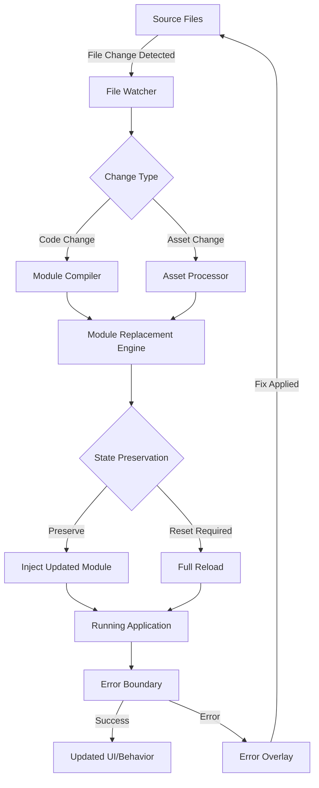
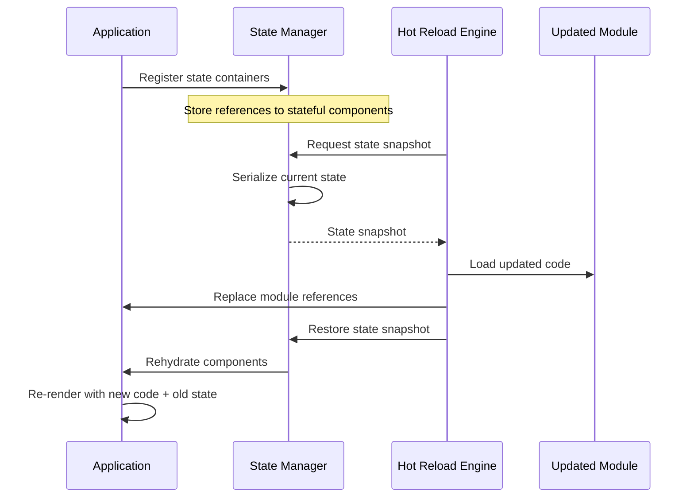
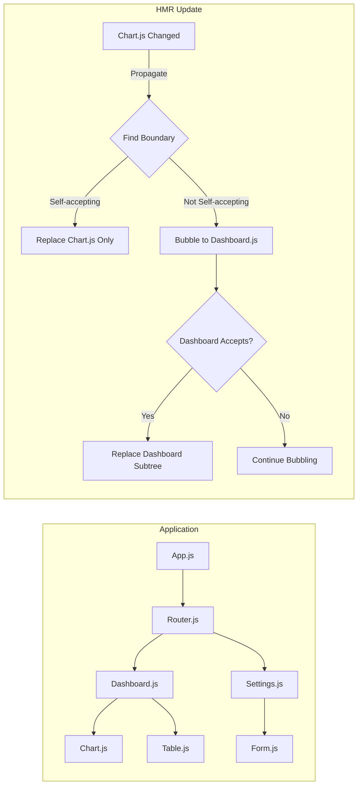
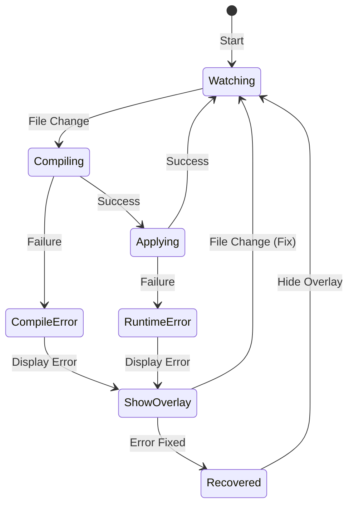

# How to Create Hot Reload Configuration

Author: [nawazdhandala](https://github.com/nawazdhandala)

Tags: Developer Experience, Hot Reload, Development Tools, Productivity

Description: Learn to configure hot reload for development environments with file watching, state preservation, and fast refresh for rapid iteration cycles.

---

Hot reload is one of the most impactful features for developer productivity. Instead of manually restarting your application after every code change, hot reload automatically detects modifications and updates your running application - often in milliseconds. This guide walks you through implementing hot reload configuration from scratch, covering file watchers, state preservation, partial updates, module replacement, and error recovery.

## Understanding Hot Reload Architecture

Before diving into implementation, let us understand how hot reload systems work at a high level.



The hot reload pipeline consists of five key components:

1. **File Watcher** - Monitors filesystem changes
2. **Module Compiler** - Transforms changed code
3. **State Preservation** - Maintains application state across updates
4. **Module Replacement** - Swaps old code with new code
5. **Error Recovery** - Handles compilation and runtime errors gracefully

## Setting Up File Watchers

File watchers form the foundation of any hot reload system. They monitor your source files and trigger rebuilds when changes occur.

### Using Chokidar for File Watching

Chokidar is the most reliable cross-platform file watching library for Node.js applications.

```javascript
// hot-reload/file-watcher.js
const chokidar = require('chokidar');
const path = require('path');
const EventEmitter = require('events');

class FileWatcher extends EventEmitter {
  constructor(options = {}) {
    super();
    this.options = {
      // Directories to watch
      watchPaths: options.watchPaths || ['./src'],
      // File patterns to include
      include: options.include || ['**/*.js', '**/*.jsx', '**/*.ts', '**/*.tsx'],
      // Patterns to ignore
      ignore: options.ignore || [
        '**/node_modules/**',
        '**/.git/**',
        '**/dist/**',
        '**/build/**'
      ],
      // Debounce delay in milliseconds
      debounceDelay: options.debounceDelay || 100,
      // Use polling for network filesystems
      usePolling: options.usePolling || false
    };

    this.watcher = null;
    this.pendingChanges = new Map();
    this.debounceTimer = null;
  }

  start() {
    const watchConfig = {
      ignored: this.options.ignore,
      persistent: true,
      ignoreInitial: true,
      awaitWriteFinish: {
        stabilityThreshold: 50,
        pollInterval: 10
      },
      usePolling: this.options.usePolling
    };

    this.watcher = chokidar.watch(this.options.watchPaths, watchConfig);

    this.watcher
      .on('add', (filePath) => this.handleChange('add', filePath))
      .on('change', (filePath) => this.handleChange('change', filePath))
      .on('unlink', (filePath) => this.handleChange('unlink', filePath))
      .on('error', (error) => this.emit('error', error))
      .on('ready', () => this.emit('ready'));

    return this;
  }

  handleChange(eventType, filePath) {
    // Check if file matches include patterns
    if (!this.matchesIncludePatterns(filePath)) {
      return;
    }

    const absolutePath = path.resolve(filePath);

    // Accumulate changes for debouncing
    this.pendingChanges.set(absolutePath, {
      type: eventType,
      path: absolutePath,
      timestamp: Date.now()
    });

    // Debounce to batch rapid changes
    clearTimeout(this.debounceTimer);
    this.debounceTimer = setTimeout(() => {
      this.flushChanges();
    }, this.options.debounceDelay);
  }

  matchesIncludePatterns(filePath) {
    const minimatch = require('minimatch');
    return this.options.include.some(pattern =>
      minimatch(filePath, pattern, { matchBase: true })
    );
  }

  flushChanges() {
    if (this.pendingChanges.size === 0) return;

    const changes = Array.from(this.pendingChanges.values());
    this.pendingChanges.clear();

    // Categorize changes
    const categorized = {
      added: changes.filter(c => c.type === 'add'),
      modified: changes.filter(c => c.type === 'change'),
      deleted: changes.filter(c => c.type === 'unlink')
    };

    this.emit('changes', categorized);
  }

  stop() {
    if (this.watcher) {
      this.watcher.close();
      this.watcher = null;
    }
    clearTimeout(this.debounceTimer);
  }
}

module.exports = FileWatcher;
```

### Usage Example

```javascript
const FileWatcher = require('./hot-reload/file-watcher');

const watcher = new FileWatcher({
  watchPaths: ['./src', './components'],
  include: ['**/*.js', '**/*.jsx', '**/*.css'],
  debounceDelay: 150
});

watcher.on('ready', () => {
  console.log('File watcher initialized and ready');
});

watcher.on('changes', (changes) => {
  console.log('Detected changes:', changes);
  // Trigger hot reload pipeline
  hotReloadPipeline.process(changes);
});

watcher.on('error', (error) => {
  console.error('Watcher error:', error);
});

watcher.start();
```

## State Preservation Strategies

Preserving application state during hot reload is crucial for maintaining developer flow. Without it, you would lose form inputs, scroll positions, and other UI state after every code change.

### State Preservation Flow



### Implementing State Preservation

```javascript
// hot-reload/state-manager.js
class StatePreservationManager {
  constructor() {
    this.stateContainers = new Map();
    this.snapshots = new Map();
    this.preservationStrategies = new Map();
  }

  // Register a component or module for state preservation
  register(moduleId, options = {}) {
    const config = {
      // Function to extract state
      getState: options.getState || (() => null),
      // Function to restore state
      setState: options.setState || (() => {}),
      // Strategy: 'full', 'partial', or 'reset'
      strategy: options.strategy || 'full',
      // Custom serializer for complex state
      serialize: options.serialize || JSON.stringify,
      // Custom deserializer
      deserialize: options.deserialize || JSON.parse,
      // State validator
      validate: options.validate || (() => true)
    };

    this.stateContainers.set(moduleId, config);
    return this;
  }

  // Capture state before module replacement
  captureState(moduleIds = null) {
    const targetIds = moduleIds || Array.from(this.stateContainers.keys());

    for (const moduleId of targetIds) {
      const container = this.stateContainers.get(moduleId);
      if (!container) continue;

      try {
        const currentState = container.getState();

        if (currentState !== null && currentState !== undefined) {
          const serialized = container.serialize(currentState);
          this.snapshots.set(moduleId, {
            data: serialized,
            timestamp: Date.now(),
            strategy: container.strategy
          });
        }
      } catch (error) {
        console.warn(`Failed to capture state for ${moduleId}:`, error);
        // Mark as requiring reset
        this.snapshots.set(moduleId, { requiresReset: true });
      }
    }

    return this.snapshots;
  }

  // Restore state after module replacement
  restoreState(moduleIds = null) {
    const targetIds = moduleIds || Array.from(this.snapshots.keys());
    const results = new Map();

    for (const moduleId of targetIds) {
      const snapshot = this.snapshots.get(moduleId);
      const container = this.stateContainers.get(moduleId);

      if (!snapshot || !container) {
        results.set(moduleId, { success: false, reason: 'not_found' });
        continue;
      }

      if (snapshot.requiresReset) {
        results.set(moduleId, { success: false, reason: 'reset_required' });
        continue;
      }

      try {
        const deserializedState = container.deserialize(snapshot.data);

        // Validate state before restoration
        if (!container.validate(deserializedState)) {
          results.set(moduleId, { success: false, reason: 'validation_failed' });
          continue;
        }

        // Apply state based on strategy
        switch (snapshot.strategy) {
          case 'full':
            container.setState(deserializedState);
            break;
          case 'partial':
            // Merge with current state
            const currentState = container.getState() || {};
            container.setState({ ...currentState, ...deserializedState });
            break;
          case 'reset':
            // Do nothing - let component initialize fresh
            break;
        }

        results.set(moduleId, { success: true });
      } catch (error) {
        console.warn(`Failed to restore state for ${moduleId}:`, error);
        results.set(moduleId, { success: false, reason: 'restore_error', error });
      }
    }

    return results;
  }

  // Clear all snapshots
  clearSnapshots() {
    this.snapshots.clear();
  }
}

module.exports = StatePreservationManager;
```

### React-Specific State Preservation

For React applications, you can integrate with React Refresh for seamless state preservation.

```javascript
// hot-reload/react-state-bridge.js
const StatePreservationManager = require('./state-manager');

class ReactStateBridge {
  constructor(stateManager) {
    this.stateManager = stateManager;
    this.componentRegistry = new WeakMap();
  }

  // HOC for automatic state preservation
  withHotState(WrappedComponent, moduleId) {
    const bridge = this;

    return class HotStateWrapper extends React.Component {
      constructor(props) {
        super(props);

        // Register with state manager
        bridge.stateManager.register(moduleId, {
          getState: () => this.state,
          setState: (state) => this.setState(state),
          strategy: 'full'
        });
      }

      componentDidMount() {
        // Restore state if available
        bridge.stateManager.restoreState([moduleId]);
      }

      render() {
        return <WrappedComponent {...this.props} />;
      }
    };
  }

  // Hook for functional components
  useHotState(moduleId, initialState) {
    const [state, setState] = React.useState(() => {
      // Check for preserved state on initial render
      const snapshot = this.stateManager.snapshots.get(moduleId);
      if (snapshot && !snapshot.requiresReset) {
        try {
          return JSON.parse(snapshot.data);
        } catch (e) {
          return initialState;
        }
      }
      return initialState;
    });

    React.useEffect(() => {
      this.stateManager.register(moduleId, {
        getState: () => state,
        setState: setState,
        strategy: 'full'
      });
    }, [state]);

    return [state, setState];
  }
}

module.exports = ReactStateBridge;
```

## Partial Updates and Module Replacement

Instead of reloading the entire application, hot module replacement (HMR) swaps only the changed modules while keeping the rest of the application running.

### Module Dependency Graph



### Implementing Module Replacement

```javascript
// hot-reload/module-replacement.js
class ModuleReplacementEngine {
  constructor(options = {}) {
    this.moduleCache = new Map();
    this.dependencyGraph = new Map();
    this.acceptHandlers = new Map();
    this.disposeHandlers = new Map();
  }

  // Build dependency graph from module system
  buildDependencyGraph(entryModule) {
    const visited = new Set();

    const traverse = (moduleId) => {
      if (visited.has(moduleId)) return;
      visited.add(moduleId);

      const module = this.moduleCache.get(moduleId);
      if (!module) return;

      // Get dependencies
      const deps = module.dependencies || [];
      this.dependencyGraph.set(moduleId, {
        dependencies: deps,
        dependents: []
      });

      // Build reverse mapping (dependents)
      for (const dep of deps) {
        traverse(dep);
        const depNode = this.dependencyGraph.get(dep);
        if (depNode) {
          depNode.dependents.push(moduleId);
        }
      }
    };

    traverse(entryModule);
  }

  // Register module as accepting hot updates
  accept(moduleId, callback) {
    this.acceptHandlers.set(moduleId, callback || (() => {}));
  }

  // Register cleanup handler before module is replaced
  dispose(moduleId, callback) {
    this.disposeHandlers.set(moduleId, callback);
  }

  // Process a hot update
  async applyUpdate(changedModules) {
    const updatePlan = this.createUpdatePlan(changedModules);

    if (updatePlan.requiresFullReload) {
      return { success: false, reason: 'full_reload_required' };
    }

    const results = [];

    for (const moduleId of updatePlan.modulesToUpdate) {
      try {
        // Run dispose handlers
        await this.runDisposeHandler(moduleId);

        // Load new module code
        const newModule = await this.loadModule(moduleId);

        // Replace in cache
        this.moduleCache.set(moduleId, newModule);

        // Run accept handlers
        await this.runAcceptHandler(moduleId, newModule);

        results.push({ moduleId, success: true });
      } catch (error) {
        results.push({ moduleId, success: false, error });
      }
    }

    return { success: true, results };
  }

  createUpdatePlan(changedModules) {
    const modulesToUpdate = new Set();
    const visited = new Set();
    let requiresFullReload = false;

    const propagate = (moduleId) => {
      if (visited.has(moduleId)) return;
      visited.add(moduleId);

      // Check if module accepts its own updates
      if (this.acceptHandlers.has(moduleId)) {
        modulesToUpdate.add(moduleId);
        return;
      }

      // Bubble up to dependents
      const node = this.dependencyGraph.get(moduleId);
      if (!node || node.dependents.length === 0) {
        // Reached entry point without finding accept boundary
        requiresFullReload = true;
        return;
      }

      for (const dependent of node.dependents) {
        propagate(dependent);
      }
    };

    for (const moduleId of changedModules) {
      propagate(moduleId);
    }

    return {
      modulesToUpdate: Array.from(modulesToUpdate),
      requiresFullReload
    };
  }

  async runDisposeHandler(moduleId) {
    const handler = this.disposeHandlers.get(moduleId);
    if (handler) {
      await handler();
    }
  }

  async runAcceptHandler(moduleId, newModule) {
    const handler = this.acceptHandlers.get(moduleId);
    if (handler) {
      await handler(newModule);
    }
  }

  async loadModule(moduleId) {
    // Implementation depends on your bundler
    // This is a simplified example
    const timestamp = Date.now();
    const moduleUrl = `${moduleId}?t=${timestamp}`;
    return import(moduleUrl);
  }
}

module.exports = ModuleReplacementEngine;
```

### HMR API Usage

```javascript
// Example component with HMR support
// components/Counter.js

import React, { useState } from 'react';

function Counter() {
  const [count, setCount] = useState(0);

  return (
    <div className="counter">
      <p>Count: {count}</p>
      <button onClick={() => setCount(c => c + 1)}>Increment</button>
    </div>
  );
}

export default Counter;

// HMR acceptance
if (module.hot) {
  // Accept updates for this module
  module.hot.accept();

  // Cleanup before replacement
  module.hot.dispose((data) => {
    // Save any data needed for the next version
    data.previousCount = window.__COUNTER_STATE__;
  });
}
```

## Error Recovery and Overlay

A robust hot reload system needs graceful error handling. When code changes introduce errors, the system should display helpful error information and recover once the error is fixed.

### Error Handling Flow



### Error Overlay Implementation

```javascript
// hot-reload/error-overlay.js
class ErrorOverlay {
  constructor(options = {}) {
    this.options = {
      containerId: options.containerId || 'hot-reload-error-overlay',
      zIndex: options.zIndex || 99999,
      theme: options.theme || 'dark'
    };

    this.container = null;
    this.currentError = null;
  }

  show(error) {
    this.currentError = error;
    this.createOverlay();
    this.renderError(error);
  }

  hide() {
    if (this.container && this.container.parentNode) {
      this.container.parentNode.removeChild(this.container);
    }
    this.container = null;
    this.currentError = null;
  }

  createOverlay() {
    // Remove existing overlay
    this.hide();

    this.container = document.createElement('div');
    this.container.id = this.options.containerId;
    this.container.style.cssText = `
      position: fixed;
      top: 0;
      left: 0;
      right: 0;
      bottom: 0;
      z-index: ${this.options.zIndex};
      background: rgba(0, 0, 0, 0.85);
      color: #fff;
      font-family: 'SF Mono', Monaco, 'Courier New', monospace;
      font-size: 14px;
      overflow: auto;
      padding: 20px;
    `;

    document.body.appendChild(this.container);
  }

  renderError(error) {
    const { type, message, stack, file, line, column } = this.parseError(error);

    this.container.innerHTML = `
      <div style="max-width: 900px; margin: 0 auto;">
        <div style="display: flex; align-items: center; margin-bottom: 20px;">
          <span style="
            background: #ff5555;
            color: white;
            padding: 4px 12px;
            border-radius: 4px;
            font-weight: bold;
            margin-right: 12px;
          ">${type}</span>
          <button onclick="window.__HOT_RELOAD_DISMISS__()" style="
            margin-left: auto;
            background: transparent;
            border: 1px solid #666;
            color: #fff;
            padding: 8px 16px;
            border-radius: 4px;
            cursor: pointer;
          ">Dismiss</button>
        </div>

        <div style="
          background: #1a1a1a;
          border: 1px solid #333;
          border-radius: 8px;
          padding: 20px;
          margin-bottom: 20px;
        ">
          <h2 style="
            margin: 0 0 16px 0;
            font-size: 18px;
            color: #ff6b6b;
          ">${this.escapeHtml(message)}</h2>

          ${file ? `
            <div style="color: #888; margin-bottom: 16px;">
              <span style="color: #6ab0f3;">${this.escapeHtml(file)}</span>
              ${line ? `:${line}` : ''}
              ${column ? `:${column}` : ''}
            </div>
          ` : ''}

          ${this.renderCodeFrame(error)}
        </div>

        ${stack ? `
          <details style="margin-top: 20px;">
            <summary style="
              cursor: pointer;
              color: #888;
              margin-bottom: 10px;
            ">Stack Trace</summary>
            <pre style="
              background: #1a1a1a;
              border: 1px solid #333;
              border-radius: 8px;
              padding: 16px;
              overflow-x: auto;
              color: #ccc;
              line-height: 1.6;
            ">${this.escapeHtml(stack)}</pre>
          </details>
        ` : ''}
      </div>
    `;

    // Add dismiss handler
    window.__HOT_RELOAD_DISMISS__ = () => this.hide();
  }

  renderCodeFrame(error) {
    if (!error.codeFrame) return '';

    const lines = error.codeFrame.split('\n');
    const formattedLines = lines.map(line => {
      const isErrorLine = line.includes('>');
      const style = isErrorLine
        ? 'background: rgba(255, 85, 85, 0.2);'
        : '';
      return `<div style="${style}">${this.escapeHtml(line)}</div>`;
    }).join('');

    return `
      <pre style="
        background: #0d0d0d;
        border-radius: 4px;
        padding: 12px;
        overflow-x: auto;
        line-height: 1.5;
      ">${formattedLines}</pre>
    `;
  }

  parseError(error) {
    if (typeof error === 'string') {
      return { type: 'Error', message: error };
    }

    return {
      type: error.name || 'Error',
      message: error.message || 'An unknown error occurred',
      stack: error.stack,
      file: error.filename || error.file,
      line: error.line || error.lineno,
      column: error.column || error.colno,
      codeFrame: error.codeFrame
    };
  }

  escapeHtml(text) {
    if (!text) return '';
    const div = document.createElement('div');
    div.textContent = text;
    return div.innerHTML;
  }
}

module.exports = ErrorOverlay;
```

### Error Boundary Integration

```javascript
// hot-reload/error-boundary.js
import React from 'react';

class HotReloadErrorBoundary extends React.Component {
  constructor(props) {
    super(props);
    this.state = { hasError: false, error: null };
  }

  static getDerivedStateFromError(error) {
    return { hasError: true, error };
  }

  componentDidCatch(error, errorInfo) {
    // Report to hot reload error overlay
    if (window.__HOT_RELOAD_ERROR_OVERLAY__) {
      window.__HOT_RELOAD_ERROR_OVERLAY__.show({
        name: 'Runtime Error',
        message: error.message,
        stack: error.stack,
        componentStack: errorInfo.componentStack
      });
    }
  }

  componentDidUpdate(prevProps) {
    // Reset error state when children change (after hot reload fix)
    if (this.state.hasError && prevProps.children !== this.props.children) {
      this.setState({ hasError: false, error: null });
    }
  }

  render() {
    if (this.state.hasError) {
      // Render minimal fallback - overlay handles error display
      return null;
    }

    return this.props.children;
  }
}

export default HotReloadErrorBoundary;
```

## Putting It All Together

Here is a complete hot reload configuration that combines all the components.

```javascript
// hot-reload/index.js
const FileWatcher = require('./file-watcher');
const StatePreservationManager = require('./state-manager');
const ModuleReplacementEngine = require('./module-replacement');
const ErrorOverlay = require('./error-overlay');

class HotReloadSystem {
  constructor(options = {}) {
    this.options = {
      watchPaths: options.watchPaths || ['./src'],
      include: options.include || ['**/*.js', '**/*.jsx', '**/*.ts', '**/*.tsx', '**/*.css'],
      debounceDelay: options.debounceDelay || 100,
      ...options
    };

    this.fileWatcher = new FileWatcher(this.options);
    this.stateManager = new StatePreservationManager();
    this.moduleEngine = new ModuleReplacementEngine();
    this.errorOverlay = new ErrorOverlay();

    this.isProcessing = false;
    this.pendingUpdates = [];
  }

  async start() {
    console.log('[HMR] Starting hot reload system...');

    // Initialize error overlay in browser
    if (typeof window !== 'undefined') {
      window.__HOT_RELOAD_ERROR_OVERLAY__ = this.errorOverlay;
    }

    // Set up file watcher
    this.fileWatcher.on('ready', () => {
      console.log('[HMR] Watching for file changes...');
    });

    this.fileWatcher.on('changes', async (changes) => {
      await this.processChanges(changes);
    });

    this.fileWatcher.on('error', (error) => {
      console.error('[HMR] Watcher error:', error);
    });

    this.fileWatcher.start();
  }

  async processChanges(changes) {
    if (this.isProcessing) {
      this.pendingUpdates.push(changes);
      return;
    }

    this.isProcessing = true;

    try {
      console.log('[HMR] Processing changes...');

      // Hide any existing error overlay
      this.errorOverlay.hide();

      // Get list of changed module IDs
      const changedModules = [
        ...changes.added.map(c => c.path),
        ...changes.modified.map(c => c.path)
      ];

      // Capture current state
      this.stateManager.captureState();

      // Compile changed modules
      const compilationResult = await this.compileModules(changedModules);

      if (!compilationResult.success) {
        this.errorOverlay.show(compilationResult.error);
        return;
      }

      // Apply module updates
      const updateResult = await this.moduleEngine.applyUpdate(changedModules);

      if (!updateResult.success) {
        if (updateResult.reason === 'full_reload_required') {
          console.log('[HMR] Full reload required');
          window.location.reload();
          return;
        }
        throw new Error('Module update failed');
      }

      // Restore state
      const restoreResult = this.stateManager.restoreState();

      // Log results
      const successful = Array.from(restoreResult.values()).filter(r => r.success).length;
      console.log(`[HMR] Updated ${changedModules.length} module(s), restored ${successful} state container(s)`);

    } catch (error) {
      console.error('[HMR] Update failed:', error);
      this.errorOverlay.show(error);
    } finally {
      this.isProcessing = false;

      // Process any pending updates
      if (this.pendingUpdates.length > 0) {
        const nextChanges = this.pendingUpdates.shift();
        await this.processChanges(nextChanges);
      }
    }
  }

  async compileModules(modulePaths) {
    // Implementation depends on your build tool
    // This is a placeholder showing the expected interface
    try {
      for (const modulePath of modulePaths) {
        // Transform and compile each module
        await this.compile(modulePath);
      }
      return { success: true };
    } catch (error) {
      return { success: false, error };
    }
  }

  async compile(modulePath) {
    // Placeholder for actual compilation
    // In practice, this would call your bundler's transform API
  }

  stop() {
    this.fileWatcher.stop();
    console.log('[HMR] Hot reload system stopped');
  }
}

module.exports = HotReloadSystem;
```

### Configuration File

Create a configuration file to customize the hot reload behavior for your project.

```javascript
// hot-reload.config.js
module.exports = {
  // Paths to watch for changes
  watchPaths: ['./src', './components', './styles'],

  // File patterns to include
  include: [
    '**/*.js',
    '**/*.jsx',
    '**/*.ts',
    '**/*.tsx',
    '**/*.css',
    '**/*.scss'
  ],

  // Patterns to ignore
  ignore: [
    '**/node_modules/**',
    '**/.git/**',
    '**/dist/**',
    '**/coverage/**',
    '**/*.test.js',
    '**/*.spec.js'
  ],

  // Debounce delay for batching rapid changes
  debounceDelay: 100,

  // State preservation configuration
  statePreservation: {
    enabled: true,
    // Components that should always reset state
    resetOnChange: ['App.js', 'Router.js'],
    // Maximum state age before forcing reset (ms)
    maxStateAge: 30000
  },

  // Error overlay configuration
  errorOverlay: {
    enabled: true,
    theme: 'dark',
    // Show warnings as well as errors
    showWarnings: true
  },

  // Development server integration
  server: {
    // WebSocket port for HMR
    port: 8082,
    // Host for WebSocket connection
    host: 'localhost'
  }
};
```

## Best Practices

### 1. Keep Components Pure

Pure components are easier to hot reload because they do not depend on external state.

```javascript
// Good - pure component
function UserCard({ user }) {
  return (
    <div className="user-card">
      <h2>{user.name}</h2>
      <p>{user.email}</p>
    </div>
  );
}

// Avoid - side effects in render
function UserCard({ user }) {
  // This will cause issues with hot reload
  localStorage.setItem('lastViewedUser', user.id);

  return (
    <div className="user-card">
      <h2>{user.name}</h2>
      <p>{user.email}</p>
    </div>
  );
}
```

### 2. Use Module-Level Accept Handlers

For modules that manage global state or subscriptions, add explicit accept handlers.

```javascript
// store/index.js
import { createStore } from 'redux';
import rootReducer from './reducers';

const store = createStore(rootReducer);

export default store;

// HMR for reducers
if (module.hot) {
  module.hot.accept('./reducers', () => {
    const nextRootReducer = require('./reducers').default;
    store.replaceReducer(nextRootReducer);
  });
}
```

### 3. Implement Dispose Handlers for Cleanup

Always clean up side effects when a module is replaced.

```javascript
// services/websocket.js
let socket = null;

export function connect(url) {
  socket = new WebSocket(url);
  socket.onmessage = handleMessage;
  return socket;
}

export function disconnect() {
  if (socket) {
    socket.close();
    socket = null;
  }
}

// Cleanup on hot reload
if (module.hot) {
  module.hot.dispose(() => {
    disconnect();
  });

  module.hot.accept();
}
```

## Conclusion

Implementing hot reload configuration significantly improves the development experience by providing instant feedback on code changes. The key components - file watching, state preservation, module replacement, and error recovery - work together to create a seamless development workflow.

Key takeaways:

- **File watchers** form the foundation - use debouncing to batch rapid changes
- **State preservation** maintains developer flow by keeping UI state across updates
- **Module replacement** enables surgical updates without full page reloads
- **Error recovery** with overlay displays keeps developers informed and productive

Start with a basic file watcher and module replacement setup, then progressively add state preservation and error handling as your project grows. The investment in hot reload infrastructure pays dividends through faster iteration cycles and improved developer satisfaction.
