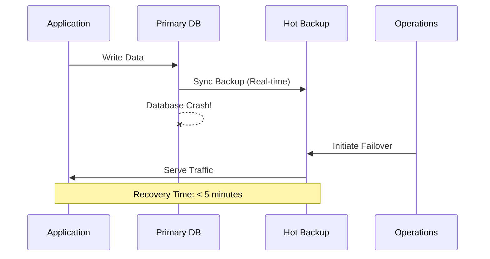
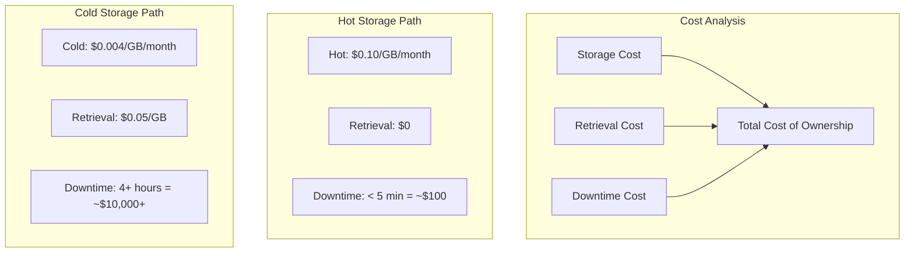
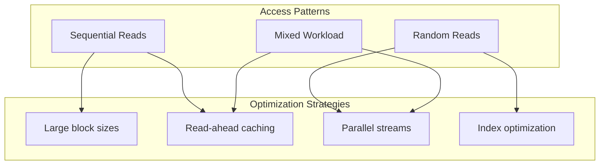
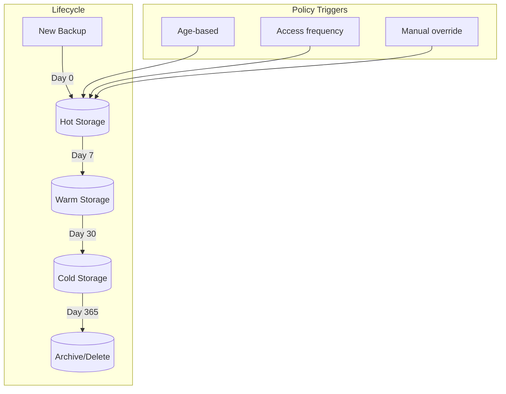

# How to Implement Hot Storage Backups

Author: [nawazdhandala](https://github.com/nawazdhandala)

Tags: Backup, Storage, Disaster Recovery, Performance

Description: Learn when and how to use hot storage for backups requiring fast access.

---

Hot storage backups provide immediate access to your data when every second counts. Unlike cold storage where retrieval can take hours, hot storage delivers sub-second access times. Here's how to implement hot storage backups effectively.

## Understanding Hot Storage Characteristics

Hot storage is designed for data that requires frequent, immediate access. The key characteristics that define hot storage:

```mermaid
flowchart TB
    subgraph Hot Storage
        H1[Sub-second latency]
        H2[High IOPS]
        H3[Frequent access]
        H4[Higher cost per GB]
    end

    subgraph Warm Storage
        W1[Seconds latency]
        W2[Moderate IOPS]
        W3[Periodic access]
        W4[Medium cost per GB]
    end

    subgraph Cold Storage
        C1[Minutes to hours latency]
        C2[Low IOPS]
        C3[Rare access]
        C4[Lowest cost per GB]
    end

    User[User Request] --> Hot Storage
    Hot Storage -->|After 7-30 days| Warm Storage
    Warm Storage -->|After 90+ days| Cold Storage
```

| Characteristic | Hot Storage | Warm Storage | Cold Storage |
|----------------|-------------|--------------|--------------|
| Access Latency | < 10ms | 100ms - 1s | Minutes to hours |
| Typical IOPS | 10,000+ | 1,000-5,000 | < 100 |
| Cost (per GB/month) | $0.02-0.10 | $0.01-0.02 | $0.001-0.005 |
| Retrieval Fee | None | Low | High |
| Use Case | Active recovery | Compliance | Long-term archive |

## Use Cases for Hot Backups

Hot storage backups are essential when you need:

### 1. Rapid Disaster Recovery

When your production database fails, you cannot wait hours for cold storage retrieval.



### 2. Point-in-Time Recovery

When you need to restore to a specific moment:

```bash
#!/bin/bash
# Hot backup with point-in-time recovery capability

BACKUP_DIR="/hot-storage/mysql-backups"
BINLOG_DIR="/hot-storage/mysql-binlogs"
TIMESTAMP=$(date +%Y%m%d_%H%M%S)

# Create full backup
mysqldump --single-transaction \
    --flush-logs \
    --master-data=2 \
    --all-databases > "$BACKUP_DIR/full_backup_$TIMESTAMP.sql"

# Sync binary logs for point-in-time recovery
rsync -av /var/lib/mysql/mysql-bin.* "$BINLOG_DIR/"

# Keep track of backup position
echo "Backup completed at: $TIMESTAMP" >> "$BACKUP_DIR/backup_log.txt"
echo "Binary log position recorded in dump file" >> "$BACKUP_DIR/backup_log.txt"
```

### 3. Development and Testing Environments

Hot backups enable rapid provisioning of test environments:

```yaml
# kubernetes-restore-job.yaml
apiVersion: batch/v1
kind: Job
metadata:
  name: restore-test-db
spec:
  template:
    spec:
      containers:
        - name: restore
          image: postgres:15
          command:
            - /bin/sh
            - -c
            - |
              # Restore from hot storage (NVMe-backed PV)
              pg_restore \
                --host=$TEST_DB_HOST \
                --username=$POSTGRES_USER \
                --dbname=testdb \
                --clean \
                --if-exists \
                /hot-backup/latest.dump

              echo "Restore completed in $(date +%s) - $START_TIME seconds"
          env:
            - name: POSTGRES_USER
              valueFrom:
                secretKeyRef:
                  name: db-credentials
                  key: username
          volumeMounts:
            - name: hot-backup
              mountPath: /hot-backup
              readOnly: true
      volumes:
        - name: hot-backup
          persistentVolumeClaim:
            claimName: hot-backup-pvc
      restartPolicy: Never
```

## SSD vs HDD Considerations

The choice between SSD and HDD dramatically impacts backup and recovery performance.

```mermaid
flowchart LR
    subgraph SSD Storage
        direction TB
        S1[NVMe SSD]
        S2[SATA SSD]

        S1 -->|500K+ IOPS| SP1[Best for: Hot backups]
        S2 -->|100K IOPS| SP2[Good for: Warm backups]
    end

    subgraph HDD Storage
        direction TB
        H1[SAS HDD]
        H2[SATA HDD]

        H1 -->|200 IOPS| HP1[Good for: Cold backups]
        H2 -->|100 IOPS| HP2[Archive only]
    end

    User[Backup Strategy] --> SSD Storage
    User --> HDD Storage
```

### Performance Comparison for Backup Operations

```bash
#!/bin/bash
# Benchmark script for backup performance comparison

DATABASE_SIZE="100GB"
BACKUP_FILE="/backup/benchmark_test.dump"

echo "=== SSD Backup Performance Test ==="
# NVMe SSD typically achieves 3-5 GB/s sequential write
time pg_dump -Fc mydb > /nvme-storage/backup.dump
# Expected: ~20-35 seconds for 100GB

echo "=== HDD Backup Performance Test ==="
# SATA HDD typically achieves 100-150 MB/s sequential write
time pg_dump -Fc mydb > /hdd-storage/backup.dump
# Expected: ~12-17 minutes for 100GB

echo "=== Recovery Time Comparison ==="
# NVMe restore
time pg_restore -d testdb /nvme-storage/backup.dump
# Expected: ~30-60 seconds for 100GB

# HDD restore
time pg_restore -d testdb /hdd-storage/backup.dump
# Expected: ~15-25 minutes for 100GB
```

### Storage Configuration for Hot Backups

```yaml
# hot-storage-class.yaml
apiVersion: storage.k8s.io/v1
kind: StorageClass
metadata:
  name: hot-backup-storage
provisioner: kubernetes.io/aws-ebs
parameters:
  type: io2
  iopsPerGB: "50"
  encrypted: "true"
volumeBindingMode: WaitForFirstConsumer
allowVolumeExpansion: true
---
# hot-backup-pvc.yaml
apiVersion: v1
kind: PersistentVolumeClaim
metadata:
  name: hot-backup-pvc
spec:
  storageClassName: hot-backup-storage
  accessModes:
    - ReadWriteOnce
  resources:
    requests:
      storage: 500Gi
```

## Cost Implications

Hot storage costs more, but the ROI is clear when downtime costs are factored in.



### Cost Calculation Script

```python
#!/usr/bin/env python3
"""
Calculate the true cost of backup storage tiers
considering downtime costs
"""

def calculate_backup_costs(
    data_size_gb: float,
    monthly_restores: int,
    hourly_downtime_cost: float,
    retention_months: int = 12
) -> dict:
    """
    Calculate total cost for different storage tiers
    """

    # Storage costs per GB per month
    storage_costs = {
        'hot': 0.10,      # SSD/NVMe based
        'warm': 0.025,    # Standard SSD
        'cold': 0.004     # Archive storage
    }

    # Retrieval costs per GB
    retrieval_costs = {
        'hot': 0,
        'warm': 0.01,
        'cold': 0.05
    }

    # Average restore time in hours
    restore_times = {
        'hot': 0.08,      # ~5 minutes
        'warm': 0.5,      # ~30 minutes
        'cold': 4.0       # ~4 hours
    }

    results = {}

    for tier in ['hot', 'warm', 'cold']:
        # Monthly storage cost
        storage = data_size_gb * storage_costs[tier]

        # Monthly retrieval cost
        retrieval = data_size_gb * retrieval_costs[tier] * monthly_restores

        # Monthly downtime cost
        downtime = restore_times[tier] * hourly_downtime_cost * monthly_restores

        # Total monthly cost
        monthly_total = storage + retrieval + downtime

        results[tier] = {
            'storage_cost': storage,
            'retrieval_cost': retrieval,
            'downtime_cost': downtime,
            'monthly_total': monthly_total,
            'annual_total': monthly_total * retention_months
        }

    return results


if __name__ == "__main__":
    # Example: 500GB database, 2 restores/month, $5000/hour downtime
    costs = calculate_backup_costs(
        data_size_gb=500,
        monthly_restores=2,
        hourly_downtime_cost=5000
    )

    print("Backup Cost Analysis (500GB, 2 restores/month, $5000/hr downtime)")
    print("=" * 70)

    for tier, data in costs.items():
        print(f"\n{tier.upper()} Storage:")
        print(f"  Monthly Storage:   ${data['storage_cost']:,.2f}")
        print(f"  Monthly Retrieval: ${data['retrieval_cost']:,.2f}")
        print(f"  Monthly Downtime:  ${data['downtime_cost']:,.2f}")
        print(f"  Monthly Total:     ${data['monthly_total']:,.2f}")
        print(f"  Annual Total:      ${data['annual_total']:,.2f}")
```

Output:
```
Backup Cost Analysis (500GB, 2 restores/month, $5000/hr downtime)
======================================================================

HOT Storage:
  Monthly Storage:   $50.00
  Monthly Retrieval: $0.00
  Monthly Downtime:  $800.00
  Monthly Total:     $850.00
  Annual Total:      $10,200.00

WARM Storage:
  Monthly Storage:   $12.50
  Monthly Retrieval: $10.00
  Monthly Downtime:  $5,000.00
  Monthly Total:     $5,022.50
  Annual Total:      $60,270.00

COLD Storage:
  Monthly Storage:   $2.00
  Monthly Retrieval: $50.00
  Monthly Downtime:  $40,000.00
  Monthly Total:     $40,052.00
  Annual Total:      $480,624.00
```

## Access Pattern Optimization

Optimizing access patterns ensures your hot storage delivers maximum performance.



### Backup Streaming Configuration

```bash
#!/bin/bash
# Optimized hot backup script with parallel streaming

set -euo pipefail

# Configuration
SOURCE_DB="production"
BACKUP_DIR="/hot-storage/backups"
PARALLEL_JOBS=4
COMPRESSION_LEVEL=3  # Lower = faster for hot storage

# Create backup directory with timestamp
TIMESTAMP=$(date +%Y%m%d_%H%M%S)
BACKUP_PATH="$BACKUP_DIR/$TIMESTAMP"
mkdir -p "$BACKUP_PATH"

echo "Starting optimized hot backup at $(date)"

# PostgreSQL parallel backup
pg_dump -d "$SOURCE_DB" \
    --format=directory \
    --jobs=$PARALLEL_JOBS \
    --compress=$COMPRESSION_LEVEL \
    --file="$BACKUP_PATH" \
    --verbose

# Calculate and store checksum
find "$BACKUP_PATH" -type f -exec sha256sum {} \; > "$BACKUP_PATH/checksums.sha256"

# Update latest symlink
ln -sfn "$BACKUP_PATH" "$BACKUP_DIR/latest"

echo "Backup completed at $(date)"
echo "Location: $BACKUP_PATH"
echo "Size: $(du -sh "$BACKUP_PATH" | cut -f1)"
```

### Read-Ahead Configuration for Backup Restoration

```bash
#!/bin/bash
# Configure read-ahead for optimal hot storage restore performance

# Identify the backup storage device
DEVICE="/dev/nvme1n1"

# Set optimal read-ahead for sequential backup reads
# 2048 sectors = 1MB read-ahead
blockdev --setra 2048 "$DEVICE"

# Verify setting
echo "Read-ahead set to: $(blockdev --getra $DEVICE) sectors"

# For restore operations, also tune:
# - vm.dirty_ratio: Higher value buffers more writes
# - vm.dirty_background_ratio: Background writeback threshold
sysctl -w vm.dirty_ratio=40
sysctl -w vm.dirty_background_ratio=10

# Disable access time updates for backup partition
mount -o remount,noatime /hot-storage
```

### Caching Strategy for Frequently Accessed Backups

```yaml
# redis-backup-cache.yaml
apiVersion: apps/v1
kind: Deployment
metadata:
  name: backup-metadata-cache
spec:
  replicas: 1
  selector:
    matchLabels:
      app: backup-cache
  template:
    metadata:
      labels:
        app: backup-cache
    spec:
      containers:
        - name: redis
          image: redis:7-alpine
          command:
            - redis-server
            - --maxmemory 1gb
            - --maxmemory-policy allkeys-lru
          ports:
            - containerPort: 6379
          resources:
            requests:
              memory: "1Gi"
              cpu: "500m"
            limits:
              memory: "1.5Gi"
              cpu: "1"
          volumeMounts:
            - name: cache-data
              mountPath: /data
      volumes:
        - name: cache-data
          emptyDir:
            medium: Memory
            sizeLimit: 1Gi
```

```python
#!/usr/bin/env python3
"""
Backup catalog with hot cache layer
"""

import redis
import json
import hashlib
from datetime import datetime, timedelta
from typing import Optional

class HotBackupCatalog:
    """
    Manages backup metadata with Redis caching for fast lookups
    """

    def __init__(self, redis_host: str = "backup-cache", redis_port: int = 6379):
        self.redis = redis.Redis(host=redis_host, port=redis_port, decode_responses=True)
        self.cache_ttl = 3600  # 1 hour TTL for cache entries

    def register_backup(self, backup_id: str, metadata: dict) -> None:
        """Register a new backup in the hot catalog"""
        metadata['registered_at'] = datetime.utcnow().isoformat()
        metadata['backup_id'] = backup_id

        # Store in sorted set by timestamp for quick retrieval
        self.redis.zadd(
            'backups:timeline',
            {backup_id: datetime.utcnow().timestamp()}
        )

        # Store full metadata
        self.redis.hset(f'backup:{backup_id}', mapping=metadata)

        # Update latest backup pointer
        self.redis.set('backup:latest', backup_id)

    def get_latest_backup(self) -> Optional[dict]:
        """Get the most recent backup metadata"""
        latest_id = self.redis.get('backup:latest')
        if not latest_id:
            return None
        return self.get_backup(latest_id)

    def get_backup(self, backup_id: str) -> Optional[dict]:
        """Retrieve backup metadata by ID"""
        data = self.redis.hgetall(f'backup:{backup_id}')
        return data if data else None

    def find_backup_at_time(self, target_time: datetime) -> Optional[dict]:
        """Find the backup closest to (but before) a specific time"""
        timestamp = target_time.timestamp()

        # Get backups before target time
        backup_ids = self.redis.zrangebyscore(
            'backups:timeline',
            '-inf',
            timestamp,
            start=0,
            num=1,
            withscores=False
        )

        if backup_ids:
            # Get the most recent one before target
            latest_before = self.redis.zrevrangebyscore(
                'backups:timeline',
                timestamp,
                '-inf',
                start=0,
                num=1
            )
            if latest_before:
                return self.get_backup(latest_before[0])

        return None

    def list_recent_backups(self, count: int = 10) -> list:
        """List the most recent backups"""
        backup_ids = self.redis.zrevrange('backups:timeline', 0, count - 1)
        return [self.get_backup(bid) for bid in backup_ids]


# Usage example
if __name__ == "__main__":
    catalog = HotBackupCatalog()

    # Register a backup
    catalog.register_backup(
        backup_id="backup_20260130_120000",
        metadata={
            "database": "production",
            "size_bytes": 107374182400,  # 100GB
            "path": "/hot-storage/backups/20260130_120000",
            "checksum": "sha256:abc123...",
            "type": "full"
        }
    )

    # Quick lookup
    latest = catalog.get_latest_backup()
    print(f"Latest backup: {latest['backup_id']}")
```

## Hot-to-Warm Transition Policies

Automatic tiering reduces costs while maintaining fast access for recent backups.



### Automated Tiering Script

```bash
#!/bin/bash
# backup-tiering.sh - Automatically move backups between storage tiers

set -euo pipefail

# Configuration
HOT_STORAGE="/hot-storage/backups"
WARM_STORAGE="/warm-storage/backups"
COLD_STORAGE="/cold-storage/backups"

HOT_RETENTION_DAYS=7
WARM_RETENTION_DAYS=30
COLD_RETENTION_DAYS=365

LOG_FILE="/var/log/backup-tiering.log"

log() {
    echo "[$(date '+%Y-%m-%d %H:%M:%S')] $1" | tee -a "$LOG_FILE"
}

move_to_tier() {
    local source_path=$1
    local dest_tier=$2
    local backup_name=$(basename "$source_path")

    case $dest_tier in
        warm)
            dest_path="$WARM_STORAGE/$backup_name"
            ;;
        cold)
            dest_path="$COLD_STORAGE/$backup_name"
            ;;
        *)
            log "ERROR: Unknown tier $dest_tier"
            return 1
            ;;
    esac

    log "Moving $backup_name to $dest_tier storage"

    # Copy with verification
    rsync -av --checksum "$source_path/" "$dest_path/"

    # Verify copy
    if diff -r "$source_path" "$dest_path" > /dev/null 2>&1; then
        log "Verified: $backup_name successfully moved to $dest_tier"
        rm -rf "$source_path"
        return 0
    else
        log "ERROR: Verification failed for $backup_name"
        rm -rf "$dest_path"
        return 1
    fi
}

# Process hot -> warm transitions
log "=== Starting Hot to Warm transitions ==="
find "$HOT_STORAGE" -maxdepth 1 -type d -mtime +$HOT_RETENTION_DAYS | while read -r backup; do
    if [ "$backup" != "$HOT_STORAGE" ]; then
        move_to_tier "$backup" "warm"
    fi
done

# Process warm -> cold transitions
log "=== Starting Warm to Cold transitions ==="
find "$WARM_STORAGE" -maxdepth 1 -type d -mtime +$WARM_RETENTION_DAYS | while read -r backup; do
    if [ "$backup" != "$WARM_STORAGE" ]; then
        move_to_tier "$backup" "cold"
    fi
done

# Process cold storage cleanup
log "=== Cleaning up old cold storage backups ==="
find "$COLD_STORAGE" -maxdepth 1 -type d -mtime +$COLD_RETENTION_DAYS | while read -r backup; do
    if [ "$backup" != "$COLD_STORAGE" ]; then
        backup_name=$(basename "$backup")
        log "Deleting expired backup: $backup_name"
        rm -rf "$backup"
    fi
done

log "=== Tiering complete ==="
```

### Kubernetes CronJob for Tiering

```yaml
# backup-tiering-cronjob.yaml
apiVersion: batch/v1
kind: CronJob
metadata:
  name: backup-tiering
  namespace: backup-system
spec:
  schedule: "0 3 * * *"  # Daily at 3 AM
  concurrencyPolicy: Forbid
  jobTemplate:
    spec:
      template:
        spec:
          containers:
            - name: tiering
              image: backup-tools:latest
              command:
                - /scripts/backup-tiering.sh
              env:
                - name: HOT_RETENTION_DAYS
                  value: "7"
                - name: WARM_RETENTION_DAYS
                  value: "30"
                - name: COLD_RETENTION_DAYS
                  value: "365"
              volumeMounts:
                - name: hot-storage
                  mountPath: /hot-storage
                - name: warm-storage
                  mountPath: /warm-storage
                - name: cold-storage
                  mountPath: /cold-storage
              resources:
                requests:
                  memory: "256Mi"
                  cpu: "100m"
                limits:
                  memory: "512Mi"
                  cpu: "500m"
          volumes:
            - name: hot-storage
              persistentVolumeClaim:
                claimName: hot-backup-pvc
            - name: warm-storage
              persistentVolumeClaim:
                claimName: warm-backup-pvc
            - name: cold-storage
              persistentVolumeClaim:
                claimName: cold-backup-pvc
          restartPolicy: OnFailure
```

### Cloud Provider Lifecycle Policies

For AWS S3:

```json
{
    "Rules": [
        {
            "ID": "HotToWarmTransition",
            "Status": "Enabled",
            "Filter": {
                "Prefix": "backups/"
            },
            "Transitions": [
                {
                    "Days": 7,
                    "StorageClass": "STANDARD_IA"
                },
                {
                    "Days": 30,
                    "StorageClass": "GLACIER_IR"
                },
                {
                    "Days": 90,
                    "StorageClass": "DEEP_ARCHIVE"
                }
            ],
            "Expiration": {
                "Days": 365
            }
        }
    ]
}
```

Apply with:

```bash
aws s3api put-bucket-lifecycle-configuration \
    --bucket my-backup-bucket \
    --lifecycle-configuration file://lifecycle-policy.json
```

## Monitoring Hot Storage Backups

```yaml
# prometheus-backup-alerts.yaml
apiVersion: monitoring.coreos.com/v1
kind: PrometheusRule
metadata:
  name: hot-backup-alerts
  namespace: monitoring
spec:
  groups:
    - name: hot-backup-alerts
      rules:
        - alert: HotBackupStorageFull
          expr: |
            (node_filesystem_avail_bytes{mountpoint="/hot-storage"} /
             node_filesystem_size_bytes{mountpoint="/hot-storage"}) < 0.1
          for: 5m
          labels:
            severity: critical
          annotations:
            summary: "Hot backup storage is nearly full"
            description: "Less than 10% space remaining on hot storage"

        - alert: BackupLatencyHigh
          expr: |
            backup_duration_seconds{tier="hot"} > 600
          for: 1m
          labels:
            severity: warning
          annotations:
            summary: "Hot backup taking longer than expected"
            description: "Backup duration exceeded 10 minutes"

        - alert: HotStorageIOPSLow
          expr: |
            rate(node_disk_reads_completed_total{device="nvme1n1"}[5m]) +
            rate(node_disk_writes_completed_total{device="nvme1n1"}[5m]) < 1000
          for: 10m
          labels:
            severity: warning
          annotations:
            summary: "Hot storage IOPS lower than expected"
```

## Best Practices Summary

1. **Right-size your hot tier**: Only keep 7-14 days of backups in hot storage
2. **Use NVMe for hot storage**: The performance difference justifies the cost for critical data
3. **Implement automated tiering**: Move data to cheaper tiers automatically based on age and access patterns
4. **Monitor storage performance**: Alert on IOPS and latency degradation
5. **Test restores regularly**: A backup is only as good as your ability to restore it
6. **Calculate true TCO**: Factor in downtime costs when choosing storage tiers
7. **Use parallel backup/restore**: Maximize throughput with concurrent operations
8. **Encrypt at rest**: Hot storage often contains recent, sensitive data

---

Hot storage backups are an investment in business continuity. The higher per-GB cost is offset by dramatically faster recovery times and lower total cost when downtime expenses are factored in. Implement tiered storage policies to balance cost and performance, ensuring your most recent backups are always ready for immediate restoration while older backups transition to more economical storage tiers.
