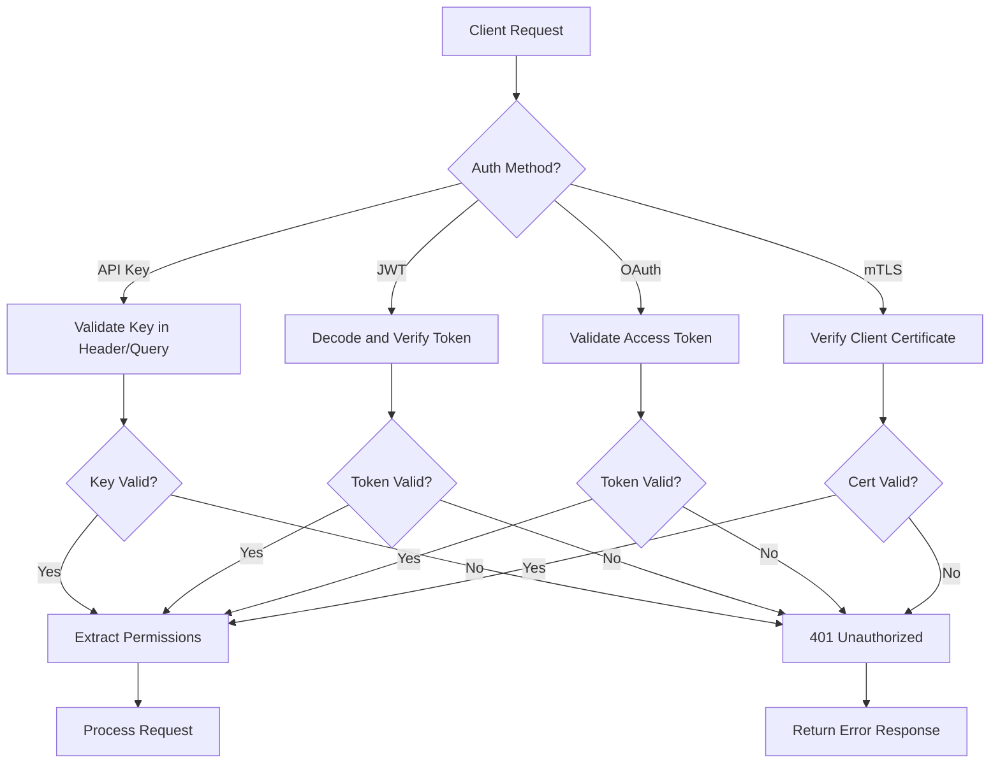
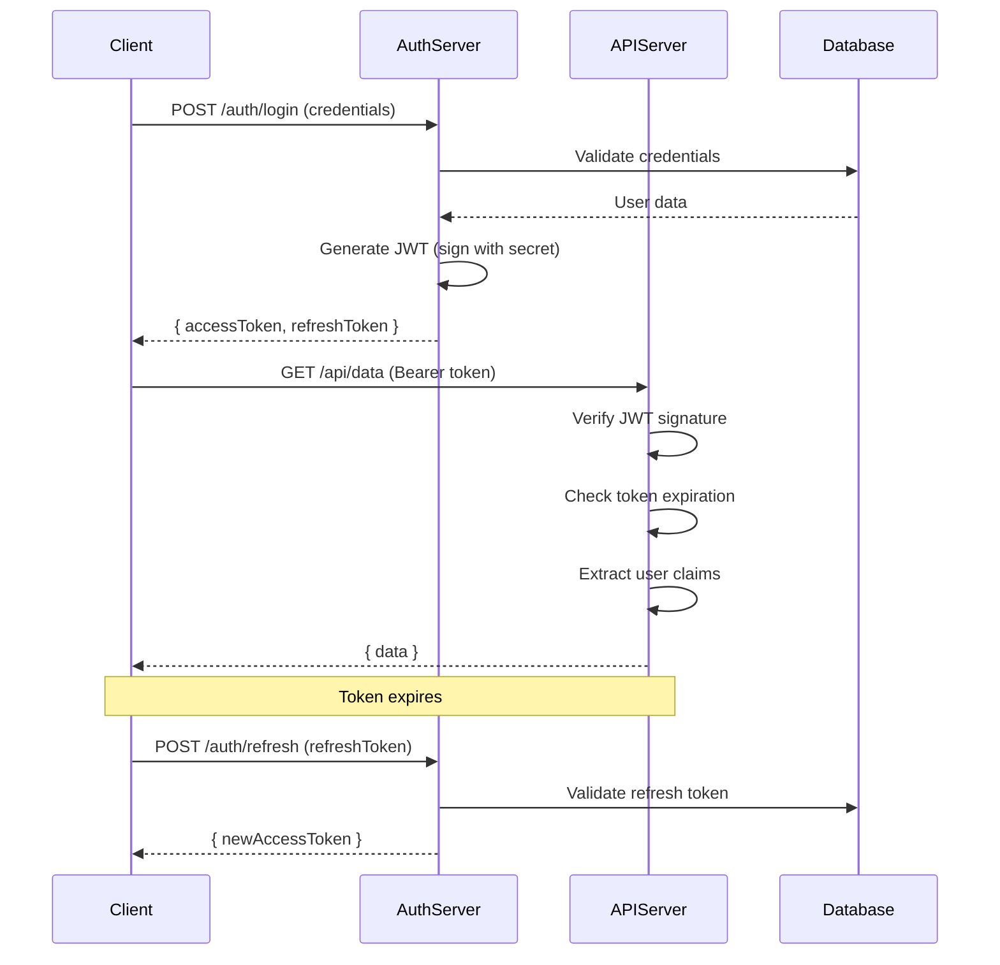
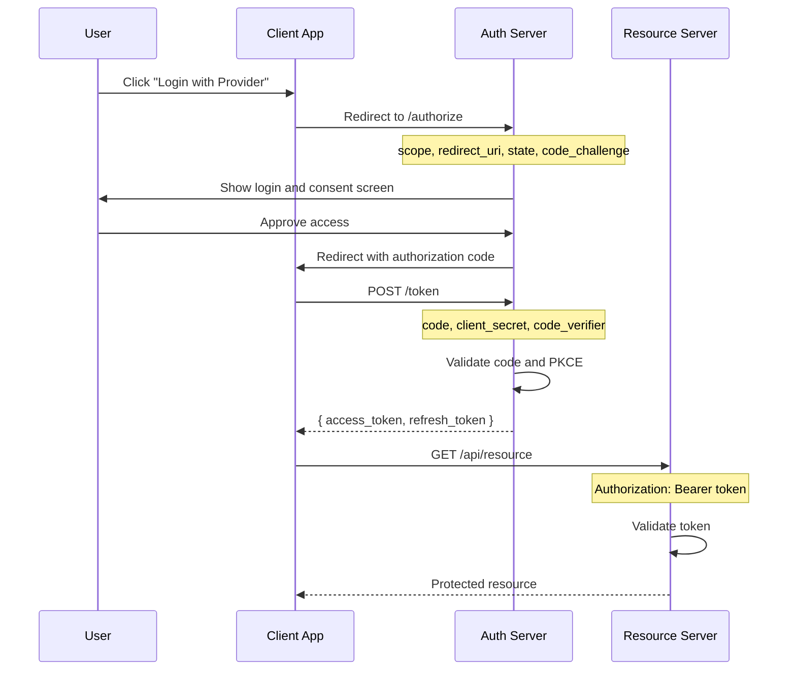
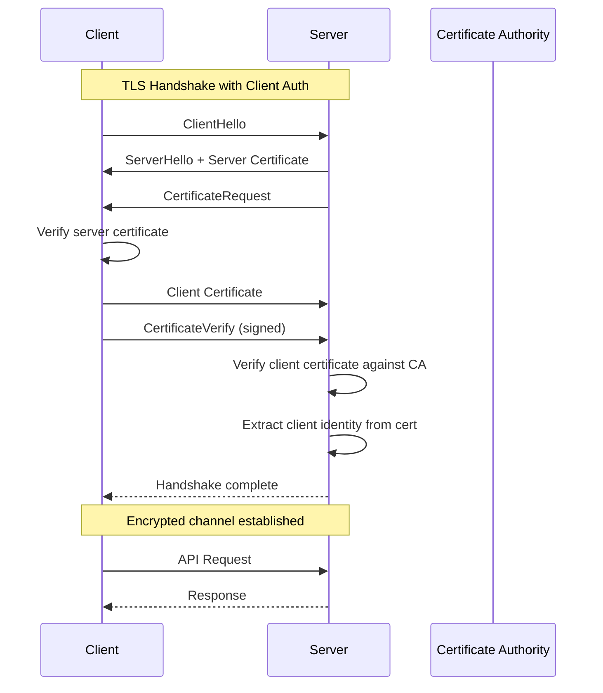

# How to Build API Authentication Patterns

Author: [nawazdhandala](https://github.com/nawazdhandala)

Tags: API, Security, Authentication, NodeJS, Backend, DevOps

Description: A practical guide to implementing production-ready API authentication patterns including API keys, JWT tokens, OAuth 2.0, and mutual TLS with working code examples.

---

Securing APIs is one of the most critical aspects of building backend services. A poorly implemented authentication system can expose sensitive data, allow unauthorized access, and damage user trust. This guide walks through the most common API authentication patterns, explains when to use each one, and provides production-ready code examples you can adapt to your projects.

## Authentication Patterns Overview

| Pattern | Best For | Security Level | Complexity |
|---------|----------|----------------|------------|
| **API Keys** | Server-to-server, internal APIs | Medium | Low |
| **JWT Tokens** | Stateless authentication, microservices | High | Medium |
| **OAuth 2.0** | Third-party access, user delegation | High | High |
| **Mutual TLS** | High-security environments | Very High | High |
| **Session Tokens** | Web applications | High | Medium |

## How Authentication Flows Work

The following diagram shows how different authentication methods flow through your system:



## Pattern 1: API Keys

API keys are the simplest authentication method. They work well for server-to-server communication where you trust the calling service.

### When to Use API Keys

- Internal microservice communication
- Third-party integrations with trusted partners
- Public APIs with usage tracking
- Webhook authentication

### Generating Secure API Keys

The following code generates cryptographically secure API keys with a prefix for easy identification. The prefix helps you identify the key type at a glance while maintaining security.

```javascript
const crypto = require('crypto');

class APIKeyGenerator {
  // Generate a secure API key with a readable prefix
  // Prefixes help identify key types: pk_ for public, sk_ for secret
  static generate(prefix = 'sk') {
    // Generate 32 random bytes and encode as base64url
    const randomBytes = crypto.randomBytes(32);
    const key = randomBytes.toString('base64url');

    return `${prefix}_${key}`;
  }

  // Hash the key for storage - never store plaintext keys
  static hash(apiKey) {
    return crypto
      .createHash('sha256')
      .update(apiKey)
      .digest('hex');
  }

  // Generate a key pair: one for the client, one hash for storage
  static createKeyPair(prefix = 'sk') {
    const plaintext = this.generate(prefix);
    const hash = this.hash(plaintext);

    return {
      // Send this to the client exactly once
      plaintextKey: plaintext,
      // Store this in your database
      hashedKey: hash,
      // Store creation metadata
      createdAt: new Date().toISOString(),
    };
  }
}

// Usage example
const keyPair = APIKeyGenerator.createKeyPair('api');
console.log('Give to client:', keyPair.plaintextKey);
console.log('Store in DB:', keyPair.hashedKey);
```

### API Key Validation Middleware

This middleware extracts the API key from headers, hashes it, and looks it up in your database. The constant-time comparison prevents timing attacks.

```javascript
const crypto = require('crypto');

class APIKeyAuthenticator {
  constructor(options) {
    this.headerName = options.headerName || 'X-API-Key';
    this.queryParam = options.queryParam || 'api_key';
    this.keyStore = options.keyStore; // Your database interface
  }

  // Extract key from request (header takes precedence over query)
  extractKey(req) {
    const headerKey = req.headers[this.headerName.toLowerCase()];
    if (headerKey) return headerKey;

    const queryKey = req.query[this.queryParam];
    if (queryKey) return queryKey;

    return null;
  }

  // Constant-time comparison to prevent timing attacks
  secureCompare(a, b) {
    if (a.length !== b.length) {
      return false;
    }
    return crypto.timingSafeEqual(Buffer.from(a), Buffer.from(b));
  }

  // Express middleware for API key authentication
  middleware() {
    return async (req, res, next) => {
      const apiKey = this.extractKey(req);

      if (!apiKey) {
        return res.status(401).json({
          error: 'Unauthorized',
          message: 'API key is required',
        });
      }

      // Hash the incoming key and look up in database
      const hashedKey = crypto
        .createHash('sha256')
        .update(apiKey)
        .digest('hex');

      try {
        const keyRecord = await this.keyStore.findByHash(hashedKey);

        if (!keyRecord) {
          return res.status(401).json({
            error: 'Unauthorized',
            message: 'Invalid API key',
          });
        }

        // Check if key is expired
        if (keyRecord.expiresAt && new Date(keyRecord.expiresAt) < new Date()) {
          return res.status(401).json({
            error: 'Unauthorized',
            message: 'API key has expired',
          });
        }

        // Check if key is revoked
        if (keyRecord.revoked) {
          return res.status(401).json({
            error: 'Unauthorized',
            message: 'API key has been revoked',
          });
        }

        // Attach key metadata to request for use in handlers
        req.apiKey = {
          id: keyRecord.id,
          name: keyRecord.name,
          permissions: keyRecord.permissions || [],
          rateLimit: keyRecord.rateLimit,
          ownerId: keyRecord.ownerId,
        };

        // Update last used timestamp asynchronously
        this.keyStore.updateLastUsed(keyRecord.id).catch(console.error);

        next();
      } catch (error) {
        console.error('API key validation error:', error);
        return res.status(500).json({
          error: 'Internal Server Error',
          message: 'Authentication failed',
        });
      }
    };
  }
}

// Usage with Express
const authenticator = new APIKeyAuthenticator({
  headerName: 'X-API-Key',
  keyStore: apiKeyRepository, // Your database repository
});

app.use('/api/v1', authenticator.middleware());
```

### API Key Database Schema

Here is a database schema for storing API keys. Note that we store the hash, not the plaintext key.

```javascript
// Database schema for API keys (using a generic ORM structure)
const apiKeySchema = {
  id: { type: 'uuid', primaryKey: true },
  name: { type: 'string', required: true },      // Human-readable name
  hashedKey: { type: 'string', unique: true },   // SHA-256 hash
  prefix: { type: 'string' },                    // First few chars for identification
  ownerId: { type: 'uuid', required: true },     // User or service that owns this key
  permissions: { type: 'array', default: [] },   // Scopes or permissions
  rateLimit: { type: 'integer', default: 1000 }, // Requests per minute
  expiresAt: { type: 'timestamp', nullable: true },
  revoked: { type: 'boolean', default: false },
  lastUsedAt: { type: 'timestamp', nullable: true },
  createdAt: { type: 'timestamp', default: 'now()' },
  metadata: { type: 'jsonb', default: {} },      // Custom attributes
};
```

## Pattern 2: JWT (JSON Web Tokens)

JWTs provide stateless authentication that scales well across multiple servers. The token itself contains all the information needed to authenticate and authorize requests.

### JWT Token Flow



### JWT Implementation

This implementation handles both access tokens (short-lived) and refresh tokens (long-lived). Access tokens should expire quickly to limit damage if stolen.

```javascript
const jwt = require('jsonwebtoken');
const crypto = require('crypto');

class JWTAuthenticator {
  constructor(options) {
    // Use different secrets for access and refresh tokens
    this.accessSecret = options.accessSecret;
    this.refreshSecret = options.refreshSecret;
    this.accessTokenExpiry = options.accessTokenExpiry || '15m';
    this.refreshTokenExpiry = options.refreshTokenExpiry || '7d';
    this.issuer = options.issuer || 'your-api';
    this.audience = options.audience || 'your-app';
    this.tokenStore = options.tokenStore; // For refresh token tracking
  }

  // Generate an access token with user claims
  generateAccessToken(user) {
    const payload = {
      sub: user.id,
      email: user.email,
      roles: user.roles || [],
      permissions: user.permissions || [],
    };

    return jwt.sign(payload, this.accessSecret, {
      expiresIn: this.accessTokenExpiry,
      issuer: this.issuer,
      audience: this.audience,
      algorithm: 'HS256',
    });
  }

  // Generate a refresh token and store its ID for revocation
  async generateRefreshToken(user) {
    // Create a unique token ID for tracking
    const tokenId = crypto.randomUUID();

    const payload = {
      sub: user.id,
      jti: tokenId, // JWT ID for revocation tracking
      type: 'refresh',
    };

    const token = jwt.sign(payload, this.refreshSecret, {
      expiresIn: this.refreshTokenExpiry,
      issuer: this.issuer,
    });

    // Store token ID for revocation capability
    await this.tokenStore.saveRefreshToken({
      tokenId,
      userId: user.id,
      expiresAt: new Date(Date.now() + this.parseExpiry(this.refreshTokenExpiry)),
    });

    return token;
  }

  // Generate both tokens for login response
  async generateTokenPair(user) {
    const accessToken = this.generateAccessToken(user);
    const refreshToken = await this.generateRefreshToken(user);

    return {
      accessToken,
      refreshToken,
      tokenType: 'Bearer',
      expiresIn: this.parseExpiry(this.accessTokenExpiry) / 1000,
    };
  }

  // Verify and decode an access token
  verifyAccessToken(token) {
    try {
      return jwt.verify(token, this.accessSecret, {
        issuer: this.issuer,
        audience: this.audience,
      });
    } catch (error) {
      if (error.name === 'TokenExpiredError') {
        throw new AuthError('Token has expired', 'TOKEN_EXPIRED');
      }
      if (error.name === 'JsonWebTokenError') {
        throw new AuthError('Invalid token', 'INVALID_TOKEN');
      }
      throw error;
    }
  }

  // Verify refresh token and check if it has been revoked
  async verifyRefreshToken(token) {
    try {
      const decoded = jwt.verify(token, this.refreshSecret, {
        issuer: this.issuer,
      });

      // Check if token has been revoked
      const isValid = await this.tokenStore.isRefreshTokenValid(decoded.jti);
      if (!isValid) {
        throw new AuthError('Token has been revoked', 'TOKEN_REVOKED');
      }

      return decoded;
    } catch (error) {
      if (error instanceof AuthError) throw error;
      if (error.name === 'TokenExpiredError') {
        throw new AuthError('Refresh token has expired', 'TOKEN_EXPIRED');
      }
      throw new AuthError('Invalid refresh token', 'INVALID_TOKEN');
    }
  }

  // Refresh the access token using a valid refresh token
  async refreshAccessToken(refreshToken, userLoader) {
    const decoded = await this.verifyRefreshToken(refreshToken);

    // Load fresh user data to get current roles and permissions
    const user = await userLoader(decoded.sub);
    if (!user) {
      throw new AuthError('User not found', 'USER_NOT_FOUND');
    }

    return {
      accessToken: this.generateAccessToken(user),
      tokenType: 'Bearer',
      expiresIn: this.parseExpiry(this.accessTokenExpiry) / 1000,
    };
  }

  // Revoke all refresh tokens for a user (useful for logout-all)
  async revokeAllUserTokens(userId) {
    await this.tokenStore.revokeAllUserTokens(userId);
  }

  // Revoke a specific refresh token
  async revokeRefreshToken(tokenId) {
    await this.tokenStore.revokeToken(tokenId);
  }

  // Parse expiry string to milliseconds
  parseExpiry(expiry) {
    const units = { s: 1000, m: 60000, h: 3600000, d: 86400000 };
    const match = expiry.match(/^(\d+)([smhd])$/);
    if (!match) return 900000; // Default 15 minutes
    return parseInt(match[1]) * units[match[2]];
  }

  // Express middleware for JWT authentication
  middleware(options = {}) {
    const { optional = false } = options;

    return async (req, res, next) => {
      const authHeader = req.headers.authorization;

      if (!authHeader || !authHeader.startsWith('Bearer ')) {
        if (optional) {
          req.user = null;
          return next();
        }
        return res.status(401).json({
          error: 'Unauthorized',
          message: 'Bearer token required',
        });
      }

      const token = authHeader.slice(7);

      try {
        const decoded = this.verifyAccessToken(token);

        req.user = {
          id: decoded.sub,
          email: decoded.email,
          roles: decoded.roles,
          permissions: decoded.permissions,
        };

        next();
      } catch (error) {
        if (error instanceof AuthError) {
          return res.status(401).json({
            error: 'Unauthorized',
            code: error.code,
            message: error.message,
          });
        }
        return res.status(401).json({
          error: 'Unauthorized',
          message: 'Invalid token',
        });
      }
    };
  }
}

// Custom error class for authentication errors
class AuthError extends Error {
  constructor(message, code) {
    super(message);
    this.name = 'AuthError';
    this.code = code;
  }
}

module.exports = { JWTAuthenticator, AuthError };
```

### JWT Auth Routes

Here are the authentication endpoints that use the JWT authenticator. These handle login, token refresh, and logout.

```javascript
const express = require('express');
const router = express.Router();

// Initialize the authenticator with your configuration
const jwtAuth = new JWTAuthenticator({
  accessSecret: process.env.JWT_ACCESS_SECRET,
  refreshSecret: process.env.JWT_REFRESH_SECRET,
  accessTokenExpiry: '15m',
  refreshTokenExpiry: '7d',
  issuer: 'your-api',
  audience: 'your-app',
  tokenStore: refreshTokenRepository,
});

// Login endpoint - validates credentials and returns tokens
router.post('/auth/login', async (req, res) => {
  const { email, password } = req.body;

  try {
    // Validate credentials against your user store
    const user = await userService.validateCredentials(email, password);

    if (!user) {
      return res.status(401).json({
        error: 'Unauthorized',
        message: 'Invalid email or password',
      });
    }

    // Generate token pair
    const tokens = await jwtAuth.generateTokenPair(user);

    res.json({
      user: {
        id: user.id,
        email: user.email,
        name: user.name,
      },
      ...tokens,
    });
  } catch (error) {
    console.error('Login error:', error);
    res.status(500).json({
      error: 'Internal Server Error',
      message: 'Login failed',
    });
  }
});

// Refresh endpoint - exchanges refresh token for new access token
router.post('/auth/refresh', async (req, res) => {
  const { refreshToken } = req.body;

  if (!refreshToken) {
    return res.status(400).json({
      error: 'Bad Request',
      message: 'Refresh token is required',
    });
  }

  try {
    const tokens = await jwtAuth.refreshAccessToken(
      refreshToken,
      (userId) => userService.findById(userId)
    );

    res.json(tokens);
  } catch (error) {
    if (error instanceof AuthError) {
      return res.status(401).json({
        error: 'Unauthorized',
        code: error.code,
        message: error.message,
      });
    }
    res.status(500).json({
      error: 'Internal Server Error',
      message: 'Token refresh failed',
    });
  }
});

// Logout endpoint - revokes the refresh token
router.post('/auth/logout', jwtAuth.middleware(), async (req, res) => {
  const { refreshToken } = req.body;

  try {
    if (refreshToken) {
      const decoded = jwt.decode(refreshToken);
      if (decoded && decoded.jti) {
        await jwtAuth.revokeRefreshToken(decoded.jti);
      }
    }

    res.json({ message: 'Logged out successfully' });
  } catch (error) {
    // Still return success even if revocation fails
    res.json({ message: 'Logged out successfully' });
  }
});

// Logout from all devices - revokes all user refresh tokens
router.post('/auth/logout-all', jwtAuth.middleware(), async (req, res) => {
  try {
    await jwtAuth.revokeAllUserTokens(req.user.id);
    res.json({ message: 'Logged out from all devices' });
  } catch (error) {
    res.status(500).json({
      error: 'Internal Server Error',
      message: 'Logout failed',
    });
  }
});

module.exports = router;
```

## Pattern 3: OAuth 2.0

OAuth 2.0 allows users to grant third-party applications limited access to their resources without sharing credentials. It is the standard for delegated authorization.

### OAuth 2.0 Authorization Code Flow



### OAuth 2.0 Client Implementation

This client handles the OAuth flow with PKCE (Proof Key for Code Exchange), which prevents authorization code interception attacks.

```javascript
const crypto = require('crypto');
const axios = require('axios');

class OAuth2Client {
  constructor(options) {
    this.clientId = options.clientId;
    this.clientSecret = options.clientSecret;
    this.redirectUri = options.redirectUri;
    this.authorizationUrl = options.authorizationUrl;
    this.tokenUrl = options.tokenUrl;
    this.scopes = options.scopes || [];
    this.stateStore = options.stateStore; // Store for PKCE and state
  }

  // Generate PKCE code verifier and challenge
  // PKCE adds security even for public clients
  generatePKCE() {
    // Code verifier: random 43-128 character string
    const verifier = crypto.randomBytes(32).toString('base64url');

    // Code challenge: SHA-256 hash of verifier
    const challenge = crypto
      .createHash('sha256')
      .update(verifier)
      .digest('base64url');

    return { verifier, challenge };
  }

  // Generate random state for CSRF protection
  generateState() {
    return crypto.randomBytes(16).toString('base64url');
  }

  // Build the authorization URL for redirecting users
  async getAuthorizationUrl(additionalParams = {}) {
    const state = this.generateState();
    const pkce = this.generatePKCE();

    // Store state and PKCE verifier for later validation
    await this.stateStore.save(state, {
      codeVerifier: pkce.verifier,
      createdAt: Date.now(),
    });

    const params = new URLSearchParams({
      client_id: this.clientId,
      redirect_uri: this.redirectUri,
      response_type: 'code',
      scope: this.scopes.join(' '),
      state: state,
      code_challenge: pkce.challenge,
      code_challenge_method: 'S256',
      ...additionalParams,
    });

    return `${this.authorizationUrl}?${params.toString()}`;
  }

  // Exchange authorization code for tokens
  async exchangeCode(code, state) {
    // Retrieve and validate stored state
    const storedData = await this.stateStore.get(state);

    if (!storedData) {
      throw new Error('Invalid state parameter - possible CSRF attack');
    }

    // State should only be used once
    await this.stateStore.delete(state);

    // Check if state is too old (5 minute limit)
    if (Date.now() - storedData.createdAt > 300000) {
      throw new Error('Authorization request expired');
    }

    try {
      const response = await axios.post(this.tokenUrl,
        new URLSearchParams({
          grant_type: 'authorization_code',
          code: code,
          redirect_uri: this.redirectUri,
          client_id: this.clientId,
          client_secret: this.clientSecret,
          code_verifier: storedData.codeVerifier,
        }),
        {
          headers: {
            'Content-Type': 'application/x-www-form-urlencoded',
          },
        }
      );

      return {
        accessToken: response.data.access_token,
        refreshToken: response.data.refresh_token,
        expiresIn: response.data.expires_in,
        tokenType: response.data.token_type,
        scope: response.data.scope,
      };
    } catch (error) {
      if (error.response) {
        throw new Error(`Token exchange failed: ${error.response.data.error_description || error.response.data.error}`);
      }
      throw error;
    }
  }

  // Refresh an access token using a refresh token
  async refreshToken(refreshToken) {
    try {
      const response = await axios.post(this.tokenUrl,
        new URLSearchParams({
          grant_type: 'refresh_token',
          refresh_token: refreshToken,
          client_id: this.clientId,
          client_secret: this.clientSecret,
        }),
        {
          headers: {
            'Content-Type': 'application/x-www-form-urlencoded',
          },
        }
      );

      return {
        accessToken: response.data.access_token,
        refreshToken: response.data.refresh_token || refreshToken,
        expiresIn: response.data.expires_in,
        tokenType: response.data.token_type,
      };
    } catch (error) {
      if (error.response) {
        throw new Error(`Token refresh failed: ${error.response.data.error_description || error.response.data.error}`);
      }
      throw error;
    }
  }
}

module.exports = { OAuth2Client };
```

### OAuth 2.0 Routes

Here are the routes that handle the OAuth callback and token management.

```javascript
const express = require('express');
const router = express.Router();

const oauthClient = new OAuth2Client({
  clientId: process.env.OAUTH_CLIENT_ID,
  clientSecret: process.env.OAUTH_CLIENT_SECRET,
  redirectUri: process.env.OAUTH_REDIRECT_URI,
  authorizationUrl: 'https://provider.com/oauth/authorize',
  tokenUrl: 'https://provider.com/oauth/token',
  scopes: ['openid', 'profile', 'email'],
  stateStore: stateRepository,
});

// Initiate OAuth flow - redirects user to provider
router.get('/auth/oauth/start', async (req, res) => {
  try {
    const authUrl = await oauthClient.getAuthorizationUrl();
    res.redirect(authUrl);
  } catch (error) {
    console.error('OAuth start error:', error);
    res.status(500).json({ error: 'Failed to start OAuth flow' });
  }
});

// OAuth callback - exchanges code for tokens
router.get('/auth/oauth/callback', async (req, res) => {
  const { code, state, error, error_description } = req.query;

  // Handle provider errors
  if (error) {
    console.error('OAuth error:', error, error_description);
    return res.redirect(`/login?error=${encodeURIComponent(error_description || error)}`);
  }

  if (!code || !state) {
    return res.redirect('/login?error=missing_parameters');
  }

  try {
    // Exchange code for tokens
    const tokens = await oauthClient.exchangeCode(code, state);

    // Fetch user info from the provider
    const userInfo = await fetchUserInfo(tokens.accessToken);

    // Find or create user in your database
    let user = await userService.findByOAuthId(userInfo.sub);

    if (!user) {
      user = await userService.createFromOAuth({
        oauthId: userInfo.sub,
        email: userInfo.email,
        name: userInfo.name,
        picture: userInfo.picture,
      });
    }

    // Generate your own JWT for the session
    const sessionTokens = await jwtAuth.generateTokenPair(user);

    // Store OAuth tokens if you need to access the provider API
    await oauthTokenService.save(user.id, tokens);

    // Set tokens in cookies or return in response
    res.cookie('accessToken', sessionTokens.accessToken, {
      httpOnly: true,
      secure: process.env.NODE_ENV === 'production',
      sameSite: 'lax',
      maxAge: 900000, // 15 minutes
    });

    res.redirect('/dashboard');
  } catch (error) {
    console.error('OAuth callback error:', error);
    res.redirect(`/login?error=${encodeURIComponent(error.message)}`);
  }
});

// Helper function to fetch user info from the OAuth provider
async function fetchUserInfo(accessToken) {
  const response = await axios.get('https://provider.com/oauth/userinfo', {
    headers: {
      Authorization: `Bearer ${accessToken}`,
    },
  });
  return response.data;
}

module.exports = router;
```

## Pattern 4: Mutual TLS (mTLS)

Mutual TLS provides the highest level of authentication by requiring both the client and server to present certificates. This is ideal for high-security environments and service-to-service communication.

### mTLS Authentication Flow



### mTLS Server Configuration

This example shows how to configure a Node.js HTTPS server to require and validate client certificates.

```javascript
const https = require('https');
const fs = require('fs');
const express = require('express');

class MTLSServer {
  constructor(options) {
    this.app = express();
    this.options = options;

    // Load certificates
    this.serverOptions = {
      // Server's private key
      key: fs.readFileSync(options.serverKey),
      // Server's certificate
      cert: fs.readFileSync(options.serverCert),
      // CA certificate(s) for validating client certificates
      ca: fs.readFileSync(options.caCert),
      // Request client certificate
      requestCert: true,
      // Reject connections without valid client certificate
      rejectUnauthorized: true,
    };
  }

  // Middleware to extract client certificate information
  clientCertMiddleware() {
    return (req, res, next) => {
      const cert = req.socket.getPeerCertificate();

      if (!cert || Object.keys(cert).length === 0) {
        return res.status(401).json({
          error: 'Unauthorized',
          message: 'Client certificate required',
        });
      }

      // Check if certificate is authorized
      if (!req.client.authorized) {
        return res.status(401).json({
          error: 'Unauthorized',
          message: 'Invalid client certificate',
          reason: req.client.authorizationError,
        });
      }

      // Extract identity from certificate
      req.clientCert = {
        subject: cert.subject,
        issuer: cert.issuer,
        fingerprint: cert.fingerprint,
        fingerprint256: cert.fingerprint256,
        serialNumber: cert.serialNumber,
        validFrom: cert.valid_from,
        validTo: cert.valid_to,
        // Common name is typically the service or user identity
        commonName: cert.subject.CN,
        // Organization can indicate tenant or domain
        organization: cert.subject.O,
      };

      next();
    };
  }

  // Authorization middleware based on certificate attributes
  requireCertAttribute(attribute, allowedValues) {
    return (req, res, next) => {
      const value = req.clientCert[attribute];

      if (!allowedValues.includes(value)) {
        return res.status(403).json({
          error: 'Forbidden',
          message: `Certificate ${attribute} '${value}' not authorized`,
        });
      }

      next();
    };
  }

  start(port) {
    this.app.use(this.clientCertMiddleware());

    const server = https.createServer(this.serverOptions, this.app);

    server.listen(port, () => {
      console.log(`mTLS server listening on port ${port}`);
    });

    return server;
  }
}

// Usage example
const mtlsServer = new MTLSServer({
  serverKey: '/path/to/server.key',
  serverCert: '/path/to/server.crt',
  caCert: '/path/to/ca.crt',
});

mtlsServer.app.get('/api/secure',
  mtlsServer.requireCertAttribute('organization', ['TrustedOrg']),
  (req, res) => {
    res.json({
      message: 'Authenticated via mTLS',
      clientIdentity: req.clientCert.commonName,
    });
  }
);

mtlsServer.start(443);
```

### mTLS Client Configuration

Here is how to configure an HTTP client to present a client certificate when making requests.

```javascript
const https = require('https');
const fs = require('fs');
const axios = require('axios');

class MTLSClient {
  constructor(options) {
    this.httpsAgent = new https.Agent({
      // Client's private key
      key: fs.readFileSync(options.clientKey),
      // Client's certificate
      cert: fs.readFileSync(options.clientCert),
      // CA certificate for validating server
      ca: fs.readFileSync(options.caCert),
      // Verify server certificate
      rejectUnauthorized: true,
    });

    this.client = axios.create({
      httpsAgent: this.httpsAgent,
      baseURL: options.baseURL,
    });
  }

  async get(path, config = {}) {
    return this.client.get(path, config);
  }

  async post(path, data, config = {}) {
    return this.client.post(path, data, config);
  }
}

// Usage
const client = new MTLSClient({
  clientKey: '/path/to/client.key',
  clientCert: '/path/to/client.crt',
  caCert: '/path/to/ca.crt',
  baseURL: 'https://api.example.com',
});

const response = await client.get('/api/secure');
```

## Combining Authentication Methods

In production, you often need to support multiple authentication methods. Here is a flexible middleware that handles this.

```javascript
class MultiAuthenticator {
  constructor() {
    this.strategies = new Map();
  }

  // Register an authentication strategy
  register(name, strategy) {
    this.strategies.set(name, strategy);
  }

  // Try each strategy in order until one succeeds
  middleware(strategyOrder = []) {
    return async (req, res, next) => {
      const errors = [];

      for (const strategyName of strategyOrder) {
        const strategy = this.strategies.get(strategyName);

        if (!strategy) {
          continue;
        }

        try {
          const result = await strategy.authenticate(req);

          if (result.success) {
            req.user = result.user;
            req.authMethod = strategyName;
            return next();
          }

          errors.push({ strategy: strategyName, error: result.error });
        } catch (error) {
          errors.push({ strategy: strategyName, error: error.message });
        }
      }

      // No strategy succeeded
      res.status(401).json({
        error: 'Unauthorized',
        message: 'Authentication required',
        tried: errors,
      });
    };
  }
}

// Define strategies
const apiKeyStrategy = {
  async authenticate(req) {
    const apiKey = req.headers['x-api-key'];
    if (!apiKey) {
      return { success: false, error: 'No API key provided' };
    }

    const keyData = await validateApiKey(apiKey);
    if (!keyData) {
      return { success: false, error: 'Invalid API key' };
    }

    return { success: true, user: keyData };
  },
};

const jwtStrategy = {
  async authenticate(req) {
    const authHeader = req.headers.authorization;
    if (!authHeader || !authHeader.startsWith('Bearer ')) {
      return { success: false, error: 'No bearer token provided' };
    }

    const token = authHeader.slice(7);
    const decoded = verifyJWT(token);

    return { success: true, user: decoded };
  },
};

// Usage
const auth = new MultiAuthenticator();
auth.register('apiKey', apiKeyStrategy);
auth.register('jwt', jwtStrategy);

// API endpoints accept either API key or JWT
app.use('/api', auth.middleware(['apiKey', 'jwt']));
```

## Security Best Practices

| Practice | Implementation |
|----------|----------------|
| **Use HTTPS everywhere** | Encrypt all traffic, redirect HTTP to HTTPS |
| **Hash API keys** | Store SHA-256 hashes, never plaintext |
| **Short token expiry** | Access tokens: 15 minutes, Refresh tokens: 7 days |
| **Rotate secrets** | Support multiple active secrets during rotation |
| **Rate limit auth endpoints** | Prevent brute force attacks |
| **Log authentication events** | Track logins, failures, and token refreshes |
| **Implement token revocation** | Allow users to invalidate sessions |
| **Use secure cookies** | HttpOnly, Secure, SameSite flags |

### Secret Rotation Support

This implementation supports gradual secret rotation without invalidating existing tokens.

```javascript
class SecretRotator {
  constructor(secrets) {
    // secrets is an array ordered from newest to oldest
    // First secret is used for signing, all are tried for verification
    this.secrets = secrets;
  }

  sign(payload, options) {
    // Always sign with the newest secret
    return jwt.sign(payload, this.secrets[0], options);
  }

  verify(token, options) {
    // Try each secret starting with newest
    for (const secret of this.secrets) {
      try {
        return jwt.verify(token, secret, options);
      } catch (error) {
        if (error.name !== 'JsonWebTokenError') {
          throw error;
        }
        // Try next secret
      }
    }
    throw new Error('Token verification failed with all secrets');
  }
}

// Usage during rotation
const rotator = new SecretRotator([
  process.env.JWT_SECRET_NEW,    // New secret for signing
  process.env.JWT_SECRET_OLD,    // Old secret still valid for verification
]);
```

## Summary

Choosing the right authentication pattern depends on your use case:

| Use Case | Recommended Pattern |
|----------|-------------------|
| Internal microservices | mTLS or API Keys |
| Public API with rate limits | API Keys |
| User-facing applications | JWT with refresh tokens |
| Third-party integrations | OAuth 2.0 |
| High-security environments | mTLS + additional auth |
| Mobile applications | OAuth 2.0 with PKCE |

Start with the simplest pattern that meets your security requirements, and add complexity only when needed. API keys work well for most server-to-server communication, while JWTs are ideal for user-facing APIs. OAuth 2.0 becomes necessary when you need delegated authorization or third-party access.

Remember to implement rate limiting, logging, and monitoring alongside your authentication system to detect and respond to security threats.
