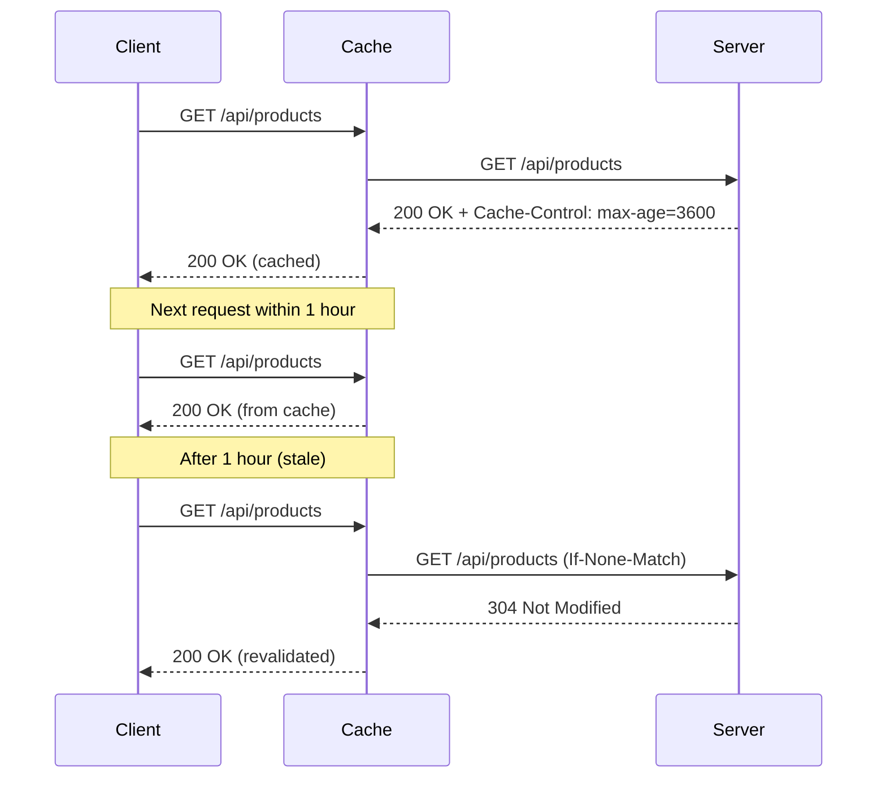
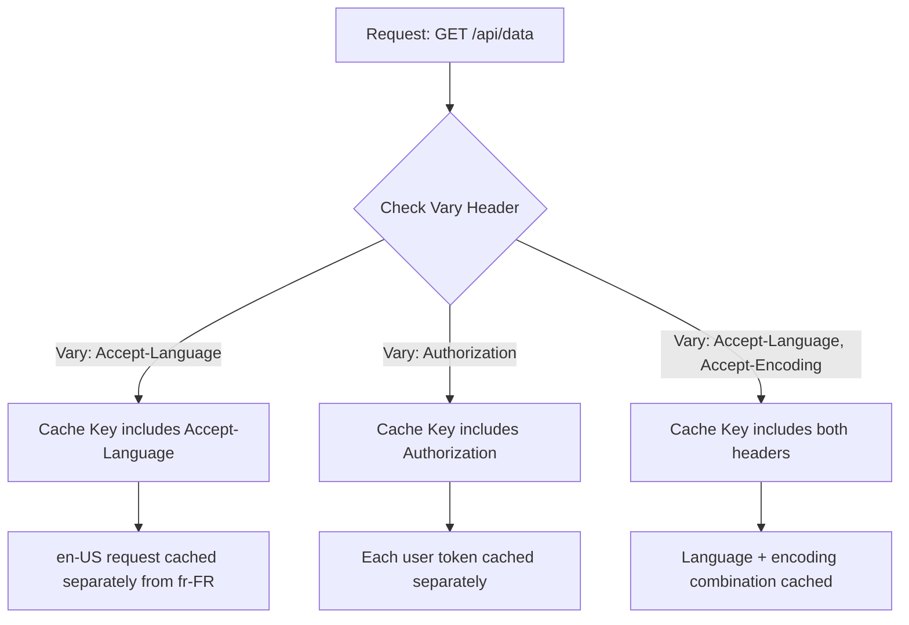

# How to Build API Cache Headers

Author: [nawazdhandala](https://github.com/nawazdhandala)

Tags: API, Caching, HTTP, Performance, Backend, DevOps

Description: A practical guide to implementing HTTP cache headers in your APIs. Learn how to use Cache-Control, ETag, Last-Modified, and Vary headers to reduce server load, improve response times, and build production-ready caching strategies.

---

Caching is one of the most effective ways to improve API performance. When done right, cache headers can reduce server load by 90%, cut response times from hundreds of milliseconds to single digits, and save significant bandwidth costs. This guide walks through building a complete cache header implementation from scratch.

## Why Cache Headers Matter

| Benefit | Impact |
|---------|--------|
| Reduced latency | Cached responses return in <10ms vs 100-500ms |
| Lower server load | Fewer requests hit your origin servers |
| Bandwidth savings | Clients reuse cached content instead of re-downloading |
| Better scalability | Handle 10x traffic without 10x infrastructure |
| Improved reliability | Stale-while-revalidate keeps serving during outages |

## The HTTP Caching Model

Before diving into code, here is how HTTP caching works:



## Cache-Control Header Deep Dive

The `Cache-Control` header is the primary mechanism for controlling caching behavior. Here are the directives you need to know:

| Directive | Purpose | Example |
|-----------|---------|---------|
| `max-age` | How long (seconds) the response is fresh | `max-age=3600` |
| `s-maxage` | Max age for shared caches (CDN) | `s-maxage=86400` |
| `no-cache` | Must revalidate before using cached copy | `no-cache` |
| `no-store` | Never cache this response | `no-store` |
| `private` | Only browser can cache, not CDN | `private` |
| `public` | CDN and proxies can cache | `public` |
| `must-revalidate` | Cannot use stale content after expiry | `must-revalidate` |
| `stale-while-revalidate` | Serve stale while fetching fresh | `stale-while-revalidate=60` |
| `stale-if-error` | Serve stale if origin returns error | `stale-if-error=300` |

## Building a Cache Header Middleware

Let's build a flexible cache header middleware in Node.js/Express.

This class defines caching strategies and generates appropriate Cache-Control headers based on the content type and request context:

```javascript
// cache-headers.js

class CacheHeadersMiddleware {
  constructor(options = {}) {
    // Default cache configurations for different content types
    this.defaults = {
      // Static assets that rarely change
      static: {
        maxAge: 31536000,        // 1 year
        sMaxAge: 31536000,       // 1 year for CDN
        public: true,
        immutable: true,
      },

      // API responses that change occasionally
      api: {
        maxAge: 300,             // 5 minutes
        sMaxAge: 600,            // 10 minutes for CDN
        public: false,
        staleWhileRevalidate: 60,
        staleIfError: 300,
      },

      // User-specific data
      private: {
        maxAge: 60,              // 1 minute
        private: true,
        mustRevalidate: true,
      },

      // Sensitive data that should never be cached
      noCache: {
        noStore: true,
        noCache: true,
        mustRevalidate: true,
        private: true,
      },

      ...options.defaults,
    };
  }

  // Build Cache-Control header string from config object
  buildCacheControl(config) {
    const directives = [];

    if (config.noStore) {
      directives.push('no-store');
    }

    if (config.noCache) {
      directives.push('no-cache');
    }

    if (config.private) {
      directives.push('private');
    } else if (config.public) {
      directives.push('public');
    }

    if (config.maxAge !== undefined) {
      directives.push(`max-age=${config.maxAge}`);
    }

    if (config.sMaxAge !== undefined) {
      directives.push(`s-maxage=${config.sMaxAge}`);
    }

    if (config.mustRevalidate) {
      directives.push('must-revalidate');
    }

    if (config.immutable) {
      directives.push('immutable');
    }

    if (config.staleWhileRevalidate !== undefined) {
      directives.push(`stale-while-revalidate=${config.staleWhileRevalidate}`);
    }

    if (config.staleIfError !== undefined) {
      directives.push(`stale-if-error=${config.staleIfError}`);
    }

    return directives.join(', ');
  }

  // Create Express middleware with specified cache strategy
  middleware(strategyName) {
    const config = this.defaults[strategyName];

    if (!config) {
      throw new Error(`Unknown cache strategy: ${strategyName}`);
    }

    return (req, res, next) => {
      res.set('Cache-Control', this.buildCacheControl(config));
      next();
    };
  }

  // Create middleware with custom configuration
  custom(config) {
    return (req, res, next) => {
      res.set('Cache-Control', this.buildCacheControl(config));
      next();
    };
  }
}

module.exports = { CacheHeadersMiddleware };
```

Usage example showing how to apply different caching strategies to different routes:

```javascript
// app.js

const express = require('express');
const { CacheHeadersMiddleware } = require('./cache-headers');

const app = express();
const cache = new CacheHeadersMiddleware();

// Public product catalog - cacheable by CDN
app.get('/api/products', cache.middleware('api'), (req, res) => {
  res.json({ products: [...] });
});

// User profile - private, browser-only cache
app.get('/api/me', cache.middleware('private'), (req, res) => {
  res.json({ user: req.user });
});

// Authentication endpoints - never cache
app.post('/api/auth/login', cache.middleware('noCache'), (req, res) => {
  // Handle login
});

// Custom cache configuration for specific endpoints
app.get('/api/exchange-rates', cache.custom({
  maxAge: 60,           // Fresh for 1 minute
  sMaxAge: 30,          // CDN cache for 30 seconds
  public: true,
  staleWhileRevalidate: 120,  // Serve stale for 2 minutes while fetching
}), (req, res) => {
  res.json({ rates: {...} });
});
```

## Implementing ETag Validation

ETags enable conditional requests. When content has not changed, the server responds with `304 Not Modified` instead of sending the full response body.

This implementation generates ETags using a hash of the response content:

```javascript
// etag-middleware.js

const crypto = require('crypto');

class ETagMiddleware {
  constructor(options = {}) {
    this.weak = options.weak !== false;  // Use weak ETags by default
  }

  // Generate ETag from content
  generateETag(content) {
    const hash = crypto
      .createHash('md5')
      .update(content)
      .digest('base64')
      .substring(0, 27);  // Truncate for shorter ETag

    // Weak ETags are prefixed with W/
    // Weak means semantically equivalent but not byte-identical
    return this.weak ? `W/"${hash}"` : `"${hash}"`;
  }

  // Check if client's cached version matches
  isMatch(clientETag, serverETag) {
    if (!clientETag) return false;

    // Handle comma-separated list of ETags
    const clientTags = clientETag.split(',').map(tag => tag.trim());

    // Normalize for comparison (ignore W/ prefix for weak comparison)
    const normalizedServer = serverETag.replace(/^W\//, '');

    return clientTags.some(tag => {
      const normalized = tag.replace(/^W\//, '');
      return normalized === normalizedServer || tag === '*';
    });
  }

  // Express middleware that wraps response
  middleware() {
    return (req, res, next) => {
      // Store original json method
      const originalJson = res.json.bind(res);

      // Override json method to add ETag handling
      res.json = (data) => {
        const content = JSON.stringify(data);
        const etag = this.generateETag(content);

        // Set ETag header
        res.set('ETag', etag);

        // Check for conditional request
        const clientETag = req.get('If-None-Match');

        if (this.isMatch(clientETag, etag)) {
          // Content unchanged - return 304
          return res.status(304).end();
        }

        // Content changed or not cached - send full response
        return originalJson(data);
      };

      next();
    };
  }
}

module.exports = { ETagMiddleware };
```

Using ETags with the cache middleware:

```javascript
const { ETagMiddleware } = require('./etag-middleware');

const etag = new ETagMiddleware();

// Apply ETag middleware to all JSON responses
app.use('/api', etag.middleware());

// Now all JSON responses will include ETag
// and respond to If-None-Match with 304 when appropriate
app.get('/api/products/:id', cache.middleware('api'), (req, res) => {
  const product = getProduct(req.params.id);
  res.json(product);  // ETag automatically added
});
```

## Last-Modified Header Implementation

Last-Modified headers work similarly to ETags but use timestamps instead of content hashes. This approach works well when your data has reliable timestamp fields.

This middleware adds Last-Modified support by checking the If-Modified-Since header:

```javascript
// last-modified-middleware.js

class LastModifiedMiddleware {
  // Compare dates accounting for HTTP date precision (1 second)
  isModified(ifModifiedSince, lastModified) {
    if (!ifModifiedSince || !lastModified) {
      return true;  // No cache info, assume modified
    }

    const clientDate = new Date(ifModifiedSince);
    const serverDate = new Date(lastModified);

    // HTTP dates are only precise to the second
    // So we compare at second precision
    return Math.floor(serverDate.getTime() / 1000) >
           Math.floor(clientDate.getTime() / 1000);
  }

  // Format date as HTTP date string
  formatHttpDate(date) {
    return new Date(date).toUTCString();
  }

  // Create middleware that checks Last-Modified
  middleware(getLastModified) {
    return async (req, res, next) => {
      try {
        // Get last modified date for this resource
        const lastModified = await getLastModified(req);

        if (lastModified) {
          res.set('Last-Modified', this.formatHttpDate(lastModified));

          const ifModifiedSince = req.get('If-Modified-Since');

          if (!this.isModified(ifModifiedSince, lastModified)) {
            return res.status(304).end();
          }
        }

        next();
      } catch (error) {
        next(error);
      }
    };
  }
}

module.exports = { LastModifiedMiddleware };
```

Example usage with a database resource:

```javascript
const { LastModifiedMiddleware } = require('./last-modified-middleware');

const lastModified = new LastModifiedMiddleware();

// Get product with Last-Modified based on database updated_at field
app.get('/api/products/:id',
  lastModified.middleware(async (req) => {
    const product = await db.products.findById(req.params.id);
    return product?.updatedAt;
  }),
  cache.middleware('api'),
  async (req, res) => {
    const product = await db.products.findById(req.params.id);
    res.json(product);
  }
);
```

## The Vary Header

The Vary header tells caches which request headers affect the response. This is critical for APIs that return different content based on headers like Accept-Language or Authorization.

Here is how the Vary header affects caching:



Implementation of Vary header middleware:

```javascript
// vary-middleware.js

class VaryMiddleware {
  constructor() {
    this.defaultVary = ['Accept-Encoding'];
  }

  // Add Vary headers without duplicates
  addVary(res, headers) {
    const existing = res.get('Vary');
    const existingHeaders = existing
      ? existing.split(',').map(h => h.trim().toLowerCase())
      : [];

    const newHeaders = Array.isArray(headers) ? headers : [headers];

    const allHeaders = [...new Set([
      ...existingHeaders,
      ...newHeaders.map(h => h.toLowerCase())
    ])];

    res.set('Vary', allHeaders.join(', '));
  }

  // Middleware that sets Vary based on what the response depends on
  middleware(dependsOn = []) {
    return (req, res, next) => {
      this.addVary(res, [...this.defaultVary, ...dependsOn]);
      next();
    };
  }
}

module.exports = { VaryMiddleware };
```

Usage for content negotiation:

```javascript
const { VaryMiddleware } = require('./vary-middleware');

const vary = new VaryMiddleware();

// API that returns different data based on Accept-Language
app.get('/api/messages',
  vary.middleware(['Accept-Language']),
  cache.middleware('api'),
  (req, res) => {
    const lang = req.get('Accept-Language')?.split(',')[0] || 'en';
    const messages = getMessages(lang);
    res.json(messages);
  }
);

// API that varies by authentication status
app.get('/api/dashboard',
  vary.middleware(['Authorization']),
  cache.middleware('private'),
  (req, res) => {
    // Different response based on user
    res.json(getDashboard(req.user));
  }
);
```

## Complete Production-Ready Implementation

Here is a unified cache controller that combines all the pieces:

```javascript
// api-cache-controller.js

const crypto = require('crypto');

class APICacheController {
  constructor(options = {}) {
    this.strategies = {
      // Immutable static assets with versioned URLs
      immutable: {
        cacheControl: 'public, max-age=31536000, immutable',
        etag: false,
        lastModified: false,
      },

      // Standard API responses
      standard: {
        cacheControl: 'public, max-age=300, s-maxage=600, stale-while-revalidate=60',
        etag: true,
        lastModified: false,
        vary: ['Accept-Encoding', 'Accept'],
      },

      // Personalized content
      personalized: {
        cacheControl: 'private, max-age=60, must-revalidate',
        etag: true,
        lastModified: true,
        vary: ['Authorization', 'Accept-Encoding'],
      },

      // Dynamic content that should not be cached
      dynamic: {
        cacheControl: 'no-store, no-cache, must-revalidate, private',
        etag: false,
        lastModified: false,
      },

      // Real-time data with short cache
      realtime: {
        cacheControl: 'public, max-age=5, s-maxage=10, stale-while-revalidate=30, stale-if-error=60',
        etag: true,
        lastModified: false,
        vary: ['Accept-Encoding'],
      },

      ...options.strategies,
    };
  }

  // Generate ETag from content
  generateETag(content, weak = true) {
    const hash = crypto
      .createHash('sha256')
      .update(typeof content === 'string' ? content : JSON.stringify(content))
      .digest('base64')
      .substring(0, 22);

    return weak ? `W/"${hash}"` : `"${hash}"`;
  }

  // Format HTTP date
  formatHttpDate(date) {
    return new Date(date).toUTCString();
  }

  // Check conditional request headers
  checkConditional(req, etag, lastModified) {
    // Check If-None-Match (ETag)
    const ifNoneMatch = req.get('If-None-Match');
    if (ifNoneMatch && etag) {
      const tags = ifNoneMatch.split(',').map(t => t.trim().replace(/^W\//, ''));
      const serverTag = etag.replace(/^W\//, '');
      if (tags.includes(serverTag) || tags.includes('*')) {
        return true;  // Not modified
      }
    }

    // Check If-Modified-Since (Last-Modified)
    const ifModifiedSince = req.get('If-Modified-Since');
    if (ifModifiedSince && lastModified) {
      const clientTime = new Date(ifModifiedSince).getTime();
      const serverTime = new Date(lastModified).getTime();
      if (serverTime <= clientTime) {
        return true;  // Not modified
      }
    }

    return false;  // Modified
  }

  // Create middleware for a specific strategy
  middleware(strategyName, options = {}) {
    const strategy = this.strategies[strategyName];

    if (!strategy) {
      throw new Error(`Unknown cache strategy: ${strategyName}`);
    }

    return (req, res, next) => {
      // Set Cache-Control
      res.set('Cache-Control', strategy.cacheControl);

      // Set Vary headers
      if (strategy.vary && strategy.vary.length > 0) {
        res.set('Vary', strategy.vary.join(', '));
      }

      // If ETags are enabled, wrap the response
      if (strategy.etag) {
        const originalJson = res.json.bind(res);
        const originalSend = res.send.bind(res);

        const handleResponse = (data, isJson = false) => {
          const content = isJson ? JSON.stringify(data) : data;
          const etag = this.generateETag(content);

          res.set('ETag', etag);

          // Handle Last-Modified if provided
          let lastModified = null;
          if (strategy.lastModified && options.getLastModified) {
            lastModified = options.getLastModified(req, data);
            if (lastModified) {
              res.set('Last-Modified', this.formatHttpDate(lastModified));
            }
          }

          // Check for conditional request
          if (this.checkConditional(req, etag, lastModified)) {
            return res.status(304).end();
          }

          return isJson ? originalJson(data) : originalSend(data);
        };

        res.json = (data) => handleResponse(data, true);
        res.send = (data) => handleResponse(data, false);
      }

      next();
    };
  }

  // Helper for setting custom cache headers
  setHeaders(res, options) {
    const directives = [];

    if (options.noStore) directives.push('no-store');
    if (options.noCache) directives.push('no-cache');
    if (options.private) directives.push('private');
    if (options.public) directives.push('public');
    if (options.maxAge !== undefined) directives.push(`max-age=${options.maxAge}`);
    if (options.sMaxAge !== undefined) directives.push(`s-maxage=${options.sMaxAge}`);
    if (options.mustRevalidate) directives.push('must-revalidate');
    if (options.immutable) directives.push('immutable');
    if (options.staleWhileRevalidate !== undefined) {
      directives.push(`stale-while-revalidate=${options.staleWhileRevalidate}`);
    }
    if (options.staleIfError !== undefined) {
      directives.push(`stale-if-error=${options.staleIfError}`);
    }

    res.set('Cache-Control', directives.join(', '));

    if (options.vary) {
      res.set('Vary', Array.isArray(options.vary) ? options.vary.join(', ') : options.vary);
    }
  }
}

module.exports = { APICacheController };
```

## Full Application Example

Here is a complete Express application using all the caching features:

```javascript
// app.js

const express = require('express');
const { APICacheController } = require('./api-cache-controller');

const app = express();
const cache = new APICacheController();

// Middleware to parse JSON
app.use(express.json());

// Public product listing - standard API caching
app.get('/api/products',
  cache.middleware('standard'),
  async (req, res) => {
    const products = await db.products.findAll();
    res.json({ products });
  }
);

// Single product with Last-Modified support
app.get('/api/products/:id',
  cache.middleware('standard', {
    getLastModified: (req, data) => data.updatedAt
  }),
  async (req, res) => {
    const product = await db.products.findById(req.params.id);
    if (!product) {
      return res.status(404).json({ error: 'Product not found' });
    }
    res.json(product);
  }
);

// User dashboard - personalized caching
app.get('/api/dashboard',
  authenticateUser,
  cache.middleware('personalized', {
    getLastModified: (req, data) => data.lastActivity
  }),
  async (req, res) => {
    const dashboard = await getDashboardData(req.user.id);
    res.json(dashboard);
  }
);

// Real-time stock prices
app.get('/api/stocks/:symbol',
  cache.middleware('realtime'),
  async (req, res) => {
    const price = await getStockPrice(req.params.symbol);
    res.json(price);
  }
);

// Authentication - no caching
app.post('/api/auth/login',
  cache.middleware('dynamic'),
  async (req, res) => {
    const result = await authenticate(req.body);
    res.json(result);
  }
);

// Static versioned assets - immutable caching
app.get('/api/assets/:version/:filename',
  cache.middleware('immutable'),
  (req, res) => {
    res.sendFile(getAssetPath(req.params.filename));
  }
);

// Custom cache configuration for specific endpoint
app.get('/api/weather/:city', (req, res, next) => {
  cache.setHeaders(res, {
    public: true,
    maxAge: 900,                    // 15 minutes
    sMaxAge: 1800,                  // 30 minutes for CDN
    staleWhileRevalidate: 3600,     // 1 hour stale-while-revalidate
    staleIfError: 86400,            // 24 hours if origin fails
    vary: ['Accept-Encoding', 'Accept-Language'],
  });
  next();
}, async (req, res) => {
  const weather = await getWeather(req.params.city);
  res.json(weather);
});

app.listen(3000, () => {
  console.log('Server running on port 3000');
});
```

## Cache Invalidation Strategies

Cache invalidation is one of the hardest problems in computer science. Here are practical strategies:


Implementation of cache invalidation helpers:

```javascript
// cache-invalidation.js

class CacheInvalidator {
  constructor(options = {}) {
    this.cdnPurgeEndpoint = options.cdnPurgeEndpoint;
    this.cdnApiKey = options.cdnApiKey;
  }

  // Generate cache tags for a resource
  generateTags(resourceType, resourceId, additionalTags = []) {
    return [
      resourceType,
      `${resourceType}:${resourceId}`,
      ...additionalTags,
    ];
  }

  // Set Surrogate-Key header (used by Fastly, Varnish)
  setSurrogateKeys(res, tags) {
    res.set('Surrogate-Key', tags.join(' '));
  }

  // Set Cache-Tag header (used by Cloudflare)
  setCacheTags(res, tags) {
    res.set('Cache-Tag', tags.join(','));
  }

  // Purge by URL (works with most CDNs)
  async purgeUrl(url) {
    if (!this.cdnPurgeEndpoint) {
      console.warn('CDN purge endpoint not configured');
      return;
    }

    await fetch(this.cdnPurgeEndpoint, {
      method: 'POST',
      headers: {
        'Authorization': `Bearer ${this.cdnApiKey}`,
        'Content-Type': 'application/json',
      },
      body: JSON.stringify({ urls: [url] }),
    });
  }

  // Purge by tag (more efficient for related resources)
  async purgeByTag(tags) {
    if (!this.cdnPurgeEndpoint) {
      console.warn('CDN purge endpoint not configured');
      return;
    }

    await fetch(`${this.cdnPurgeEndpoint}/tags`, {
      method: 'POST',
      headers: {
        'Authorization': `Bearer ${this.cdnApiKey}`,
        'Content-Type': 'application/json',
      },
      body: JSON.stringify({ tags: Array.isArray(tags) ? tags : [tags] }),
    });
  }

  // Middleware that adds cache tags
  tagMiddleware(getTagsFn) {
    return async (req, res, next) => {
      // Wait for response to be ready
      const originalJson = res.json.bind(res);

      res.json = async (data) => {
        const tags = await getTagsFn(req, data);
        this.setSurrogateKeys(res, tags);
        this.setCacheTags(res, tags);
        return originalJson(data);
      };

      next();
    };
  }
}

module.exports = { CacheInvalidator };
```

Usage with automatic tag-based invalidation:

```javascript
const { CacheInvalidator } = require('./cache-invalidation');

const invalidator = new CacheInvalidator({
  cdnPurgeEndpoint: process.env.CDN_PURGE_URL,
  cdnApiKey: process.env.CDN_API_KEY,
});

// Add cache tags to product responses
app.get('/api/products/:id',
  cache.middleware('standard'),
  invalidator.tagMiddleware((req, data) => [
    'products',
    `product:${req.params.id}`,
    `category:${data.categoryId}`,
  ]),
  async (req, res) => {
    const product = await db.products.findById(req.params.id);
    res.json(product);
  }
);

// When a product is updated, invalidate related caches
app.put('/api/products/:id', async (req, res) => {
  const product = await db.products.update(req.params.id, req.body);

  // Invalidate all caches with this product tag
  await invalidator.purgeByTag([
    `product:${req.params.id}`,
    `category:${product.categoryId}`,
  ]);

  res.json(product);
});
```

## Testing Cache Headers

Verify your cache headers work correctly:

```bash
# Check response headers
curl -I https://api.example.com/products

# Test conditional request with ETag
curl -H "If-None-Match: W/\"abc123\"" -I https://api.example.com/products

# Test conditional request with Last-Modified
curl -H "If-Modified-Since: Wed, 29 Jan 2026 12:00:00 GMT" -I https://api.example.com/products

# See full request/response including cache behavior
curl -v https://api.example.com/products
```

## Summary

| Strategy | Use Case | Headers |
|----------|----------|---------|
| Immutable | Versioned static assets | `public, max-age=31536000, immutable` |
| Standard | Public API responses | `public, max-age=300, stale-while-revalidate=60` |
| Personalized | User-specific data | `private, max-age=60` + ETag |
| Real-time | Frequently changing data | `max-age=5, stale-while-revalidate=30` |
| No-cache | Sensitive operations | `no-store, no-cache, private` |

Effective caching requires understanding your data's freshness requirements. Start conservative with short TTLs and increase as you understand access patterns. Use ETags for content that changes unpredictably, and Last-Modified for content with reliable timestamps. Most importantly, always set Vary headers when responses depend on request headers to avoid serving wrong cached content to users.
