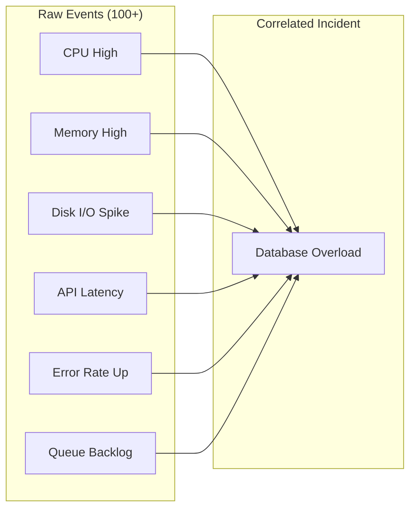
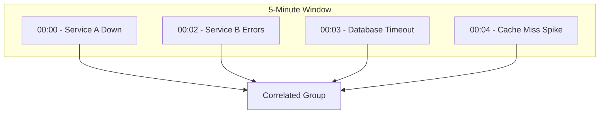
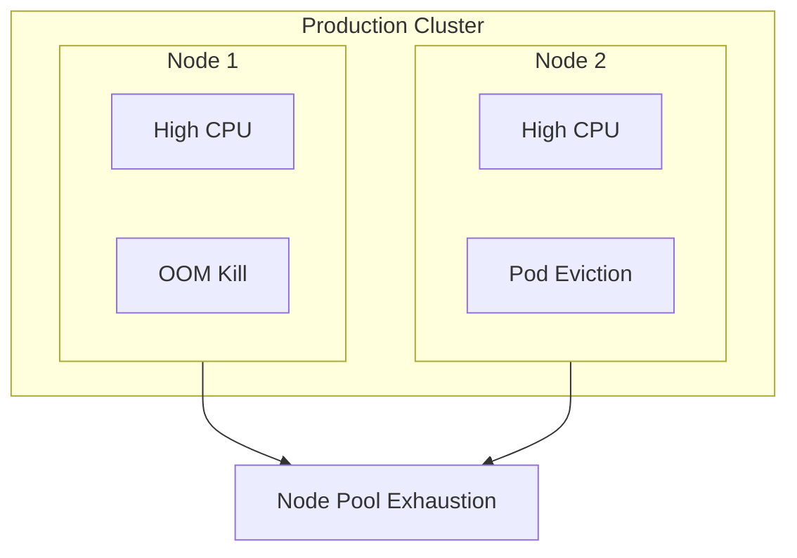
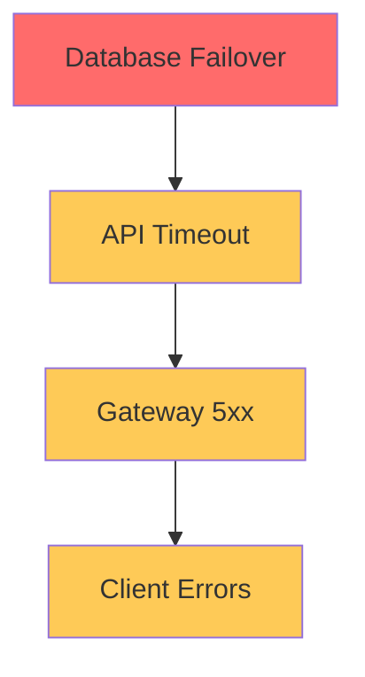

# How to Build Event Correlation Patterns

Author: [nawazdhandala](https://github.com/nawazdhandala)

Tags: Event Correlation, Observability, Alerting, Incident Management, SRE, OpenTelemetry, Monitoring

Description: Learn how to build event correlation patterns that reduce alert fatigue and speed up root cause analysis. Includes production-ready code examples for temporal, spatial, and causal correlation.

---

When your monitoring system fires 500 alerts during an incident, finding the root cause becomes a nightmare. Event correlation transforms that noise into actionable intelligence by grouping related events and identifying patterns that point to the underlying problem.

This guide covers practical event correlation patterns you can implement today, with code examples you can adapt to your observability stack.

## What is Event Correlation?

Event correlation is the process of analyzing multiple events to identify relationships between them. Instead of treating each alert as an isolated incident, correlation engines group related events and surface the most likely root cause.



## Types of Event Correlation

There are three primary correlation strategies, each suited to different scenarios.

### 1. Temporal Correlation

Events that occur within a specific time window are likely related. This is the simplest and most common correlation pattern.



### 2. Spatial Correlation

Events from the same infrastructure component (host, service, cluster) are grouped together. This helps identify cascading failures.



### 3. Causal Correlation

Events with known cause-effect relationships are linked based on dependency maps. This requires understanding your service topology.



## Building a Temporal Correlation Engine

Let's build a practical temporal correlation engine that groups events occurring within a sliding time window.

The following TypeScript class implements a sliding window correlator. It maintains a buffer of recent events and groups them when they share common attributes like service name or error type.

```typescript
// temporal-correlator.ts
// Groups events that occur within a configurable time window

interface Event {
  id: string;
  timestamp: Date;
  source: string;
  severity: 'critical' | 'warning' | 'info';
  attributes: Record<string, string>;
  message: string;
}

interface CorrelatedGroup {
  id: string;
  events: Event[];
  startTime: Date;
  endTime: Date;
  primaryEvent: Event;
  correlationKey: string;
}

class TemporalCorrelator {
  // Events within this window are candidates for correlation
  private windowMs: number;

  // Buffer holds events that haven't been correlated yet
  private eventBuffer: Event[] = [];

  // Active correlation groups
  private groups: Map<string, CorrelatedGroup> = new Map();

  constructor(windowMs: number = 300000) {
    // Default 5-minute window
    this.windowMs = windowMs;
  }

  // Generate a correlation key from event attributes
  // Events with the same key will be grouped together
  private generateCorrelationKey(event: Event): string {
    const keyParts = [
      event.attributes['service'] || 'unknown',
      event.attributes['error_type'] || event.attributes['alert_name'] || 'generic',
      event.attributes['environment'] || 'default',
    ];
    return keyParts.join(':');
  }

  // Add a new event and attempt correlation
  public addEvent(event: Event): CorrelatedGroup | null {
    const correlationKey = this.generateCorrelationKey(event);
    const now = new Date();

    // Clean up expired events from buffer
    this.eventBuffer = this.eventBuffer.filter(
      (e) => now.getTime() - e.timestamp.getTime() < this.windowMs
    );

    // Check if event belongs to an existing group
    const existingGroup = this.groups.get(correlationKey);

    if (existingGroup) {
      // Check if still within the correlation window
      const timeSinceStart = now.getTime() - existingGroup.startTime.getTime();

      if (timeSinceStart < this.windowMs) {
        // Add to existing group
        existingGroup.events.push(event);
        existingGroup.endTime = event.timestamp;

        // Update primary event if this one is more severe
        if (this.isMoreSevere(event, existingGroup.primaryEvent)) {
          existingGroup.primaryEvent = event;
        }

        return existingGroup;
      }
    }

    // Create a new correlation group
    const newGroup: CorrelatedGroup = {
      id: `grp_${Date.now()}_${Math.random().toString(36).substr(2, 9)}`,
      events: [event],
      startTime: event.timestamp,
      endTime: event.timestamp,
      primaryEvent: event,
      correlationKey,
    };

    this.groups.set(correlationKey, newGroup);
    return newGroup;
  }

  // Compare severity levels
  private isMoreSevere(a: Event, b: Event): boolean {
    const severityOrder = { critical: 3, warning: 2, info: 1 };
    return severityOrder[a.severity] > severityOrder[b.severity];
  }

  // Get all active correlation groups
  public getActiveGroups(): CorrelatedGroup[] {
    const now = new Date();
    const active: CorrelatedGroup[] = [];

    this.groups.forEach((group, key) => {
      const timeSinceEnd = now.getTime() - group.endTime.getTime();
      if (timeSinceEnd < this.windowMs) {
        active.push(group);
      } else {
        // Remove expired groups
        this.groups.delete(key);
      }
    });

    return active;
  }
}

export { TemporalCorrelator, Event, CorrelatedGroup };
```

## Building a Spatial Correlation Engine

Spatial correlation groups events based on infrastructure topology. This requires a dependency graph that maps relationships between services, hosts, and clusters.

The following code builds a topology-aware correlator. It uses a graph structure to identify events that share a common infrastructure ancestor.

```typescript
// spatial-correlator.ts
// Groups events based on infrastructure topology

interface TopologyNode {
  id: string;
  type: 'cluster' | 'node' | 'service' | 'pod';
  parentId: string | null;
  metadata: Record<string, string>;
}

interface SpatialEvent {
  id: string;
  timestamp: Date;
  nodeId: string;
  severity: 'critical' | 'warning' | 'info';
  message: string;
}

interface SpatialGroup {
  id: string;
  rootNode: TopologyNode;
  events: SpatialEvent[];
  affectedNodes: Set<string>;
  impactScore: number;
}

class SpatialCorrelator {
  // Topology graph stored as adjacency list
  private topology: Map<string, TopologyNode> = new Map();

  // Child to parent mappings for fast traversal
  private parentMap: Map<string, string> = new Map();

  // Active correlation groups indexed by root node
  private groups: Map<string, SpatialGroup> = new Map();

  // Register a node in the topology
  public registerNode(node: TopologyNode): void {
    this.topology.set(node.id, node);
    if (node.parentId) {
      this.parentMap.set(node.id, node.parentId);
    }
  }

  // Find the root ancestor of a node
  private findRoot(nodeId: string): string {
    let current = nodeId;
    while (this.parentMap.has(current)) {
      current = this.parentMap.get(current)!;
    }
    return current;
  }

  // Find common ancestor between two nodes
  private findCommonAncestor(nodeA: string, nodeB: string): string | null {
    const ancestorsA = new Set<string>();
    let current = nodeA;

    // Build ancestor set for node A
    while (current) {
      ancestorsA.add(current);
      current = this.parentMap.get(current) || '';
    }

    // Walk up from node B until we find a common ancestor
    current = nodeB;
    while (current) {
      if (ancestorsA.has(current)) {
        return current;
      }
      current = this.parentMap.get(current) || '';
    }

    return null;
  }

  // Calculate impact score based on affected topology depth
  private calculateImpactScore(affectedNodes: Set<string>): number {
    let score = 0;
    const typeWeights = { cluster: 100, node: 50, service: 25, pod: 10 };

    affectedNodes.forEach((nodeId) => {
      const node = this.topology.get(nodeId);
      if (node) {
        score += typeWeights[node.type] || 1;
      }
    });

    return score;
  }

  // Add event and correlate spatially
  public addEvent(event: SpatialEvent): SpatialGroup {
    const rootId = this.findRoot(event.nodeId);
    const rootNode = this.topology.get(rootId);

    if (!rootNode) {
      throw new Error(`Unknown node: ${event.nodeId}`);
    }

    // Check for existing group at this root
    let group = this.groups.get(rootId);

    if (group) {
      group.events.push(event);
      group.affectedNodes.add(event.nodeId);
      group.impactScore = this.calculateImpactScore(group.affectedNodes);
    } else {
      group = {
        id: `spatial_${Date.now()}_${Math.random().toString(36).substr(2, 9)}`,
        rootNode,
        events: [event],
        affectedNodes: new Set([event.nodeId]),
        impactScore: this.calculateImpactScore(new Set([event.nodeId])),
      };
      this.groups.set(rootId, group);
    }

    return group;
  }

  // Get groups sorted by impact score
  public getGroupsByImpact(): SpatialGroup[] {
    return Array.from(this.groups.values()).sort(
      (a, b) => b.impactScore - a.impactScore
    );
  }
}

export { SpatialCorrelator, TopologyNode, SpatialEvent, SpatialGroup };
```

## Building a Causal Correlation Engine

Causal correlation uses known cause-effect relationships to link events. This is the most powerful pattern but requires explicit dependency definitions.

The following code implements a rule-based causal correlator. It matches events against predefined cause-effect patterns and builds correlation chains.

```typescript
// causal-correlator.ts
// Links events based on known cause-effect relationships

interface CausalRule {
  id: string;
  name: string;

  // Pattern to match the causing event
  causePattern: {
    source?: RegExp;
    messagePattern?: RegExp;
    attributes?: Record<string, RegExp>;
  };

  // Pattern to match the effect event
  effectPattern: {
    source?: RegExp;
    messagePattern?: RegExp;
    attributes?: Record<string, RegExp>;
  };

  // Maximum time between cause and effect
  maxDelayMs: number;

  // Confidence score for this rule (0-1)
  confidence: number;
}

interface CausalEvent {
  id: string;
  timestamp: Date;
  source: string;
  message: string;
  attributes: Record<string, string>;
}

interface CausalChain {
  id: string;
  rootCause: CausalEvent;
  effects: Array<{
    event: CausalEvent;
    rule: CausalRule;
    confidence: number;
  }>;
  totalConfidence: number;
}

class CausalCorrelator {
  private rules: CausalRule[] = [];
  private recentEvents: CausalEvent[] = [];
  private chains: Map<string, CausalChain> = new Map();

  // How long to keep events in memory
  private retentionMs: number;

  constructor(retentionMs: number = 600000) {
    // Default 10 minutes
    this.retentionMs = retentionMs;
  }

  // Register a causal rule
  public addRule(rule: CausalRule): void {
    this.rules.push(rule);
  }

  // Check if an event matches a pattern
  private matchesPattern(
    event: CausalEvent,
    pattern: CausalRule['causePattern']
  ): boolean {
    if (pattern.source && !pattern.source.test(event.source)) {
      return false;
    }

    if (pattern.messagePattern && !pattern.messagePattern.test(event.message)) {
      return false;
    }

    if (pattern.attributes) {
      for (const [key, regex] of Object.entries(pattern.attributes)) {
        if (!event.attributes[key] || !regex.test(event.attributes[key])) {
          return false;
        }
      }
    }

    return true;
  }

  // Find potential causes for an effect event
  private findCauses(
    effectEvent: CausalEvent
  ): Array<{ cause: CausalEvent; rule: CausalRule }> {
    const matches: Array<{ cause: CausalEvent; rule: CausalRule }> = [];

    for (const rule of this.rules) {
      // Check if this event matches the effect pattern
      if (!this.matchesPattern(effectEvent, rule.effectPattern)) {
        continue;
      }

      // Look for matching cause events in the recent past
      for (const candidateCause of this.recentEvents) {
        // Check time constraint
        const timeDiff =
          effectEvent.timestamp.getTime() - candidateCause.timestamp.getTime();
        if (timeDiff < 0 || timeDiff > rule.maxDelayMs) {
          continue;
        }

        // Check if candidate matches cause pattern
        if (this.matchesPattern(candidateCause, rule.causePattern)) {
          matches.push({ cause: candidateCause, rule });
        }
      }
    }

    return matches;
  }

  // Add event and attempt causal correlation
  public addEvent(event: CausalEvent): CausalChain | null {
    const now = new Date();

    // Clean up old events
    this.recentEvents = this.recentEvents.filter(
      (e) => now.getTime() - e.timestamp.getTime() < this.retentionMs
    );

    // Add to recent events
    this.recentEvents.push(event);

    // Find potential causes
    const causes = this.findCauses(event);

    if (causes.length === 0) {
      // This might be a root cause, create new chain
      const chain: CausalChain = {
        id: `chain_${event.id}`,
        rootCause: event,
        effects: [],
        totalConfidence: 1.0,
      };
      this.chains.set(event.id, chain);
      return chain;
    }

    // Link to the most confident cause
    const bestMatch = causes.reduce((best, current) =>
      current.rule.confidence > best.rule.confidence ? current : best
    );

    // Find or create chain for the cause
    let chain = this.chains.get(bestMatch.cause.id);

    if (!chain) {
      chain = {
        id: `chain_${bestMatch.cause.id}`,
        rootCause: bestMatch.cause,
        effects: [],
        totalConfidence: 1.0,
      };
      this.chains.set(bestMatch.cause.id, chain);
    }

    // Add this event as an effect
    chain.effects.push({
      event,
      rule: bestMatch.rule,
      confidence: bestMatch.rule.confidence,
    });

    // Update total confidence
    chain.totalConfidence =
      chain.effects.reduce((sum, e) => sum + e.confidence, 0) /
      chain.effects.length;

    return chain;
  }

  // Get all active chains sorted by confidence
  public getChains(): CausalChain[] {
    return Array.from(this.chains.values()).sort(
      (a, b) => b.totalConfidence - a.totalConfidence
    );
  }
}

export { CausalCorrelator, CausalRule, CausalEvent, CausalChain };
```

## Defining Causal Rules

Here are common causal rules you might configure for a typical web application.

```typescript
// rules.ts
// Production-ready causal correlation rules

import { CausalRule } from './causal-correlator';

const productionRules: CausalRule[] = [
  {
    id: 'db-failover-api-timeout',
    name: 'Database Failover causes API Timeouts',
    causePattern: {
      source: /^database/,
      messagePattern: /failover|connection lost|primary changed/i,
    },
    effectPattern: {
      source: /^api/,
      messagePattern: /timeout|connection refused|ECONNRESET/i,
    },
    maxDelayMs: 30000, // 30 seconds
    confidence: 0.95,
  },

  {
    id: 'memory-pressure-oom',
    name: 'Memory Pressure leads to OOM Kills',
    causePattern: {
      messagePattern: /memory usage above \d+%/i,
      attributes: {
        alert_type: /threshold/,
      },
    },
    effectPattern: {
      messagePattern: /OOMKilled|out of memory|memory limit exceeded/i,
    },
    maxDelayMs: 120000, // 2 minutes
    confidence: 0.85,
  },

  {
    id: 'deployment-error-spike',
    name: 'Deployment causes Error Rate Spike',
    causePattern: {
      source: /^deployment|^kubernetes/,
      messagePattern: /deployment.*started|rollout|image updated/i,
    },
    effectPattern: {
      messagePattern: /error rate|5xx|exception rate/i,
      attributes: {
        alert_type: /anomaly|threshold/,
      },
    },
    maxDelayMs: 300000, // 5 minutes
    confidence: 0.75,
  },

  {
    id: 'cert-expiry-tls-failure',
    name: 'Certificate Expiry causes TLS Failures',
    causePattern: {
      messagePattern: /certificate.*expir|cert.*days remaining/i,
    },
    effectPattern: {
      messagePattern: /TLS handshake|SSL error|certificate verify failed/i,
    },
    maxDelayMs: 86400000, // 24 hours
    confidence: 0.90,
  },

  {
    id: 'dns-failure-connection-errors',
    name: 'DNS Failure causes Connection Errors',
    causePattern: {
      source: /^dns|^network/,
      messagePattern: /DNS.*failed|resolution.*timeout|NXDOMAIN/i,
    },
    effectPattern: {
      messagePattern: /ENOTFOUND|getaddrinfo|name resolution/i,
    },
    maxDelayMs: 60000, // 1 minute
    confidence: 0.92,
  },

  {
    id: 'disk-full-write-errors',
    name: 'Disk Full causes Write Errors',
    causePattern: {
      messagePattern: /disk usage.*9\d%|disk space low|volume.*full/i,
    },
    effectPattern: {
      messagePattern: /ENOSPC|no space left|write failed|disk full/i,
    },
    maxDelayMs: 600000, // 10 minutes
    confidence: 0.95,
  },
];

export { productionRules };
```

## Combining Correlation Strategies

Real-world scenarios benefit from combining all three correlation types. The following class orchestrates temporal, spatial, and causal correlation into a unified engine.

```typescript
// unified-correlator.ts
// Combines temporal, spatial, and causal correlation

import { TemporalCorrelator, Event } from './temporal-correlator';
import { SpatialCorrelator, TopologyNode, SpatialEvent } from './spatial-correlator';
import { CausalCorrelator, CausalRule, CausalEvent } from './causal-correlator';

interface UnifiedEvent {
  id: string;
  timestamp: Date;
  source: string;
  nodeId: string;
  severity: 'critical' | 'warning' | 'info';
  message: string;
  attributes: Record<string, string>;
}

interface UnifiedIncident {
  id: string;
  events: UnifiedEvent[];
  temporalGroupId: string | null;
  spatialGroupId: string | null;
  causalChainId: string | null;
  rootCause: UnifiedEvent | null;
  confidence: number;
  impactScore: number;
}

class UnifiedCorrelator {
  private temporal: TemporalCorrelator;
  private spatial: SpatialCorrelator;
  private causal: CausalCorrelator;
  private incidents: Map<string, UnifiedIncident> = new Map();

  constructor(
    temporalWindowMs: number = 300000,
    causalRetentionMs: number = 600000
  ) {
    this.temporal = new TemporalCorrelator(temporalWindowMs);
    this.spatial = new SpatialCorrelator();
    this.causal = new CausalCorrelator(causalRetentionMs);
  }

  // Register topology for spatial correlation
  public registerTopology(nodes: TopologyNode[]): void {
    nodes.forEach((node) => this.spatial.registerNode(node));
  }

  // Register causal rules
  public addCausalRules(rules: CausalRule[]): void {
    rules.forEach((rule) => this.causal.addRule(rule));
  }

  // Process an event through all correlation engines
  public processEvent(event: UnifiedEvent): UnifiedIncident {
    // Run through temporal correlation
    const temporalEvent: Event = {
      id: event.id,
      timestamp: event.timestamp,
      source: event.source,
      severity: event.severity,
      attributes: event.attributes,
      message: event.message,
    };
    const temporalGroup = this.temporal.addEvent(temporalEvent);

    // Run through spatial correlation
    const spatialEvent: SpatialEvent = {
      id: event.id,
      timestamp: event.timestamp,
      nodeId: event.nodeId,
      severity: event.severity,
      message: event.message,
    };
    const spatialGroup = this.spatial.addEvent(spatialEvent);

    // Run through causal correlation
    const causalEvent: CausalEvent = {
      id: event.id,
      timestamp: event.timestamp,
      source: event.source,
      message: event.message,
      attributes: event.attributes,
    };
    const causalChain = this.causal.addEvent(causalEvent);

    // Create or update unified incident
    const incidentKey = `${temporalGroup?.id}_${spatialGroup.id}`;
    let incident = this.incidents.get(incidentKey);

    if (!incident) {
      incident = {
        id: `incident_${Date.now()}_${Math.random().toString(36).substr(2, 9)}`,
        events: [],
        temporalGroupId: temporalGroup?.id || null,
        spatialGroupId: spatialGroup.id,
        causalChainId: causalChain?.id || null,
        rootCause: null,
        confidence: 0,
        impactScore: 0,
      };
      this.incidents.set(incidentKey, incident);
    }

    incident.events.push(event);
    incident.impactScore = spatialGroup.impactScore;

    // Determine root cause from causal chain
    if (causalChain) {
      const rootCauseEvent = incident.events.find(
        (e) => e.id === causalChain.rootCause.id
      );
      if (rootCauseEvent) {
        incident.rootCause = rootCauseEvent;
        incident.confidence = causalChain.totalConfidence;
      }
    }

    return incident;
  }

  // Get active incidents sorted by impact
  public getActiveIncidents(): UnifiedIncident[] {
    return Array.from(this.incidents.values())
      .filter((i) => i.events.length > 0)
      .sort((a, b) => b.impactScore - a.impactScore);
  }
}

export { UnifiedCorrelator, UnifiedEvent, UnifiedIncident };
```

## Integration with Alerting Systems

The correlation engine needs to integrate with your existing alerting pipeline. Here is an example integration with a webhook-based alert receiver.

```typescript
// alert-receiver.ts
// HTTP endpoint that receives alerts and correlates them

import express from 'express';
import { UnifiedCorrelator, UnifiedEvent } from './unified-correlator';
import { productionRules } from './rules';

const app = express();
app.use(express.json());

// Initialize the correlator
const correlator = new UnifiedCorrelator();
correlator.addCausalRules(productionRules);

// Register your topology (typically loaded from service discovery)
correlator.registerTopology([
  { id: 'prod-cluster', type: 'cluster', parentId: null, metadata: {} },
  { id: 'node-1', type: 'node', parentId: 'prod-cluster', metadata: {} },
  { id: 'node-2', type: 'node', parentId: 'prod-cluster', metadata: {} },
  { id: 'api-service', type: 'service', parentId: 'node-1', metadata: {} },
  { id: 'db-service', type: 'service', parentId: 'node-2', metadata: {} },
]);

// Webhook endpoint for receiving alerts
// Compatible with Prometheus Alertmanager, Grafana, and similar tools
app.post('/api/alerts', (req, res) => {
  const alerts = req.body.alerts || [req.body];

  const incidents: any[] = [];

  for (const alert of alerts) {
    // Transform alert to unified event format
    const event: UnifiedEvent = {
      id: alert.fingerprint || `alert_${Date.now()}`,
      timestamp: new Date(alert.startsAt || Date.now()),
      source: alert.labels?.alertname || 'unknown',
      nodeId: alert.labels?.instance || alert.labels?.service || 'unknown',
      severity: mapSeverity(alert.labels?.severity),
      message: alert.annotations?.summary || alert.annotations?.description || '',
      attributes: {
        ...alert.labels,
        ...alert.annotations,
      },
    };

    const incident = correlator.processEvent(event);
    incidents.push(incident);
  }

  // Return correlation results
  res.json({
    processed: alerts.length,
    incidents: incidents.map((i) => ({
      id: i.id,
      eventCount: i.events.length,
      rootCause: i.rootCause?.message || null,
      confidence: i.confidence,
      impactScore: i.impactScore,
    })),
  });
});

// Map common severity labels to our format
function mapSeverity(severity: string): 'critical' | 'warning' | 'info' {
  switch (severity?.toLowerCase()) {
    case 'critical':
    case 'error':
    case 'fatal':
      return 'critical';
    case 'warning':
    case 'warn':
      return 'warning';
    default:
      return 'info';
  }
}

// Endpoint to get current incidents
app.get('/api/incidents', (req, res) => {
  const incidents = correlator.getActiveIncidents();
  res.json({
    count: incidents.length,
    incidents: incidents.map((i) => ({
      id: i.id,
      eventCount: i.events.length,
      rootCause: i.rootCause
        ? {
            source: i.rootCause.source,
            message: i.rootCause.message,
            timestamp: i.rootCause.timestamp,
          }
        : null,
      confidence: i.confidence,
      impactScore: i.impactScore,
      events: i.events.map((e) => ({
        id: e.id,
        source: e.source,
        message: e.message,
        severity: e.severity,
        timestamp: e.timestamp,
      })),
    })),
  });
});

const PORT = process.env.PORT || 3000;
app.listen(PORT, () => {
  console.log(`Alert correlation service running on port ${PORT}`);
});
```

## Tuning Correlation Parameters

Getting correlation right requires tuning several parameters based on your environment.

| Parameter | Default | Tuning Guidance |
|-----------|---------|-----------------|
| Temporal Window | 5 minutes | Increase for slow-propagating failures, decrease to reduce false correlations |
| Causal Retention | 10 minutes | Match to your longest known cause-effect delay |
| Rule Confidence | 0.75+ | Start conservative, increase as you validate rules |
| Impact Weights | cluster:100, node:50, service:25 | Adjust based on your blast radius concerns |

### Monitoring Correlation Quality

Track these metrics to ensure your correlation engine is working:

```typescript
// metrics.ts
// Correlation quality metrics

interface CorrelationMetrics {
  // How many events are grouped vs standalone
  correlationRate: number;

  // Average events per incident
  avgGroupSize: number;

  // How often root cause identification succeeds
  rootCauseHitRate: number;

  // Time from first event to root cause identification
  avgTimeToRootCause: number;
}

function calculateMetrics(incidents: any[]): CorrelationMetrics {
  const totalEvents = incidents.reduce((sum, i) => sum + i.events.length, 0);
  const correlatedEvents = incidents
    .filter((i) => i.events.length > 1)
    .reduce((sum, i) => sum + i.events.length, 0);

  const incidentsWithRootCause = incidents.filter((i) => i.rootCause !== null);

  return {
    correlationRate: totalEvents > 0 ? correlatedEvents / totalEvents : 0,
    avgGroupSize:
      incidents.length > 0 ? totalEvents / incidents.length : 0,
    rootCauseHitRate:
      incidents.length > 0 ? incidentsWithRootCause.length / incidents.length : 0,
    avgTimeToRootCause: calculateAvgTimeToRootCause(incidentsWithRootCause),
  };
}

function calculateAvgTimeToRootCause(incidents: any[]): number {
  if (incidents.length === 0) return 0;

  const times = incidents.map((i) => {
    const firstEventTime = Math.min(
      ...i.events.map((e: any) => new Date(e.timestamp).getTime())
    );
    const rootCauseTime = new Date(i.rootCause.timestamp).getTime();
    return rootCauseTime - firstEventTime;
  });

  return times.reduce((sum, t) => sum + t, 0) / times.length;
}

export { CorrelationMetrics, calculateMetrics };
```

## Summary

Event correlation transforms alert noise into actionable incidents. The key patterns are:

| Pattern | Use Case | Complexity |
|---------|----------|------------|
| Temporal | Group events in time windows | Low |
| Spatial | Group by infrastructure topology | Medium |
| Causal | Link cause-effect relationships | High |

Start with temporal correlation for immediate noise reduction, add spatial correlation when you have topology data, and implement causal rules as you learn your system's failure patterns.

The code in this guide provides a foundation you can extend. Consider adding machine learning for anomaly-based correlation, or integrate with service meshes for automatic topology discovery.

For production deployments, platforms like OneUptime provide built-in event correlation that integrates with your existing observability stack, so you can focus on defining rules rather than building infrastructure.
