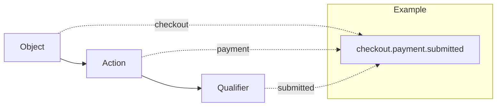
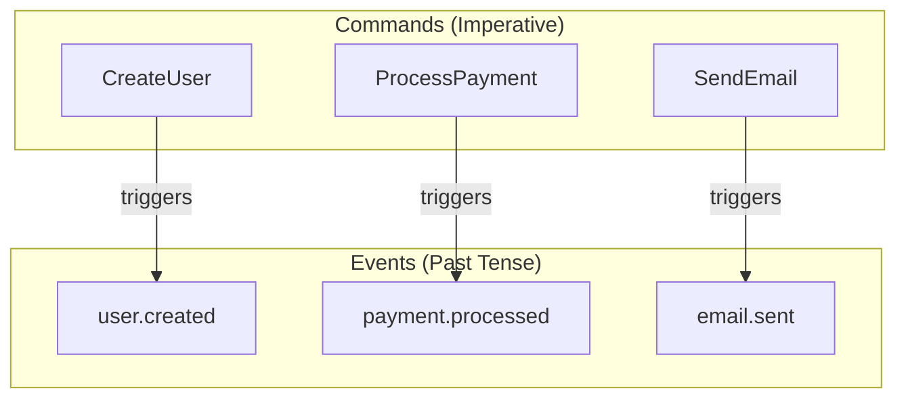
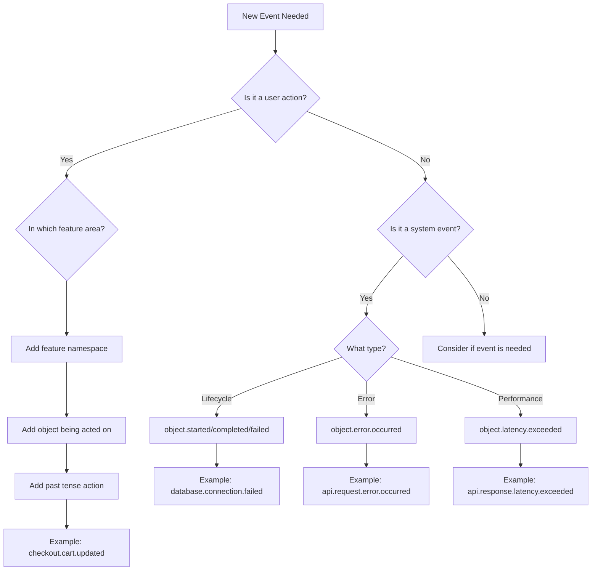
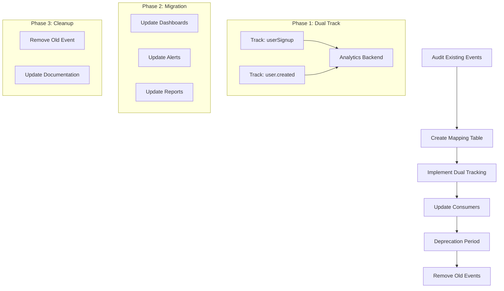

# How to Build Event Naming Conventions

Author: [nawazdhandala](https://github.com/nawazdhandala)

Tags: Event-Driven Architecture, Naming Conventions, Analytics, OpenTelemetry, Observability, Best Practices

Description: A practical guide to building consistent event naming conventions for analytics, observability, and event-driven systems. Learn patterns that scale across teams and make your telemetry data queryable.

---

Event names are the foundation of your analytics and observability systems. A poorly named event like `click` tells you nothing. A well-named event like `checkout.payment_method.selected` tells you exactly what happened, where it happened, and how to query it. This guide shows you how to build naming conventions that scale.

## Why Event Naming Conventions Matter

Without consistent naming, your event data becomes a mess. You end up with `userSignup`, `user_signup`, `UserSignUp`, and `user-sign-up` all representing the same action. Teams waste hours trying to find the right events in their analytics tools. Dashboards break when someone renames an event. Onboarding new engineers takes weeks because nobody knows what events exist.

Good naming conventions solve these problems by making events:

- **Discoverable**: Engineers can guess event names before looking them up
- **Queryable**: You can filter and aggregate events using pattern matching
- **Self-documenting**: The name tells you what happened without reading code
- **Consistent**: Every team uses the same patterns

## The Anatomy of a Good Event Name

A well-structured event name follows a predictable pattern that encodes context. Here is a proven structure that works across analytics, observability, and event-driven systems.



The pattern breaks down into three parts:

| Component | Purpose | Examples |
|-----------|---------|----------|
| Object | The entity being acted upon | `user`, `order`, `checkout`, `cart` |
| Action | What operation occurred | `created`, `updated`, `deleted`, `viewed` |
| Qualifier | Additional context (optional) | `succeeded`, `failed`, `started`, `completed` |

## Core Naming Patterns

### Pattern 1: Object-Action Format

The simplest pattern joins an object with its action using a separator. This works well for most business events and analytics tracking.

This TypeScript implementation provides type-safe event name construction with auto-completion support. The generic types ensure only valid object-action combinations can be created.

```typescript
// event-naming.ts - Type-safe event name builder

// Define allowed objects in your domain
type EventObject =
  | 'user'
  | 'order'
  | 'cart'
  | 'checkout'
  | 'payment'
  | 'product'
  | 'subscription';

// Define allowed actions
type EventAction =
  | 'created'
  | 'updated'
  | 'deleted'
  | 'viewed'
  | 'clicked'
  | 'submitted'
  | 'completed'
  | 'failed'
  | 'started'
  | 'cancelled';

// Build event name with type safety
function buildEventName(object: EventObject, action: EventAction): string {
  return `${object}.${action}`;
}

// Usage examples that demonstrate the pattern
const events = {
  userCreated: buildEventName('user', 'created'),     // "user.created"
  orderCompleted: buildEventName('order', 'completed'), // "order.completed"
  cartUpdated: buildEventName('cart', 'updated'),     // "cart.updated"
  paymentFailed: buildEventName('payment', 'failed'), // "payment.failed"
};

console.log(events);
```

### Pattern 2: Hierarchical Namespacing

For larger systems, add namespacing to group related events. This enables powerful pattern-based queries and helps organize events by feature or domain.

This pattern uses a namespace prefix to group events by feature area. The hierarchy makes it easy to query all events from a specific domain using wildcards.

```typescript
// namespaced-events.ts - Hierarchical event naming for large systems

// Define namespace hierarchy
type Namespace =
  | 'app'           // Global application events
  | 'checkout'      // Checkout flow events
  | 'inventory'     // Inventory management events
  | 'notifications' // Notification system events
  | 'auth';         // Authentication events

// Build namespaced event name
function buildNamespacedEvent(
  namespace: Namespace,
  object: string,
  action: string,
  qualifier?: string
): string {
  const parts = [namespace, object, action];
  if (qualifier) {
    parts.push(qualifier);
  }
  return parts.join('.');
}

// Examples showing the hierarchy
const checkoutEvents = {
  // All checkout events start with "checkout."
  // This enables queries like: checkout.*
  cartViewed: buildNamespacedEvent('checkout', 'cart', 'viewed'),
  // Result: "checkout.cart.viewed"

  paymentSubmitted: buildNamespacedEvent('checkout', 'payment', 'submitted'),
  // Result: "checkout.payment.submitted"

  paymentSucceeded: buildNamespacedEvent('checkout', 'payment', 'submitted', 'succeeded'),
  // Result: "checkout.payment.submitted.succeeded"

  paymentFailed: buildNamespacedEvent('checkout', 'payment', 'submitted', 'failed'),
  // Result: "checkout.payment.submitted.failed"
};

const authEvents = {
  // All auth events start with "auth."
  loginStarted: buildNamespacedEvent('auth', 'login', 'started'),
  // Result: "auth.login.started"

  loginSucceeded: buildNamespacedEvent('auth', 'login', 'completed', 'succeeded'),
  // Result: "auth.login.completed.succeeded"

  logoutCompleted: buildNamespacedEvent('auth', 'logout', 'completed'),
  // Result: "auth.logout.completed"
};
```

### Pattern 3: Past Tense for Completed Events

Events represent things that already happened. Using past tense makes this clear and distinguishes events from commands or requests.



This shows the relationship between commands and events. Commands trigger actions; events record that actions happened.

```typescript
// past-tense-events.ts - Consistent past tense naming

// Bad: These names are ambiguous
const badEventNames = [
  'createUser',      // Is this a command or event?
  'userCreate',      // Unclear timing
  'user_signup',     // Mixed with present tense
  'ProcessPayment',  // Looks like a function name
];

// Good: Past tense makes it clear these already happened
const goodEventNames = [
  'user.created',           // A user was created
  'user.signed_up',         // A user completed signup
  'payment.processed',      // Payment processing finished
  'order.shipped',          // Order was shipped
  'email.delivered',        // Email reached recipient
  'subscription.renewed',   // Subscription renewal completed
];

// Helper to enforce past tense naming
const VALID_PAST_TENSE_SUFFIXES = [
  'created', 'updated', 'deleted', 'viewed',
  'clicked', 'submitted', 'completed', 'failed',
  'started', 'cancelled', 'processed', 'shipped',
  'delivered', 'renewed', 'expired', 'activated',
  'deactivated', 'approved', 'rejected', 'refunded',
];

function validateEventAction(action: string): boolean {
  return VALID_PAST_TENSE_SUFFIXES.includes(action);
}
```

## Building a Complete Event Registry

A centralized event registry ensures consistency across your codebase. It serves as documentation and prevents event name drift over time.

This registry pattern centralizes all event definitions with their metadata. TypeScript provides type checking, while the registry object serves as living documentation.

```typescript
// event-registry.ts - Centralized event definitions

interface EventDefinition {
  name: string;
  description: string;
  category: string;
  attributes: AttributeDefinition[];
}

interface AttributeDefinition {
  name: string;
  type: 'string' | 'number' | 'boolean';
  required: boolean;
  description: string;
}

// Define all events in a single registry
const EVENT_REGISTRY: Record<string, EventDefinition> = {
  // User Events
  'user.created': {
    name: 'user.created',
    description: 'Fired when a new user account is created',
    category: 'user',
    attributes: [
      { name: 'user_id', type: 'string', required: true, description: 'Unique user identifier' },
      { name: 'signup_method', type: 'string', required: true, description: 'How user signed up: email, google, github' },
      { name: 'referral_source', type: 'string', required: false, description: 'Where the user came from' },
    ],
  },

  'user.logged_in': {
    name: 'user.logged_in',
    description: 'Fired when a user successfully logs in',
    category: 'user',
    attributes: [
      { name: 'user_id', type: 'string', required: true, description: 'Unique user identifier' },
      { name: 'login_method', type: 'string', required: true, description: 'Authentication method used' },
      { name: 'mfa_used', type: 'boolean', required: true, description: 'Whether MFA was required' },
    ],
  },

  // Checkout Events
  'checkout.started': {
    name: 'checkout.started',
    description: 'Fired when user begins checkout process',
    category: 'checkout',
    attributes: [
      { name: 'cart_id', type: 'string', required: true, description: 'Shopping cart identifier' },
      { name: 'item_count', type: 'number', required: true, description: 'Number of items in cart' },
      { name: 'cart_total', type: 'number', required: true, description: 'Total cart value in cents' },
    ],
  },

  'checkout.payment.submitted': {
    name: 'checkout.payment.submitted',
    description: 'Fired when payment form is submitted',
    category: 'checkout',
    attributes: [
      { name: 'checkout_id', type: 'string', required: true, description: 'Checkout session identifier' },
      { name: 'payment_method', type: 'string', required: true, description: 'Payment method: card, paypal, etc' },
      { name: 'amount', type: 'number', required: true, description: 'Payment amount in cents' },
    ],
  },

  'checkout.payment.succeeded': {
    name: 'checkout.payment.succeeded',
    description: 'Fired when payment is successfully processed',
    category: 'checkout',
    attributes: [
      { name: 'checkout_id', type: 'string', required: true, description: 'Checkout session identifier' },
      { name: 'payment_id', type: 'string', required: true, description: 'Payment transaction identifier' },
      { name: 'amount', type: 'number', required: true, description: 'Payment amount in cents' },
    ],
  },

  'checkout.payment.failed': {
    name: 'checkout.payment.failed',
    description: 'Fired when payment processing fails',
    category: 'checkout',
    attributes: [
      { name: 'checkout_id', type: 'string', required: true, description: 'Checkout session identifier' },
      { name: 'error_code', type: 'string', required: true, description: 'Payment failure error code' },
      { name: 'error_message', type: 'string', required: false, description: 'Human readable error message' },
    ],
  },
};

// Helper to get event definition
function getEventDefinition(eventName: string): EventDefinition | undefined {
  return EVENT_REGISTRY[eventName];
}

// List all events in a category
function getEventsByCategory(category: string): EventDefinition[] {
  return Object.values(EVENT_REGISTRY).filter(event => event.category === category);
}

// Export for use across the application
export { EVENT_REGISTRY, getEventDefinition, getEventsByCategory };
```

## Implementing Event Tracking with Validation

With your registry defined, implement a tracking function that validates events before sending them. This catches naming mistakes at development time.

This tracker validates event names against the registry and checks required attributes. Invalid events throw errors in development but log warnings in production to avoid breaking user flows.

```typescript
// event-tracker.ts - Validated event tracking

import { EVENT_REGISTRY, getEventDefinition } from './event-registry';

interface TrackingPayload {
  event: string;
  attributes: Record<string, unknown>;
  timestamp?: number;
}

class EventTracker {
  private isDevelopment: boolean;

  constructor() {
    this.isDevelopment = process.env.NODE_ENV === 'development';
  }

  track(eventName: string, attributes: Record<string, unknown> = {}): void {
    // Validate event exists in registry
    const definition = getEventDefinition(eventName);

    if (!definition) {
      const message = `Unknown event: "${eventName}". Add it to EVENT_REGISTRY first.`;
      if (this.isDevelopment) {
        throw new Error(message);
      }
      console.warn(message);
      return;
    }

    // Validate required attributes
    const validationErrors = this.validateAttributes(definition, attributes);

    if (validationErrors.length > 0) {
      const message = `Event "${eventName}" validation failed:\n${validationErrors.join('\n')}`;
      if (this.isDevelopment) {
        throw new Error(message);
      }
      console.warn(message);
    }

    // Build payload
    const payload: TrackingPayload = {
      event: eventName,
      attributes: this.sanitizeAttributes(attributes),
      timestamp: Date.now(),
    };

    // Send to your analytics backend
    this.send(payload);
  }

  private validateAttributes(
    definition: { attributes: Array<{ name: string; required: boolean; type: string }> },
    attributes: Record<string, unknown>
  ): string[] {
    const errors: string[] = [];

    // Check required attributes
    for (const attr of definition.attributes) {
      if (attr.required && !(attr.name in attributes)) {
        errors.push(`  Missing required attribute: ${attr.name}`);
      }

      // Type check if attribute is present
      if (attr.name in attributes) {
        const value = attributes[attr.name];
        const actualType = typeof value;

        if (actualType !== attr.type) {
          errors.push(`  Attribute "${attr.name}" should be ${attr.type}, got ${actualType}`);
        }
      }
    }

    return errors;
  }

  private sanitizeAttributes(attributes: Record<string, unknown>): Record<string, unknown> {
    // Remove undefined values and trim strings
    const sanitized: Record<string, unknown> = {};

    for (const [key, value] of Object.entries(attributes)) {
      if (value === undefined) continue;

      if (typeof value === 'string') {
        sanitized[key] = value.trim();
      } else {
        sanitized[key] = value;
      }
    }

    return sanitized;
  }

  private send(payload: TrackingPayload): void {
    // Replace with your actual analytics endpoint
    console.log('Tracking event:', JSON.stringify(payload, null, 2));

    // Example: Send to analytics service
    // fetch('/api/analytics/track', {
    //   method: 'POST',
    //   body: JSON.stringify(payload),
    // });
  }
}

// Export singleton instance
export const tracker = new EventTracker();
```

## OpenTelemetry Span Events

For observability systems, span events follow similar naming patterns but integrate with distributed tracing. Here is how to apply the conventions to OpenTelemetry.

This helper wraps OpenTelemetry span event creation with consistent naming. It automatically adds timestamps and validates event names against your conventions.

```typescript
// otel-events.ts - OpenTelemetry span event naming

import { trace, Span, SpanStatusCode } from '@opentelemetry/api';

// Event name builder for span events
class SpanEventBuilder {
  private span: Span;

  constructor(span: Span) {
    this.span = span;
  }

  // Add a lifecycle event (started, completed, failed)
  lifecycle(object: string, status: 'started' | 'completed' | 'failed', attributes?: Record<string, unknown>): void {
    const eventName = `${object}.${status}`;
    this.span.addEvent(eventName, attributes);

    // Set span status on failure
    if (status === 'failed') {
      this.span.setStatus({ code: SpanStatusCode.ERROR });
    }
  }

  // Add a business event
  business(object: string, action: string, attributes?: Record<string, unknown>): void {
    const eventName = `${object}.${action}`;
    this.span.addEvent(eventName, {
      'event.category': 'business',
      ...attributes,
    });
  }

  // Add a technical event (cache, retry, etc)
  technical(object: string, action: string, attributes?: Record<string, unknown>): void {
    const eventName = `${object}.${action}`;
    this.span.addEvent(eventName, {
      'event.category': 'technical',
      ...attributes,
    });
  }
}

// Usage example in an order processing function
async function processOrder(orderId: string): Promise<void> {
  const tracer = trace.getTracer('order-service');

  return tracer.startActiveSpan('process-order', async (span) => {
    const events = new SpanEventBuilder(span);

    try {
      // Mark order processing started
      events.lifecycle('order.processing', 'started', {
        'order.id': orderId,
      });

      // Validate order
      events.technical('order.validation', 'started');
      await validateOrder(orderId);
      events.technical('order.validation', 'completed', {
        'validation.passed': true,
      });

      // Process payment
      events.business('payment', 'submitted', {
        'order.id': orderId,
      });

      const paymentResult = await processPayment(orderId);

      if (paymentResult.success) {
        events.business('payment', 'succeeded', {
          'payment.id': paymentResult.id,
        });
      } else {
        events.business('payment', 'failed', {
          'error.code': paymentResult.errorCode,
        });
        events.lifecycle('order.processing', 'failed', {
          'failure.reason': 'payment_declined',
        });
        return;
      }

      // Mark order complete
      events.lifecycle('order.processing', 'completed', {
        'order.id': orderId,
        'payment.id': paymentResult.id,
      });

    } catch (error) {
      span.recordException(error as Error);
      events.lifecycle('order.processing', 'failed', {
        'error.message': (error as Error).message,
      });
      throw error;
    } finally {
      span.end();
    }
  });
}

// Placeholder functions
async function validateOrder(orderId: string): Promise<void> {}
async function processPayment(orderId: string): Promise<{ success: boolean; id?: string; errorCode?: string }> {
  return { success: true, id: 'pay_123' };
}
```

## Naming Convention Decision Tree

Use this decision tree when naming new events.



## Common Patterns by Domain

### E-commerce Events

```typescript
// ecommerce-events.ts - Standard e-commerce event patterns

const ECOMMERCE_EVENTS = {
  // Product interactions
  'product.viewed': {},
  'product.added_to_cart': {},
  'product.removed_from_cart': {},
  'product.added_to_wishlist': {},

  // Cart events
  'cart.created': {},
  'cart.updated': {},
  'cart.abandoned': {},

  // Checkout flow
  'checkout.started': {},
  'checkout.shipping.selected': {},
  'checkout.payment.submitted': {},
  'checkout.payment.succeeded': {},
  'checkout.payment.failed': {},
  'checkout.completed': {},

  // Order lifecycle
  'order.created': {},
  'order.confirmed': {},
  'order.shipped': {},
  'order.delivered': {},
  'order.cancelled': {},
  'order.refunded': {},

  // Search and discovery
  'search.performed': {},
  'search.results.clicked': {},
  'filter.applied': {},
  'sort.changed': {},
};
```

### SaaS Application Events

```typescript
// saas-events.ts - Standard SaaS application events

const SAAS_EVENTS = {
  // Account lifecycle
  'account.created': {},
  'account.activated': {},
  'account.suspended': {},
  'account.deleted': {},

  // User management
  'user.invited': {},
  'user.joined': {},
  'user.role.changed': {},
  'user.removed': {},

  // Subscription events
  'subscription.started': {},
  'subscription.upgraded': {},
  'subscription.downgraded': {},
  'subscription.cancelled': {},
  'subscription.renewed': {},
  'subscription.expired': {},

  // Feature usage
  'feature.enabled': {},
  'feature.disabled': {},
  'feature.limit.reached': {},

  // Billing
  'invoice.created': {},
  'invoice.paid': {},
  'invoice.failed': {},
  'payment_method.added': {},
  'payment_method.updated': {},
  'payment_method.removed': {},
};
```

### API and Infrastructure Events

```typescript
// infrastructure-events.ts - API and infrastructure event patterns

const INFRASTRUCTURE_EVENTS = {
  // API events
  'api.request.received': {},
  'api.request.completed': {},
  'api.request.failed': {},
  'api.rate_limit.exceeded': {},

  // Database events
  'database.query.started': {},
  'database.query.completed': {},
  'database.query.failed': {},
  'database.connection.established': {},
  'database.connection.failed': {},
  'database.connection.closed': {},

  // Cache events
  'cache.hit': {},
  'cache.miss': {},
  'cache.invalidated': {},
  'cache.evicted': {},

  // Queue events
  'queue.message.published': {},
  'queue.message.received': {},
  'queue.message.processed': {},
  'queue.message.failed': {},
  'queue.message.dead_lettered': {},

  // External service events
  'external_service.request.started': {},
  'external_service.request.succeeded': {},
  'external_service.request.failed': {},
  'external_service.circuit.opened': {},
  'external_service.circuit.closed': {},
};
```

## Enforcing Conventions with Linting

Add automated enforcement to catch naming violations before they reach production.

This ESLint rule validates that all event names in your codebase follow the defined pattern. It catches violations at development time, preventing inconsistent names from being committed.

```typescript
// eslint-rules/event-naming.ts - ESLint rule for event name validation

import { Rule } from 'eslint';

// Pattern: namespace.object.action or object.action
const EVENT_NAME_PATTERN = /^[a-z][a-z0-9]*(\.[a-z][a-z0-9]*){1,3}$/;

// Valid actions (past tense)
const VALID_ACTIONS = new Set([
  'created', 'updated', 'deleted', 'viewed', 'clicked',
  'submitted', 'completed', 'failed', 'started', 'cancelled',
  'processed', 'shipped', 'delivered', 'renewed', 'expired',
  'activated', 'deactivated', 'approved', 'rejected', 'refunded',
  'received', 'sent', 'published', 'subscribed', 'unsubscribed',
  'established', 'closed', 'exceeded', 'reached', 'occurred',
  'hit', 'miss', 'invalidated', 'evicted', 'opened',
]);

const rule: Rule.RuleModule = {
  meta: {
    type: 'suggestion',
    docs: {
      description: 'Enforce event naming conventions',
      recommended: true,
    },
    messages: {
      invalidFormat: 'Event name "{{ name }}" does not match pattern: namespace.object.action',
      invalidAction: 'Event action "{{ action }}" is not a valid past tense action',
      useCamelCase: 'Event name should use lowercase with dots, not camelCase',
    },
  },

  create(context) {
    return {
      // Check tracker.track('event.name', ...) calls
      CallExpression(node) {
        // Check if this is a track() call
        if (
          node.callee.type === 'MemberExpression' &&
          node.callee.property.type === 'Identifier' &&
          node.callee.property.name === 'track' &&
          node.arguments.length > 0 &&
          node.arguments[0].type === 'Literal' &&
          typeof node.arguments[0].value === 'string'
        ) {
          const eventName = node.arguments[0].value as string;

          // Check for camelCase (common mistake)
          if (/[A-Z]/.test(eventName)) {
            context.report({
              node: node.arguments[0],
              messageId: 'useCamelCase',
            });
            return;
          }

          // Check overall format
          if (!EVENT_NAME_PATTERN.test(eventName)) {
            context.report({
              node: node.arguments[0],
              messageId: 'invalidFormat',
              data: { name: eventName },
            });
            return;
          }

          // Check action is valid past tense
          const parts = eventName.split('.');
          const action = parts[parts.length - 1];

          if (!VALID_ACTIONS.has(action)) {
            context.report({
              node: node.arguments[0],
              messageId: 'invalidAction',
              data: { action },
            });
          }
        }
      },
    };
  },
};

export default rule;
```

## Migration Strategy for Existing Events

If you have existing events with inconsistent naming, here is a migration approach that avoids breaking dashboards and alerts.



This migration wrapper tracks events under both old and new names during the transition period. Once all consumers are updated, you remove the legacy tracking.

```typescript
// migration-tracker.ts - Dual tracking during migration

interface EventMapping {
  legacy: string;
  current: string;
  deprecated: boolean;
  removeAfter: string; // ISO date
}

const EVENT_MAPPINGS: EventMapping[] = [
  {
    legacy: 'userSignup',
    current: 'user.created',
    deprecated: true,
    removeAfter: '2026-03-01',
  },
  {
    legacy: 'purchaseComplete',
    current: 'checkout.completed',
    deprecated: true,
    removeAfter: '2026-03-01',
  },
  {
    legacy: 'pageView',
    current: 'page.viewed',
    deprecated: true,
    removeAfter: '2026-03-01',
  },
];

class MigrationTracker {
  private mappings: Map<string, EventMapping>;

  constructor() {
    this.mappings = new Map();
    for (const mapping of EVENT_MAPPINGS) {
      this.mappings.set(mapping.legacy, mapping);
      this.mappings.set(mapping.current, mapping);
    }
  }

  track(eventName: string, attributes: Record<string, unknown> = {}): void {
    const mapping = this.mappings.get(eventName);

    if (mapping) {
      // Track both during migration period
      if (new Date() < new Date(mapping.removeAfter)) {
        this.sendEvent(mapping.legacy, attributes);
        this.sendEvent(mapping.current, attributes);

        if (mapping.deprecated && eventName === mapping.legacy) {
          console.warn(
            `Event "${mapping.legacy}" is deprecated. ` +
            `Use "${mapping.current}" instead. ` +
            `Legacy support ends ${mapping.removeAfter}.`
          );
        }
      } else {
        // Migration period over, only track new name
        this.sendEvent(mapping.current, attributes);
      }
    } else {
      // No mapping, track as-is
      this.sendEvent(eventName, attributes);
    }
  }

  private sendEvent(eventName: string, attributes: Record<string, unknown>): void {
    // Send to analytics backend
    console.log(`Tracking: ${eventName}`, attributes);
  }
}

export const migrationTracker = new MigrationTracker();
```

## Documentation Template

Document your event naming conventions in a team-accessible location. Here is a template.

```markdown
# Event Naming Conventions

## Format

All events follow this pattern:
```
[namespace.]object.action[.qualifier]
```

## Rules

1. Use lowercase with dots as separators
2. Use past tense for actions (created, not create)
3. Be specific but not verbose
4. Include namespace for feature-specific events

## Examples

| Event Name | Description |
|------------|-------------|
| user.created | New user account created |
| checkout.payment.succeeded | Payment processed successfully |
| api.request.failed | API request returned error |

## Adding New Events

1. Check if similar event exists
2. Follow naming pattern above
3. Add to EVENT_REGISTRY with attributes
4. Document in this file
5. Get review from team lead

## Deprecated Events

| Old Name | New Name | Remove Date |
|----------|----------|-------------|
| userSignup | user.created | 2026-03-01 |
```

## Key Takeaways

Building good event naming conventions requires upfront investment but pays dividends in queryability, discoverability, and team productivity. Remember these principles:

1. **Use a consistent pattern**: Object.Action or Namespace.Object.Action
2. **Past tense for actions**: Events describe what happened, not what should happen
3. **Centralize definitions**: A registry prevents drift and serves as documentation
4. **Validate at development time**: Catch naming mistakes before they reach production
5. **Plan for migration**: Existing systems need a path to adopt new conventions
6. **Document everything**: New team members should understand conventions immediately

Start with the simplest pattern that works for your system, then add complexity only when needed. A small, consistent set of well-named events is better than a large, inconsistent mess.

---

*Need observability for your event-driven systems? [OneUptime](https://oneuptime.com) provides complete observability with native OpenTelemetry support, making it easy to track, query, and analyze events across your entire stack.*
