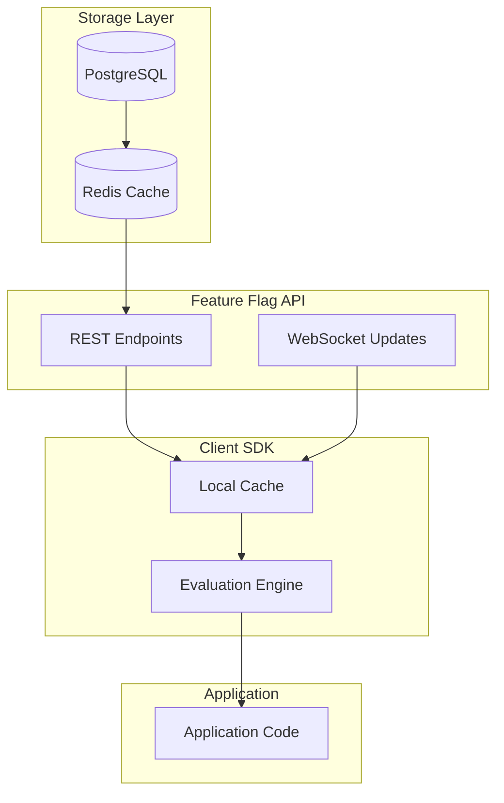
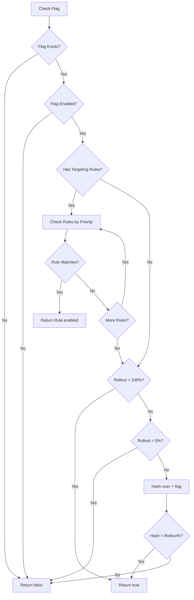

# How to Build Feature Toggle Implementation

Author: [nawazdhandala](https://github.com/nawazdhandala)

Tags: Feature Toggles, Software Engineering, DevOps, Deployment

Description: Build a production-ready feature toggle system from scratch with targeting rules, percentage rollouts, and real-time updates. Includes TypeScript and Python implementations.

---

Feature toggles (also called feature flags) let you enable or disable functionality without deploying new code. They are essential for continuous delivery, A/B testing, and gradual rollouts. This guide walks you through building a complete feature toggle system that you can run in production.

## Why Build Your Own?

Third-party feature flag services work well, but building your own makes sense when:

- You need complete control over your data
- You want to avoid vendor lock-in
- Your organization has strict compliance requirements
- You want to integrate deeply with your existing infrastructure

## Feature Toggle Architecture

A production feature toggle system has three main components: a storage backend for flag definitions, an evaluation engine for determining flag values, and an SDK for application integration.



## Database Schema

Start with a schema that supports boolean flags, percentage rollouts, and user targeting. This schema uses PostgreSQL but works with any relational database.

```sql
-- Feature flags table stores flag definitions and default values
CREATE TABLE feature_flags (
    id UUID PRIMARY KEY DEFAULT gen_random_uuid(),
    key VARCHAR(255) UNIQUE NOT NULL,
    name VARCHAR(255) NOT NULL,
    description TEXT,
    enabled BOOLEAN DEFAULT false,
    -- Percentage of users who should see this flag (0-100)
    rollout_percentage INTEGER DEFAULT 100 CHECK (rollout_percentage >= 0 AND rollout_percentage <= 100),
    created_at TIMESTAMP WITH TIME ZONE DEFAULT NOW(),
    updated_at TIMESTAMP WITH TIME ZONE DEFAULT NOW()
);

-- Targeting rules allow enabling flags for specific users or groups
CREATE TABLE targeting_rules (
    id UUID PRIMARY KEY DEFAULT gen_random_uuid(),
    flag_id UUID REFERENCES feature_flags(id) ON DELETE CASCADE,
    -- Rule type: 'user', 'group', 'attribute'
    rule_type VARCHAR(50) NOT NULL,
    -- The value to match against (user_id, group_name, etc.)
    rule_value VARCHAR(255) NOT NULL,
    -- Whether matching users should see the flag
    enabled BOOLEAN DEFAULT true,
    priority INTEGER DEFAULT 0,
    created_at TIMESTAMP WITH TIME ZONE DEFAULT NOW()
);

-- Audit log tracks all flag changes
CREATE TABLE flag_audit_log (
    id UUID PRIMARY KEY DEFAULT gen_random_uuid(),
    flag_id UUID REFERENCES feature_flags(id) ON DELETE SET NULL,
    flag_key VARCHAR(255) NOT NULL,
    action VARCHAR(50) NOT NULL,
    old_value JSONB,
    new_value JSONB,
    changed_by VARCHAR(255),
    changed_at TIMESTAMP WITH TIME ZONE DEFAULT NOW()
);

-- Index for fast lookups by flag key
CREATE INDEX idx_feature_flags_key ON feature_flags(key);
CREATE INDEX idx_targeting_rules_flag_id ON targeting_rules(flag_id);
CREATE INDEX idx_audit_log_flag_id ON flag_audit_log(flag_id);
```

## Feature Flag API (TypeScript)

The API layer handles flag CRUD operations and serves flag values to SDKs. This implementation uses Express and includes caching with Redis.

```typescript
import express, { Request, Response, NextFunction } from 'express';
import { Pool } from 'pg';
import Redis from 'ioredis';
import { createHash } from 'crypto';

// Configuration interface for the feature flag service
interface FeatureFlagConfig {
  databaseUrl: string;
  redisUrl: string;
  cacheExpirySeconds: number;
}

// Structure of a feature flag
interface FeatureFlag {
  id: string;
  key: string;
  name: string;
  description: string;
  enabled: boolean;
  rolloutPercentage: number;
}

// Structure of a targeting rule
interface TargetingRule {
  id: string;
  flagId: string;
  ruleType: 'user' | 'group' | 'attribute';
  ruleValue: string;
  enabled: boolean;
  priority: number;
}

// Context passed when evaluating a flag for a specific user
interface EvaluationContext {
  userId?: string;
  groups?: string[];
  attributes?: Record<string, string>;
}

class FeatureFlagService {
  private db: Pool;
  private redis: Redis;
  private cacheExpiry: number;

  constructor(config: FeatureFlagConfig) {
    this.db = new Pool({ connectionString: config.databaseUrl });
    this.redis = new Redis(config.redisUrl);
    this.cacheExpiry = config.cacheExpirySeconds;
  }

  // Get a flag from cache or database
  async getFlag(key: string): Promise<FeatureFlag | null> {
    const cacheKey = `flag:${key}`;

    // Try cache first
    const cached = await this.redis.get(cacheKey);
    if (cached) {
      return JSON.parse(cached);
    }

    // Fall back to database
    const result = await this.db.query(
      'SELECT * FROM feature_flags WHERE key = $1',
      [key]
    );

    if (result.rows.length === 0) {
      return null;
    }

    const flag = this.mapRowToFlag(result.rows[0]);

    // Cache the result
    await this.redis.setex(cacheKey, this.cacheExpiry, JSON.stringify(flag));

    return flag;
  }

  // Get all targeting rules for a flag
  async getTargetingRules(flagId: string): Promise<TargetingRule[]> {
    const cacheKey = `rules:${flagId}`;

    const cached = await this.redis.get(cacheKey);
    if (cached) {
      return JSON.parse(cached);
    }

    const result = await this.db.query(
      'SELECT * FROM targeting_rules WHERE flag_id = $1 ORDER BY priority DESC',
      [flagId]
    );

    const rules = result.rows.map(this.mapRowToRule);
    await this.redis.setex(cacheKey, this.cacheExpiry, JSON.stringify(rules));

    return rules;
  }

  // Evaluate a flag for a given context
  async evaluate(key: string, context: EvaluationContext): Promise<boolean> {
    const flag = await this.getFlag(key);

    // Flag does not exist, return false
    if (!flag) {
      return false;
    }

    // Flag is globally disabled
    if (!flag.enabled) {
      return false;
    }

    // Check targeting rules first (they override percentage rollout)
    const rules = await this.getTargetingRules(flag.id);

    for (const rule of rules) {
      const matches = this.matchesRule(rule, context);
      if (matches) {
        return rule.enabled;
      }
    }

    // No targeting rules matched, use percentage rollout
    if (flag.rolloutPercentage === 100) {
      return true;
    }

    if (flag.rolloutPercentage === 0) {
      return false;
    }

    // Determine if user falls within rollout percentage
    // Uses consistent hashing so the same user always gets the same result
    return this.isInRollout(key, context.userId || 'anonymous', flag.rolloutPercentage);
  }

  // Check if a targeting rule matches the context
  private matchesRule(rule: TargetingRule, context: EvaluationContext): boolean {
    switch (rule.ruleType) {
      case 'user':
        return context.userId === rule.ruleValue;
      case 'group':
        return context.groups?.includes(rule.ruleValue) || false;
      case 'attribute':
        // Rule value format: "key=value"
        const [attrKey, attrValue] = rule.ruleValue.split('=');
        return context.attributes?.[attrKey] === attrValue;
      default:
        return false;
    }
  }

  // Consistent hashing for percentage rollout
  // Same user + flag combination always produces same result
  private isInRollout(flagKey: string, userId: string, percentage: number): boolean {
    const hash = createHash('md5')
      .update(`${flagKey}:${userId}`)
      .digest('hex');

    // Convert first 8 hex characters to a number (0 to 4294967295)
    const hashInt = parseInt(hash.substring(0, 8), 16);

    // Normalize to 0-100 range
    const bucket = (hashInt / 0xffffffff) * 100;

    return bucket < percentage;
  }

  // Create a new feature flag
  async createFlag(data: Omit<FeatureFlag, 'id'>): Promise<FeatureFlag> {
    const result = await this.db.query(
      `INSERT INTO feature_flags (key, name, description, enabled, rollout_percentage)
       VALUES ($1, $2, $3, $4, $5)
       RETURNING *`,
      [data.key, data.name, data.description, data.enabled, data.rolloutPercentage]
    );

    const flag = this.mapRowToFlag(result.rows[0]);

    // Invalidate cache
    await this.redis.del(`flag:${data.key}`);

    // Log the change
    await this.logChange(flag.id, flag.key, 'create', null, flag);

    return flag;
  }

  // Update an existing flag
  async updateFlag(key: string, updates: Partial<FeatureFlag>): Promise<FeatureFlag | null> {
    const existing = await this.getFlag(key);
    if (!existing) {
      return null;
    }

    const result = await this.db.query(
      `UPDATE feature_flags
       SET name = COALESCE($1, name),
           description = COALESCE($2, description),
           enabled = COALESCE($3, enabled),
           rollout_percentage = COALESCE($4, rollout_percentage),
           updated_at = NOW()
       WHERE key = $5
       RETURNING *`,
      [updates.name, updates.description, updates.enabled, updates.rolloutPercentage, key]
    );

    const flag = this.mapRowToFlag(result.rows[0]);

    // Invalidate cache
    await this.redis.del(`flag:${key}`);

    // Log the change
    await this.logChange(flag.id, flag.key, 'update', existing, flag);

    return flag;
  }

  // Log flag changes for audit trail
  private async logChange(
    flagId: string,
    flagKey: string,
    action: string,
    oldValue: FeatureFlag | null,
    newValue: FeatureFlag | null
  ): Promise<void> {
    await this.db.query(
      `INSERT INTO flag_audit_log (flag_id, flag_key, action, old_value, new_value)
       VALUES ($1, $2, $3, $4, $5)`,
      [flagId, flagKey, action, JSON.stringify(oldValue), JSON.stringify(newValue)]
    );
  }

  // Map database row to FeatureFlag object
  private mapRowToFlag(row: any): FeatureFlag {
    return {
      id: row.id,
      key: row.key,
      name: row.name,
      description: row.description,
      enabled: row.enabled,
      rolloutPercentage: row.rollout_percentage,
    };
  }

  // Map database row to TargetingRule object
  private mapRowToRule(row: any): TargetingRule {
    return {
      id: row.id,
      flagId: row.flag_id,
      ruleType: row.rule_type,
      ruleValue: row.rule_value,
      enabled: row.enabled,
      priority: row.priority,
    };
  }
}

// Express API setup
const app = express();
app.use(express.json());

const flagService = new FeatureFlagService({
  databaseUrl: process.env.DATABASE_URL || 'postgresql://localhost/features',
  redisUrl: process.env.REDIS_URL || 'redis://localhost:6379',
  cacheExpirySeconds: 60,
});

// Evaluate a flag for a user
app.post('/api/flags/:key/evaluate', async (req: Request, res: Response) => {
  try {
    const { key } = req.params;
    const context: EvaluationContext = req.body;

    const result = await flagService.evaluate(key, context);

    res.json({ key, enabled: result });
  } catch (error) {
    console.error('Evaluation error:', error);
    res.status(500).json({ error: 'Internal server error' });
  }
});

// Get all flags (for admin UI)
app.get('/api/flags', async (req: Request, res: Response) => {
  try {
    const result = await flagService['db'].query(
      'SELECT * FROM feature_flags ORDER BY created_at DESC'
    );
    res.json(result.rows.map((row: any) => flagService['mapRowToFlag'](row)));
  } catch (error) {
    console.error('List flags error:', error);
    res.status(500).json({ error: 'Internal server error' });
  }
});

// Create a new flag
app.post('/api/flags', async (req: Request, res: Response) => {
  try {
    const flag = await flagService.createFlag(req.body);
    res.status(201).json(flag);
  } catch (error) {
    console.error('Create flag error:', error);
    res.status(500).json({ error: 'Internal server error' });
  }
});

// Update a flag
app.patch('/api/flags/:key', async (req: Request, res: Response) => {
  try {
    const flag = await flagService.updateFlag(req.params.key, req.body);
    if (!flag) {
      res.status(404).json({ error: 'Flag not found' });
      return;
    }
    res.json(flag);
  } catch (error) {
    console.error('Update flag error:', error);
    res.status(500).json({ error: 'Internal server error' });
  }
});

app.listen(3000, () => {
  console.log('Feature flag service running on port 3000');
});
```

## Client SDK (TypeScript)

The SDK runs in your application and provides a simple interface for checking flags. It includes local caching to avoid network calls on every evaluation.

```typescript
import { createHash } from 'crypto';

// Configuration for the SDK
interface SDKConfig {
  apiUrl: string;
  apiKey: string;
  refreshIntervalMs: number;
  defaultContext?: EvaluationContext;
}

interface EvaluationContext {
  userId?: string;
  groups?: string[];
  attributes?: Record<string, string>;
}

interface CachedFlag {
  key: string;
  enabled: boolean;
  rolloutPercentage: number;
  rules: TargetingRule[];
  fetchedAt: number;
}

interface TargetingRule {
  ruleType: 'user' | 'group' | 'attribute';
  ruleValue: string;
  enabled: boolean;
  priority: number;
}

class FeatureFlagClient {
  private config: SDKConfig;
  private cache: Map<string, CachedFlag> = new Map();
  private refreshTimer: NodeJS.Timeout | null = null;
  private defaultContext: EvaluationContext;

  constructor(config: SDKConfig) {
    this.config = config;
    this.defaultContext = config.defaultContext || {};

    // Start background refresh
    this.startRefresh();
  }

  // Check if a flag is enabled for the current context
  async isEnabled(key: string, context?: EvaluationContext): Promise<boolean> {
    const mergedContext = { ...this.defaultContext, ...context };

    // Try local evaluation first
    const cached = this.cache.get(key);
    if (cached) {
      return this.evaluateLocally(cached, mergedContext);
    }

    // Fetch from server
    try {
      const response = await fetch(`${this.config.apiUrl}/api/flags/${key}/evaluate`, {
        method: 'POST',
        headers: {
          'Content-Type': 'application/json',
          'Authorization': `Bearer ${this.config.apiKey}`,
        },
        body: JSON.stringify(mergedContext),
      });

      if (!response.ok) {
        console.error(`Flag evaluation failed: ${response.status}`);
        return false;
      }

      const data = await response.json();
      return data.enabled;
    } catch (error) {
      console.error('Flag evaluation error:', error);
      return false;
    }
  }

  // Synchronous check using only cached data
  // Returns false if flag is not in cache
  isEnabledSync(key: string, context?: EvaluationContext): boolean {
    const mergedContext = { ...this.defaultContext, ...context };
    const cached = this.cache.get(key);

    if (!cached) {
      return false;
    }

    return this.evaluateLocally(cached, mergedContext);
  }

  // Fetch all flags and populate the cache
  async refresh(): Promise<void> {
    try {
      const response = await fetch(`${this.config.apiUrl}/api/flags/all`, {
        headers: {
          'Authorization': `Bearer ${this.config.apiKey}`,
        },
      });

      if (!response.ok) {
        throw new Error(`Refresh failed: ${response.status}`);
      }

      const flags = await response.json();

      for (const flag of flags) {
        this.cache.set(flag.key, {
          key: flag.key,
          enabled: flag.enabled,
          rolloutPercentage: flag.rolloutPercentage,
          rules: flag.rules || [],
          fetchedAt: Date.now(),
        });
      }
    } catch (error) {
      console.error('Flag refresh error:', error);
    }
  }

  // Evaluate a flag locally using cached data
  private evaluateLocally(flag: CachedFlag, context: EvaluationContext): boolean {
    if (!flag.enabled) {
      return false;
    }

    // Check targeting rules
    for (const rule of flag.rules.sort((a, b) => b.priority - a.priority)) {
      if (this.matchesRule(rule, context)) {
        return rule.enabled;
      }
    }

    // Use percentage rollout
    if (flag.rolloutPercentage === 100) {
      return true;
    }

    if (flag.rolloutPercentage === 0) {
      return false;
    }

    return this.isInRollout(flag.key, context.userId || 'anonymous', flag.rolloutPercentage);
  }

  private matchesRule(rule: TargetingRule, context: EvaluationContext): boolean {
    switch (rule.ruleType) {
      case 'user':
        return context.userId === rule.ruleValue;
      case 'group':
        return context.groups?.includes(rule.ruleValue) || false;
      case 'attribute':
        const [attrKey, attrValue] = rule.ruleValue.split('=');
        return context.attributes?.[attrKey] === attrValue;
      default:
        return false;
    }
  }

  private isInRollout(flagKey: string, userId: string, percentage: number): boolean {
    const hash = createHash('md5')
      .update(`${flagKey}:${userId}`)
      .digest('hex');
    const hashInt = parseInt(hash.substring(0, 8), 16);
    const bucket = (hashInt / 0xffffffff) * 100;
    return bucket < percentage;
  }

  private startRefresh(): void {
    // Initial fetch
    this.refresh();

    // Periodic refresh
    this.refreshTimer = setInterval(() => {
      this.refresh();
    }, this.config.refreshIntervalMs);
  }

  // Clean up when done
  close(): void {
    if (this.refreshTimer) {
      clearInterval(this.refreshTimer);
    }
  }
}

// Usage example
async function main() {
  const client = new FeatureFlagClient({
    apiUrl: 'http://localhost:3000',
    apiKey: 'your-api-key',
    refreshIntervalMs: 30000, // Refresh every 30 seconds
    defaultContext: {
      attributes: {
        environment: 'production',
      },
    },
  });

  // Wait for initial cache population
  await client.refresh();

  // Check flags in your application code
  const userId = 'user-123';

  if (await client.isEnabled('new-checkout-flow', { userId })) {
    console.log('Showing new checkout flow');
  } else {
    console.log('Showing old checkout flow');
  }

  // Synchronous check (uses cached data only)
  if (client.isEnabledSync('dark-mode', { userId })) {
    console.log('Dark mode enabled');
  }
}
```

## Python SDK Implementation

For Python applications, here is an equivalent SDK implementation with async support.

```python
import hashlib
import asyncio
from typing import Optional, Dict, List, Any
from dataclasses import dataclass
from datetime import datetime
import aiohttp


@dataclass
class TargetingRule:
    rule_type: str  # 'user', 'group', 'attribute'
    rule_value: str
    enabled: bool
    priority: int


@dataclass
class CachedFlag:
    key: str
    enabled: bool
    rollout_percentage: int
    rules: List[TargetingRule]
    fetched_at: datetime


@dataclass
class EvaluationContext:
    user_id: Optional[str] = None
    groups: Optional[List[str]] = None
    attributes: Optional[Dict[str, str]] = None


class FeatureFlagClient:
    """
    Feature flag client that supports local evaluation with background refresh.

    Usage:
        client = FeatureFlagClient(
            api_url="http://localhost:3000",
            api_key="your-api-key",
            refresh_interval_seconds=30
        )
        await client.start()

        if await client.is_enabled("new-feature", EvaluationContext(user_id="123")):
            # Show new feature
            pass
    """

    def __init__(
        self,
        api_url: str,
        api_key: str,
        refresh_interval_seconds: int = 30,
        default_context: Optional[EvaluationContext] = None
    ):
        self.api_url = api_url.rstrip('/')
        self.api_key = api_key
        self.refresh_interval = refresh_interval_seconds
        self.default_context = default_context or EvaluationContext()
        self._cache: Dict[str, CachedFlag] = {}
        self._refresh_task: Optional[asyncio.Task] = None
        self._session: Optional[aiohttp.ClientSession] = None

    async def start(self) -> None:
        """Initialize the client and start background refresh."""
        self._session = aiohttp.ClientSession(
            headers={"Authorization": f"Bearer {self.api_key}"}
        )
        await self.refresh()
        self._refresh_task = asyncio.create_task(self._background_refresh())

    async def close(self) -> None:
        """Clean up resources."""
        if self._refresh_task:
            self._refresh_task.cancel()
            try:
                await self._refresh_task
            except asyncio.CancelledError:
                pass
        if self._session:
            await self._session.close()

    async def is_enabled(
        self,
        key: str,
        context: Optional[EvaluationContext] = None
    ) -> bool:
        """
        Check if a feature flag is enabled for the given context.
        Uses local cache when available, falls back to API call.
        """
        merged_context = self._merge_context(context)

        # Try local evaluation first
        cached = self._cache.get(key)
        if cached:
            return self._evaluate_locally(cached, merged_context)

        # Fall back to API
        return await self._evaluate_remote(key, merged_context)

    def is_enabled_sync(
        self,
        key: str,
        context: Optional[EvaluationContext] = None
    ) -> bool:
        """
        Synchronously check if a flag is enabled using only cached data.
        Returns False if the flag is not in cache.
        """
        merged_context = self._merge_context(context)
        cached = self._cache.get(key)

        if not cached:
            return False

        return self._evaluate_locally(cached, merged_context)

    async def refresh(self) -> None:
        """Fetch all flags from the server and update the local cache."""
        if not self._session:
            return

        try:
            async with self._session.get(f"{self.api_url}/api/flags/all") as response:
                if response.status != 200:
                    print(f"Flag refresh failed: {response.status}")
                    return

                flags = await response.json()

                for flag in flags:
                    rules = [
                        TargetingRule(
                            rule_type=r["ruleType"],
                            rule_value=r["ruleValue"],
                            enabled=r["enabled"],
                            priority=r["priority"]
                        )
                        for r in flag.get("rules", [])
                    ]

                    self._cache[flag["key"]] = CachedFlag(
                        key=flag["key"],
                        enabled=flag["enabled"],
                        rollout_percentage=flag["rolloutPercentage"],
                        rules=rules,
                        fetched_at=datetime.now()
                    )
        except Exception as e:
            print(f"Flag refresh error: {e}")

    def _merge_context(self, context: Optional[EvaluationContext]) -> EvaluationContext:
        """Merge provided context with default context."""
        if not context:
            return self.default_context

        return EvaluationContext(
            user_id=context.user_id or self.default_context.user_id,
            groups=(context.groups or []) + (self.default_context.groups or []),
            attributes={
                **(self.default_context.attributes or {}),
                **(context.attributes or {})
            }
        )

    def _evaluate_locally(self, flag: CachedFlag, context: EvaluationContext) -> bool:
        """Evaluate a flag using cached data."""
        if not flag.enabled:
            return False

        # Check targeting rules (sorted by priority, highest first)
        sorted_rules = sorted(flag.rules, key=lambda r: r.priority, reverse=True)

        for rule in sorted_rules:
            if self._matches_rule(rule, context):
                return rule.enabled

        # Use percentage rollout
        if flag.rollout_percentage == 100:
            return True
        if flag.rollout_percentage == 0:
            return False

        return self._is_in_rollout(
            flag.key,
            context.user_id or "anonymous",
            flag.rollout_percentage
        )

    def _matches_rule(self, rule: TargetingRule, context: EvaluationContext) -> bool:
        """Check if a targeting rule matches the evaluation context."""
        if rule.rule_type == "user":
            return context.user_id == rule.rule_value

        if rule.rule_type == "group":
            return rule.rule_value in (context.groups or [])

        if rule.rule_type == "attribute":
            key, value = rule.rule_value.split("=", 1)
            return (context.attributes or {}).get(key) == value

        return False

    def _is_in_rollout(self, flag_key: str, user_id: str, percentage: int) -> bool:
        """
        Determine if a user falls within a percentage rollout.
        Uses consistent hashing for stable assignment.
        """
        hash_input = f"{flag_key}:{user_id}".encode()
        hash_hex = hashlib.md5(hash_input).hexdigest()

        # Convert first 8 hex characters to integer
        hash_int = int(hash_hex[:8], 16)

        # Normalize to 0-100
        bucket = (hash_int / 0xFFFFFFFF) * 100

        return bucket < percentage

    async def _evaluate_remote(self, key: str, context: EvaluationContext) -> bool:
        """Evaluate a flag by calling the API."""
        if not self._session:
            return False

        try:
            payload = {
                "userId": context.user_id,
                "groups": context.groups,
                "attributes": context.attributes
            }

            async with self._session.post(
                f"{self.api_url}/api/flags/{key}/evaluate",
                json=payload
            ) as response:
                if response.status != 200:
                    return False
                data = await response.json()
                return data.get("enabled", False)
        except Exception as e:
            print(f"Remote evaluation error: {e}")
            return False

    async def _background_refresh(self) -> None:
        """Background task that periodically refreshes the flag cache."""
        while True:
            await asyncio.sleep(self.refresh_interval)
            await self.refresh()


# Usage example
async def main():
    client = FeatureFlagClient(
        api_url="http://localhost:3000",
        api_key="your-api-key",
        refresh_interval_seconds=30,
        default_context=EvaluationContext(
            attributes={"environment": "production"}
        )
    )

    await client.start()

    try:
        user_context = EvaluationContext(user_id="user-123")

        if await client.is_enabled("new-checkout-flow", user_context):
            print("Showing new checkout flow")
        else:
            print("Showing old checkout flow")

        # Synchronous check using cached data
        if client.is_enabled_sync("dark-mode", user_context):
            print("Dark mode enabled")
    finally:
        await client.close()


if __name__ == "__main__":
    asyncio.run(main())
```

## Evaluation Flow

When your application checks a feature flag, the evaluation follows this decision tree:



## Real-time Updates with WebSockets

For applications that need immediate flag updates without polling, add WebSocket support. This implementation broadcasts flag changes to all connected clients.

```typescript
import WebSocket, { WebSocketServer } from 'ws';
import { EventEmitter } from 'events';

// Event emitter for flag changes
const flagEvents = new EventEmitter();

// WebSocket server for real-time updates
const wss = new WebSocketServer({ port: 8080 });

// Track connected clients by their subscription patterns
const clients = new Map<WebSocket, Set<string>>();

wss.on('connection', (ws: WebSocket) => {
  // Initialize client with empty subscriptions
  clients.set(ws, new Set());

  ws.on('message', (data: Buffer) => {
    try {
      const message = JSON.parse(data.toString());

      // Handle subscription requests
      if (message.type === 'subscribe') {
        const subscriptions = clients.get(ws);
        if (subscriptions) {
          // Subscribe to specific flags or '*' for all
          for (const key of message.keys) {
            subscriptions.add(key);
          }
        }
      }

      // Handle unsubscribe requests
      if (message.type === 'unsubscribe') {
        const subscriptions = clients.get(ws);
        if (subscriptions) {
          for (const key of message.keys) {
            subscriptions.delete(key);
          }
        }
      }
    } catch (error) {
      console.error('WebSocket message error:', error);
    }
  });

  ws.on('close', () => {
    clients.delete(ws);
  });
});

// Broadcast flag updates to subscribed clients
flagEvents.on('flagUpdated', (flag: { key: string; enabled: boolean }) => {
  const message = JSON.stringify({
    type: 'flagUpdate',
    key: flag.key,
    enabled: flag.enabled,
    timestamp: Date.now(),
  });

  for (const [ws, subscriptions] of clients) {
    // Send if client subscribed to this flag or all flags
    if (subscriptions.has(flag.key) || subscriptions.has('*')) {
      if (ws.readyState === WebSocket.OPEN) {
        ws.send(message);
      }
    }
  }
});

// Call this when a flag is updated in the API
function notifyFlagUpdate(flag: { key: string; enabled: boolean }): void {
  flagEvents.emit('flagUpdated', flag);
}
```

## Production Best Practices

### 1. Always Have Defaults

Never let a flag evaluation crash your application. Set sensible defaults for when the flag service is unavailable.

```typescript
// Wrap flag checks with error handling and defaults
async function safeEvaluate(
  client: FeatureFlagClient,
  key: string,
  context: EvaluationContext,
  defaultValue: boolean = false
): Promise<boolean> {
  try {
    return await client.isEnabled(key, context);
  } catch (error) {
    console.error(`Flag evaluation failed for ${key}:`, error);
    return defaultValue;
  }
}
```

### 2. Use Circuit Breakers

Protect your application from cascading failures when the flag service is down.

```typescript
class CircuitBreaker {
  private failures = 0;
  private lastFailure = 0;
  private readonly threshold = 5;
  private readonly resetTimeout = 30000; // 30 seconds

  async execute<T>(fn: () => Promise<T>, fallback: T): Promise<T> {
    // Check if circuit is open
    if (this.failures >= this.threshold) {
      const now = Date.now();
      if (now - this.lastFailure < this.resetTimeout) {
        return fallback;
      }
      // Reset after timeout
      this.failures = 0;
    }

    try {
      const result = await fn();
      this.failures = 0;
      return result;
    } catch (error) {
      this.failures++;
      this.lastFailure = Date.now();
      return fallback;
    }
  }
}
```

### 3. Monitor Flag Usage

Track which flags are being evaluated and their results for debugging and analytics.

```typescript
interface FlagMetrics {
  key: string;
  evaluations: number;
  enabledCount: number;
  disabledCount: number;
  errorCount: number;
}

const metrics = new Map<string, FlagMetrics>();

function trackEvaluation(key: string, result: boolean, error: boolean = false): void {
  let flagMetrics = metrics.get(key);

  if (!flagMetrics) {
    flagMetrics = {
      key,
      evaluations: 0,
      enabledCount: 0,
      disabledCount: 0,
      errorCount: 0,
    };
    metrics.set(key, flagMetrics);
  }

  flagMetrics.evaluations++;

  if (error) {
    flagMetrics.errorCount++;
  } else if (result) {
    flagMetrics.enabledCount++;
  } else {
    flagMetrics.disabledCount++;
  }
}
```

### 4. Clean Up Stale Flags

Feature flags should be temporary. Remove them after the feature is fully rolled out.

```sql
-- Find flags that have been at 100% rollout for more than 30 days
SELECT key, name, updated_at
FROM feature_flags
WHERE enabled = true
  AND rollout_percentage = 100
  AND updated_at < NOW() - INTERVAL '30 days';
```

## Testing Feature Flags

Write tests that cover both flag states to ensure your application works correctly regardless of flag values.

```typescript
import { describe, it, expect, beforeEach, vi } from 'vitest';

// Mock the feature flag client
const mockClient = {
  isEnabled: vi.fn(),
};

describe('Checkout Flow', () => {
  beforeEach(() => {
    vi.clearAllMocks();
  });

  it('shows new checkout when flag is enabled', async () => {
    mockClient.isEnabled.mockResolvedValue(true);

    const result = await renderCheckout(mockClient);

    expect(result).toContain('new-checkout');
    expect(mockClient.isEnabled).toHaveBeenCalledWith(
      'new-checkout-flow',
      expect.any(Object)
    );
  });

  it('shows old checkout when flag is disabled', async () => {
    mockClient.isEnabled.mockResolvedValue(false);

    const result = await renderCheckout(mockClient);

    expect(result).toContain('old-checkout');
  });

  it('falls back to old checkout on error', async () => {
    mockClient.isEnabled.mockRejectedValue(new Error('Service unavailable'));

    const result = await renderCheckout(mockClient);

    expect(result).toContain('old-checkout');
  });
});
```

## Summary

Building a feature toggle system requires three core components: persistent storage for flag definitions, an evaluation engine that supports targeting rules and percentage rollouts, and client SDKs that cache flags locally for performance.

Key implementation details:

- Use consistent hashing for percentage rollouts so users get stable experiences
- Cache flags locally and refresh in the background to minimize latency
- Support targeting rules for beta testing with specific users or groups
- Log all flag changes for audit trails
- Build in graceful degradation when the flag service is unavailable

Start simple with boolean flags, then add percentage rollouts and targeting as your needs grow. The architecture in this guide scales from a single application to hundreds of services evaluating millions of flags.
