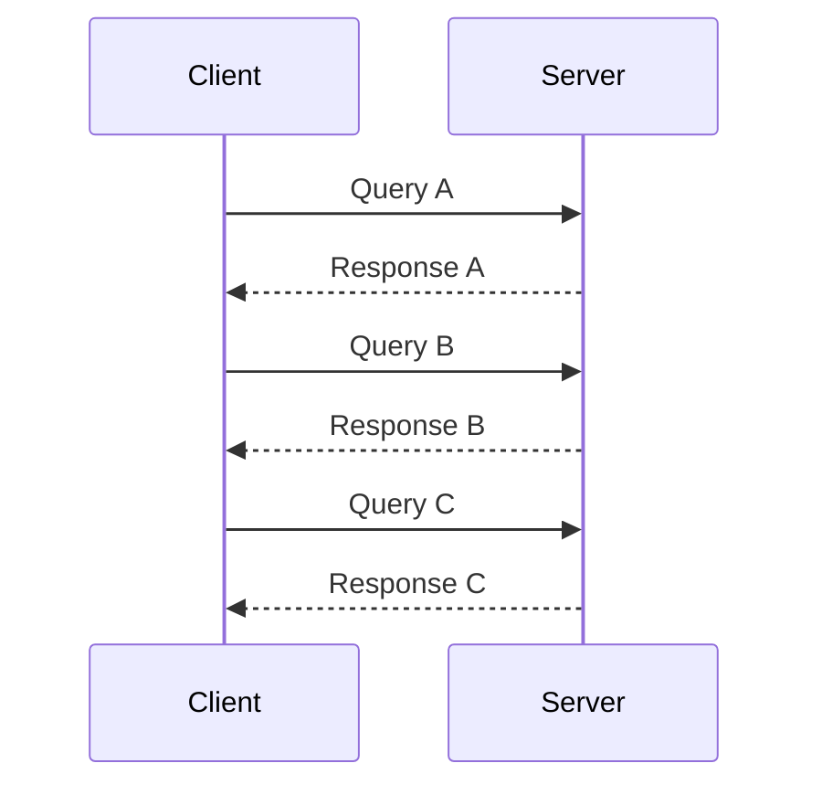
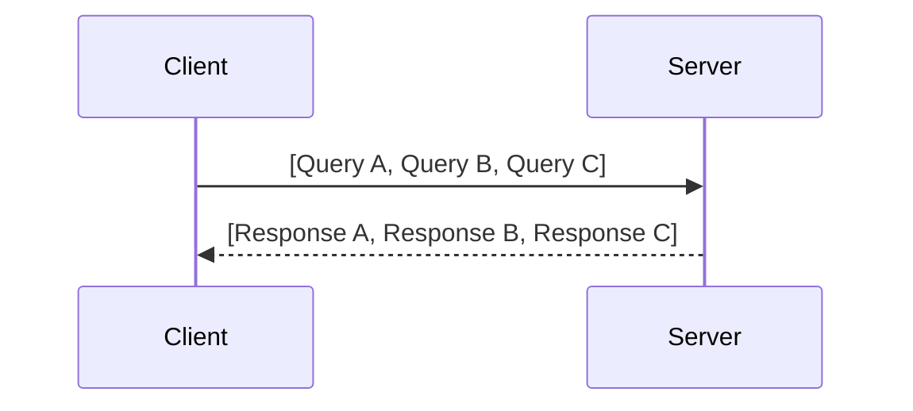
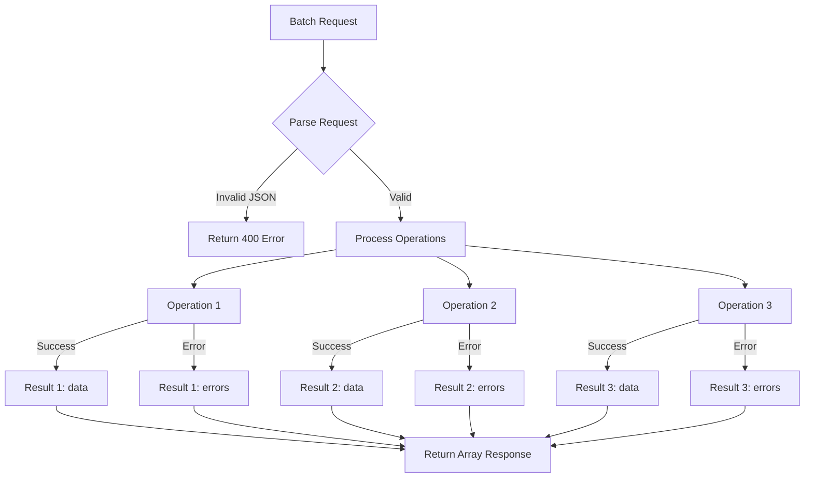

# How to Build GraphQL Batching

Author: [nawazdhandala](https://github.com/nawazdhandala)

Tags: GraphQL, NodeJS, Performance, API, Backend, TypeScript

Description: Learn how to implement GraphQL query batching to reduce network overhead, improve performance, and handle multiple operations efficiently in production applications.

---

GraphQL batching is a technique that combines multiple GraphQL operations into a single HTTP request. Instead of sending separate requests for each query or mutation, you bundle them together and send them as an array. The server processes all operations and returns an array of responses in the same order.

This approach reduces network round trips, lowers connection overhead, and improves the perceived performance of your application. It is especially useful for mobile clients on high-latency networks or for pages that need to fetch data from multiple sources simultaneously.

## Table of Contents

1. What is GraphQL Batching
2. When to Use Batching
3. Client-Side Implementation
4. Server-Side Implementation
5. Building a Custom Batch Transport
6. Error Handling in Batched Requests
7. Rate Limiting Batched Requests
8. Monitoring and Observability
9. Production Considerations
10. Complete Working Example

---

## 1. What is GraphQL Batching

In a typical GraphQL setup, each operation triggers a separate HTTP request:



With batching, you combine these into a single request:



The request payload changes from a single operation object to an array of operation objects:

Without batching (single query):
```json
{
  "query": "query GetUser($id: ID!) { user(id: $id) { name email } }",
  "variables": { "id": "123" }
}
```

With batching (multiple queries):
```json
[
  {
    "query": "query GetUser($id: ID!) { user(id: $id) { name email } }",
    "variables": { "id": "123" }
  },
  {
    "query": "query GetPosts($userId: ID!) { posts(userId: $userId) { title } }",
    "variables": { "userId": "123" }
  },
  {
    "query": "query GetNotifications { notifications { message read } }",
    "variables": {}
  }
]
```

The server processes each operation and returns responses in the same order:

```json
[
  { "data": { "user": { "name": "Alice", "email": "alice@example.com" } } },
  { "data": { "posts": [{ "title": "First Post" }, { "title": "Second Post" }] } },
  { "data": { "notifications": [{ "message": "Welcome!", "read": false }] } }
]
```

---

## 2. When to Use Batching

Batching is most effective in these scenarios:

**Good use cases:**
- Page loads that require data from multiple independent sources
- Mobile applications where network latency is high
- Dashboard views with many widgets fetching separate data
- Prefetching data for upcoming navigation

**When to avoid batching:**
- Real-time subscriptions (use WebSocket instead)
- Single isolated queries
- When you need to abort individual requests
- When response times vary significantly between queries (one slow query blocks all responses)

---

## 3. Client-Side Implementation

### Using Apollo Client

Apollo Client supports batching through the `@apollo/client/link/batch-http` package. The BatchHttpLink collects operations over a configurable time window and sends them together.

Install the required package:

```bash
npm install @apollo/client graphql
```

Configure the Apollo Client with batch link. The batchMax option limits how many operations to include in one batch, and batchInterval sets the collection window in milliseconds.

```typescript
import { ApolloClient, InMemoryCache, ApolloLink } from '@apollo/client';
import { BatchHttpLink } from '@apollo/client/link/batch-http';

// Create a batch link that groups operations
// - batchMax: Maximum operations per batch (prevents oversized requests)
// - batchInterval: Time window to collect operations (10ms is a good default)
const batchLink = new BatchHttpLink({
  uri: 'https://api.example.com/graphql',
  batchMax: 10,
  batchInterval: 10,
  headers: {
    authorization: `Bearer ${getAuthToken()}`,
  },
});

// Initialize client with batch link
const client = new ApolloClient({
  link: batchLink,
  cache: new InMemoryCache(),
});

export default client;
```

Now any queries executed within the batch interval window automatically combine into a single request:

```typescript
import { useQuery, gql } from '@apollo/client';

const GET_USER = gql`
  query GetUser($id: ID!) {
    user(id: $id) {
      name
      email
    }
  }
`;

const GET_USER_POSTS = gql`
  query GetUserPosts($userId: ID!) {
    posts(userId: $userId) {
      id
      title
      createdAt
    }
  }
`;

// These two queries fire in the same render cycle
// Apollo batches them into a single HTTP request
function UserProfile({ userId }: { userId: string }) {
  const { data: userData } = useQuery(GET_USER, { variables: { id: userId } });
  const { data: postsData } = useQuery(GET_USER_POSTS, { variables: { userId } });

  // Both queries arrive together since they were batched
  return (
    <div>
      <h1>{userData?.user?.name}</h1>
      <ul>
        {postsData?.posts?.map(post => (
          <li key={post.id}>{post.title}</li>
        ))}
      </ul>
    </div>
  );
}
```

### Using graphql-request with Manual Batching

For simpler setups or Node.js scripts, you can manually batch requests using `graphql-request`:

```typescript
import { GraphQLClient, gql } from 'graphql-request';

const client = new GraphQLClient('https://api.example.com/graphql');

// Define multiple operations to batch
const userQuery = gql`
  query GetUser($id: ID!) {
    user(id: $id) { name email }
  }
`;

const postsQuery = gql`
  query GetPosts($userId: ID!) {
    posts(userId: $userId) { title }
  }
`;

// Execute batch request by sending an array of operations
// The server must support batch queries for this to work
async function fetchUserWithPosts(userId: string) {
  const response = await fetch('https://api.example.com/graphql', {
    method: 'POST',
    headers: {
      'Content-Type': 'application/json',
    },
    body: JSON.stringify([
      { query: userQuery, variables: { id: userId } },
      { query: postsQuery, variables: { userId } },
    ]),
  });

  const [userResult, postsResult] = await response.json();

  return {
    user: userResult.data.user,
    posts: postsResult.data.posts,
  };
}
```

---

## 4. Server-Side Implementation

### Express with Apollo Server

Apollo Server 4 supports batching by default. You just need to ensure your server handles array payloads correctly.

Install dependencies:

```bash
npm install @apollo/server express graphql cors
```

Set up a basic server that accepts batched requests. Apollo Server automatically detects array payloads and processes each operation.

```typescript
import express from 'express';
import cors from 'cors';
import { ApolloServer } from '@apollo/server';
import { expressMiddleware } from '@apollo/server/express4';

// Define your schema
const typeDefs = `#graphql
  type User {
    id: ID!
    name: String!
    email: String!
  }

  type Post {
    id: ID!
    title: String!
    content: String!
    authorId: ID!
  }

  type Notification {
    id: ID!
    message: String!
    read: Boolean!
  }

  type Query {
    user(id: ID!): User
    posts(userId: ID!): [Post!]!
    notifications: [Notification!]!
  }
`;

// Mock data for demonstration
const users = [
  { id: '1', name: 'Alice', email: 'alice@example.com' },
  { id: '2', name: 'Bob', email: 'bob@example.com' },
];

const posts = [
  { id: '1', title: 'GraphQL Basics', content: '...', authorId: '1' },
  { id: '2', title: 'Advanced Batching', content: '...', authorId: '1' },
];

const notifications = [
  { id: '1', message: 'Welcome!', read: false },
  { id: '2', message: 'New follower', read: true },
];

// Define resolvers that handle each query
const resolvers = {
  Query: {
    user: (_: unknown, { id }: { id: string }) =>
      users.find(u => u.id === id),

    posts: (_: unknown, { userId }: { userId: string }) =>
      posts.filter(p => p.authorId === userId),

    notifications: () => notifications,
  },
};

async function startServer() {
  const app = express();

  // Create Apollo Server instance
  const server = new ApolloServer({
    typeDefs,
    resolvers,
  });

  await server.start();

  // Apply middleware with CORS and JSON parsing
  // Apollo Server handles batched requests automatically
  app.use(
    '/graphql',
    cors(),
    express.json(),
    expressMiddleware(server)
  );

  app.listen(4000, () => {
    console.log('Server running at http://localhost:4000/graphql');
  });
}

startServer();
```

### Configuring Batch Limits

To prevent abuse, configure limits on batch size. This protects your server from requests with hundreds of operations.

```typescript
import { ApolloServer } from '@apollo/server';

const server = new ApolloServer({
  typeDefs,
  resolvers,
  // Limit the number of operations in a single batch
  // This prevents denial-of-service through oversized batches
  allowBatchedHttpRequests: true,
});
```

For more granular control, add custom middleware that validates batch size before Apollo processes the request:

```typescript
import express from 'express';

const app = express();

// Middleware to limit batch size
// Place this before the Apollo middleware
function batchLimitMiddleware(maxBatchSize: number) {
  return (req: express.Request, res: express.Response, next: express.NextFunction) => {
    // Check if request body is an array (batched request)
    if (Array.isArray(req.body)) {
      if (req.body.length > maxBatchSize) {
        return res.status(400).json({
          errors: [{
            message: `Batch size ${req.body.length} exceeds maximum allowed ${maxBatchSize}`,
            extensions: { code: 'BATCH_SIZE_EXCEEDED' },
          }],
        });
      }
    }
    next();
  };
}

app.use('/graphql', express.json(), batchLimitMiddleware(10), expressMiddleware(server));
```

---

## 5. Building a Custom Batch Transport

For advanced use cases, you might need a custom batching solution. This implementation gives you full control over timing, queue management, and execution.

```typescript
// BatchTransport.ts
// A custom batching layer that collects operations and dispatches them together

interface QueuedOperation {
  query: string;
  variables: Record<string, unknown>;
  resolve: (result: unknown) => void;
  reject: (error: Error) => void;
}

interface BatchTransportOptions {
  endpoint: string;
  maxBatchSize: number;    // Maximum operations per batch
  batchIntervalMs: number; // Time window to collect operations
  headers?: Record<string, string>;
}

export class BatchTransport {
  private queue: QueuedOperation[] = [];
  private timer: NodeJS.Timeout | null = null;
  private options: BatchTransportOptions;

  constructor(options: BatchTransportOptions) {
    this.options = options;
  }

  // Add an operation to the queue
  // Returns a promise that resolves when the batch executes
  execute(query: string, variables: Record<string, unknown> = {}): Promise<unknown> {
    return new Promise((resolve, reject) => {
      // Add operation to queue
      this.queue.push({ query, variables, resolve, reject });

      // Schedule batch dispatch if not already scheduled
      if (!this.timer) {
        this.timer = setTimeout(() => this.dispatch(), this.options.batchIntervalMs);
      }

      // If queue reaches max size, dispatch immediately
      if (this.queue.length >= this.options.maxBatchSize) {
        this.dispatch();
      }
    });
  }

  // Send all queued operations as a single request
  private async dispatch(): Promise<void> {
    // Clear the timer
    if (this.timer) {
      clearTimeout(this.timer);
      this.timer = null;
    }

    // Grab current queue and reset it
    const operations = this.queue;
    this.queue = [];

    if (operations.length === 0) return;

    try {
      // Build the batch payload
      const payload = operations.map(op => ({
        query: op.query,
        variables: op.variables,
      }));

      // Send batch request
      const response = await fetch(this.options.endpoint, {
        method: 'POST',
        headers: {
          'Content-Type': 'application/json',
          ...this.options.headers,
        },
        body: JSON.stringify(payload),
      });

      if (!response.ok) {
        throw new Error(`HTTP ${response.status}: ${response.statusText}`);
      }

      const results = await response.json();

      // Resolve each operation with its corresponding result
      // Results array order matches the request array order
      operations.forEach((op, index) => {
        const result = results[index];
        if (result.errors) {
          op.reject(new Error(result.errors[0]?.message || 'GraphQL Error'));
        } else {
          op.resolve(result.data);
        }
      });
    } catch (error) {
      // If the batch request fails, reject all operations
      operations.forEach(op => op.reject(error as Error));
    }
  }

  // Flush any pending operations immediately
  // Useful when navigating away or closing the app
  async flush(): Promise<void> {
    await this.dispatch();
  }
}
```

Using the custom transport:

```typescript
// Usage example
const transport = new BatchTransport({
  endpoint: 'https://api.example.com/graphql',
  maxBatchSize: 10,
  batchIntervalMs: 10,
  headers: {
    authorization: 'Bearer token123',
  },
});

// These three calls will be batched into one request
// since they occur within the 10ms window
async function loadDashboard() {
  const [user, posts, notifications] = await Promise.all([
    transport.execute('query { user(id: "1") { name } }'),
    transport.execute('query { posts(userId: "1") { title } }'),
    transport.execute('query { notifications { message } }'),
  ]);

  console.log({ user, posts, notifications });
}
```

---

## 6. Error Handling in Batched Requests

Batched requests require careful error handling because each operation in the batch can succeed or fail independently.



Server-side error handling should isolate failures to individual operations:

```typescript
// Error handling middleware for batched operations
// Each operation gets its own try-catch so one failure doesn't affect others

import { GraphQLError } from 'graphql';

interface BatchResult {
  data?: unknown;
  errors?: Array<{ message: string; extensions?: unknown }>;
}

async function executeBatch(
  operations: Array<{ query: string; variables: unknown }>,
  schema: any,
  context: any
): Promise<BatchResult[]> {
  // Process each operation independently
  // This ensures one failing query doesn't break the entire batch
  const results = await Promise.all(
    operations.map(async (operation, index) => {
      try {
        // Execute the individual operation
        const result = await executeOperation(schema, operation, context);
        return result;
      } catch (error) {
        // Wrap unexpected errors in a GraphQL-compatible format
        console.error(`Batch operation ${index} failed:`, error);
        return {
          data: null,
          errors: [{
            message: error instanceof Error ? error.message : 'Internal server error',
            extensions: {
              code: 'INTERNAL_SERVER_ERROR',
              operationIndex: index,
            },
          }],
        };
      }
    })
  );

  return results;
}
```

Client-side handling should check each result in the array:

```typescript
// Client-side batch result handler
// Check each result individually since some may succeed while others fail

interface GraphQLResult<T> {
  data?: T;
  errors?: Array<{ message: string; path?: string[] }>;
}

async function executeBatchedQueries<T extends unknown[]>(
  queries: Array<{ query: string; variables?: unknown }>
): Promise<T> {
  const response = await fetch('/graphql', {
    method: 'POST',
    headers: { 'Content-Type': 'application/json' },
    body: JSON.stringify(queries),
  });

  const results: GraphQLResult<unknown>[] = await response.json();

  // Process each result, collecting errors and data separately
  const processedResults = results.map((result, index) => {
    if (result.errors && result.errors.length > 0) {
      // Log errors but don't throw - let caller decide how to handle
      console.warn(`Query ${index} had errors:`, result.errors);
      // Return partial data if available, or null
      return result.data ?? null;
    }
    return result.data;
  });

  return processedResults as T;
}

// Usage with typed results
interface User { id: string; name: string; }
interface Post { id: string; title: string; }

const [user, posts] = await executeBatchedQueries<[User | null, Post[] | null]>([
  { query: 'query { user(id: "1") { id name } }' },
  { query: 'query { posts(userId: "1") { id title } }' },
]);

// Handle potentially null results from failed operations
if (user) {
  console.log(`Welcome, ${user.name}`);
}
```

---

## 7. Rate Limiting Batched Requests

When batching is enabled, traditional per-request rate limiting becomes less effective. A single batched request could contain dozens of operations. Implement operation-aware rate limiting.

```typescript
// Rate limiter that counts operations, not just requests
// This prevents abuse through large batches

import { Request, Response, NextFunction } from 'express';

interface RateLimitState {
  operationCount: number;
  windowStart: number;
}

const rateLimitStore = new Map<string, RateLimitState>();

interface RateLimitOptions {
  windowMs: number;           // Time window in milliseconds
  maxOperations: number;      // Max operations per window
  keyGenerator: (req: Request) => string;  // How to identify clients
}

export function operationRateLimit(options: RateLimitOptions) {
  const { windowMs, maxOperations, keyGenerator } = options;

  return (req: Request, res: Response, next: NextFunction) => {
    const key = keyGenerator(req);
    const now = Date.now();

    // Get or initialize client's rate limit state
    let state = rateLimitStore.get(key);
    if (!state || now - state.windowStart > windowMs) {
      state = { operationCount: 0, windowStart: now };
    }

    // Count operations in this request
    // Single operation = 1, batched = array length
    const operationCount = Array.isArray(req.body) ? req.body.length : 1;

    // Check if this request would exceed the limit
    if (state.operationCount + operationCount > maxOperations) {
      const retryAfter = Math.ceil((state.windowStart + windowMs - now) / 1000);
      res.set('Retry-After', String(retryAfter));
      return res.status(429).json({
        errors: [{
          message: `Rate limit exceeded. ${state.operationCount} operations used, ${operationCount} requested, ${maxOperations} allowed per ${windowMs / 1000}s`,
          extensions: { code: 'RATE_LIMITED', retryAfter },
        }],
      });
    }

    // Update operation count
    state.operationCount += operationCount;
    rateLimitStore.set(key, state);

    // Add rate limit headers for client visibility
    res.set({
      'X-RateLimit-Limit': String(maxOperations),
      'X-RateLimit-Remaining': String(maxOperations - state.operationCount),
      'X-RateLimit-Reset': String(Math.ceil((state.windowStart + windowMs) / 1000)),
    });

    next();
  };
}

// Apply to GraphQL endpoint
app.use(
  '/graphql',
  operationRateLimit({
    windowMs: 60 * 1000,     // 1 minute window
    maxOperations: 100,      // 100 operations per minute
    keyGenerator: (req) => req.ip || req.headers['x-forwarded-for'] as string || 'anonymous',
  }),
  expressMiddleware(server)
);
```

---

## 8. Monitoring and Observability

Track batching metrics to understand usage patterns and identify issues.

```typescript
// Metrics collection for batched GraphQL operations
// Track batch sizes, processing times, and error rates

import { Counter, Histogram, Gauge } from 'prom-client';

// Track total operations processed
const operationsTotal = new Counter({
  name: 'graphql_operations_total',
  help: 'Total GraphQL operations processed',
  labelNames: ['operation_name', 'status'],
});

// Track batch sizes
const batchSizeHistogram = new Histogram({
  name: 'graphql_batch_size',
  help: 'Number of operations per batch',
  buckets: [1, 2, 5, 10, 20, 50],
});

// Track operation execution time
const operationDuration = new Histogram({
  name: 'graphql_operation_duration_seconds',
  help: 'GraphQL operation execution time',
  labelNames: ['operation_name'],
  buckets: [0.01, 0.05, 0.1, 0.5, 1, 5],
});

// Track current batch queue depth
const queueDepth = new Gauge({
  name: 'graphql_batch_queue_depth',
  help: 'Current number of operations waiting in batch queue',
});

// Middleware to collect metrics
export function metricsMiddleware(req: Request, res: Response, next: NextFunction) {
  const startTime = Date.now();
  const isBatch = Array.isArray(req.body);
  const operationCount = isBatch ? req.body.length : 1;

  // Record batch size
  batchSizeHistogram.observe(operationCount);

  // Intercept response to capture status
  const originalJson = res.json.bind(res);
  res.json = (body: unknown) => {
    const duration = (Date.now() - startTime) / 1000;

    if (Array.isArray(body)) {
      // Batched response - record each operation
      body.forEach((result: any, index: number) => {
        const operationName = extractOperationName(req.body[index]?.query);
        const status = result.errors ? 'error' : 'success';
        operationsTotal.inc({ operation_name: operationName, status });
        operationDuration.observe({ operation_name: operationName }, duration / operationCount);
      });
    } else {
      // Single operation response
      const operationName = extractOperationName(req.body?.query);
      const status = (body as any).errors ? 'error' : 'success';
      operationsTotal.inc({ operation_name: operationName, status });
      operationDuration.observe({ operation_name: operationName }, duration);
    }

    return originalJson(body);
  };

  next();
}

// Extract operation name from query string
function extractOperationName(query: string | undefined): string {
  if (!query) return 'unknown';
  const match = query.match(/(?:query|mutation|subscription)\s+(\w+)/);
  return match?.[1] || 'anonymous';
}
```

---

## 9. Production Considerations

### Timeout Configuration

Set appropriate timeouts that account for the total batch processing time:

```typescript
// Server timeout configuration for batched requests
// Larger batches need more time to process

import { ApolloServer } from '@apollo/server';
import express from 'express';

const app = express();

// Set request timeout based on expected batch processing time
// 30 seconds allows for batches with slow operations
app.use('/graphql', (req, res, next) => {
  // Base timeout + additional time per operation in batch
  const operationCount = Array.isArray(req.body) ? req.body.length : 1;
  const timeoutMs = 5000 + (operationCount * 2000); // 5s base + 2s per operation

  req.setTimeout(Math.min(timeoutMs, 30000)); // Cap at 30 seconds
  next();
});
```

### Query Complexity Analysis

Prevent expensive batches by analyzing total complexity:

```typescript
// Complexity analysis for batched requests
// Sum complexity across all operations and enforce a limit

import { getComplexity, simpleEstimator } from 'graphql-query-complexity';
import { parse } from 'graphql';

const MAX_TOTAL_COMPLEXITY = 1000;

function validateBatchComplexity(
  operations: Array<{ query: string; variables: unknown }>,
  schema: any
): { valid: boolean; totalComplexity: number; message?: string } {
  let totalComplexity = 0;

  for (let i = 0; i < operations.length; i++) {
    const { query, variables } = operations[i];

    try {
      const document = parse(query);
      const complexity = getComplexity({
        schema,
        query: document,
        variables: variables as Record<string, unknown>,
        estimators: [simpleEstimator({ defaultComplexity: 1 })],
      });

      totalComplexity += complexity;

      // Early exit if we already exceed the limit
      if (totalComplexity > MAX_TOTAL_COMPLEXITY) {
        return {
          valid: false,
          totalComplexity,
          message: `Batch complexity ${totalComplexity} exceeds maximum ${MAX_TOTAL_COMPLEXITY}. Operation ${i} pushed it over the limit.`,
        };
      }
    } catch (error) {
      return {
        valid: false,
        totalComplexity,
        message: `Failed to parse operation ${i}: ${error instanceof Error ? error.message : 'Unknown error'}`,
      };
    }
  }

  return { valid: true, totalComplexity };
}
```

### Memory Management

Large batches can consume significant memory. Implement streaming for very large responses:

```typescript
// Streaming batch responses to reduce memory pressure
// Useful for batches with large result sets

import { Readable } from 'stream';

async function streamBatchResponse(
  operations: Array<{ query: string; variables: unknown }>,
  res: express.Response,
  executeOperation: (op: { query: string; variables: unknown }) => Promise<unknown>
) {
  res.setHeader('Content-Type', 'application/json');
  res.write('[');

  for (let i = 0; i < operations.length; i++) {
    if (i > 0) res.write(',');

    const result = await executeOperation(operations[i]);
    res.write(JSON.stringify(result));

    // Allow event loop to process other tasks between operations
    await new Promise(resolve => setImmediate(resolve));
  }

  res.write(']');
  res.end();
}
```

---

## 10. Complete Working Example

Here is a full working example you can run locally:

```typescript
// server.ts
// Complete GraphQL server with batching support

import express from 'express';
import cors from 'cors';
import { ApolloServer } from '@apollo/server';
import { expressMiddleware } from '@apollo/server/express4';

// Schema definition
const typeDefs = `#graphql
  type User {
    id: ID!
    name: String!
    email: String!
    posts: [Post!]!
  }

  type Post {
    id: ID!
    title: String!
    content: String!
    author: User!
  }

  type Query {
    user(id: ID!): User
    users: [User!]!
    post(id: ID!): Post
    posts: [Post!]!
  }

  type Mutation {
    createPost(title: String!, content: String!, authorId: ID!): Post!
  }
`;

// In-memory data store
const users = new Map([
  ['1', { id: '1', name: 'Alice Johnson', email: 'alice@example.com' }],
  ['2', { id: '2', name: 'Bob Smith', email: 'bob@example.com' }],
]);

const posts = new Map([
  ['1', { id: '1', title: 'Getting Started with GraphQL', content: '...', authorId: '1' }],
  ['2', { id: '2', title: 'Advanced Batching Patterns', content: '...', authorId: '1' }],
  ['3', { id: '3', title: 'REST vs GraphQL', content: '...', authorId: '2' }],
]);

// Resolvers with relationship handling
const resolvers = {
  Query: {
    user: (_: unknown, { id }: { id: string }) => users.get(id),
    users: () => Array.from(users.values()),
    post: (_: unknown, { id }: { id: string }) => posts.get(id),
    posts: () => Array.from(posts.values()),
  },
  Mutation: {
    createPost: (_: unknown, args: { title: string; content: string; authorId: string }) => {
      const id = String(posts.size + 1);
      const post = { id, ...args };
      posts.set(id, post);
      return post;
    },
  },
  User: {
    posts: (user: { id: string }) =>
      Array.from(posts.values()).filter(p => p.authorId === user.id),
  },
  Post: {
    author: (post: { authorId: string }) => users.get(post.authorId),
  },
};

async function main() {
  const app = express();

  const server = new ApolloServer({
    typeDefs,
    resolvers,
    // Enable introspection for development
    introspection: true,
  });

  await server.start();

  // Batch size limit middleware
  app.use('/graphql', express.json(), (req, res, next) => {
    if (Array.isArray(req.body) && req.body.length > 10) {
      return res.status(400).json({
        errors: [{ message: 'Batch size exceeds maximum of 10 operations' }],
      });
    }
    next();
  });

  app.use('/graphql', expressMiddleware(server));

  app.listen(4000, () => {
    console.log('GraphQL server ready at http://localhost:4000/graphql');
  });
}

main();
```

Test batching with curl:

```bash
curl -X POST http://localhost:4000/graphql \
  -H "Content-Type: application/json" \
  -d '[
    {"query": "query { users { id name } }"},
    {"query": "query { posts { id title } }"},
    {"query": "query GetUser($id: ID!) { user(id: $id) { name email posts { title } } }", "variables": {"id": "1"}}
  ]'
```

Expected response:

```json
[
  {"data":{"users":[{"id":"1","name":"Alice Johnson"},{"id":"2","name":"Bob Smith"}]}},
  {"data":{"posts":[{"id":"1","title":"Getting Started with GraphQL"},{"id":"2","title":"Advanced Batching Patterns"},{"id":"3","title":"REST vs GraphQL"}]}},
  {"data":{"user":{"name":"Alice Johnson","email":"alice@example.com","posts":[{"title":"Getting Started with GraphQL"},{"title":"Advanced Batching Patterns"}]}}}
]
```

---

## Summary

GraphQL batching reduces network overhead by combining multiple operations into a single HTTP request. Key takeaways:

| Aspect | Recommendation |
|--------|----------------|
| Client | Use Apollo BatchHttpLink or implement custom transport |
| Server | Apollo Server supports batching by default |
| Limits | Enforce max batch size and total complexity |
| Errors | Handle per-operation errors independently |
| Rate Limiting | Count operations, not requests |
| Monitoring | Track batch sizes, durations, and error rates |

Batching works best for pages that need multiple independent data sources. For deeply nested queries on a single resource, consider using DataLoader for field-level batching instead.

---

**Related Reading:**

- [How to Instrument Express.js Applications with OpenTelemetry](https://oneuptime.com/blog/post/2026-01-06-nodejs-express-opentelemetry-instrumentation/view)
- [What are Traces and Spans in OpenTelemetry](https://oneuptime.com/blog/post/2025-08-27-traces-and-spans-in-opentelemetry/view)
