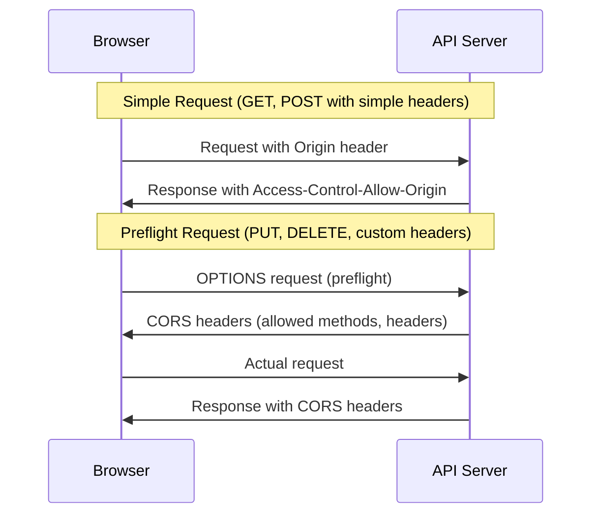
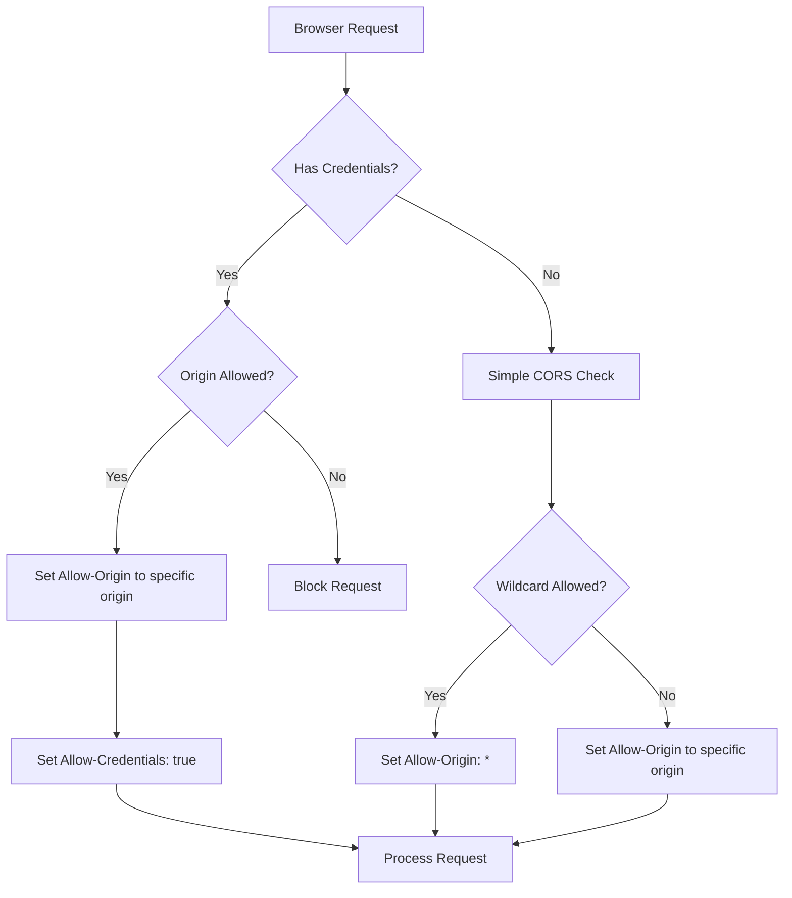
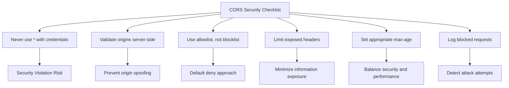

# How to Create API CORS Configuration

Author: [nawazdhandala](https://github.com/nawazdhandala)

Tags: CORS, API, Security, Node.js, Express, Web Development, Backend

Description: Learn how to create and configure Cross-Origin Resource Sharing (CORS) for your APIs with production-ready examples covering Node.js, Express, and common security patterns.

---

Cross-Origin Resource Sharing (CORS) is a security mechanism that controls which domains can access your API. When a browser makes a request to a different origin (domain, protocol, or port), the browser enforces CORS policies to protect users from malicious websites.

Getting CORS wrong leads to either blocked legitimate requests or security vulnerabilities. This guide covers how to configure CORS properly for production APIs.

## How CORS Works

Before configuring CORS, you need to understand the request flow. Browsers handle cross-origin requests differently based on the request type.



Simple requests (GET, POST with standard content types) go directly to the server. Complex requests (PUT, DELETE, or requests with custom headers) trigger a preflight OPTIONS request first.

## Basic CORS Configuration in Node.js

The simplest way to add CORS support is with the `cors` middleware package.

```bash
npm install cors
```

This example enables CORS for all origins, which is suitable for public APIs but not recommended for APIs handling sensitive data.

```javascript
const express = require('express');
const cors = require('cors');

const app = express();

// Enable CORS for all origins
// Warning: This allows any website to make requests to your API
app.use(cors());

app.get('/api/public', (req, res) => {
  res.json({ message: 'This endpoint is accessible from any origin' });
});

app.listen(3000);
```

## Production CORS Configuration

For production APIs, you need explicit control over which origins can access your API and what they can do.

This configuration allows specific origins, methods, and headers while supporting credentials like cookies and authorization headers.

```javascript
const express = require('express');
const cors = require('cors');

const app = express();

// Define allowed origins from environment or configuration
// In production, load these from environment variables
const allowedOrigins = [
  'https://app.example.com',
  'https://admin.example.com',
  'https://staging.example.com'
];

// Add development origin only in non-production environments
if (process.env.NODE_ENV !== 'production') {
  allowedOrigins.push('http://localhost:3000');
  allowedOrigins.push('http://localhost:5173'); // Vite default port
}

const corsOptions = {
  // Dynamic origin validation
  origin: function (origin, callback) {
    // Allow requests with no origin (mobile apps, Postman, server-to-server)
    if (!origin) {
      return callback(null, true);
    }

    if (allowedOrigins.includes(origin)) {
      callback(null, true);
    } else {
      callback(new Error('Not allowed by CORS'));
    }
  },

  // Allowed HTTP methods
  methods: ['GET', 'POST', 'PUT', 'PATCH', 'DELETE', 'OPTIONS'],

  // Allowed request headers
  allowedHeaders: [
    'Content-Type',
    'Authorization',
    'X-Requested-With',
    'X-Request-ID'
  ],

  // Headers exposed to the browser
  exposedHeaders: [
    'X-Request-ID',
    'X-RateLimit-Limit',
    'X-RateLimit-Remaining',
    'X-RateLimit-Reset'
  ],

  // Allow cookies and authorization headers
  credentials: true,

  // Cache preflight requests for 24 hours (in seconds)
  maxAge: 86400,

  // Pass preflight response to the next handler
  preflightContinue: false,

  // Return 204 for preflight requests
  optionsSuccessStatus: 204
};

app.use(cors(corsOptions));

app.get('/api/data', (req, res) => {
  res.json({ data: 'Protected endpoint' });
});

app.listen(3000);
```

## Manual CORS Implementation

Understanding manual CORS implementation helps when you need fine-grained control or when debugging CORS issues.

This middleware handles both preflight OPTIONS requests and adds CORS headers to all responses.

```javascript
const express = require('express');
const app = express();

// Load allowed origins from environment
const ALLOWED_ORIGINS = process.env.ALLOWED_ORIGINS
  ? process.env.ALLOWED_ORIGINS.split(',')
  : ['https://app.example.com'];

function corsMiddleware(req, res, next) {
  const origin = req.headers.origin;

  // Check if the origin is allowed
  if (origin && ALLOWED_ORIGINS.includes(origin)) {
    res.setHeader('Access-Control-Allow-Origin', origin);
  }

  // Always set Vary header when origin is dynamic
  // This tells caches that the response varies based on Origin header
  res.setHeader('Vary', 'Origin');

  // Allow credentials (cookies, authorization headers)
  res.setHeader('Access-Control-Allow-Credentials', 'true');

  // Handle preflight requests
  if (req.method === 'OPTIONS') {
    // Specify allowed methods
    res.setHeader(
      'Access-Control-Allow-Methods',
      'GET, POST, PUT, PATCH, DELETE, OPTIONS'
    );

    // Specify allowed headers
    res.setHeader(
      'Access-Control-Allow-Headers',
      'Content-Type, Authorization, X-Requested-With'
    );

    // Cache preflight response for 24 hours
    res.setHeader('Access-Control-Max-Age', '86400');

    // End preflight request
    return res.status(204).end();
  }

  // Expose custom headers to the browser
  res.setHeader(
    'Access-Control-Expose-Headers',
    'X-Request-ID, X-RateLimit-Limit, X-RateLimit-Remaining'
  );

  next();
}

// Apply CORS middleware before routes
app.use(corsMiddleware);

app.get('/api/data', (req, res) => {
  res.json({ message: 'Success' });
});

app.listen(3000);
```

## Route-Specific CORS Configuration

Different routes may need different CORS policies. Public endpoints might allow all origins, while admin endpoints need strict restrictions.

```javascript
const express = require('express');
const cors = require('cors');

const app = express();

// CORS configuration for public endpoints
const publicCorsOptions = {
  origin: '*',
  methods: ['GET'],
  maxAge: 86400
};

// CORS configuration for authenticated endpoints
const authenticatedCorsOptions = {
  origin: ['https://app.example.com'],
  methods: ['GET', 'POST', 'PUT', 'DELETE'],
  credentials: true,
  allowedHeaders: ['Content-Type', 'Authorization'],
  maxAge: 86400
};

// CORS configuration for admin endpoints
const adminCorsOptions = {
  origin: ['https://admin.example.com'],
  methods: ['GET', 'POST', 'PUT', 'DELETE'],
  credentials: true,
  allowedHeaders: ['Content-Type', 'Authorization', 'X-Admin-Token'],
  maxAge: 3600 // Shorter cache for admin
};

// Public API routes - allow all origins
app.use('/api/public', cors(publicCorsOptions));
app.get('/api/public/status', (req, res) => {
  res.json({ status: 'healthy' });
});

// User API routes - authenticated users only
app.use('/api/users', cors(authenticatedCorsOptions));
app.get('/api/users/profile', (req, res) => {
  res.json({ user: 'data' });
});

// Admin routes - restricted origins
app.use('/api/admin', cors(adminCorsOptions));
app.get('/api/admin/dashboard', (req, res) => {
  res.json({ admin: 'data' });
});

app.listen(3000);
```

## Pattern-Based Origin Validation

When you have multiple subdomains or need to match origins by pattern, use a validation function.

```javascript
const express = require('express');
const cors = require('cors');

const app = express();

// Pattern-based origin validation
function isOriginAllowed(origin) {
  if (!origin) {
    return true; // Allow requests without origin
  }

  // Allow exact matches
  const exactMatches = [
    'https://example.com',
    'https://www.example.com'
  ];

  if (exactMatches.includes(origin)) {
    return true;
  }

  // Allow all subdomains of example.com
  // This pattern matches: https://app.example.com, https://api.example.com, etc.
  const subdomainPattern = /^https:\/\/([a-z0-9-]+\.)?example\.com$/;
  if (subdomainPattern.test(origin)) {
    return true;
  }

  // Allow localhost in development
  if (process.env.NODE_ENV !== 'production') {
    const localhostPattern = /^http:\/\/localhost:\d+$/;
    if (localhostPattern.test(origin)) {
      return true;
    }
  }

  return false;
}

const corsOptions = {
  origin: function (origin, callback) {
    if (isOriginAllowed(origin)) {
      callback(null, true);
    } else {
      console.warn(`Blocked CORS request from origin: ${origin}`);
      callback(new Error('Not allowed by CORS'));
    }
  },
  credentials: true
};

app.use(cors(corsOptions));
app.listen(3000);
```

## CORS with Authentication

When your API uses authentication, CORS configuration requires special attention. The `credentials` option must be enabled, and you cannot use wildcards for the origin.



This configuration properly handles authentication tokens and cookies.

```javascript
const express = require('express');
const cors = require('cors');
const cookieParser = require('cookie-parser');

const app = express();

const corsOptions = {
  origin: function (origin, callback) {
    const allowedOrigins = [
      'https://app.example.com',
      'https://mobile.example.com'
    ];

    // Important: When using credentials, origin cannot be '*'
    // You must explicitly whitelist origins
    if (!origin || allowedOrigins.includes(origin)) {
      callback(null, true);
    } else {
      callback(new Error('Not allowed by CORS'));
    }
  },

  // Required for cookies and Authorization header
  credentials: true,

  // Ensure Authorization header is allowed
  allowedHeaders: ['Content-Type', 'Authorization'],

  // Expose authentication-related headers
  exposedHeaders: ['Set-Cookie']
};

app.use(cors(corsOptions));
app.use(cookieParser());
app.use(express.json());

// Login endpoint sets authentication cookie
app.post('/api/auth/login', async (req, res) => {
  const { email, password } = req.body;

  // Validate credentials (simplified for example)
  const user = await authenticateUser(email, password);

  if (!user) {
    return res.status(401).json({ error: 'Invalid credentials' });
  }

  // Set HTTP-only cookie for authentication
  res.cookie('session', generateSessionToken(user), {
    httpOnly: true,
    secure: process.env.NODE_ENV === 'production',
    sameSite: 'none', // Required for cross-origin cookies
    maxAge: 7 * 24 * 60 * 60 * 1000 // 7 days
  });

  res.json({ user: { id: user.id, email: user.email } });
});

// Protected endpoint reads authentication cookie
app.get('/api/users/me', (req, res) => {
  const sessionToken = req.cookies.session;

  if (!sessionToken) {
    return res.status(401).json({ error: 'Not authenticated' });
  }

  const user = validateSessionToken(sessionToken);
  res.json({ user });
});

app.listen(3000);
```

## Environment-Based Configuration

Production applications need different CORS settings for development, staging, and production environments.

```javascript
const express = require('express');
const cors = require('cors');

const app = express();

// CORS configuration based on environment
function getCorsConfig() {
  const env = process.env.NODE_ENV || 'development';

  const configs = {
    development: {
      origin: [
        'http://localhost:3000',
        'http://localhost:5173',
        'http://127.0.0.1:3000'
      ],
      credentials: true,
      methods: ['GET', 'POST', 'PUT', 'PATCH', 'DELETE', 'OPTIONS'],
      allowedHeaders: ['Content-Type', 'Authorization', 'X-Debug-Token']
    },

    staging: {
      origin: [
        'https://staging.example.com',
        'https://staging-app.example.com'
      ],
      credentials: true,
      methods: ['GET', 'POST', 'PUT', 'PATCH', 'DELETE', 'OPTIONS'],
      allowedHeaders: ['Content-Type', 'Authorization']
    },

    production: {
      origin: function (origin, callback) {
        // Load from environment variable in production
        const allowed = process.env.CORS_ALLOWED_ORIGINS
          ? process.env.CORS_ALLOWED_ORIGINS.split(',')
          : ['https://app.example.com'];

        if (!origin || allowed.includes(origin)) {
          callback(null, true);
        } else {
          console.error(`CORS blocked origin: ${origin}`);
          callback(new Error('Not allowed by CORS'));
        }
      },
      credentials: true,
      methods: ['GET', 'POST', 'PUT', 'PATCH', 'DELETE'],
      allowedHeaders: ['Content-Type', 'Authorization'],
      maxAge: 86400
    }
  };

  return configs[env] || configs.development;
}

app.use(cors(getCorsConfig()));

// Log CORS configuration on startup
console.log(`CORS configured for ${process.env.NODE_ENV || 'development'} environment`);

app.listen(3000);
```

## CORS Error Handling

Proper error handling helps with debugging and provides clear feedback when CORS requests are blocked.

```javascript
const express = require('express');
const cors = require('cors');

const app = express();

const corsOptions = {
  origin: function (origin, callback) {
    const allowedOrigins = ['https://app.example.com'];

    if (!origin || allowedOrigins.includes(origin)) {
      callback(null, true);
    } else {
      // Pass error with helpful message
      const error = new Error(
        `Origin ${origin} is not allowed. Allowed origins: ${allowedOrigins.join(', ')}`
      );
      error.status = 403;
      callback(error);
    }
  },
  credentials: true
};

app.use(cors(corsOptions));

// CORS error handler
app.use((err, req, res, next) => {
  if (err.message && err.message.includes('not allowed')) {
    // Log CORS errors for monitoring
    console.error({
      type: 'CORS_ERROR',
      origin: req.headers.origin,
      path: req.path,
      method: req.method,
      timestamp: new Date().toISOString()
    });

    return res.status(403).json({
      error: 'CORS Error',
      message: 'Origin not allowed',
      // Only include details in non-production
      ...(process.env.NODE_ENV !== 'production' && {
        details: err.message
      })
    });
  }

  next(err);
});

app.listen(3000);
```

## Testing CORS Configuration

Test your CORS configuration to ensure it works correctly before deploying.

```javascript
// cors.test.js
const request = require('supertest');
const app = require('./app');

describe('CORS Configuration', () => {
  // Test that allowed origins work
  it('should allow requests from allowed origins', async () => {
    const response = await request(app)
      .get('/api/data')
      .set('Origin', 'https://app.example.com');

    expect(response.headers['access-control-allow-origin'])
      .toBe('https://app.example.com');
    expect(response.headers['access-control-allow-credentials'])
      .toBe('true');
  });

  // Test that blocked origins are rejected
  it('should block requests from disallowed origins', async () => {
    const response = await request(app)
      .get('/api/data')
      .set('Origin', 'https://malicious-site.com');

    expect(response.status).toBe(403);
  });

  // Test preflight requests
  it('should handle preflight requests correctly', async () => {
    const response = await request(app)
      .options('/api/data')
      .set('Origin', 'https://app.example.com')
      .set('Access-Control-Request-Method', 'POST')
      .set('Access-Control-Request-Headers', 'Content-Type, Authorization');

    expect(response.status).toBe(204);
    expect(response.headers['access-control-allow-methods'])
      .toContain('POST');
    expect(response.headers['access-control-allow-headers'])
      .toContain('Authorization');
  });

  // Test requests without origin (server-to-server)
  it('should allow requests without origin header', async () => {
    const response = await request(app)
      .get('/api/data');

    expect(response.status).toBe(200);
  });

  // Test max-age header for caching
  it('should set proper max-age for preflight caching', async () => {
    const response = await request(app)
      .options('/api/data')
      .set('Origin', 'https://app.example.com')
      .set('Access-Control-Request-Method', 'GET');

    expect(response.headers['access-control-max-age']).toBeDefined();
  });
});
```

## Common CORS Headers Reference

Understanding each CORS header helps you configure them correctly.

| Header | Purpose | Example Value |
|--------|---------|---------------|
| Access-Control-Allow-Origin | Specifies which origin can access the resource | `https://app.example.com` or `*` |
| Access-Control-Allow-Methods | HTTP methods allowed for cross-origin requests | `GET, POST, PUT, DELETE` |
| Access-Control-Allow-Headers | Request headers allowed in cross-origin requests | `Content-Type, Authorization` |
| Access-Control-Expose-Headers | Response headers accessible to browser JavaScript | `X-Request-ID, X-RateLimit-Limit` |
| Access-Control-Allow-Credentials | Whether credentials (cookies, auth) are allowed | `true` |
| Access-Control-Max-Age | How long preflight results can be cached (seconds) | `86400` |

## Security Best Practices

Follow these guidelines to keep your CORS configuration secure:



Here is a security-focused configuration that implements these practices.

```javascript
const express = require('express');
const cors = require('cors');

const app = express();

// Security-focused CORS configuration
const secureCorsOptions = {
  // NEVER use '*' with credentials - this is a security vulnerability
  origin: function (origin, callback) {
    // Explicitly define allowed origins
    const allowedOrigins = process.env.CORS_ALLOWED_ORIGINS
      ? process.env.CORS_ALLOWED_ORIGINS.split(',').map(o => o.trim())
      : [];

    // Validate origin format
    if (origin) {
      try {
        const url = new URL(origin);
        // Only allow HTTPS in production
        if (process.env.NODE_ENV === 'production' && url.protocol !== 'https:') {
          console.warn(`Blocked non-HTTPS origin: ${origin}`);
          return callback(new Error('HTTPS required'));
        }
      } catch (e) {
        console.warn(`Invalid origin format: ${origin}`);
        return callback(new Error('Invalid origin'));
      }
    }

    if (!origin || allowedOrigins.includes(origin)) {
      callback(null, true);
    } else {
      // Log blocked attempts for security monitoring
      console.warn({
        event: 'CORS_BLOCKED',
        origin,
        allowedOrigins,
        timestamp: new Date().toISOString()
      });
      callback(new Error('Origin not allowed'));
    }
  },

  credentials: true,

  // Only allow necessary methods
  methods: ['GET', 'POST', 'PUT', 'DELETE'],

  // Only allow necessary headers
  allowedHeaders: ['Content-Type', 'Authorization'],

  // Limit exposed headers to what the client needs
  exposedHeaders: ['X-Request-ID'],

  // Reasonable cache time - not too long for security updates
  maxAge: 3600, // 1 hour

  // Ensure OPTIONS requests are handled
  preflightContinue: false,
  optionsSuccessStatus: 204
};

app.use(cors(secureCorsOptions));

app.listen(3000);
```

## Summary

CORS configuration protects your API while enabling legitimate cross-origin access. Key points to remember:

1. Always use an allowlist of specific origins in production
2. Enable credentials only when needed for authentication
3. Never combine `credentials: true` with `origin: '*'`
4. Set appropriate `max-age` to cache preflight requests
5. Log blocked requests for security monitoring
6. Test CORS configuration with automated tests
7. Use environment-based configuration for different deployment stages

With proper CORS configuration, your API remains secure while providing seamless access to authorized clients across different origins.
