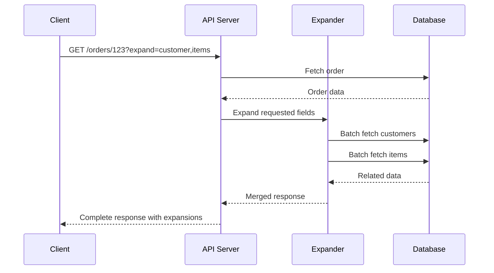
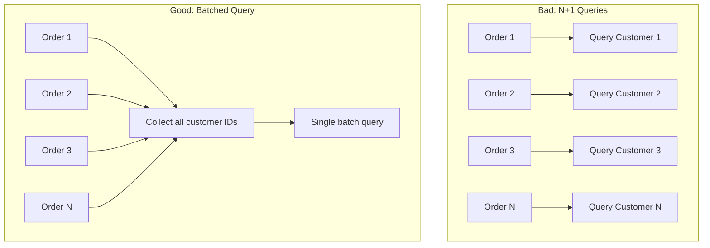
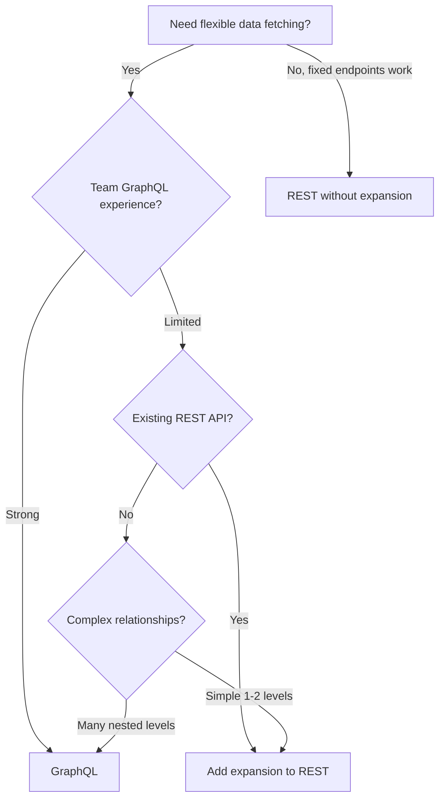

# How to Create API Expansion Patterns

Author: [nawazdhandala](https://github.com/nawazdhandala)

Tags: API Design, REST, GraphQL, Backend, Performance, Node.js, TypeScript, Database

Description: A practical guide to implementing API expansion patterns that let clients request related resources in a single call. Learn how to build flexible, performant APIs that reduce round trips while keeping your backend maintainable.

---

Every API eventually faces the N+1 problem. You fetch a list of orders, then make separate calls for each customer, each product, each shipping address. Your frontend makes 50 requests where one would suffice.

API expansion patterns solve this by letting clients specify which related resources to include in a single response. Instead of fetching orders and then customers separately, you request `/orders?expand=customer,items` and get everything at once.

This post walks through implementing expansion patterns from scratch. We will cover the core concepts, build a production-ready implementation in TypeScript, handle common edge cases, and explore performance optimizations.

---

## What Are API Expansion Patterns?

Expansion patterns allow clients to request nested or related resources inline with the primary resource. The client specifies which relationships to expand, and the server returns the full objects instead of just IDs.

Here is what this looks like in practice:

**Without expansion:**
```json
{
  "id": "order_123",
  "customer_id": "cust_456",
  "item_ids": ["item_789", "item_012"]
}
```

**With expansion (`?expand=customer,items`):**
```json
{
  "id": "order_123",
  "customer_id": "cust_456",
  "customer": {
    "id": "cust_456",
    "name": "Jane Smith",
    "email": "jane@example.com"
  },
  "item_ids": ["item_789", "item_012"],
  "items": [
    { "id": "item_789", "name": "Widget", "price": 29.99 },
    { "id": "item_012", "name": "Gadget", "price": 49.99 }
  ]
}
```

---

## The Request Flow

Here is how expansion requests flow through a typical system:



The key insight here is that the Expander batches related fetches. Instead of fetching each related resource individually, it collects all IDs and makes bulk queries.

---

## Core Implementation

Let us build an expansion system step by step. We will start with the type definitions and work up to a complete implementation.

### Step 1: Define the Expansion Configuration

First, we need a way to configure which fields can be expanded and how to fetch them. This configuration maps field names to their data sources.

```typescript
// expansion-config.ts
// Defines how each expandable field should be resolved

interface ExpansionConfig<T> {
  // The field on the parent object that contains the ID(s)
  sourceField: keyof T;

  // Function to batch-fetch related resources by their IDs
  // Returns a Map for O(1) lookups when merging results
  resolver: (ids: string[]) => Promise<Map<string, unknown>>;

  // Whether this field contains an array of IDs (vs single ID)
  isArray?: boolean;

  // Optional: nested expansions this field supports
  allowedNestedExpansions?: string[];
}

// Example configuration for an Order resource
const orderExpansionConfig: Record<string, ExpansionConfig<Order>> = {
  customer: {
    sourceField: 'customerId',
    resolver: async (ids) => {
      const customers = await db.customers.findMany({
        where: { id: { in: ids } }
      });
      return new Map(customers.map(c => [c.id, c]));
    },
    isArray: false,
    allowedNestedExpansions: ['address', 'subscription']
  },

  items: {
    sourceField: 'itemIds',
    resolver: async (ids) => {
      const items = await db.orderItems.findMany({
        where: { id: { in: ids } }
      });
      return new Map(items.map(i => [i.id, i]));
    },
    isArray: true,
    allowedNestedExpansions: ['product']
  }
};
```

### Step 2: Parse the Expansion Request

Clients can request nested expansions using dot notation: `expand=customer.address,items.product`. We need to parse this into a structured format.

```typescript
// expansion-parser.ts
// Parses the expand query parameter into a tree structure

interface ExpansionNode {
  field: string;
  children: Map<string, ExpansionNode>;
}

// Parses "customer.address,items.product" into a tree structure
// This allows us to process expansions level by level
function parseExpansions(expandParam: string | undefined): Map<string, ExpansionNode> {
  const root = new Map<string, ExpansionNode>();

  if (!expandParam) {
    return root;
  }

  // Split by comma and process each expansion path
  const paths = expandParam.split(',').map(p => p.trim()).filter(Boolean);

  for (const path of paths) {
    const parts = path.split('.');
    let currentLevel = root;

    for (const part of parts) {
      if (!currentLevel.has(part)) {
        currentLevel.set(part, {
          field: part,
          children: new Map()
        });
      }
      currentLevel = currentLevel.get(part)!.children;
    }
  }

  return root;
}

// Example usage:
// parseExpansions("customer.address,items.product,items.warehouse")
// Returns a tree where:
//   - "customer" has child "address"
//   - "items" has children "product" and "warehouse"
```

### Step 3: The Expander Class

Now we build the main expander that orchestrates fetching and merging related data. This is where the batching magic happens.

```typescript
// expander.ts
// Main class that handles expanding resources with related data

class ResourceExpander<T extends { id: string }> {
  constructor(
    private config: Record<string, ExpansionConfig<T>>,
    private maxDepth: number = 3  // Prevent infinite nesting
  ) {}

  // Main entry point: expand a single resource or array of resources
  async expand(
    resources: T | T[],
    expansions: Map<string, ExpansionNode>,
    currentDepth: number = 0
  ): Promise<T | T[]> {
    // Guard against deeply nested expansions (DoS protection)
    if (currentDepth >= this.maxDepth) {
      return resources;
    }

    const resourceArray = Array.isArray(resources) ? resources : [resources];

    if (resourceArray.length === 0 || expansions.size === 0) {
      return resources;
    }

    // Process each requested expansion
    for (const [fieldName, node] of expansions) {
      const fieldConfig = this.config[fieldName];

      if (!fieldConfig) {
        // Skip unknown expansion fields (or throw error based on your preference)
        continue;
      }

      await this.expandField(resourceArray, fieldName, fieldConfig, node, currentDepth);
    }

    return Array.isArray(resources) ? resourceArray : resourceArray[0];
  }

  // Expands a single field across all resources in the batch
  private async expandField(
    resources: T[],
    fieldName: string,
    config: ExpansionConfig<T>,
    node: ExpansionNode,
    currentDepth: number
  ): Promise<void> {
    // Collect all IDs that need to be fetched
    const allIds = new Set<string>();

    for (const resource of resources) {
      const sourceValue = resource[config.sourceField];

      if (config.isArray && Array.isArray(sourceValue)) {
        sourceValue.forEach(id => allIds.add(id));
      } else if (sourceValue && typeof sourceValue === 'string') {
        allIds.add(sourceValue);
      }
    }

    if (allIds.size === 0) {
      return;
    }

    // Batch fetch all related resources in one query
    const relatedData = await config.resolver(Array.from(allIds));

    // Merge fetched data back into each resource
    for (const resource of resources) {
      const sourceValue = resource[config.sourceField];

      if (config.isArray && Array.isArray(sourceValue)) {
        // Map array of IDs to array of objects
        (resource as Record<string, unknown>)[fieldName] = sourceValue
          .map(id => relatedData.get(id))
          .filter(Boolean);
      } else if (sourceValue && typeof sourceValue === 'string') {
        // Single ID to single object
        (resource as Record<string, unknown>)[fieldName] = relatedData.get(sourceValue);
      }
    }

    // Handle nested expansions recursively
    if (node.children.size > 0 && config.allowedNestedExpansions) {
      // Filter to only allowed nested expansions
      const allowedChildren = new Map<string, ExpansionNode>();
      for (const [childField, childNode] of node.children) {
        if (config.allowedNestedExpansions.includes(childField)) {
          allowedChildren.set(childField, childNode);
        }
      }

      if (allowedChildren.size > 0) {
        // Collect all expanded objects for nested expansion
        const expandedObjects: unknown[] = [];
        for (const resource of resources) {
          const expanded = (resource as Record<string, unknown>)[fieldName];
          if (Array.isArray(expanded)) {
            expandedObjects.push(...expanded);
          } else if (expanded) {
            expandedObjects.push(expanded);
          }
        }

        // Recursively expand nested fields
        // This requires a separate expander configured for the nested resource type
        // Implementation depends on your resource registry pattern
      }
    }
  }
}
```

---

## Express.js Integration

Here is how to integrate the expander into an Express API endpoint. The middleware approach keeps your route handlers clean.

```typescript
// routes/orders.ts
// Express route handler with expansion support

import express from 'express';
import { parseExpansions } from './expansion-parser';
import { orderExpander } from './expanders/order-expander';

const router = express.Router();

// GET /orders/:id with optional expansion
router.get('/orders/:id', async (req, res) => {
  try {
    const { id } = req.params;
    const expand = req.query.expand as string | undefined;

    // Fetch the base order
    const order = await db.orders.findUnique({
      where: { id }
    });

    if (!order) {
      return res.status(404).json({ error: 'Order not found' });
    }

    // Parse and apply expansions
    const expansions = parseExpansions(expand);
    const expandedOrder = await orderExpander.expand(order, expansions);

    return res.json(expandedOrder);
  } catch (error) {
    console.error('Failed to fetch order:', error);
    return res.status(500).json({ error: 'Internal server error' });
  }
});

// GET /orders with pagination and expansion
router.get('/orders', async (req, res) => {
  try {
    const { expand, limit = '20', offset = '0' } = req.query;

    const orders = await db.orders.findMany({
      take: parseInt(limit as string, 10),
      skip: parseInt(offset as string, 10)
    });

    // Expand all orders in a single batch operation
    const expansions = parseExpansions(expand as string);
    const expandedOrders = await orderExpander.expand(orders, expansions);

    return res.json({
      data: expandedOrders,
      pagination: {
        limit: parseInt(limit as string, 10),
        offset: parseInt(offset as string, 10)
      }
    });
  } catch (error) {
    console.error('Failed to fetch orders:', error);
    return res.status(500).json({ error: 'Internal server error' });
  }
});

export default router;
```

---

## Performance Considerations

API expansion can either dramatically improve or hurt performance, depending on implementation. Here are the patterns that matter:

### Batching Is Everything

The difference between good and bad expansion implementations comes down to batching. Compare these two approaches:



### DataLoader Pattern

For complex scenarios with multiple expansion levels, consider using Facebook's DataLoader pattern. It automatically batches and caches within a single request.

```typescript
// dataloaders.ts
// DataLoader instances for automatic batching and caching

import DataLoader from 'dataloader';

// Create loaders per-request to avoid cache leaking between users
function createLoaders(db: Database) {
  return {
    // Batches all customer lookups within a single tick
    customers: new DataLoader<string, Customer>(async (ids) => {
      const customers = await db.customers.findMany({
        where: { id: { in: [...ids] } }
      });

      // DataLoader requires results in same order as input IDs
      const customerMap = new Map(customers.map(c => [c.id, c]));
      return ids.map(id => customerMap.get(id) || null);
    }),

    // Batches all product lookups
    products: new DataLoader<string, Product>(async (ids) => {
      const products = await db.products.findMany({
        where: { id: { in: [...ids] } }
      });

      const productMap = new Map(products.map(p => [p.id, p]));
      return ids.map(id => productMap.get(id) || null);
    })
  };
}

// Usage in request context
app.use((req, res, next) => {
  // Fresh loaders for each request
  req.loaders = createLoaders(db);
  next();
});
```

### Limiting Expansion Depth and Width

Uncontrolled expansions can DOS your API. Add limits:

```typescript
// expansion-limits.ts
// Validates expansion requests against configured limits

interface ExpansionLimits {
  maxDepth: number;        // How deep can expansions nest
  maxFields: number;       // Total number of fields that can be expanded
  maxArrayExpansion: number; // Max items to expand in array fields
}

const defaultLimits: ExpansionLimits = {
  maxDepth: 3,
  maxFields: 10,
  maxArrayExpansion: 100
};

function validateExpansions(
  expansions: Map<string, ExpansionNode>,
  limits: ExpansionLimits = defaultLimits,
  currentDepth: number = 0
): { valid: boolean; error?: string } {

  if (currentDepth > limits.maxDepth) {
    return {
      valid: false,
      error: `Expansion depth exceeds maximum of ${limits.maxDepth}`
    };
  }

  let totalFields = expansions.size;

  for (const [, node] of expansions) {
    if (node.children.size > 0) {
      const childResult = validateExpansions(
        node.children,
        limits,
        currentDepth + 1
      );

      if (!childResult.valid) {
        return childResult;
      }

      totalFields += countFields(node.children);
    }
  }

  if (totalFields > limits.maxFields) {
    return {
      valid: false,
      error: `Total expanded fields (${totalFields}) exceeds maximum of ${limits.maxFields}`
    };
  }

  return { valid: true };
}

function countFields(expansions: Map<string, ExpansionNode>): number {
  let count = expansions.size;
  for (const [, node] of expansions) {
    count += countFields(node.children);
  }
  return count;
}
```

---

## Caching Expanded Responses

Expansion-aware caching can significantly reduce database load. The key is generating cache keys that include the expansion configuration.

```typescript
// expansion-cache.ts
// Caching layer for expanded responses

import { createHash } from 'crypto';

class ExpansionCache {
  constructor(
    private redis: RedisClient,
    private defaultTTL: number = 60  // seconds
  ) {}

  // Generate a cache key that includes the expansion configuration
  private generateKey(
    resourceType: string,
    resourceId: string,
    expansions: Map<string, ExpansionNode>
  ): string {
    // Sort expansions to ensure consistent keys
    const expansionString = this.serializeExpansions(expansions);
    const hash = createHash('md5').update(expansionString).digest('hex');

    return `expand:${resourceType}:${resourceId}:${hash}`;
  }

  private serializeExpansions(expansions: Map<string, ExpansionNode>): string {
    const sorted = Array.from(expansions.entries()).sort((a, b) =>
      a[0].localeCompare(b[0])
    );

    return JSON.stringify(sorted.map(([key, node]) => ({
      key,
      children: this.serializeExpansions(node.children)
    })));
  }

  async get<T>(
    resourceType: string,
    resourceId: string,
    expansions: Map<string, ExpansionNode>
  ): Promise<T | null> {
    const key = this.generateKey(resourceType, resourceId, expansions);
    const cached = await this.redis.get(key);

    return cached ? JSON.parse(cached) : null;
  }

  async set<T>(
    resourceType: string,
    resourceId: string,
    expansions: Map<string, ExpansionNode>,
    data: T,
    ttl: number = this.defaultTTL
  ): Promise<void> {
    const key = this.generateKey(resourceType, resourceId, expansions);
    await this.redis.setex(key, ttl, JSON.stringify(data));
  }

  // Invalidate all cached expansions for a resource when it changes
  async invalidate(resourceType: string, resourceId: string): Promise<void> {
    const pattern = `expand:${resourceType}:${resourceId}:*`;
    const keys = await this.redis.keys(pattern);

    if (keys.length > 0) {
      await this.redis.del(...keys);
    }
  }
}
```

---

## Comparison with GraphQL

You might wonder why not just use GraphQL. Here is when each approach makes sense:



**REST with Expansion works well when:**
- You have an existing REST API and want incremental improvement
- Your data relationships are relatively flat (1-2 levels)
- Your team is comfortable with REST patterns
- You want simpler tooling and debugging

**GraphQL works well when:**
- You are starting fresh and have complex, deeply nested data
- Multiple clients need very different data shapes
- You want strong typing and introspection built in
- Your team has GraphQL experience

---

## Real World Patterns

### Stripe-Style Expansion

Stripe's API is the gold standard for REST expansion. They use a simple yet powerful pattern:

```bash
# Expand a single field
curl https://api.stripe.com/v1/charges/ch_123?expand[]=customer

# Expand multiple fields
curl https://api.stripe.com/v1/charges/ch_123?expand[]=customer&expand[]=invoice

# Nested expansion
curl https://api.stripe.com/v1/charges/ch_123?expand[]=invoice.subscription
```

### GitHub-Style Expansion via Accept Header

GitHub uses a different approach with custom media types:

```bash
# Standard response
curl -H "Accept: application/vnd.github.v3+json" \
  https://api.github.com/repos/owner/repo/pulls/1

# With additional data
curl -H "Accept: application/vnd.github.v3.full+json" \
  https://api.github.com/repos/owner/repo/pulls/1
```

### Field Selection (Sparse Fieldsets)

You can combine expansion with field selection to reduce payload size:

```typescript
// Handles both expansion and field selection
// GET /orders/123?expand=customer&fields=id,total,customer.name,customer.email

interface FieldSelector {
  fields: Set<string>;
  nested: Map<string, FieldSelector>;
}

function parseFields(fieldsParam: string | undefined): FieldSelector | null {
  if (!fieldsParam) return null;

  const selector: FieldSelector = {
    fields: new Set(),
    nested: new Map()
  };

  const fieldList = fieldsParam.split(',').map(f => f.trim());

  for (const field of fieldList) {
    const parts = field.split('.');

    if (parts.length === 1) {
      selector.fields.add(parts[0]);
    } else {
      const [parent, ...rest] = parts;
      selector.fields.add(parent);

      if (!selector.nested.has(parent)) {
        selector.nested.set(parent, { fields: new Set(), nested: new Map() });
      }

      // Recursively handle nested field selection
      const nested = selector.nested.get(parent)!;
      nested.fields.add(rest.join('.'));
    }
  }

  return selector;
}

// Apply field selection to filter response
function applyFieldSelection<T extends object>(
  data: T,
  selector: FieldSelector | null
): Partial<T> {
  if (!selector) return data;

  const result: Partial<T> = {};

  for (const [key, value] of Object.entries(data)) {
    if (selector.fields.has(key)) {
      if (selector.nested.has(key) && typeof value === 'object' && value !== null) {
        result[key as keyof T] = applyFieldSelection(
          value as object,
          selector.nested.get(key)!
        ) as T[keyof T];
      } else {
        result[key as keyof T] = value;
      }
    }
  }

  return result;
}
```

---

## Error Handling

Clear error messages help API consumers understand what went wrong:

```typescript
// expansion-errors.ts
// Custom error types for expansion failures

class ExpansionError extends Error {
  constructor(
    message: string,
    public code: string,
    public field?: string,
    public statusCode: number = 400
  ) {
    super(message);
    this.name = 'ExpansionError';
  }
}

// Possible expansion errors with clear messages
const ExpansionErrors = {
  unknownField: (field: string) => new ExpansionError(
    `Unknown expansion field: '${field}'. Check API documentation for available expansions.`,
    'UNKNOWN_EXPANSION_FIELD',
    field
  ),

  depthExceeded: (maxDepth: number) => new ExpansionError(
    `Expansion depth exceeds maximum allowed depth of ${maxDepth}.`,
    'EXPANSION_DEPTH_EXCEEDED'
  ),

  fieldNotExpandable: (field: string) => new ExpansionError(
    `Field '${field}' does not support expansion.`,
    'FIELD_NOT_EXPANDABLE',
    field
  ),

  nestedNotAllowed: (parent: string, child: string) => new ExpansionError(
    `Nested expansion '${child}' is not allowed on '${parent}'.`,
    'NESTED_EXPANSION_NOT_ALLOWED',
    `${parent}.${child}`
  ),

  resolverFailed: (field: string, originalError: Error) => new ExpansionError(
    `Failed to resolve expansion for '${field}': ${originalError.message}`,
    'EXPANSION_RESOLVER_FAILED',
    field,
    500
  )
};

// Error response format
interface ExpansionErrorResponse {
  error: {
    type: string;
    code: string;
    message: string;
    field?: string;
  };
}

function formatExpansionError(error: ExpansionError): ExpansionErrorResponse {
  return {
    error: {
      type: 'expansion_error',
      code: error.code,
      message: error.message,
      field: error.field
    }
  };
}
```

---

## Testing Expansion Logic

Testing expansions requires verifying both the happy path and edge cases:

```typescript
// __tests__/expander.test.ts
// Test suite for the expansion system

import { ResourceExpander } from '../expander';
import { parseExpansions } from '../expansion-parser';

describe('ResourceExpander', () => {
  const mockDb = {
    customers: new Map([
      ['cust_1', { id: 'cust_1', name: 'Alice', email: 'alice@example.com' }],
      ['cust_2', { id: 'cust_2', name: 'Bob', email: 'bob@example.com' }]
    ]),
    items: new Map([
      ['item_1', { id: 'item_1', name: 'Widget', price: 10 }],
      ['item_2', { id: 'item_2', name: 'Gadget', price: 20 }]
    ])
  };

  const config = {
    customer: {
      sourceField: 'customerId' as const,
      resolver: async (ids: string[]) => {
        const result = new Map();
        ids.forEach(id => {
          if (mockDb.customers.has(id)) {
            result.set(id, mockDb.customers.get(id));
          }
        });
        return result;
      },
      isArray: false
    },
    items: {
      sourceField: 'itemIds' as const,
      resolver: async (ids: string[]) => {
        const result = new Map();
        ids.forEach(id => {
          if (mockDb.items.has(id)) {
            result.set(id, mockDb.items.get(id));
          }
        });
        return result;
      },
      isArray: true
    }
  };

  const expander = new ResourceExpander(config);

  test('expands single field correctly', async () => {
    const order = {
      id: 'order_1',
      customerId: 'cust_1',
      itemIds: ['item_1']
    };

    const expansions = parseExpansions('customer');
    const result = await expander.expand(order, expansions);

    expect(result).toHaveProperty('customer');
    expect(result.customer).toEqual({
      id: 'cust_1',
      name: 'Alice',
      email: 'alice@example.com'
    });
  });

  test('expands array fields correctly', async () => {
    const order = {
      id: 'order_1',
      customerId: 'cust_1',
      itemIds: ['item_1', 'item_2']
    };

    const expansions = parseExpansions('items');
    const result = await expander.expand(order, expansions);

    expect(result.items).toHaveLength(2);
    expect(result.items[0].name).toBe('Widget');
    expect(result.items[1].name).toBe('Gadget');
  });

  test('handles missing related resources gracefully', async () => {
    const order = {
      id: 'order_1',
      customerId: 'cust_nonexistent',
      itemIds: ['item_1']
    };

    const expansions = parseExpansions('customer');
    const result = await expander.expand(order, expansions);

    expect(result.customer).toBeUndefined();
  });

  test('batches fetches across multiple resources', async () => {
    const resolverSpy = jest.spyOn(config.customer, 'resolver');

    const orders = [
      { id: 'order_1', customerId: 'cust_1', itemIds: [] },
      { id: 'order_2', customerId: 'cust_2', itemIds: [] }
    ];

    const expansions = parseExpansions('customer');
    await expander.expand(orders, expansions);

    // Should be called once with both IDs, not twice
    expect(resolverSpy).toHaveBeenCalledTimes(1);
    expect(resolverSpy).toHaveBeenCalledWith(['cust_1', 'cust_2']);
  });

  test('ignores unknown expansion fields', async () => {
    const order = {
      id: 'order_1',
      customerId: 'cust_1',
      itemIds: []
    };

    const expansions = parseExpansions('nonexistent');
    const result = await expander.expand(order, expansions);

    expect(result).not.toHaveProperty('nonexistent');
  });
});
```

---

## Documentation Pattern

Document your expansion API clearly. Here is a pattern that works well:

```yaml
# openapi.yaml snippet for expansion documentation

paths:
  /orders/{id}:
    get:
      summary: Retrieve an order
      parameters:
        - name: id
          in: path
          required: true
          schema:
            type: string
        - name: expand
          in: query
          description: |
            Comma-separated list of fields to expand.
            Supports nested expansion using dot notation.

            Available expansions:
            - customer: The customer who placed the order
            - customer.address: Customer's shipping address
            - items: Order line items
            - items.product: Product details for each item

            Example: ?expand=customer,items.product
          schema:
            type: string
            example: "customer,items"
      responses:
        '200':
          description: Order retrieved successfully
          content:
            application/json:
              schema:
                $ref: '#/components/schemas/Order'
              examples:
                without_expansion:
                  summary: Response without expansion
                  value:
                    id: "order_123"
                    customerId: "cust_456"
                    itemIds: ["item_789"]
                    total: 79.98
                with_expansion:
                  summary: Response with expand=customer,items
                  value:
                    id: "order_123"
                    customerId: "cust_456"
                    customer:
                      id: "cust_456"
                      name: "Jane Smith"
                      email: "jane@example.com"
                    itemIds: ["item_789"]
                    items:
                      - id: "item_789"
                        name: "Widget"
                        price: 79.98
                    total: 79.98
```

---

## Summary

API expansion patterns give your clients the flexibility to fetch related data in a single request while keeping your backend maintainable. The key principles:

1. **Always batch**: Collect IDs and make single bulk queries instead of N+1 individual queries
2. **Limit depth and width**: Protect against abusive expansion requests
3. **Cache intelligently**: Include expansion configuration in cache keys
4. **Document thoroughly**: Make available expansions and their nesting rules clear
5. **Handle errors gracefully**: Provide clear messages when expansions fail

Start simple with single-level expansions, then add nesting and caching as your API matures. The investment pays off quickly in reduced round trips and happier frontend developers.

---

Need to monitor your API performance as you implement these patterns? OneUptime provides full-stack observability with traces, metrics, and logs to help you catch performance regressions before they hit production.

Happy building.
