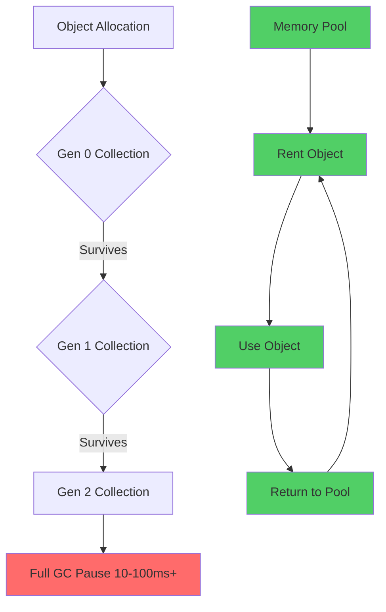
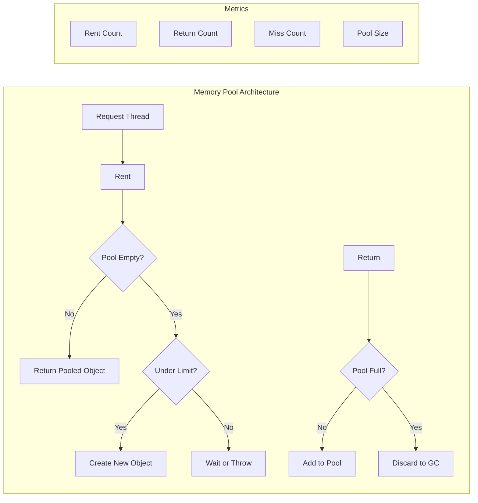

# How to Create Custom Memory Pool in .NET

Author: [nawazdhandala](https://github.com/nawazdhandala)

Tags: DotNet, CSharp, Performance, Memory Management, High Performance

Description: Learn how to build production-ready custom memory pools in .NET to reduce GC pressure, improve performance, and handle high-throughput scenarios with reusable buffer management.

---

Garbage collection in .NET handles most memory management automatically, but this convenience comes with a cost. Every allocation eventually triggers a collection, and in high-throughput systems processing thousands of requests per second, GC pauses become a real bottleneck. Custom memory pools let you recycle allocations, keeping objects out of the garbage collector's reach entirely.

This guide walks through building memory pools from scratch, then shows how to leverage .NET's built-in pooling infrastructure for production systems.

## Why Memory Pools Matter

Every time you allocate memory in .NET, the runtime tracks that allocation. When memory pressure builds, the garbage collector pauses your application to reclaim unused memory. In Gen 0 collections this pause is brief, but objects that survive get promoted to Gen 1 and eventually Gen 2, where collections take significantly longer.



Memory pools break this cycle by reusing objects. Instead of allocating and discarding, you rent from the pool and return when finished. The same memory gets used over and over without ever touching the garbage collector.

## Building a Basic Object Pool

Let us start with a simple thread-safe object pool. This implementation uses a ConcurrentBag for thread safety and allows customization of object creation and reset logic.

```csharp
using System;
using System.Collections.Concurrent;

// Generic object pool that can hold any reference type.
// Uses ConcurrentBag for lock-free thread safety on rent/return operations.
public class ObjectPool<T> where T : class
{
    private readonly ConcurrentBag<T> _pool;
    private readonly Func<T> _objectFactory;
    private readonly Action<T>? _resetAction;
    private readonly int _maxPoolSize;
    private int _currentCount;

    public ObjectPool(
        Func<T> objectFactory,
        Action<T>? resetAction = null,
        int maxPoolSize = 100)
    {
        _objectFactory = objectFactory ?? throw new ArgumentNullException(nameof(objectFactory));
        _resetAction = resetAction;
        _maxPoolSize = maxPoolSize;
        _pool = new ConcurrentBag<T>();
        _currentCount = 0;
    }

    // Retrieves an object from the pool or creates a new one if the pool is empty.
    // This operation is thread-safe and lock-free in most cases.
    public T Rent()
    {
        if (_pool.TryTake(out T? item))
        {
            Interlocked.Decrement(ref _currentCount);
            return item;
        }

        return _objectFactory();
    }

    // Returns an object to the pool for reuse.
    // Objects are reset before being added back to prevent data leakage.
    // If pool is at capacity, the object is simply discarded for GC.
    public void Return(T item)
    {
        if (item == null) return;

        // Reset the object state before returning to pool
        _resetAction?.Invoke(item);

        // Only add back to pool if under capacity
        if (_currentCount < _maxPoolSize)
        {
            _pool.Add(item);
            Interlocked.Increment(ref _currentCount);
        }
        // Otherwise let GC handle it
    }

    // Pre-populates the pool with objects.
    // Call this during application startup to avoid allocation during requests.
    public void Warm(int count)
    {
        for (int i = 0; i < Math.Min(count, _maxPoolSize); i++)
        {
            _pool.Add(_objectFactory());
            Interlocked.Increment(ref _currentCount);
        }
    }
}
```

Here is how you would use this pool for a request processing scenario.

```csharp
// Example: Pooling request context objects that are expensive to create
public class RequestContext
{
    public Dictionary<string, string> Headers { get; } = new();
    public List<string> Errors { get; } = new();
    public StringBuilder ResponseBuilder { get; } = new();
    public DateTime StartTime { get; set; }

    public void Clear()
    {
        Headers.Clear();
        Errors.Clear();
        ResponseBuilder.Clear();
        StartTime = default;
    }
}

// Create pool with factory and reset action
var contextPool = new ObjectPool<RequestContext>(
    objectFactory: () => new RequestContext(),
    resetAction: ctx => ctx.Clear(),
    maxPoolSize: 200
);

// Warm the pool at startup
contextPool.Warm(50);

// Usage in request handler
public async Task HandleRequest(HttpContext http)
{
    var context = contextPool.Rent();
    try
    {
        context.StartTime = DateTime.UtcNow;
        // Process request using context...
    }
    finally
    {
        contextPool.Return(context);
    }
}
```

## ArrayPool for Buffer Management

For byte arrays and other primitive arrays, .NET provides `ArrayPool<T>` out of the box. This is the recommended approach for buffer pooling in production systems.

```csharp
using System.Buffers;

// ArrayPool.Shared is a singleton pool suitable for most scenarios.
// It manages arrays of various sizes using bucketing internally.
public class FileProcessor
{
    private readonly ArrayPool<byte> _bufferPool;

    public FileProcessor()
    {
        // Use the shared pool for general purposes
        _bufferPool = ArrayPool<byte>.Shared;
    }

    public async Task<byte[]> ReadFileAsync(string path)
    {
        var fileInfo = new FileInfo(path);

        // Rent a buffer at least as large as the file.
        // The returned buffer may be larger than requested due to bucketing.
        byte[] buffer = _bufferPool.Rent((int)fileInfo.Length);

        try
        {
            using var stream = File.OpenRead(path);
            int bytesRead = await stream.ReadAsync(buffer, 0, (int)fileInfo.Length);

            // Important: Only use bytesRead bytes, not buffer.Length
            byte[] result = new byte[bytesRead];
            Buffer.BlockCopy(buffer, 0, result, 0, bytesRead);
            return result;
        }
        finally
        {
            // Always return the buffer, optionally clearing sensitive data
            _bufferPool.Return(buffer, clearArray: true);
        }
    }
}
```

For high-performance scenarios where you need more control, create a custom ArrayPool.

```csharp
// Custom ArrayPool with specific bucket sizes for your workload.
// This avoids wasting memory when you know your common allocation sizes.
public static class CustomArrayPools
{
    // Pool optimized for network packet processing
    // Common sizes: 512, 1500 (MTU), 4096, 65535 (max UDP)
    public static readonly ArrayPool<byte> NetworkBufferPool =
        ArrayPool<byte>.Create(
            maxArrayLength: 65536,
            maxArraysPerBucket: 50
        );

    // Pool for JSON serialization buffers
    public static readonly ArrayPool<char> JsonCharPool =
        ArrayPool<char>.Create(
            maxArrayLength: 1024 * 1024,  // 1MB max
            maxArraysPerBucket: 20
        );
}
```

## MemoryPool and IMemoryOwner Pattern

`MemoryPool<T>` provides a more modern API that returns `IMemoryOwner<T>`, making it easier to track ownership and ensure proper disposal.

```csharp
using System.Buffers;

// MemoryPool returns IMemoryOwner which implements IDisposable.
// This makes it natural to use with using statements.
public class MessageProcessor
{
    private readonly MemoryPool<byte> _memoryPool;

    public MessageProcessor()
    {
        _memoryPool = MemoryPool<byte>.Shared;
    }

    public async Task ProcessMessageAsync(Stream source, int length)
    {
        // IMemoryOwner automatically returns memory to pool when disposed
        using IMemoryOwner<byte> owner = _memoryPool.Rent(length);
        Memory<byte> buffer = owner.Memory.Slice(0, length);

        await source.ReadAsync(buffer);

        // Process the data in buffer
        ProcessData(buffer.Span);

        // Memory is returned to pool when owner is disposed
    }

    private void ProcessData(ReadOnlySpan<byte> data)
    {
        // Process without any allocations using Span
    }
}
```

## Building a High-Performance Memory Pool

For systems requiring maximum performance, here is a more sophisticated pool implementation with metrics, automatic sizing, and memory pressure handling.



```csharp
using System;
using System.Collections.Concurrent;
using System.Diagnostics;
using System.Threading;

// High-performance pool with diagnostics, automatic growth, and GC pressure handling.
// Suitable for production systems requiring detailed metrics.
public sealed class HighPerformancePool<T> : IDisposable where T : class
{
    private readonly ConcurrentQueue<T> _pool;
    private readonly Func<T> _factory;
    private readonly Action<T>? _reset;
    private readonly Action<T>? _destroy;
    private readonly int _maxSize;
    private readonly int _initialSize;

    private int _pooledCount;
    private long _rentCount;
    private long _returnCount;
    private long _missCount;
    private long _discardCount;
    private bool _disposed;

    public HighPerformancePool(
        Func<T> factory,
        Action<T>? reset = null,
        Action<T>? destroy = null,
        int initialSize = 10,
        int maxSize = 100)
    {
        _factory = factory ?? throw new ArgumentNullException(nameof(factory));
        _reset = reset;
        _destroy = destroy;
        _initialSize = initialSize;
        _maxSize = maxSize;
        _pool = new ConcurrentQueue<T>();

        // Pre-populate pool
        for (int i = 0; i < _initialSize; i++)
        {
            _pool.Enqueue(_factory());
            Interlocked.Increment(ref _pooledCount);
        }
    }

    // Pool statistics for monitoring and debugging
    public PoolStats GetStats() => new PoolStats
    {
        PooledCount = _pooledCount,
        RentCount = Interlocked.Read(ref _rentCount),
        ReturnCount = Interlocked.Read(ref _returnCount),
        MissCount = Interlocked.Read(ref _missCount),
        DiscardCount = Interlocked.Read(ref _discardCount),
        HitRate = CalculateHitRate()
    };

    private double CalculateHitRate()
    {
        long total = Interlocked.Read(ref _rentCount);
        if (total == 0) return 1.0;
        long misses = Interlocked.Read(ref _missCount);
        return (double)(total - misses) / total;
    }

    // Rent an object from the pool. Thread-safe and lock-free.
    public T Rent()
    {
        ObjectDisposedException.ThrowIf(_disposed, this);

        Interlocked.Increment(ref _rentCount);

        if (_pool.TryDequeue(out T? item))
        {
            Interlocked.Decrement(ref _pooledCount);
            return item;
        }

        // Pool miss - need to create new object
        Interlocked.Increment(ref _missCount);
        return _factory();
    }

    // Try to rent with a timeout. Useful for bounded resource scenarios.
    public bool TryRent(out T? item, TimeSpan timeout)
    {
        ObjectDisposedException.ThrowIf(_disposed, this);

        var sw = Stopwatch.StartNew();

        while (sw.Elapsed < timeout)
        {
            if (_pool.TryDequeue(out item))
            {
                Interlocked.Increment(ref _rentCount);
                Interlocked.Decrement(ref _pooledCount);
                return true;
            }

            // Brief spin wait before retry
            Thread.SpinWait(100);
        }

        item = default;
        return false;
    }

    // Return an object to the pool for reuse.
    public void Return(T item)
    {
        if (_disposed || item == null) return;

        Interlocked.Increment(ref _returnCount);

        // Reset object state
        try
        {
            _reset?.Invoke(item);
        }
        catch
        {
            // If reset fails, don't return corrupted object to pool
            Interlocked.Increment(ref _discardCount);
            _destroy?.Invoke(item);
            return;
        }

        // Check if pool has room
        if (_pooledCount < _maxSize)
        {
            _pool.Enqueue(item);
            Interlocked.Increment(ref _pooledCount);
        }
        else
        {
            // Pool is full, discard object
            Interlocked.Increment(ref _discardCount);
            _destroy?.Invoke(item);
        }
    }

    // Trim pool to reduce memory under low usage
    public void Trim(int targetSize)
    {
        while (_pooledCount > targetSize && _pool.TryDequeue(out T? item))
        {
            Interlocked.Decrement(ref _pooledCount);
            _destroy?.Invoke(item);
        }
    }

    public void Dispose()
    {
        if (_disposed) return;
        _disposed = true;

        while (_pool.TryDequeue(out T? item))
        {
            _destroy?.Invoke(item);
        }
    }
}

// Statistics structure for monitoring
public readonly struct PoolStats
{
    public int PooledCount { get; init; }
    public long RentCount { get; init; }
    public long ReturnCount { get; init; }
    public long MissCount { get; init; }
    public long DiscardCount { get; init; }
    public double HitRate { get; init; }

    public override string ToString() =>
        $"Pooled: {PooledCount}, Rented: {RentCount}, Returned: {ReturnCount}, " +
        $"Misses: {MissCount}, Discards: {DiscardCount}, Hit Rate: {HitRate:P2}";
}
```

## Practical Example: Database Connection Buffer Pool

Here is a real-world example pooling buffers for database result processing.

```csharp
using System;
using System.Buffers;
using System.Data;
using System.Data.Common;
using System.Text;
using System.Threading.Tasks;

// Pools buffers used for reading large database results.
// Reduces allocations during high-volume query processing.
public class PooledDatabaseReader
{
    private readonly ArrayPool<byte> _bytePool;
    private readonly ArrayPool<char> _charPool;
    private readonly ObjectPool<StringBuilder> _stringBuilderPool;

    public PooledDatabaseReader()
    {
        _bytePool = ArrayPool<byte>.Create(maxArrayLength: 1024 * 1024, maxArraysPerBucket: 20);
        _charPool = ArrayPool<char>.Create(maxArrayLength: 64 * 1024, maxArraysPerBucket: 20);
        _stringBuilderPool = new ObjectPool<StringBuilder>(
            () => new StringBuilder(4096),
            sb => sb.Clear(),
            maxPoolSize: 50
        );
    }

    public async Task<string> ReadLargeTextColumnAsync(DbDataReader reader, int columnIndex)
    {
        // Rent a StringBuilder from pool
        StringBuilder sb = _stringBuilderPool.Rent();
        char[] charBuffer = _charPool.Rent(8192);

        try
        {
            long dataIndex = 0;
            long charsRead;

            // Read in chunks to avoid large single allocation
            while ((charsRead = reader.GetChars(columnIndex, dataIndex, charBuffer, 0, charBuffer.Length)) > 0)
            {
                sb.Append(charBuffer, 0, (int)charsRead);
                dataIndex += charsRead;
            }

            return sb.ToString();
        }
        finally
        {
            _charPool.Return(charBuffer);
            _stringBuilderPool.Return(sb);
        }
    }

    public async Task<byte[]> ReadBinaryColumnAsync(DbDataReader reader, int columnIndex)
    {
        // Get the actual data length
        long length = reader.GetBytes(columnIndex, 0, null, 0, 0);

        // Rent buffer from pool
        byte[] buffer = _bytePool.Rent((int)length);

        try
        {
            long bytesRead = reader.GetBytes(columnIndex, 0, buffer, 0, (int)length);

            // Copy to right-sized array for return
            byte[] result = new byte[bytesRead];
            Buffer.BlockCopy(buffer, 0, result, 0, (int)bytesRead);
            return result;
        }
        finally
        {
            _bytePool.Return(buffer, clearArray: true);
        }
    }
}
```

## RecyclableMemoryStream for Large Buffers

Microsoft's `RecyclableMemoryStream` library is excellent for scenarios involving large MemoryStream usage. It eliminates Large Object Heap (LOH) allocations that can cause Gen 2 collections.

```csharp
using Microsoft.IO;
using System.IO;
using System.Text.Json;
using System.Threading.Tasks;

// RecyclableMemoryStreamManager handles pooling of both small and large buffers.
// Configure once and reuse throughout the application.
public static class StreamManager
{
    public static readonly RecyclableMemoryStreamManager Instance = new RecyclableMemoryStreamManager(
        new RecyclableMemoryStreamManager.Options
        {
            BlockSize = 128 * 1024,           // 128KB blocks
            LargeBufferMultiple = 1024 * 1024, // 1MB large buffer increment
            MaximumBufferSize = 128 * 1024 * 1024, // 128MB max
            GenerateCallStacks = false,        // Disable for production
            AggressiveBufferReturn = true,     // Return buffers immediately
            MaximumSmallPoolFreeBytes = 16 * 1024 * 1024, // 16MB small pool
            MaximumLargePoolFreeBytes = 64 * 1024 * 1024  // 64MB large pool
        }
    );
}

// JSON serialization without LOH allocations
public class PooledJsonSerializer
{
    public async Task<byte[]> SerializeAsync<T>(T value)
    {
        // Get a recyclable stream instead of regular MemoryStream
        using RecyclableMemoryStream stream = StreamManager.Instance.GetStream("json-serialize");

        await JsonSerializer.SerializeAsync(stream, value);

        return stream.ToArray();
    }

    public async Task<T?> DeserializeAsync<T>(byte[] data)
    {
        using RecyclableMemoryStream stream = StreamManager.Instance.GetStream("json-deserialize", data);

        return await JsonSerializer.DeserializeAsync<T>(stream);
    }

    // Zero-copy serialization directly to output stream
    public async Task SerializeToStreamAsync<T>(T value, Stream output)
    {
        using RecyclableMemoryStream buffer = StreamManager.Instance.GetStream("json-buffer");

        await JsonSerializer.SerializeAsync(buffer, value);

        buffer.Position = 0;
        await buffer.CopyToAsync(output);
    }
}
```

## Monitoring Pool Health

Production pools need monitoring. Here is an example exposing metrics via OpenTelemetry.

```csharp
using System.Diagnostics.Metrics;

// Metrics provider for memory pool health monitoring.
// Integrates with OpenTelemetry or any metrics system supporting System.Diagnostics.Metrics.
public class PoolMetrics<T> where T : class
{
    private readonly Meter _meter;
    private readonly Counter<long> _rentCounter;
    private readonly Counter<long> _returnCounter;
    private readonly Counter<long> _missCounter;
    private readonly ObservableGauge<int> _poolSizeGauge;
    private readonly ObservableGauge<double> _hitRateGauge;

    private readonly HighPerformancePool<T> _pool;

    public PoolMetrics(HighPerformancePool<T> pool, string poolName)
    {
        _pool = pool;
        _meter = new Meter($"MemoryPool.{poolName}");

        _rentCounter = _meter.CreateCounter<long>(
            "pool.rent.count",
            description: "Number of objects rented from pool");

        _returnCounter = _meter.CreateCounter<long>(
            "pool.return.count",
            description: "Number of objects returned to pool");

        _missCounter = _meter.CreateCounter<long>(
            "pool.miss.count",
            description: "Number of pool misses requiring new allocation");

        _poolSizeGauge = _meter.CreateObservableGauge(
            "pool.size",
            () => _pool.GetStats().PooledCount,
            description: "Current number of objects in pool");

        _hitRateGauge = _meter.CreateObservableGauge(
            "pool.hit_rate",
            () => _pool.GetStats().HitRate,
            description: "Pool hit rate (1.0 = 100% hits)");
    }

    public void RecordRent() => _rentCounter.Add(1);
    public void RecordReturn() => _returnCounter.Add(1);
    public void RecordMiss() => _missCounter.Add(1);
}
```

## When to Use Memory Pools

Memory pools are not always the right solution. Use them when:

| Scenario | Pool Benefit |
|----------|--------------|
| High request rate (10K+ RPS) | Significant GC reduction |
| Large object allocations (>85KB) | Avoids LOH fragmentation |
| Latency-sensitive paths | Eliminates GC pauses |
| Fixed-size buffers | Perfect pool candidates |
| Long-lived services | Compounds savings over time |

Avoid pools when:

| Scenario | Why |
|----------|-----|
| Object creation is cheap | Pool overhead exceeds allocation cost |
| Objects have complex state | Reset logic becomes error-prone |
| Low traffic systems | GC handles it fine |
| Short-lived processes | No time to benefit |

## Production Checklist

Before deploying memory pools to production, verify these items:

1. **Set appropriate pool sizes** - Too small causes misses, too large wastes memory
2. **Implement proper reset logic** - Prevent data leakage between uses
3. **Add monitoring** - Track hit rates, pool sizes, and allocation patterns
4. **Handle disposal** - Clean up pool resources on shutdown
5. **Test under load** - Verify pool behavior at peak traffic
6. **Clear sensitive data** - Use `clearArray: true` for security-sensitive buffers
7. **Set memory limits** - Prevent pools from growing unbounded

Memory pooling is a powerful optimization technique that can dramatically reduce GC pressure in high-throughput .NET applications. Start with the built-in `ArrayPool<T>` and `MemoryPool<T>` for buffer scenarios, and consider custom pools when you need to recycle complex objects with expensive initialization.
