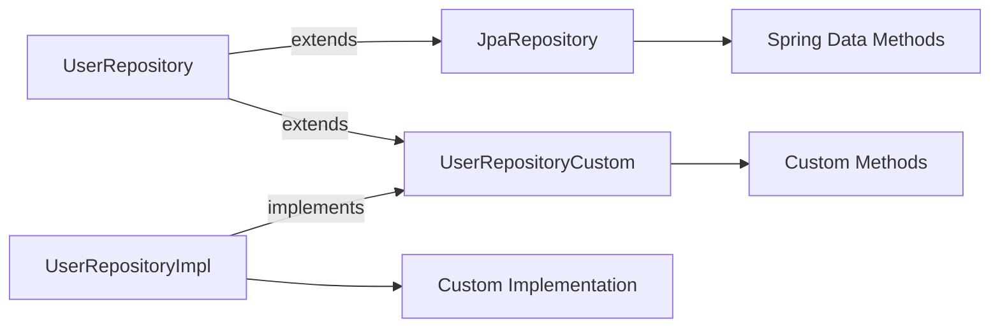
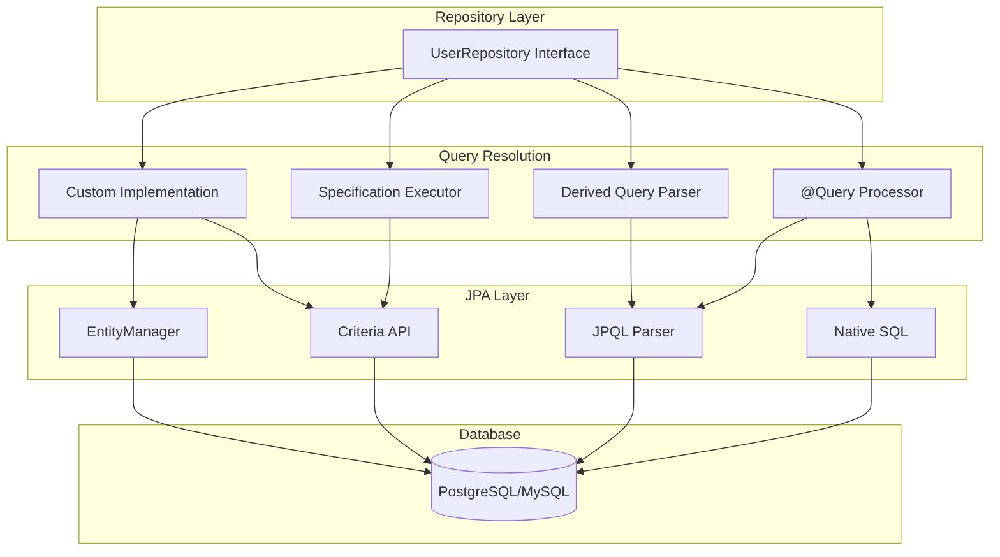

# How to Create Custom Spring Data Repository Methods

Author: [nawazdhandala](https://github.com/nawazdhandala)

Tags: Spring Boot, Spring Data JPA, Java, Backend Development, Database, Hibernate

Description: Learn how to extend Spring Data repositories with custom query methods, from simple derived queries to complex native SQL implementations with full production examples.

---

Spring Data JPA handles basic CRUD operations automatically, but real applications need custom queries for business logic. This guide covers every approach to creating custom repository methods, from simple naming conventions to complex native queries.

## How Spring Data Repository Methods Work

Spring Data generates query implementations at runtime based on method names and annotations. Understanding this flow helps you choose the right approach for each use case.

```mermaid
flowchart TD
    A[Repository Interface] --> B{Method Type?}
    B -->|Derived Query| C[Parse Method Name]
    B -->|@Query Annotation| D[Parse JPQL/SQL]
    B -->|Custom Implementation| E[Call Your Code]

    C --> F[Generate JPQL]
    F --> G[Execute Query]
    D --> G
    E --> G

    G --> H[Map Results to Entities]
    H --> I[Return to Caller]
```

## Derived Query Methods

The simplest approach is letting Spring Data derive queries from method names. The framework parses method names and generates JPQL automatically.

### Basic Entity Setup

First, define the entity that the repository will manage. This User entity includes common fields you would find in a production application.

```java
package com.example.repository;

import jakarta.persistence.*;
import java.time.LocalDateTime;

@Entity
@Table(name = "users")
public class User {

    @Id
    @GeneratedValue(strategy = GenerationType.IDENTITY)
    private Long id;

    @Column(nullable = false)
    private String email;

    @Column(name = "first_name")
    private String firstName;

    @Column(name = "last_name")
    private String lastName;

    @Enumerated(EnumType.STRING)
    private UserStatus status;

    @Column(name = "created_at")
    private LocalDateTime createdAt;

    @Column(name = "last_login")
    private LocalDateTime lastLogin;

    @Column(name = "login_count")
    private Integer loginCount;

    // Constructors, getters, and setters omitted for brevity
}

public enum UserStatus {
    ACTIVE, INACTIVE, SUSPENDED, PENDING_VERIFICATION
}
```

### Derived Query Examples

Spring Data parses method names to build queries. Each keyword maps to a JPQL clause.

```java
package com.example.repository;

import org.springframework.data.jpa.repository.JpaRepository;
import org.springframework.stereotype.Repository;
import java.time.LocalDateTime;
import java.util.List;
import java.util.Optional;

@Repository
public interface UserRepository extends JpaRepository<User, Long> {

    // Simple equality - finds user by exact email match
    // Generated JPQL: SELECT u FROM User u WHERE u.email = ?1
    Optional<User> findByEmail(String email);

    // Multiple conditions with AND
    // Generated JPQL: SELECT u FROM User u WHERE u.status = ?1 AND u.createdAt > ?2
    List<User> findByStatusAndCreatedAtAfter(UserStatus status, LocalDateTime date);

    // OR condition - finds users matching either criteria
    // Generated JPQL: SELECT u FROM User u WHERE u.firstName = ?1 OR u.lastName = ?2
    List<User> findByFirstNameOrLastName(String firstName, String lastName);

    // LIKE queries with different patterns
    // StartingWith adds % at the end: WHERE email LIKE 'value%'
    List<User> findByEmailStartingWith(String prefix);

    // EndingWith adds % at the beginning: WHERE email LIKE '%value'
    List<User> findByEmailEndingWith(String suffix);

    // Containing adds % on both sides: WHERE email LIKE '%value%'
    List<User> findByEmailContaining(String substring);

    // Range queries for dates and numbers
    // Generated JPQL: SELECT u FROM User u WHERE u.createdAt BETWEEN ?1 AND ?2
    List<User> findByCreatedAtBetween(LocalDateTime start, LocalDateTime end);

    // Greater than comparison
    // Generated JPQL: SELECT u FROM User u WHERE u.loginCount > ?1
    List<User> findByLoginCountGreaterThan(Integer count);

    // IN clause for multiple values
    // Generated JPQL: SELECT u FROM User u WHERE u.status IN ?1
    List<User> findByStatusIn(List<UserStatus> statuses);

    // NULL checks
    // Generated JPQL: SELECT u FROM User u WHERE u.lastLogin IS NULL
    List<User> findByLastLoginIsNull();

    // NOT NULL check
    // Generated JPQL: SELECT u FROM User u WHERE u.lastLogin IS NOT NULL
    List<User> findByLastLoginIsNotNull();

    // Ordering results
    // Generated JPQL: SELECT u FROM User u WHERE u.status = ?1 ORDER BY u.createdAt DESC
    List<User> findByStatusOrderByCreatedAtDesc(UserStatus status);

    // Limiting results - returns first 10 matches
    List<User> findTop10ByStatusOrderByLoginCountDesc(UserStatus status);

    // Count queries
    // Generated JPQL: SELECT COUNT(u) FROM User u WHERE u.status = ?1
    long countByStatus(UserStatus status);

    // Existence check
    // Generated JPQL: SELECT CASE WHEN COUNT(u) > 0 THEN true ELSE false END FROM User u WHERE u.email = ?1
    boolean existsByEmail(String email);

    // Delete queries
    // Deletes all users matching the criteria and returns count
    long deleteByStatus(UserStatus status);
}
```

### Method Name Keyword Reference

This table shows how method name parts translate to JPQL clauses.

| Keyword | JPQL Equivalent | Example |
|---------|-----------------|---------|
| `And` | `AND` | `findByFirstNameAndLastName` |
| `Or` | `OR` | `findByFirstNameOrLastName` |
| `Between` | `BETWEEN` | `findByCreatedAtBetween` |
| `LessThan` | `<` | `findByAgeLessThan` |
| `GreaterThan` | `>` | `findByAgeGreaterThan` |
| `Like` | `LIKE` | `findByNameLike` |
| `StartingWith` | `LIKE 'value%'` | `findByNameStartingWith` |
| `EndingWith` | `LIKE '%value'` | `findByNameEndingWith` |
| `Containing` | `LIKE '%value%'` | `findByNameContaining` |
| `In` | `IN` | `findByStatusIn` |
| `OrderBy` | `ORDER BY` | `findByStatusOrderByNameAsc` |
| `IsNull` | `IS NULL` | `findByDeletedAtIsNull` |
| `IsNotNull` | `IS NOT NULL` | `findByEmailIsNotNull` |
| `True` | `= true` | `findByActiveTrue` |
| `False` | `= false` | `findByActiveFalse` |

## Using @Query for JPQL

When method names become unwieldy or you need more complex queries, use the `@Query` annotation with JPQL.

```java
package com.example.repository;

import org.springframework.data.jpa.repository.JpaRepository;
import org.springframework.data.jpa.repository.Modifying;
import org.springframework.data.jpa.repository.Query;
import org.springframework.data.repository.query.Param;
import org.springframework.stereotype.Repository;
import java.time.LocalDateTime;
import java.util.List;

@Repository
public interface UserRepository extends JpaRepository<User, Long> {

    // Simple JPQL query with positional parameter
    // ?1 refers to the first method parameter
    @Query("SELECT u FROM User u WHERE u.email = ?1 AND u.status = ?2")
    User findActiveByEmail(String email, UserStatus status);

    // Named parameters are clearer when you have multiple parameters
    // :email and :status bind to @Param values
    @Query("SELECT u FROM User u WHERE u.email = :email AND u.status = :status")
    User findByEmailAndStatus(
        @Param("email") String email,
        @Param("status") UserStatus status
    );

    // JOIN queries for related entities
    // This assumes User has a @ManyToMany relationship with Role
    @Query("SELECT DISTINCT u FROM User u JOIN u.roles r WHERE r.name = :roleName")
    List<User> findByRoleName(@Param("roleName") String roleName);

    // Aggregation queries
    // Returns users who have logged in more than the average
    @Query("SELECT u FROM User u WHERE u.loginCount > (SELECT AVG(u2.loginCount) FROM User u2)")
    List<User> findUsersAboveAverageLogins();

    // Projections - return only specific fields
    // This returns a List of Object arrays with email and loginCount
    @Query("SELECT u.email, u.loginCount FROM User u WHERE u.status = :status")
    List<Object[]> findEmailAndLoginCountByStatus(@Param("status") UserStatus status);

    // Using CASE expressions for computed fields
    @Query("""
        SELECT u.email,
               CASE
                   WHEN u.loginCount > 100 THEN 'POWER_USER'
                   WHEN u.loginCount > 10 THEN 'REGULAR'
                   ELSE 'NEW'
               END as userType
        FROM User u
        """)
    List<Object[]> findUsersWithType();

    // Subqueries for complex filtering
    @Query("""
        SELECT u FROM User u
        WHERE u.id NOT IN (
            SELECT o.user.id FROM Order o
            WHERE o.createdAt > :since
        )
        """)
    List<User> findUsersWithoutRecentOrders(@Param("since") LocalDateTime since);

    // UPDATE queries must be marked with @Modifying
    // clearAutomatically ensures the persistence context is cleared after update
    @Modifying(clearAutomatically = true)
    @Query("UPDATE User u SET u.status = :status WHERE u.lastLogin < :threshold")
    int deactivateInactiveUsers(
        @Param("status") UserStatus status,
        @Param("threshold") LocalDateTime threshold
    );

    // DELETE queries also need @Modifying
    @Modifying
    @Query("DELETE FROM User u WHERE u.status = :status AND u.createdAt < :threshold")
    int deleteOldInactiveUsers(
        @Param("status") UserStatus status,
        @Param("threshold") LocalDateTime threshold
    );
}
```

## Native SQL Queries

When you need database-specific features or performance optimizations, use native SQL with `nativeQuery = true`.

```java
package com.example.repository;

import org.springframework.data.jpa.repository.JpaRepository;
import org.springframework.data.jpa.repository.Modifying;
import org.springframework.data.jpa.repository.Query;
import org.springframework.data.repository.query.Param;
import org.springframework.stereotype.Repository;
import java.util.List;

@Repository
public interface UserRepository extends JpaRepository<User, Long> {

    // Basic native query - use actual table and column names
    @Query(
        value = "SELECT * FROM users WHERE email = :email",
        nativeQuery = true
    )
    User findByEmailNative(@Param("email") String email);

    // PostgreSQL full-text search
    // to_tsvector creates a searchable document, to_tsquery parses the search term
    @Query(
        value = """
            SELECT * FROM users
            WHERE to_tsvector('english', first_name || ' ' || last_name)
                  @@ to_tsquery('english', :searchTerm)
            """,
        nativeQuery = true
    )
    List<User> searchByFullName(@Param("searchTerm") String searchTerm);

    // Window functions for analytics
    // ROW_NUMBER assigns a sequential number to each row within the partition
    @Query(
        value = """
            SELECT id, email, login_count,
                   ROW_NUMBER() OVER (ORDER BY login_count DESC) as rank
            FROM users
            WHERE status = :status
            LIMIT :limit
            """,
        nativeQuery = true
    )
    List<Object[]> findTopUsersByLoginCount(
        @Param("status") String status,
        @Param("limit") int limit
    );

    // Common Table Expression (CTE) for complex queries
    // WITH clause defines a temporary result set
    @Query(
        value = """
            WITH user_stats AS (
                SELECT user_id,
                       COUNT(*) as order_count,
                       SUM(total_amount) as total_spent
                FROM orders
                WHERE created_at > :since
                GROUP BY user_id
            )
            SELECT u.*, us.order_count, us.total_spent
            FROM users u
            JOIN user_stats us ON u.id = us.user_id
            WHERE us.total_spent > :minSpent
            ORDER BY us.total_spent DESC
            """,
        nativeQuery = true
    )
    List<Object[]> findHighValueCustomers(
        @Param("since") String since,
        @Param("minSpent") double minSpent
    );

    // Batch insert using native SQL for performance
    // This is much faster than saving entities one by one
    @Modifying
    @Query(
        value = """
            INSERT INTO users (email, first_name, last_name, status, created_at)
            SELECT unnest(:emails), unnest(:firstNames), unnest(:lastNames),
                   'PENDING_VERIFICATION', NOW()
            """,
        nativeQuery = true
    )
    void batchInsertUsers(
        @Param("emails") String[] emails,
        @Param("firstNames") String[] firstNames,
        @Param("lastNames") String[] lastNames
    );

    // JSON operations in PostgreSQL
    // The ->> operator extracts a JSON field as text
    @Query(
        value = """
            SELECT * FROM users
            WHERE preferences->>'theme' = :theme
            AND (preferences->>'notifications')::boolean = true
            """,
        nativeQuery = true
    )
    List<User> findByPreferences(@Param("theme") String theme);
}
```

## Custom Repository Implementation

For complex logic that cannot be expressed in a single query, create a custom implementation.



### Step 1: Define Custom Interface

Create an interface declaring your custom methods. This interface will be implemented manually.

```java
package com.example.repository;

import java.util.List;
import java.util.Map;

// Custom interface for methods that need manual implementation
public interface UserRepositoryCustom {

    // Complex search with dynamic criteria
    List<User> searchUsers(UserSearchCriteria criteria);

    // Bulk operations with custom logic
    int bulkUpdateStatus(List<Long> userIds, UserStatus newStatus);

    // Aggregation with complex business logic
    Map<UserStatus, Long> getUserCountsByStatus();

    // Custom pagination with sorting
    PagedResult<User> findUsersWithCursor(String cursor, int limit);
}
```

### Step 2: Create Implementation Class

The implementation class name must follow the pattern `{RepositoryName}Impl`. Spring Data finds it by naming convention.

```java
package com.example.repository;

import jakarta.persistence.EntityManager;
import jakarta.persistence.PersistenceContext;
import jakarta.persistence.TypedQuery;
import jakarta.persistence.criteria.*;
import org.springframework.stereotype.Repository;
import org.springframework.transaction.annotation.Transactional;
import java.util.*;

// The class name MUST end with "Impl" and match the custom interface name
@Repository
public class UserRepositoryImpl implements UserRepositoryCustom {

    // EntityManager is the JPA interface for database operations
    @PersistenceContext
    private EntityManager entityManager;

    @Override
    public List<User> searchUsers(UserSearchCriteria criteria) {
        // CriteriaBuilder creates query components
        CriteriaBuilder cb = entityManager.getCriteriaBuilder();
        CriteriaQuery<User> query = cb.createQuery(User.class);
        Root<User> user = query.from(User.class);

        // Build predicates dynamically based on criteria
        List<Predicate> predicates = new ArrayList<>();

        // Only add predicates for non-null criteria
        if (criteria.getEmail() != null) {
            predicates.add(
                cb.like(cb.lower(user.get("email")),
                        "%" + criteria.getEmail().toLowerCase() + "%")
            );
        }

        if (criteria.getStatus() != null) {
            predicates.add(cb.equal(user.get("status"), criteria.getStatus()));
        }

        if (criteria.getCreatedAfter() != null) {
            predicates.add(
                cb.greaterThan(user.get("createdAt"), criteria.getCreatedAfter())
            );
        }

        if (criteria.getCreatedBefore() != null) {
            predicates.add(
                cb.lessThan(user.get("createdAt"), criteria.getCreatedBefore())
            );
        }

        if (criteria.getMinLoginCount() != null) {
            predicates.add(
                cb.greaterThanOrEqualTo(user.get("loginCount"), criteria.getMinLoginCount())
            );
        }

        // Apply all predicates with AND
        if (!predicates.isEmpty()) {
            query.where(cb.and(predicates.toArray(new Predicate[0])));
        }

        // Apply sorting
        if (criteria.getSortField() != null) {
            Path<Object> sortPath = user.get(criteria.getSortField());
            if (criteria.isSortDescending()) {
                query.orderBy(cb.desc(sortPath));
            } else {
                query.orderBy(cb.asc(sortPath));
            }
        }

        // Execute with pagination
        TypedQuery<User> typedQuery = entityManager.createQuery(query);

        if (criteria.getOffset() != null) {
            typedQuery.setFirstResult(criteria.getOffset());
        }

        if (criteria.getLimit() != null) {
            typedQuery.setMaxResults(criteria.getLimit());
        }

        return typedQuery.getResultList();
    }

    @Override
    @Transactional
    public int bulkUpdateStatus(List<Long> userIds, UserStatus newStatus) {
        // For large lists, process in batches to avoid query size limits
        int batchSize = 1000;
        int totalUpdated = 0;

        for (int i = 0; i < userIds.size(); i += batchSize) {
            List<Long> batch = userIds.subList(
                i,
                Math.min(i + batchSize, userIds.size())
            );

            // Build and execute batch update
            CriteriaBuilder cb = entityManager.getCriteriaBuilder();
            CriteriaUpdate<User> update = cb.createCriteriaUpdate(User.class);
            Root<User> user = update.from(User.class);

            update.set(user.get("status"), newStatus);
            update.where(user.get("id").in(batch));

            totalUpdated += entityManager.createQuery(update).executeUpdate();
        }

        return totalUpdated;
    }

    @Override
    public Map<UserStatus, Long> getUserCountsByStatus() {
        // Use JPQL for aggregation queries
        String jpql = """
            SELECT u.status, COUNT(u)
            FROM User u
            GROUP BY u.status
            """;

        List<Object[]> results = entityManager.createQuery(jpql, Object[].class)
            .getResultList();

        Map<UserStatus, Long> counts = new EnumMap<>(UserStatus.class);
        for (Object[] row : results) {
            counts.put((UserStatus) row[0], (Long) row[1]);
        }

        return counts;
    }

    @Override
    public PagedResult<User> findUsersWithCursor(String cursor, int limit) {
        // Cursor-based pagination is more efficient for large datasets
        // The cursor is the last seen ID encoded in base64

        Long lastId = cursor != null
            ? Long.parseLong(new String(Base64.getDecoder().decode(cursor)))
            : 0L;

        String jpql = """
            SELECT u FROM User u
            WHERE u.id > :lastId
            ORDER BY u.id ASC
            """;

        List<User> users = entityManager.createQuery(jpql, User.class)
            .setParameter("lastId", lastId)
            .setMaxResults(limit + 1)  // Fetch one extra to check if there are more
            .getResultList();

        boolean hasMore = users.size() > limit;
        if (hasMore) {
            users = users.subList(0, limit);
        }

        String nextCursor = null;
        if (hasMore && !users.isEmpty()) {
            Long lastSeenId = users.get(users.size() - 1).getId();
            nextCursor = Base64.getEncoder().encodeToString(lastSeenId.toString().getBytes());
        }

        return new PagedResult<>(users, nextCursor, hasMore);
    }
}
```

### Step 3: Extend Your Repository

The main repository interface extends both JpaRepository and your custom interface.

```java
package com.example.repository;

import org.springframework.data.jpa.repository.JpaRepository;
import org.springframework.stereotype.Repository;

// Extend both JpaRepository and your custom interface
@Repository
public interface UserRepository extends JpaRepository<User, Long>, UserRepositoryCustom {

    // Standard derived queries
    Optional<User> findByEmail(String email);

    // @Query methods
    @Query("SELECT u FROM User u WHERE u.status = :status")
    List<User> findByStatus(@Param("status") UserStatus status);

    // Custom methods from UserRepositoryCustom are automatically available
    // - searchUsers(UserSearchCriteria criteria)
    // - bulkUpdateStatus(List<Long> userIds, UserStatus newStatus)
    // - getUserCountsByStatus()
    // - findUsersWithCursor(String cursor, int limit)
}
```

### Supporting Classes

Define the search criteria and result objects used by the custom implementation.

```java
package com.example.repository;

import java.time.LocalDateTime;

// Search criteria object for dynamic queries
public class UserSearchCriteria {
    private String email;
    private UserStatus status;
    private LocalDateTime createdAfter;
    private LocalDateTime createdBefore;
    private Integer minLoginCount;
    private String sortField;
    private boolean sortDescending;
    private Integer offset;
    private Integer limit;

    // Builder pattern for cleaner construction
    public static Builder builder() {
        return new Builder();
    }

    public static class Builder {
        private final UserSearchCriteria criteria = new UserSearchCriteria();

        public Builder email(String email) {
            criteria.email = email;
            return this;
        }

        public Builder status(UserStatus status) {
            criteria.status = status;
            return this;
        }

        public Builder createdAfter(LocalDateTime date) {
            criteria.createdAfter = date;
            return this;
        }

        public Builder createdBefore(LocalDateTime date) {
            criteria.createdBefore = date;
            return this;
        }

        public Builder minLoginCount(Integer count) {
            criteria.minLoginCount = count;
            return this;
        }

        public Builder sortBy(String field, boolean descending) {
            criteria.sortField = field;
            criteria.sortDescending = descending;
            return this;
        }

        public Builder paginate(int offset, int limit) {
            criteria.offset = offset;
            criteria.limit = limit;
            return this;
        }

        public UserSearchCriteria build() {
            return criteria;
        }
    }

    // Getters omitted for brevity
}
```

```java
package com.example.repository;

import java.util.List;

// Generic paged result for cursor-based pagination
public class PagedResult<T> {
    private final List<T> items;
    private final String nextCursor;
    private final boolean hasMore;

    public PagedResult(List<T> items, String nextCursor, boolean hasMore) {
        this.items = items;
        this.nextCursor = nextCursor;
        this.hasMore = hasMore;
    }

    public List<T> getItems() {
        return items;
    }

    public String getNextCursor() {
        return nextCursor;
    }

    public boolean hasMore() {
        return hasMore;
    }
}
```

## Projections for Optimized Queries

When you only need specific fields, projections avoid loading entire entities.

### Interface-Based Projections

Define interfaces with getter methods for the fields you need. Spring Data generates implementations automatically.

```java
package com.example.repository;

// Interface projection - Spring creates proxy that returns only these fields
public interface UserSummary {
    String getEmail();
    String getFirstName();
    String getLastName();
    UserStatus getStatus();

    // Computed property using SpEL
    @Value("#{target.firstName + ' ' + target.lastName}")
    String getFullName();
}

// Nested projections for related entities
public interface UserWithOrders {
    String getEmail();
    List<OrderSummary> getOrders();

    interface OrderSummary {
        Long getId();
        BigDecimal getTotalAmount();
        LocalDateTime getCreatedAt();
    }
}
```

```java
package com.example.repository;

import org.springframework.data.jpa.repository.JpaRepository;
import org.springframework.stereotype.Repository;
import java.util.List;

@Repository
public interface UserRepository extends JpaRepository<User, Long> {

    // Return projections instead of entities
    List<UserSummary> findByStatus(UserStatus status);

    // Projection with @Query
    @Query("SELECT u FROM User u WHERE u.createdAt > :since")
    List<UserSummary> findRecentUserSummaries(@Param("since") LocalDateTime since);

    // Dynamic projections - caller chooses the return type
    <T> List<T> findByStatus(UserStatus status, Class<T> type);
}
```

### Class-Based Projections (DTOs)

For more control, define concrete DTO classes. The constructor parameters must match the query result order.

```java
package com.example.dto;

// DTO class for projections
public class UserDTO {
    private final String email;
    private final String fullName;
    private final int loginCount;

    // Constructor parameters must match query SELECT order
    public UserDTO(String email, String firstName, String lastName, int loginCount) {
        this.email = email;
        this.fullName = firstName + " " + lastName;
        this.loginCount = loginCount;
    }

    // Getters
    public String getEmail() { return email; }
    public String getFullName() { return fullName; }
    public int getLoginCount() { return loginCount; }
}
```

```java
package com.example.repository;

import org.springframework.data.jpa.repository.JpaRepository;
import org.springframework.data.jpa.repository.Query;
import org.springframework.stereotype.Repository;
import java.util.List;

@Repository
public interface UserRepository extends JpaRepository<User, Long> {

    // Use constructor expression to create DTOs
    @Query("""
        SELECT new com.example.dto.UserDTO(
            u.email, u.firstName, u.lastName, u.loginCount
        )
        FROM User u
        WHERE u.status = :status
        """)
    List<UserDTO> findUserDTOsByStatus(@Param("status") UserStatus status);
}
```

## Specifications for Reusable Query Logic

JPA Specifications let you build reusable, composable query predicates that can be combined at runtime.

```java
package com.example.specification;

import org.springframework.data.jpa.domain.Specification;
import java.time.LocalDateTime;

// Static factory methods for reusable query predicates
public class UserSpecifications {

    // Find users with matching email pattern
    public static Specification<User> emailContains(String email) {
        return (root, query, cb) -> {
            if (email == null || email.isBlank()) {
                return cb.conjunction();  // Always true - no filtering
            }
            return cb.like(
                cb.lower(root.get("email")),
                "%" + email.toLowerCase() + "%"
            );
        };
    }

    // Find users with specific status
    public static Specification<User> hasStatus(UserStatus status) {
        return (root, query, cb) -> {
            if (status == null) {
                return cb.conjunction();
            }
            return cb.equal(root.get("status"), status);
        };
    }

    // Find users created after a date
    public static Specification<User> createdAfter(LocalDateTime date) {
        return (root, query, cb) -> {
            if (date == null) {
                return cb.conjunction();
            }
            return cb.greaterThan(root.get("createdAt"), date);
        };
    }

    // Find users with login count in range
    public static Specification<User> loginCountBetween(Integer min, Integer max) {
        return (root, query, cb) -> {
            if (min == null && max == null) {
                return cb.conjunction();
            }
            if (min != null && max != null) {
                return cb.between(root.get("loginCount"), min, max);
            }
            if (min != null) {
                return cb.greaterThanOrEqualTo(root.get("loginCount"), min);
            }
            return cb.lessThanOrEqualTo(root.get("loginCount"), max);
        };
    }

    // Find users with a specific role (demonstrates JOIN)
    public static Specification<User> hasRole(String roleName) {
        return (root, query, cb) -> {
            if (roleName == null) {
                return cb.conjunction();
            }
            // Join to roles table
            var roles = root.join("roles");
            return cb.equal(roles.get("name"), roleName);
        };
    }

    // Find users who have placed orders (EXISTS subquery)
    public static Specification<User> hasOrders() {
        return (root, query, cb) -> {
            var subquery = query.subquery(Long.class);
            var order = subquery.from(Order.class);
            subquery.select(cb.literal(1L))
                    .where(cb.equal(order.get("user"), root));
            return cb.exists(subquery);
        };
    }
}
```

### Using Specifications

Extend JpaSpecificationExecutor to enable specification-based queries.

```java
package com.example.repository;

import org.springframework.data.jpa.repository.JpaRepository;
import org.springframework.data.jpa.repository.JpaSpecificationExecutor;
import org.springframework.stereotype.Repository;

// Extend JpaSpecificationExecutor to use specifications
@Repository
public interface UserRepository
    extends JpaRepository<User, Long>, JpaSpecificationExecutor<User> {
}
```

```java
package com.example.service;

import org.springframework.data.domain.Page;
import org.springframework.data.domain.PageRequest;
import org.springframework.data.domain.Sort;
import org.springframework.data.jpa.domain.Specification;
import org.springframework.stereotype.Service;

import static com.example.specification.UserSpecifications.*;

@Service
public class UserService {

    private final UserRepository userRepository;

    public UserService(UserRepository userRepository) {
        this.userRepository = userRepository;
    }

    public Page<User> searchUsers(UserSearchRequest request) {
        // Combine specifications dynamically
        Specification<User> spec = Specification
            .where(emailContains(request.getEmail()))
            .and(hasStatus(request.getStatus()))
            .and(createdAfter(request.getCreatedAfter()))
            .and(loginCountBetween(request.getMinLogins(), request.getMaxLogins()));

        // Add role filter if specified
        if (request.getRoleName() != null) {
            spec = spec.and(hasRole(request.getRoleName()));
        }

        // Add order filter if specified
        if (request.getHasOrders() != null && request.getHasOrders()) {
            spec = spec.and(hasOrders());
        }

        // Create pageable with sorting
        PageRequest pageable = PageRequest.of(
            request.getPage(),
            request.getSize(),
            Sort.by(Sort.Direction.DESC, "createdAt")
        );

        return userRepository.findAll(spec, pageable);
    }
}
```

## Query Method Architecture

This diagram shows how different query approaches fit into the Spring Data architecture.



## Best Practices

### Query Performance

```java
package com.example.repository;

import org.springframework.data.jpa.repository.JpaRepository;
import org.springframework.data.jpa.repository.Query;
import org.springframework.data.jpa.repository.QueryHints;
import org.springframework.stereotype.Repository;
import jakarta.persistence.QueryHint;
import java.util.stream.Stream;

@Repository
public interface UserRepository extends JpaRepository<User, Long> {

    // Use fetch joins to avoid N+1 queries
    // JOIN FETCH loads related entities in a single query
    @Query("""
        SELECT DISTINCT u FROM User u
        LEFT JOIN FETCH u.roles
        LEFT JOIN FETCH u.addresses
        WHERE u.status = :status
        """)
    List<User> findByStatusWithRolesAndAddresses(@Param("status") UserStatus status);

    // Stream large result sets to avoid loading everything into memory
    // Must be called within a transaction
    @Query("SELECT u FROM User u WHERE u.status = :status")
    Stream<User> streamByStatus(@Param("status") UserStatus status);

    // Add query hints for database-level optimization
    @QueryHints({
        @QueryHint(name = "org.hibernate.readOnly", value = "true"),
        @QueryHint(name = "org.hibernate.fetchSize", value = "100")
    })
    @Query("SELECT u FROM User u WHERE u.createdAt > :date")
    List<User> findRecentUsersReadOnly(@Param("date") LocalDateTime date);
}
```

### Transaction Management

```java
package com.example.service;

import org.springframework.stereotype.Service;
import org.springframework.transaction.annotation.Transactional;

@Service
public class UserService {

    private final UserRepository userRepository;

    public UserService(UserRepository userRepository) {
        this.userRepository = userRepository;
    }

    // Read-only transaction for queries - enables optimizations
    @Transactional(readOnly = true)
    public List<User> getActiveUsers() {
        return userRepository.findByStatus(UserStatus.ACTIVE);
    }

    // Write transaction for modifications
    @Transactional
    public void deactivateUser(Long userId) {
        User user = userRepository.findById(userId)
            .orElseThrow(() -> new UserNotFoundException(userId));
        user.setStatus(UserStatus.INACTIVE);
        userRepository.save(user);
    }

    // Streaming requires an active transaction
    @Transactional(readOnly = true)
    public void processAllUsers() {
        try (Stream<User> users = userRepository.streamByStatus(UserStatus.ACTIVE)) {
            users.forEach(this::processUser);
        }
    }
}
```

### Testing Custom Repositories

```java
package com.example.repository;

import org.junit.jupiter.api.Test;
import org.springframework.beans.factory.annotation.Autowired;
import org.springframework.boot.test.autoconfigure.orm.jpa.DataJpaTest;
import org.springframework.boot.test.autoconfigure.orm.jpa.TestEntityManager;
import java.time.LocalDateTime;
import java.util.List;

import static org.assertj.core.api.Assertions.assertThat;

// DataJpaTest configures an in-memory database and Spring Data
@DataJpaTest
class UserRepositoryTest {

    @Autowired
    private TestEntityManager entityManager;

    @Autowired
    private UserRepository userRepository;

    @Test
    void searchUsers_shouldFilterByMultipleCriteria() {
        // Arrange - create test data
        User activeUser = createUser("active@test.com", UserStatus.ACTIVE, 50);
        User inactiveUser = createUser("inactive@test.com", UserStatus.INACTIVE, 10);
        User newUser = createUser("new@test.com", UserStatus.ACTIVE, 5);

        entityManager.persist(activeUser);
        entityManager.persist(inactiveUser);
        entityManager.persist(newUser);
        entityManager.flush();

        // Act - search with criteria
        UserSearchCriteria criteria = UserSearchCriteria.builder()
            .status(UserStatus.ACTIVE)
            .minLoginCount(10)
            .build();

        List<User> results = userRepository.searchUsers(criteria);

        // Assert
        assertThat(results)
            .hasSize(1)
            .extracting(User::getEmail)
            .containsExactly("active@test.com");
    }

    @Test
    void findByStatusWithRolesAndAddresses_shouldEagerLoadRelations() {
        // Arrange
        User user = createUser("test@test.com", UserStatus.ACTIVE, 10);
        Role role = new Role("ADMIN");
        user.getRoles().add(role);

        entityManager.persist(role);
        entityManager.persist(user);
        entityManager.flush();
        entityManager.clear();  // Clear persistence context to test eager loading

        // Act
        List<User> results = userRepository.findByStatusWithRolesAndAddresses(UserStatus.ACTIVE);

        // Assert - roles should be loaded without additional queries
        assertThat(results).hasSize(1);
        assertThat(results.get(0).getRoles())
            .hasSize(1)
            .extracting(Role::getName)
            .containsExactly("ADMIN");
    }

    private User createUser(String email, UserStatus status, int loginCount) {
        User user = new User();
        user.setEmail(email);
        user.setStatus(status);
        user.setLoginCount(loginCount);
        user.setCreatedAt(LocalDateTime.now());
        return user;
    }
}
```

## Summary

| Approach | Use Case | Complexity |
|----------|----------|------------|
| **Derived Queries** | Simple lookups with 1-3 conditions | Low |
| **@Query JPQL** | Complex queries, joins, aggregations | Medium |
| **Native SQL** | Database-specific features, performance | Medium |
| **Custom Implementation** | Multi-step logic, external integrations | High |
| **Specifications** | Reusable, composable query predicates | Medium |
| **Projections** | Optimized reads for specific fields | Low |

Start with derived queries for simple cases. Move to `@Query` when method names become unreadable. Use custom implementations for complex business logic. Use specifications when you need to combine predicates dynamically based on user input.

Each approach has its place. The key is choosing the right tool for each query requirement while keeping your repository interfaces clean and maintainable.
