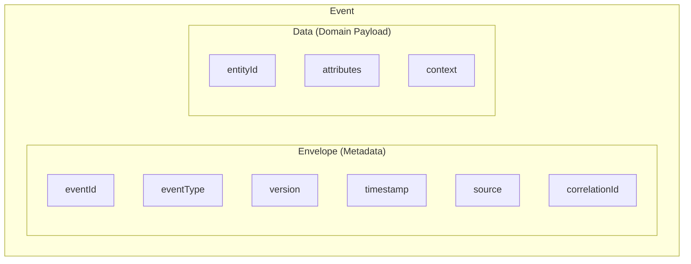
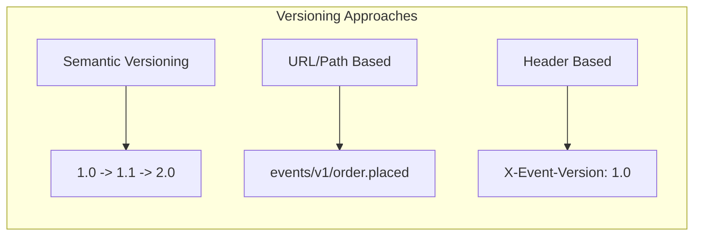
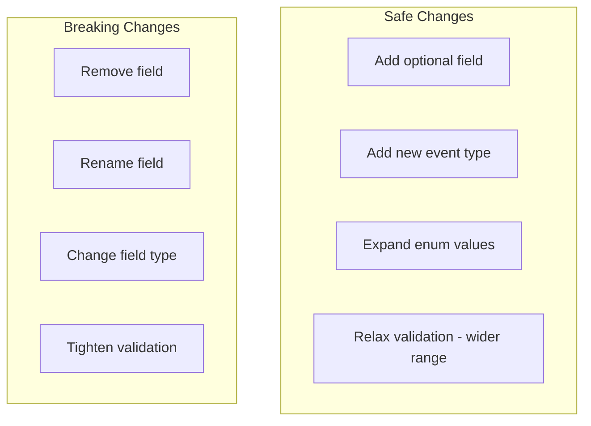
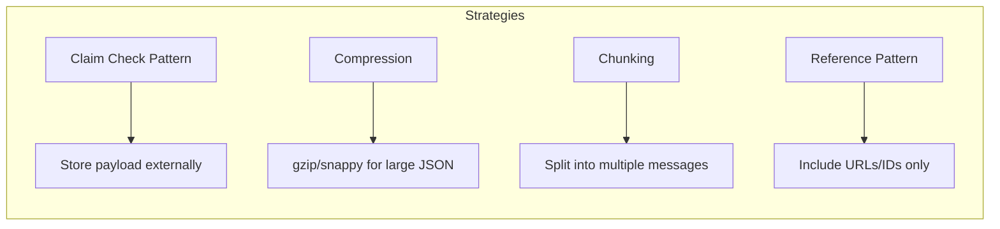
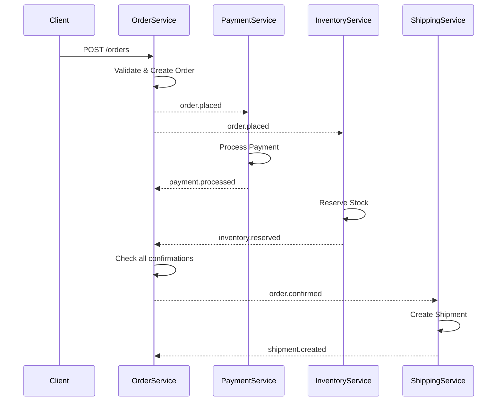

# How to Create Event Payload Design: A Practical Guide

Author: [nawazdhandala](https://github.com/nawazdhandala)

Tags: Event-Driven Architecture, Software Design, API Design, TypeScript, System Design, Microservices

Description: Learn how to design robust event payloads for distributed systems. This guide covers payload structure, versioning strategies, schema validation, and production-ready patterns with practical TypeScript examples.

---

Event-driven systems live or die by the quality of their payloads. A poorly designed event payload creates coupling nightmares, versioning headaches, and debugging black holes. A well-designed payload is self-describing, backward compatible, and a joy to work with.

This guide walks through the principles and patterns for creating event payloads that scale with your system.

---

## Table of Contents

1. What Makes a Good Event Payload
2. Anatomy of an Event Payload
3. Payload Structure Patterns
4. Schema Design with TypeScript and JSON Schema
5. Versioning Strategies
6. Envelope vs Embedded Metadata
7. Handling Large Payloads
8. Validation and Error Handling
9. Real-World Examples
10. Anti-Patterns to Avoid
11. Testing Event Payloads
12. Summary

---

## 1. What Makes a Good Event Payload

Before diving into structure, let's establish the goals:

| Goal | Why It Matters |
|------|----------------|
| Self-describing | Consumers can process without external lookups |
| Immutable | Events represent facts that happened; never modify after publish |
| Versioned | Allows schema evolution without breaking consumers |
| Minimal but complete | Contains everything needed, nothing more |
| Idempotent-friendly | Includes IDs for deduplication |
| Traceable | Carries correlation IDs for debugging |

A payload that hits all these marks is easy to produce, consume, debug, and evolve.

---

## 2. Anatomy of an Event Payload

Every well-designed event payload has two distinct parts:



The **envelope** is infrastructure-level metadata that every event carries regardless of domain. The **data** section holds the domain-specific information.

---

## 3. Payload Structure Patterns

### Pattern 1: Event Notification (Thin Events)

Thin events signal that something happened but contain minimal data. Consumers fetch details if needed.

```jsonc
{
  "eventId": "evt_a1b2c3d4",
  "eventType": "order.placed",
  "version": "1.0",
  "timestamp": "2026-01-30T14:32:00.000Z",
  "source": "order-service",
  "data": {
    "orderId": "ord_xyz789"
  }
}
```

**When to use:** When payload size matters, when data changes frequently, or when not all consumers need full details.

### Pattern 2: Event-Carried State Transfer (Fat Events)

Fat events include all relevant state, allowing consumers to process without callbacks.

```jsonc
{
  "eventId": "evt_a1b2c3d4",
  "eventType": "order.placed",
  "version": "1.0",
  "timestamp": "2026-01-30T14:32:00.000Z",
  "source": "order-service",
  "data": {
    "orderId": "ord_xyz789",
    "customerId": "cust_abc123",
    "items": [
      { "sku": "SKU-001", "quantity": 2, "price": 29.99 },
      { "sku": "SKU-002", "quantity": 1, "price": 49.99 }
    ],
    "total": 109.97,
    "currency": "USD",
    "shippingAddress": {
      "street": "123 Main St",
      "city": "Austin",
      "state": "TX",
      "postalCode": "78701"
    }
  }
}
```

**When to use:** When consumers need full context, when you want to reduce coupling to source APIs, or for audit/replay scenarios.

### Pattern 3: Delta Events

Delta events capture what changed rather than full state.

```jsonc
{
  "eventId": "evt_e5f6g7h8",
  "eventType": "order.updated",
  "version": "1.0",
  "timestamp": "2026-01-30T15:10:00.000Z",
  "source": "order-service",
  "data": {
    "orderId": "ord_xyz789",
    "changes": [
      { "field": "status", "from": "pending", "to": "confirmed" },
      { "field": "confirmedAt", "from": null, "to": "2026-01-30T15:10:00.000Z" }
    ]
  }
}
```

**When to use:** When you need audit trails, when bandwidth is constrained, or when consumers only care about what changed.

---

## 4. Schema Design with TypeScript and JSON Schema

### TypeScript Types for Event Payloads

Define your event types with strong typing to catch errors at compile time.

```typescript
// event-types.ts
// Base envelope that all events share - provides consistent metadata structure

interface EventEnvelope<T extends string, D> {
  // Unique identifier for deduplication and idempotency
  eventId: string;
  // Dot-notation event type for routing (e.g., "order.placed")
  eventType: T;
  // Semantic version of the payload schema
  version: string;
  // ISO 8601 timestamp when the event occurred
  timestamp: string;
  // Service or component that produced the event
  source: string;
  // Optional ID to correlate related events across services
  correlationId?: string;
  // Optional ID to link to the triggering event (for event chains)
  causationId?: string;
  // Domain-specific payload
  data: D;
}

// Domain-specific data types
interface OrderPlacedData {
  orderId: string;
  customerId: string;
  items: OrderItem[];
  total: number;
  currency: string;
}

interface OrderItem {
  sku: string;
  quantity: number;
  price: number;
}

// Concrete event type combining envelope and data
type OrderPlacedEvent = EventEnvelope<'order.placed', OrderPlacedData>;

// Example of creating a typed event
function createOrderPlacedEvent(data: OrderPlacedData): OrderPlacedEvent {
  return {
    eventId: `evt_${crypto.randomUUID()}`,
    eventType: 'order.placed',
    version: '1.0',
    timestamp: new Date().toISOString(),
    source: 'order-service',
    data,
  };
}
```

### JSON Schema for Validation

Use JSON Schema for runtime validation, especially at system boundaries.

```typescript
// schemas/order-placed.schema.ts
// JSON Schema provides runtime validation that TypeScript cannot

export const orderPlacedSchema = {
  $schema: 'https://json-schema.org/draft/2020-12/schema',
  $id: 'https://api.example.com/schemas/order-placed-v1.json',
  type: 'object',
  required: ['eventId', 'eventType', 'version', 'timestamp', 'source', 'data'],
  properties: {
    eventId: {
      type: 'string',
      pattern: '^evt_[a-f0-9-]+$',
      description: 'Unique event identifier for idempotency',
    },
    eventType: {
      const: 'order.placed',
    },
    version: {
      type: 'string',
      pattern: '^\\d+\\.\\d+$',
    },
    timestamp: {
      type: 'string',
      format: 'date-time',
    },
    source: {
      type: 'string',
      minLength: 1,
    },
    correlationId: {
      type: 'string',
    },
    data: {
      type: 'object',
      required: ['orderId', 'customerId', 'items', 'total', 'currency'],
      properties: {
        orderId: { type: 'string', pattern: '^ord_[a-z0-9]+$' },
        customerId: { type: 'string', pattern: '^cust_[a-z0-9]+$' },
        items: {
          type: 'array',
          minItems: 1,
          items: {
            type: 'object',
            required: ['sku', 'quantity', 'price'],
            properties: {
              sku: { type: 'string' },
              quantity: { type: 'integer', minimum: 1 },
              price: { type: 'number', minimum: 0 },
            },
          },
        },
        total: { type: 'number', minimum: 0 },
        currency: { type: 'string', pattern: '^[A-Z]{3}$' },
      },
    },
  },
};
```

---

## 5. Versioning Strategies

Schema evolution is inevitable. Plan for it from day one.



### Strategy 1: Embedded Version Field

The version lives inside the payload itself.

```typescript
// version-handler.ts
// Route events to appropriate handlers based on version

type EventHandler<T> = (event: T) => Promise<void>;

interface VersionedHandlers {
  [version: string]: EventHandler<any>;
}

// Registry maps event types to version-specific handlers
const handlers: Map<string, VersionedHandlers> = new Map();

// Register a handler for a specific event type and version
function registerHandler<T>(
  eventType: string,
  version: string,
  handler: EventHandler<T>
): void {
  const existing = handlers.get(eventType) || {};
  existing[version] = handler;
  handlers.set(eventType, existing);
}

// Dispatch incoming events to the correct handler
async function dispatch(event: { eventType: string; version: string }): Promise<void> {
  const versionedHandlers = handlers.get(event.eventType);

  if (!versionedHandlers) {
    throw new Error(`No handlers registered for ${event.eventType}`);
  }

  // Try exact version match first
  let handler = versionedHandlers[event.version];

  // Fall back to major version match (1.2 -> 1.0)
  if (!handler) {
    const major = event.version.split('.')[0];
    const fallbackVersion = Object.keys(versionedHandlers)
      .filter(v => v.startsWith(major))
      .sort()
      .pop();

    if (fallbackVersion) {
      handler = versionedHandlers[fallbackVersion];
    }
  }

  if (!handler) {
    throw new Error(`No handler for ${event.eventType} v${event.version}`);
  }

  await handler(event);
}
```

### Strategy 2: Schema Registry

For larger systems, use a schema registry to manage versions centrally.

```typescript
// schema-registry.ts
// Centralized schema management for event validation

interface SchemaRegistryClient {
  getSchema(eventType: string, version: string): Promise<object>;
  registerSchema(eventType: string, version: string, schema: object): Promise<void>;
  checkCompatibility(eventType: string, newSchema: object): Promise<boolean>;
}

// Simple in-memory registry for development (use Confluent Schema Registry in production)
class InMemorySchemaRegistry implements SchemaRegistryClient {
  private schemas: Map<string, object> = new Map();

  private key(eventType: string, version: string): string {
    return `${eventType}:${version}`;
  }

  async getSchema(eventType: string, version: string): Promise<object> {
    const schema = this.schemas.get(this.key(eventType, version));
    if (!schema) {
      throw new Error(`Schema not found: ${eventType} v${version}`);
    }
    return schema;
  }

  async registerSchema(eventType: string, version: string, schema: object): Promise<void> {
    this.schemas.set(this.key(eventType, version), schema);
  }

  async checkCompatibility(eventType: string, newSchema: object): Promise<boolean> {
    // In production, implement backward/forward compatibility checks
    // For example: new fields must be optional, removed fields must have defaults
    return true;
  }
}
```

### Backward Compatible Changes

These changes are safe and do not require version bumps:



---

## 6. Envelope vs Embedded Metadata

Should metadata live in the envelope or be embedded in the message body?

### Envelope Approach (Recommended for Most Cases)

Keep metadata in transport-level headers or a wrapper object.

```typescript
// kafka-producer.ts
// Separate envelope metadata from domain data

import { Kafka, Message } from 'kafkajs';

interface EventMetadata {
  eventId: string;
  eventType: string;
  version: string;
  timestamp: string;
  source: string;
  correlationId?: string;
}

async function publishEvent<T>(
  topic: string,
  metadata: EventMetadata,
  data: T
): Promise<void> {
  const kafka = new Kafka({ brokers: ['localhost:9092'] });
  const producer = kafka.producer();

  await producer.connect();

  // Metadata goes in headers (accessible without deserializing body)
  // Data goes in value (only parsed when needed)
  const message: Message = {
    key: metadata.eventId,
    value: JSON.stringify(data),
    headers: {
      'event-id': metadata.eventId,
      'event-type': metadata.eventType,
      'event-version': metadata.version,
      'event-timestamp': metadata.timestamp,
      'event-source': metadata.source,
      ...(metadata.correlationId && { 'correlation-id': metadata.correlationId }),
    },
  };

  await producer.send({ topic, messages: [message] });
  await producer.disconnect();
}
```

### When to Embed Metadata

Embed when:
- Your message broker does not support headers
- You need the event to be self-contained for storage/replay
- Consumers need all context in one place

```typescript
// embedded-event.ts
// Self-contained event with embedded metadata

interface SelfContainedEvent<T> {
  metadata: {
    eventId: string;
    eventType: string;
    version: string;
    timestamp: string;
    source: string;
    correlationId?: string;
  };
  data: T;
}

// Serialize the complete event for systems that do not support headers
function serializeEvent<T>(event: SelfContainedEvent<T>): string {
  return JSON.stringify(event);
}
```

---

## 7. Handling Large Payloads

Large payloads cause problems: increased latency, memory pressure, and potential message size limits.



### Claim Check Pattern

Store large data externally; include a reference in the event.

```typescript
// claim-check.ts
// Store large payloads in blob storage, reference in event

import { S3Client, PutObjectCommand, GetObjectCommand } from '@aws-sdk/client-s3';

interface ClaimCheckEvent {
  eventId: string;
  eventType: string;
  version: string;
  timestamp: string;
  source: string;
  data: {
    // Small, essential fields inline
    orderId: string;
    customerId: string;
    // Large data referenced via claim check
    claimCheck: {
      store: 's3';
      bucket: string;
      key: string;
      contentType: string;
    };
  };
}

const s3 = new S3Client({ region: 'us-east-1' });

// Store large payload and return claim check reference
async function storePayload(
  eventId: string,
  payload: object
): Promise<ClaimCheckEvent['data']['claimCheck']> {
  const bucket = process.env.CLAIM_CHECK_BUCKET || 'event-payloads';
  const key = `events/${eventId}/payload.json`;

  await s3.send(new PutObjectCommand({
    Bucket: bucket,
    Key: key,
    Body: JSON.stringify(payload),
    ContentType: 'application/json',
  }));

  return {
    store: 's3',
    bucket,
    key,
    contentType: 'application/json',
  };
}

// Retrieve payload from claim check reference
async function retrievePayload<T>(
  claimCheck: ClaimCheckEvent['data']['claimCheck']
): Promise<T> {
  const response = await s3.send(new GetObjectCommand({
    Bucket: claimCheck.bucket,
    Key: claimCheck.key,
  }));

  const body = await response.Body?.transformToString();
  if (!body) throw new Error('Empty payload');

  return JSON.parse(body) as T;
}
```

---

## 8. Validation and Error Handling

Validate events at boundaries: producer side before publishing, consumer side after receiving.

```typescript
// event-validator.ts
// Validate events using JSON Schema with Ajv

import Ajv, { ValidateFunction, ErrorObject } from 'ajv';
import addFormats from 'ajv-formats';

const ajv = new Ajv({ allErrors: true, strict: true });
addFormats(ajv);

// Cache compiled validators for performance
const validators: Map<string, ValidateFunction> = new Map();

interface ValidationResult {
  valid: boolean;
  errors?: ErrorObject[];
}

// Register a schema for an event type
function registerSchema(eventType: string, schema: object): void {
  const validate = ajv.compile(schema);
  validators.set(eventType, validate);
}

// Validate an event against its registered schema
function validateEvent(event: { eventType: string }): ValidationResult {
  const validate = validators.get(event.eventType);

  if (!validate) {
    return {
      valid: false,
      errors: [{ message: `No schema registered for ${event.eventType}` } as ErrorObject],
    };
  }

  const valid = validate(event);

  return {
    valid: valid as boolean,
    errors: valid ? undefined : validate.errors || undefined,
  };
}

// Producer-side validation wrapper
async function publishWithValidation<T extends { eventType: string }>(
  event: T,
  publisher: (event: T) => Promise<void>
): Promise<void> {
  const result = validateEvent(event);

  if (!result.valid) {
    // Log validation errors for debugging
    console.error('Event validation failed:', {
      eventType: event.eventType,
      errors: result.errors,
    });
    throw new Error(`Invalid event: ${JSON.stringify(result.errors)}`);
  }

  await publisher(event);
}
```

### Dead Letter Queue for Invalid Events

Do not lose events that fail validation. Route them to a dead letter queue for investigation.

```typescript
// dead-letter.ts
// Route invalid events to dead letter queue for investigation

interface DeadLetterEntry {
  originalEvent: unknown;
  error: string;
  failedAt: string;
  source: string;
  retryCount: number;
}

async function handleInvalidEvent(
  event: unknown,
  error: Error,
  dlqPublisher: (entry: DeadLetterEntry) => Promise<void>
): Promise<void> {
  const entry: DeadLetterEntry = {
    originalEvent: event,
    error: error.message,
    failedAt: new Date().toISOString(),
    source: 'consumer-service',
    retryCount: 0,
  };

  await dlqPublisher(entry);

  // Log for alerting
  console.error('Event routed to DLQ:', {
    error: error.message,
    event: JSON.stringify(event).slice(0, 500), // Truncate for logging
  });
}
```

---

## 9. Real-World Examples

### E-Commerce Order Flow

```typescript
// ecommerce-events.ts
// Complete event definitions for an e-commerce order flow

// Order placed - fat event with full context
interface OrderPlacedEvent {
  eventId: string;
  eventType: 'order.placed';
  version: '1.0';
  timestamp: string;
  source: 'order-service';
  correlationId: string;
  data: {
    orderId: string;
    customerId: string;
    items: Array<{
      productId: string;
      sku: string;
      name: string;
      quantity: number;
      unitPrice: number;
      totalPrice: number;
    }>;
    subtotal: number;
    tax: number;
    shipping: number;
    total: number;
    currency: string;
    shippingAddress: {
      line1: string;
      line2?: string;
      city: string;
      state: string;
      postalCode: string;
      country: string;
    };
    billingAddress: {
      line1: string;
      line2?: string;
      city: string;
      state: string;
      postalCode: string;
      country: string;
    };
  };
}

// Payment processed - includes reference to triggering event
interface PaymentProcessedEvent {
  eventId: string;
  eventType: 'payment.processed';
  version: '1.0';
  timestamp: string;
  source: 'payment-service';
  correlationId: string;
  causationId: string; // Points to the order.placed eventId
  data: {
    paymentId: string;
    orderId: string;
    amount: number;
    currency: string;
    method: 'credit_card' | 'paypal' | 'bank_transfer';
    status: 'succeeded' | 'failed' | 'pending';
    transactionId?: string;
    failureReason?: string;
  };
}

// Inventory reserved - delta-style showing what changed
interface InventoryReservedEvent {
  eventId: string;
  eventType: 'inventory.reserved';
  version: '1.0';
  timestamp: string;
  source: 'inventory-service';
  correlationId: string;
  causationId: string;
  data: {
    reservationId: string;
    orderId: string;
    items: Array<{
      sku: string;
      warehouseId: string;
      quantityReserved: number;
      previousAvailable: number;
      currentAvailable: number;
    }>;
    expiresAt: string; // Reservation timeout
  };
}
```

### Event Flow Visualization



---

## 10. Anti-Patterns to Avoid

### Anti-Pattern 1: Kitchen Sink Events

Including everything "just in case" leads to bloated payloads and tight coupling.

```typescript
// BAD: Kitchen sink event with too much data
const badEvent = {
  eventType: 'order.placed',
  data: {
    orderId: 'ord_123',
    // Customer data that should be fetched separately
    customer: {
      id: 'cust_456',
      email: 'user@example.com',
      phone: '+1234567890',
      preferences: { /* ... */ },
      purchaseHistory: [ /* ... hundreds of items */ ],
    },
    // Product catalog data that changes independently
    products: [
      {
        id: 'prod_789',
        fullDescription: '/* 10KB of HTML */',
        allImages: [ /* 20 image URLs */ ],
        relatedProducts: [ /* ... */ ],
      },
    ],
  },
};

// GOOD: Include only what consumers need for this event
const goodEvent = {
  eventType: 'order.placed',
  data: {
    orderId: 'ord_123',
    customerId: 'cust_456', // ID only - fetch details if needed
    items: [
      { productId: 'prod_789', sku: 'SKU-001', quantity: 2, price: 29.99 },
    ],
    total: 59.98,
  },
};
```

### Anti-Pattern 2: Mutable Event IDs

Event IDs must be immutable and assigned at creation time.

```typescript
// BAD: Mutable or reused event IDs
let globalCounter = 0;
function createBadEvent() {
  return {
    eventId: String(globalCounter++), // Predictable, not unique across restarts
    // ...
  };
}

// GOOD: Immutable, globally unique event IDs
function createGoodEvent() {
  return {
    eventId: `evt_${crypto.randomUUID()}`, // UUID ensures uniqueness
    // ...
  };
}
```

### Anti-Pattern 3: Missing Correlation IDs

Without correlation IDs, tracing event chains becomes impossible.

```typescript
// BAD: No way to trace related events
const orphanEvent = {
  eventType: 'payment.processed',
  data: { paymentId: 'pay_123', status: 'succeeded' },
};

// GOOD: Full traceability
const traceableEvent = {
  eventId: 'evt_abc',
  eventType: 'payment.processed',
  correlationId: 'req_xyz', // Original request ID
  causationId: 'evt_original', // Event that triggered this one
  data: { paymentId: 'pay_123', orderId: 'ord_456', status: 'succeeded' },
};
```

---

## 11. Testing Event Payloads

### Contract Testing

Verify that producers and consumers agree on the schema.

```typescript
// event-contract.test.ts
// Contract tests ensure schema compatibility

import { describe, it, expect } from 'vitest';
import Ajv from 'ajv';
import addFormats from 'ajv-formats';
import { orderPlacedSchema } from './schemas/order-placed.schema';

const ajv = new Ajv({ allErrors: true });
addFormats(ajv);

describe('OrderPlaced Event Contract', () => {
  const validate = ajv.compile(orderPlacedSchema);

  it('accepts valid events', () => {
    const validEvent = {
      eventId: 'evt_550e8400-e29b-41d4-a716-446655440000',
      eventType: 'order.placed',
      version: '1.0',
      timestamp: '2026-01-30T14:32:00.000Z',
      source: 'order-service',
      data: {
        orderId: 'ord_abc123',
        customerId: 'cust_xyz789',
        items: [{ sku: 'SKU-001', quantity: 2, price: 29.99 }],
        total: 59.98,
        currency: 'USD',
      },
    };

    expect(validate(validEvent)).toBe(true);
  });

  it('rejects events with missing required fields', () => {
    const invalidEvent = {
      eventId: 'evt_123',
      eventType: 'order.placed',
      // Missing: version, timestamp, source, data
    };

    expect(validate(invalidEvent)).toBe(false);
    expect(validate.errors).toContainEqual(
      expect.objectContaining({ keyword: 'required' })
    );
  });

  it('rejects events with invalid field formats', () => {
    const invalidEvent = {
      eventId: 'not-a-valid-format', // Should match pattern
      eventType: 'order.placed',
      version: '1.0',
      timestamp: 'not-a-date', // Should be ISO 8601
      source: 'order-service',
      data: {
        orderId: 'ord_abc123',
        customerId: 'cust_xyz789',
        items: [{ sku: 'SKU-001', quantity: 2, price: 29.99 }],
        total: 59.98,
        currency: 'INVALID', // Should be 3 uppercase letters
      },
    };

    expect(validate(invalidEvent)).toBe(false);
  });
});
```

### Snapshot Testing for Event Producers

Catch unintended payload changes.

```typescript
// event-producer.test.ts
// Snapshot tests catch unintended schema changes

import { describe, it, expect } from 'vitest';
import { createOrderPlacedEvent } from './event-types';

describe('Event Producer', () => {
  it('produces consistent event structure', () => {
    // Mock the non-deterministic parts
    const mockDate = '2026-01-30T14:32:00.000Z';
    const mockId = 'evt_test-uuid';

    vi.spyOn(Date.prototype, 'toISOString').mockReturnValue(mockDate);
    vi.spyOn(crypto, 'randomUUID').mockReturnValue('test-uuid');

    const event = createOrderPlacedEvent({
      orderId: 'ord_123',
      customerId: 'cust_456',
      items: [{ sku: 'SKU-001', quantity: 1, price: 10.00 }],
      total: 10.00,
      currency: 'USD',
    });

    expect(event).toMatchSnapshot();
  });
});
```

---

## 12. Summary

Effective event payload design follows these principles:

| Principle | Implementation |
|-----------|----------------|
| Self-describing | Include eventType, version, and complete context |
| Immutable | Assign eventId at creation, never modify published events |
| Versioned | Use semantic versioning, support backward compatibility |
| Minimal but complete | Fat events for autonomy, thin events for flexibility |
| Idempotent-friendly | Always include unique eventId for deduplication |
| Traceable | Include correlationId and causationId for debugging |
| Validated | Use JSON Schema at boundaries, route invalid events to DLQ |

Start with these patterns, adjust based on your specific constraints (message size limits, consumer capabilities, latency requirements), and evolve your schemas carefully.

---

**Related Reading:**

- [What are Traces and Spans in OpenTelemetry](/blog/post/2025-08-27-traces-and-spans-in-opentelemetry/view) - Correlate events with distributed traces
- [How to Structure Logs Properly in OpenTelemetry](/blog/post/2025-08-28-how-to-structure-logs-properly-in-opentelemetry/view) - Complement events with structured logging

