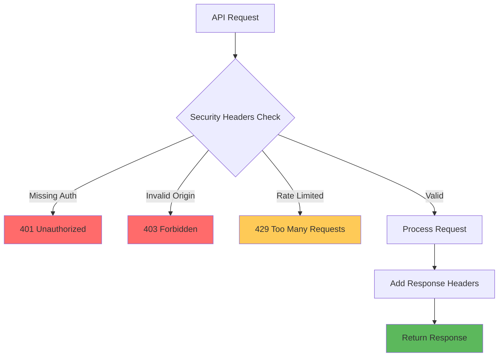
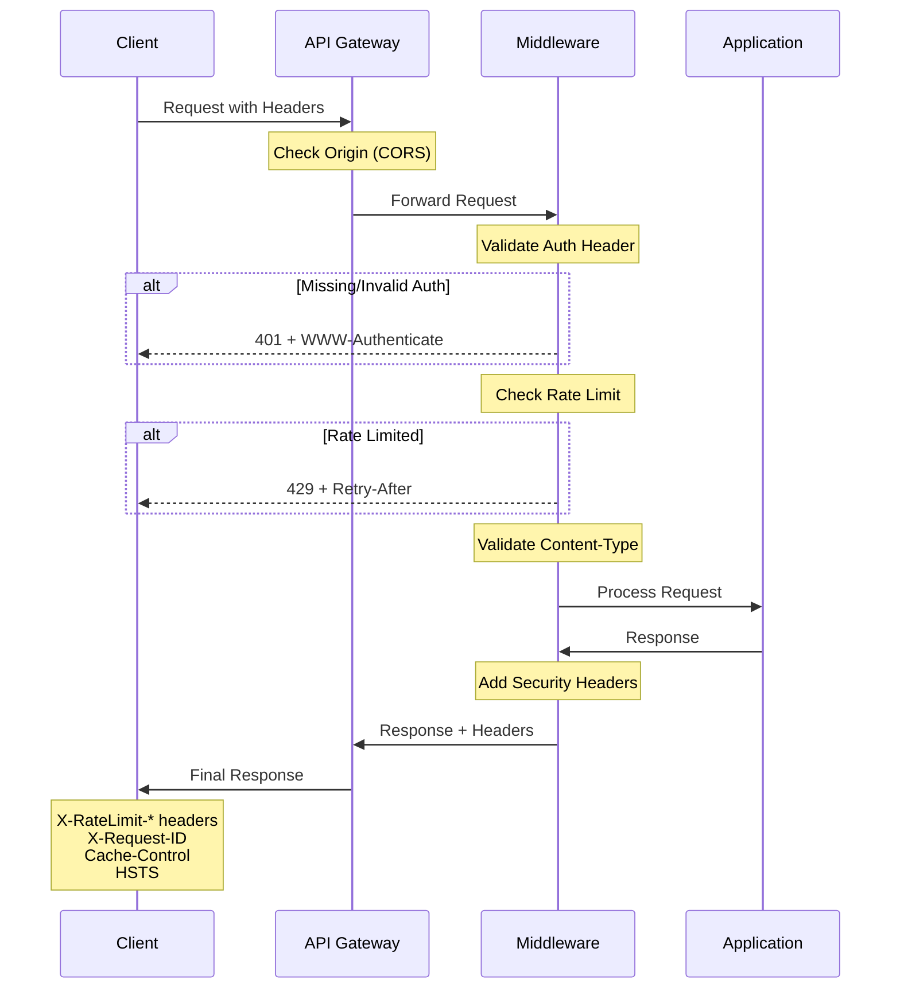

# How to Implement API Security Headers

Author: [nawazdhandala](https://github.com/nawazdhandala)

Tags: Security, API, NodeJS, Python, DevOps, Best Practices

Description: Learn how to implement essential API security headers to protect your backend services from common attacks, including CORS, rate limiting headers, and authentication-related headers with production-ready examples.

---

API security headers are your first line of defense against a wide range of attacks. Unlike browser-facing web applications where Content-Security-Policy and X-Frame-Options are critical, APIs require a different set of headers focused on authentication, rate limiting, and data integrity. This guide covers the essential headers every API should implement.

## Why API Security Headers Matter

APIs are increasingly targeted because they often expose sensitive data and business logic directly. Security headers help you:

- Prevent unauthorized access and authentication bypass
- Protect against injection and replay attacks
- Control cross-origin access for browser-based API clients
- Communicate rate limits to prevent abuse
- Ensure data integrity in transit



## Essential API Security Headers

### 1. Authentication Headers

The most fundamental security header for APIs is the Authorization header. Here is how to properly validate and respond to authentication.

```javascript
// middleware/auth.js
const jwt = require('jsonwebtoken');

// Middleware to validate JWT tokens from the Authorization header
// Supports Bearer token format: "Authorization: Bearer <token>"
function authMiddleware(req, res, next) {
  const authHeader = req.headers['authorization'];

  // Check if Authorization header exists
  if (!authHeader) {
    // Return WWW-Authenticate header to indicate authentication is required
    // This follows RFC 7235 for HTTP Authentication
    res.set('WWW-Authenticate', 'Bearer realm="api", charset="UTF-8"');
    return res.status(401).json({
      error: 'unauthorized',
      message: 'Authorization header is required'
    });
  }

  // Extract token from "Bearer <token>" format
  const parts = authHeader.split(' ');
  if (parts.length !== 2 || parts[0] !== 'Bearer') {
    res.set('WWW-Authenticate', 'Bearer realm="api", error="invalid_token"');
    return res.status(401).json({
      error: 'invalid_token',
      message: 'Authorization header must use Bearer scheme'
    });
  }

  const token = parts[1];

  try {
    // Verify the JWT token
    const decoded = jwt.verify(token, process.env.JWT_SECRET, {
      algorithms: ['HS256'], // Explicitly specify allowed algorithms
      issuer: 'your-api-name',
      audience: 'your-api-clients'
    });

    req.user = decoded;
    next();
  } catch (error) {
    // Provide specific error in WWW-Authenticate header
    const errorType = error.name === 'TokenExpiredError'
      ? 'invalid_token", error_description="Token has expired'
      : 'invalid_token';

    res.set('WWW-Authenticate', `Bearer realm="api", error="${errorType}"`);
    return res.status(401).json({
      error: 'invalid_token',
      message: error.message
    });
  }
}

module.exports = { authMiddleware };
```

### 2. CORS Headers for API Access Control

Cross-Origin Resource Sharing headers control which domains can access your API from browser-based clients. For APIs, you need precise control over allowed origins.

```javascript
// middleware/cors.js

// Production CORS configuration for APIs
// This setup allows specific origins and handles preflight requests
function corsMiddleware(options = {}) {
  // Define allowed origins - use environment variables in production
  const allowedOrigins = options.origins || [
    'https://app.yourdomain.com',
    'https://dashboard.yourdomain.com'
  ];

  // Allowed HTTP methods for your API
  const allowedMethods = options.methods || ['GET', 'POST', 'PUT', 'DELETE', 'PATCH'];

  // Headers that clients are allowed to send
  const allowedHeaders = options.headers || [
    'Authorization',
    'Content-Type',
    'X-Request-ID',
    'X-API-Version'
  ];

  // Headers that clients are allowed to read from responses
  const exposedHeaders = options.exposedHeaders || [
    'X-Request-ID',
    'X-RateLimit-Limit',
    'X-RateLimit-Remaining',
    'X-RateLimit-Reset',
    'Retry-After'
  ];

  return (req, res, next) => {
    const origin = req.headers.origin;

    // Check if the origin is in our allowed list
    if (origin && allowedOrigins.includes(origin)) {
      res.set('Access-Control-Allow-Origin', origin);
      res.set('Vary', 'Origin'); // Important for caching
    }

    // Only set credentials header if origin is allowed
    // Never use Access-Control-Allow-Origin: * with credentials
    if (origin && allowedOrigins.includes(origin)) {
      res.set('Access-Control-Allow-Credentials', 'true');
    }

    // Handle preflight OPTIONS requests
    if (req.method === 'OPTIONS') {
      res.set('Access-Control-Allow-Methods', allowedMethods.join(', '));
      res.set('Access-Control-Allow-Headers', allowedHeaders.join(', '));
      res.set('Access-Control-Max-Age', '86400'); // Cache preflight for 24 hours
      return res.status(204).end();
    }

    // Expose headers that clients need to read
    res.set('Access-Control-Expose-Headers', exposedHeaders.join(', '));

    next();
  };
}

module.exports = { corsMiddleware };
```

### 3. Rate Limiting Headers

Rate limiting headers communicate usage limits to API clients, helping them implement proper backoff strategies.

```javascript
// middleware/rateLimit.js
const Redis = require('ioredis');

const redis = new Redis(process.env.REDIS_URL);

// Rate limiter using sliding window algorithm
// Provides proper headers per RFC 6585 and draft-ietf-httpapi-ratelimit-headers
async function rateLimitMiddleware(options = {}) {
  const windowMs = options.windowMs || 60000; // 1 minute default
  const maxRequests = options.max || 100;
  const keyPrefix = options.keyPrefix || 'ratelimit';

  return async (req, res, next) => {
    // Generate a unique key for this client
    // Use API key if available, otherwise fall back to IP
    const clientId = req.headers['x-api-key'] ||
                     req.user?.id ||
                     req.ip;

    const key = `${keyPrefix}:${clientId}`;
    const now = Date.now();
    const windowStart = now - windowMs;

    try {
      // Use Redis sorted set for sliding window
      // Remove old entries and count current window
      const multi = redis.multi();
      multi.zremrangebyscore(key, 0, windowStart);
      multi.zadd(key, now, `${now}-${Math.random()}`);
      multi.zcard(key);
      multi.pexpire(key, windowMs);

      const results = await multi.exec();
      const requestCount = results[2][1];

      // Calculate remaining requests and reset time
      const remaining = Math.max(0, maxRequests - requestCount);
      const resetTime = Math.ceil((now + windowMs) / 1000);

      // Set standard rate limit headers
      // These headers help clients implement proper retry logic
      res.set('X-RateLimit-Limit', maxRequests.toString());
      res.set('X-RateLimit-Remaining', remaining.toString());
      res.set('X-RateLimit-Reset', resetTime.toString());

      // Also set the newer RateLimit header format (draft standard)
      res.set('RateLimit-Limit', maxRequests.toString());
      res.set('RateLimit-Remaining', remaining.toString());
      res.set('RateLimit-Reset', Math.ceil(windowMs / 1000).toString());

      if (requestCount > maxRequests) {
        // Calculate retry delay
        const retryAfter = Math.ceil(windowMs / 1000);
        res.set('Retry-After', retryAfter.toString());

        return res.status(429).json({
          error: 'too_many_requests',
          message: 'Rate limit exceeded',
          retryAfter: retryAfter
        });
      }

      next();
    } catch (error) {
      // If Redis fails, allow the request but log the error
      console.error('Rate limit error:', error);
      next();
    }
  };
}

module.exports = { rateLimitMiddleware };
```

## Security Headers for All API Responses

Beyond request-specific headers, every API response should include baseline security headers.

```javascript
// middleware/securityHeaders.js

// Security headers middleware for APIs
// These headers should be set on every response
function securityHeadersMiddleware(req, res, next) {
  // Prevent browsers from MIME-sniffing the content type
  // This stops attacks where malicious content is disguised as a different type
  res.set('X-Content-Type-Options', 'nosniff');

  // Control what information is sent in the Referer header
  // For APIs, we typically want minimal information leaked
  res.set('Referrer-Policy', 'strict-origin-when-cross-origin');

  // Remove the X-Powered-By header that Express sets by default
  // This prevents information disclosure about your server stack
  res.removeHeader('X-Powered-By');

  // Set Content-Type with charset to prevent encoding attacks
  // This should be overridden by specific routes if needed
  if (!res.get('Content-Type')) {
    res.set('Content-Type', 'application/json; charset=utf-8');
  }

  // Cache-Control for API responses
  // Prevent sensitive data from being cached
  res.set('Cache-Control', 'no-store, no-cache, must-revalidate, proxy-revalidate');
  res.set('Pragma', 'no-cache');
  res.set('Expires', '0');

  // Strict-Transport-Security forces HTTPS
  // Only set this if your API is served over HTTPS
  if (req.secure || req.headers['x-forwarded-proto'] === 'https') {
    res.set('Strict-Transport-Security', 'max-age=31536000; includeSubDomains');
  }

  // Add request ID for tracing
  // This helps correlate logs and debug issues
  const requestId = req.headers['x-request-id'] || generateRequestId();
  res.set('X-Request-ID', requestId);
  req.requestId = requestId;

  next();
}

function generateRequestId() {
  return `${Date.now().toString(36)}-${Math.random().toString(36).substr(2, 9)}`;
}

module.exports = { securityHeadersMiddleware };
```

## Request Validation Headers

APIs should validate certain request headers to ensure data integrity and prevent attacks.

```javascript
// middleware/requestValidation.js

// Validate incoming request headers
// Helps prevent common attack vectors
function requestValidationMiddleware(req, res, next) {
  // Validate Content-Type for requests with bodies
  if (['POST', 'PUT', 'PATCH'].includes(req.method)) {
    const contentType = req.headers['content-type'];

    // Require Content-Type header for requests with bodies
    if (!contentType) {
      return res.status(415).json({
        error: 'unsupported_media_type',
        message: 'Content-Type header is required'
      });
    }

    // Only accept JSON for API endpoints
    const allowedTypes = ['application/json', 'application/json; charset=utf-8'];
    const normalizedType = contentType.toLowerCase().split(';')[0].trim();

    if (!allowedTypes.includes(normalizedType) && normalizedType !== 'application/json') {
      return res.status(415).json({
        error: 'unsupported_media_type',
        message: 'Content-Type must be application/json'
      });
    }
  }

  // Validate Content-Length to prevent large payload attacks
  const contentLength = parseInt(req.headers['content-length'], 10);
  const maxSize = 1024 * 1024; // 1MB limit

  if (contentLength && contentLength > maxSize) {
    return res.status(413).json({
      error: 'payload_too_large',
      message: `Request body must be smaller than ${maxSize} bytes`
    });
  }

  // Validate Accept header to ensure client expects JSON
  const accept = req.headers['accept'];
  if (accept && !accept.includes('application/json') && !accept.includes('*/*')) {
    return res.status(406).json({
      error: 'not_acceptable',
      message: 'This API only returns application/json'
    });
  }

  next();
}

module.exports = { requestValidationMiddleware };
```

## Complete Express.js Setup

Here is how to combine all the security headers into a production-ready Express application.

```javascript
// app.js
const express = require('express');
const { securityHeadersMiddleware } = require('./middleware/securityHeaders');
const { corsMiddleware } = require('./middleware/cors');
const { rateLimitMiddleware } = require('./middleware/rateLimit');
const { authMiddleware } = require('./middleware/auth');
const { requestValidationMiddleware } = require('./middleware/requestValidation');

const app = express();

// Trust proxy if behind a load balancer
app.set('trust proxy', 1);

// Apply security headers to all responses
app.use(securityHeadersMiddleware);

// Apply CORS before other middleware
app.use(corsMiddleware({
  origins: process.env.ALLOWED_ORIGINS?.split(',') || ['https://app.yourdomain.com']
}));

// Parse JSON bodies with size limit
app.use(express.json({ limit: '1mb' }));

// Validate request headers
app.use(requestValidationMiddleware);

// Apply rate limiting
app.use(rateLimitMiddleware({
  windowMs: 60000,
  max: 100
}));

// Health check endpoint - no auth required
app.get('/health', (req, res) => {
  res.json({ status: 'ok' });
});

// Protected routes
app.use('/api', authMiddleware);

app.get('/api/users/me', (req, res) => {
  res.json({ user: req.user });
});

// Error handler that maintains security headers
app.use((err, req, res, next) => {
  console.error(err);
  res.status(err.status || 500).json({
    error: err.code || 'internal_error',
    message: process.env.NODE_ENV === 'production'
      ? 'An error occurred'
      : err.message,
    requestId: req.requestId
  });
});

module.exports = app;
```

## Python FastAPI Implementation

Here is the equivalent implementation using Python and FastAPI.

```python
# security_headers.py
from fastapi import FastAPI, Request, Response, HTTPException
from fastapi.middleware.cors import CORSMiddleware
from starlette.middleware.base import BaseHTTPMiddleware
import time
import uuid
import redis
from functools import wraps

app = FastAPI()

# Redis client for rate limiting
redis_client = redis.Redis.from_url("redis://localhost:6379")


class SecurityHeadersMiddleware(BaseHTTPMiddleware):
    """
    Middleware to add security headers to all API responses.
    These headers protect against common web vulnerabilities.
    """

    async def dispatch(self, request: Request, call_next):
        # Generate request ID for tracing
        request_id = request.headers.get("X-Request-ID", str(uuid.uuid4()))

        # Process the request
        response = await call_next(request)

        # Add security headers to response
        response.headers["X-Content-Type-Options"] = "nosniff"
        response.headers["Referrer-Policy"] = "strict-origin-when-cross-origin"
        response.headers["Cache-Control"] = "no-store, no-cache, must-revalidate"
        response.headers["Pragma"] = "no-cache"
        response.headers["Expires"] = "0"
        response.headers["X-Request-ID"] = request_id

        # HSTS for HTTPS connections
        if request.url.scheme == "https":
            response.headers["Strict-Transport-Security"] = (
                "max-age=31536000; includeSubDomains"
            )

        return response


class RateLimitMiddleware(BaseHTTPMiddleware):
    """
    Rate limiting middleware using sliding window algorithm.
    Stores request counts in Redis for distributed rate limiting.
    """

    def __init__(self, app, max_requests: int = 100, window_seconds: int = 60):
        super().__init__(app)
        self.max_requests = max_requests
        self.window_seconds = window_seconds

    async def dispatch(self, request: Request, call_next):
        # Get client identifier from API key or IP
        client_id = (
            request.headers.get("X-API-Key") or
            request.client.host
        )

        key = f"ratelimit:{client_id}"
        now = time.time()
        window_start = now - self.window_seconds

        # Sliding window rate limiting with Redis
        pipe = redis_client.pipeline()
        pipe.zremrangebyscore(key, 0, window_start)
        pipe.zadd(key, {f"{now}-{uuid.uuid4()}": now})
        pipe.zcard(key)
        pipe.expire(key, self.window_seconds)

        results = pipe.execute()
        request_count = results[2]

        # Calculate rate limit values
        remaining = max(0, self.max_requests - request_count)
        reset_time = int(now + self.window_seconds)

        # Process request or return 429
        if request_count > self.max_requests:
            response = Response(
                content='{"error": "too_many_requests", "message": "Rate limit exceeded"}',
                status_code=429,
                media_type="application/json"
            )
            response.headers["Retry-After"] = str(self.window_seconds)
        else:
            response = await call_next(request)

        # Add rate limit headers to all responses
        response.headers["X-RateLimit-Limit"] = str(self.max_requests)
        response.headers["X-RateLimit-Remaining"] = str(remaining)
        response.headers["X-RateLimit-Reset"] = str(reset_time)

        return response


# Apply middleware
app.add_middleware(SecurityHeadersMiddleware)
app.add_middleware(RateLimitMiddleware, max_requests=100, window_seconds=60)

# Configure CORS
app.add_middleware(
    CORSMiddleware,
    allow_origins=["https://app.yourdomain.com"],
    allow_credentials=True,
    allow_methods=["GET", "POST", "PUT", "DELETE", "PATCH"],
    allow_headers=["Authorization", "Content-Type", "X-Request-ID"],
    expose_headers=[
        "X-Request-ID",
        "X-RateLimit-Limit",
        "X-RateLimit-Remaining",
        "X-RateLimit-Reset"
    ],
    max_age=86400,
)


@app.get("/health")
async def health_check():
    """Health check endpoint - no authentication required."""
    return {"status": "ok"}


@app.get("/api/users/me")
async def get_current_user(request: Request):
    """Protected endpoint - requires valid JWT token."""
    # Authentication would be handled by a dependency
    return {"user": request.state.user}
```

## API Security Headers Flow

The following diagram shows how security headers are processed throughout the request lifecycle.



## API Key Authentication Headers

For service-to-service communication, API keys are often preferred over JWTs.

```javascript
// middleware/apiKeyAuth.js
const crypto = require('crypto');

// Store API keys securely - in production, use a database or secrets manager
const apiKeys = new Map([
  ['sk_live_abc123', { name: 'Production App', scopes: ['read', 'write'] }],
  ['sk_test_xyz789', { name: 'Test App', scopes: ['read'] }]
]);

// API Key authentication middleware
// Validates the X-API-Key header and checks permissions
function apiKeyAuthMiddleware(requiredScopes = []) {
  return (req, res, next) => {
    const apiKey = req.headers['x-api-key'];

    if (!apiKey) {
      return res.status(401).json({
        error: 'unauthorized',
        message: 'X-API-Key header is required'
      });
    }

    // Use constant-time comparison to prevent timing attacks
    const keyData = findApiKey(apiKey);

    if (!keyData) {
      return res.status(401).json({
        error: 'invalid_api_key',
        message: 'Invalid API key'
      });
    }

    // Check if the key has required scopes
    const hasRequiredScopes = requiredScopes.every(
      scope => keyData.scopes.includes(scope)
    );

    if (!hasRequiredScopes) {
      return res.status(403).json({
        error: 'insufficient_permissions',
        message: 'API key does not have required permissions'
      });
    }

    req.apiKey = keyData;
    next();
  };
}

// Constant-time API key lookup to prevent timing attacks
function findApiKey(providedKey) {
  for (const [storedKey, data] of apiKeys) {
    // Use timing-safe comparison
    if (storedKey.length === providedKey.length) {
      const match = crypto.timingSafeEqual(
        Buffer.from(storedKey),
        Buffer.from(providedKey)
      );
      if (match) return data;
    }
  }
  return null;
}

module.exports = { apiKeyAuthMiddleware };
```

## Security Headers Testing

Always verify your security headers are correctly set. Here is a test suite using Jest.

```javascript
// __tests__/securityHeaders.test.js
const request = require('supertest');
const app = require('../app');

describe('API Security Headers', () => {
  describe('Security Headers Middleware', () => {
    it('should set X-Content-Type-Options header', async () => {
      const response = await request(app).get('/health');
      expect(response.headers['x-content-type-options']).toBe('nosniff');
    });

    it('should set Cache-Control header', async () => {
      const response = await request(app).get('/health');
      expect(response.headers['cache-control']).toContain('no-store');
    });

    it('should set X-Request-ID header', async () => {
      const response = await request(app).get('/health');
      expect(response.headers['x-request-id']).toBeDefined();
    });

    it('should not expose X-Powered-By header', async () => {
      const response = await request(app).get('/health');
      expect(response.headers['x-powered-by']).toBeUndefined();
    });
  });

  describe('CORS Headers', () => {
    it('should set CORS headers for allowed origins', async () => {
      const response = await request(app)
        .get('/health')
        .set('Origin', 'https://app.yourdomain.com');

      expect(response.headers['access-control-allow-origin'])
        .toBe('https://app.yourdomain.com');
    });

    it('should not set CORS headers for disallowed origins', async () => {
      const response = await request(app)
        .get('/health')
        .set('Origin', 'https://evil.com');

      expect(response.headers['access-control-allow-origin']).toBeUndefined();
    });

    it('should handle preflight requests', async () => {
      const response = await request(app)
        .options('/api/users')
        .set('Origin', 'https://app.yourdomain.com')
        .set('Access-Control-Request-Method', 'POST');

      expect(response.status).toBe(204);
      expect(response.headers['access-control-allow-methods']).toBeDefined();
    });
  });

  describe('Rate Limiting Headers', () => {
    it('should set rate limit headers', async () => {
      const response = await request(app).get('/health');

      expect(response.headers['x-ratelimit-limit']).toBeDefined();
      expect(response.headers['x-ratelimit-remaining']).toBeDefined();
      expect(response.headers['x-ratelimit-reset']).toBeDefined();
    });
  });

  describe('Authentication Headers', () => {
    it('should return WWW-Authenticate on unauthorized requests', async () => {
      const response = await request(app).get('/api/users/me');

      expect(response.status).toBe(401);
      expect(response.headers['www-authenticate']).toContain('Bearer');
    });
  });
});
```

## Summary

Implementing proper API security headers requires attention to several areas:

| Header Category | Key Headers | Purpose |
|----------------|-------------|---------|
| **Authentication** | Authorization, WWW-Authenticate | Identify and validate clients |
| **Rate Limiting** | X-RateLimit-*, Retry-After | Prevent abuse and communicate limits |
| **CORS** | Access-Control-* | Control cross-origin access |
| **Security** | X-Content-Type-Options, HSTS, Cache-Control | Prevent common attacks |
| **Tracing** | X-Request-ID | Correlate logs and debug issues |

Key takeaways:

1. Always validate the Authorization header and return proper WWW-Authenticate responses
2. Implement rate limiting with clear headers so clients can handle backoff properly
3. Configure CORS precisely, never use wildcard origins with credentials
4. Set cache headers to prevent sensitive data from being stored
5. Include request IDs in responses for debugging and support
6. Test your security headers as part of your CI/CD pipeline

Security headers are not optional. They form the foundation of a secure API. Implement them early and test them thoroughly.
