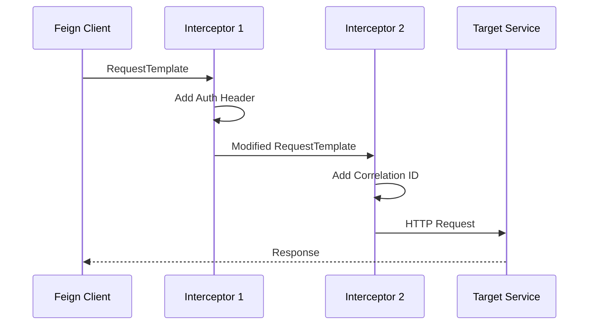
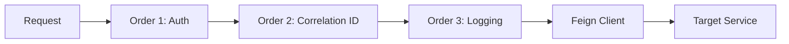

# How to Implement Custom Feign Interceptors

Author: [nawazdhandala](https://github.com/nawazdhandala)

Tags: Java, Spring Boot, Feign, Microservices, REST API, HTTP Client

Description: Learn how to build production-ready Feign interceptors for authentication, logging, retry logic, and request/response manipulation in Spring Boot microservices.

---

Feign simplifies HTTP client development in Spring Boot microservices by letting you define REST clients as interfaces. But real-world services need more than simple HTTP calls. You need authentication headers, request logging, correlation IDs, and retry mechanisms. Feign interceptors provide hooks to inject this functionality without cluttering your business logic.

## How Feign Interceptors Work

Interceptors execute before Feign sends the HTTP request. They receive a `RequestTemplate` object that you can modify by adding headers, query parameters, or transforming the request body.



## Basic Interceptor Structure

Every Feign interceptor implements the `RequestInterceptor` interface with a single `apply` method. The RequestTemplate provides access to headers, query parameters, body, and URL.

```java
package com.example.interceptors;

import feign.RequestInterceptor;
import feign.RequestTemplate;
import org.springframework.stereotype.Component;

// Register this interceptor as a Spring bean - Feign auto-discovers it
@Component
public class BasicLoggingInterceptor implements RequestInterceptor {

    @Override
    public void apply(RequestTemplate template) {
        // Log basic request info before it's sent
        System.out.println("Calling: " + template.method() + " " + template.url());

        // Access existing headers
        template.headers().forEach((name, values) ->
            System.out.println("Header: " + name + " = " + values)
        );
    }
}
```

## Authentication Interceptor

Most microservices need to propagate authentication tokens. This interceptor extracts the JWT from the incoming request context and forwards it to downstream services.

```java
package com.example.interceptors;

import feign.RequestInterceptor;
import feign.RequestTemplate;
import org.springframework.stereotype.Component;
import org.springframework.web.context.request.RequestContextHolder;
import org.springframework.web.context.request.ServletRequestAttributes;

import javax.servlet.http.HttpServletRequest;

@Component
public class AuthTokenInterceptor implements RequestInterceptor {

    private static final String AUTH_HEADER = "Authorization";

    @Override
    public void apply(RequestTemplate template) {
        // Get the current HTTP request from Spring's context
        ServletRequestAttributes attributes =
            (ServletRequestAttributes) RequestContextHolder.getRequestAttributes();

        if (attributes == null) {
            // No request context - might be running in async thread or scheduled task
            return;
        }

        HttpServletRequest request = attributes.getRequest();
        String authToken = request.getHeader(AUTH_HEADER);

        if (authToken != null && !authToken.isEmpty()) {
            // Forward the token to downstream service
            template.header(AUTH_HEADER, authToken);
        }
    }
}
```

### Static Token Authentication

For service-to-service calls that use API keys instead of user tokens.

```java
package com.example.interceptors;

import feign.RequestInterceptor;
import feign.RequestTemplate;
import org.springframework.beans.factory.annotation.Value;
import org.springframework.stereotype.Component;

@Component
public class ApiKeyInterceptor implements RequestInterceptor {

    // Load API key from application.yml or environment variable
    @Value("${service.api-key}")
    private String apiKey;

    @Value("${service.api-key-header:X-API-Key}")
    private String headerName;

    @Override
    public void apply(RequestTemplate template) {
        // Always add the API key for service-to-service auth
        template.header(headerName, apiKey);
    }
}
```

## Correlation ID Propagation

Correlation IDs let you trace requests across services. This interceptor propagates existing IDs or generates new ones.

```java
package com.example.interceptors;

import feign.RequestInterceptor;
import feign.RequestTemplate;
import org.slf4j.MDC;
import org.springframework.stereotype.Component;
import org.springframework.web.context.request.RequestContextHolder;
import org.springframework.web.context.request.ServletRequestAttributes;

import java.util.UUID;

@Component
public class CorrelationIdInterceptor implements RequestInterceptor {

    public static final String CORRELATION_ID_HEADER = "X-Correlation-ID";
    public static final String MDC_CORRELATION_ID = "correlationId";

    @Override
    public void apply(RequestTemplate template) {
        String correlationId = getOrCreateCorrelationId();

        // Add to outgoing request
        template.header(CORRELATION_ID_HEADER, correlationId);

        // Store in MDC for logging
        MDC.put(MDC_CORRELATION_ID, correlationId);
    }

    private String getOrCreateCorrelationId() {
        // First, check MDC (might be set by incoming request filter)
        String correlationId = MDC.get(MDC_CORRELATION_ID);
        if (correlationId != null) {
            return correlationId;
        }

        // Second, check incoming request header
        ServletRequestAttributes attrs =
            (ServletRequestAttributes) RequestContextHolder.getRequestAttributes();

        if (attrs != null) {
            String headerValue = attrs.getRequest().getHeader(CORRELATION_ID_HEADER);
            if (headerValue != null && !headerValue.isEmpty()) {
                return headerValue;
            }
        }

        // Generate new ID if none exists
        return UUID.randomUUID().toString();
    }
}
```

### Incoming Request Filter

Pair the interceptor with a filter that captures correlation IDs on incoming requests.

```java
package com.example.filters;

import org.slf4j.MDC;
import org.springframework.core.annotation.Order;
import org.springframework.stereotype.Component;
import org.springframework.web.filter.OncePerRequestFilter;

import javax.servlet.FilterChain;
import javax.servlet.ServletException;
import javax.servlet.http.HttpServletRequest;
import javax.servlet.http.HttpServletResponse;
import java.io.IOException;
import java.util.UUID;

@Component
@Order(1)  // Run early in the filter chain
public class CorrelationIdFilter extends OncePerRequestFilter {

    public static final String CORRELATION_ID_HEADER = "X-Correlation-ID";
    public static final String MDC_CORRELATION_ID = "correlationId";

    @Override
    protected void doFilterInternal(HttpServletRequest request,
                                     HttpServletResponse response,
                                     FilterChain chain)
            throws ServletException, IOException {

        // Extract from header or generate new
        String correlationId = request.getHeader(CORRELATION_ID_HEADER);
        if (correlationId == null || correlationId.isEmpty()) {
            correlationId = UUID.randomUUID().toString();
        }

        // Store in MDC for logging and downstream propagation
        MDC.put(MDC_CORRELATION_ID, correlationId);

        // Add to response for debugging
        response.setHeader(CORRELATION_ID_HEADER, correlationId);

        try {
            chain.doFilter(request, response);
        } finally {
            // Clean up to prevent memory leaks
            MDC.remove(MDC_CORRELATION_ID);
        }
    }
}
```

## Request/Response Logging Interceptor

Logging HTTP traffic helps debug integration issues. This interceptor logs requests before they are sent.

```java
package com.example.interceptors;

import feign.RequestInterceptor;
import feign.RequestTemplate;
import org.slf4j.Logger;
import org.slf4j.LoggerFactory;
import org.springframework.stereotype.Component;

import java.nio.charset.StandardCharsets;

@Component
public class RequestLoggingInterceptor implements RequestInterceptor {

    private static final Logger log = LoggerFactory.getLogger(RequestLoggingInterceptor.class);

    @Override
    public void apply(RequestTemplate template) {
        log.info("Feign Request: {} {}", template.method(), template.url());

        // Log headers (filter sensitive ones in production)
        template.headers().forEach((name, values) -> {
            if (!isSensitiveHeader(name)) {
                log.debug("  Header: {} = {}", name, values);
            } else {
                log.debug("  Header: {} = [REDACTED]", name);
            }
        });

        // Log body for POST/PUT requests
        byte[] body = template.body();
        if (body != null && body.length > 0) {
            String bodyStr = new String(body, StandardCharsets.UTF_8);
            // Truncate large bodies
            if (bodyStr.length() > 1000) {
                bodyStr = bodyStr.substring(0, 1000) + "...[truncated]";
            }
            log.debug("  Body: {}", bodyStr);
        }
    }

    private boolean isSensitiveHeader(String name) {
        String lower = name.toLowerCase();
        return lower.contains("authorization") ||
               lower.contains("api-key") ||
               lower.contains("secret") ||
               lower.contains("password");
    }
}
```

### Full Request/Response Logging with Feign Logger

For complete logging including responses, configure Feign's built-in logger.

```java
package com.example.config;

import feign.Logger;
import org.springframework.context.annotation.Bean;
import org.springframework.context.annotation.Configuration;

@Configuration
public class FeignLoggingConfig {

    // NONE - no logging
    // BASIC - log method, URL, response status, execution time
    // HEADERS - log BASIC + request/response headers
    // FULL - log HEADERS + body and metadata
    @Bean
    public Logger.Level feignLoggerLevel() {
        return Logger.Level.FULL;
    }
}
```

Configure logging level in `application.yml`:

```yaml
logging:
  level:
    # Set to DEBUG for Feign logging to appear
    com.example.clients: DEBUG
```

## Conditional Interceptors

Sometimes you need interceptors that only apply to specific clients or conditions.

```java
package com.example.interceptors;

import feign.RequestInterceptor;
import feign.RequestTemplate;
import org.springframework.boot.autoconfigure.condition.ConditionalOnProperty;
import org.springframework.stereotype.Component;

// Only register this bean when the property is set
@Component
@ConditionalOnProperty(name = "feign.debug.enabled", havingValue = "true")
public class DebugInterceptor implements RequestInterceptor {

    @Override
    public void apply(RequestTemplate template) {
        // Add debug header to identify requests from this environment
        template.header("X-Debug-Mode", "true");
        template.header("X-Environment", System.getenv("ENVIRONMENT"));
    }
}
```

## Client-Specific Interceptors

Use configuration classes to apply interceptors to specific Feign clients only.

```java
package com.example.clients;

import feign.RequestInterceptor;
import org.springframework.cloud.openfeign.FeignClient;
import org.springframework.context.annotation.Bean;
import org.springframework.web.bind.annotation.GetMapping;
import org.springframework.web.bind.annotation.PathVariable;

import java.util.List;

// Apply PaymentClientConfig only to this client
@FeignClient(
    name = "payment-service",
    url = "${services.payment.url}",
    configuration = PaymentClient.PaymentClientConfig.class
)
public interface PaymentClient {

    @GetMapping("/payments/{id}")
    PaymentResponse getPayment(@PathVariable String id);

    @GetMapping("/payments")
    List<PaymentResponse> listPayments();

    // Configuration class - not a @Component, applied only to this client
    class PaymentClientConfig {

        @Bean
        public RequestInterceptor paymentAuthInterceptor() {
            return template -> {
                // Add payment service specific auth
                template.header("X-Payment-Api-Key", System.getenv("PAYMENT_API_KEY"));
                template.header("X-Payment-Merchant-Id", System.getenv("MERCHANT_ID"));
            };
        }

        @Bean
        public RequestInterceptor idempotencyInterceptor() {
            return template -> {
                // Add idempotency key for POST requests to prevent duplicate charges
                if ("POST".equals(template.method())) {
                    String idempotencyKey = java.util.UUID.randomUUID().toString();
                    template.header("Idempotency-Key", idempotencyKey);
                }
            };
        }
    }
}
```

## OAuth2 Token Interceptor

For OAuth2-secured services, this interceptor manages token acquisition and refresh.

```java
package com.example.interceptors;

import feign.RequestInterceptor;
import feign.RequestTemplate;
import org.springframework.security.oauth2.client.OAuth2AuthorizeRequest;
import org.springframework.security.oauth2.client.OAuth2AuthorizedClient;
import org.springframework.security.oauth2.client.OAuth2AuthorizedClientManager;
import org.springframework.stereotype.Component;

@Component
public class OAuth2ClientCredentialsInterceptor implements RequestInterceptor {

    private final OAuth2AuthorizedClientManager authorizedClientManager;
    private final String clientRegistrationId;

    public OAuth2ClientCredentialsInterceptor(
            OAuth2AuthorizedClientManager authorizedClientManager) {
        this.authorizedClientManager = authorizedClientManager;
        // Must match the registration ID in application.yml
        this.clientRegistrationId = "downstream-service";
    }

    @Override
    public void apply(RequestTemplate template) {
        // Build authorize request with client registration ID
        OAuth2AuthorizeRequest authorizeRequest = OAuth2AuthorizeRequest
            .withClientRegistrationId(clientRegistrationId)
            .principal("service-account")  // For client_credentials grant
            .build();

        // Get or refresh token automatically
        OAuth2AuthorizedClient authorizedClient =
            authorizedClientManager.authorize(authorizeRequest);

        if (authorizedClient != null && authorizedClient.getAccessToken() != null) {
            String tokenValue = authorizedClient.getAccessToken().getTokenValue();
            template.header("Authorization", "Bearer " + tokenValue);
        }
    }
}
```

Configure OAuth2 in `application.yml`:

```yaml
spring:
  security:
    oauth2:
      client:
        registration:
          downstream-service:
            client-id: ${OAUTH_CLIENT_ID}
            client-secret: ${OAUTH_CLIENT_SECRET}
            authorization-grant-type: client_credentials
            scope: read,write
        provider:
          downstream-service:
            token-uri: https://auth.example.com/oauth/token
```

## Request Modification Interceptor

Add query parameters, modify URLs, or transform request bodies.

```java
package com.example.interceptors;

import feign.RequestInterceptor;
import feign.RequestTemplate;
import org.springframework.beans.factory.annotation.Value;
import org.springframework.stereotype.Component;

import java.time.Instant;

@Component
public class RequestEnhancementInterceptor implements RequestInterceptor {

    @Value("${app.version}")
    private String appVersion;

    @Value("${app.tenant-id}")
    private String tenantId;

    @Override
    public void apply(RequestTemplate template) {
        // Add common query parameters
        template.query("apiVersion", appVersion);
        template.query("tenant", tenantId);

        // Add timestamp for request tracking
        template.header("X-Request-Timestamp", Instant.now().toString());

        // Add user agent
        template.header("User-Agent", "MyService/" + appVersion);
    }
}
```

## Interceptor Execution Order

When multiple interceptors exist, control execution order with `@Order`.



```java
package com.example.interceptors;

import feign.RequestInterceptor;
import feign.RequestTemplate;
import org.springframework.core.annotation.Order;
import org.springframework.stereotype.Component;

// Auth runs first to ensure token is available for logging
@Component
@Order(1)
public class AuthInterceptor implements RequestInterceptor {
    @Override
    public void apply(RequestTemplate template) {
        template.header("Authorization", "Bearer " + getToken());
    }

    private String getToken() {
        // Token retrieval logic
        return "token";
    }
}

// Correlation ID runs second
@Component
@Order(2)
public class CorrelationInterceptor implements RequestInterceptor {
    @Override
    public void apply(RequestTemplate template) {
        template.header("X-Correlation-ID", java.util.UUID.randomUUID().toString());
    }
}

// Logging runs last to capture all headers added by previous interceptors
@Component
@Order(3)
public class FinalLoggingInterceptor implements RequestInterceptor {
    @Override
    public void apply(RequestTemplate template) {
        System.out.println("Final request headers: " + template.headers());
    }
}
```

## Testing Interceptors

Test interceptors in isolation using mock templates.

```java
package com.example.interceptors;

import feign.RequestTemplate;
import org.junit.jupiter.api.BeforeEach;
import org.junit.jupiter.api.Test;
import org.springframework.mock.web.MockHttpServletRequest;
import org.springframework.web.context.request.RequestContextHolder;
import org.springframework.web.context.request.ServletRequestAttributes;

import static org.assertj.core.api.Assertions.assertThat;

class AuthTokenInterceptorTest {

    private AuthTokenInterceptor interceptor;
    private RequestTemplate template;

    @BeforeEach
    void setUp() {
        interceptor = new AuthTokenInterceptor();
        template = new RequestTemplate();
        template.method(feign.Request.HttpMethod.GET);
        template.uri("/api/test");
    }

    @Test
    void shouldPropagateAuthToken() {
        // Set up mock request with auth header
        MockHttpServletRequest request = new MockHttpServletRequest();
        request.addHeader("Authorization", "Bearer test-token");
        RequestContextHolder.setRequestAttributes(new ServletRequestAttributes(request));

        // Apply interceptor
        interceptor.apply(template);

        // Verify header was added
        assertThat(template.headers().get("Authorization"))
            .containsExactly("Bearer test-token");

        // Clean up
        RequestContextHolder.resetRequestAttributes();
    }

    @Test
    void shouldHandleMissingAuthToken() {
        // Set up mock request without auth header
        MockHttpServletRequest request = new MockHttpServletRequest();
        RequestContextHolder.setRequestAttributes(new ServletRequestAttributes(request));

        // Apply interceptor
        interceptor.apply(template);

        // Verify no header was added
        assertThat(template.headers().containsKey("Authorization")).isFalse();

        RequestContextHolder.resetRequestAttributes();
    }

    @Test
    void shouldHandleMissingRequestContext() {
        // No request context set
        RequestContextHolder.resetRequestAttributes();

        // Should not throw
        interceptor.apply(template);

        assertThat(template.headers().containsKey("Authorization")).isFalse();
    }
}
```

### Integration Testing with WireMock

```java
package com.example.clients;

import com.github.tomakehurst.wiremock.WireMockServer;
import com.github.tomakehurst.wiremock.client.WireMock;
import org.junit.jupiter.api.AfterAll;
import org.junit.jupiter.api.BeforeAll;
import org.junit.jupiter.api.Test;
import org.springframework.beans.factory.annotation.Autowired;
import org.springframework.boot.test.context.SpringBootTest;
import org.springframework.test.context.DynamicPropertyRegistry;
import org.springframework.test.context.DynamicPropertySource;

import static com.github.tomakehurst.wiremock.client.WireMock.*;

@SpringBootTest
class PaymentClientIntegrationTest {

    static WireMockServer wireMock = new WireMockServer(0);

    @Autowired
    PaymentClient paymentClient;

    @BeforeAll
    static void startWireMock() {
        wireMock.start();
    }

    @AfterAll
    static void stopWireMock() {
        wireMock.stop();
    }

    @DynamicPropertySource
    static void configureProperties(DynamicPropertyRegistry registry) {
        registry.add("services.payment.url", wireMock::baseUrl);
    }

    @Test
    void shouldIncludeApiKeyHeader() {
        // Stub the endpoint
        wireMock.stubFor(get(urlEqualTo("/payments/123"))
            .willReturn(okJson("{\"id\":\"123\",\"amount\":100}")));

        // Make the call
        paymentClient.getPayment("123");

        // Verify interceptor added required headers
        wireMock.verify(getRequestedFor(urlEqualTo("/payments/123"))
            .withHeader("X-Payment-Api-Key", matching(".+")));
    }

    @Test
    void shouldIncludeIdempotencyKeyForPosts() {
        wireMock.stubFor(post(urlEqualTo("/payments"))
            .willReturn(okJson("{\"id\":\"456\",\"amount\":200}")));

        // Make POST request
        // paymentClient.createPayment(new CreatePaymentRequest(...));

        wireMock.verify(postRequestedFor(urlEqualTo("/payments"))
            .withHeader("Idempotency-Key", matching("[a-f0-9-]{36}")));
    }
}
```

## Production Checklist

Before deploying Feign interceptors to production, verify these items:

| Item | Why It Matters |
|------|----------------|
| Sensitive data redaction | Prevent credentials from appearing in logs |
| Thread safety | Interceptors may be called from multiple threads |
| Null handling | Request context may be absent in async scenarios |
| Performance | Avoid blocking operations in interceptors |
| Error handling | Interceptor exceptions can fail requests |
| Token caching | Avoid hitting auth servers for every request |
| Timeout configuration | Set appropriate timeouts for downstream calls |

## Complete Configuration Example

Bring together all components in a clean configuration.

```java
package com.example.config;

import feign.Logger;
import feign.Request;
import feign.Retryer;
import org.springframework.cloud.openfeign.EnableFeignClients;
import org.springframework.context.annotation.Bean;
import org.springframework.context.annotation.Configuration;

import java.util.concurrent.TimeUnit;

@Configuration
@EnableFeignClients(basePackages = "com.example.clients")
public class FeignConfig {

    // Logging level for all Feign clients
    @Bean
    public Logger.Level feignLoggerLevel() {
        return Logger.Level.BASIC;
    }

    // Connection and read timeouts
    @Bean
    public Request.Options feignRequestOptions() {
        return new Request.Options(
            5, TimeUnit.SECONDS,   // Connect timeout
            30, TimeUnit.SECONDS,  // Read timeout
            true                    // Follow redirects
        );
    }

    // Retry configuration
    @Bean
    public Retryer feignRetryer() {
        // Retry up to 3 times, starting with 100ms delay, max 1 second delay
        return new Retryer.Default(100, 1000, 3);
    }
}
```

## Summary

Feign interceptors let you centralize cross-cutting concerns like authentication, logging, and request tracing. By implementing `RequestInterceptor`, you can modify any outgoing request before it leaves your service. Key patterns include:

- Propagate authentication tokens from incoming requests
- Add correlation IDs for distributed tracing
- Log requests for debugging without modifying client code
- Apply client-specific configuration using configuration classes
- Control execution order with `@Order` annotations

Start with authentication and correlation ID interceptors, then add logging as needed. Keep interceptors focused on single responsibilities and test them thoroughly before deploying to production.
