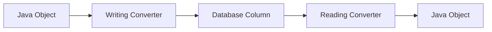
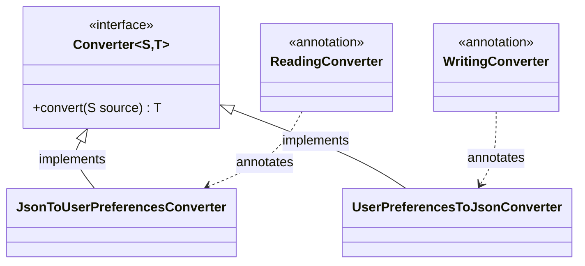
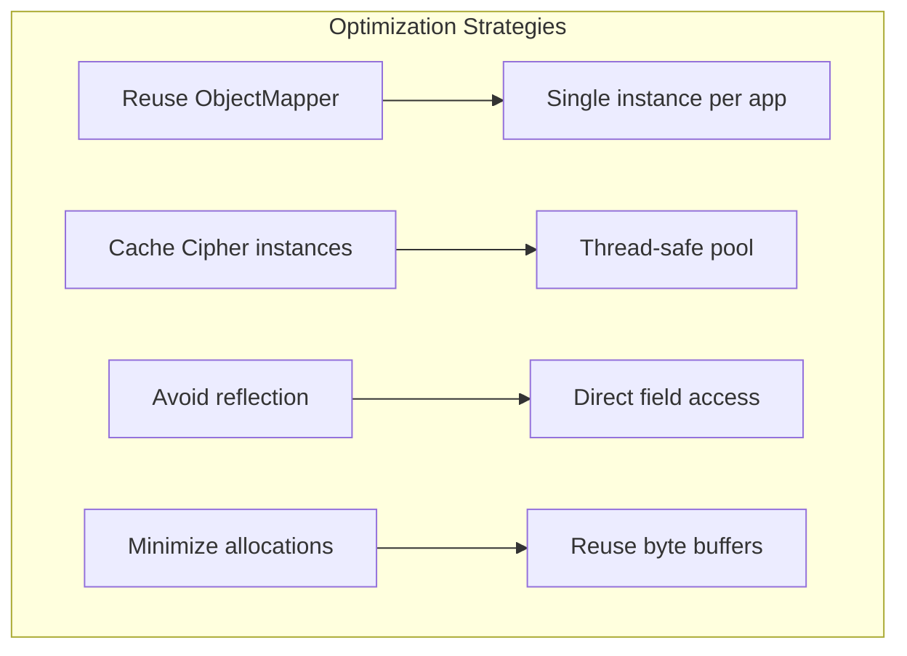

# How to Implement Custom R2DBC Converters

Author: [nawazdhandala](https://github.com/nawazdhandala)

Tags: Java, R2DBC, Spring WebFlux, Reactive Programming, Database, Spring Boot

Description: Learn how to implement custom R2DBC converters for handling complex data types, JSON columns, enums, and encrypted fields in reactive Spring applications with production-ready examples.

---

R2DBC (Reactive Relational Database Connectivity) provides non-blocking database access for Java applications, but it ships with limited type conversion support out of the box. When your domain models use custom types, JSON columns, or encrypted fields, you need custom converters to bridge the gap between your Java objects and database columns.

This guide walks through building production-ready R2DBC converters for real-world scenarios.

## Why Custom Converters Matter

R2DBC's default type mapping handles primitives and common types like `String`, `LocalDateTime`, and `UUID`. But most production applications need more.



Common scenarios requiring custom converters:

- **JSON columns**: Storing complex objects as JSONB in PostgreSQL
- **Enums**: Mapping between Java enums and database strings or integers
- **Encrypted fields**: Transparently encrypting sensitive data before storage
- **Value objects**: Converting domain primitives like `Money`, `EmailAddress`, or `PhoneNumber`
- **Temporal types**: Handling timezone-aware timestamps or legacy date formats

## Setting Up R2DBC with Spring Boot

Before writing converters, ensure your project has the right dependencies.

```xml
<!-- pom.xml -->
<dependencies>
    <dependency>
        <groupId>org.springframework.boot</groupId>
        <artifactId>spring-boot-starter-data-r2dbc</artifactId>
    </dependency>
    <dependency>
        <groupId>org.postgresql</groupId>
        <artifactId>r2dbc-postgresql</artifactId>
        <scope>runtime</scope>
    </dependency>
    <!-- For JSON handling -->
    <dependency>
        <groupId>com.fasterxml.jackson.core</groupId>
        <artifactId>jackson-databind</artifactId>
    </dependency>
</dependencies>
```

## Understanding Converter Interfaces

R2DBC uses Spring's converter infrastructure. Two key interfaces handle the transformation.



- **@ReadingConverter**: Converts database values to Java objects (used when reading from database)
- **@WritingConverter**: Converts Java objects to database values (used when writing to database)

## Building a JSON Column Converter

PostgreSQL's JSONB type is powerful for storing semi-structured data. Here is how to map it to a Java object.

First, define the domain object that will be stored as JSON.

```java
// UserPreferences.java
// This object represents user settings stored in a JSONB column
public class UserPreferences {
    private String theme;
    private String language;
    private boolean emailNotifications;
    private Map<String, Object> customSettings;

    // Default constructor required for Jackson deserialization
    public UserPreferences() {}

    public UserPreferences(String theme, String language, boolean emailNotifications) {
        this.theme = theme;
        this.language = language;
        this.emailNotifications = emailNotifications;
        this.customSettings = new HashMap<>();
    }

    // Getters and setters
    public String getTheme() { return theme; }
    public void setTheme(String theme) { this.theme = theme; }

    public String getLanguage() { return language; }
    public void setLanguage(String language) { this.language = language; }

    public boolean isEmailNotifications() { return emailNotifications; }
    public void setEmailNotifications(boolean emailNotifications) {
        this.emailNotifications = emailNotifications;
    }

    public Map<String, Object> getCustomSettings() { return customSettings; }
    public void setCustomSettings(Map<String, Object> customSettings) {
        this.customSettings = customSettings;
    }
}
```

Now create the reading converter that transforms database JSON into your Java object.

```java
// JsonToUserPreferencesConverter.java
import io.r2dbc.postgresql.codec.Json;
import org.springframework.core.convert.converter.Converter;
import org.springframework.data.convert.ReadingConverter;
import com.fasterxml.jackson.databind.ObjectMapper;

// @ReadingConverter tells Spring this handles database-to-Java conversion
@ReadingConverter
public class JsonToUserPreferencesConverter implements Converter<Json, UserPreferences> {

    private final ObjectMapper objectMapper;

    public JsonToUserPreferencesConverter(ObjectMapper objectMapper) {
        this.objectMapper = objectMapper;
    }

    @Override
    public UserPreferences convert(Json source) {
        try {
            // Json.asString() extracts the raw JSON string from PostgreSQL's Json type
            return objectMapper.readValue(source.asString(), UserPreferences.class);
        } catch (Exception e) {
            // Log the error and return sensible defaults rather than crashing
            // In production, consider metrics and alerting here
            throw new IllegalArgumentException(
                "Failed to deserialize UserPreferences from JSON: " + source.asString(), e
            );
        }
    }
}
```

The writing converter handles the Java-to-database direction.

```java
// UserPreferencesToJsonConverter.java
import io.r2dbc.postgresql.codec.Json;
import org.springframework.core.convert.converter.Converter;
import org.springframework.data.convert.WritingConverter;
import com.fasterxml.jackson.databind.ObjectMapper;

// @WritingConverter tells Spring this handles Java-to-database conversion
@WritingConverter
public class UserPreferencesToJsonConverter implements Converter<UserPreferences, Json> {

    private final ObjectMapper objectMapper;

    public UserPreferencesToJsonConverter(ObjectMapper objectMapper) {
        this.objectMapper = objectMapper;
    }

    @Override
    public Json convert(UserPreferences source) {
        try {
            // Json.of() creates a PostgreSQL Json object from a string
            String json = objectMapper.writeValueAsString(source);
            return Json.of(json);
        } catch (Exception e) {
            throw new IllegalArgumentException(
                "Failed to serialize UserPreferences to JSON", e
            );
        }
    }
}
```

## Creating an Enum Converter

Enums stored as strings in the database need bidirectional conversion. Here is a pattern that handles unknown values gracefully.

```java
// AccountStatus.java
// Business enum representing account states
public enum AccountStatus {
    ACTIVE("active"),
    SUSPENDED("suspended"),
    PENDING_VERIFICATION("pending_verification"),
    CLOSED("closed"),
    UNKNOWN("unknown");  // Fallback for unrecognized database values

    private final String databaseValue;

    AccountStatus(String databaseValue) {
        this.databaseValue = databaseValue;
    }

    public String getDatabaseValue() {
        return databaseValue;
    }

    // Factory method that handles unknown values without throwing exceptions
    public static AccountStatus fromDatabaseValue(String value) {
        if (value == null) {
            return UNKNOWN;
        }
        for (AccountStatus status : values()) {
            if (status.databaseValue.equals(value)) {
                return status;
            }
        }
        // Return UNKNOWN instead of throwing - prevents data corruption from breaking reads
        return UNKNOWN;
    }
}
```

The converters for this enum are straightforward.

```java
// StringToAccountStatusConverter.java
import org.springframework.core.convert.converter.Converter;
import org.springframework.data.convert.ReadingConverter;

@ReadingConverter
public class StringToAccountStatusConverter implements Converter<String, AccountStatus> {

    @Override
    public AccountStatus convert(String source) {
        // Delegate to the enum's factory method for consistent behavior
        return AccountStatus.fromDatabaseValue(source);
    }
}
```

```java
// AccountStatusToStringConverter.java
import org.springframework.core.convert.converter.Converter;
import org.springframework.data.convert.WritingConverter;

@WritingConverter
public class AccountStatusToStringConverter implements Converter<AccountStatus, String> {

    @Override
    public String convert(AccountStatus source) {
        // Use the database-specific value, not the enum name
        return source.getDatabaseValue();
    }
}
```

## Building an Encrypted Field Converter

Sensitive data like API keys or personal information should be encrypted at rest. This converter handles transparent encryption and decryption.

```java
// EncryptedString.java
// A wrapper type that signals this field should be encrypted in the database
public final class EncryptedString {
    private final String value;

    private EncryptedString(String value) {
        this.value = value;
    }

    public static EncryptedString of(String value) {
        return new EncryptedString(value);
    }

    public String getValue() {
        return value;
    }

    // Override equals/hashCode for proper collection behavior
    @Override
    public boolean equals(Object o) {
        if (this == o) return true;
        if (o == null || getClass() != o.getClass()) return false;
        EncryptedString that = (EncryptedString) o;
        return Objects.equals(value, that.value);
    }

    @Override
    public int hashCode() {
        return Objects.hash(value);
    }
}
```

The encryption service handles the actual cryptographic operations.

```java
// EncryptionService.java
import javax.crypto.Cipher;
import javax.crypto.SecretKey;
import javax.crypto.spec.GCMParameterSpec;
import javax.crypto.spec.SecretKeySpec;
import java.nio.ByteBuffer;
import java.security.SecureRandom;
import java.util.Base64;

public class EncryptionService {

    // AES-GCM provides both encryption and authentication
    private static final String ALGORITHM = "AES/GCM/NoPadding";
    private static final int GCM_IV_LENGTH = 12;
    private static final int GCM_TAG_LENGTH = 128;

    private final SecretKey secretKey;
    private final SecureRandom secureRandom;

    public EncryptionService(String base64Key) {
        // Key should be loaded from secure configuration (Vault, AWS KMS, etc.)
        byte[] keyBytes = Base64.getDecoder().decode(base64Key);
        this.secretKey = new SecretKeySpec(keyBytes, "AES");
        this.secureRandom = new SecureRandom();
    }

    public String encrypt(String plaintext) {
        try {
            // Generate a random IV for each encryption operation
            byte[] iv = new byte[GCM_IV_LENGTH];
            secureRandom.nextBytes(iv);

            Cipher cipher = Cipher.getInstance(ALGORITHM);
            GCMParameterSpec parameterSpec = new GCMParameterSpec(GCM_TAG_LENGTH, iv);
            cipher.init(Cipher.ENCRYPT_MODE, secretKey, parameterSpec);

            byte[] ciphertext = cipher.doFinal(plaintext.getBytes());

            // Prepend IV to ciphertext for storage
            // Format: [IV (12 bytes)][Ciphertext + Auth Tag]
            ByteBuffer byteBuffer = ByteBuffer.allocate(iv.length + ciphertext.length);
            byteBuffer.put(iv);
            byteBuffer.put(ciphertext);

            return Base64.getEncoder().encodeToString(byteBuffer.array());
        } catch (Exception e) {
            throw new RuntimeException("Encryption failed", e);
        }
    }

    public String decrypt(String encryptedBase64) {
        try {
            byte[] decoded = Base64.getDecoder().decode(encryptedBase64);

            // Extract IV from the beginning of the payload
            ByteBuffer byteBuffer = ByteBuffer.wrap(decoded);
            byte[] iv = new byte[GCM_IV_LENGTH];
            byteBuffer.get(iv);

            // Remaining bytes are ciphertext + auth tag
            byte[] ciphertext = new byte[byteBuffer.remaining()];
            byteBuffer.get(ciphertext);

            Cipher cipher = Cipher.getInstance(ALGORITHM);
            GCMParameterSpec parameterSpec = new GCMParameterSpec(GCM_TAG_LENGTH, iv);
            cipher.init(Cipher.DECRYPT_MODE, secretKey, parameterSpec);

            return new String(cipher.doFinal(ciphertext));
        } catch (Exception e) {
            throw new RuntimeException("Decryption failed", e);
        }
    }
}
```

Now the converters that use this service.

```java
// StringToEncryptedStringConverter.java
import org.springframework.core.convert.converter.Converter;
import org.springframework.data.convert.ReadingConverter;

@ReadingConverter
public class StringToEncryptedStringConverter implements Converter<String, EncryptedString> {

    private final EncryptionService encryptionService;

    public StringToEncryptedStringConverter(EncryptionService encryptionService) {
        this.encryptionService = encryptionService;
    }

    @Override
    public EncryptedString convert(String source) {
        // Decrypt when reading from database
        String decrypted = encryptionService.decrypt(source);
        return EncryptedString.of(decrypted);
    }
}
```

```java
// EncryptedStringToStringConverter.java
import org.springframework.core.convert.converter.Converter;
import org.springframework.data.convert.WritingConverter;

@WritingConverter
public class EncryptedStringToStringConverter implements Converter<EncryptedString, String> {

    private final EncryptionService encryptionService;

    public EncryptedStringToStringConverter(EncryptionService encryptionService) {
        this.encryptionService = encryptionService;
    }

    @Override
    public String convert(EncryptedString source) {
        // Encrypt when writing to database
        return encryptionService.encrypt(source.getValue());
    }
}
```

## Value Object Converter: Money Type

Financial applications need precise money handling. Here is a converter for a `Money` value object.

```java
// Money.java
import java.math.BigDecimal;
import java.util.Currency;

// Immutable value object for monetary amounts
public final class Money {
    private final BigDecimal amount;
    private final Currency currency;

    private Money(BigDecimal amount, Currency currency) {
        this.amount = amount;
        this.currency = currency;
    }

    public static Money of(BigDecimal amount, String currencyCode) {
        return new Money(amount, Currency.getInstance(currencyCode));
    }

    public static Money of(BigDecimal amount, Currency currency) {
        return new Money(amount, currency);
    }

    // Parse from database storage format: "100.00 USD"
    public static Money parse(String value) {
        if (value == null || value.isBlank()) {
            return null;
        }
        String[] parts = value.split(" ");
        if (parts.length != 2) {
            throw new IllegalArgumentException("Invalid money format: " + value);
        }
        return of(new BigDecimal(parts[0]), parts[1]);
    }

    // Format for database storage
    public String toStorageFormat() {
        return amount.toPlainString() + " " + currency.getCurrencyCode();
    }

    public BigDecimal getAmount() { return amount; }
    public Currency getCurrency() { return currency; }

    @Override
    public String toString() {
        return toStorageFormat();
    }

    @Override
    public boolean equals(Object o) {
        if (this == o) return true;
        if (o == null || getClass() != o.getClass()) return false;
        Money money = (Money) o;
        return amount.compareTo(money.amount) == 0 &&
               currency.equals(money.currency);
    }

    @Override
    public int hashCode() {
        return Objects.hash(amount, currency);
    }
}
```

```java
// StringToMoneyConverter.java
import org.springframework.core.convert.converter.Converter;
import org.springframework.data.convert.ReadingConverter;

@ReadingConverter
public class StringToMoneyConverter implements Converter<String, Money> {

    @Override
    public Money convert(String source) {
        return Money.parse(source);
    }
}
```

```java
// MoneyToStringConverter.java
import org.springframework.core.convert.converter.Converter;
import org.springframework.data.convert.WritingConverter;

@WritingConverter
public class MoneyToStringConverter implements Converter<Money, String> {

    @Override
    public String convert(Money source) {
        return source.toStorageFormat();
    }
}
```

## Registering Converters with R2DBC

All converters must be registered through Spring's configuration. Create a configuration class that assembles all your converters.

```java
// R2dbcConfiguration.java
import io.r2dbc.spi.ConnectionFactory;
import org.springframework.context.annotation.Bean;
import org.springframework.context.annotation.Configuration;
import org.springframework.data.r2dbc.config.AbstractR2dbcConfiguration;
import org.springframework.data.r2dbc.convert.R2dbcCustomConversions;
import com.fasterxml.jackson.databind.ObjectMapper;
import java.util.ArrayList;
import java.util.List;

@Configuration
public class R2dbcConfiguration extends AbstractR2dbcConfiguration {

    private final ConnectionFactory connectionFactory;
    private final ObjectMapper objectMapper;
    private final EncryptionService encryptionService;

    public R2dbcConfiguration(
            ConnectionFactory connectionFactory,
            ObjectMapper objectMapper,
            EncryptionService encryptionService) {
        this.connectionFactory = connectionFactory;
        this.objectMapper = objectMapper;
        this.encryptionService = encryptionService;
    }

    @Override
    public ConnectionFactory connectionFactory() {
        return connectionFactory;
    }

    @Bean
    @Override
    public R2dbcCustomConversions r2dbcCustomConversions() {
        List<Object> converters = new ArrayList<>();

        // JSON converters
        converters.add(new JsonToUserPreferencesConverter(objectMapper));
        converters.add(new UserPreferencesToJsonConverter(objectMapper));

        // Enum converters
        converters.add(new StringToAccountStatusConverter());
        converters.add(new AccountStatusToStringConverter());

        // Encrypted field converters
        converters.add(new StringToEncryptedStringConverter(encryptionService));
        converters.add(new EncryptedStringToStringConverter(encryptionService));

        // Value object converters
        converters.add(new StringToMoneyConverter());
        converters.add(new MoneyToStringConverter());

        return R2dbcCustomConversions.of(
            R2dbcCustomConversions.STORE_CONVERTERS,
            converters
        );
    }
}
```

## Using Converters in Entity Classes

With converters registered, your entity classes can use custom types directly.

```java
// User.java
import org.springframework.data.annotation.Id;
import org.springframework.data.relational.core.mapping.Column;
import org.springframework.data.relational.core.mapping.Table;
import java.time.Instant;

@Table("users")
public class User {

    @Id
    private Long id;

    private String email;

    // Uses AccountStatus converters automatically
    @Column("status")
    private AccountStatus status;

    // Uses UserPreferences JSON converters automatically
    @Column("preferences")
    private UserPreferences preferences;

    // Uses EncryptedString converters automatically
    @Column("api_key")
    private EncryptedString apiKey;

    // Uses Money converters automatically
    @Column("account_balance")
    private Money accountBalance;

    @Column("created_at")
    private Instant createdAt;

    // Constructors, getters, setters...
    public User() {}

    public User(String email, AccountStatus status) {
        this.email = email;
        this.status = status;
        this.createdAt = Instant.now();
    }

    // Getters and setters
    public Long getId() { return id; }
    public void setId(Long id) { this.id = id; }

    public String getEmail() { return email; }
    public void setEmail(String email) { this.email = email; }

    public AccountStatus getStatus() { return status; }
    public void setStatus(AccountStatus status) { this.status = status; }

    public UserPreferences getPreferences() { return preferences; }
    public void setPreferences(UserPreferences preferences) {
        this.preferences = preferences;
    }

    public EncryptedString getApiKey() { return apiKey; }
    public void setApiKey(EncryptedString apiKey) { this.apiKey = apiKey; }

    public Money getAccountBalance() { return accountBalance; }
    public void setAccountBalance(Money accountBalance) {
        this.accountBalance = accountBalance;
    }

    public Instant getCreatedAt() { return createdAt; }
    public void setCreatedAt(Instant createdAt) { this.createdAt = createdAt; }
}
```

The corresponding database schema.

```sql
-- PostgreSQL schema
CREATE TABLE users (
    id BIGSERIAL PRIMARY KEY,
    email VARCHAR(255) NOT NULL UNIQUE,
    status VARCHAR(50) NOT NULL DEFAULT 'pending_verification',
    preferences JSONB DEFAULT '{}',
    api_key TEXT,  -- Stored encrypted
    account_balance VARCHAR(50),  -- Stored as "100.00 USD"
    created_at TIMESTAMP WITH TIME ZONE DEFAULT NOW()
);

-- Index on JSONB field for queries like preferences->>'theme'
CREATE INDEX idx_users_preferences ON users USING GIN (preferences);
```

## Testing Converters

Unit tests ensure converters handle edge cases correctly.

```java
// UserPreferencesConverterTest.java
import org.junit.jupiter.api.BeforeEach;
import org.junit.jupiter.api.Test;
import com.fasterxml.jackson.databind.ObjectMapper;
import io.r2dbc.postgresql.codec.Json;
import static org.assertj.core.api.Assertions.*;

class UserPreferencesConverterTest {

    private ObjectMapper objectMapper;
    private JsonToUserPreferencesConverter readingConverter;
    private UserPreferencesToJsonConverter writingConverter;

    @BeforeEach
    void setUp() {
        objectMapper = new ObjectMapper();
        readingConverter = new JsonToUserPreferencesConverter(objectMapper);
        writingConverter = new UserPreferencesToJsonConverter(objectMapper);
    }

    @Test
    void shouldConvertJsonToUserPreferences() {
        // Given: JSON from database
        String jsonString = "{\"theme\":\"dark\",\"language\":\"en\"," +
                           "\"emailNotifications\":true,\"customSettings\":{}}";
        Json json = Json.of(jsonString);

        // When: Converting to Java object
        UserPreferences result = readingConverter.convert(json);

        // Then: Object is properly populated
        assertThat(result.getTheme()).isEqualTo("dark");
        assertThat(result.getLanguage()).isEqualTo("en");
        assertThat(result.isEmailNotifications()).isTrue();
    }

    @Test
    void shouldConvertUserPreferencesToJson() {
        // Given: Java object
        UserPreferences prefs = new UserPreferences("light", "fr", false);

        // When: Converting to database format
        Json result = writingConverter.convert(prefs);

        // Then: JSON contains expected fields
        String jsonString = result.asString();
        assertThat(jsonString).contains("\"theme\":\"light\"");
        assertThat(jsonString).contains("\"language\":\"fr\"");
        assertThat(jsonString).contains("\"emailNotifications\":false");
    }

    @Test
    void shouldHandleRoundTrip() {
        // Given: Original object
        UserPreferences original = new UserPreferences("dark", "de", true);
        original.getCustomSettings().put("fontSize", 14);

        // When: Converting to JSON and back
        Json json = writingConverter.convert(original);
        UserPreferences restored = readingConverter.convert(json);

        // Then: Data is preserved
        assertThat(restored.getTheme()).isEqualTo(original.getTheme());
        assertThat(restored.getLanguage()).isEqualTo(original.getLanguage());
        assertThat(restored.isEmailNotifications())
            .isEqualTo(original.isEmailNotifications());
    }
}
```

Integration test with a real database.

```java
// UserRepositoryIntegrationTest.java
import org.junit.jupiter.api.Test;
import org.springframework.beans.factory.annotation.Autowired;
import org.springframework.boot.test.context.SpringBootTest;
import org.testcontainers.containers.PostgreSQLContainer;
import org.testcontainers.junit.jupiter.Container;
import org.testcontainers.junit.jupiter.Testcontainers;
import reactor.test.StepVerifier;
import java.math.BigDecimal;

@SpringBootTest
@Testcontainers
class UserRepositoryIntegrationTest {

    @Container
    static PostgreSQLContainer<?> postgres = new PostgreSQLContainer<>("postgres:15")
            .withDatabaseName("testdb")
            .withUsername("test")
            .withPassword("test");

    @Autowired
    private UserRepository userRepository;

    @Test
    void shouldPersistAndRetrieveUserWithCustomTypes() {
        // Given: User with custom types
        User user = new User("test@example.com", AccountStatus.ACTIVE);
        user.setPreferences(new UserPreferences("dark", "en", true));
        user.setApiKey(EncryptedString.of("secret-api-key-12345"));
        user.setAccountBalance(Money.of(new BigDecimal("99.99"), "USD"));

        // When: Saving and retrieving
        StepVerifier.create(
            userRepository.save(user)
                .flatMap(saved -> userRepository.findById(saved.getId()))
        )
        // Then: All custom types are preserved
        .assertNext(retrieved -> {
            assertThat(retrieved.getStatus()).isEqualTo(AccountStatus.ACTIVE);
            assertThat(retrieved.getPreferences().getTheme()).isEqualTo("dark");
            assertThat(retrieved.getApiKey().getValue()).isEqualTo("secret-api-key-12345");
            assertThat(retrieved.getAccountBalance().getAmount())
                .isEqualByComparingTo(new BigDecimal("99.99"));
        })
        .verifyComplete();
    }
}
```

## Performance Considerations

Custom converters run on every read and write operation. Keep these guidelines in mind.



**Key optimizations:**

1. **Singleton converters**: Register converters as Spring beans, not new instances
2. **Reuse ObjectMapper**: Create once, share across all JSON converters
3. **Pool Cipher instances**: For encryption converters, consider a cipher pool
4. **Measure overhead**: Profile converter execution time in production

```java
// MeteredJsonConverter.java
// Example: Adding metrics to monitor converter performance
@ReadingConverter
public class MeteredJsonConverter implements Converter<Json, UserPreferences> {

    private final ObjectMapper objectMapper;
    private final MeterRegistry meterRegistry;
    private final Timer conversionTimer;

    public MeteredJsonConverter(ObjectMapper objectMapper, MeterRegistry meterRegistry) {
        this.objectMapper = objectMapper;
        this.meterRegistry = meterRegistry;
        this.conversionTimer = Timer.builder("r2dbc.converter.json.read")
            .description("Time to convert JSON to UserPreferences")
            .register(meterRegistry);
    }

    @Override
    public UserPreferences convert(Json source) {
        return conversionTimer.record(() -> {
            try {
                return objectMapper.readValue(source.asString(), UserPreferences.class);
            } catch (Exception e) {
                meterRegistry.counter("r2dbc.converter.json.errors").increment();
                throw new IllegalArgumentException("JSON conversion failed", e);
            }
        });
    }
}
```

## Summary

| Converter Type | Use Case | Database Type |
|---------------|----------|---------------|
| **JSON** | Complex nested objects | JSONB |
| **Enum** | Finite state values | VARCHAR or INT |
| **Encrypted** | Sensitive data | TEXT |
| **Value Object** | Domain primitives | VARCHAR |

Custom R2DBC converters let you keep your domain model clean while handling the reality of database storage formats. The patterns shown here work in production systems handling millions of operations daily. Start with the simplest converter that solves your problem, add error handling, then optimize based on actual measurements.

For related topics on working with databases in reactive applications, check out our guide on [skipping the ORM when performance matters](https://oneuptime.com/blog/post/2025-11-13-when-performance-matters-skip-the-orm/view).
