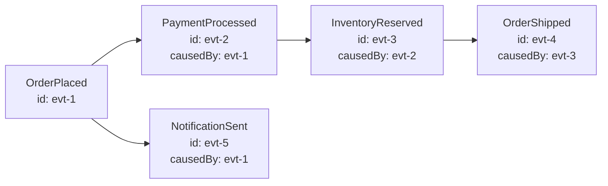
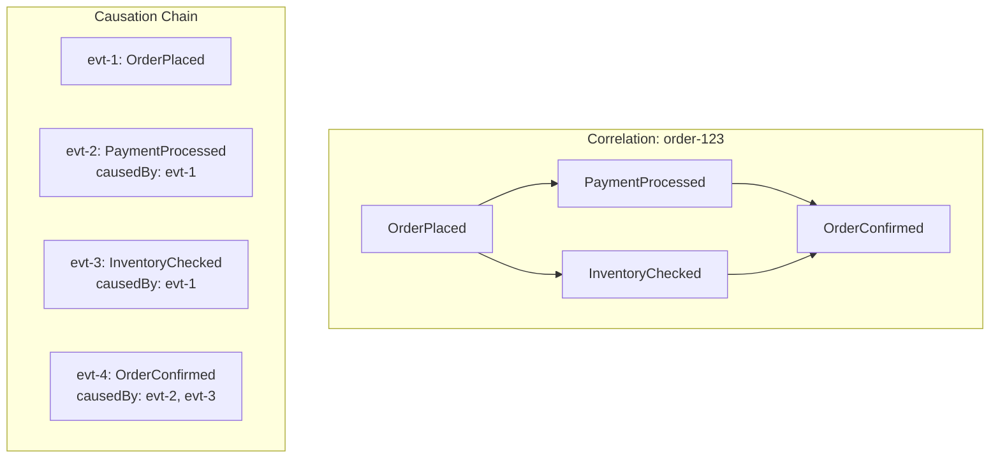

# How to Implement Event Causation Tracking

Author: [nawazdhandala](https://github.com/nawazdhandala)

Tags: Event-Driven, Distributed Systems, Observability, Debugging, OpenTelemetry

Description: Learn how to implement event causation tracking to understand the causal relationships between events in distributed systems, enabling faster debugging and better system visibility.

---

When something goes wrong in an event-driven system, the first question is always "what caused this?" Without causation tracking, you are left searching through logs, guessing which events triggered which responses, and hoping the timestamps line up. Event causation tracking solves this by explicitly recording the causal chain between events.

This guide walks through building a production-ready causation tracking system, from the core concepts to implementation patterns that scale.

---

## What is Event Causation?

Event causation captures the "caused by" relationship between events. When Event B happens because of Event A, you record that A is the cause of B. This creates a directed graph of events that shows exactly how one event led to another.

Consider an order processing flow:



Each event knows what caused it. When the shipment fails, you can trace back through the chain to understand the full context.

---

## Causation vs Correlation

These terms get confused often. Here is the distinction:

| Concept | Definition | Use Case |
|---------|------------|----------|
| Correlation ID | Groups all events belonging to the same business transaction | Finding all events related to order #12345 |
| Causation ID | Points to the specific event that triggered this one | Understanding why this specific event happened |

Both are useful. Correlation gives you the big picture. Causation gives you the causal chain.



Notice how OrderConfirmed has two causes. It could not happen until both payment and inventory checks completed.

---

## Core Data Model

The foundation of causation tracking is the event envelope. Every event carries metadata about its identity and origin.

This TypeScript interface defines the structure. Each event has a unique ID, an optional causation ID pointing to its cause, and a correlation ID linking it to the broader transaction.

```typescript
// event-types.ts
// Core event envelope structure for causation tracking

interface EventMetadata {
  // Unique identifier for this specific event instance
  eventId: string;

  // ID of the event that directly caused this one (null for root events)
  causationId: string | null;

  // Shared ID across all events in the same business transaction
  correlationId: string;

  // When the event was created (ISO 8601)
  timestamp: string;

  // Service that produced this event
  source: string;

  // Schema version for forward compatibility
  version: number;
}

interface DomainEvent<T = unknown> {
  metadata: EventMetadata;
  type: string;
  payload: T;
}

// Example: Order placed event
interface OrderPlacedPayload {
  orderId: string;
  customerId: string;
  items: Array<{ sku: string; quantity: number; price: number }>;
  totalAmount: number;
}

type OrderPlacedEvent = DomainEvent<OrderPlacedPayload>;
```

---

## Building the Event Factory

Events should be created through a factory that handles ID generation and causation linking automatically. This prevents developers from forgetting to set causation IDs.

The factory provides two methods: one for root events that start a new causal chain, and one for derived events that continue an existing chain.

```typescript
// event-factory.ts
import { randomUUID } from 'crypto';

interface EventMetadata {
  eventId: string;
  causationId: string | null;
  correlationId: string;
  timestamp: string;
  source: string;
  version: number;
}

interface DomainEvent<T = unknown> {
  metadata: EventMetadata;
  type: string;
  payload: T;
}

// Configuration for the event factory
interface EventFactoryConfig {
  serviceName: string;
  defaultVersion?: number;
}

class EventFactory {
  private serviceName: string;
  private defaultVersion: number;

  constructor(config: EventFactoryConfig) {
    this.serviceName = config.serviceName;
    this.defaultVersion = config.defaultVersion ?? 1;
  }

  // Create a root event (no cause, starts a new correlation chain)
  createRootEvent<T>(
    type: string,
    payload: T,
    correlationId?: string
  ): DomainEvent<T> {
    return {
      metadata: {
        eventId: randomUUID(),
        causationId: null,
        correlationId: correlationId ?? randomUUID(),
        timestamp: new Date().toISOString(),
        source: this.serviceName,
        version: this.defaultVersion,
      },
      type,
      payload,
    };
  }

  // Create a derived event (caused by another event)
  createDerivedEvent<T>(
    type: string,
    payload: T,
    causeEvent: DomainEvent<unknown>
  ): DomainEvent<T> {
    return {
      metadata: {
        eventId: randomUUID(),
        // Link to the event that caused this one
        causationId: causeEvent.metadata.eventId,
        // Preserve the correlation ID from the cause
        correlationId: causeEvent.metadata.correlationId,
        timestamp: new Date().toISOString(),
        source: this.serviceName,
        version: this.defaultVersion,
      },
      type,
      payload,
    };
  }

  // Create a derived event with multiple causes (fan-in scenarios)
  createMultiCauseEvent<T>(
    type: string,
    payload: T,
    causeEvents: DomainEvent<unknown>[]
  ): DomainEvent<T> & { metadata: { causationIds: string[] } } {
    if (causeEvents.length === 0) {
      throw new Error('At least one cause event is required');
    }

    // Use the first event's correlation ID (all should be the same)
    const correlationId = causeEvents[0].metadata.correlationId;

    return {
      metadata: {
        eventId: randomUUID(),
        // Primary cause for backwards compatibility
        causationId: causeEvents[0].metadata.eventId,
        // All causes for full lineage
        causationIds: causeEvents.map((e) => e.metadata.eventId),
        correlationId,
        timestamp: new Date().toISOString(),
        source: this.serviceName,
        version: this.defaultVersion,
      },
      type,
      payload,
    };
  }
}

export { EventFactory, DomainEvent, EventMetadata };
```

---

## Implementing Causation in Event Handlers

When a service receives an event and produces new events in response, it must pass the causation context forward. Here is how this works in practice.

The handler receives an incoming event, processes it, and creates derived events that reference the incoming event as their cause.

```typescript
// order-handler.ts
import { EventFactory, DomainEvent } from './event-factory';
import { EventPublisher } from './event-publisher';

interface OrderPlacedPayload {
  orderId: string;
  customerId: string;
  totalAmount: number;
}

interface PaymentRequestedPayload {
  orderId: string;
  customerId: string;
  amount: number;
  paymentMethod: string;
}

interface InventoryReservationRequestedPayload {
  orderId: string;
  items: Array<{ sku: string; quantity: number }>;
}

class OrderHandler {
  private eventFactory: EventFactory;
  private publisher: EventPublisher;

  constructor(eventFactory: EventFactory, publisher: EventPublisher) {
    this.eventFactory = eventFactory;
    this.publisher = publisher;
  }

  // Handle an incoming OrderPlaced event
  async handleOrderPlaced(
    event: DomainEvent<OrderPlacedPayload>
  ): Promise<void> {
    const { orderId, customerId, totalAmount } = event.payload;

    console.log(
      `Processing OrderPlaced: ${orderId}, ` +
      `causedBy: ${event.metadata.causationId ?? 'root'}`
    );

    // Create derived events that reference this event as their cause
    const paymentEvent = this.eventFactory.createDerivedEvent<PaymentRequestedPayload>(
      'PaymentRequested',
      {
        orderId,
        customerId,
        amount: totalAmount,
        paymentMethod: 'credit_card',
      },
      event // Pass the cause event
    );

    const inventoryEvent = this.eventFactory.createDerivedEvent<InventoryReservationRequestedPayload>(
      'InventoryReservationRequested',
      {
        orderId,
        items: [], // Would come from event.payload in real implementation
      },
      event // Same cause event
    );

    // Publish both derived events
    await Promise.all([
      this.publisher.publish(paymentEvent),
      this.publisher.publish(inventoryEvent),
    ]);

    console.log(
      `Published PaymentRequested (${paymentEvent.metadata.eventId}) ` +
      `and InventoryReservationRequested (${inventoryEvent.metadata.eventId})`
    );
  }
}

export { OrderHandler };
```

---

## Building a Causation Graph

For debugging and visualization, you need to reconstruct the causation graph from stored events. This graph shows the complete causal chain of what happened.

This implementation builds an in-memory graph and provides methods to traverse it in both directions.

```typescript
// causation-graph.ts
import { DomainEvent } from './event-factory';

interface GraphNode {
  event: DomainEvent<unknown>;
  children: GraphNode[];
  parent: GraphNode | null;
}

class CausationGraph {
  private nodes: Map<string, GraphNode> = new Map();
  private roots: GraphNode[] = [];

  // Add an event to the graph
  addEvent(event: DomainEvent<unknown>): void {
    // Create node for this event
    const node: GraphNode = {
      event,
      children: [],
      parent: null,
    };

    this.nodes.set(event.metadata.eventId, node);

    // Link to parent if it exists
    if (event.metadata.causationId) {
      const parentNode = this.nodes.get(event.metadata.causationId);
      if (parentNode) {
        parentNode.children.push(node);
        node.parent = parentNode;
      }
    } else {
      // No causation ID means this is a root event
      this.roots.push(node);
    }

    // Check if any existing nodes are children of this one
    for (const existingNode of this.nodes.values()) {
      if (existingNode.event.metadata.causationId === event.metadata.eventId) {
        node.children.push(existingNode);
        existingNode.parent = node;
      }
    }
  }

  // Get the full causal chain leading to an event (ancestors)
  getAncestors(eventId: string): DomainEvent<unknown>[] {
    const ancestors: DomainEvent<unknown>[] = [];
    let current = this.nodes.get(eventId);

    while (current?.parent) {
      ancestors.push(current.parent.event);
      current = current.parent;
    }

    return ancestors.reverse(); // Root first
  }

  // Get all events caused by a specific event (descendants)
  getDescendants(eventId: string): DomainEvent<unknown>[] {
    const descendants: DomainEvent<unknown>[] = [];
    const node = this.nodes.get(eventId);

    if (!node) return descendants;

    const traverse = (n: GraphNode): void => {
      for (const child of n.children) {
        descendants.push(child.event);
        traverse(child);
      }
    };

    traverse(node);
    return descendants;
  }

  // Find the root cause of any event
  getRootCause(eventId: string): DomainEvent<unknown> | null {
    const ancestors = this.getAncestors(eventId);
    return ancestors.length > 0 ? ancestors[0] : this.nodes.get(eventId)?.event ?? null;
  }

  // Get all events in the graph ordered by timestamp
  getAllEventsOrdered(): DomainEvent<unknown>[] {
    return Array.from(this.nodes.values())
      .map((n) => n.event)
      .sort((a, b) =>
        new Date(a.metadata.timestamp).getTime() -
        new Date(b.metadata.timestamp).getTime()
      );
  }

  // Export graph for visualization
  toMermaidDiagram(): string {
    const lines: string[] = ['flowchart TD'];

    for (const node of this.nodes.values()) {
      const shortId = node.event.metadata.eventId.slice(0, 8);
      const label = `${shortId}["${node.event.type}<br/>${shortId}"]`;
      lines.push(`    ${label}`);

      for (const child of node.children) {
        const childShortId = child.event.metadata.eventId.slice(0, 8);
        lines.push(`    ${shortId} --> ${childShortId}`);
      }
    }

    return lines.join('\n');
  }
}

export { CausationGraph, GraphNode };
```

---

## Persisting Causation Data

For production systems, you need to persist events with their causation metadata. Here is a PostgreSQL schema and repository implementation.

The schema stores events in a table with indexes optimized for both correlation-based queries (find all events in a transaction) and causation-based queries (trace the causal chain).

```sql
-- migrations/001_create_events_table.sql
-- Event store schema with causation tracking support

CREATE TABLE events (
    -- Primary identifier for the event
    event_id UUID PRIMARY KEY,

    -- Causation tracking fields
    causation_id UUID REFERENCES events(event_id),
    correlation_id UUID NOT NULL,

    -- Event data
    event_type VARCHAR(255) NOT NULL,
    payload JSONB NOT NULL,

    -- Metadata
    source_service VARCHAR(255) NOT NULL,
    schema_version INTEGER NOT NULL DEFAULT 1,
    created_at TIMESTAMPTZ NOT NULL DEFAULT NOW(),

    -- Support for multiple causes (fan-in scenarios)
    causation_ids UUID[] DEFAULT ARRAY[]::UUID[]
);

-- Index for finding all events in a correlation chain
CREATE INDEX idx_events_correlation_id ON events(correlation_id);

-- Index for finding child events (what did this event cause?)
CREATE INDEX idx_events_causation_id ON events(causation_id);

-- Index for time-range queries
CREATE INDEX idx_events_created_at ON events(created_at);

-- Index for event type filtering
CREATE INDEX idx_events_type ON events(event_type);

-- GIN index for querying multiple causation IDs
CREATE INDEX idx_events_causation_ids ON events USING GIN(causation_ids);
```

The repository provides methods for storing events and querying by causation relationships.

```typescript
// event-repository.ts
import { Pool, PoolClient } from 'pg';
import { DomainEvent } from './event-factory';

interface EventRow {
  event_id: string;
  causation_id: string | null;
  correlation_id: string;
  event_type: string;
  payload: unknown;
  source_service: string;
  schema_version: number;
  created_at: Date;
  causation_ids: string[];
}

class EventRepository {
  private pool: Pool;

  constructor(pool: Pool) {
    this.pool = pool;
  }

  // Store a single event
  async save(event: DomainEvent<unknown>): Promise<void> {
    const query = `
      INSERT INTO events (
        event_id, causation_id, correlation_id, event_type,
        payload, source_service, schema_version, causation_ids
      ) VALUES ($1, $2, $3, $4, $5, $6, $7, $8)
    `;

    // Handle multi-cause events
    const causationIds = (event.metadata as any).causationIds ?? [];

    await this.pool.query(query, [
      event.metadata.eventId,
      event.metadata.causationId,
      event.metadata.correlationId,
      event.type,
      JSON.stringify(event.payload),
      event.metadata.source,
      event.metadata.version,
      causationIds,
    ]);
  }

  // Get all events in a correlation chain
  async findByCorrelationId(correlationId: string): Promise<DomainEvent<unknown>[]> {
    const query = `
      SELECT * FROM events
      WHERE correlation_id = $1
      ORDER BY created_at ASC
    `;

    const result = await this.pool.query<EventRow>(query, [correlationId]);
    return result.rows.map(this.rowToEvent);
  }

  // Get all events caused by a specific event
  async findBysCausationId(causationId: string): Promise<DomainEvent<unknown>[]> {
    const query = `
      SELECT * FROM events
      WHERE causation_id = $1
         OR $1 = ANY(causation_ids)
      ORDER BY created_at ASC
    `;

    const result = await this.pool.query<EventRow>(query, [causationId]);
    return result.rows.map(this.rowToEvent);
  }

  // Trace back to find all ancestor events
  async findAncestors(eventId: string): Promise<DomainEvent<unknown>[]> {
    // Recursive CTE to walk up the causation chain
    const query = `
      WITH RECURSIVE ancestors AS (
        -- Base case: start with the target event
        SELECT e.*, 0 as depth
        FROM events e
        WHERE e.event_id = $1

        UNION ALL

        -- Recursive case: find the parent of each event
        SELECT e.*, a.depth + 1
        FROM events e
        INNER JOIN ancestors a ON e.event_id = a.causation_id
      )
      SELECT * FROM ancestors
      WHERE event_id != $1
      ORDER BY depth DESC
    `;

    const result = await this.pool.query<EventRow & { depth: number }>(query, [eventId]);
    return result.rows.map(this.rowToEvent);
  }

  // Find all descendants of an event
  async findDescendants(eventId: string): Promise<DomainEvent<unknown>[]> {
    // Recursive CTE to walk down the causation tree
    const query = `
      WITH RECURSIVE descendants AS (
        -- Base case: start with direct children
        SELECT e.*, 1 as depth
        FROM events e
        WHERE e.causation_id = $1 OR $1 = ANY(e.causation_ids)

        UNION ALL

        -- Recursive case: find children of each child
        SELECT e.*, d.depth + 1
        FROM events e
        INNER JOIN descendants d ON e.causation_id = d.event_id
      )
      SELECT * FROM descendants
      ORDER BY depth ASC, created_at ASC
    `;

    const result = await this.pool.query<EventRow & { depth: number }>(query, [eventId]);
    return result.rows.map(this.rowToEvent);
  }

  // Convert database row to domain event
  private rowToEvent(row: EventRow): DomainEvent<unknown> {
    return {
      metadata: {
        eventId: row.event_id,
        causationId: row.causation_id,
        correlationId: row.correlation_id,
        timestamp: row.created_at.toISOString(),
        source: row.source_service,
        version: row.schema_version,
      },
      type: row.event_type,
      payload: row.payload,
    };
  }
}

export { EventRepository };
```

---

## Integrating with OpenTelemetry

Causation tracking complements distributed tracing. You can link events to spans for complete observability.

This integration creates spans for event processing and attaches causation metadata as attributes, making events visible in your tracing backend.

```typescript
// otel-integration.ts
import { trace, context, SpanKind, SpanStatusCode } from '@opentelemetry/api';
import { DomainEvent } from './event-factory';

const tracer = trace.getTracer('event-processor', '1.0.0');

interface ProcessorOptions<T> {
  eventType: string;
  handler: (event: DomainEvent<T>) => Promise<DomainEvent<unknown>[]>;
}

// Wrap an event handler with OpenTelemetry tracing
function createTracedHandler<T>(
  options: ProcessorOptions<T>
): (event: DomainEvent<T>) => Promise<DomainEvent<unknown>[]> {
  const { eventType, handler } = options;

  return async (event: DomainEvent<T>): Promise<DomainEvent<unknown>[]> => {
    const span = tracer.startSpan(`process.${eventType}`, {
      kind: SpanKind.CONSUMER,
      attributes: {
        // Standard messaging attributes
        'messaging.system': 'custom',
        'messaging.operation': 'process',
        'messaging.message.id': event.metadata.eventId,

        // Causation tracking attributes
        'event.id': event.metadata.eventId,
        'event.type': event.type,
        'event.correlation_id': event.metadata.correlationId,
        'event.causation_id': event.metadata.causationId ?? 'root',
        'event.source': event.metadata.source,
      },
    });

    try {
      // Execute handler within span context
      const result = await context.with(
        trace.setSpan(context.active(), span),
        () => handler(event)
      );

      // Record produced events
      span.setAttribute('event.produced_count', result.length);
      for (let i = 0; i < result.length; i++) {
        span.setAttribute(`event.produced.${i}.id`, result[i].metadata.eventId);
        span.setAttribute(`event.produced.${i}.type`, result[i].type);
      }

      span.setStatus({ code: SpanStatusCode.OK });
      return result;
    } catch (error) {
      span.recordException(error as Error);
      span.setStatus({
        code: SpanStatusCode.ERROR,
        message: (error as Error).message,
      });
      throw error;
    } finally {
      span.end();
    }
  };
}

// Link an event to the current trace context
function enrichEventWithTraceContext<T>(
  event: DomainEvent<T>
): DomainEvent<T> & { metadata: { traceId?: string; spanId?: string } } {
  const currentSpan = trace.getSpan(context.active());

  if (!currentSpan) {
    return event as DomainEvent<T> & { metadata: { traceId?: string; spanId?: string } };
  }

  const spanContext = currentSpan.spanContext();

  return {
    ...event,
    metadata: {
      ...event.metadata,
      traceId: spanContext.traceId,
      spanId: spanContext.spanId,
    },
  };
}

export { createTracedHandler, enrichEventWithTraceContext };
```

---

## Debugging with Causation Chains

When an error occurs, you can use the causation chain to understand what led to the failure. This debugging utility provides context for incident investigation.

```typescript
// causation-debugger.ts
import { EventRepository } from './event-repository';
import { CausationGraph } from './causation-graph';
import { DomainEvent } from './event-factory';

interface DebugReport {
  targetEvent: DomainEvent<unknown>;
  rootCause: DomainEvent<unknown> | null;
  causationChain: DomainEvent<unknown>[];
  siblingEvents: DomainEvent<unknown>[];
  descendantEvents: DomainEvent<unknown>[];
  timeline: TimelineEntry[];
}

interface TimelineEntry {
  timestamp: string;
  eventId: string;
  eventType: string;
  source: string;
  isCausationChain: boolean;
}

class CausationDebugger {
  private repository: EventRepository;

  constructor(repository: EventRepository) {
    this.repository = repository;
  }

  // Generate a debug report for a specific event
  async generateReport(eventId: string): Promise<DebugReport> {
    // Get the target event and its correlation chain
    const ancestors = await this.repository.findAncestors(eventId);
    const descendants = await this.repository.findDescendants(eventId);

    // Build the causation graph
    const graph = new CausationGraph();
    const correlationId = ancestors[0]?.metadata.correlationId;

    if (correlationId) {
      const allEvents = await this.repository.findByCorrelationId(correlationId);
      for (const event of allEvents) {
        graph.addEvent(event);
      }
    }

    // Find siblings (events with the same parent)
    const targetEvent = graph.getAllEventsOrdered().find(
      (e) => e.metadata.eventId === eventId
    );

    if (!targetEvent) {
      throw new Error(`Event ${eventId} not found`);
    }

    const siblings = correlationId
      ? (await this.repository.findByCorrelationId(correlationId)).filter(
          (e) =>
            e.metadata.causationId === targetEvent.metadata.causationId &&
            e.metadata.eventId !== eventId
        )
      : [];

    // Build timeline
    const allRelatedEvents = [...ancestors, targetEvent, ...descendants];
    const timeline = this.buildTimeline(allRelatedEvents, ancestors);

    return {
      targetEvent,
      rootCause: graph.getRootCause(eventId),
      causationChain: ancestors,
      siblingEvents: siblings,
      descendantEvents: descendants,
      timeline,
    };
  }

  // Build a timeline showing the sequence of events
  private buildTimeline(
    events: DomainEvent<unknown>[],
    causationChain: DomainEvent<unknown>[]
  ): TimelineEntry[] {
    const chainIds = new Set(causationChain.map((e) => e.metadata.eventId));

    return events
      .sort(
        (a, b) =>
          new Date(a.metadata.timestamp).getTime() -
          new Date(b.metadata.timestamp).getTime()
      )
      .map((event) => ({
        timestamp: event.metadata.timestamp,
        eventId: event.metadata.eventId,
        eventType: event.type,
        source: event.metadata.source,
        isCausationChain: chainIds.has(event.metadata.eventId),
      }));
  }

  // Print a human-readable debug report
  formatReport(report: DebugReport): string {
    const lines: string[] = [];

    lines.push('=== Event Causation Debug Report ===\n');

    lines.push('Target Event:');
    lines.push(`  ID: ${report.targetEvent.metadata.eventId}`);
    lines.push(`  Type: ${report.targetEvent.type}`);
    lines.push(`  Source: ${report.targetEvent.metadata.source}`);
    lines.push(`  Time: ${report.targetEvent.metadata.timestamp}`);
    lines.push('');

    if (report.rootCause) {
      lines.push('Root Cause:');
      lines.push(`  ID: ${report.rootCause.metadata.eventId}`);
      lines.push(`  Type: ${report.rootCause.type}`);
      lines.push('');
    }

    lines.push('Causation Chain:');
    for (const event of report.causationChain) {
      lines.push(`  ${event.type} (${event.metadata.eventId.slice(0, 8)})`);
    }
    lines.push(`  -> ${report.targetEvent.type} (TARGET)`);
    lines.push('');

    if (report.siblingEvents.length > 0) {
      lines.push('Sibling Events (same parent):');
      for (const event of report.siblingEvents) {
        lines.push(`  ${event.type} (${event.metadata.eventId.slice(0, 8)})`);
      }
      lines.push('');
    }

    lines.push('Timeline:');
    for (const entry of report.timeline) {
      const marker = entry.isCausationChain ? '*' : ' ';
      lines.push(
        `  ${marker} ${entry.timestamp} | ${entry.eventType} | ${entry.source}`
      );
    }

    return lines.join('\n');
  }
}

export { CausationDebugger, DebugReport };
```

---

## Production Considerations

When running causation tracking in production, keep these points in mind:

### Event ID Generation

Use UUIDs or ULIDs for event IDs. ULIDs are sortable by time, which can help with debugging.

```typescript
// Use ULID for time-sortable IDs
import { ulid } from 'ulid';

function generateEventId(): string {
  return ulid();
}
```

### Handling Missing Causes

Sometimes the cause event is not yet persisted when a derived event arrives. Handle this gracefully.

```typescript
// Store the event even if the cause is not found yet
// The foreign key constraint should be deferred or removed
async function saveWithGracefulCausation(
  event: DomainEvent<unknown>,
  repository: EventRepository
): Promise<void> {
  try {
    await repository.save(event);
  } catch (error) {
    // Log but do not fail if causation reference is missing
    console.warn(
      `Causation event ${event.metadata.causationId} not found, ` +
      `storing ${event.metadata.eventId} anyway`
    );
    // Could retry with null causation or store in a separate table
  }
}
```

### Query Performance

For large event stores, add composite indexes and consider partitioning by time or correlation ID.

```sql
-- Composite index for common query patterns
CREATE INDEX idx_events_correlation_type
ON events(correlation_id, event_type);

-- Partial index for root events
CREATE INDEX idx_events_root
ON events(correlation_id, created_at)
WHERE causation_id IS NULL;

-- Table partitioning by month for large datasets
CREATE TABLE events_partitioned (
    LIKE events INCLUDING ALL
) PARTITION BY RANGE (created_at);

CREATE TABLE events_2026_01 PARTITION OF events_partitioned
FOR VALUES FROM ('2026-01-01') TO ('2026-02-01');
```

### Retention and Archival

Events with causation data can grow large. Implement retention policies that preserve causation chains for a defined period.

```typescript
// Archive old events while preserving causation metadata
interface ArchivedEvent {
  eventId: string;
  causationId: string | null;
  correlationId: string;
  eventType: string;
  archivedAt: Date;
  // Payload moved to cold storage
  payloadLocation: string;
}
```

---

## Summary

Event causation tracking transforms debugging from guesswork into precise investigation. By recording which event caused which, you get:

- Clear causal chains showing exactly how failures propagate
- The ability to find root causes without searching through logs
- Better visibility into complex event flows
- Integration with distributed tracing for complete observability

Start with the event envelope structure and factory pattern. Add persistence with optimized indexes. Build debugging tools that leverage the causation graph. The upfront investment pays off every time you need to answer "why did this happen?"

---

**Related Reading:**

- [How to Implement Event Ordering Guarantees](https://oneuptime.com/blog/post/2026-01-30-event-ordering-guarantees/view)
- [What are Traces and Spans in OpenTelemetry](https://oneuptime.com/blog/post/2025-08-27-traces-and-spans-in-opentelemetry/view)
- [How to Instrument Express.js Applications with OpenTelemetry](https://oneuptime.com/blog/post/2026-01-06-nodejs-express-opentelemetry-instrumentation/view)
