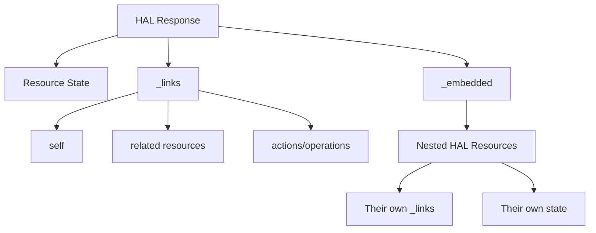
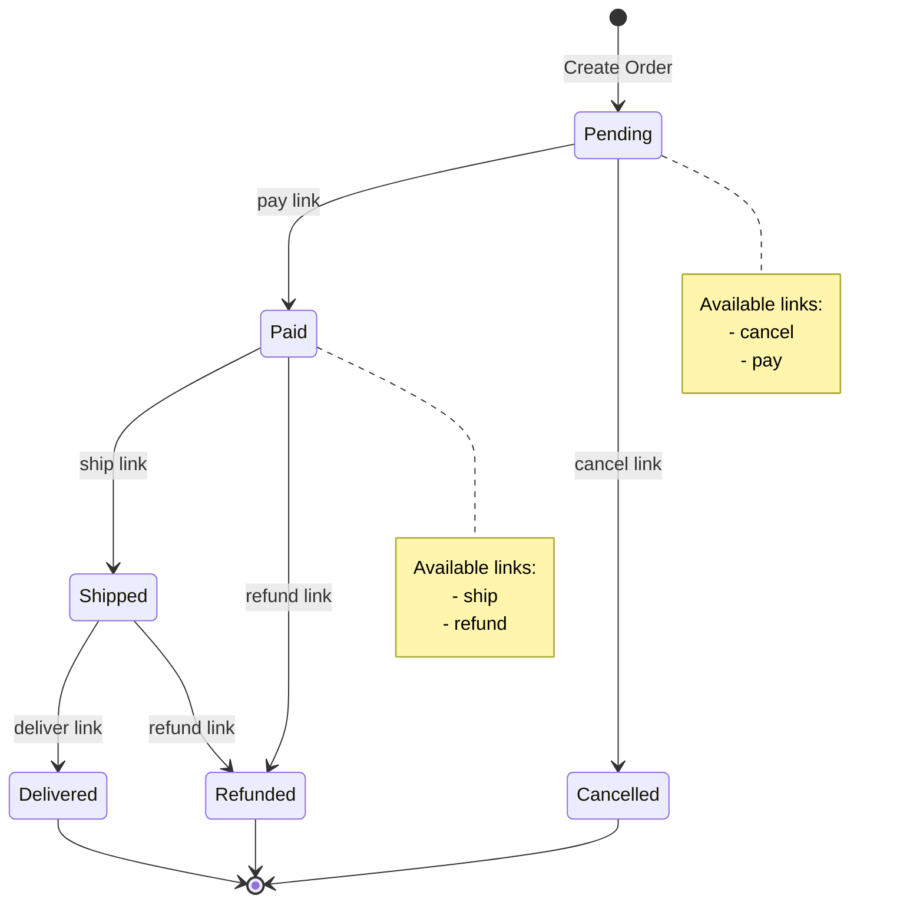
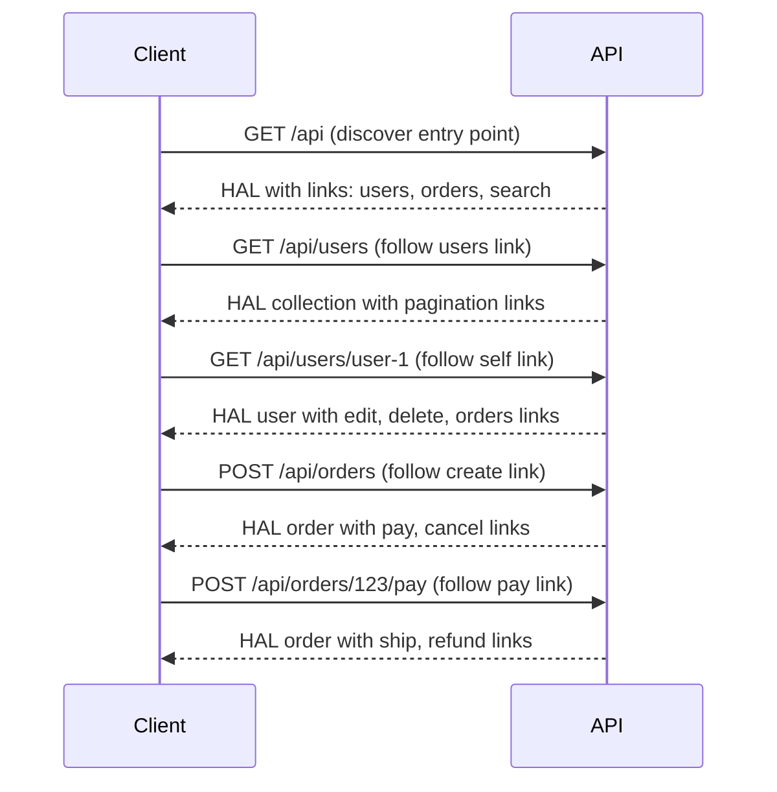

# How to Implement HAL Format for APIs

Author: [nawazdhandala](https://github.com/nawazdhandala)

Tags: API Design, REST, HAL, Hypermedia, HATEOAS, Backend Development

Description: Learn how to implement HAL (Hypertext Application Language) format in your REST APIs with practical examples, production-ready code, and best practices for building discoverable, self-documenting APIs.

---

When building REST APIs, one of the biggest challenges is helping clients understand how to navigate your API without hardcoding URLs everywhere. HAL (Hypertext Application Language) solves this by embedding links directly into your API responses, making your API self-documenting and easier to evolve over time.

## What is HAL?

HAL is a simple format that gives a consistent and easy way to hyperlink between resources in your API. It follows the HATEOAS (Hypermedia as the Engine of Application State) principle, which means clients can discover available actions by following links in the response rather than constructing URLs manually.

A HAL response consists of three main parts:

- **State**: The actual resource data (properties)
- **Links (_links)**: URLs to related resources and available actions
- **Embedded Resources (_embedded)**: Related resources included in the response to reduce round trips

## HAL Response Structure



## Basic HAL Example

Here is a simple HAL response for a user resource:

```json
{
  "id": "user-123",
  "name": "John Doe",
  "email": "john@example.com",
  "createdAt": "2026-01-15T10:30:00Z",
  "_links": {
    "self": {
      "href": "/api/users/user-123"
    },
    "orders": {
      "href": "/api/users/user-123/orders"
    },
    "edit": {
      "href": "/api/users/user-123",
      "method": "PUT"
    },
    "delete": {
      "href": "/api/users/user-123",
      "method": "DELETE"
    }
  }
}
```

## Implementing HAL in Node.js

Let's build a production-ready HAL implementation for a Node.js API.

### HAL Builder Class

This utility class helps construct HAL responses consistently across your API. It handles link generation, resource embedding, and ensures proper structure.

```javascript
// hal-builder.js
class HalBuilder {
  constructor(baseUrl) {
    this.baseUrl = baseUrl;
  }

  // Create a HAL link object with optional attributes
  // The rel parameter identifies the relationship type
  createLink(href, options = {}) {
    const link = {
      href: `${this.baseUrl}${href}`,
    };

    // Add optional link attributes per HAL spec
    if (options.templated) link.templated = true;
    if (options.type) link.type = options.type;
    if (options.deprecation) link.deprecation = options.deprecation;
    if (options.name) link.name = options.name;
    if (options.profile) link.profile = options.profile;
    if (options.title) link.title = options.title;
    if (options.hreflang) link.hreflang = options.hreflang;
    if (options.method) link.method = options.method;

    return link;
  }

  // Build a complete HAL resource from data and links
  // Separates concerns: resource state vs navigation
  buildResource(data, links = {}, embedded = null) {
    const resource = { ...data };

    // Always include at minimum a self link
    resource._links = {};
    for (const [rel, linkData] of Object.entries(links)) {
      if (Array.isArray(linkData)) {
        resource._links[rel] = linkData.map((l) =>
          typeof l === 'string' ? this.createLink(l) : l
        );
      } else if (typeof linkData === 'string') {
        resource._links[rel] = this.createLink(linkData);
      } else {
        resource._links[rel] = linkData;
      }
    }

    // Include embedded resources if provided
    if (embedded && Object.keys(embedded).length > 0) {
      resource._embedded = embedded;
    }

    return resource;
  }

  // Build a paginated collection following HAL conventions
  // Includes navigation links for first, prev, next, last pages
  buildCollection(items, pagination, links = {}) {
    const { page, limit, total } = pagination;
    const totalPages = Math.ceil(total / limit);

    const collectionLinks = {
      self: links.self || `?page=${page}&limit=${limit}`,
      first: `?page=1&limit=${limit}`,
      last: `?page=${totalPages}&limit=${limit}`,
    };

    // Add previous page link if not on first page
    if (page > 1) {
      collectionLinks.prev = `?page=${page - 1}&limit=${limit}`;
    }

    // Add next page link if not on last page
    if (page < totalPages) {
      collectionLinks.next = `?page=${page + 1}&limit=${limit}`;
    }

    // Merge custom links
    Object.assign(collectionLinks, links);

    return this.buildResource(
      {
        page,
        limit,
        total,
        totalPages,
      },
      collectionLinks,
      { items }
    );
  }
}

module.exports = HalBuilder;
```

### Express Middleware for HAL

This middleware automatically sets the correct content type and provides helper methods on the response object for sending HAL responses.

```javascript
// middleware/hal.js
const HalBuilder = require('./hal-builder');

function halMiddleware(options = {}) {
  return (req, res, next) => {
    // Determine base URL from request or options
    const baseUrl = options.baseUrl || `${req.protocol}://${req.get('host')}`;
    const hal = new HalBuilder(baseUrl);

    // Attach HAL builder to request for use in controllers
    req.hal = hal;

    // Helper method to send HAL response with correct content type
    res.hal = (data, links = {}, embedded = null) => {
      res.set('Content-Type', 'application/hal+json');
      res.json(hal.buildResource(data, links, embedded));
    };

    // Helper method to send HAL collection response
    res.halCollection = (items, pagination, links = {}) => {
      res.set('Content-Type', 'application/hal+json');
      res.json(hal.buildCollection(items, pagination, links));
    };

    next();
  };
}

module.exports = halMiddleware;
```

### Complete API Example

Here is a full Express API implementing HAL for a simple order management system.

```javascript
// app.js
const express = require('express');
const halMiddleware = require('./middleware/hal');

const app = express();
app.use(express.json());
app.use(halMiddleware({ baseUrl: process.env.API_BASE_URL || '' }));

// In-memory store for demonstration
const orders = new Map();
const users = new Map();

// Initialize sample data
users.set('user-1', { id: 'user-1', name: 'Alice', email: 'alice@example.com' });
users.set('user-2', { id: 'user-2', name: 'Bob', email: 'bob@example.com' });

// GET /api/users - List all users with HAL links
app.get('/api/users', (req, res) => {
  const page = parseInt(req.query.page) || 1;
  const limit = parseInt(req.query.limit) || 10;
  const userList = Array.from(users.values());

  // Transform each user into a HAL resource with links
  const halUsers = userList.slice((page - 1) * limit, page * limit).map((user) =>
    req.hal.buildResource(user, {
      self: `/api/users/${user.id}`,
      orders: `/api/users/${user.id}/orders`,
    })
  );

  res.halCollection(
    halUsers,
    { page, limit, total: userList.length },
    {
      self: `/api/users?page=${page}&limit=${limit}`,
      create: req.hal.createLink('/api/users', { method: 'POST', title: 'Create new user' }),
    }
  );
});

// GET /api/users/:id - Get single user with full HAL response
app.get('/api/users/:id', (req, res) => {
  const user = users.get(req.params.id);

  if (!user) {
    return res.status(404).json({ error: 'User not found' });
  }

  // Get user's orders for embedding
  const userOrders = Array.from(orders.values())
    .filter((o) => o.userId === user.id)
    .slice(0, 5)
    .map((order) =>
      req.hal.buildResource(order, {
        self: `/api/orders/${order.id}`,
      })
    );

  res.hal(
    user,
    {
      self: `/api/users/${user.id}`,
      orders: `/api/users/${user.id}/orders`,
      edit: req.hal.createLink(`/api/users/${user.id}`, { method: 'PUT' }),
      delete: req.hal.createLink(`/api/users/${user.id}`, { method: 'DELETE' }),
      collection: '/api/users',
    },
    userOrders.length > 0 ? { recentOrders: userOrders } : null
  );
});

// POST /api/orders - Create a new order
app.post('/api/orders', (req, res) => {
  const { userId, items, total } = req.body;

  if (!users.has(userId)) {
    return res.status(400).json({ error: 'Invalid user ID' });
  }

  const orderId = `order-${Date.now()}`;
  const order = {
    id: orderId,
    userId,
    items,
    total,
    status: 'pending',
    createdAt: new Date().toISOString(),
  };

  orders.set(orderId, order);

  // Return 201 Created with Location header and HAL response
  res.status(201);
  res.set('Location', `/api/orders/${orderId}`);
  res.hal(order, {
    self: `/api/orders/${orderId}`,
    user: `/api/users/${userId}`,
    cancel: req.hal.createLink(`/api/orders/${orderId}/cancel`, { method: 'POST' }),
    pay: req.hal.createLink(`/api/orders/${orderId}/pay`, { method: 'POST' }),
  });
});

// GET /api/orders/:id - Get order with status-dependent links
app.get('/api/orders/:id', (req, res) => {
  const order = orders.get(req.params.id);

  if (!order) {
    return res.status(404).json({ error: 'Order not found' });
  }

  // Build links based on order state
  // This is key to HATEOAS: available actions depend on current state
  const links = {
    self: `/api/orders/${order.id}`,
    user: `/api/users/${order.userId}`,
    collection: '/api/orders',
  };

  // Only show cancel link if order can be cancelled
  if (order.status === 'pending') {
    links.cancel = req.hal.createLink(`/api/orders/${order.id}/cancel`, {
      method: 'POST',
      title: 'Cancel this order',
    });
    links.pay = req.hal.createLink(`/api/orders/${order.id}/pay`, {
      method: 'POST',
      title: 'Pay for this order',
    });
  }

  // Only show ship link if order is paid
  if (order.status === 'paid') {
    links.ship = req.hal.createLink(`/api/orders/${order.id}/ship`, {
      method: 'POST',
      title: 'Ship this order',
    });
  }

  // Only show refund link if order is paid or shipped
  if (['paid', 'shipped'].includes(order.status)) {
    links.refund = req.hal.createLink(`/api/orders/${order.id}/refund`, {
      method: 'POST',
      title: 'Refund this order',
    });
  }

  res.hal(order, links);
});

// POST /api/orders/:id/pay - Pay for an order
app.post('/api/orders/:id/pay', (req, res) => {
  const order = orders.get(req.params.id);

  if (!order) {
    return res.status(404).json({ error: 'Order not found' });
  }

  if (order.status !== 'pending') {
    return res.status(400).json({ error: 'Order cannot be paid in current state' });
  }

  order.status = 'paid';
  order.paidAt = new Date().toISOString();

  res.hal(order, {
    self: `/api/orders/${order.id}`,
    user: `/api/users/${order.userId}`,
    ship: req.hal.createLink(`/api/orders/${order.id}/ship`, { method: 'POST' }),
    refund: req.hal.createLink(`/api/orders/${order.id}/refund`, { method: 'POST' }),
  });
});

app.listen(3000, () => {
  console.log('HAL API running on port 3000');
});
```

## State Machine with HAL Links

The following diagram shows how HAL links change based on order state. This is the power of HATEOAS: clients do not need to know the business rules, they just follow available links.



## HAL in Python with FastAPI

Here is the same pattern implemented in Python using FastAPI and Pydantic.

```python
# hal.py
from typing import Any, Dict, List, Optional
from pydantic import BaseModel, Field
from fastapi import Request


class HalLink(BaseModel):
    """Represents a single HAL link with optional attributes."""
    href: str
    templated: Optional[bool] = None
    type: Optional[str] = None
    deprecation: Optional[str] = None
    name: Optional[str] = None
    profile: Optional[str] = None
    title: Optional[str] = None
    hreflang: Optional[str] = None
    method: Optional[str] = None

    class Config:
        # Exclude None values from serialization
        exclude_none = True


class HalResource(BaseModel):
    """
    Base class for HAL resources.
    Inherit from this to create typed HAL responses.
    """
    links: Dict[str, HalLink | List[HalLink]] = Field(default_factory=dict, alias="_links")
    embedded: Optional[Dict[str, Any]] = Field(default=None, alias="_embedded")

    class Config:
        populate_by_name = True
        exclude_none = True


class HalBuilder:
    """Utility class for building HAL responses."""

    def __init__(self, request: Request):
        self.base_url = str(request.base_url).rstrip("/")

    def link(self, path: str, **kwargs) -> HalLink:
        """Create a HAL link with the full URL."""
        return HalLink(href=f"{self.base_url}{path}", **kwargs)

    def resource(
        self,
        data: Dict[str, Any],
        links: Dict[str, HalLink | List[HalLink]],
        embedded: Optional[Dict[str, Any]] = None
    ) -> Dict[str, Any]:
        """Build a complete HAL resource dictionary."""
        result = {**data, "_links": {}}

        for rel, link in links.items():
            if isinstance(link, list):
                result["_links"][rel] = [l.model_dump(exclude_none=True) for l in link]
            else:
                result["_links"][rel] = link.model_dump(exclude_none=True)

        if embedded:
            result["_embedded"] = embedded

        return result

    def collection(
        self,
        items: List[Dict[str, Any]],
        page: int,
        limit: int,
        total: int,
        base_path: str
    ) -> Dict[str, Any]:
        """Build a paginated HAL collection."""
        total_pages = (total + limit - 1) // limit

        links = {
            "self": self.link(f"{base_path}?page={page}&limit={limit}"),
            "first": self.link(f"{base_path}?page=1&limit={limit}"),
            "last": self.link(f"{base_path}?page={total_pages}&limit={limit}"),
        }

        if page > 1:
            links["prev"] = self.link(f"{base_path}?page={page - 1}&limit={limit}")

        if page < total_pages:
            links["next"] = self.link(f"{base_path}?page={page + 1}&limit={limit}")

        return self.resource(
            data={"page": page, "limit": limit, "total": total, "totalPages": total_pages},
            links=links,
            embedded={"items": items}
        )
```

### FastAPI Routes with HAL

```python
# main.py
from fastapi import FastAPI, Request, HTTPException, Depends
from fastapi.responses import JSONResponse
from typing import Optional
from hal import HalBuilder

app = FastAPI()

# Custom response class for HAL content type
class HalResponse(JSONResponse):
    media_type = "application/hal+json"


# Dependency to inject HAL builder into routes
def get_hal(request: Request) -> HalBuilder:
    return HalBuilder(request)


# Sample data store
users_db = {
    "user-1": {"id": "user-1", "name": "Alice", "email": "alice@example.com"},
    "user-2": {"id": "user-2", "name": "Bob", "email": "bob@example.com"},
}


@app.get("/api/users", response_class=HalResponse)
def list_users(
    page: int = 1,
    limit: int = 10,
    hal: HalBuilder = Depends(get_hal)
):
    """List users with HAL pagination links."""
    user_list = list(users_db.values())
    start = (page - 1) * limit
    end = start + limit

    # Transform each user to a HAL resource
    hal_users = [
        hal.resource(
            data=user,
            links={
                "self": hal.link(f"/api/users/{user['id']}"),
                "orders": hal.link(f"/api/users/{user['id']}/orders"),
            }
        )
        for user in user_list[start:end]
    ]

    return hal.collection(
        items=hal_users,
        page=page,
        limit=limit,
        total=len(user_list),
        base_path="/api/users"
    )


@app.get("/api/users/{user_id}", response_class=HalResponse)
def get_user(user_id: str, hal: HalBuilder = Depends(get_hal)):
    """Get a single user with HAL links."""
    user = users_db.get(user_id)
    if not user:
        raise HTTPException(status_code=404, detail="User not found")

    return hal.resource(
        data=user,
        links={
            "self": hal.link(f"/api/users/{user_id}"),
            "orders": hal.link(f"/api/users/{user_id}/orders"),
            "edit": hal.link(f"/api/users/{user_id}", method="PUT"),
            "delete": hal.link(f"/api/users/{user_id}", method="DELETE"),
            "collection": hal.link("/api/users"),
        }
    )
```

## Link Relations

HAL uses link relations (rels) to describe the relationship between resources. Use standard IANA link relations when possible.

| Relation | Description | Example |
|----------|-------------|---------|
| `self` | The canonical link to this resource | Required for every resource |
| `collection` | The collection this item belongs to | `/api/users` for a user |
| `next` / `prev` | Pagination navigation | Collection responses |
| `first` / `last` | First and last pages | Collection responses |
| `edit` | Link to update the resource | PUT endpoint |
| `delete` | Link to delete the resource | DELETE endpoint |
| `related` | Generic related resource | Any associated resource |

For domain-specific relations, use a URL prefix to avoid conflicts:

```json
{
  "_links": {
    "self": { "href": "/api/orders/123" },
    "https://api.example.com/rels/cancel": {
      "href": "/api/orders/123/cancel",
      "method": "POST",
      "title": "Cancel this order"
    }
  }
}
```

## URI Templates

HAL supports URI templates (RFC 6570) for parameterized links. Mark these with `templated: true`.

```javascript
// Example: Search endpoint with templated link
app.get('/api', (req, res) => {
  res.hal(
    { name: 'Order API', version: '1.0' },
    {
      self: '/api',
      users: '/api/users',
      orders: '/api/orders',
      // Templated link for search with query parameters
      search: req.hal.createLink('/api/orders{?status,userId,from,to}', {
        templated: true,
        title: 'Search orders by criteria',
      }),
      // Templated link for fetching specific order
      order: req.hal.createLink('/api/orders/{orderId}', {
        templated: true,
        title: 'Get order by ID',
      }),
    }
  );
});
```

Response:

```json
{
  "name": "Order API",
  "version": "1.0",
  "_links": {
    "self": { "href": "/api" },
    "users": { "href": "/api/users" },
    "orders": { "href": "/api/orders" },
    "search": {
      "href": "/api/orders{?status,userId,from,to}",
      "templated": true,
      "title": "Search orders by criteria"
    },
    "order": {
      "href": "/api/orders/{orderId}",
      "templated": true,
      "title": "Get order by ID"
    }
  }
}
```

## Client Implementation

Here is how a client can consume HAL APIs by following links instead of hardcoding URLs.

```javascript
// hal-client.js
class HalClient {
  constructor(baseUrl) {
    this.baseUrl = baseUrl;
    this.cache = new Map();
  }

  async get(url) {
    const response = await fetch(url.startsWith('http') ? url : `${this.baseUrl}${url}`, {
      headers: { Accept: 'application/hal+json' },
    });

    if (!response.ok) {
      throw new Error(`HTTP ${response.status}: ${response.statusText}`);
    }

    return response.json();
  }

  // Follow a link relation from a HAL resource
  async follow(resource, rel) {
    const link = resource._links?.[rel];
    if (!link) {
      throw new Error(`Link relation '${rel}' not found`);
    }

    const href = Array.isArray(link) ? link[0].href : link.href;
    return this.get(href);
  }

  // Get embedded resources by relation
  getEmbedded(resource, rel) {
    return resource._embedded?.[rel] || [];
  }

  // Check if a link relation exists (useful for conditional UI)
  hasLink(resource, rel) {
    return !!resource._links?.[rel];
  }

  // Expand a templated URI with parameters
  expandTemplate(resource, rel, params) {
    const link = resource._links?.[rel];
    if (!link || !link.templated) {
      throw new Error(`'${rel}' is not a templated link`);
    }

    let href = link.href;

    // Simple template expansion for common patterns
    for (const [key, value] of Object.entries(params)) {
      href = href.replace(`{${key}}`, encodeURIComponent(value));
      href = href.replace(`{?${key}}`, `?${key}=${encodeURIComponent(value)}`);
    }

    // Remove unused template parameters
    href = href.replace(/\{[^}]+\}/g, '');

    return href;
  }
}

// Usage example
async function demo() {
  const client = new HalClient('http://localhost:3000');

  // Start at API root
  const api = await client.get('/api');
  console.log('API:', api.name, api.version);

  // Follow link to users collection
  const users = await client.follow(api, 'users');
  console.log('Total users:', users.total);

  // Get first user from embedded items
  const userList = client.getEmbedded(users, 'items');
  if (userList.length > 0) {
    // Follow self link to get full user details
    const user = await client.follow(userList[0], 'self');
    console.log('User:', user.name);

    // Check if we can edit this user
    if (client.hasLink(user, 'edit')) {
      console.log('User can be edited');
    }

    // Follow link to user orders
    const orders = await client.follow(user, 'orders');
    console.log('User orders:', orders.total);
  }
}
```

## API Flow with HAL



## Testing HAL APIs

Write tests that verify HAL structure and link correctness.

```javascript
// test/hal.test.js
const request = require('supertest');
const app = require('../app');

describe('HAL API', () => {
  describe('GET /api/users', () => {
    it('should return HAL formatted response', async () => {
      const res = await request(app)
        .get('/api/users')
        .expect('Content-Type', /application\/hal\+json/)
        .expect(200);

      // Verify HAL structure
      expect(res.body).toHaveProperty('_links');
      expect(res.body).toHaveProperty('_embedded');
      expect(res.body._links).toHaveProperty('self');
    });

    it('should include pagination links', async () => {
      const res = await request(app)
        .get('/api/users?page=2&limit=5')
        .expect(200);

      expect(res.body._links).toHaveProperty('first');
      expect(res.body._links).toHaveProperty('prev');
      expect(res.body._links.prev.href).toContain('page=1');
    });

    it('should embed user items with their own links', async () => {
      const res = await request(app).get('/api/users').expect(200);

      const items = res.body._embedded.items;
      expect(items.length).toBeGreaterThan(0);

      // Each embedded item should have its own links
      items.forEach((item) => {
        expect(item._links).toHaveProperty('self');
        expect(item._links).toHaveProperty('orders');
      });
    });
  });

  describe('GET /api/orders/:id', () => {
    it('should show state-appropriate links for pending order', async () => {
      // Create a pending order first
      const createRes = await request(app)
        .post('/api/orders')
        .send({ userId: 'user-1', items: [], total: 100 });

      const orderId = createRes.body.id;
      const res = await request(app).get(`/api/orders/${orderId}`).expect(200);

      // Pending orders should have pay and cancel links
      expect(res.body._links).toHaveProperty('pay');
      expect(res.body._links).toHaveProperty('cancel');
      expect(res.body._links).not.toHaveProperty('ship');
    });

    it('should update links after state change', async () => {
      // Create and pay for an order
      const createRes = await request(app)
        .post('/api/orders')
        .send({ userId: 'user-1', items: [], total: 100 });

      const orderId = createRes.body.id;
      await request(app).post(`/api/orders/${orderId}/pay`);

      const res = await request(app).get(`/api/orders/${orderId}`).expect(200);

      // Paid orders should have ship and refund links, not pay/cancel
      expect(res.body._links).toHaveProperty('ship');
      expect(res.body._links).toHaveProperty('refund');
      expect(res.body._links).not.toHaveProperty('pay');
      expect(res.body._links).not.toHaveProperty('cancel');
    });
  });
});
```

## Best Practices

1. **Always include a self link**: Every HAL resource should have a `self` link pointing to its canonical URL.

2. **Use standard link relations**: Prefer IANA-registered relations like `next`, `prev`, `edit` over custom ones.

3. **Embed judiciously**: Only embed resources that clients typically need together. Too much embedding increases response size.

4. **Make links conditional**: Show only the links that represent valid actions for the current resource state.

5. **Version your API**: Include version in the base URL or use content negotiation to handle API evolution.

6. **Document link relations**: Maintain documentation of all custom link relations and their semantics.

7. **Use templated links for search**: Expose search and filter capabilities through URI templates.

## When to Use HAL

| Use Case | HAL Recommended | Reason |
|----------|-----------------|--------|
| Public APIs | Yes | Self-documenting, easy to explore |
| Microservices | Sometimes | Useful if services need to discover each other |
| Mobile apps | Depends | Reduces coupling but adds payload size |
| Internal APIs | Usually no | Extra complexity may not be worth it |
| Simple CRUD | Usually no | Overkill for basic operations |

## Summary

HAL provides a standardized way to add hypermedia controls to your REST APIs. The key benefits are:

- **Discoverability**: Clients can explore the API by following links
- **Decoupling**: Clients do not hardcode URLs, making API evolution easier
- **Self-documentation**: Available actions are explicit in the response
- **State management**: Links reflect valid operations for current state

Start by adding `self` links to every resource, then gradually add navigation and action links as your API grows. The investment pays off when you need to evolve your API without breaking existing clients.
