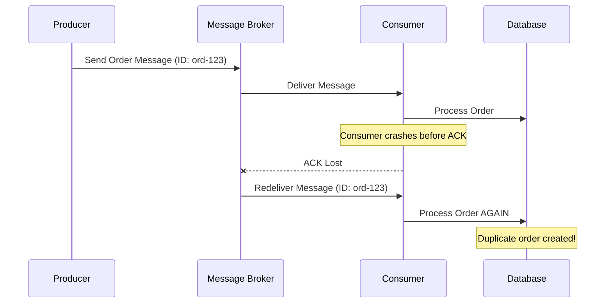
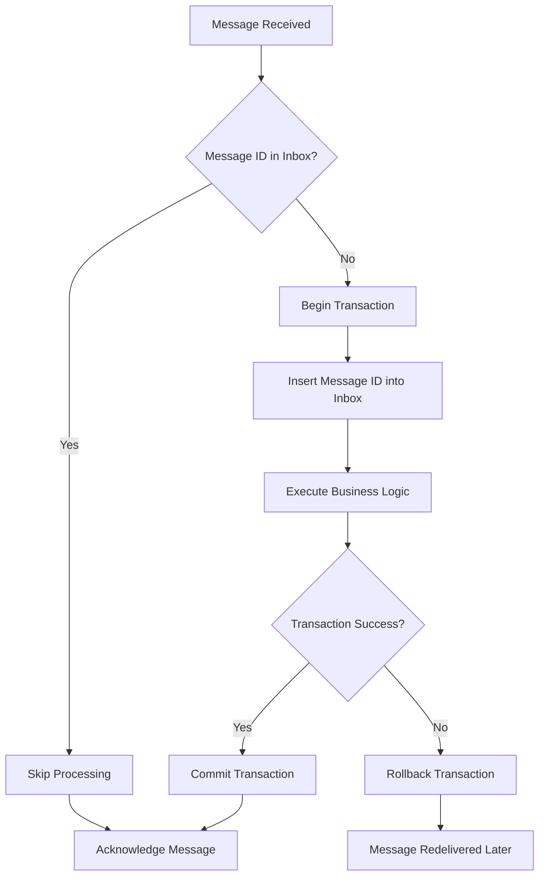
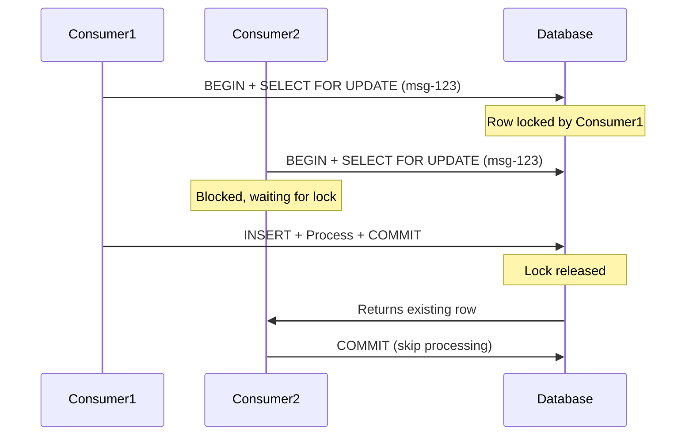

# How to Implement the Inbox Pattern in Microservices

Author: [nawazdhandala](https://github.com/nawazdhandala)

Tags: Microservices, Distributed Systems, Event-Driven Architecture, Message Queues, PostgreSQL, Node.js

Description: A practical guide to implementing the Inbox Pattern for reliable message processing in distributed systems. Learn how to prevent duplicate message handling, ensure exactly-once semantics, and build resilient microservices that gracefully handle failures.

---

> In distributed systems, messages will be delivered more than once. The question is not "if" but "how do you handle it?"

When building microservices that communicate via message queues like Kafka, RabbitMQ, or SQS, you will inevitably face a fundamental challenge: duplicate messages. Network hiccups, consumer restarts, and broker redeliveries mean your service might process the same message multiple times. Without proper handling, this leads to duplicate orders, double charges, or corrupted data.

The **Inbox Pattern** solves this problem by giving your service a persistent record of every message it has processed. Before handling any incoming message, you check the inbox. If the message is already there, you skip processing. If not, you store it and proceed.

This guide walks through a production-ready implementation with Node.js, PostgreSQL, and TypeScript that you can adapt to your stack.

---

## Table of Contents

1. Why Messages Get Duplicated
2. The Inbox Pattern Explained
3. Database Schema Design
4. Implementation in Node.js
5. Handling Edge Cases
6. Integration with Message Brokers
7. Monitoring and Observability
8. Performance Considerations
9. Common Mistakes to Avoid
10. Complete Working Example

---

## 1. Why Messages Get Duplicated

Before diving into the solution, let's understand the problem. Messages get duplicated for several reasons:

| Scenario | What Happens | Result |
|----------|--------------|--------|
| Consumer crashes after processing but before acknowledging | Broker redelivers the message to another consumer | Duplicate processing |
| Network timeout during acknowledgment | Broker assumes failure and redelivers | Duplicate processing |
| Broker failover | Messages in flight may be redelivered | Duplicate processing |
| Producer retries on timeout | Same message sent multiple times with different delivery IDs | Duplicate processing |

Most message brokers guarantee **at-least-once delivery**, not exactly-once. This means your application must handle duplicates gracefully.

Here is how message duplication typically occurs in a distributed system:



---

## 2. The Inbox Pattern Explained

The Inbox Pattern introduces a dedicated table that tracks every message your service has processed. The core idea is simple:

1. Receive a message with a unique identifier
2. Check if that identifier exists in your inbox table
3. If it exists, skip processing (idempotent response)
4. If it does not exist, insert it and process the message in a single transaction

The critical insight is that the inbox check and the business logic must happen within the same database transaction. This ensures atomicity: either both succeed or both fail.



This pattern is sometimes called the **Idempotent Consumer** pattern. The inbox table serves as your deduplication registry.

---

## 3. Database Schema Design

A well-designed inbox table needs to store enough information for debugging and operations while remaining efficient for lookups.

The following SQL creates an inbox table optimized for high-throughput message processing with proper indexing and automatic cleanup support:

```sql
-- Create the inbox table for tracking processed messages
-- The message_id is the primary deduplication key
CREATE TABLE inbox (
    -- Unique identifier from the message (provided by producer or broker)
    message_id VARCHAR(255) PRIMARY KEY,

    -- Message type helps with debugging and filtering
    message_type VARCHAR(100) NOT NULL,

    -- Store the original payload for debugging and replay scenarios
    payload JSONB NOT NULL,

    -- Track when we received and processed the message
    received_at TIMESTAMP WITH TIME ZONE DEFAULT NOW(),
    processed_at TIMESTAMP WITH TIME ZONE,

    -- Processing status for monitoring
    status VARCHAR(20) DEFAULT 'pending' CHECK (status IN ('pending', 'processed', 'failed')),

    -- Error details if processing failed
    error_message TEXT,

    -- Metadata for tracing and correlation
    correlation_id VARCHAR(255),
    source_service VARCHAR(100)
);

-- Index for status-based queries (monitoring dashboards, retry logic)
CREATE INDEX idx_inbox_status ON inbox(status) WHERE status != 'processed';

-- Index for cleanup jobs that archive old processed messages
CREATE INDEX idx_inbox_processed_at ON inbox(processed_at) WHERE status = 'processed';

-- Index for correlation queries during debugging
CREATE INDEX idx_inbox_correlation ON inbox(correlation_id) WHERE correlation_id IS NOT NULL;
```

Key design decisions:

- **message_id as primary key**: Ensures uniqueness and provides fast lookups
- **JSONB payload**: Flexible storage for different message types, enables querying message content
- **status column**: Allows tracking processing state for monitoring and retries
- **partial indexes**: Only index rows that matter for each query pattern, saving space and improving write performance

---

## 4. Implementation in Node.js

Let's build a production-ready inbox implementation. We will create a reusable class that handles the core deduplication logic.

First, define the types and interfaces that describe our inbox system:

```typescript
// inbox/types.ts
// Define the structure of messages and inbox entries

export interface InboxMessage {
  messageId: string;
  messageType: string;
  payload: Record<string, unknown>;
  correlationId?: string;
  sourceService?: string;
}

export interface InboxEntry extends InboxMessage {
  receivedAt: Date;
  processedAt: Date | null;
  status: 'pending' | 'processed' | 'failed';
  errorMessage: string | null;
}

export type MessageHandler<T = unknown> = (payload: T) => Promise<void>;
```

Next, implement the core inbox processor that coordinates deduplication and message handling:

```typescript
// inbox/inbox-processor.ts
// Core inbox pattern implementation with transaction support

import { Pool, PoolClient } from 'pg';
import { InboxMessage, MessageHandler } from './types';

export class InboxProcessor {
  private pool: Pool;
  private handlers: Map<string, MessageHandler>;

  constructor(pool: Pool) {
    this.pool = pool;
    this.handlers = new Map();
  }

  // Register handlers for different message types
  // This allows routing messages to the appropriate business logic
  registerHandler<T>(messageType: string, handler: MessageHandler<T>): void {
    this.handlers.set(messageType, handler as MessageHandler);
  }

  // Main entry point for processing incoming messages
  // Returns true if message was processed, false if it was a duplicate
  async processMessage(message: InboxMessage): Promise<boolean> {
    const client = await this.pool.connect();

    try {
      await client.query('BEGIN');

      // Check if message already exists in inbox
      // Use FOR UPDATE to lock the row and prevent race conditions
      const existingResult = await client.query(
        `SELECT message_id, status FROM inbox
         WHERE message_id = $1
         FOR UPDATE`,
        [message.messageId]
      );

      // Message already processed - skip and return early
      if (existingResult.rows.length > 0) {
        await client.query('COMMIT');
        console.log(`Duplicate message detected: ${message.messageId}`);
        return false;
      }

      // Insert the message into inbox with pending status
      await client.query(
        `INSERT INTO inbox (message_id, message_type, payload, correlation_id, source_service, status)
         VALUES ($1, $2, $3, $4, $5, 'pending')`,
        [
          message.messageId,
          message.messageType,
          JSON.stringify(message.payload),
          message.correlationId,
          message.sourceService
        ]
      );

      // Execute the business logic within the same transaction
      await this.executeHandler(message, client);

      // Mark message as processed
      await client.query(
        `UPDATE inbox
         SET status = 'processed', processed_at = NOW()
         WHERE message_id = $1`,
        [message.messageId]
      );

      await client.query('COMMIT');
      return true;

    } catch (error) {
      await client.query('ROLLBACK');

      // Record the failure for monitoring and retry
      await this.recordFailure(message, error as Error);
      throw error;

    } finally {
      client.release();
    }
  }

  // Execute the registered handler for this message type
  // Pass the database client so handlers can participate in the transaction
  private async executeHandler(message: InboxMessage, client: PoolClient): Promise<void> {
    const handler = this.handlers.get(message.messageType);

    if (!handler) {
      throw new Error(`No handler registered for message type: ${message.messageType}`);
    }

    // Attach the client to the payload context for transactional operations
    const contextualPayload = {
      ...message.payload,
      __dbClient: client
    };

    await handler(contextualPayload);
  }

  // Record failures for monitoring and potential retry
  private async recordFailure(message: InboxMessage, error: Error): Promise<void> {
    try {
      await this.pool.query(
        `INSERT INTO inbox (message_id, message_type, payload, correlation_id, source_service, status, error_message)
         VALUES ($1, $2, $3, $4, $5, 'failed', $6)
         ON CONFLICT (message_id)
         DO UPDATE SET status = 'failed', error_message = $6`,
        [
          message.messageId,
          message.messageType,
          JSON.stringify(message.payload),
          message.correlationId,
          message.sourceService,
          error.message
        ]
      );
    } catch (recordError) {
      // Log but don't throw - we don't want to mask the original error
      console.error('Failed to record inbox failure:', recordError);
    }
  }
}
```

---

## 5. Handling Edge Cases

Real-world systems encounter scenarios that require careful handling. Here are the most common edge cases and how to address them.

### Race Conditions Between Consumers

When multiple consumers process messages concurrently, two might receive the same message simultaneously. The `FOR UPDATE` lock in our query handles this:



### Handling Partial Failures

If processing fails after inserting into the inbox but before completing business logic, the transaction rolls back. The message will be redelivered and processed fresh:

This helper method retries failed messages with exponential backoff to handle transient failures:

```typescript
// inbox/retry-handler.ts
// Retry logic for failed messages with exponential backoff

export async function retryFailedMessages(
  processor: InboxProcessor,
  pool: Pool,
  maxRetries: number = 3
): Promise<void> {
  // Find messages that failed but haven't exceeded retry limit
  const failedMessages = await pool.query(
    `SELECT message_id, message_type, payload, correlation_id, source_service,
            COALESCE(retry_count, 0) as retry_count
     FROM inbox
     WHERE status = 'failed'
       AND COALESCE(retry_count, 0) < $1
     ORDER BY received_at ASC
     LIMIT 100`,
    [maxRetries]
  );

  for (const row of failedMessages.rows) {
    try {
      // Reset status to allow reprocessing
      await pool.query(
        `UPDATE inbox SET status = 'pending', error_message = NULL
         WHERE message_id = $1`,
        [row.message_id]
      );

      // Delete the inbox entry so processMessage can re-insert it
      await pool.query(
        `DELETE FROM inbox WHERE message_id = $1`,
        [row.message_id]
      );

      // Reprocess the message
      await processor.processMessage({
        messageId: row.message_id,
        messageType: row.message_type,
        payload: JSON.parse(row.payload),
        correlationId: row.correlation_id,
        sourceService: row.source_service
      });

    } catch (error) {
      // Increment retry count on failure
      await pool.query(
        `UPDATE inbox
         SET retry_count = COALESCE(retry_count, 0) + 1,
             error_message = $2
         WHERE message_id = $1`,
        [row.message_id, (error as Error).message]
      );
    }
  }
}
```

### Message ID Generation

The effectiveness of the inbox pattern depends entirely on consistent message IDs. The producer must generate deterministic IDs based on the business operation, not random UUIDs:

This utility generates deterministic message IDs based on the business operation to ensure the same logical operation always produces the same ID:

```typescript
// inbox/message-id.ts
// Generate deterministic message IDs based on business operations

import crypto from 'crypto';

// Good: Deterministic ID based on business operation
// The same order will always produce the same message ID
export function generateOrderMessageId(orderId: string, operation: string): string {
  return `order-${orderId}-${operation}`;
}

// Good: Hash-based ID for complex payloads
// Ensures the same payload always generates the same ID
export function generateContentBasedId(payload: Record<string, unknown>): string {
  const normalized = JSON.stringify(payload, Object.keys(payload).sort());
  return crypto.createHash('sha256').update(normalized).digest('hex').substring(0, 32);
}

// Bad: Random UUIDs defeat the purpose of deduplication
// Never use this approach for inbox pattern
export function generateRandomId(): string {
  return crypto.randomUUID(); // DON'T DO THIS
}
```

---

## 6. Integration with Message Brokers

Here's how to integrate the inbox processor with popular message brokers.

### Kafka Integration

This consumer implementation wraps Kafka message handling with inbox pattern deduplication:

```typescript
// consumers/kafka-consumer.ts
// Kafka consumer with inbox pattern integration

import { Kafka, Consumer, EachMessagePayload } from 'kafkajs';
import { InboxProcessor } from '../inbox/inbox-processor';
import { Pool } from 'pg';

export class KafkaInboxConsumer {
  private kafka: Kafka;
  private consumer: Consumer;
  private processor: InboxProcessor;

  constructor(brokers: string[], groupId: string, pool: Pool) {
    this.kafka = new Kafka({ brokers });
    this.consumer = this.kafka.consumer({ groupId });
    this.processor = new InboxProcessor(pool);
  }

  // Register message type handlers
  registerHandler<T>(messageType: string, handler: (payload: T) => Promise<void>): void {
    this.processor.registerHandler(messageType, handler);
  }

  // Start consuming from specified topics
  async start(topics: string[]): Promise<void> {
    await this.consumer.connect();
    await this.consumer.subscribe({ topics, fromBeginning: false });

    await this.consumer.run({
      eachMessage: async (payload: EachMessagePayload) => {
        await this.handleMessage(payload);
      }
    });
  }

  private async handleMessage(payload: EachMessagePayload): Promise<void> {
    const { topic, partition, message } = payload;

    // Extract message ID from headers or generate from offset
    // Kafka message keys or custom headers work well for this
    const messageId = message.headers?.['message-id']?.toString()
      || `${topic}-${partition}-${message.offset}`;

    const messageType = message.headers?.['message-type']?.toString() || topic;
    const correlationId = message.headers?.['correlation-id']?.toString();

    try {
      const wasProcessed = await this.processor.processMessage({
        messageId,
        messageType,
        payload: JSON.parse(message.value?.toString() || '{}'),
        correlationId,
        sourceService: message.headers?.['source-service']?.toString()
      });

      if (wasProcessed) {
        console.log(`Processed message: ${messageId}`);
      } else {
        console.log(`Skipped duplicate: ${messageId}`);
      }

    } catch (error) {
      console.error(`Failed to process message ${messageId}:`, error);
      // Let Kafka redeliver by not committing the offset
      // The inbox will prevent reprocessing when it succeeds
      throw error;
    }
  }

  async stop(): Promise<void> {
    await this.consumer.disconnect();
  }
}
```

### RabbitMQ Integration

This consumer implementation wraps RabbitMQ message handling with inbox pattern deduplication:

```typescript
// consumers/rabbitmq-consumer.ts
// RabbitMQ consumer with inbox pattern integration

import amqp, { Channel, Connection, ConsumeMessage } from 'amqplib';
import { InboxProcessor } from '../inbox/inbox-processor';
import { Pool } from 'pg';

export class RabbitMQInboxConsumer {
  private connection: Connection | null = null;
  private channel: Channel | null = null;
  private processor: InboxProcessor;
  private url: string;

  constructor(url: string, pool: Pool) {
    this.url = url;
    this.processor = new InboxProcessor(pool);
  }

  registerHandler<T>(messageType: string, handler: (payload: T) => Promise<void>): void {
    this.processor.registerHandler(messageType, handler);
  }

  async start(queue: string): Promise<void> {
    this.connection = await amqp.connect(this.url);
    this.channel = await this.connection.createChannel();

    // Prefetch 1 message at a time for reliable processing
    await this.channel.prefetch(1);
    await this.channel.assertQueue(queue, { durable: true });

    await this.channel.consume(queue, async (msg: ConsumeMessage | null) => {
      if (!msg) return;

      // RabbitMQ provides a unique delivery tag
      // Combine with message-id header for deduplication
      const messageId = msg.properties.messageId
        || msg.properties.headers?.['message-id']
        || `rmq-${msg.fields.deliveryTag}`;

      try {
        const wasProcessed = await this.processor.processMessage({
          messageId,
          messageType: msg.properties.type || msg.fields.routingKey,
          payload: JSON.parse(msg.content.toString()),
          correlationId: msg.properties.correlationId,
          sourceService: msg.properties.headers?.['source-service']
        });

        // Always acknowledge - inbox handles deduplication
        this.channel?.ack(msg);

      } catch (error) {
        console.error(`Failed to process message ${messageId}:`, error);
        // Reject and requeue for retry
        this.channel?.nack(msg, false, true);
      }
    });
  }

  async stop(): Promise<void> {
    await this.channel?.close();
    await this.connection?.close();
  }
}
```

---

## 7. Monitoring and Observability

Production systems need visibility into inbox health. Here are essential queries and metrics to track.

### Health Check Queries

These queries help monitor inbox health and identify potential issues:

```sql
-- Count messages by status to identify backlogs
SELECT status, COUNT(*) as count
FROM inbox
GROUP BY status;

-- Find messages stuck in pending state (potential processing issues)
SELECT message_id, message_type, received_at
FROM inbox
WHERE status = 'pending'
  AND received_at < NOW() - INTERVAL '5 minutes'
ORDER BY received_at ASC;

-- Identify high-failure message types for investigation
SELECT message_type, COUNT(*) as failure_count
FROM inbox
WHERE status = 'failed'
  AND received_at > NOW() - INTERVAL '1 hour'
GROUP BY message_type
ORDER BY failure_count DESC;

-- Calculate deduplication rate (indicates producer retry behavior)
SELECT
  DATE_TRUNC('hour', received_at) as hour,
  COUNT(*) as total_received,
  COUNT(*) FILTER (WHERE status = 'processed') as processed,
  COUNT(*) FILTER (WHERE status = 'failed') as failed
FROM inbox
WHERE received_at > NOW() - INTERVAL '24 hours'
GROUP BY DATE_TRUNC('hour', received_at)
ORDER BY hour DESC;
```

### Metrics Collection

This module exposes Prometheus metrics for monitoring inbox performance:

```typescript
// monitoring/inbox-metrics.ts
// Prometheus metrics for inbox pattern monitoring

import { Pool } from 'pg';
import { Counter, Gauge, Histogram } from 'prom-client';

// Define metrics for inbox pattern monitoring
const messagesReceived = new Counter({
  name: 'inbox_messages_received_total',
  help: 'Total messages received by the inbox',
  labelNames: ['message_type', 'source_service']
});

const messagesProcessed = new Counter({
  name: 'inbox_messages_processed_total',
  help: 'Total messages successfully processed',
  labelNames: ['message_type']
});

const messagesDeduplicated = new Counter({
  name: 'inbox_messages_deduplicated_total',
  help: 'Total duplicate messages detected and skipped',
  labelNames: ['message_type']
});

const processingDuration = new Histogram({
  name: 'inbox_processing_duration_seconds',
  help: 'Time spent processing messages',
  labelNames: ['message_type'],
  buckets: [0.01, 0.05, 0.1, 0.5, 1, 5]
});

const pendingMessages = new Gauge({
  name: 'inbox_pending_messages',
  help: 'Current number of pending messages in inbox'
});

// Collect inbox table metrics periodically
export async function collectInboxMetrics(pool: Pool): Promise<void> {
  const result = await pool.query(
    `SELECT status, COUNT(*) as count FROM inbox GROUP BY status`
  );

  for (const row of result.rows) {
    if (row.status === 'pending') {
      pendingMessages.set(parseInt(row.count));
    }
  }
}

export { messagesReceived, messagesProcessed, messagesDeduplicated, processingDuration };
```

---

## 8. Performance Considerations

The inbox pattern adds a database round-trip to every message. Here's how to keep it fast.

### Index Optimization

The primary key on message_id handles lookups efficiently. For high-throughput systems, ensure the index fits in memory:

```sql
-- Check index size and cache hit ratio
SELECT
  indexrelname as index_name,
  pg_size_pretty(pg_relation_size(indexrelid)) as index_size,
  idx_scan as index_scans,
  idx_tup_read as tuples_read
FROM pg_stat_user_indexes
WHERE relname = 'inbox';

-- Monitor cache hit ratio for inbox table
SELECT
  relname,
  heap_blks_read as disk_reads,
  heap_blks_hit as cache_hits,
  ROUND(heap_blks_hit::numeric / NULLIF(heap_blks_hit + heap_blks_read, 0) * 100, 2) as cache_hit_ratio
FROM pg_statio_user_tables
WHERE relname = 'inbox';
```

### Archiving Old Messages

Don't let the inbox table grow unbounded. Archive processed messages to a separate table:

This job archives old processed messages to keep the inbox table lean:

```typescript
// maintenance/archive-inbox.ts
// Archive old processed messages to maintain performance

import { Pool } from 'pg';

export async function archiveProcessedMessages(
  pool: Pool,
  retentionDays: number = 7
): Promise<number> {
  // Move old processed messages to archive table
  const result = await pool.query(
    `WITH archived AS (
       DELETE FROM inbox
       WHERE status = 'processed'
         AND processed_at < NOW() - INTERVAL '1 day' * $1
       RETURNING *
     )
     INSERT INTO inbox_archive
     SELECT * FROM archived`,
    [retentionDays]
  );

  return result.rowCount || 0;
}

// Run this as a scheduled job (e.g., daily)
export async function runArchiveJob(pool: Pool): Promise<void> {
  const archived = await archiveProcessedMessages(pool, 7);
  console.log(`Archived ${archived} messages from inbox`);

  // Also clean up very old archive data
  await pool.query(
    `DELETE FROM inbox_archive WHERE processed_at < NOW() - INTERVAL '90 days'`
  );
}
```

### Batch Processing

For high-volume scenarios, consider batch lookups:

This optimization checks multiple messages against the inbox in a single query:

```typescript
// inbox/batch-processor.ts
// Batch processing for high-throughput scenarios

export async function filterDuplicates(
  pool: Pool,
  messageIds: string[]
): Promise<Set<string>> {
  // Single query to check multiple message IDs
  const result = await pool.query(
    `SELECT message_id FROM inbox WHERE message_id = ANY($1)`,
    [messageIds]
  );

  const existingIds = new Set(result.rows.map(r => r.message_id));
  return existingIds;
}

// Usage: filter out duplicates before processing
export async function processBatch(
  processor: InboxProcessor,
  pool: Pool,
  messages: InboxMessage[]
): Promise<void> {
  const messageIds = messages.map(m => m.messageId);
  const existingIds = await filterDuplicates(pool, messageIds);

  // Only process messages not already in inbox
  const newMessages = messages.filter(m => !existingIds.has(m.messageId));

  for (const message of newMessages) {
    await processor.processMessage(message);
  }
}
```

---

## 9. Common Mistakes to Avoid

### Mistake 1: Checking Inbox Outside the Transaction

If you check the inbox, then start a transaction for business logic, there's a race window where duplicates can slip through:

```typescript
// WRONG: Race condition between check and insert
async function wrongApproach(message: InboxMessage): Promise<void> {
  // Gap here where another consumer could check the same message
  const exists = await pool.query(
    'SELECT 1 FROM inbox WHERE message_id = $1',
    [message.messageId]
  );

  if (exists.rows.length > 0) return;

  // Another consumer might have inserted by now!
  await client.query('BEGIN');
  await client.query('INSERT INTO inbox ...');
  // ...
}
```

### Mistake 2: Using Auto-Generated Message IDs

If the producer uses random UUIDs as message IDs, redelivered messages get new IDs and bypass deduplication entirely:

```typescript
// WRONG: Random IDs defeat deduplication
const message = {
  messageId: crypto.randomUUID(), // Different on every send attempt
  payload: { orderId: 'ord-123', action: 'create' }
};

// RIGHT: Deterministic IDs based on business operation
const message = {
  messageId: `order-${orderId}-create`, // Same ID for same operation
  payload: { orderId: 'ord-123', action: 'create' }
};
```

### Mistake 3: Forgetting to Handle Handler Errors

If your business logic throws and you catch the error without re-throwing, the transaction commits with the inbox entry but without the business work:

```typescript
// WRONG: Swallowing errors leaves inbox in bad state
try {
  await handler(message.payload);
} catch (error) {
  console.error(error);
  // Transaction will commit! Inbox marked as processed but work not done
}

// RIGHT: Let errors propagate to trigger rollback
try {
  await handler(message.payload);
} catch (error) {
  console.error(error);
  throw error; // Transaction rolls back, message redelivered
}
```

---

## 10. Complete Working Example

Here's a complete example putting it all together for an order processing service:

This is a complete working example showing how all the pieces fit together for order processing:

```typescript
// main.ts
// Complete order processing service with inbox pattern

import { Pool } from 'pg';
import { KafkaInboxConsumer } from './consumers/kafka-consumer';

// Database connection pool
const pool = new Pool({
  host: process.env.DB_HOST || 'localhost',
  port: parseInt(process.env.DB_PORT || '5432'),
  database: process.env.DB_NAME || 'orders',
  user: process.env.DB_USER || 'postgres',
  password: process.env.DB_PASSWORD || 'postgres',
  max: 20
});

// Order creation handler - this is your business logic
async function handleOrderCreated(payload: {
  orderId: string;
  customerId: string;
  items: Array<{ sku: string; quantity: number; price: number }>;
  __dbClient: any;
}): Promise<void> {
  const { orderId, customerId, items, __dbClient: client } = payload;

  // Calculate order total
  const total = items.reduce((sum, item) => sum + item.price * item.quantity, 0);

  // Insert order into database (within the same transaction as inbox)
  await client.query(
    `INSERT INTO orders (order_id, customer_id, total, status, created_at)
     VALUES ($1, $2, $3, 'pending', NOW())`,
    [orderId, customerId, total]
  );

  // Insert order items
  for (const item of items) {
    await client.query(
      `INSERT INTO order_items (order_id, sku, quantity, price)
       VALUES ($1, $2, $3, $4)`,
      [orderId, item.sku, item.quantity, item.price]
    );
  }

  console.log(`Order ${orderId} created with total ${total}`);
}

// Payment completed handler
async function handlePaymentCompleted(payload: {
  orderId: string;
  paymentId: string;
  amount: number;
  __dbClient: any;
}): Promise<void> {
  const { orderId, paymentId, amount, __dbClient: client } = payload;

  // Update order status
  await client.query(
    `UPDATE orders SET status = 'paid', payment_id = $2 WHERE order_id = $1`,
    [orderId, paymentId]
  );

  console.log(`Order ${orderId} marked as paid via payment ${paymentId}`);
}

async function main(): Promise<void> {
  // Initialize Kafka consumer with inbox pattern
  const consumer = new KafkaInboxConsumer(
    [process.env.KAFKA_BROKERS || 'localhost:9092'],
    'order-service',
    pool
  );

  // Register handlers for different message types
  consumer.registerHandler('order.created', handleOrderCreated);
  consumer.registerHandler('payment.completed', handlePaymentCompleted);

  // Start consuming
  await consumer.start(['orders', 'payments']);
  console.log('Order service started, consuming messages...');

  // Graceful shutdown
  process.on('SIGTERM', async () => {
    console.log('Shutting down...');
    await consumer.stop();
    await pool.end();
    process.exit(0);
  });
}

main().catch(console.error);
```

---

## Summary

The Inbox Pattern is essential for building reliable microservices that consume messages. Key takeaways:

| Principle | Why It Matters |
|-----------|----------------|
| Check and insert in the same transaction | Prevents race conditions between concurrent consumers |
| Use deterministic message IDs | Ensures the same logical operation always deduplicates correctly |
| Store the full payload | Enables debugging, auditing, and potential replay |
| Monitor inbox health | Catch processing failures and deduplication issues early |
| Archive old entries | Maintain query performance as the system scales |

The pattern adds minimal overhead (one database lookup per message) but provides strong guarantees against duplicate processing. In distributed systems where exactly-once delivery is impossible to guarantee at the transport layer, the inbox pattern lets you achieve exactly-once processing at the application layer.

---

*Building event-driven microservices? Monitor your message processing pipelines with [OneUptime](https://oneuptime.com) to catch failures before they impact users.*

---

### Related Reading

- [The Outbox Pattern for Reliable Event Publishing](https://oneuptime.com/blog/post/2026-01-30-outbox-pattern-microservices/view)
- [Distributed Transactions: Saga Pattern Explained](https://oneuptime.com/blog/post/2026-01-30-saga-pattern-microservices/view)
- [Building Resilient Services with Circuit Breakers](https://oneuptime.com/blog/post/2025-11-28-sre-best-practices/view)
