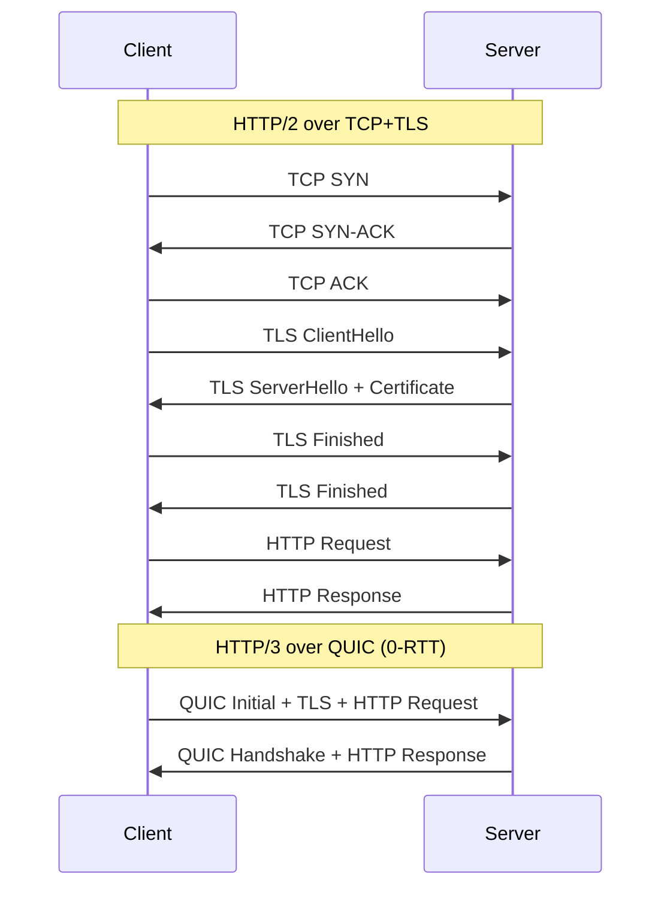
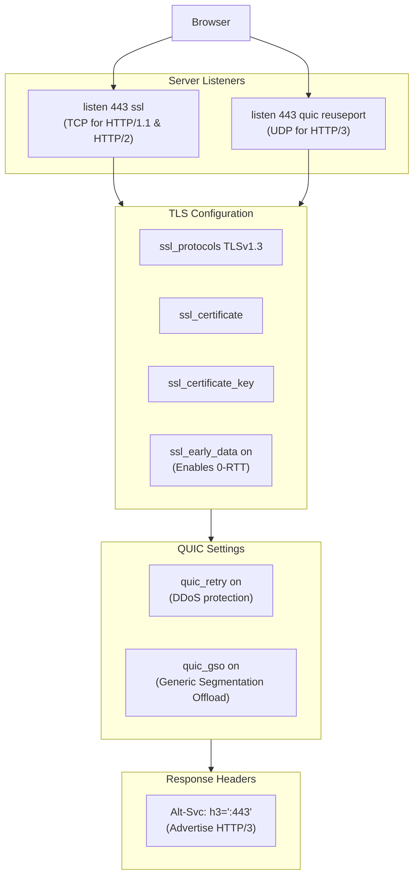
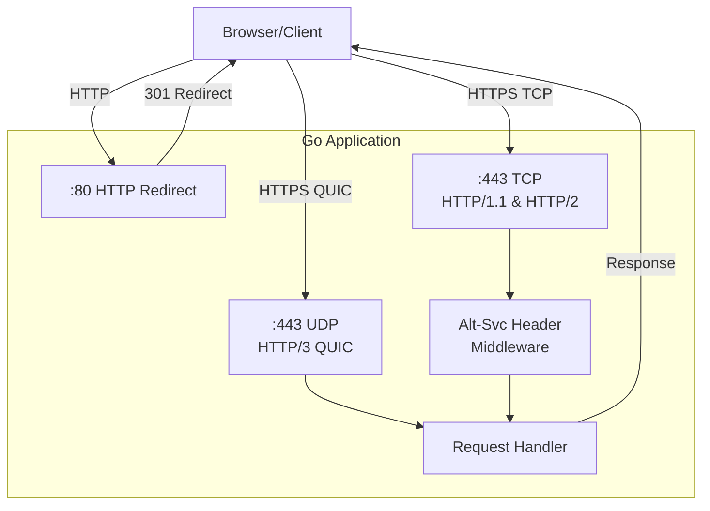

# How to Create HTTP/3 Server Configuration

Author: [nawazdhandala](https://github.com/nawazdhandala)

Tags: HTTP/3, QUIC, Performance, Networking

Description: A practical guide to configuring HTTP/3 servers with nginx, Caddy, and Go, including QUIC setup, certificate configuration, and Alt-Svc headers.

---

HTTP/3 is here, and it's faster. Built on QUIC instead of TCP, it eliminates head-of-line blocking, reduces connection establishment time, and handles packet loss gracefully. If you're still serving everything over HTTP/2, you're leaving performance on the table.

This guide covers real server configurations for nginx, Caddy, and Go. No theory dumps. Just working configs you can deploy today.

---

## Why HTTP/3 Matters

HTTP/3 replaces TCP with QUIC, a UDP-based transport protocol. The benefits are practical:

- **0-RTT connection resumption** for returning visitors
- **No head-of-line blocking** across streams
- **Connection migration** survives network changes (WiFi to cellular)
- **Built-in encryption** with TLS 1.3



The difference is significant. HTTP/2 needs multiple round trips before sending data. HTTP/3 with 0-RTT can send the request in the first packet.

---

## Prerequisites

Before configuring HTTP/3, you need:

1. **Valid TLS certificates** (HTTP/3 requires TLS 1.3)
2. **UDP port 443 open** in your firewall
3. **Server software that supports QUIC**

Check your firewall:

```bash
# Allow UDP 443 (Linux)
sudo iptables -A INPUT -p udp --dport 443 -j ACCEPT

# Or with ufw
sudo ufw allow 443/udp

# Verify
sudo iptables -L -n | grep 443
```

---

## Nginx Configuration

Nginx added experimental HTTP/3 support in version 1.25.0. You need nginx compiled with the `--with-http_v3_module` flag.

### Check Your Nginx Build

```bash
nginx -V 2>&1 | grep -o 'http_v3_module'
```

If nothing returns, you need to rebuild nginx or use a package that includes HTTP/3 support.

### Basic HTTP/3 Configuration

```nginx
server {
    listen 443 ssl;
    listen 443 quic reuseport;

    http2 on;
    http3 on;

    server_name example.com;

    # TLS 1.3 is required for HTTP/3
    ssl_protocols TLSv1.3;
    ssl_certificate /etc/letsencrypt/live/example.com/fullchain.pem;
    ssl_certificate_key /etc/letsencrypt/live/example.com/privkey.pem;

    # QUIC-specific settings
    ssl_early_data on;
    quic_retry on;

    # Alt-Svc header tells browsers HTTP/3 is available
    add_header Alt-Svc 'h3=":443"; ma=86400';

    # Recommended: Add QUIC transport parameters
    quic_gso on;

    location / {
        root /var/www/html;
        index index.html;
    }
}
```

### Understanding the Key Directives



### Full Production Configuration

```nginx
# Main context optimizations for QUIC
quic_bpf on;  # eBPF for routing (Linux 5.7+)

server {
    listen 443 ssl;
    listen [::]:443 ssl;
    listen 443 quic reuseport;
    listen [::]:443 quic reuseport;

    http2 on;
    http3 on;
    http3_hq on;  # Enable HTTP/3 over QUIC (hq) for testing

    server_name example.com www.example.com;

    # TLS Configuration
    ssl_protocols TLSv1.3;
    ssl_prefer_server_ciphers off;
    ssl_certificate /etc/letsencrypt/live/example.com/fullchain.pem;
    ssl_certificate_key /etc/letsencrypt/live/example.com/privkey.pem;
    ssl_session_timeout 1d;
    ssl_session_cache shared:SSL:50m;
    ssl_session_tickets off;

    # 0-RTT (be aware of replay attacks for non-idempotent requests)
    ssl_early_data on;

    # QUIC settings
    quic_retry on;
    quic_gso on;

    # Advertise HTTP/3 availability
    # ma=86400 means cache for 24 hours
    add_header Alt-Svc 'h3=":443"; ma=86400' always;

    # Security headers
    add_header X-Content-Type-Options nosniff always;
    add_header X-Frame-Options DENY always;
    add_header Strict-Transport-Security "max-age=63072000" always;

    # Proxy configuration for backend
    location /api/ {
        proxy_pass http://backend:8080;
        proxy_http_version 1.1;
        proxy_set_header Host $host;
        proxy_set_header X-Real-IP $remote_addr;
        proxy_set_header X-Forwarded-For $proxy_add_x_forwarded_for;
        proxy_set_header X-Forwarded-Proto $scheme;

        # Pass early data status to backend
        proxy_set_header Early-Data $ssl_early_data;
    }

    location / {
        root /var/www/html;
        index index.html;
        try_files $uri $uri/ =404;
    }
}

# Redirect HTTP to HTTPS
server {
    listen 80;
    listen [::]:80;
    server_name example.com www.example.com;
    return 301 https://$host$request_uri;
}
```

---

## Caddy Configuration

Caddy has built-in HTTP/3 support. It's enabled by default when using HTTPS. This makes Caddy the easiest option for HTTP/3 deployment.

### Basic Caddyfile

```caddyfile
example.com {
    root * /var/www/html
    file_server
}
```

That's it. Caddy automatically:
- Obtains and renews certificates via Let's Encrypt
- Enables HTTP/3
- Sets the Alt-Svc header
- Redirects HTTP to HTTPS

### Explicit HTTP/3 Configuration

```caddyfile
{
    # Global options
    servers {
        protocol {
            experimental_http3
        }
    }
}

example.com {
    root * /var/www/html
    file_server

    # Custom TLS configuration
    tls {
        protocols tls1.3
    }

    # Custom headers
    header {
        Strict-Transport-Security "max-age=63072000"
        X-Content-Type-Options "nosniff"
        X-Frame-Options "DENY"
    }
}
```

### Caddy with Reverse Proxy

```caddyfile
example.com {
    # API routes to backend
    handle /api/* {
        reverse_proxy backend:8080 {
            header_up X-Real-IP {remote_host}
            header_up X-Forwarded-Proto {scheme}
        }
    }

    # Static files
    handle {
        root * /var/www/html
        file_server
    }

    # Enable compression
    encode gzip zstd

    # Logging
    log {
        output file /var/log/caddy/access.log
        format json
    }
}
```

### Caddy JSON Configuration

For more control, use JSON configuration:

```json
{
  "apps": {
    "http": {
      "servers": {
        "srv0": {
          "listen": [":443"],
          "protocols": ["h1", "h2", "h3"],
          "routes": [
            {
              "match": [{"host": ["example.com"]}],
              "handle": [
                {
                  "handler": "file_server",
                  "root": "/var/www/html"
                }
              ]
            }
          ],
          "tls_connection_policies": [
            {
              "match": {"sni": ["example.com"]},
              "protocol_min": "tls1.3"
            }
          ]
        }
      }
    },
    "tls": {
      "automation": {
        "policies": [
          {
            "subjects": ["example.com"],
            "issuers": [{"module": "acme"}]
          }
        ]
      }
    }
  }
}
```

---

## Go HTTP/3 Server

Go's standard library doesn't include HTTP/3 yet, but the `quic-go` library provides a solid implementation.

### Install Dependencies

```bash
go get github.com/quic-go/quic-go/http3
```

### Basic HTTP/3 Server

```go
package main

import (
    "crypto/tls"
    "log"
    "net/http"

    "github.com/quic-go/quic-go/http3"
)

func main() {
    mux := http.NewServeMux()

    mux.HandleFunc("/", func(w http.ResponseWriter, r *http.Request) {
        // Add Alt-Svc header for HTTP/2 fallback connections
        w.Header().Set("Alt-Svc", `h3=":443"; ma=86400`)
        w.Write([]byte("Hello from HTTP/3!"))
    })

    // TLS configuration
    tlsConfig := &tls.Config{
        MinVersion: tls.VersionTLS13,
    }

    server := &http3.Server{
        Addr:      ":443",
        Handler:   mux,
        TLSConfig: tlsConfig,
    }

    log.Println("Starting HTTP/3 server on :443")
    err := server.ListenAndServeTLS("cert.pem", "key.pem")
    if err != nil {
        log.Fatal(err)
    }
}
```

### Dual-Stack Server (HTTP/2 + HTTP/3)

Most production servers need to support both HTTP/2 and HTTP/3 for compatibility:

```go
package main

import (
    "context"
    "crypto/tls"
    "log"
    "net/http"
    "os"
    "os/signal"
    "syscall"
    "time"

    "github.com/quic-go/quic-go/http3"
)

func main() {
    mux := http.NewServeMux()

    mux.HandleFunc("/", handleRequest)
    mux.HandleFunc("/health", handleHealth)

    certFile := "cert.pem"
    keyFile := "key.pem"

    // TLS config shared between HTTP/2 and HTTP/3
    tlsConfig := &tls.Config{
        MinVersion: tls.VersionTLS13,
        NextProtos: []string{"h3", "h2", "http/1.1"},
    }

    // HTTP/3 server
    h3Server := &http3.Server{
        Addr:      ":443",
        Handler:   mux,
        TLSConfig: tlsConfig,
    }

    // HTTP/2 server with Alt-Svc header middleware
    h2Handler := addAltSvcHeader(mux)
    h2Server := &http.Server{
        Addr:      ":443",
        Handler:   h2Handler,
        TLSConfig: tlsConfig,
    }

    // HTTP redirect server
    redirectServer := &http.Server{
        Addr: ":80",
        Handler: http.HandlerFunc(func(w http.ResponseWriter, r *http.Request) {
            target := "https://" + r.Host + r.URL.Path
            if r.URL.RawQuery != "" {
                target += "?" + r.URL.RawQuery
            }
            http.Redirect(w, r, target, http.StatusMovedPermanently)
        }),
    }

    // Start servers
    go func() {
        log.Println("Starting HTTP redirect server on :80")
        if err := redirectServer.ListenAndServe(); err != http.ErrServerClosed {
            log.Printf("HTTP server error: %v", err)
        }
    }()

    go func() {
        log.Println("Starting HTTP/2 server on :443")
        if err := h2Server.ListenAndServeTLS(certFile, keyFile); err != http.ErrServerClosed {
            log.Printf("HTTP/2 server error: %v", err)
        }
    }()

    go func() {
        log.Println("Starting HTTP/3 server on :443 (UDP)")
        if err := h3Server.ListenAndServeTLS(certFile, keyFile); err != nil {
            log.Printf("HTTP/3 server error: %v", err)
        }
    }()

    // Graceful shutdown
    quit := make(chan os.Signal, 1)
    signal.Notify(quit, syscall.SIGINT, syscall.SIGTERM)
    <-quit
    log.Println("Shutting down servers...")

    ctx, cancel := context.WithTimeout(context.Background(), 30*time.Second)
    defer cancel()

    h2Server.Shutdown(ctx)
    h3Server.Close()
    redirectServer.Shutdown(ctx)

    log.Println("Servers stopped")
}

func addAltSvcHeader(next http.Handler) http.Handler {
    return http.HandlerFunc(func(w http.ResponseWriter, r *http.Request) {
        w.Header().Set("Alt-Svc", `h3=":443"; ma=86400`)
        next.ServeHTTP(w, r)
    })
}

func handleRequest(w http.ResponseWriter, r *http.Request) {
    protocol := "HTTP/1.1"
    if r.ProtoMajor == 2 {
        protocol = "HTTP/2"
    } else if r.ProtoMajor == 3 {
        protocol = "HTTP/3"
    }

    w.Header().Set("Content-Type", "text/plain")
    w.Write([]byte("Protocol: " + protocol + "\n"))
}

func handleHealth(w http.ResponseWriter, r *http.Request) {
    w.WriteHeader(http.StatusOK)
    w.Write([]byte("OK"))
}
```

### Request Flow Diagram



---

## Certificate Configuration

HTTP/3 requires TLS 1.3. Here's how to set up certificates properly.

### Using Let's Encrypt with Certbot

```bash
# Install certbot
sudo apt install certbot

# Obtain certificate
sudo certbot certonly --standalone -d example.com

# Certificates are stored at:
# /etc/letsencrypt/live/example.com/fullchain.pem
# /etc/letsencrypt/live/example.com/privkey.pem

# Auto-renewal is configured automatically
sudo systemctl status certbot.timer
```

### Self-Signed Certificates for Development

```bash
# Generate private key
openssl genrsa -out key.pem 2048

# Generate self-signed certificate
openssl req -new -x509 -sha256 -key key.pem -out cert.pem -days 365 \
    -subj "/CN=localhost"

# For local development with multiple domains
openssl req -new -x509 -sha256 -key key.pem -out cert.pem -days 365 \
    -subj "/CN=localhost" \
    -addext "subjectAltName=DNS:localhost,DNS:*.localhost,IP:127.0.0.1"
```

### Certificate Chain Verification

```bash
# Verify certificate chain
openssl verify -CAfile /etc/ssl/certs/ca-certificates.crt cert.pem

# Check certificate details
openssl x509 -in cert.pem -text -noout

# Verify TLS 1.3 support
openssl s_client -connect example.com:443 -tls1_3
```

---

## Alt-Svc Header Deep Dive

The `Alt-Svc` header tells browsers that HTTP/3 is available. Without it, clients won't know to upgrade.

### Header Format

```
Alt-Svc: h3=":443"; ma=86400
```

- `h3` - Protocol identifier for HTTP/3
- `":443"` - Port number (quotes required)
- `ma=86400` - Max age in seconds (24 hours)

### Advanced Alt-Svc Options

```nginx
# Basic
add_header Alt-Svc 'h3=":443"; ma=86400';

# With persistence (browser should remember even after restart)
add_header Alt-Svc 'h3=":443"; ma=86400; persist=1';

# Multiple protocols
add_header Alt-Svc 'h3=":443"; ma=86400, h3-29=":443"; ma=86400';

# Different port for HTTP/3
add_header Alt-Svc 'h3=":8443"; ma=86400';

# Clear Alt-Svc (disable HTTP/3)
add_header Alt-Svc 'clear';
```

### Protocol Negotiation Flow

```mermaid
sequenceDiagram
    participant Browser
    participant Server

    Note over Browser,Server: First Visit
    Browser->>Server: HTTP/2 Request
    Server->>Browser: Response + Alt-Svc: h3=":443"; ma=86400

    Note over Browser: Browser caches Alt-Svc

    Note over Browser,Server: Subsequent Visits
    Browser->>Server: HTTP/3 Request (QUIC)
    Server->>Browser: HTTP/3 Response

    Note over Browser,Server: Fallback on QUIC Failure
    Browser--xServer: HTTP/3 Failed (UDP blocked)
    Browser->>Server: HTTP/2 Request (TCP)
    Server->>Browser: Response
```

---

## Testing Your HTTP/3 Setup

### Using curl

```bash
# curl 7.66+ with HTTP/3 support required
curl --http3 -I https://example.com

# If your curl doesn't support --http3, check version
curl --version | grep HTTP3

# Install curl with HTTP/3 on Ubuntu
sudo apt install curl-http3
```

### Using Browser DevTools

1. Open Chrome/Firefox DevTools (F12)
2. Go to Network tab
3. Enable "Protocol" column
4. Look for "h3" in the protocol column

### Using Online Tools

- [HTTP/3 Check](https://http3check.net)
- [Qualys SSL Labs](https://www.ssllabs.com/ssltest/)

### Testing with OpenSSL

```bash
# Check QUIC support (requires OpenSSL 3.0+)
openssl s_client -connect example.com:443 -alpn h3
```

### Verify Alt-Svc Header

```bash
curl -I https://example.com 2>/dev/null | grep -i alt-svc
```

---

## Troubleshooting

### Common Issues

**UDP port 443 blocked**
```bash
# Check if UDP 443 is open
nc -zuv example.com 443

# On the server, verify listening
ss -ulnp | grep 443
```

**QUIC not working behind load balancer**
- Many load balancers don't support UDP
- Use direct server connection for HTTP/3 or
- Configure load balancer for UDP passthrough

**Certificate issues**
```bash
# Verify certificate chain
openssl s_client -connect example.com:443 -servername example.com

# Check for TLS 1.3
openssl s_client -connect example.com:443 -tls1_3
```

**Browser not upgrading to HTTP/3**
- Clear browser cache and Alt-Svc cache
- Chrome: `chrome://net-internals/#alt-svc`
- Check that Alt-Svc header is present in HTTP/2 responses

### Debug Logging

**Nginx**
```nginx
error_log /var/log/nginx/error.log debug;
```

**Caddy**
```caddyfile
{
    debug
}
```

**Go**
```go
import "github.com/quic-go/quic-go/logging"

// Enable QUIC debug logging
```

---

## Performance Considerations

### 0-RTT Security Warning

0-RTT (early data) can be replayed by attackers. Only use it for idempotent requests:

```nginx
# Check if request used early data
if ($ssl_early_data) {
    # Reject non-idempotent requests
    return 425;
}
```

```go
// In Go, check for early data
if r.TLS != nil && r.TLS.DidResume {
    // Handle with care
}
```

### Connection Coalescing

HTTP/3 can coalesce connections for different hostnames on the same IP:

```nginx
# Ensure all domains use the same certificate
ssl_certificate /etc/ssl/wildcard.pem;
```

### UDP Buffer Sizes

For high-traffic servers, increase UDP buffer sizes:

```bash
# Linux kernel tuning
sysctl -w net.core.rmem_max=2500000
sysctl -w net.core.wmem_max=2500000
```

---

## Summary

HTTP/3 brings real performance improvements: faster connections, better handling of packet loss, and connection migration. The setup is straightforward once you understand the components:

1. **Enable QUIC listener** on UDP port 443
2. **Configure TLS 1.3** with valid certificates
3. **Set Alt-Svc header** to advertise HTTP/3 availability
4. **Open UDP 443** in your firewall

Caddy makes this easiest with zero-config HTTP/3. Nginx requires explicit configuration but offers more control. Go servers need the quic-go library but give you full programmatic control.

Start by enabling HTTP/3 on a non-critical service, verify it works with curl and browser DevTools, then roll it out to production. Your users on mobile networks will notice the difference.
