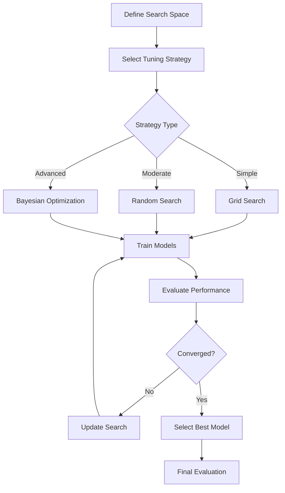
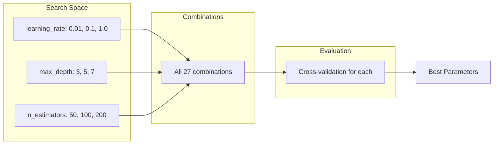
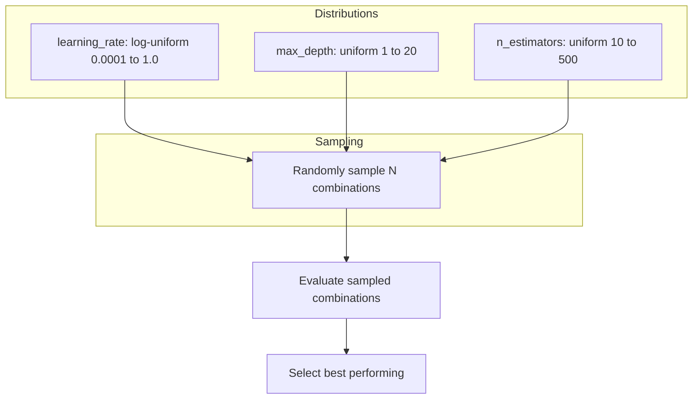
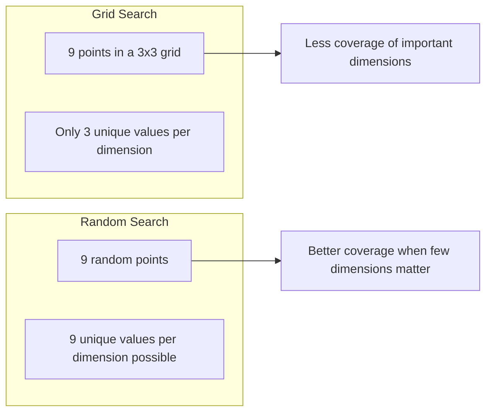
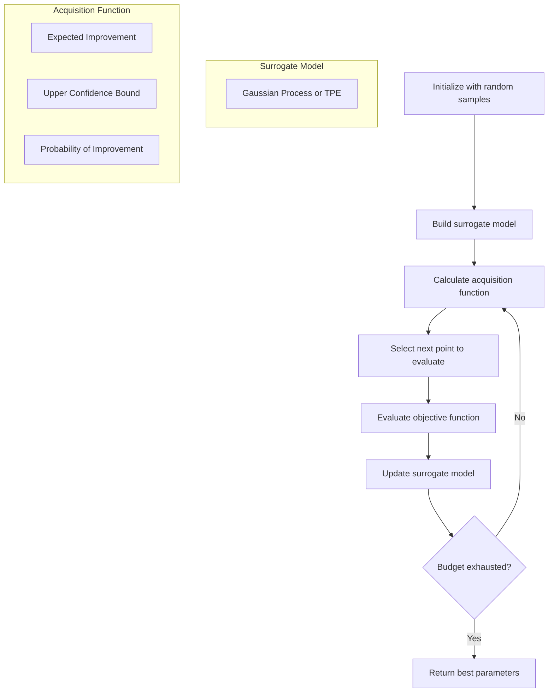
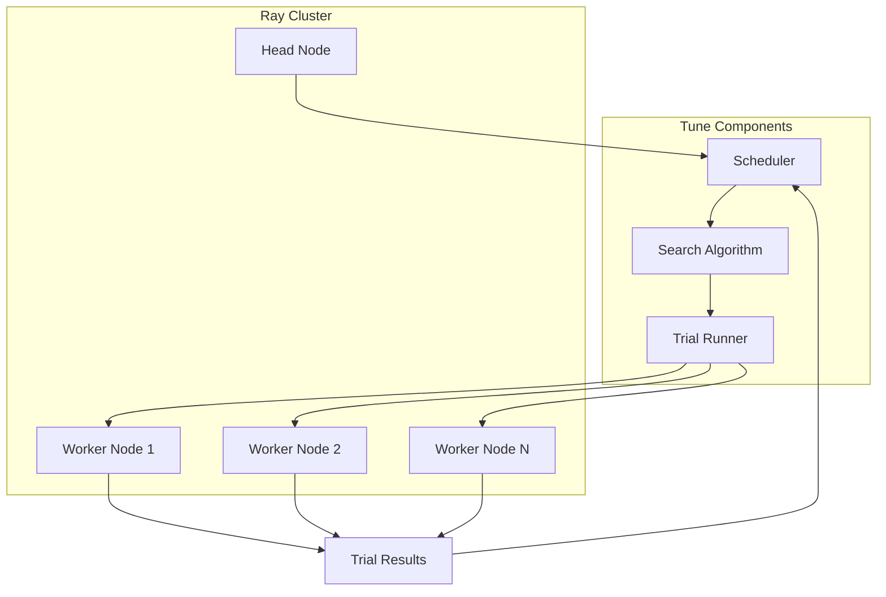
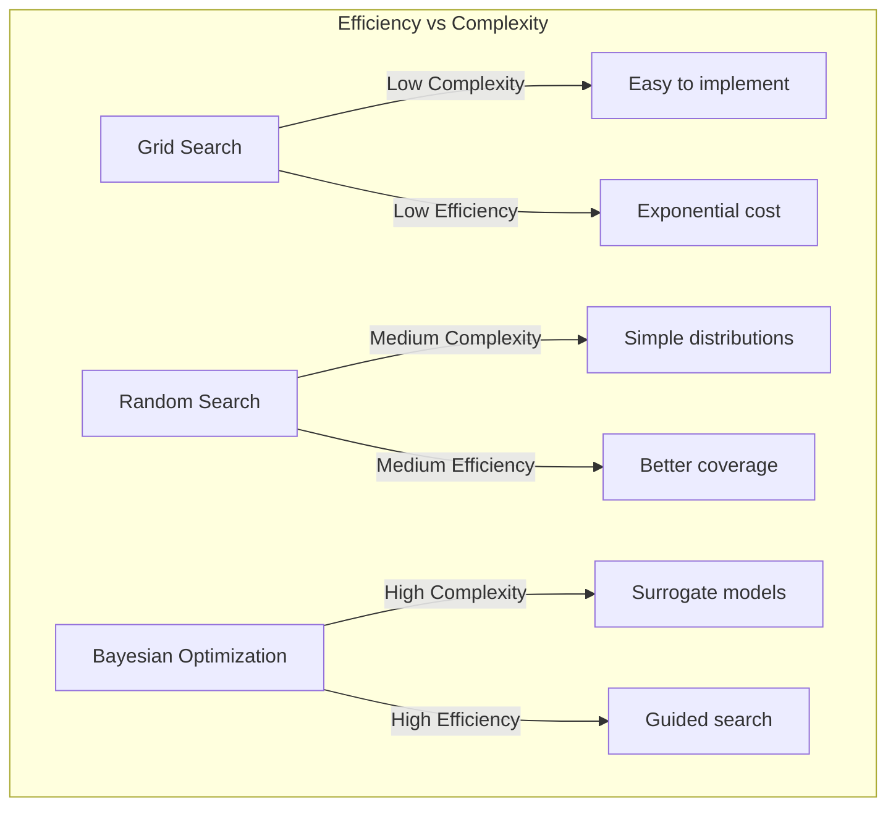
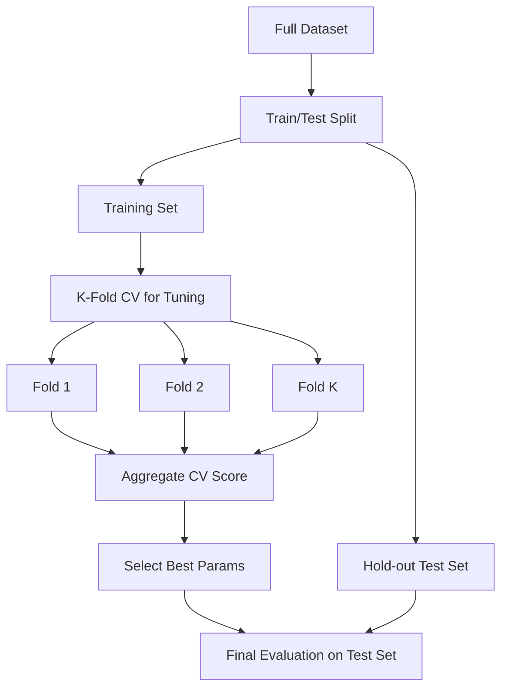

# How to Build Hyperparameter Tuning

Author: [nawazdhandala](https://github.com/nawazdhandala)

Tags: MLOps, Machine Learning, Hyperparameters, Optimization

Description: Learn how to implement hyperparameter tuning for optimal model performance.

---

## Introduction

Hyperparameter tuning is one of the most critical steps in building high-performing machine learning models. Unlike model parameters that are learned during training, hyperparameters are configuration values set before the learning process begins. Finding the optimal combination of hyperparameters can significantly improve model accuracy, reduce overfitting, and decrease training time.

In this comprehensive guide, we will explore various hyperparameter tuning strategies, from basic grid search to advanced Bayesian optimization, with practical code examples using popular frameworks like Optuna and Ray Tune.

## What Are Hyperparameters?

Hyperparameters control the learning process itself rather than being learned from data. Common examples include:

- **Learning rate**: Controls how quickly the model adapts to the problem
- **Number of layers and neurons**: Defines the architecture of neural networks
- **Batch size**: Determines how many samples are processed before updating weights
- **Regularization parameters**: Controls model complexity to prevent overfitting
- **Number of trees**: For ensemble methods like Random Forest or XGBoost

## Hyperparameter Tuning Workflow



## Strategy 1: Grid Search

Grid search is the simplest approach where you exhaustively search through a manually specified subset of hyperparameters.

### How Grid Search Works



### Implementation with Scikit-learn

```python
# Grid Search implementation using scikit-learn
# This approach tests every combination of specified hyperparameters

from sklearn.model_selection import GridSearchCV
from sklearn.ensemble import RandomForestClassifier
from sklearn.datasets import make_classification
from sklearn.model_selection import train_test_split

# Generate sample dataset for demonstration
X, y = make_classification(
    n_samples=1000,      # Number of samples
    n_features=20,       # Total number of features
    n_informative=15,    # Number of informative features
    n_redundant=5,       # Number of redundant features
    random_state=42      # Seed for reproducibility
)

# Split data into training and test sets
X_train, X_test, y_train, y_test = train_test_split(
    X, y,
    test_size=0.2,       # 20% for testing
    random_state=42
)

# Define the model to tune
model = RandomForestClassifier(random_state=42)

# Define the hyperparameter search space
# Grid search will try ALL combinations of these values
param_grid = {
    'n_estimators': [50, 100, 200],      # Number of trees in the forest
    'max_depth': [3, 5, 7, 10],          # Maximum depth of each tree
    'min_samples_split': [2, 5, 10],     # Minimum samples to split a node
    'min_samples_leaf': [1, 2, 4]        # Minimum samples in a leaf node
}

# Calculate total number of combinations
total_combinations = 3 * 4 * 3 * 3  # = 108 combinations
print(f"Total hyperparameter combinations to evaluate: {total_combinations}")

# Initialize GridSearchCV
# cv=5 means 5-fold cross-validation for each combination
grid_search = GridSearchCV(
    estimator=model,
    param_grid=param_grid,
    cv=5,                    # 5-fold cross-validation
    scoring='accuracy',      # Metric to optimize
    n_jobs=-1,               # Use all available CPU cores
    verbose=2,               # Print progress
    return_train_score=True  # Also compute training scores
)

# Execute the grid search
# This will train 108 * 5 = 540 models!
grid_search.fit(X_train, y_train)

# Display results
print(f"\nBest parameters found: {grid_search.best_params_}")
print(f"Best cross-validation score: {grid_search.best_score_:.4f}")

# Evaluate on test set using the best model
best_model = grid_search.best_estimator_
test_score = best_model.score(X_test, y_test)
print(f"Test set accuracy: {test_score:.4f}")
```

### Pros and Cons of Grid Search

| Pros | Cons |
|------|------|
| Simple to implement | Computationally expensive |
| Guaranteed to find best in grid | Does not scale well |
| Easy to parallelize | May miss optimal values between grid points |
| Reproducible results | Curse of dimensionality |

## Strategy 2: Random Search

Random search samples hyperparameters randomly from specified distributions. Research has shown it often outperforms grid search, especially when only a few hyperparameters significantly affect performance.

### How Random Search Works



### Implementation with Scikit-learn

```python
# Random Search implementation
# More efficient than grid search for high-dimensional spaces

from sklearn.model_selection import RandomizedSearchCV
from sklearn.ensemble import GradientBoostingClassifier
from scipy.stats import uniform, randint, loguniform
import numpy as np

# Define the model
model = GradientBoostingClassifier(random_state=42)

# Define parameter distributions (not fixed values)
# Random search will sample from these distributions
param_distributions = {
    # Number of boosting stages (discrete uniform distribution)
    'n_estimators': randint(50, 300),

    # Learning rate (log-uniform distribution)
    # Log-uniform is better for parameters that vary over orders of magnitude
    'learning_rate': loguniform(0.001, 0.5),

    # Maximum depth of trees (discrete uniform)
    'max_depth': randint(2, 15),

    # Minimum samples required to split a node
    'min_samples_split': randint(2, 20),

    # Fraction of samples used for each tree
    'subsample': uniform(0.6, 0.4),  # uniform(loc, scale) = [loc, loc+scale]

    # Maximum features to consider for splits
    'max_features': ['sqrt', 'log2', None]
}

# Initialize RandomizedSearchCV
random_search = RandomizedSearchCV(
    estimator=model,
    param_distributions=param_distributions,
    n_iter=100,              # Number of random combinations to try
    cv=5,                    # 5-fold cross-validation
    scoring='accuracy',
    n_jobs=-1,               # Use all CPU cores
    verbose=1,
    random_state=42,         # For reproducibility
    return_train_score=True
)

# Execute random search
random_search.fit(X_train, y_train)

# Results
print(f"\nBest parameters: {random_search.best_params_}")
print(f"Best CV score: {random_search.best_score_:.4f}")

# Analyze the search results
import pandas as pd

# Convert results to DataFrame for analysis
results_df = pd.DataFrame(random_search.cv_results_)
results_df = results_df.sort_values('rank_test_score')

# Show top 5 configurations
print("\nTop 5 configurations:")
print(results_df[['params', 'mean_test_score', 'std_test_score']].head())
```

### Why Random Search Often Beats Grid Search



## Strategy 3: Bayesian Optimization

Bayesian optimization uses a probabilistic model to guide the search. It builds a surrogate model of the objective function and uses it to select the most promising hyperparameters to evaluate next.

### How Bayesian Optimization Works



## Optuna: Modern Hyperparameter Optimization

Optuna is a powerful framework that uses Bayesian optimization with Tree-structured Parzen Estimator (TPE) by default. It offers pruning capabilities to stop unpromising trials early.

### Basic Optuna Example

```python
# Optuna: A modern hyperparameter optimization framework
# Features: Pruning, distributed optimization, visualization

import optuna
from optuna.samplers import TPESampler
from sklearn.model_selection import cross_val_score
from sklearn.neural_network import MLPClassifier
import warnings
warnings.filterwarnings('ignore')

def objective(trial):
    """
    Objective function that Optuna will optimize.

    Args:
        trial: Optuna trial object for suggesting hyperparameters

    Returns:
        float: Cross-validation score to maximize
    """

    # Suggest hyperparameters using Optuna's API
    # Each suggest_* method defines the search space

    # Number of hidden layers (1 to 4)
    n_layers = trial.suggest_int('n_layers', 1, 4)

    # Build the hidden layer sizes dynamically
    hidden_layer_sizes = []
    for i in range(n_layers):
        # Each layer can have 32 to 256 neurons
        n_units = trial.suggest_int(f'n_units_layer_{i}', 32, 256)
        hidden_layer_sizes.append(n_units)

    # Learning rate (log scale for better sampling)
    learning_rate_init = trial.suggest_float(
        'learning_rate_init',
        1e-5,
        1e-1,
        log=True  # Sample in log space
    )

    # Regularization parameter (log scale)
    alpha = trial.suggest_float('alpha', 1e-6, 1e-1, log=True)

    # Batch size (categorical choice)
    batch_size = trial.suggest_categorical('batch_size', [16, 32, 64, 128])

    # Activation function
    activation = trial.suggest_categorical(
        'activation',
        ['relu', 'tanh', 'logistic']
    )

    # Create the model with suggested hyperparameters
    model = MLPClassifier(
        hidden_layer_sizes=tuple(hidden_layer_sizes),
        learning_rate_init=learning_rate_init,
        alpha=alpha,
        batch_size=batch_size,
        activation=activation,
        max_iter=200,
        random_state=42,
        early_stopping=True,      # Enable early stopping
        validation_fraction=0.1   # Use 10% for validation
    )

    # Perform cross-validation
    scores = cross_val_score(model, X_train, y_train, cv=3, scoring='accuracy')

    return scores.mean()

# Create an Optuna study
# direction='maximize' because we want to maximize accuracy
study = optuna.create_study(
    direction='maximize',
    sampler=TPESampler(seed=42),  # TPE sampler for Bayesian optimization
    study_name='mlp_optimization'
)

# Run the optimization
study.optimize(
    objective,
    n_trials=50,           # Number of trials to run
    timeout=600,           # Maximum time in seconds (optional)
    show_progress_bar=True,
    n_jobs=1               # Number of parallel jobs
)

# Display results
print(f"\nBest trial:")
print(f"  Value (accuracy): {study.best_trial.value:.4f}")
print(f"  Params:")
for key, value in study.best_trial.params.items():
    print(f"    {key}: {value}")
```

### Optuna with Pruning for Deep Learning

```python
# Optuna with pruning for early stopping of unpromising trials
# This significantly speeds up hyperparameter search

import optuna
from optuna.integration import PyTorchLightningPruningCallback
import torch
import torch.nn as nn
import torch.optim as optim
from torch.utils.data import DataLoader, TensorDataset

class NeuralNetwork(nn.Module):
    """
    Simple feedforward neural network with configurable architecture.
    """
    def __init__(self, input_size, hidden_sizes, dropout_rate):
        super().__init__()

        layers = []
        prev_size = input_size

        # Build hidden layers dynamically
        for hidden_size in hidden_sizes:
            layers.append(nn.Linear(prev_size, hidden_size))
            layers.append(nn.ReLU())
            layers.append(nn.Dropout(dropout_rate))
            prev_size = hidden_size

        # Output layer (binary classification)
        layers.append(nn.Linear(prev_size, 1))
        layers.append(nn.Sigmoid())

        self.network = nn.Sequential(*layers)

    def forward(self, x):
        return self.network(x)

def objective_pytorch(trial):
    """
    Objective function for PyTorch model optimization with pruning.
    """

    # Hyperparameter suggestions
    n_layers = trial.suggest_int('n_layers', 1, 3)
    hidden_sizes = [
        trial.suggest_int(f'hidden_size_{i}', 16, 128)
        for i in range(n_layers)
    ]

    dropout_rate = trial.suggest_float('dropout_rate', 0.1, 0.5)
    learning_rate = trial.suggest_float('learning_rate', 1e-5, 1e-2, log=True)
    batch_size = trial.suggest_categorical('batch_size', [16, 32, 64])
    optimizer_name = trial.suggest_categorical('optimizer', ['Adam', 'SGD', 'RMSprop'])

    # Prepare data
    X_tensor = torch.FloatTensor(X_train)
    y_tensor = torch.FloatTensor(y_train).unsqueeze(1)
    dataset = TensorDataset(X_tensor, y_tensor)
    dataloader = DataLoader(dataset, batch_size=batch_size, shuffle=True)

    # Create model
    model = NeuralNetwork(
        input_size=X_train.shape[1],
        hidden_sizes=hidden_sizes,
        dropout_rate=dropout_rate
    )

    # Select optimizer
    if optimizer_name == 'Adam':
        optimizer = optim.Adam(model.parameters(), lr=learning_rate)
    elif optimizer_name == 'SGD':
        optimizer = optim.SGD(model.parameters(), lr=learning_rate, momentum=0.9)
    else:
        optimizer = optim.RMSprop(model.parameters(), lr=learning_rate)

    criterion = nn.BCELoss()

    # Training loop with pruning
    n_epochs = 50
    for epoch in range(n_epochs):
        model.train()
        epoch_loss = 0.0

        for batch_X, batch_y in dataloader:
            optimizer.zero_grad()
            outputs = model(batch_X)
            loss = criterion(outputs, batch_y)
            loss.backward()
            optimizer.step()
            epoch_loss += loss.item()

        # Calculate validation accuracy
        model.eval()
        with torch.no_grad():
            X_test_tensor = torch.FloatTensor(X_test)
            y_pred = model(X_test_tensor)
            y_pred_binary = (y_pred.numpy() > 0.5).astype(int)
            accuracy = (y_pred_binary.flatten() == y_test).mean()

        # Report intermediate value for pruning
        trial.report(accuracy, epoch)

        # Check if trial should be pruned
        # Optuna will prune trials that are unlikely to improve
        if trial.should_prune():
            raise optuna.exceptions.TrialPruned()

    return accuracy

# Create study with pruning
study = optuna.create_study(
    direction='maximize',
    pruner=optuna.pruners.MedianPruner(
        n_startup_trials=5,    # Trials before pruning starts
        n_warmup_steps=10,     # Steps before pruning a trial
        interval_steps=1       # Check for pruning every step
    )
)

# Run optimization
study.optimize(objective_pytorch, n_trials=30, show_progress_bar=True)

# Print statistics about pruning
pruned_trials = [t for t in study.trials if t.state == optuna.trial.TrialState.PRUNED]
complete_trials = [t for t in study.trials if t.state == optuna.trial.TrialState.COMPLETE]

print(f"\nStudy statistics:")
print(f"  Completed trials: {len(complete_trials)}")
print(f"  Pruned trials: {len(pruned_trials)}")
print(f"  Best accuracy: {study.best_trial.value:.4f}")
```

### Optuna Visualization

```python
# Optuna provides built-in visualization tools
# These help understand the optimization process

import optuna.visualization as vis

# Plot optimization history
# Shows how the objective value improved over trials
fig_history = vis.plot_optimization_history(study)
fig_history.show()

# Plot parameter importances
# Identifies which hyperparameters have the most impact
fig_importance = vis.plot_param_importances(study)
fig_importance.show()

# Plot parallel coordinate
# Visualizes relationships between parameters and objective
fig_parallel = vis.plot_parallel_coordinate(study)
fig_parallel.show()

# Plot slice plot
# Shows the relationship between each parameter and objective
fig_slice = vis.plot_slice(study)
fig_slice.show()

# Plot contour for two parameters
# Useful for understanding parameter interactions
fig_contour = vis.plot_contour(study, params=['learning_rate', 'dropout_rate'])
fig_contour.show()
```

## Ray Tune: Distributed Hyperparameter Tuning

Ray Tune is a scalable hyperparameter tuning library that supports distributed training across multiple machines. It integrates with many ML frameworks and optimization algorithms.

### Ray Tune Architecture



### Basic Ray Tune Example

```python
# Ray Tune: Scalable distributed hyperparameter tuning
# Supports various search algorithms and schedulers

from ray import tune
from ray.tune.schedulers import ASHAScheduler
from ray.tune.search.optuna import OptunaSearch
from sklearn.ensemble import RandomForestClassifier
from sklearn.model_selection import cross_val_score
import numpy as np

def train_model(config):
    """
    Training function for Ray Tune.

    Args:
        config: Dictionary containing hyperparameters
    """

    # Create model with hyperparameters from config
    model = RandomForestClassifier(
        n_estimators=config['n_estimators'],
        max_depth=config['max_depth'],
        min_samples_split=config['min_samples_split'],
        min_samples_leaf=config['min_samples_leaf'],
        max_features=config['max_features'],
        random_state=42,
        n_jobs=-1
    )

    # Perform cross-validation
    scores = cross_val_score(model, X_train, y_train, cv=5, scoring='accuracy')
    mean_accuracy = scores.mean()

    # Report metrics to Ray Tune
    # This allows the scheduler to make decisions about the trial
    tune.report(accuracy=mean_accuracy)

# Define the search space
search_space = {
    'n_estimators': tune.randint(50, 300),
    'max_depth': tune.randint(2, 20),
    'min_samples_split': tune.randint(2, 20),
    'min_samples_leaf': tune.randint(1, 10),
    'max_features': tune.choice(['sqrt', 'log2', None])
}

# Create ASHA scheduler for early stopping
# ASHA (Asynchronous Successive Halving Algorithm) efficiently
# allocates resources by stopping poor performers early
scheduler = ASHAScheduler(
    metric='accuracy',
    mode='max',
    max_t=100,           # Maximum number of training iterations
    grace_period=10,     # Minimum iterations before stopping
    reduction_factor=2   # Halving factor for successive halvings
)

# Create Optuna search algorithm for Bayesian optimization
search_alg = OptunaSearch(
    metric='accuracy',
    mode='max'
)

# Run the hyperparameter search
analysis = tune.run(
    train_model,
    config=search_space,
    num_samples=50,              # Number of trials
    scheduler=scheduler,
    search_alg=search_alg,
    resources_per_trial={
        'cpu': 2,                # CPUs per trial
        'gpu': 0                 # GPUs per trial (if available)
    },
    verbose=1
)

# Get the best configuration
best_config = analysis.get_best_config(metric='accuracy', mode='max')
print(f"\nBest configuration: {best_config}")

# Get the best result
best_result = analysis.get_best_trial(metric='accuracy', mode='max')
print(f"Best accuracy: {best_result.last_result['accuracy']:.4f}")
```

### Ray Tune with PyTorch

```python
# Ray Tune with PyTorch for deep learning hyperparameter tuning
# Includes checkpointing and early stopping

from ray import tune
from ray.tune.schedulers import PopulationBasedTraining
from ray.air import session
from ray.air.checkpoint import Checkpoint
import torch
import torch.nn as nn
import torch.optim as optim
import tempfile
import os

def train_pytorch_model(config):
    """
    PyTorch training function with Ray Tune integration.
    Supports checkpointing and early stopping.
    """

    # Build model architecture based on config
    layers = []
    input_size = 20  # Number of features

    for i in range(config['num_layers']):
        output_size = config['hidden_size']
        layers.append(nn.Linear(input_size, output_size))
        layers.append(nn.ReLU())
        layers.append(nn.Dropout(config['dropout']))
        input_size = output_size

    layers.append(nn.Linear(input_size, 1))
    layers.append(nn.Sigmoid())

    model = nn.Sequential(*layers)

    # Setup optimizer
    optimizer = optim.Adam(
        model.parameters(),
        lr=config['lr'],
        weight_decay=config['weight_decay']
    )

    criterion = nn.BCELoss()

    # Prepare data
    X_tensor = torch.FloatTensor(X_train)
    y_tensor = torch.FloatTensor(y_train).unsqueeze(1)
    X_test_tensor = torch.FloatTensor(X_test)
    y_test_tensor = torch.FloatTensor(y_test).unsqueeze(1)

    # Training loop
    batch_size = config['batch_size']
    n_samples = len(X_tensor)

    for epoch in range(100):  # Maximum epochs
        model.train()

        # Mini-batch training
        permutation = torch.randperm(n_samples)
        epoch_loss = 0.0

        for i in range(0, n_samples, batch_size):
            indices = permutation[i:i + batch_size]
            batch_X = X_tensor[indices]
            batch_y = y_tensor[indices]

            optimizer.zero_grad()
            outputs = model(batch_X)
            loss = criterion(outputs, batch_y)
            loss.backward()
            optimizer.step()
            epoch_loss += loss.item()

        # Validation
        model.eval()
        with torch.no_grad():
            val_outputs = model(X_test_tensor)
            val_loss = criterion(val_outputs, y_test_tensor).item()
            predictions = (val_outputs > 0.5).float()
            accuracy = (predictions == y_test_tensor).float().mean().item()

        # Save checkpoint
        with tempfile.TemporaryDirectory() as temp_checkpoint_dir:
            checkpoint_path = os.path.join(temp_checkpoint_dir, "model.pt")
            torch.save({
                'epoch': epoch,
                'model_state_dict': model.state_dict(),
                'optimizer_state_dict': optimizer.state_dict(),
                'loss': val_loss,
            }, checkpoint_path)

            # Report metrics to Ray Tune
            session.report(
                {'loss': val_loss, 'accuracy': accuracy},
                checkpoint=Checkpoint.from_directory(temp_checkpoint_dir)
            )

# Define search space
search_space = {
    'num_layers': tune.choice([1, 2, 3]),
    'hidden_size': tune.choice([32, 64, 128, 256]),
    'dropout': tune.uniform(0.1, 0.5),
    'lr': tune.loguniform(1e-5, 1e-2),
    'weight_decay': tune.loguniform(1e-6, 1e-3),
    'batch_size': tune.choice([16, 32, 64])
}

# Population Based Training scheduler
# PBT dynamically adjusts hyperparameters during training
pbt_scheduler = PopulationBasedTraining(
    time_attr='training_iteration',
    perturbation_interval=5,  # Perturb every 5 iterations
    hyperparam_mutations={
        'lr': tune.loguniform(1e-5, 1e-2),
        'weight_decay': tune.loguniform(1e-6, 1e-3),
        'dropout': tune.uniform(0.1, 0.5)
    }
)

# Run tuning
tuner = tune.Tuner(
    train_pytorch_model,
    param_space=search_space,
    tune_config=tune.TuneConfig(
        metric='accuracy',
        mode='max',
        scheduler=pbt_scheduler,
        num_samples=20
    ),
    run_config=tune.RunConfig(
        stop={'training_iteration': 100}
    )
)

results = tuner.fit()

# Get best result
best_result = results.get_best_result(metric='accuracy', mode='max')
print(f"Best accuracy: {best_result.metrics['accuracy']:.4f}")
print(f"Best config: {best_result.config}")
```

## Comparison of Tuning Methods



| Method | Best For | Trials Needed | Parallelization | Complexity |
|--------|----------|---------------|-----------------|------------|
| Grid Search | Small spaces, few params | High | Excellent | Low |
| Random Search | Medium spaces | Medium | Excellent | Low |
| Bayesian (Optuna) | Any space | Low | Good | Medium |
| Ray Tune | Large scale, distributed | Variable | Excellent | High |

## Best Practices for Hyperparameter Tuning

### 1. Define Meaningful Search Spaces

```python
# Good: Use appropriate distributions for different parameter types
search_space = {
    # Log-uniform for learning rates (vary over orders of magnitude)
    'learning_rate': tune.loguniform(1e-5, 1e-1),

    # Uniform for bounded continuous values
    'dropout': tune.uniform(0.0, 0.5),

    # Integer for discrete values
    'num_layers': tune.randint(1, 5),

    # Categorical for discrete choices
    'optimizer': tune.choice(['adam', 'sgd', 'rmsprop'])
}

# Bad: Using linear scale for learning rate
# This wastes samples on large values
bad_space = {
    'learning_rate': tune.uniform(0.0001, 0.1)  # Avoid this!
}
```

### 2. Use Early Stopping

```python
# Always use early stopping to save compute resources
from ray.tune.schedulers import ASHAScheduler

scheduler = ASHAScheduler(
    metric='val_loss',
    mode='min',
    max_t=100,        # Max epochs
    grace_period=10,  # Min epochs before stopping
    reduction_factor=3
)
```

### 3. Start with Random Search

```python
# For initial exploration, random search is often sufficient
# It helps identify important hyperparameters

from sklearn.model_selection import RandomizedSearchCV

# Run random search first to narrow down the space
initial_search = RandomizedSearchCV(
    model,
    param_distributions=wide_distributions,
    n_iter=50,  # Quick initial exploration
    cv=3
)
initial_search.fit(X_train, y_train)

# Then use Bayesian optimization on a refined space
refined_space = create_refined_space(initial_search.best_params_)
```

### 4. Cross-Validation Strategy



## Conclusion

Hyperparameter tuning is essential for achieving optimal model performance. Here are the key takeaways:

1. **Start simple**: Begin with random search to understand which hyperparameters matter most
2. **Use appropriate tools**: Optuna for single-machine optimization, Ray Tune for distributed workloads
3. **Enable early stopping**: Use schedulers like ASHA to save computational resources
4. **Define smart search spaces**: Use log-uniform distributions for parameters that vary over orders of magnitude
5. **Always hold out a test set**: Never tune on your final evaluation set

By following these practices and using the right tools for your scale, you can efficiently find hyperparameters that significantly improve your model's performance.

## Further Reading

- [Optuna Documentation](https://optuna.readthedocs.io/)
- [Ray Tune Documentation](https://docs.ray.io/en/latest/tune/index.html)
- [Algorithms for Hyper-Parameter Optimization (Bergstra et al.)](https://papers.nips.cc/paper/4443-algorithms-for-hyper-parameter-optimization)
- [Random Search for Hyper-Parameter Optimization (Bergstra & Bengio)](https://www.jmlr.org/papers/volume13/bergstra12a/bergstra12a.pdf)
