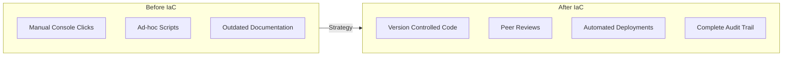
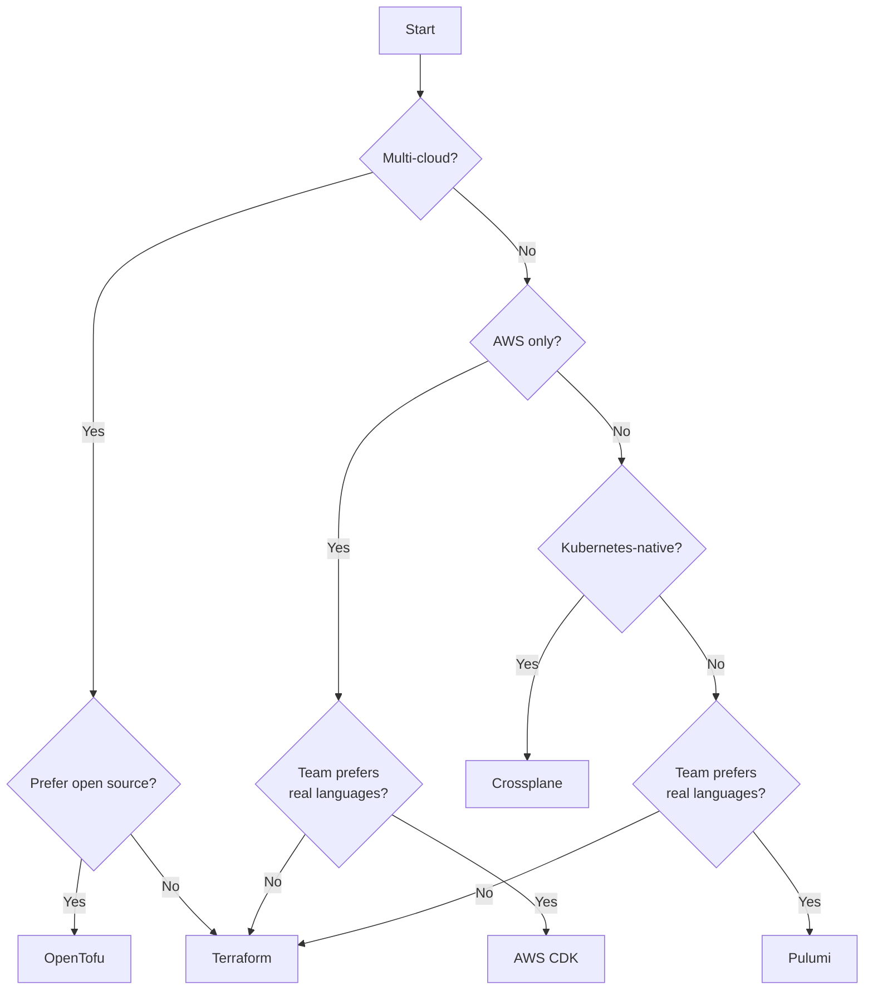
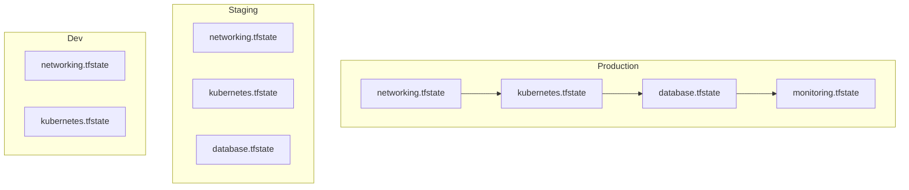
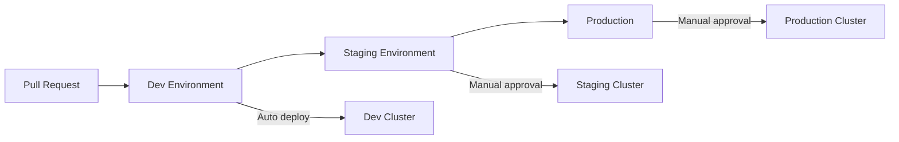
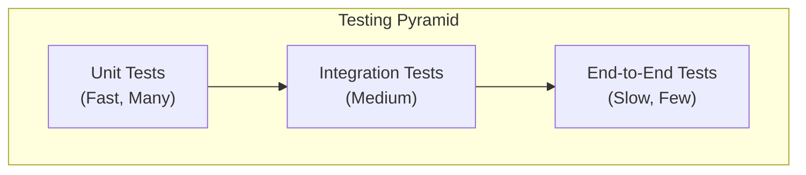
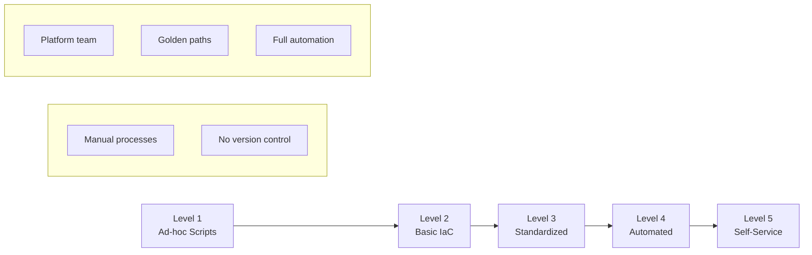

# How to Build IaC Strategy

Author: [nawazdhandala](https://github.com/nawazdhandala)

Tags: Infrastructure as Code, Terraform, DevOps, Cloud, Automation, GitOps

Description: A practical guide to building an Infrastructure as Code strategy that scales with your organization, from tool selection and repository structure to testing, security, and team adoption.

---

Infrastructure as Code (IaC) transforms how teams provision and manage infrastructure. Instead of clicking through cloud consoles or running ad-hoc scripts, you define everything in version-controlled files. But adopting IaC without a strategy leads to sprawling repositories, inconsistent patterns, and frustrated engineers.

This guide walks you through building an IaC strategy that actually works.

## Why You Need an IaC Strategy



Without a clear strategy, IaC adoption often fails because:

- **Inconsistent patterns** across teams make collaboration difficult
- **No testing standards** means broken infrastructure reaches production
- **Missing security guardrails** expose sensitive credentials in repos
- **Poor state management** causes conflicts and drift

A solid strategy addresses all of these before they become problems.

## Step 1: Choose Your Tools

The IaC ecosystem offers several options. Pick based on your cloud strategy and team skills.

### Tool Comparison

| Tool | Best For | Language | State Management |
|------|----------|----------|------------------|
| Terraform | Multi-cloud, mature ecosystem | HCL | Remote backends |
| OpenTofu | Open-source Terraform alternative | HCL | Remote backends |
| Pulumi | Developers who prefer real languages | Python, TypeScript, Go | Pulumi Cloud or self-managed |
| AWS CDK | AWS-only shops | TypeScript, Python | CloudFormation |
| Crossplane | Kubernetes-native infrastructure | YAML | Kubernetes CRDs |

### Decision Framework

Use this flowchart to guide your tool selection.



For most teams, Terraform or OpenTofu provides the best balance of maturity, community support, and multi-cloud flexibility.

## Step 2: Design Your Repository Structure

Repository structure determines how teams collaborate and how changes flow through environments.

### Monorepo vs Polyrepo

**Monorepo**: All infrastructure code in one repository.

```
infrastructure/
├── modules/
│   ├── networking/
│   ├── compute/
│   ├── database/
│   └── monitoring/
├── environments/
│   ├── dev/
│   ├── staging/
│   └── production/
├── policies/
└── .github/workflows/
```

**Polyrepo**: Separate repositories per team or domain.

```
# Team repos
platform-infrastructure/
application-team-a-infra/
application-team-b-infra/

# Shared modules repo
terraform-modules/
```

### When to Use Each

| Approach | Pros | Cons | Best For |
|----------|------|------|----------|
| Monorepo | Single source of truth, easier cross-cutting changes | Blast radius, complex CI/CD | Small to medium teams, shared infrastructure |
| Polyrepo | Team autonomy, isolated blast radius | Module versioning overhead, potential drift | Large organizations, independent teams |

### Recommended Module Structure

Organize modules for reusability and clarity.

```
modules/
├── networking/
│   ├── vpc/
│   │   ├── main.tf
│   │   ├── variables.tf
│   │   ├── outputs.tf
│   │   └── README.md
│   └── load-balancer/
├── compute/
│   ├── kubernetes-cluster/
│   └── vm-instance/
└── database/
    ├── postgresql/
    └── redis/
```

Each module should include these files for consistency.

```hcl
# variables.tf - Define all inputs with descriptions and validation
variable "environment" {
  description = "Environment name (dev, staging, production)"
  type        = string

  validation {
    condition     = contains(["dev", "staging", "production"], var.environment)
    error_message = "Environment must be dev, staging, or production."
  }
}

variable "instance_count" {
  description = "Number of instances to create"
  type        = number
  default     = 1

  validation {
    condition     = var.instance_count > 0 && var.instance_count <= 10
    error_message = "Instance count must be between 1 and 10."
  }
}
```

```hcl
# outputs.tf - Expose values other modules need
output "cluster_endpoint" {
  description = "The endpoint for the Kubernetes API server"
  value       = aws_eks_cluster.main.endpoint
}

output "cluster_security_group_id" {
  description = "Security group ID attached to the EKS cluster"
  value       = aws_eks_cluster.main.vpc_config[0].cluster_security_group_id
}
```

## Step 3: Establish State Management

Terraform state contains sensitive data and must be managed carefully.

### Remote Backend Configuration

Never store state locally. Use a remote backend with locking.

```hcl
# backend.tf - Configure remote state storage with locking
terraform {
  backend "s3" {
    bucket         = "mycompany-terraform-state"
    key            = "environments/production/terraform.tfstate"
    region         = "us-east-1"
    encrypt        = true
    dynamodb_table = "terraform-state-lock"
  }
}
```

### State Isolation Strategy

Isolate state by environment and component to limit blast radius.



### State File Naming Convention

Use consistent, hierarchical keys.

```
s3://terraform-state/
├── environments/
│   ├── dev/
│   │   ├── networking.tfstate
│   │   └── kubernetes.tfstate
│   ├── staging/
│   │   ├── networking.tfstate
│   │   ├── kubernetes.tfstate
│   │   └── database.tfstate
│   └── production/
│       ├── networking.tfstate
│       ├── kubernetes.tfstate
│       ├── database.tfstate
│       └── monitoring.tfstate
└── global/
    ├── iam.tfstate
    └── dns.tfstate
```

## Step 4: Implement Environment Promotion

Code should flow through environments before reaching production.



### Using Terraform Workspaces vs Directories

**Directory-based** (Recommended): Separate directories per environment with shared modules.

```
environments/
├── dev/
│   ├── main.tf
│   ├── terraform.tfvars
│   └── backend.tf
├── staging/
│   ├── main.tf
│   ├── terraform.tfvars
│   └── backend.tf
└── production/
    ├── main.tf
    ├── terraform.tfvars
    └── backend.tf
```

Each environment references the same modules with different variables.

```hcl
# environments/production/main.tf - Production environment configuration
module "kubernetes" {
  source = "../../modules/compute/kubernetes-cluster"

  environment    = "production"
  instance_count = 5
  instance_type  = "m5.xlarge"

  # Production-specific settings
  enable_monitoring = true
  backup_retention  = 30
}
```

```hcl
# environments/dev/main.tf - Development environment with smaller footprint
module "kubernetes" {
  source = "../../modules/compute/kubernetes-cluster"

  environment    = "dev"
  instance_count = 2
  instance_type  = "t3.medium"

  # Dev-specific settings
  enable_monitoring = false
  backup_retention  = 7
}
```

## Step 5: Build Your CI/CD Pipeline

Automate validation and deployment to catch issues early.

### Pipeline Stages

```mermaid
flowchart LR
    subgraph Validate
        Fmt[terraform fmt]
        Val[terraform validate]
        Lint[tflint]
        Sec[Security Scan]
    end

    subgraph Plan
        Init[terraform init]
        Plan[terraform plan]
        Cost[Cost Estimation]
    end

    subgraph Apply
        Approve[Manual Approval]
        Apply[terraform apply]
        Test[Post-deploy Tests]
    end

    Validate --> Plan --> Apply
```

### GitHub Actions Example

This workflow runs on pull requests to validate changes.

```yaml
# .github/workflows/terraform.yml - Complete CI/CD pipeline for Terraform
name: Terraform CI/CD

on:
  pull_request:
    paths:
      - 'environments/**'
      - 'modules/**'
  push:
    branches:
      - main

env:
  TF_VERSION: '1.6.0'
  AWS_REGION: 'us-east-1'

jobs:
  validate:
    runs-on: ubuntu-latest
    steps:
      - uses: actions/checkout@v4

      - name: Setup Terraform
        uses: hashicorp/setup-terraform@v3
        with:
          terraform_version: ${{ env.TF_VERSION }}

      # Check formatting consistency
      - name: Terraform Format Check
        run: terraform fmt -check -recursive

      # Validate syntax for each environment
      - name: Terraform Validate
        run: |
          for dir in environments/*/; do
            echo "Validating $dir"
            cd "$dir"
            terraform init -backend=false
            terraform validate
            cd -
          done

      # Run tflint for best practices
      - name: TFLint
        uses: terraform-linters/setup-tflint@v4
      - run: tflint --recursive

      # Security scanning with tfsec
      - name: Security Scan
        uses: aquasecurity/tfsec-action@v1.0.0

  plan:
    needs: validate
    runs-on: ubuntu-latest
    strategy:
      matrix:
        environment: [dev, staging, production]
    steps:
      - uses: actions/checkout@v4

      - name: Setup Terraform
        uses: hashicorp/setup-terraform@v3
        with:
          terraform_version: ${{ env.TF_VERSION }}

      - name: Configure AWS Credentials
        uses: aws-actions/configure-aws-credentials@v4
        with:
          role-to-assume: arn:aws:iam::${{ secrets.AWS_ACCOUNT_ID }}:role/terraform-ci
          aws-region: ${{ env.AWS_REGION }}

      - name: Terraform Init
        working-directory: environments/${{ matrix.environment }}
        run: terraform init

      # Generate and save plan for apply stage
      - name: Terraform Plan
        working-directory: environments/${{ matrix.environment }}
        run: terraform plan -out=tfplan

      # Estimate costs using Infracost
      - name: Cost Estimation
        uses: infracost/actions/setup@v3
        with:
          api-key: ${{ secrets.INFRACOST_API_KEY }}
      - run: infracost breakdown --path environments/${{ matrix.environment }}

  apply-dev:
    needs: plan
    if: github.ref == 'refs/heads/main'
    runs-on: ubuntu-latest
    environment: dev
    steps:
      - uses: actions/checkout@v4
      # ... apply steps for dev (auto-approved)

  apply-staging:
    needs: apply-dev
    if: github.ref == 'refs/heads/main'
    runs-on: ubuntu-latest
    environment: staging
    steps:
      - uses: actions/checkout@v4
      # ... apply steps for staging (requires approval)

  apply-production:
    needs: apply-staging
    if: github.ref == 'refs/heads/main'
    runs-on: ubuntu-latest
    environment: production
    steps:
      - uses: actions/checkout@v4
      # ... apply steps for production (requires approval)
```

## Step 6: Implement Security Guardrails

Security must be built into your IaC workflow, not bolted on after.

### Secret Management

Never commit secrets to version control. Use these patterns instead.

```hcl
# Use environment variables for sensitive values
variable "database_password" {
  description = "Database admin password"
  type        = string
  sensitive   = true  # Prevents value from appearing in logs
}

# Reference secrets from a secrets manager
data "aws_secretsmanager_secret_version" "db_password" {
  secret_id = "production/database/password"
}

resource "aws_db_instance" "main" {
  # ... other configuration
  password = data.aws_secretsmanager_secret_version.db_password.secret_string
}
```

### Policy as Code with OPA

Define policies that prevent insecure configurations.

```rego
# policy/security.rego - Deny public S3 buckets
package terraform.security

deny[msg] {
    resource := input.resource_changes[_]
    resource.type == "aws_s3_bucket"
    resource.change.after.acl == "public-read"
    msg := sprintf("S3 bucket %v cannot be public", [resource.address])
}

deny[msg] {
    resource := input.resource_changes[_]
    resource.type == "aws_security_group_rule"
    resource.change.after.cidr_blocks[_] == "0.0.0.0/0"
    resource.change.after.from_port == 22
    msg := sprintf("Security group %v allows SSH from anywhere", [resource.address])
}
```

### Required Tags Policy

Enforce tagging standards across all resources.

```hcl
# modules/tagging/main.tf - Standard tags applied to all resources
locals {
  required_tags = {
    Environment = var.environment
    Team        = var.team
    CostCenter  = var.cost_center
    ManagedBy   = "terraform"
    Repository  = var.repository_url
  }
}

# Merge with resource-specific tags
output "tags" {
  value = merge(local.required_tags, var.additional_tags)
}
```

## Step 7: Add Testing

Test infrastructure code like application code.

### Testing Pyramid



### Unit Tests with Terraform Test

Terraform 1.6+ includes native testing support.

```hcl
# modules/networking/vpc/tests/vpc.tftest.hcl - Test VPC module
variables {
  environment = "test"
  cidr_block  = "10.0.0.0/16"
}

run "creates_vpc_with_correct_cidr" {
  command = plan

  assert {
    condition     = aws_vpc.main.cidr_block == "10.0.0.0/16"
    error_message = "VPC CIDR block does not match expected value"
  }
}

run "creates_private_subnets" {
  command = plan

  assert {
    condition     = length(aws_subnet.private) == 3
    error_message = "Expected 3 private subnets"
  }
}

run "enables_dns_support" {
  command = plan

  assert {
    condition     = aws_vpc.main.enable_dns_support == true
    error_message = "DNS support should be enabled"
  }
}
```

### Integration Tests with Terratest

For more complex testing scenarios, use Terratest.

```go
// test/vpc_test.go - Integration test for VPC module
package test

import (
    "testing"
    "github.com/gruntwork-io/terratest/modules/terraform"
    "github.com/stretchr/testify/assert"
)

func TestVPCModule(t *testing.T) {
    t.Parallel()

    terraformOptions := &terraform.Options{
        TerraformDir: "../modules/networking/vpc",
        Vars: map[string]interface{}{
            "environment": "test",
            "cidr_block":  "10.0.0.0/16",
        },
    }

    // Clean up resources after test
    defer terraform.Destroy(t, terraformOptions)

    // Deploy the infrastructure
    terraform.InitAndApply(t, terraformOptions)

    // Validate outputs
    vpcID := terraform.Output(t, terraformOptions, "vpc_id")
    assert.NotEmpty(t, vpcID)

    privateSubnets := terraform.OutputList(t, terraformOptions, "private_subnet_ids")
    assert.Equal(t, 3, len(privateSubnets))
}
```

## Step 8: Document and Onboard

Documentation enables team adoption and reduces knowledge silos.

### Module Documentation

Use terraform-docs to auto-generate documentation.

```bash
# Generate README for a module
terraform-docs markdown table ./modules/networking/vpc > ./modules/networking/vpc/README.md
```

### Architecture Decision Records

Document significant decisions in ADRs.

```markdown
# ADR-001: Use Terraform for Infrastructure as Code

## Status
Accepted

## Context
We need to manage cloud infrastructure consistently across multiple environments.

## Decision
We will use Terraform as our primary IaC tool.

## Consequences
- Teams must learn HCL syntax
- We gain multi-cloud flexibility
- Large ecosystem of providers and modules available
```

### Runbook Template

Create runbooks for common operations.

```markdown
# Runbook: Adding a New Environment

## Prerequisites
- AWS account access
- Terraform CLI installed
- Access to state bucket

## Steps

1. Create environment directory:
   ```bash
   cp -r environments/template environments/new-env
   ```

2. Update backend configuration in `backend.tf`

3. Customize variables in `terraform.tfvars`

4. Initialize and apply:
   ```bash
   terraform init
   terraform plan
   terraform apply
   ```

## Validation
- Verify resources in AWS Console
- Run smoke tests
- Update monitoring dashboards
```

## Step 9: Implement Drift Detection

Infrastructure drift occurs when actual state differs from defined state.

### Scheduled Drift Detection

Run plans on a schedule to detect drift.

```yaml
# .github/workflows/drift-detection.yml - Daily drift check
name: Drift Detection

on:
  schedule:
    - cron: '0 6 * * *'  # Run daily at 6 AM

jobs:
  detect-drift:
    runs-on: ubuntu-latest
    strategy:
      matrix:
        environment: [dev, staging, production]
    steps:
      - uses: actions/checkout@v4

      - name: Setup Terraform
        uses: hashicorp/setup-terraform@v3

      - name: Terraform Plan
        id: plan
        working-directory: environments/${{ matrix.environment }}
        run: |
          terraform init
          terraform plan -detailed-exitcode -out=tfplan 2>&1 | tee plan.txt
        continue-on-error: true

      # Alert if drift detected (exit code 2 means changes needed)
      - name: Alert on Drift
        if: steps.plan.outputs.exitcode == 2
        uses: slackapi/slack-github-action@v1
        with:
          payload: |
            {
              "text": "Infrastructure drift detected in ${{ matrix.environment }}",
              "blocks": [
                {
                  "type": "section",
                  "text": {
                    "type": "mrkdwn",
                    "text": "Review and remediate: ${{ github.server_url }}/${{ github.repository }}/actions/runs/${{ github.run_id }}"
                  }
                }
              ]
            }
        env:
          SLACK_WEBHOOK_URL: ${{ secrets.SLACK_WEBHOOK }}
```

## Step 10: Measure and Iterate

Track metrics to improve your IaC practice over time.

### Key Metrics

| Metric | Target | Why It Matters |
|--------|--------|----------------|
| Plan-to-Apply Time | < 30 minutes | Measures deployment velocity |
| Drift Incidents | 0 per week | Indicates discipline in using IaC |
| Failed Applies | < 5% | Shows code quality |
| Module Reuse Rate | > 70% | Reduces duplication |
| Mean Time to Recovery | < 1 hour | Tests rollback capability |

### Maturity Model



**Level 1 - Ad-hoc**: Manual console changes, scripts in personal directories.

**Level 2 - Basic IaC**: Infrastructure in version control, manual applies.

**Level 3 - Standardized**: Shared modules, consistent patterns, basic CI.

**Level 4 - Automated**: Full CI/CD, testing, policy enforcement.

**Level 5 - Self-Service**: Internal developer platform, golden paths, automatic provisioning.

## Putting It All Together

Building an IaC strategy is not a one-time project. Start with the basics and iterate.

### Quick Start Checklist

- [ ] Choose your IaC tool based on cloud strategy and team skills
- [ ] Set up a remote backend with state locking
- [ ] Create a basic repository structure with modules and environments
- [ ] Implement a CI pipeline with validation and planning
- [ ] Add security scanning to the pipeline
- [ ] Document modules and create onboarding guides
- [ ] Set up drift detection
- [ ] Define success metrics and review quarterly

### Common Pitfalls to Avoid

1. **Starting too big** - Begin with one service, not entire infrastructure
2. **Ignoring state management** - Remote state with locking is non-negotiable
3. **Skipping testing** - Tests catch issues before they reach production
4. **No security scanning** - Credentials in repos cause real breaches
5. **Poor documentation** - The best IaC is useless if no one understands it

---

Infrastructure as Code is a journey, not a destination. The strategy you build today will evolve as your organization grows. Focus on establishing good foundations, automate aggressively, and never stop improving.

**Related Reading:**

- [Introducing the OneUptime Terraform Provider](https://oneuptime.com/blog/post/2025-07-01-introducing-terraform-provider-for-oneuptime/view)
- [How to Implement GitOps with ArgoCD in Kubernetes](https://oneuptime.com/blog/post/2026-01-06-kubernetes-gitops-argocd/view)
- [SRE Best Practices That Actually Move the Needle](https://oneuptime.com/blog/post/2025-11-28-sre-best-practices/view)
