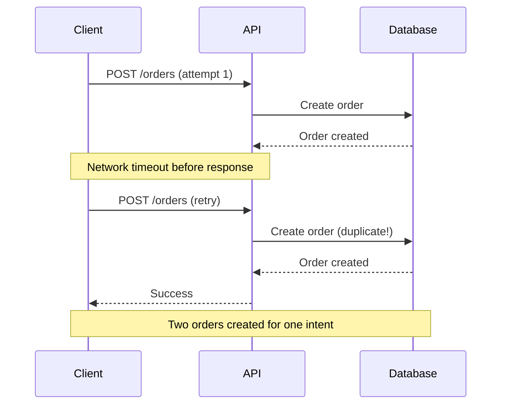
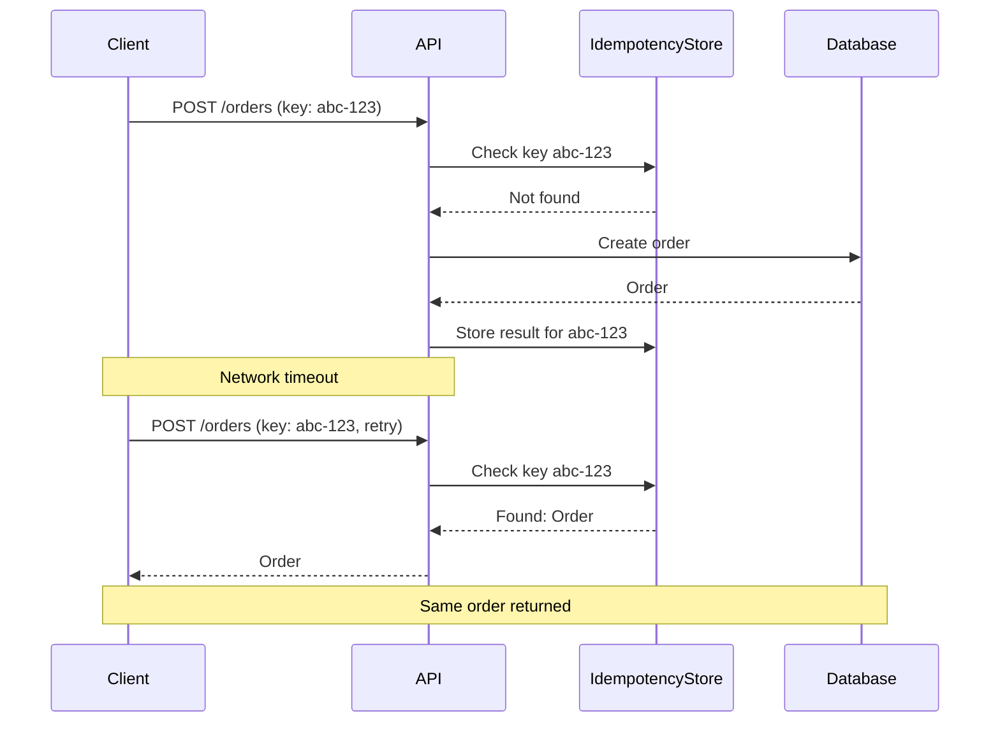
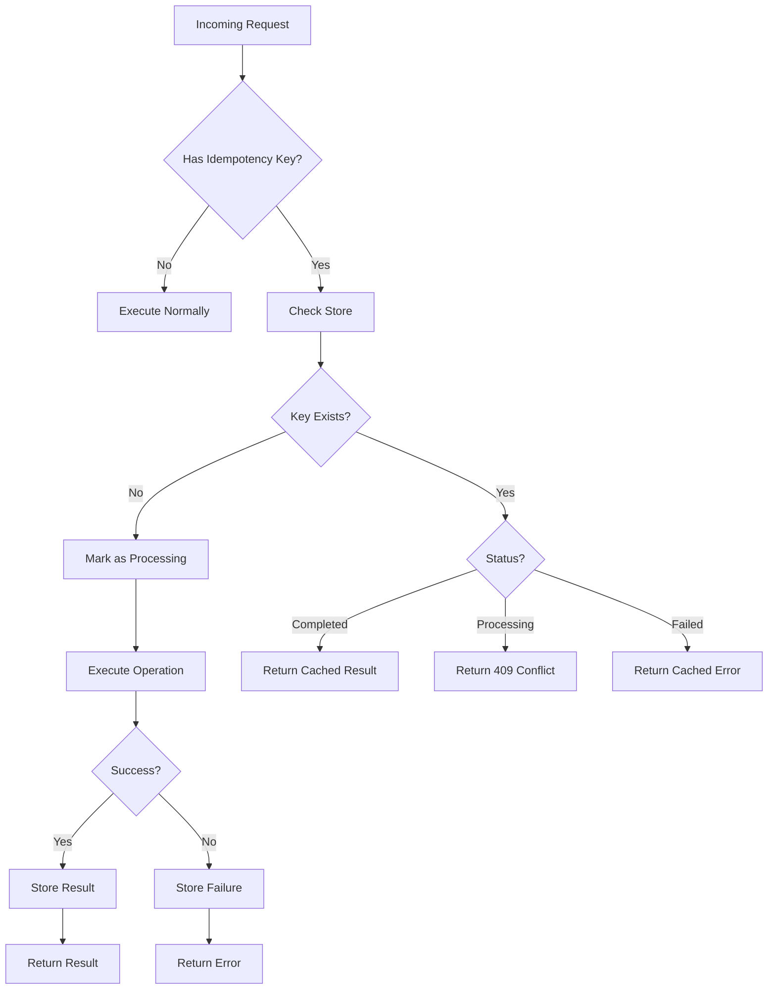
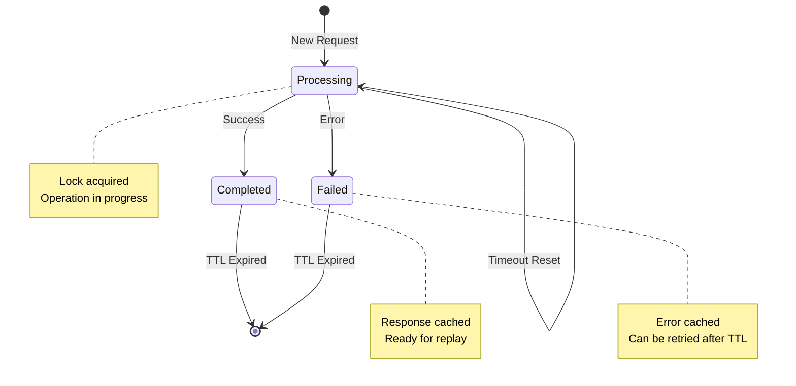

# How to Build Idempotency Implementation

Author: [nawazdhandala](https://github.com/nawazdhandala)

Tags: Idempotency, Distributed Systems, API Design, Backend Development, Reliability, Microservices

Description: A practical guide to building robust idempotency implementations for your APIs, covering database-backed storage, request fingerprinting, state machines, and production-ready patterns.

---

When a network timeout occurs and your client retries a payment request, what happens? Without proper idempotency handling, you might charge the customer twice. Idempotency ensures that no matter how many times a request is sent, the result remains the same as if it was executed once.

This post covers how to build idempotency from scratch, including storage strategies, request fingerprinting, state management, and real-world patterns you can deploy in production.

## Why Idempotency Matters

Consider this scenario: a user clicks "Place Order" and the request times out. The client retries, but the first request actually succeeded. Without idempotency, you now have two orders.



With idempotency, the retry returns the original result:



## Core Components of Idempotency

Every idempotency implementation needs these building blocks:



## Database-Backed Idempotency Store

While Redis is popular for idempotency storage, a PostgreSQL-backed solution offers durability and transactional consistency. Here is a complete implementation.

### Schema Design

The idempotency table stores request keys, status, and cached responses.

```sql
-- Create the idempotency table with proper indexes for fast lookups
CREATE TABLE idempotency_keys (
    id UUID PRIMARY KEY DEFAULT gen_random_uuid(),
    key VARCHAR(255) NOT NULL,
    -- Scope keys to specific resources (user, tenant, etc.)
    scope VARCHAR(100) NOT NULL DEFAULT 'global',
    -- Track the lifecycle: processing, completed, failed
    status VARCHAR(20) NOT NULL DEFAULT 'processing',
    -- Store the HTTP response to replay on duplicate requests
    response_code INTEGER,
    response_body JSONB,
    response_headers JSONB,
    -- Request fingerprint for validation
    request_hash VARCHAR(64),
    -- Timestamps for debugging and TTL enforcement
    created_at TIMESTAMP WITH TIME ZONE DEFAULT NOW(),
    completed_at TIMESTAMP WITH TIME ZONE,
    expires_at TIMESTAMP WITH TIME ZONE NOT NULL,
    -- Ensure uniqueness within scope
    CONSTRAINT unique_key_scope UNIQUE (key, scope)
);

-- Index for fast lookups by key and scope
CREATE INDEX idx_idempotency_key_scope ON idempotency_keys (key, scope);

-- Index for cleanup of expired records
CREATE INDEX idx_idempotency_expires ON idempotency_keys (expires_at)
    WHERE status != 'processing';

-- Index for finding stuck processing records
CREATE INDEX idx_idempotency_stuck ON idempotency_keys (created_at)
    WHERE status = 'processing';
```

### TypeScript Implementation

This implementation provides a clean interface for idempotent operations with proper error handling.

```typescript
import { Pool, PoolClient } from 'pg';
import crypto from 'crypto';

// Status enum for the idempotency record lifecycle
enum IdempotencyStatus {
    Processing = 'processing',
    Completed = 'completed',
    Failed = 'failed'
}

// Shape of a stored idempotency record
interface IdempotencyRecord {
    id: string;
    key: string;
    scope: string;
    status: IdempotencyStatus;
    responseCode: number | null;
    responseBody: Record<string, unknown> | null;
    responseHeaders: Record<string, string> | null;
    requestHash: string | null;
    createdAt: Date;
    completedAt: Date | null;
    expiresAt: Date;
}

// Result returned when checking for existing idempotency records
interface CheckResult {
    isNew: boolean;
    record: IdempotencyRecord | null;
}

// Configuration options for the idempotency store
interface IdempotencyConfig {
    // How long to keep idempotency records (default: 24 hours)
    ttlSeconds: number;
    // How long before a processing record is considered stuck (default: 60 seconds)
    processingTimeoutSeconds: number;
    // Default scope for keys (default: 'global')
    defaultScope: string;
}

const defaultConfig: IdempotencyConfig = {
    ttlSeconds: 86400,
    processingTimeoutSeconds: 60,
    defaultScope: 'global'
};

class IdempotencyStore {
    private pool: Pool;
    private config: IdempotencyConfig;

    constructor(pool: Pool, config: Partial<IdempotencyConfig> = {}) {
        this.pool = pool;
        this.config = { ...defaultConfig, ...config };
    }

    // Generate a hash of the request body for validation
    // This ensures retries have the same payload as the original
    private hashRequest(body: unknown): string {
        const content = JSON.stringify(body, Object.keys(body as object).sort());
        return crypto.createHash('sha256').update(content).digest('hex');
    }

    // Try to acquire an idempotency lock, or return existing record
    async checkAndLock(
        key: string,
        requestBody: unknown,
        scope?: string
    ): Promise<CheckResult> {
        const client = await this.pool.connect();
        const effectiveScope = scope || this.config.defaultScope;
        const requestHash = this.hashRequest(requestBody);
        const expiresAt = new Date(Date.now() + this.config.ttlSeconds * 1000);

        try {
            // Use SERIALIZABLE isolation to prevent race conditions
            await client.query('BEGIN ISOLATION LEVEL SERIALIZABLE');

            // Check for existing record
            const existing = await client.query<IdempotencyRecord>(
                `SELECT id, key, scope, status,
                        response_code as "responseCode",
                        response_body as "responseBody",
                        response_headers as "responseHeaders",
                        request_hash as "requestHash",
                        created_at as "createdAt",
                        completed_at as "completedAt",
                        expires_at as "expiresAt"
                 FROM idempotency_keys
                 WHERE key = $1 AND scope = $2 AND expires_at > NOW()
                 FOR UPDATE`,
                [key, effectiveScope]
            );

            if (existing.rows.length > 0) {
                const record = existing.rows[0];

                // Validate request hash matches original
                if (record.requestHash && record.requestHash !== requestHash) {
                    await client.query('ROLLBACK');
                    throw new IdempotencyMismatchError(
                        'Request body does not match original request'
                    );
                }

                // Check if stuck in processing
                if (record.status === IdempotencyStatus.Processing) {
                    const ageSeconds = (Date.now() - record.createdAt.getTime()) / 1000;
                    if (ageSeconds > this.config.processingTimeoutSeconds) {
                        // Reset stuck record
                        await client.query(
                            `UPDATE idempotency_keys
                             SET status = 'processing', created_at = NOW()
                             WHERE id = $1`,
                            [record.id]
                        );
                        await client.query('COMMIT');
                        return { isNew: true, record: null };
                    }
                }

                await client.query('COMMIT');
                return { isNew: false, record };
            }

            // Insert new processing record
            const result = await client.query<{ id: string }>(
                `INSERT INTO idempotency_keys
                 (key, scope, status, request_hash, expires_at)
                 VALUES ($1, $2, 'processing', $3, $4)
                 RETURNING id`,
                [key, effectiveScope, requestHash, expiresAt]
            );

            await client.query('COMMIT');
            return { isNew: true, record: null };

        } catch (error) {
            await client.query('ROLLBACK');
            throw error;
        } finally {
            client.release();
        }
    }

    // Mark the idempotency record as completed with the response
    async complete(
        key: string,
        responseCode: number,
        responseBody: Record<string, unknown>,
        responseHeaders: Record<string, string> = {},
        scope?: string
    ): Promise<void> {
        const effectiveScope = scope || this.config.defaultScope;

        await this.pool.query(
            `UPDATE idempotency_keys
             SET status = 'completed',
                 response_code = $3,
                 response_body = $4,
                 response_headers = $5,
                 completed_at = NOW()
             WHERE key = $1 AND scope = $2 AND status = 'processing'`,
            [key, effectiveScope, responseCode, responseBody, responseHeaders]
        );
    }

    // Mark the idempotency record as failed
    async fail(
        key: string,
        responseCode: number,
        errorBody: Record<string, unknown>,
        scope?: string
    ): Promise<void> {
        const effectiveScope = scope || this.config.defaultScope;

        await this.pool.query(
            `UPDATE idempotency_keys
             SET status = 'failed',
                 response_code = $3,
                 response_body = $4,
                 completed_at = NOW()
             WHERE key = $1 AND scope = $2 AND status = 'processing'`,
            [key, effectiveScope, responseCode, errorBody]
        );
    }

    // Clean up expired idempotency records
    async cleanup(): Promise<number> {
        const result = await this.pool.query(
            `DELETE FROM idempotency_keys WHERE expires_at < NOW()`
        );
        return result.rowCount || 0;
    }
}

// Custom errors for idempotency handling
class IdempotencyMismatchError extends Error {
    constructor(message: string) {
        super(message);
        this.name = 'IdempotencyMismatchError';
    }
}

class IdempotencyConflictError extends Error {
    retryAfter: number;

    constructor(message: string, retryAfter: number) {
        super(message);
        this.name = 'IdempotencyConflictError';
        this.retryAfter = retryAfter;
    }
}
```

### Express Middleware

This middleware handles idempotency transparently for your route handlers.

```typescript
import { Request, Response, NextFunction } from 'express';

// Extend Express Request to include idempotency context
declare global {
    namespace Express {
        interface Request {
            idempotencyKey?: string;
            idempotencyScope?: string;
        }
    }
}

function createIdempotencyMiddleware(store: IdempotencyStore) {
    return async (req: Request, res: Response, next: NextFunction) => {
        // Only apply to mutating methods
        if (['GET', 'HEAD', 'OPTIONS'].includes(req.method)) {
            return next();
        }

        const idempotencyKey = req.headers['idempotency-key'] as string;

        // No idempotency key provided, continue normally
        if (!idempotencyKey) {
            return next();
        }

        // Validate key format (UUID recommended)
        if (!isValidIdempotencyKey(idempotencyKey)) {
            return res.status(400).json({
                error: 'Invalid idempotency key format',
                message: 'Idempotency key must be a valid UUID'
            });
        }

        // Scope to user if authenticated
        const scope = (req as any).user?.id || 'anonymous';

        try {
            const { isNew, record } = await store.checkAndLock(
                idempotencyKey,
                req.body,
                scope
            );

            if (!isNew && record) {
                // Return cached response
                if (record.status === IdempotencyStatus.Completed) {
                    res.set('Idempotency-Replayed', 'true');
                    if (record.responseHeaders) {
                        Object.entries(record.responseHeaders).forEach(([k, v]) => {
                            res.set(k, v);
                        });
                    }
                    return res.status(record.responseCode || 200).json(record.responseBody);
                }

                // Still processing
                if (record.status === IdempotencyStatus.Processing) {
                    res.set('Retry-After', '5');
                    return res.status(409).json({
                        error: 'Conflict',
                        message: 'Request is currently being processed'
                    });
                }

                // Previous request failed
                if (record.status === IdempotencyStatus.Failed) {
                    return res.status(record.responseCode || 500).json(record.responseBody);
                }
            }

            // Store context for later
            req.idempotencyKey = idempotencyKey;
            req.idempotencyScope = scope;

            // Intercept response to cache it
            const originalJson = res.json.bind(res);
            res.json = function(body: any) {
                // Store successful response
                if (res.statusCode >= 200 && res.statusCode < 400) {
                    store.complete(
                        idempotencyKey,
                        res.statusCode,
                        body,
                        {},
                        scope
                    ).catch(console.error);
                } else {
                    store.fail(
                        idempotencyKey,
                        res.statusCode,
                        body,
                        scope
                    ).catch(console.error);
                }
                return originalJson(body);
            };

            next();

        } catch (error) {
            if (error instanceof IdempotencyMismatchError) {
                return res.status(422).json({
                    error: 'Unprocessable Entity',
                    message: error.message
                });
            }
            next(error);
        }
    };
}

function isValidIdempotencyKey(key: string): boolean {
    // UUID v4 format
    const uuidRegex = /^[0-9a-f]{8}-[0-9a-f]{4}-4[0-9a-f]{3}-[89ab][0-9a-f]{3}-[0-9a-f]{12}$/i;
    return uuidRegex.test(key);
}
```

## Request Fingerprinting

Validating that retried requests match the original prevents subtle bugs where clients accidentally send different payloads with the same idempotency key.

```typescript
// Advanced request fingerprinting that handles nested objects and arrays
class RequestFingerprint {
    // Generate a stable hash regardless of key ordering
    static generate(
        method: string,
        path: string,
        body: unknown,
        significantHeaders: string[] = []
    ): string {
        const content = {
            method: method.toUpperCase(),
            path: this.normalizePath(path),
            body: this.normalizeBody(body),
            headers: significantHeaders.sort()
        };

        return crypto
            .createHash('sha256')
            .update(JSON.stringify(content))
            .digest('hex');
    }

    // Normalize path by removing trailing slashes and query params
    private static normalizePath(path: string): string {
        const url = new URL(path, 'http://localhost');
        return url.pathname.replace(/\/+$/, '');
    }

    // Recursively sort object keys for consistent hashing
    private static normalizeBody(value: unknown): unknown {
        if (value === null || value === undefined) {
            return null;
        }

        if (Array.isArray(value)) {
            return value.map(item => this.normalizeBody(item));
        }

        if (typeof value === 'object') {
            const sorted: Record<string, unknown> = {};
            Object.keys(value as object)
                .sort()
                .forEach(key => {
                    sorted[key] = this.normalizeBody((value as Record<string, unknown>)[key]);
                });
            return sorted;
        }

        return value;
    }

    // Compare two requests to see if they match
    static matches(
        fingerprint1: string,
        fingerprint2: string
    ): boolean {
        // Use timing-safe comparison to prevent timing attacks
        return crypto.timingSafeEqual(
            Buffer.from(fingerprint1),
            Buffer.from(fingerprint2)
        );
    }
}
```

## Idempotency State Machine

Managing the state transitions correctly is critical for reliability.



Here is the state machine implementation.

```typescript
// State machine for idempotency record transitions
class IdempotencyStateMachine {
    private static validTransitions: Record<IdempotencyStatus, IdempotencyStatus[]> = {
        [IdempotencyStatus.Processing]: [
            IdempotencyStatus.Completed,
            IdempotencyStatus.Failed,
            IdempotencyStatus.Processing // timeout reset
        ],
        [IdempotencyStatus.Completed]: [],
        [IdempotencyStatus.Failed]: []
    };

    static canTransition(from: IdempotencyStatus, to: IdempotencyStatus): boolean {
        return this.validTransitions[from].includes(to);
    }

    static transition(
        record: IdempotencyRecord,
        to: IdempotencyStatus,
        data?: Partial<IdempotencyRecord>
    ): IdempotencyRecord {
        if (!this.canTransition(record.status, to)) {
            throw new InvalidStateTransitionError(
                `Cannot transition from ${record.status} to ${to}`
            );
        }

        return {
            ...record,
            ...data,
            status: to,
            completedAt: to !== IdempotencyStatus.Processing ? new Date() : null
        };
    }
}

class InvalidStateTransitionError extends Error {
    constructor(message: string) {
        super(message);
        this.name = 'InvalidStateTransitionError';
    }
}
```

## Handling Edge Cases

### Concurrent Duplicate Requests

When two identical requests arrive at the same time, only one should execute.

```typescript
// Distributed lock with exponential backoff for concurrent requests
async function withIdempotencyLock<T>(
    store: IdempotencyStore,
    key: string,
    body: unknown,
    operation: () => Promise<T>,
    maxRetries: number = 3
): Promise<{ result: T; wasReplayed: boolean }> {
    let attempt = 0;

    while (attempt < maxRetries) {
        const { isNew, record } = await store.checkAndLock(key, body);

        if (isNew) {
            // We have the lock, execute the operation
            try {
                const result = await operation();
                return { result, wasReplayed: false };
            } catch (error) {
                // Let the store handle failure recording
                throw error;
            }
        }

        if (record) {
            if (record.status === IdempotencyStatus.Completed) {
                return {
                    result: record.responseBody as T,
                    wasReplayed: true
                };
            }

            if (record.status === IdempotencyStatus.Processing) {
                // Wait and retry with exponential backoff
                const delay = Math.min(100 * Math.pow(2, attempt), 2000);
                await sleep(delay);
                attempt++;
                continue;
            }

            if (record.status === IdempotencyStatus.Failed) {
                throw new Error(
                    `Previous request failed: ${JSON.stringify(record.responseBody)}`
                );
            }
        }
    }

    throw new Error('Failed to acquire idempotency lock after max retries');
}

function sleep(ms: number): Promise<void> {
    return new Promise(resolve => setTimeout(resolve, ms));
}
```

### Partial Failures and Cleanup

When operations fail midway, you need proper cleanup.

```typescript
// Transaction wrapper that handles partial failures
async function executeIdempotent<T>(
    pool: Pool,
    store: IdempotencyStore,
    key: string,
    body: unknown,
    operation: (client: PoolClient) => Promise<T>
): Promise<T> {
    const { isNew, record } = await store.checkAndLock(key, body);

    if (!isNew && record?.status === IdempotencyStatus.Completed) {
        return record.responseBody as T;
    }

    const client = await pool.connect();

    try {
        await client.query('BEGIN');

        const result = await operation(client);

        // Store result before committing
        await store.complete(key, 200, result as Record<string, unknown>);

        await client.query('COMMIT');
        return result;

    } catch (error) {
        await client.query('ROLLBACK');
        await store.fail(key, 500, { error: (error as Error).message });
        throw error;

    } finally {
        client.release();
    }
}

// Usage example with order creation
async function createOrder(
    pool: Pool,
    store: IdempotencyStore,
    idempotencyKey: string,
    orderData: { userId: string; items: any[] }
) {
    return executeIdempotent(
        pool,
        store,
        idempotencyKey,
        orderData,
        async (client) => {
            // Insert order
            const orderResult = await client.query(
                `INSERT INTO orders (user_id, status, created_at)
                 VALUES ($1, 'pending', NOW())
                 RETURNING id`,
                [orderData.userId]
            );
            const orderId = orderResult.rows[0].id;

            // Insert order items
            for (const item of orderData.items) {
                await client.query(
                    `INSERT INTO order_items (order_id, product_id, quantity, price)
                     VALUES ($1, $2, $3, $4)`,
                    [orderId, item.productId, item.quantity, item.price]
                );
            }

            // Reserve inventory
            for (const item of orderData.items) {
                await client.query(
                    `UPDATE inventory
                     SET reserved = reserved + $2
                     WHERE product_id = $1 AND available >= $2`,
                    [item.productId, item.quantity]
                );
            }

            return {
                orderId,
                items: orderData.items.length,
                status: 'pending'
            };
        }
    );
}
```

## Production Patterns

### Key Generation Strategies

Different use cases need different key generation approaches.

```typescript
// Collection of idempotency key generation strategies
const IdempotencyKeyStrategies = {
    // Client-provided UUID (recommended for most cases)
    clientProvided: (req: Request): string | undefined => {
        return req.headers['idempotency-key'] as string;
    },

    // Derived from request content (for internal services)
    contentBased: (req: Request): string => {
        const content = `${req.method}:${req.path}:${JSON.stringify(req.body)}`;
        return crypto.createHash('sha256').update(content).digest('hex');
    },

    // Scoped to user and action (for user-initiated actions)
    userScoped: (req: Request, action: string): string => {
        const userId = (req as any).user?.id || 'anonymous';
        const key = req.headers['idempotency-key'] as string;
        return `${userId}:${action}:${key}`;
    },

    // Time-windowed (prevent rapid duplicate submissions)
    timeWindowed: (req: Request, windowMinutes: number = 5): string => {
        const userId = (req as any).user?.id || 'anonymous';
        const window = Math.floor(Date.now() / (windowMinutes * 60 * 1000));
        const content = `${userId}:${req.path}:${JSON.stringify(req.body)}`;
        const hash = crypto.createHash('sha256').update(content).digest('hex').slice(0, 16);
        return `${window}:${hash}`;
    }
};
```

### Monitoring and Observability

Track idempotency behavior in production.

```typescript
// Metrics for monitoring idempotency behavior
interface IdempotencyMetrics {
    recordNewRequest(key: string, scope: string): void;
    recordCacheHit(key: string, scope: string): void;
    recordCacheMiss(key: string, scope: string): void;
    recordConflict(key: string, scope: string): void;
    recordMismatch(key: string, scope: string): void;
    recordExpired(count: number): void;
}

class PrometheusIdempotencyMetrics implements IdempotencyMetrics {
    private requests: Map<string, number> = new Map();
    private cacheHits: Map<string, number> = new Map();
    private conflicts: Map<string, number> = new Map();

    recordNewRequest(key: string, scope: string): void {
        this.increment('idempotency_requests_total', { scope, type: 'new' });
    }

    recordCacheHit(key: string, scope: string): void {
        this.increment('idempotency_requests_total', { scope, type: 'cache_hit' });
    }

    recordCacheMiss(key: string, scope: string): void {
        this.increment('idempotency_requests_total', { scope, type: 'cache_miss' });
    }

    recordConflict(key: string, scope: string): void {
        this.increment('idempotency_conflicts_total', { scope });
    }

    recordMismatch(key: string, scope: string): void {
        this.increment('idempotency_mismatches_total', { scope });
    }

    recordExpired(count: number): void {
        this.increment('idempotency_expired_total', {}, count);
    }

    private increment(
        metric: string,
        labels: Record<string, string>,
        value: number = 1
    ): void {
        const key = `${metric}:${JSON.stringify(labels)}`;
        this.requests.set(key, (this.requests.get(key) || 0) + value);
        // In real implementation, use prom-client or similar
        console.log(`METRIC ${metric} ${JSON.stringify(labels)} +${value}`);
    }
}
```

### TTL Considerations

Different operations need different TTL values.

```typescript
// TTL configurations for different operation types
const TTLPresets = {
    // Payments: Keep for 7 days for dispute resolution
    payment: 7 * 24 * 60 * 60,

    // Order creation: Keep for 24 hours
    order: 24 * 60 * 60,

    // Email sending: Keep for 1 hour (prevent spam)
    email: 60 * 60,

    // API calls: Keep for 5 minutes
    api: 5 * 60,

    // Webhook delivery: Keep for 7 days for retry tracking
    webhook: 7 * 24 * 60 * 60
};

// Factory for creating scoped idempotency stores
function createScopedStore(
    pool: Pool,
    operationType: keyof typeof TTLPresets
): IdempotencyStore {
    return new IdempotencyStore(pool, {
        ttlSeconds: TTLPresets[operationType],
        defaultScope: operationType
    });
}
```

## Testing Idempotency

Write tests that verify your idempotency implementation handles all cases.

```typescript
import { describe, it, expect, beforeEach } from 'vitest';

describe('IdempotencyStore', () => {
    let store: IdempotencyStore;
    let pool: Pool;

    beforeEach(async () => {
        pool = new Pool({ connectionString: process.env.TEST_DATABASE_URL });
        store = new IdempotencyStore(pool);
        await pool.query('DELETE FROM idempotency_keys');
    });

    it('should return isNew=true for first request', async () => {
        const { isNew, record } = await store.checkAndLock(
            'test-key-1',
            { amount: 100 }
        );

        expect(isNew).toBe(true);
        expect(record).toBeNull();
    });

    it('should return cached result for duplicate request', async () => {
        const key = 'test-key-2';
        const body = { amount: 100 };

        // First request
        await store.checkAndLock(key, body);
        await store.complete(key, 200, { orderId: '123' });

        // Duplicate request
        const { isNew, record } = await store.checkAndLock(key, body);

        expect(isNew).toBe(false);
        expect(record?.status).toBe(IdempotencyStatus.Completed);
        expect(record?.responseBody).toEqual({ orderId: '123' });
    });

    it('should reject mismatched request body', async () => {
        const key = 'test-key-3';

        await store.checkAndLock(key, { amount: 100 });
        await store.complete(key, 200, { orderId: '123' });

        // Different body with same key
        await expect(
            store.checkAndLock(key, { amount: 200 })
        ).rejects.toThrow(IdempotencyMismatchError);
    });

    it('should handle concurrent requests', async () => {
        const key = 'test-key-4';
        const body = { amount: 100 };

        // Simulate concurrent requests
        const [result1, result2] = await Promise.all([
            store.checkAndLock(key, body),
            store.checkAndLock(key, body)
        ]);

        // One should get the lock, one should see processing
        const newCount = [result1, result2].filter(r => r.isNew).length;
        expect(newCount).toBe(1);
    });

    it('should reset stuck processing records', async () => {
        const key = 'test-key-5';
        const body = { amount: 100 };

        // Create a stuck record (would normally happen due to crash)
        await pool.query(
            `INSERT INTO idempotency_keys
             (key, scope, status, request_hash, expires_at, created_at)
             VALUES ($1, 'global', 'processing', $2, NOW() + INTERVAL '1 day', NOW() - INTERVAL '2 minutes')`,
            [key, RequestFingerprint.generate('POST', '/test', body)]
        );

        // Should reset and allow new processing
        const { isNew } = await store.checkAndLock(key, body);
        expect(isNew).toBe(true);
    });
});
```

## Conclusion

Building robust idempotency requires careful attention to state management, concurrent access, and failure handling. The key takeaways are:

1. Use database transactions or atomic operations to prevent race conditions
2. Always validate request fingerprints to catch mismatched retries
3. Handle stuck processing records with timeout resets
4. Choose appropriate TTLs based on your use case
5. Monitor idempotency behavior in production
6. Test edge cases thoroughly, especially concurrent access

With these patterns in place, your APIs will safely handle retries, network failures, and duplicate requests without causing unintended side effects.
