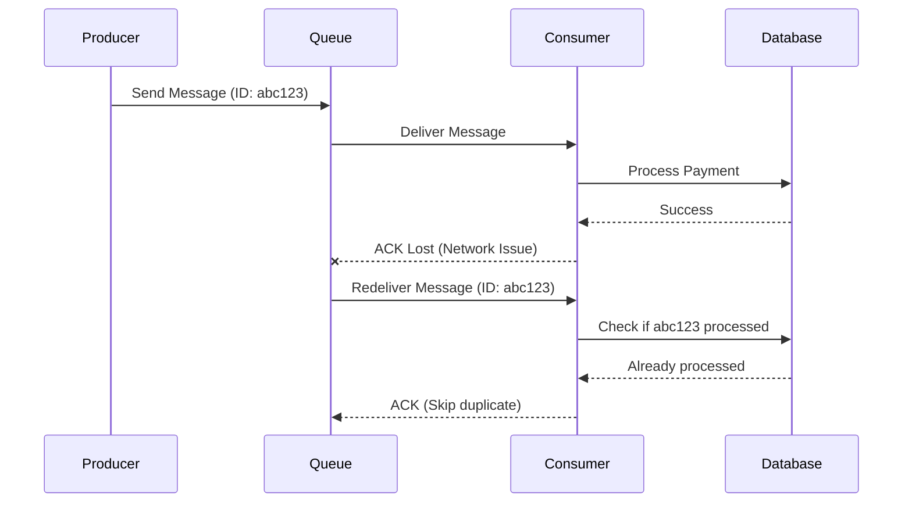
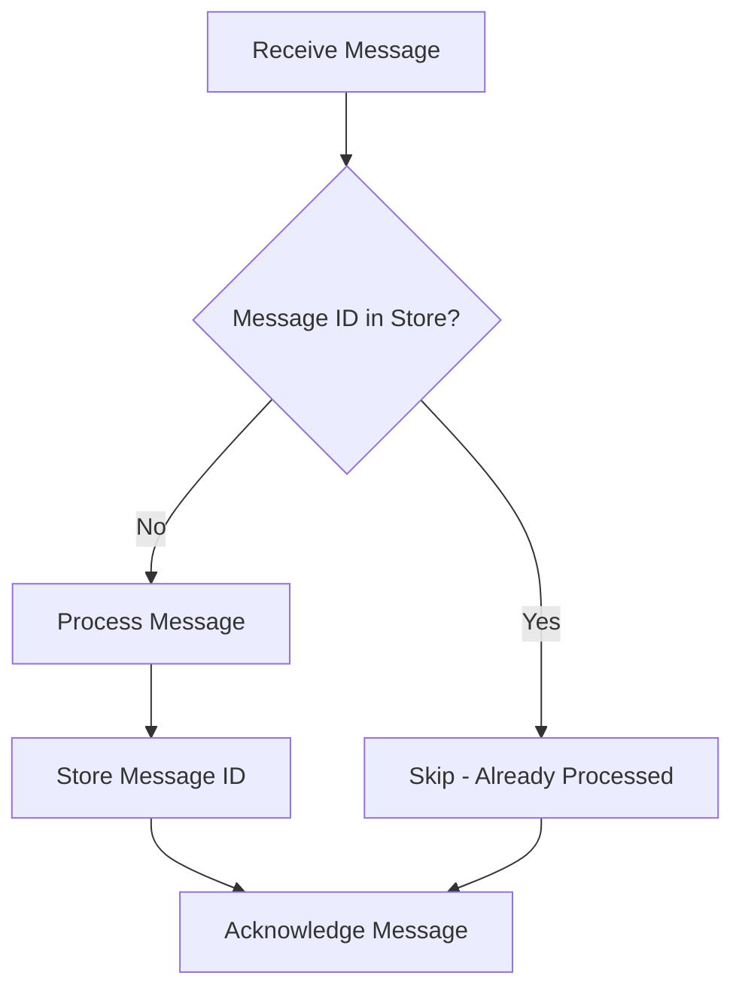
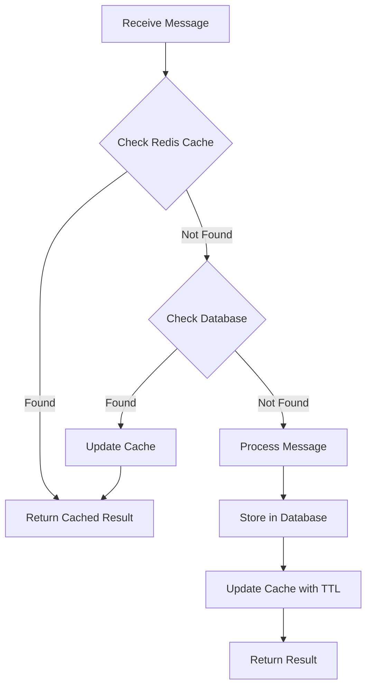
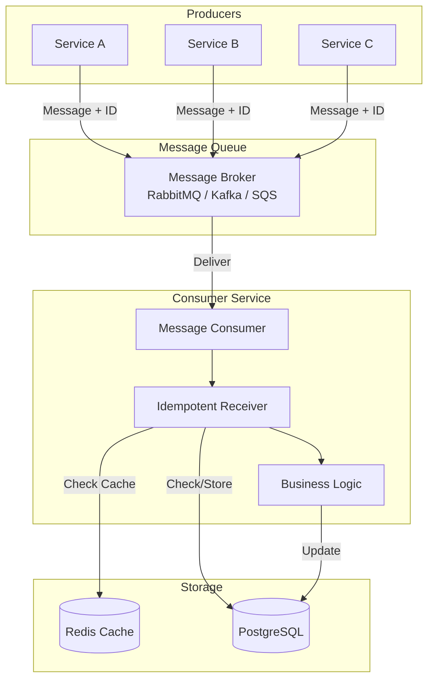
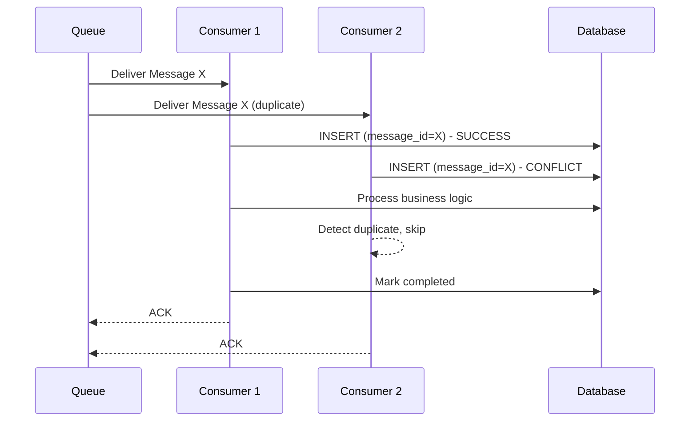

# How to Implement Idempotent Receiver

Author: [nawazdhandala](https://github.com/nawazdhandala)

Tags: Message Queues, Design Patterns, Reliability, Backend

Description: Learn how to implement idempotent message receivers for safe message reprocessing.

---

## Introduction

In distributed systems, message queues are essential for decoupling services and ensuring reliable communication. However, network failures, timeouts, and retries can cause messages to be delivered more than once. The **Idempotent Receiver** pattern ensures that processing the same message multiple times produces the same result as processing it once.

This pattern is critical for building reliable, fault-tolerant systems where duplicate message delivery is possible or even expected.

## Why Idempotency Matters

Consider a payment processing system. If a "charge customer $100" message is processed twice due to a retry, the customer gets charged $200 instead of $100. This is a catastrophic failure that idempotency prevents.



## Core Concepts

### What Makes a Receiver Idempotent?

An idempotent receiver guarantees that:

1. Each unique message is processed exactly once
2. Duplicate messages are detected and safely ignored
3. The system state remains consistent regardless of delivery count

### Message Identification

Every message needs a unique identifier. This can be:

- A UUID generated by the producer
- A natural business key (e.g., order ID + operation type)
- A hash of the message content

## Deduplication Strategies

There are several approaches to implementing idempotent receivers, each with different trade-offs.

### Strategy 1: Message ID Tracking

The simplest approach is to track processed message IDs in a persistent store.



### Strategy 2: Idempotency Keys with TTL

For high-throughput systems, use a cache with time-to-live (TTL) for recent message IDs.



### Strategy 3: Optimistic Locking with Version Numbers

Use database constraints to prevent duplicate processing.

## Database-Based Idempotency Implementation

Let us implement a robust, database-backed idempotent receiver in TypeScript.

### Database Schema

First, create a table to track processed messages:

```sql
-- Table to store processed message records
-- This ensures we can detect and reject duplicates
CREATE TABLE processed_messages (
    -- Unique identifier for the message
    message_id VARCHAR(255) PRIMARY KEY,

    -- Type of message for categorization
    message_type VARCHAR(100) NOT NULL,

    -- When the message was first processed
    processed_at TIMESTAMP NOT NULL DEFAULT CURRENT_TIMESTAMP,

    -- Result of processing (for returning to duplicate requests)
    result_payload JSONB,

    -- Status: 'processing', 'completed', 'failed'
    status VARCHAR(20) NOT NULL DEFAULT 'processing',

    -- For cleanup of old records
    expires_at TIMESTAMP NOT NULL
);

-- Index for efficient lookups by message type
CREATE INDEX idx_processed_messages_type ON processed_messages(message_type);

-- Index for cleanup job to remove expired records
CREATE INDEX idx_processed_messages_expires ON processed_messages(expires_at);
```

### TypeScript Implementation

Here is a complete implementation of an idempotent message receiver:

```typescript
// idempotent-receiver.ts
// A robust implementation of the Idempotent Receiver pattern

import { Pool, PoolClient } from 'pg';

// Configuration for the idempotent receiver
interface IdempotentReceiverConfig {
    // PostgreSQL connection pool
    pool: Pool;

    // How long to keep processed message records (in seconds)
    retentionPeriodSeconds: number;

    // Optional logger for debugging
    logger?: Logger;
}

// Structure of a message to be processed
interface Message<T = unknown> {
    // Unique identifier for this message
    id: string;

    // Type of message for routing and categorization
    type: string;

    // The actual message payload
    payload: T;

    // Optional metadata
    metadata?: Record<string, unknown>;
}

// Result of processing a message
interface ProcessingResult<R = unknown> {
    // Whether this was a new message or a duplicate
    isDuplicate: boolean;

    // The result of processing (or cached result for duplicates)
    result: R;

    // The message ID that was processed
    messageId: string;
}

// Logger interface for flexibility
interface Logger {
    info(message: string, context?: Record<string, unknown>): void;
    warn(message: string, context?: Record<string, unknown>): void;
    error(message: string, context?: Record<string, unknown>): void;
}

// The main idempotent receiver class
class IdempotentReceiver {
    private pool: Pool;
    private retentionPeriodSeconds: number;
    private logger: Logger;

    constructor(config: IdempotentReceiverConfig) {
        this.pool = config.pool;
        this.retentionPeriodSeconds = config.retentionPeriodSeconds;

        // Use provided logger or create a no-op logger
        this.logger = config.logger || {
            info: () => {},
            warn: () => {},
            error: () => {},
        };
    }

    // Process a message with idempotency guarantees
    // The handler function contains your actual business logic
    async processMessage<T, R>(
        message: Message<T>,
        handler: (payload: T, client: PoolClient) => Promise<R>
    ): Promise<ProcessingResult<R>> {
        const client = await this.pool.connect();

        try {
            // Start a transaction for atomicity
            await client.query('BEGIN');

            // Try to acquire a lock on this message ID
            // This prevents race conditions with concurrent duplicates
            const lockResult = await this.tryAcquireLock(client, message);

            if (lockResult.alreadyProcessed) {
                // Message was already processed, return cached result
                await client.query('ROLLBACK');

                this.logger.info('Duplicate message detected', {
                    messageId: message.id,
                    messageType: message.type,
                });

                return {
                    isDuplicate: true,
                    result: lockResult.cachedResult as R,
                    messageId: message.id,
                };
            }

            // Message is new, process it
            this.logger.info('Processing new message', {
                messageId: message.id,
                messageType: message.type,
            });

            try {
                // Execute the actual business logic
                const result = await handler(message.payload, client);

                // Mark the message as successfully processed
                await this.markAsCompleted(client, message.id, result);

                // Commit the transaction
                await client.query('COMMIT');

                this.logger.info('Message processed successfully', {
                    messageId: message.id,
                    messageType: message.type,
                });

                return {
                    isDuplicate: false,
                    result,
                    messageId: message.id,
                };
            } catch (processingError) {
                // Processing failed, mark as failed and rethrow
                await this.markAsFailed(client, message.id);
                await client.query('COMMIT');
                throw processingError;
            }
        } catch (error) {
            // Something went wrong, rollback the transaction
            await client.query('ROLLBACK');

            this.logger.error('Error processing message', {
                messageId: message.id,
                error: error instanceof Error ? error.message : 'Unknown error',
            });

            throw error;
        } finally {
            // Always release the client back to the pool
            client.release();
        }
    }

    // Try to acquire a processing lock for a message
    // Returns whether the message was already processed
    private async tryAcquireLock(
        client: PoolClient,
        message: Message
    ): Promise<{ alreadyProcessed: boolean; cachedResult?: unknown }> {
        // Calculate expiration time for this record
        const expiresAt = new Date(
            Date.now() + this.retentionPeriodSeconds * 1000
        );

        // Try to insert a new record for this message
        // ON CONFLICT handles the case where the message already exists
        const insertQuery = `
            INSERT INTO processed_messages (
                message_id,
                message_type,
                status,
                expires_at
            ) VALUES ($1, $2, 'processing', $3)
            ON CONFLICT (message_id) DO NOTHING
            RETURNING message_id
        `;

        const insertResult = await client.query(insertQuery, [
            message.id,
            message.type,
            expiresAt,
        ]);

        // If we inserted a row, we have the lock
        if (insertResult.rowCount && insertResult.rowCount > 0) {
            return { alreadyProcessed: false };
        }

        // Row already exists, check its status
        const selectQuery = `
            SELECT status, result_payload
            FROM processed_messages
            WHERE message_id = $1
            FOR UPDATE
        `;

        const selectResult = await client.query(selectQuery, [message.id]);
        const existingRecord = selectResult.rows[0];

        if (!existingRecord) {
            // Race condition: record was deleted between INSERT and SELECT
            // This is rare but possible, retry the insert
            return this.tryAcquireLock(client, message);
        }

        if (existingRecord.status === 'completed') {
            // Message was already successfully processed
            return {
                alreadyProcessed: true,
                cachedResult: existingRecord.result_payload,
            };
        }

        if (existingRecord.status === 'failed') {
            // Previous attempt failed, allow retry
            // Update the record to 'processing' status
            await client.query(
                `UPDATE processed_messages
                 SET status = 'processing', processed_at = CURRENT_TIMESTAMP
                 WHERE message_id = $1`,
                [message.id]
            );
            return { alreadyProcessed: false };
        }

        // Status is 'processing', another instance is handling this message
        // Treat as duplicate to avoid concurrent processing
        return { alreadyProcessed: true, cachedResult: null };
    }

    // Mark a message as successfully processed
    private async markAsCompleted(
        client: PoolClient,
        messageId: string,
        result: unknown
    ): Promise<void> {
        const query = `
            UPDATE processed_messages
            SET status = 'completed',
                result_payload = $2
            WHERE message_id = $1
        `;

        await client.query(query, [messageId, JSON.stringify(result)]);
    }

    // Mark a message as failed
    private async markAsFailed(
        client: PoolClient,
        messageId: string
    ): Promise<void> {
        const query = `
            UPDATE processed_messages
            SET status = 'failed'
            WHERE message_id = $1
        `;

        await client.query(query, [messageId]);
    }

    // Cleanup expired records to prevent unbounded growth
    // Run this periodically via a cron job or scheduler
    async cleanupExpiredRecords(): Promise<number> {
        const query = `
            DELETE FROM processed_messages
            WHERE expires_at < CURRENT_TIMESTAMP
        `;

        const result = await this.pool.query(query);
        const deletedCount = result.rowCount || 0;

        this.logger.info('Cleaned up expired records', {
            deletedCount,
        });

        return deletedCount;
    }
}

export { IdempotentReceiver, IdempotentReceiverConfig, Message, ProcessingResult };
```

### Usage Example

Here is how to use the idempotent receiver in a real application:

```typescript
// example-usage.ts
// Demonstrates how to use the IdempotentReceiver in practice

import { Pool } from 'pg';
import { IdempotentReceiver, Message } from './idempotent-receiver';

// Create a PostgreSQL connection pool
const pool = new Pool({
    host: 'localhost',
    port: 5432,
    database: 'myapp',
    user: 'myuser',
    password: 'mypassword',
    max: 20, // Maximum number of connections in the pool
});

// Create the idempotent receiver instance
const receiver = new IdempotentReceiver({
    pool,
    retentionPeriodSeconds: 7 * 24 * 60 * 60, // Keep records for 7 days
    logger: console, // Use console for logging in this example
});

// Define the structure of a payment message
interface PaymentPayload {
    customerId: string;
    amount: number;
    currency: string;
    description: string;
}

// Define the structure of a payment result
interface PaymentResult {
    transactionId: string;
    status: 'success' | 'failed';
    processedAt: string;
}

// Function to handle incoming payment messages
async function handlePaymentMessage(rawMessage: unknown): Promise<void> {
    // Parse the incoming message
    const message: Message<PaymentPayload> = {
        id: (rawMessage as any).messageId,
        type: 'payment',
        payload: (rawMessage as any).data,
    };

    // Process the message with idempotency
    const result = await receiver.processMessage<PaymentPayload, PaymentResult>(
        message,
        async (payload, dbClient) => {
            // This is where your actual business logic goes
            // The dbClient is part of the same transaction as the idempotency check

            // Example: Create a payment record in the database
            const insertResult = await dbClient.query(
                `INSERT INTO payments (customer_id, amount, currency, description, created_at)
                 VALUES ($1, $2, $3, $4, CURRENT_TIMESTAMP)
                 RETURNING id`,
                [payload.customerId, payload.amount, payload.currency, payload.description]
            );

            const transactionId = insertResult.rows[0].id;

            // Example: Call external payment gateway
            // await paymentGateway.charge(payload);

            // Return the result (this gets cached for duplicate detection)
            return {
                transactionId,
                status: 'success' as const,
                processedAt: new Date().toISOString(),
            };
        }
    );

    if (result.isDuplicate) {
        console.log(`Duplicate payment message ${message.id} was safely ignored`);
    } else {
        console.log(`Payment ${result.result.transactionId} processed successfully`);
    }
}

// Example: Processing messages from a queue
async function startMessageConsumer(): Promise<void> {
    // This is pseudocode for a message queue consumer
    // Replace with your actual queue library (RabbitMQ, SQS, Kafka, etc.)

    const queue = {
        consume: async (handler: (msg: unknown) => Promise<void>) => {
            // Simulated message consumption
            const mockMessage = {
                messageId: 'payment-12345',
                data: {
                    customerId: 'cust-001',
                    amount: 99.99,
                    currency: 'USD',
                    description: 'Monthly subscription',
                },
            };
            await handler(mockMessage);
        },
    };

    await queue.consume(async (msg) => {
        try {
            await handlePaymentMessage(msg);
        } catch (error) {
            console.error('Failed to process message:', error);
            // Implement your retry or dead-letter logic here
        }
    });
}

// Start the consumer
startMessageConsumer().catch(console.error);
```

## Adding Redis Caching for Performance

For high-throughput systems, adding a Redis cache layer improves performance by avoiding database lookups for recent duplicates:

```typescript
// redis-cached-receiver.ts
// Adds Redis caching to the idempotent receiver for better performance

import { createClient, RedisClientType } from 'redis';
import { Pool, PoolClient } from 'pg';

interface CachedReceiverConfig {
    pool: Pool;
    redisClient: RedisClientType;
    retentionPeriodSeconds: number;
    cacheTtlSeconds: number; // How long to cache in Redis
}

class RedisCachedIdempotentReceiver {
    private pool: Pool;
    private redis: RedisClientType;
    private retentionPeriodSeconds: number;
    private cacheTtlSeconds: number;

    constructor(config: CachedReceiverConfig) {
        this.pool = config.pool;
        this.redis = config.redisClient;
        this.retentionPeriodSeconds = config.retentionPeriodSeconds;
        this.cacheTtlSeconds = config.cacheTtlSeconds;
    }

    // Generate a cache key for a message ID
    private getCacheKey(messageId: string): string {
        return `idempotency:${messageId}`;
    }

    async processMessage<T, R>(
        messageId: string,
        messageType: string,
        payload: T,
        handler: (payload: T, client: PoolClient) => Promise<R>
    ): Promise<{ isDuplicate: boolean; result: R }> {
        const cacheKey = this.getCacheKey(messageId);

        // Step 1: Check Redis cache first (fastest path)
        const cachedResult = await this.redis.get(cacheKey);

        if (cachedResult) {
            // Found in cache, this is a duplicate
            return {
                isDuplicate: true,
                result: JSON.parse(cachedResult) as R,
            };
        }

        // Step 2: Not in cache, check database and process
        const client = await this.pool.connect();

        try {
            await client.query('BEGIN');

            // Try to insert the idempotency record
            const expiresAt = new Date(
                Date.now() + this.retentionPeriodSeconds * 1000
            );

            const insertResult = await client.query(
                `INSERT INTO processed_messages (message_id, message_type, status, expires_at)
                 VALUES ($1, $2, 'processing', $3)
                 ON CONFLICT (message_id) DO NOTHING
                 RETURNING message_id`,
                [messageId, messageType, expiresAt]
            );

            if (insertResult.rowCount === 0) {
                // Record exists, check if completed
                const existing = await client.query(
                    `SELECT status, result_payload FROM processed_messages WHERE message_id = $1`,
                    [messageId]
                );

                if (existing.rows[0]?.status === 'completed') {
                    await client.query('ROLLBACK');

                    const result = existing.rows[0].result_payload as R;

                    // Update Redis cache for future lookups
                    await this.redis.setEx(
                        cacheKey,
                        this.cacheTtlSeconds,
                        JSON.stringify(result)
                    );

                    return { isDuplicate: true, result };
                }
            }

            // Process the message
            const result = await handler(payload, client);

            // Update the record with the result
            await client.query(
                `UPDATE processed_messages
                 SET status = 'completed', result_payload = $2
                 WHERE message_id = $1`,
                [messageId, JSON.stringify(result)]
            );

            await client.query('COMMIT');

            // Cache the result in Redis
            await this.redis.setEx(
                cacheKey,
                this.cacheTtlSeconds,
                JSON.stringify(result)
            );

            return { isDuplicate: false, result };
        } catch (error) {
            await client.query('ROLLBACK');
            throw error;
        } finally {
            client.release();
        }
    }
}

export { RedisCachedIdempotentReceiver, CachedReceiverConfig };
```

## Architecture Overview

Here is a complete view of how the idempotent receiver fits into a message processing system:



## Message ID Tracking Patterns

Different systems require different approaches to message ID tracking. Here are common patterns:

### Content-Based Deduplication

When the producer does not generate unique IDs, derive them from the message content:

```typescript
// content-based-id.ts
// Generate deterministic IDs from message content

import crypto from 'crypto';

// Generate a deterministic ID from message content
// This ensures the same message always produces the same ID
function generateContentBasedId(message: unknown): string {
    // Stringify the message to create a consistent representation
    const content = JSON.stringify(message);

    // Create a SHA-256 hash of the content
    return crypto.createHash('sha256').update(content).digest('hex');
}

// Usage example
const messageId = generateContentBasedId({
    orderId: 'order-123',
    action: 'process-payment',
    amount: 100,
});
// Result: a consistent hash like "a1b2c3d4e5f6..."
```

### Composite Keys

Combine multiple fields to create a unique identifier:

```typescript
// composite-key.ts
// Create unique IDs by combining multiple fields

// Composite key pattern for order operations
// This creates human-readable IDs that encode business meaning
function createOrderMessageId(
    orderId: string,
    operation: string,
    version: number
): string {
    return `${orderId}:${operation}:v${version}`;
}

// Example usage
const messageId = createOrderMessageId('order-123', 'charge', 1);
// Result: "order-123:charge:v1"

// This allows you to:
// 1. Process the same order for different operations
// 2. Retry an operation with a new version number
// 3. Debug issues by parsing the message ID
```

### Time-Windowed Deduplication

For systems where exact-once is not required, use time windows:

```typescript
// time-windowed-id.ts
// Generate IDs with time window buckets

// Generate ID with time window (hourly buckets)
// Messages in different hours are considered distinct
function createTimeWindowedId(baseId: string): string {
    // Calculate the current hour bucket
    const hourBucket = Math.floor(Date.now() / (60 * 60 * 1000));
    return `${baseId}:${hourBucket}`;
}

// This is useful for:
// - Rate limiting per time window
// - Aggregating events by time period
// - Allowing intentional reprocessing after window expires
```

## Handling Edge Cases

### Concurrent Duplicate Delivery

When two instances receive the same message simultaneously, only one should process it:



### Failed Processing Recovery

When processing fails mid-way, implement retry with exponential backoff:

```typescript
// retry-handler.ts
// Retry failed messages with exponential backoff

// The status field enables retry of failed messages
async function processWithRetry(
    receiver: IdempotentReceiver,
    message: Message<unknown>,
    maxRetries: number = 3
): Promise<void> {
    let lastError: Error | undefined;

    for (let attempt = 1; attempt <= maxRetries; attempt++) {
        try {
            await receiver.processMessage(message, async (payload, client) => {
                // Your business logic here
                return processPayload(payload, client);
            });
            return; // Success, exit the retry loop
        } catch (error) {
            lastError = error as Error;
            console.warn(`Attempt ${attempt} failed:`, error);

            // Wait before retry with exponential backoff
            // Attempt 1: 2 seconds, Attempt 2: 4 seconds, Attempt 3: 8 seconds
            if (attempt < maxRetries) {
                await sleep(Math.pow(2, attempt) * 1000);
            }
        }
    }

    // All retries exhausted, throw the last error
    throw new Error(`Failed after ${maxRetries} attempts: ${lastError?.message}`);
}

// Helper function to pause execution
function sleep(ms: number): Promise<void> {
    return new Promise(resolve => setTimeout(resolve, ms));
}
```

## Best Practices

### 1. Use Natural Idempotency Keys When Possible

Instead of random UUIDs, use business-meaningful keys:

```typescript
// Good: Natural key that represents the operation
// This survives retries and makes debugging easier
const messageId = `order-${orderId}-payment-${attemptNumber}`;

// Less ideal: Random UUID with no business meaning
// Hard to correlate with business events
const messageId = crypto.randomUUID();
```

### 2. Keep the Idempotency Window Appropriate

The retention period should match your message queue's redelivery window:

```typescript
// If your queue retries for up to 24 hours, keep records for longer
const retentionPeriodSeconds = 7 * 24 * 60 * 60; // 7 days

// For high-volume, short-lived operations
const retentionPeriodSeconds = 24 * 60 * 60; // 24 hours
```

### 3. Handle Partial Failures

Design your handlers to be resumable:

```typescript
// resumable-handler.ts
// Design handlers that can resume from partial failures

async function handleOrderMessage(payload: OrderPayload, client: PoolClient) {
    // Check what steps have been completed
    const order = await client.query(
        'SELECT * FROM orders WHERE id = $1',
        [payload.orderId]
    );

    // Only perform steps that have not been done
    // Each step is idempotent on its own
    if (!order.rows[0]?.inventory_reserved) {
        await reserveInventory(payload, client);
    }

    if (!order.rows[0]?.payment_processed) {
        await processPayment(payload, client);
    }

    if (!order.rows[0]?.notification_sent) {
        await sendNotification(payload, client);
    }

    return { success: true };
}
```

### 4. Monitor and Alert

Track duplicate rates to detect issues:

```typescript
// monitoring.ts
// Track idempotency metrics for observability

// Log metrics for monitoring
const metrics = {
    messagesProcessed: 0,
    duplicatesDetected: 0,
};

// After processing each message
function recordMetrics(result: ProcessingResult<unknown>): void {
    metrics.messagesProcessed++;

    if (result.isDuplicate) {
        metrics.duplicatesDetected++;

        // High duplicate rate might indicate a problem
        // Could mean: producer retrying too aggressively, network issues, etc.
        const duplicateRate = metrics.duplicatesDetected / metrics.messagesProcessed;
        if (duplicateRate > 0.1) {
            alertOps('High duplicate rate detected: ' + (duplicateRate * 100).toFixed(1) + '%');
        }
    }
}
```

### 5. Implement Cleanup Jobs

Prevent unbounded storage growth with regular cleanup:

```typescript
// cleanup-job.ts
// Periodically remove expired idempotency records

import cron from 'node-cron';

// Run cleanup every hour
cron.schedule('0 * * * *', async () => {
    try {
        const deletedCount = await receiver.cleanupExpiredRecords();
        console.log(`Cleaned up ${deletedCount} expired idempotency records`);
    } catch (error) {
        console.error('Cleanup job failed:', error);
    }
});
```

## Common Pitfalls to Avoid

| Pitfall | Problem | Solution |
|---------|---------|----------|
| Using broker message IDs | Some brokers generate new IDs on redelivery | Use client-provided or content-based IDs |
| TTL shorter than processing time | Message marked as new while still processing | Set TTL longer than max processing time |
| No locking for concurrent access | Race condition leads to duplicate processing | Use database locks or Redis SETNX |
| Keeping records forever | Storage grows unbounded | Implement TTL and cleanup jobs |
| Not handling "processing" state | Crashed handlers leave messages stuck | Set short TTL on processing state |

## Conclusion

The Idempotent Receiver pattern is essential for building reliable distributed systems. By tracking processed message IDs and using database transactions to ensure atomicity, you can safely handle message redelivery without corrupting your system state.

Key takeaways:

1. Always assign unique IDs to messages at the producer
2. Use database constraints to prevent duplicate processing
3. Cache recent message IDs for performance
4. Design handlers to be resumable for partial failures
5. Clean up old records to prevent unbounded growth

With this pattern in place, your message consumers become resilient to the inevitable duplicate deliveries that occur in distributed systems.

## Further Reading

- Enterprise Integration Patterns by Gregor Hohpe
- Designing Data-Intensive Applications by Martin Kleppmann
- The Outbox Pattern for reliable message publishing
- Saga Pattern for distributed transactions
