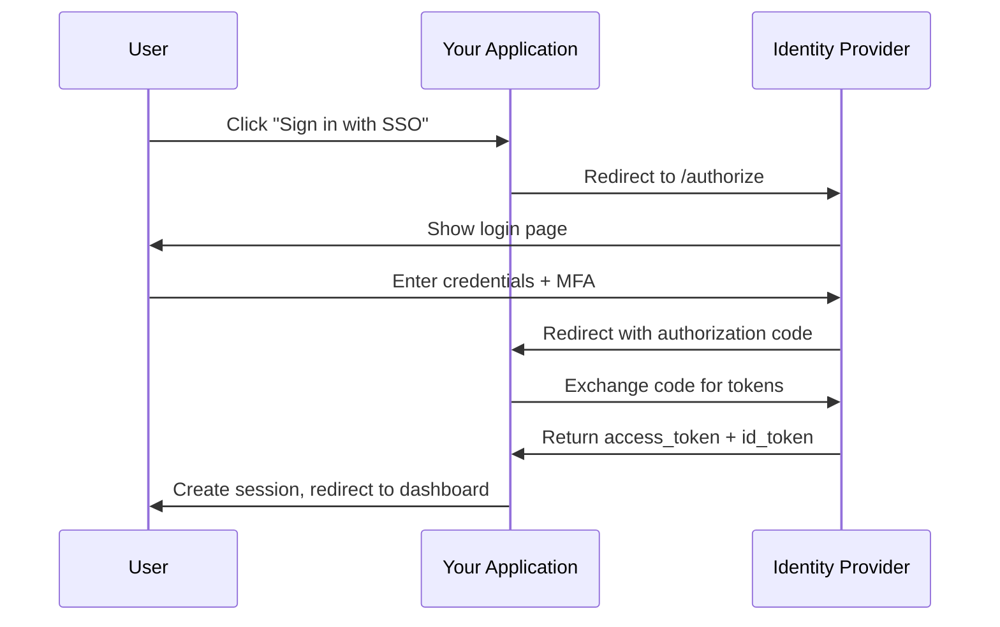
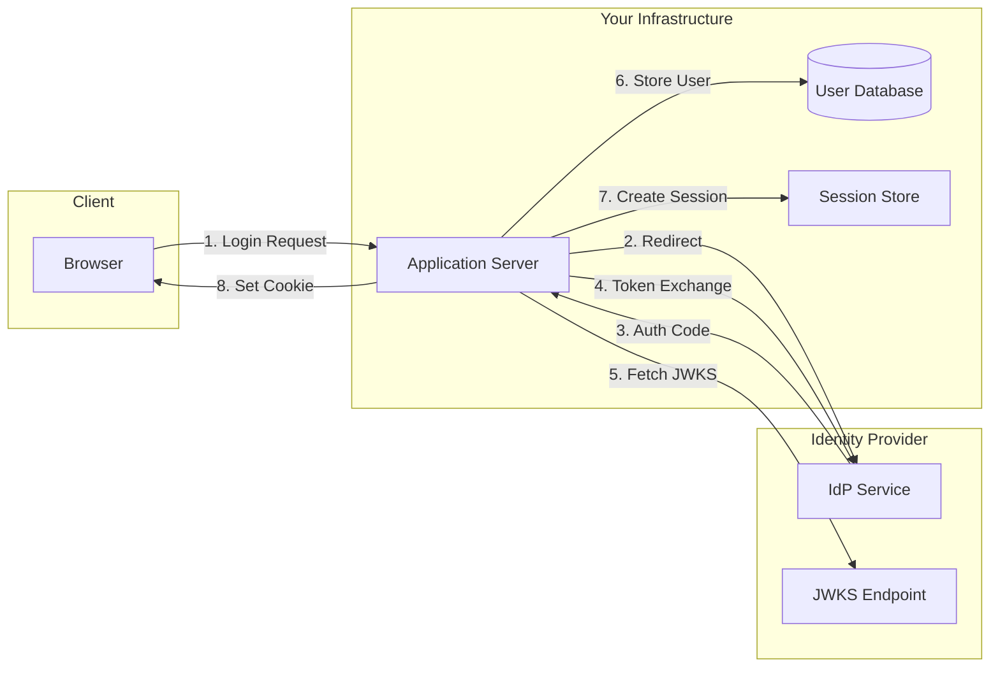

# How to Build Identity Provider Integration

Author: [nawazdhandala](https://github.com/nawazdhandala)

Tags: Security, IdP, OAuth, OIDC

Description: Learn to build identity provider integration with OAuth and OpenID Connect protocols.

---

Identity provider (IdP) integration is a foundational piece of enterprise software. Users expect to sign in once with their corporate credentials and access all their tools without managing separate passwords. This guide walks through building OAuth 2.0 and OpenID Connect (OIDC) integration from scratch, covering the protocol flows, implementation details, and production hardening.

## Why Build IdP Integration

Organizations rely on identity providers like Okta, Azure AD, and Google Workspace to manage employee access. When your application supports IdP integration, you gain several benefits.

| Benefit | Description |
|---------|-------------|
| **Centralized Access Control** | Admins manage users in one place; deprovisioning happens instantly |
| **Stronger Security** | MFA, device policies, and conditional access enforced at the IdP level |
| **Better User Experience** | One click to sign in; no password fatigue |
| **Compliance** | Audit logs show who accessed what and when |

## Understanding the Protocols

OAuth 2.0 handles authorization, while OpenID Connect adds an identity layer on top. Most IdP integrations use OIDC because it provides both authentication and basic profile information.

The following diagram shows the Authorization Code flow, which is the recommended pattern for server-side applications.



## Setting Up the OAuth Client

Before writing code, register your application with the identity provider. You will receive a client ID and client secret. Configure the following settings in your IdP dashboard.

| Setting | Example Value | Purpose |
|---------|---------------|---------|
| **Redirect URI** | `https://app.example.com/auth/callback` | Where IdP sends users after login |
| **Allowed Scopes** | `openid profile email` | What user data you can access |
| **Grant Types** | `authorization_code` | Flow type for web apps |
| **Token Endpoint Auth** | `client_secret_post` | How your app authenticates |

Store these credentials securely using environment variables or a secrets manager.

```javascript
// config/oauth.js
// Load OAuth configuration from environment variables
module.exports = {
  clientId: process.env.OAUTH_CLIENT_ID,
  clientSecret: process.env.OAUTH_CLIENT_SECRET,
  redirectUri: process.env.OAUTH_REDIRECT_URI,
  authorizationUrl: process.env.OAUTH_AUTHORIZATION_URL,
  tokenUrl: process.env.OAUTH_TOKEN_URL,
  userInfoUrl: process.env.OAUTH_USERINFO_URL,
  scopes: ['openid', 'profile', 'email'],
};
```

## Building the Authorization Flow

The authorization flow starts when a user clicks the SSO button. Your application redirects them to the IdP with specific parameters.

```javascript
// routes/auth.js
const crypto = require('crypto');
const config = require('../config/oauth');

// Generate a cryptographically secure state parameter to prevent CSRF attacks
function generateState() {
  return crypto.randomBytes(32).toString('hex');
}

// Generate PKCE code verifier and challenge for added security
function generatePKCE() {
  const verifier = crypto.randomBytes(32).toString('base64url');
  const challenge = crypto
    .createHash('sha256')
    .update(verifier)
    .digest('base64url');
  return { verifier, challenge };
}

// Initiate the OAuth flow by redirecting to the IdP
app.get('/auth/login', (req, res) => {
  const state = generateState();
  const pkce = generatePKCE();

  // Store state and PKCE verifier in session for validation later
  req.session.oauthState = state;
  req.session.pkceVerifier = pkce.verifier;

  // Build the authorization URL with all required parameters
  const params = new URLSearchParams({
    client_id: config.clientId,
    redirect_uri: config.redirectUri,
    response_type: 'code',
    scope: config.scopes.join(' '),
    state: state,
    code_challenge: pkce.challenge,
    code_challenge_method: 'S256',
  });

  res.redirect(`${config.authorizationUrl}?${params}`);
});
```

## Handling the Callback

After the user authenticates, the IdP redirects them back to your application with an authorization code. Your server exchanges this code for tokens.

```javascript
// routes/auth.js
app.get('/auth/callback', async (req, res) => {
  const { code, state, error } = req.query;

  // Handle IdP errors (user denied access, etc.)
  if (error) {
    console.error('OAuth error:', error);
    return res.redirect('/login?error=oauth_failed');
  }

  // Validate state parameter to prevent CSRF attacks
  if (state !== req.session.oauthState) {
    console.error('State mismatch - possible CSRF attack');
    return res.redirect('/login?error=invalid_state');
  }

  try {
    // Exchange authorization code for tokens
    const tokens = await exchangeCodeForTokens(code, req.session.pkceVerifier);

    // Validate and decode the ID token
    const userInfo = await validateIdToken(tokens.id_token);

    // Create or update user in your database
    const user = await findOrCreateUser(userInfo);

    // Establish session
    req.session.userId = user.id;
    req.session.accessToken = tokens.access_token;

    // Clean up OAuth state from session
    delete req.session.oauthState;
    delete req.session.pkceVerifier;

    res.redirect('/dashboard');
  } catch (err) {
    console.error('Token exchange failed:', err);
    res.redirect('/login?error=token_exchange_failed');
  }
});
```

The token exchange function makes a POST request to the IdP's token endpoint.

```javascript
// services/oauth.js
async function exchangeCodeForTokens(code, pkceVerifier) {
  const response = await fetch(config.tokenUrl, {
    method: 'POST',
    headers: {
      'Content-Type': 'application/x-www-form-urlencoded',
    },
    body: new URLSearchParams({
      grant_type: 'authorization_code',
      client_id: config.clientId,
      client_secret: config.clientSecret,
      code: code,
      redirect_uri: config.redirectUri,
      code_verifier: pkceVerifier,
    }),
  });

  if (!response.ok) {
    const error = await response.json();
    throw new Error(`Token exchange failed: ${error.error_description}`);
  }

  return response.json();
}
```

## Validating ID Tokens

The ID token is a signed JWT containing user identity claims. Always validate it before trusting its contents.

```javascript
// services/oauth.js
const jwt = require('jsonwebtoken');
const jwksClient = require('jwks-rsa');

// Create a JWKS client to fetch the IdP's public keys
const jwks = jwksClient({
  jwksUri: process.env.OAUTH_JWKS_URI,
  cache: true,
  cacheMaxAge: 86400000, // Cache keys for 24 hours
});

// Retrieve the signing key from the IdP's JWKS endpoint
function getSigningKey(header, callback) {
  jwks.getSigningKey(header.kid, (err, key) => {
    if (err) return callback(err);
    callback(null, key.getPublicKey());
  });
}

async function validateIdToken(idToken) {
  return new Promise((resolve, reject) => {
    jwt.verify(
      idToken,
      getSigningKey,
      {
        algorithms: ['RS256'],
        issuer: process.env.OAUTH_ISSUER,
        audience: config.clientId,
      },
      (err, decoded) => {
        if (err) return reject(err);

        // Additional validation: check token is not expired
        const now = Math.floor(Date.now() / 1000);
        if (decoded.exp < now) {
          return reject(new Error('ID token has expired'));
        }

        resolve(decoded);
      }
    );
  });
}
```

## User Provisioning

Once you have validated user identity, create or update the user record in your database.

```javascript
// services/users.js
async function findOrCreateUser(idTokenClaims) {
  // Look up user by IdP subject identifier (unique per user per IdP)
  let user = await db.users.findOne({
    where: { idpSubject: idTokenClaims.sub },
  });

  if (user) {
    // Update profile if changed
    await user.update({
      email: idTokenClaims.email,
      name: idTokenClaims.name,
      lastLogin: new Date(),
    });
  } else {
    // Create new user
    user = await db.users.create({
      idpSubject: idTokenClaims.sub,
      email: idTokenClaims.email,
      name: idTokenClaims.name,
      createdAt: new Date(),
      lastLogin: new Date(),
    });
  }

  return user;
}
```

## Architecture Overview

The following diagram shows how the components fit together in a typical deployment.



## Security Hardening

Production deployments require additional security measures beyond the basic flow.

**State and PKCE**: Always use both. State prevents CSRF attacks; PKCE prevents authorization code interception.

**Token Storage**: Never store access tokens in localStorage. Use secure, httpOnly cookies or server-side sessions.

**Token Refresh**: Implement refresh token rotation to maintain sessions without re-authentication.

```javascript
// middleware/auth.js
async function refreshTokenIfNeeded(req, res, next) {
  if (!req.session.accessToken) return next();

  // Decode token to check expiration (without verification)
  const decoded = jwt.decode(req.session.accessToken);
  const expiresIn = decoded.exp - Math.floor(Date.now() / 1000);

  // Refresh if token expires in less than 5 minutes
  if (expiresIn < 300 && req.session.refreshToken) {
    try {
      const tokens = await refreshAccessToken(req.session.refreshToken);
      req.session.accessToken = tokens.access_token;
      if (tokens.refresh_token) {
        req.session.refreshToken = tokens.refresh_token;
      }
    } catch (err) {
      // Refresh failed; user must re-authenticate
      return res.redirect('/auth/login');
    }
  }

  next();
}
```

## Supporting Multiple IdPs

Enterprise customers often need to connect their own identity provider. Support this with a tenant configuration model.

```javascript
// services/tenantOAuth.js
async function getOAuthConfigForTenant(tenantId) {
  const tenant = await db.tenants.findByPk(tenantId);

  if (!tenant.ssoEnabled) {
    return null;
  }

  return {
    clientId: tenant.oauthClientId,
    clientSecret: decrypt(tenant.oauthClientSecret),
    authorizationUrl: tenant.oauthAuthorizationUrl,
    tokenUrl: tenant.oauthTokenUrl,
    userInfoUrl: tenant.oauthUserInfoUrl,
    jwksUri: tenant.oauthJwksUri,
    issuer: tenant.oauthIssuer,
  };
}
```

## Testing Your Integration

Test with multiple identity providers to ensure compatibility. Most IdPs provide sandbox environments.

| Provider | Sandbox Documentation |
|----------|----------------------|
| Okta | Developer account with test users |
| Azure AD | Azure free tier with test tenant |
| Google | Google Cloud project with test domain |
| Auth0 | Free tier with development tenant |

Write integration tests that simulate the full OAuth flow, including error cases like expired tokens, revoked access, and network failures.

## Summary

Building IdP integration requires understanding OAuth 2.0 and OIDC protocols, implementing secure token handling, and supporting the variety of identity providers your customers use. The code examples in this guide provide a foundation you can adapt to your technology stack.

For more on enterprise security features, see our guides on [SSO as a security basic](https://oneuptime.com/blog/post/2025-08-19-sso-is-a-security-basic-not-an-enterprise-perk/view) and [securing private status pages](https://oneuptime.com/blog/post/2025-11-20-secure-your-status-page-authentication-options/view).
