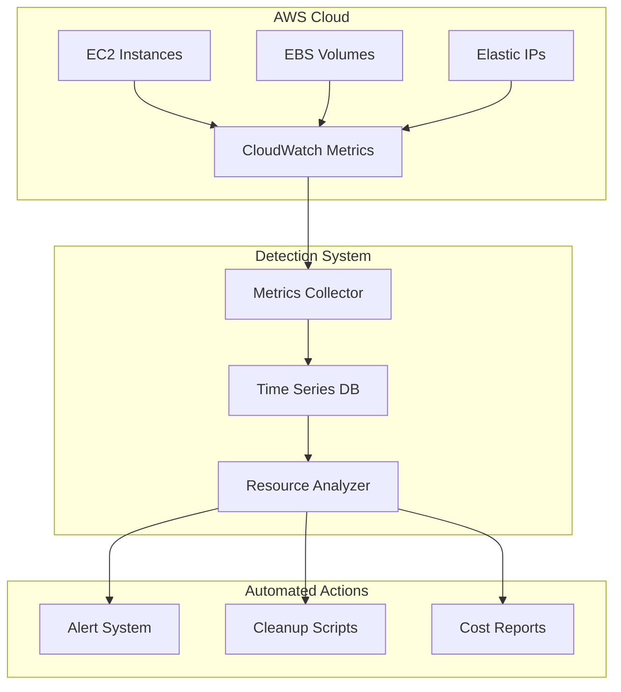
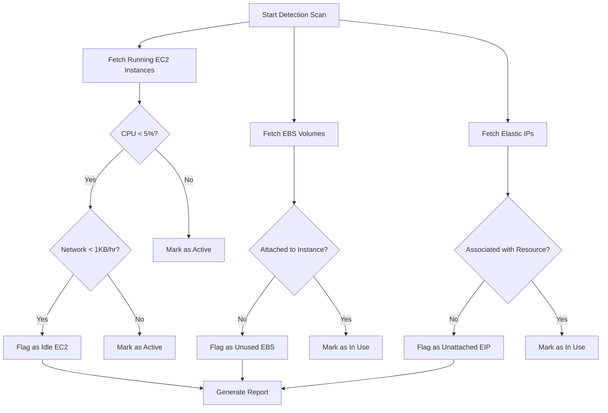
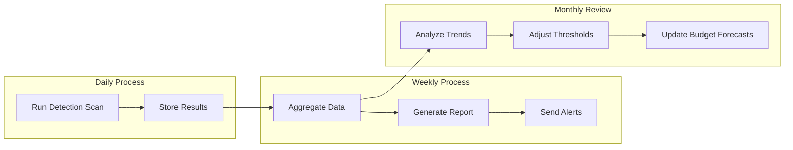
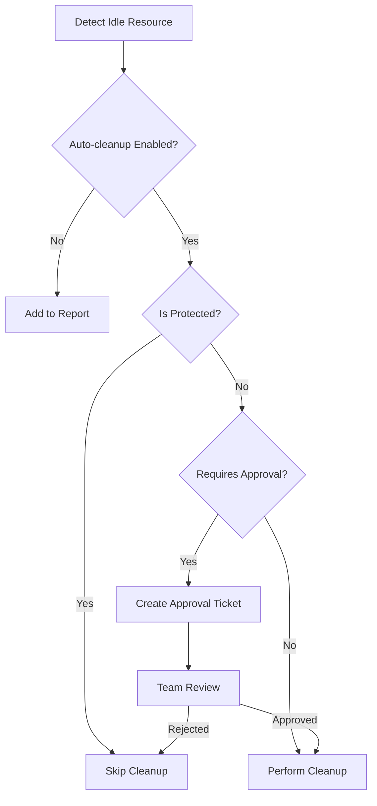

# How to Implement Idle Resource Detection

Author: [nawazdhandala](https://github.com/nawazdhandala)

Tags: FinOps, Cloud, Cost Optimization, Monitoring

Description: Learn how to detect idle cloud resources to eliminate waste and reduce costs.

---

Cloud infrastructure costs can spiral out of control when resources sit idle. Studies show that 30 to 40 percent of cloud spending goes toward unused or underutilized resources. This guide walks you through implementing idle resource detection to identify and clean up wasteful cloud resources, focusing on EC2 instances, EBS volumes, and Elastic IPs.

## Understanding Idle Resources

Before diving into implementation, let us define what constitutes an idle resource:

- **Idle EC2 Instances**: Instances with consistently low CPU utilization (below 5%), minimal network traffic, and low disk I/O
- **Unused EBS Volumes**: Volumes not attached to any running instance
- **Unattached Elastic IPs**: IP addresses allocated but not associated with any resource

## Architecture Overview

Here is how an idle resource detection system fits into your cloud infrastructure:



## Setting Up the Detection Framework

### Prerequisites

First, ensure you have the necessary AWS permissions and dependencies:

```bash
# Install required Python packages
pip install boto3 pandas schedule

# Configure AWS credentials
aws configure
```

### Core Detection Module

Here is the main module for detecting idle resources:

```python
"""
idle_resource_detector.py

A comprehensive module for detecting idle AWS resources.
This module checks EC2 instances, EBS volumes, and Elastic IPs
to identify resources that are candidates for cleanup.
"""

import boto3
from datetime import datetime, timedelta
from typing import List, Dict, Any
import logging

# Configure logging for visibility into detection process
logging.basicConfig(
    level=logging.INFO,
    format='%(asctime)s - %(levelname)s - %(message)s'
)
logger = logging.getLogger(__name__)


class IdleResourceDetector:
    """
    Detects idle resources across AWS services.

    This class provides methods to identify:
    - EC2 instances with low utilization
    - Unattached EBS volumes
    - Unassociated Elastic IPs
    """

    def __init__(self, region: str = 'us-east-1'):
        """
        Initialize the detector with AWS clients.

        Args:
            region: AWS region to scan for idle resources
        """
        # Initialize AWS service clients
        self.ec2_client = boto3.client('ec2', region_name=region)
        self.cloudwatch_client = boto3.client('cloudwatch', region_name=region)
        self.region = region

        # Define thresholds for idle detection
        # These values can be adjusted based on your workload patterns
        self.cpu_threshold = 5.0  # Percent - instances below this are considered idle
        self.network_threshold = 1000  # Bytes - minimal network activity threshold
        self.evaluation_period_days = 7  # Days to evaluate metrics over

    def get_idle_ec2_instances(self) -> List[Dict[str, Any]]:
        """
        Identify EC2 instances with consistently low utilization.

        Returns:
            List of dictionaries containing idle instance details
        """
        idle_instances = []

        # Get all running instances
        response = self.ec2_client.describe_instances(
            Filters=[{'Name': 'instance-state-name', 'Values': ['running']}]
        )

        for reservation in response['Reservations']:
            for instance in reservation['Instances']:
                instance_id = instance['InstanceId']

                # Get CPU utilization metrics from CloudWatch
                cpu_utilization = self._get_average_cpu(instance_id)
                network_in = self._get_network_metric(instance_id, 'NetworkIn')
                network_out = self._get_network_metric(instance_id, 'NetworkOut')

                # Check if instance meets idle criteria
                # An instance is idle if CPU is low AND network activity is minimal
                is_idle = (
                    cpu_utilization < self.cpu_threshold and
                    network_in < self.network_threshold and
                    network_out < self.network_threshold
                )

                if is_idle:
                    # Extract instance name from tags if available
                    name = self._get_tag_value(instance.get('Tags', []), 'Name')

                    idle_instances.append({
                        'instance_id': instance_id,
                        'name': name,
                        'instance_type': instance['InstanceType'],
                        'launch_time': instance['LaunchTime'].isoformat(),
                        'avg_cpu': round(cpu_utilization, 2),
                        'avg_network_in': round(network_in, 2),
                        'avg_network_out': round(network_out, 2),
                        'region': self.region
                    })

                    logger.info(f"Idle instance detected: {instance_id} ({name})")

        return idle_instances

    def _get_average_cpu(self, instance_id: str) -> float:
        """
        Retrieve average CPU utilization for an instance over the evaluation period.

        Args:
            instance_id: The EC2 instance ID to check

        Returns:
            Average CPU utilization as a percentage
        """
        end_time = datetime.utcnow()
        start_time = end_time - timedelta(days=self.evaluation_period_days)

        response = self.cloudwatch_client.get_metric_statistics(
            Namespace='AWS/EC2',
            MetricName='CPUUtilization',
            Dimensions=[{'Name': 'InstanceId', 'Value': instance_id}],
            StartTime=start_time,
            EndTime=end_time,
            Period=3600,  # 1 hour granularity
            Statistics=['Average']
        )

        # Calculate overall average from datapoints
        datapoints = response.get('Datapoints', [])
        if not datapoints:
            return 0.0

        return sum(dp['Average'] for dp in datapoints) / len(datapoints)

    def _get_network_metric(self, instance_id: str, metric_name: str) -> float:
        """
        Retrieve network metrics for an instance.

        Args:
            instance_id: The EC2 instance ID
            metric_name: Either 'NetworkIn' or 'NetworkOut'

        Returns:
            Average network bytes over the evaluation period
        """
        end_time = datetime.utcnow()
        start_time = end_time - timedelta(days=self.evaluation_period_days)

        response = self.cloudwatch_client.get_metric_statistics(
            Namespace='AWS/EC2',
            MetricName=metric_name,
            Dimensions=[{'Name': 'InstanceId', 'Value': instance_id}],
            StartTime=start_time,
            EndTime=end_time,
            Period=3600,
            Statistics=['Average']
        )

        datapoints = response.get('Datapoints', [])
        if not datapoints:
            return 0.0

        return sum(dp['Average'] for dp in datapoints) / len(datapoints)

    def _get_tag_value(self, tags: List[Dict], key: str) -> str:
        """
        Extract a tag value from a list of AWS tags.

        Args:
            tags: List of tag dictionaries with 'Key' and 'Value'
            key: The tag key to search for

        Returns:
            The tag value or 'N/A' if not found
        """
        for tag in tags:
            if tag['Key'] == key:
                return tag['Value']
        return 'N/A'

    def get_unused_ebs_volumes(self) -> List[Dict[str, Any]]:
        """
        Find EBS volumes that are not attached to any instance.

        Unattached volumes are common leftover resources when instances
        are terminated but their volumes are preserved.

        Returns:
            List of dictionaries containing unused volume details
        """
        unused_volumes = []

        # Query for volumes in 'available' state (not attached)
        response = self.ec2_client.describe_volumes(
            Filters=[{'Name': 'status', 'Values': ['available']}]
        )

        for volume in response['Volumes']:
            volume_id = volume['VolumeId']
            name = self._get_tag_value(volume.get('Tags', []), 'Name')

            # Calculate how long the volume has been unattached
            create_time = volume['CreateTime']
            age_days = (datetime.now(create_time.tzinfo) - create_time).days

            # Calculate estimated monthly cost based on volume type and size
            monthly_cost = self._estimate_ebs_cost(
                volume['VolumeType'],
                volume['Size'],
                volume.get('Iops', 0)
            )

            unused_volumes.append({
                'volume_id': volume_id,
                'name': name,
                'size_gb': volume['Size'],
                'volume_type': volume['VolumeType'],
                'create_time': create_time.isoformat(),
                'age_days': age_days,
                'estimated_monthly_cost': round(monthly_cost, 2),
                'region': self.region
            })

            logger.info(f"Unused volume detected: {volume_id} ({volume['Size']}GB)")

        return unused_volumes

    def _estimate_ebs_cost(self, volume_type: str, size_gb: int, iops: int) -> float:
        """
        Estimate monthly cost for an EBS volume.

        Pricing is approximate and based on us-east-1 rates.
        Actual costs may vary by region.

        Args:
            volume_type: EBS volume type (gp2, gp3, io1, etc.)
            size_gb: Volume size in gigabytes
            iops: Provisioned IOPS (for io1/io2 volumes)

        Returns:
            Estimated monthly cost in USD
        """
        # Approximate pricing per GB-month (us-east-1)
        pricing = {
            'gp2': 0.10,
            'gp3': 0.08,
            'io1': 0.125,
            'io2': 0.125,
            'st1': 0.045,
            'sc1': 0.025,
            'standard': 0.05
        }

        base_cost = pricing.get(volume_type, 0.10) * size_gb

        # Add IOPS cost for provisioned IOPS volumes
        if volume_type in ['io1', 'io2'] and iops > 0:
            base_cost += iops * 0.065

        return base_cost

    def get_unattached_elastic_ips(self) -> List[Dict[str, Any]]:
        """
        Find Elastic IPs that are not associated with any resource.

        Unattached Elastic IPs incur hourly charges, making them
        a common source of unnecessary spending.

        Returns:
            List of dictionaries containing unattached EIP details
        """
        unattached_eips = []

        response = self.ec2_client.describe_addresses()

        for address in response['Addresses']:
            # An EIP is unattached if it has no AssociationId
            if 'AssociationId' not in address:
                public_ip = address['PublicIp']
                allocation_id = address.get('AllocationId', 'N/A')

                # Get tags if available
                name = self._get_tag_value(address.get('Tags', []), 'Name')

                # Elastic IPs cost approximately $3.60/month when unattached
                unattached_eips.append({
                    'public_ip': public_ip,
                    'allocation_id': allocation_id,
                    'name': name,
                    'domain': address.get('Domain', 'vpc'),
                    'estimated_monthly_cost': 3.60,
                    'region': self.region
                })

                logger.info(f"Unattached EIP detected: {public_ip}")

        return unattached_eips
```

## Detection Workflow

The following diagram illustrates the decision process for classifying resources:



## Automated Cleanup Scripts

Once idle resources are identified, you can automate their cleanup. Here is a cleanup module with safety checks:

```python
"""
resource_cleanup.py

Automated cleanup module for idle AWS resources.
Includes safety checks and dry-run capabilities to prevent accidents.
"""

import boto3
from datetime import datetime
from typing import List, Dict, Optional
import logging

logging.basicConfig(level=logging.INFO)
logger = logging.getLogger(__name__)


class ResourceCleaner:
    """
    Safely clean up idle AWS resources.

    Features:
    - Dry-run mode for testing
    - Snapshot creation before EBS deletion
    - Tag-based exclusion for protected resources
    - Detailed logging of all actions
    """

    def __init__(self, region: str = 'us-east-1', dry_run: bool = True):
        """
        Initialize the cleaner.

        Args:
            region: AWS region to operate in
            dry_run: If True, only simulate actions without making changes
        """
        self.ec2_client = boto3.client('ec2', region_name=region)
        self.ec2_resource = boto3.resource('ec2', region_name=region)
        self.region = region
        self.dry_run = dry_run

        # Tags that indicate a resource should not be cleaned up
        self.protected_tags = ['do-not-delete', 'production', 'keep']

    def stop_idle_instances(
        self,
        instance_ids: List[str],
        exclude_tags: Optional[List[str]] = None
    ) -> Dict[str, List[str]]:
        """
        Stop idle EC2 instances.

        This method stops rather than terminates instances, allowing
        for easy restart if the instance is needed again.

        Args:
            instance_ids: List of instance IDs to stop
            exclude_tags: Additional tag values that protect instances

        Returns:
            Dictionary with 'stopped' and 'skipped' instance lists
        """
        results = {'stopped': [], 'skipped': [], 'errors': []}

        # Combine default protected tags with any additional exclusions
        protected = self.protected_tags + (exclude_tags or [])

        for instance_id in instance_ids:
            try:
                # Check if instance has protected tags
                if self._is_protected(instance_id, protected):
                    logger.info(f"Skipping protected instance: {instance_id}")
                    results['skipped'].append(instance_id)
                    continue

                if self.dry_run:
                    logger.info(f"[DRY RUN] Would stop instance: {instance_id}")
                    results['stopped'].append(instance_id)
                else:
                    # Stop the instance
                    self.ec2_client.stop_instances(InstanceIds=[instance_id])
                    logger.info(f"Stopped instance: {instance_id}")
                    results['stopped'].append(instance_id)

            except Exception as e:
                logger.error(f"Error stopping {instance_id}: {str(e)}")
                results['errors'].append({'instance_id': instance_id, 'error': str(e)})

        return results

    def _is_protected(self, resource_id: str, protected_tags: List[str]) -> bool:
        """
        Check if a resource has any protected tags.

        Args:
            resource_id: The AWS resource ID
            protected_tags: List of tag values that indicate protection

        Returns:
            True if the resource should not be deleted
        """
        try:
            response = self.ec2_client.describe_tags(
                Filters=[{'Name': 'resource-id', 'Values': [resource_id]}]
            )

            for tag in response.get('Tags', []):
                # Check both tag keys and values against protected list
                if tag['Key'].lower() in [t.lower() for t in protected_tags]:
                    return True
                if tag['Value'].lower() in [t.lower() for t in protected_tags]:
                    return True

            return False

        except Exception:
            # If we cannot check tags, assume protected for safety
            return True

    def delete_unused_volumes(
        self,
        volume_ids: List[str],
        create_snapshot: bool = True
    ) -> Dict[str, List[str]]:
        """
        Delete unused EBS volumes with optional snapshot backup.

        Args:
            volume_ids: List of volume IDs to delete
            create_snapshot: If True, create a snapshot before deletion

        Returns:
            Dictionary with deletion results and snapshot IDs
        """
        results = {'deleted': [], 'skipped': [], 'snapshots': [], 'errors': []}

        for volume_id in volume_ids:
            try:
                # Check for protected tags
                if self._is_protected(volume_id, self.protected_tags):
                    logger.info(f"Skipping protected volume: {volume_id}")
                    results['skipped'].append(volume_id)
                    continue

                if self.dry_run:
                    logger.info(f"[DRY RUN] Would delete volume: {volume_id}")
                    if create_snapshot:
                        logger.info(f"[DRY RUN] Would create snapshot first")
                    results['deleted'].append(volume_id)
                else:
                    # Create snapshot before deletion if requested
                    if create_snapshot:
                        snapshot_id = self._create_volume_snapshot(volume_id)
                        results['snapshots'].append({
                            'volume_id': volume_id,
                            'snapshot_id': snapshot_id
                        })

                    # Delete the volume
                    self.ec2_client.delete_volume(VolumeId=volume_id)
                    logger.info(f"Deleted volume: {volume_id}")
                    results['deleted'].append(volume_id)

            except Exception as e:
                logger.error(f"Error deleting {volume_id}: {str(e)}")
                results['errors'].append({'volume_id': volume_id, 'error': str(e)})

        return results

    def _create_volume_snapshot(self, volume_id: str) -> str:
        """
        Create a snapshot of a volume before deletion.

        Args:
            volume_id: The volume ID to snapshot

        Returns:
            The created snapshot ID
        """
        timestamp = datetime.utcnow().strftime('%Y%m%d-%H%M%S')
        description = f"Backup before cleanup - {volume_id} - {timestamp}"

        response = self.ec2_client.create_snapshot(
            VolumeId=volume_id,
            Description=description,
            TagSpecifications=[{
                'ResourceType': 'snapshot',
                'Tags': [
                    {'Key': 'Name', 'Value': f'cleanup-backup-{volume_id}'},
                    {'Key': 'CreatedBy', 'Value': 'idle-resource-detector'},
                    {'Key': 'OriginalVolume', 'Value': volume_id}
                ]
            }]
        )

        snapshot_id = response['SnapshotId']
        logger.info(f"Created snapshot {snapshot_id} for volume {volume_id}")

        return snapshot_id

    def release_unattached_eips(
        self,
        allocation_ids: List[str]
    ) -> Dict[str, List[str]]:
        """
        Release unattached Elastic IP addresses.

        Args:
            allocation_ids: List of EIP allocation IDs to release

        Returns:
            Dictionary with release results
        """
        results = {'released': [], 'skipped': [], 'errors': []}

        for allocation_id in allocation_ids:
            try:
                # Check for protected tags
                if self._is_protected(allocation_id, self.protected_tags):
                    logger.info(f"Skipping protected EIP: {allocation_id}")
                    results['skipped'].append(allocation_id)
                    continue

                if self.dry_run:
                    logger.info(f"[DRY RUN] Would release EIP: {allocation_id}")
                    results['released'].append(allocation_id)
                else:
                    # Release the Elastic IP
                    self.ec2_client.release_address(AllocationId=allocation_id)
                    logger.info(f"Released EIP: {allocation_id}")
                    results['released'].append(allocation_id)

            except Exception as e:
                logger.error(f"Error releasing {allocation_id}: {str(e)}")
                results['errors'].append({
                    'allocation_id': allocation_id,
                    'error': str(e)
                })

        return results
```

## Scheduling Automated Scans

Set up regular scans to continuously monitor for idle resources:

```python
"""
scheduler.py

Schedule regular idle resource detection scans.
Integrates with notification systems to alert teams.
"""

import schedule
import time
from idle_resource_detector import IdleResourceDetector
from resource_cleanup import ResourceCleaner
import json
from datetime import datetime


def run_detection_scan():
    """
    Execute a full idle resource detection scan.

    This function:
    1. Scans for idle resources across all categories
    2. Generates a detailed report
    3. Optionally performs automated cleanup (if enabled)
    """
    print(f"\n{'='*60}")
    print(f"Starting idle resource scan at {datetime.utcnow().isoformat()}")
    print(f"{'='*60}\n")

    # Scan multiple regions for comprehensive coverage
    regions = ['us-east-1', 'us-west-2', 'eu-west-1']

    all_idle_resources = {
        'scan_time': datetime.utcnow().isoformat(),
        'regions': {},
        'totals': {
            'idle_instances': 0,
            'unused_volumes': 0,
            'unattached_eips': 0,
            'estimated_monthly_savings': 0.0
        }
    }

    for region in regions:
        print(f"\nScanning region: {region}")

        detector = IdleResourceDetector(region=region)

        # Detect all categories of idle resources
        idle_instances = detector.get_idle_ec2_instances()
        unused_volumes = detector.get_unused_ebs_volumes()
        unattached_eips = detector.get_unattached_elastic_ips()

        # Calculate potential savings for this region
        volume_savings = sum(v['estimated_monthly_cost'] for v in unused_volumes)
        eip_savings = sum(e['estimated_monthly_cost'] for e in unattached_eips)

        # Store results by region
        all_idle_resources['regions'][region] = {
            'idle_instances': idle_instances,
            'unused_volumes': unused_volumes,
            'unattached_eips': unattached_eips,
            'estimated_monthly_savings': round(volume_savings + eip_savings, 2)
        }

        # Update totals
        all_idle_resources['totals']['idle_instances'] += len(idle_instances)
        all_idle_resources['totals']['unused_volumes'] += len(unused_volumes)
        all_idle_resources['totals']['unattached_eips'] += len(unattached_eips)
        all_idle_resources['totals']['estimated_monthly_savings'] += (
            volume_savings + eip_savings
        )

    # Generate report file
    report_filename = f"idle_resources_{datetime.utcnow().strftime('%Y%m%d_%H%M%S')}.json"
    with open(report_filename, 'w') as f:
        json.dump(all_idle_resources, f, indent=2, default=str)

    print(f"\n{'='*60}")
    print("SCAN SUMMARY")
    print(f"{'='*60}")
    print(f"Idle EC2 Instances: {all_idle_resources['totals']['idle_instances']}")
    print(f"Unused EBS Volumes: {all_idle_resources['totals']['unused_volumes']}")
    print(f"Unattached Elastic IPs: {all_idle_resources['totals']['unattached_eips']}")
    print(f"Estimated Monthly Savings: ${all_idle_resources['totals']['estimated_monthly_savings']:.2f}")
    print(f"\nReport saved to: {report_filename}")

    return all_idle_resources


def run_automated_cleanup(dry_run: bool = True):
    """
    Run automated cleanup based on detection results.

    Args:
        dry_run: If True, only simulate cleanup actions
    """
    # First run detection
    idle_resources = run_detection_scan()

    print(f"\n{'='*60}")
    print(f"Starting cleanup ({'DRY RUN' if dry_run else 'LIVE'})")
    print(f"{'='*60}\n")

    for region, resources in idle_resources['regions'].items():
        cleaner = ResourceCleaner(region=region, dry_run=dry_run)

        # Stop idle instances (not terminate, for safety)
        if resources['idle_instances']:
            instance_ids = [i['instance_id'] for i in resources['idle_instances']]
            cleaner.stop_idle_instances(instance_ids)

        # Delete unused volumes with snapshot backup
        if resources['unused_volumes']:
            volume_ids = [v['volume_id'] for v in resources['unused_volumes']]
            cleaner.delete_unused_volumes(volume_ids, create_snapshot=True)

        # Release unattached EIPs
        if resources['unattached_eips']:
            allocation_ids = [
                e['allocation_id']
                for e in resources['unattached_eips']
                if e['allocation_id'] != 'N/A'
            ]
            cleaner.release_unattached_eips(allocation_ids)


# Schedule regular scans
# Daily detection scan at 6 AM UTC
schedule.every().day.at("06:00").do(run_detection_scan)

# Weekly cleanup (dry run) every Monday at 7 AM UTC
schedule.every().monday.at("07:00").do(run_automated_cleanup, dry_run=True)


if __name__ == "__main__":
    # Run initial scan on startup
    run_detection_scan()

    # Keep the scheduler running
    print("\nScheduler started. Press Ctrl+C to exit.")
    while True:
        schedule.run_pending()
        time.sleep(60)
```

## Cost Savings Visualization

Track your savings over time with this reporting workflow:



## Best Practices

### 1. Start with Detection Only

Begin by running detection in report-only mode for several weeks. This helps you:

- Understand your baseline resource usage patterns
- Identify false positives and tune thresholds
- Build confidence before enabling automated cleanup

### 2. Implement Tagging Governance

Use consistent tags to protect critical resources:

```python
# Example protected resource tags
PROTECTED_TAGS = {
    'Environment': ['production', 'prod'],
    'DoNotDelete': ['true', 'yes'],
    'CostCenter': ['critical-app'],
    'Owner': ['infrastructure-team']
}
```

### 3. Create Approval Workflows

For production environments, implement an approval process:



### 4. Monitor and Iterate

Continuously refine your detection thresholds based on:

- False positive rates
- Actual cost savings achieved
- Feedback from application teams
- Seasonal usage patterns

## Conclusion

Implementing idle resource detection is a crucial step in cloud cost optimization. By systematically identifying and cleaning up unused EC2 instances, EBS volumes, and Elastic IPs, organizations can significantly reduce their cloud spending.

Key takeaways:

1. **Start simple**: Begin with basic CPU and network metrics before adding complexity
2. **Use dry-run mode**: Always test cleanup scripts before running them in production
3. **Protect critical resources**: Implement tagging strategies to prevent accidental deletion
4. **Automate gradually**: Move from manual review to automated cleanup as confidence grows
5. **Track savings**: Monitor the financial impact of your cleanup efforts

By following this guide, you can build a robust idle resource detection system that continuously identifies optimization opportunities and helps maintain a lean, cost-effective cloud infrastructure.
