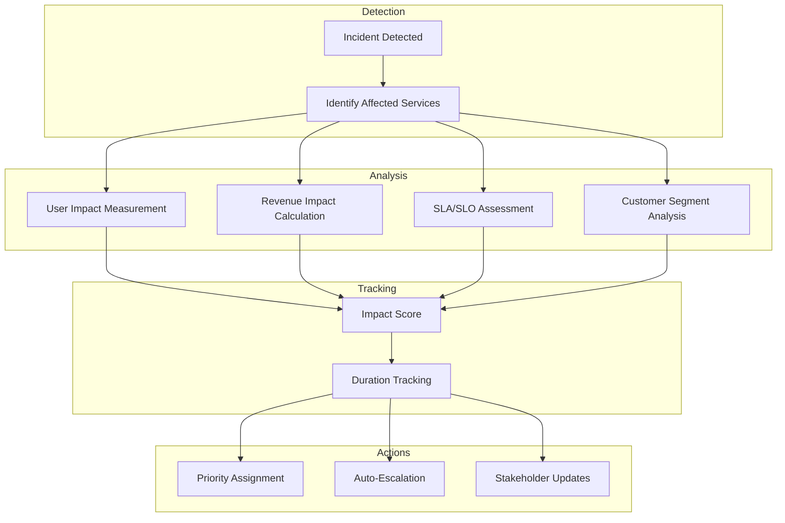
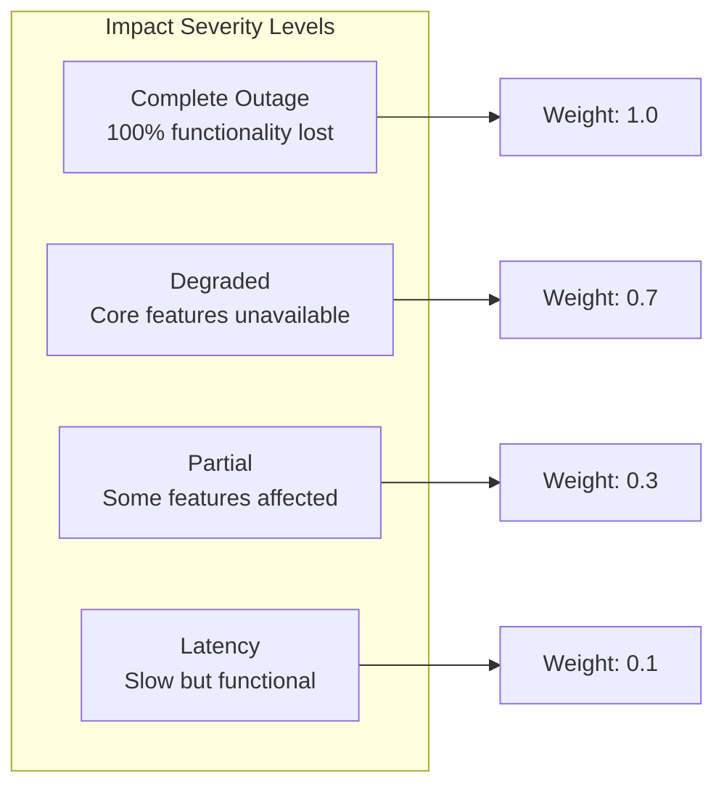
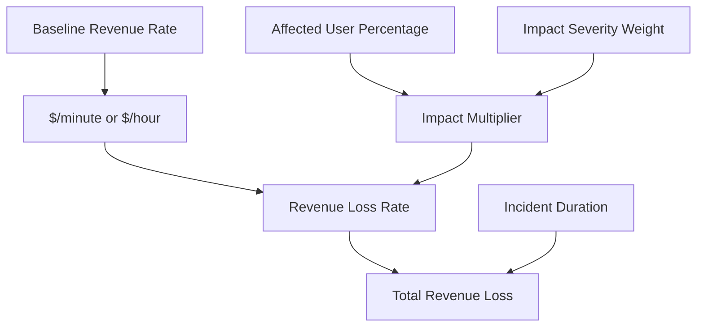
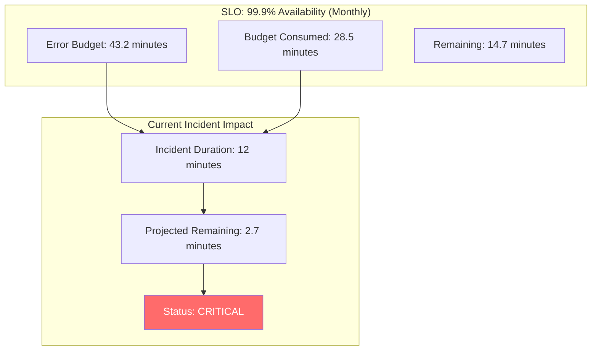
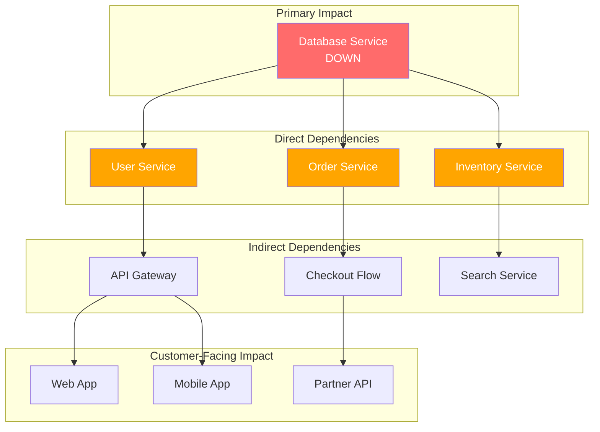
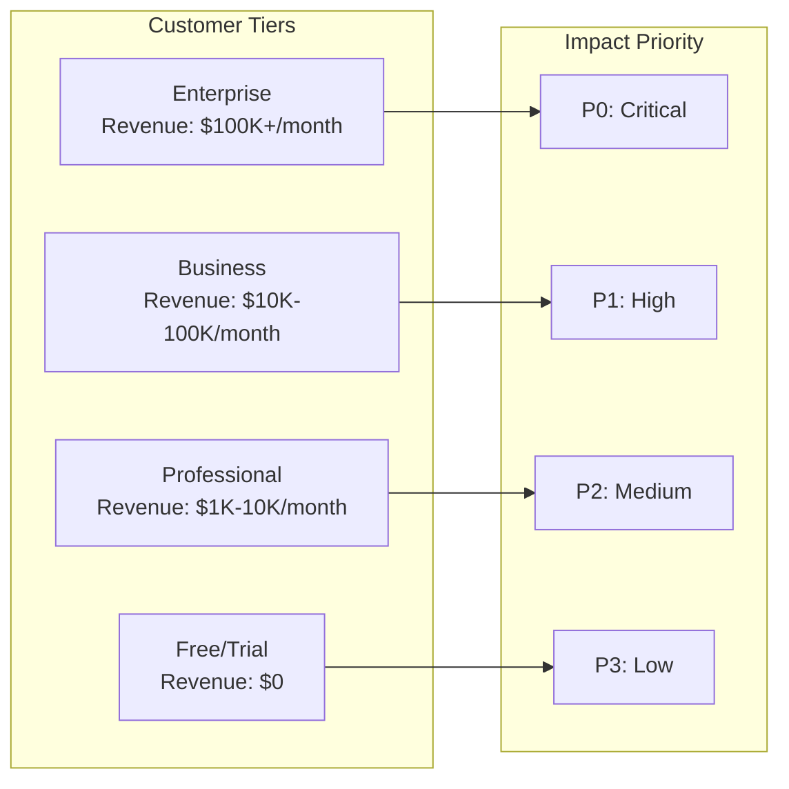
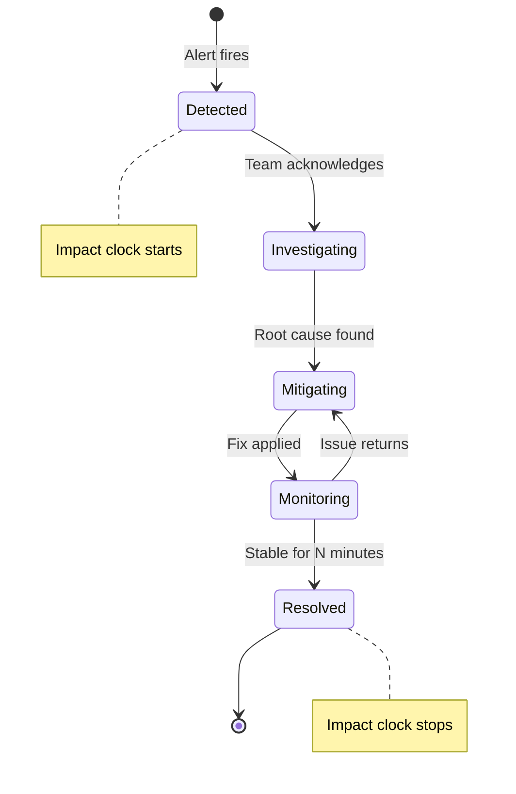
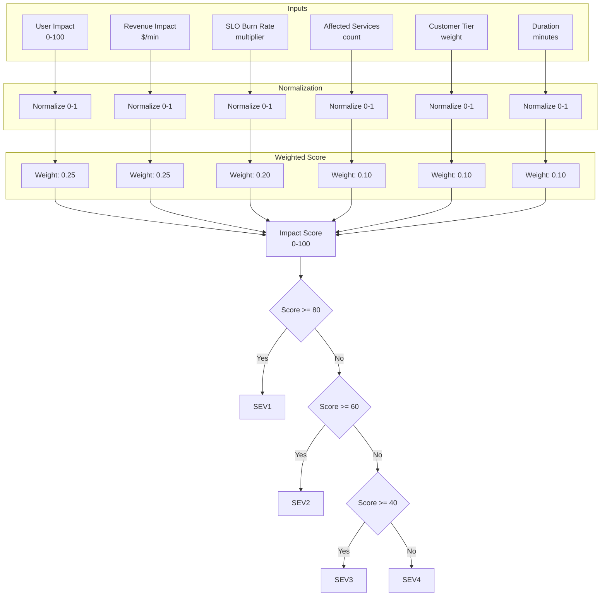

# How to Build Impact Analysis

Author: [nawazdhandala](https://github.com/nawazdhandala)

Tags: Incident Management, Analysis, SRE, Business Impact

Description: Learn how to analyze and quantify incident impact on users and business.

---

When an incident strikes, the first question from leadership is never "what broke?" It's "how bad is it?" Impact analysis transforms vague status updates into concrete numbers: how many users are affected, how much revenue is at risk, which SLAs are in jeopardy.

This guide covers how to build a comprehensive impact analysis system for incident management. You'll learn to measure user impact, calculate revenue loss, track SLA violations, enumerate affected services, segment affected customers, and measure incident duration.

---

## Why Impact Analysis Matters

Impact analysis serves multiple purposes during and after incidents:

| Purpose | Benefit |
|---------|---------|
| Prioritization | Route resources to highest-impact incidents first |
| Communication | Give stakeholders concrete numbers, not guesses |
| Escalation | Trigger automatic escalation based on impact thresholds |
| Post-incident | Accurate data for postmortems and reliability metrics |
| Business alignment | Translate technical failures into business language |

Without impact analysis, you're flying blind. You might spend hours fixing a minor bug while a revenue-critical service burns.

---

## The Impact Analysis Framework



The framework has four stages: detect the incident, analyze its impact across multiple dimensions, calculate a composite impact score, and use that score to drive actions.

---

## 1. User Impact Measurement

User impact is the foundation of impact analysis. It answers: "How many users are affected and how severely?"

### Measuring Active Users

You need baseline data to calculate impact. Track active users per service continuously.

```typescript
// user-impact.ts
interface UserImpactMetrics {
  totalActiveUsers: number;
  affectedUsers: number;
  impactPercentage: number;
  impactSeverity: 'none' | 'partial' | 'degraded' | 'complete';
}

interface ServiceUserMetrics {
  serviceName: string;
  activeUsersPerMinute: number;
  errorRate: number;
  latencyP99Ms: number;
}

class UserImpactCalculator {
  private baselineMetrics: Map<string, ServiceUserMetrics> = new Map();

  // Store baseline metrics during normal operation
  updateBaseline(serviceName: string, metrics: ServiceUserMetrics): void {
    // Use exponential moving average for baseline
    const existing = this.baselineMetrics.get(serviceName);
    if (existing) {
      const alpha = 0.1; // Smoothing factor
      this.baselineMetrics.set(serviceName, {
        serviceName,
        activeUsersPerMinute:
          alpha * metrics.activeUsersPerMinute +
          (1 - alpha) * existing.activeUsersPerMinute,
        errorRate:
          alpha * metrics.errorRate + (1 - alpha) * existing.errorRate,
        latencyP99Ms:
          alpha * metrics.latencyP99Ms + (1 - alpha) * existing.latencyP99Ms,
      });
    } else {
      this.baselineMetrics.set(serviceName, metrics);
    }
  }

  calculateUserImpact(
    serviceName: string,
    currentMetrics: ServiceUserMetrics
  ): UserImpactMetrics {
    const baseline = this.baselineMetrics.get(serviceName);

    if (!baseline) {
      // No baseline data, estimate from current
      return {
        totalActiveUsers: currentMetrics.activeUsersPerMinute,
        affectedUsers: 0,
        impactPercentage: 0,
        impactSeverity: 'none',
      };
    }

    // Calculate affected users based on error rate increase
    const errorRateIncrease = Math.max(
      0,
      currentMetrics.errorRate - baseline.errorRate
    );

    // Users affected = baseline users * error rate increase
    const affectedUsers = Math.round(
      baseline.activeUsersPerMinute * errorRateIncrease
    );

    const impactPercentage =
      (affectedUsers / baseline.activeUsersPerMinute) * 100;

    return {
      totalActiveUsers: baseline.activeUsersPerMinute,
      affectedUsers,
      impactPercentage,
      impactSeverity: this.classifyImpactSeverity(impactPercentage),
    };
  }

  private classifyImpactSeverity(
    impactPercentage: number
  ): UserImpactMetrics['impactSeverity'] {
    if (impactPercentage === 0) return 'none';
    if (impactPercentage < 10) return 'partial';
    if (impactPercentage < 50) return 'degraded';
    return 'complete';
  }
}
```

### User Impact Categories

Not all impact is equal. Classify users by how severely they're affected.



```typescript
// impact-severity.ts
interface UserImpactBreakdown {
  completeOutage: number;    // Users who can't use the service at all
  degraded: number;          // Users missing core functionality
  partial: number;           // Users with some features affected
  latencyImpacted: number;   // Users experiencing slowness
}

function calculateWeightedUserImpact(
  breakdown: UserImpactBreakdown
): number {
  const weights = {
    completeOutage: 1.0,
    degraded: 0.7,
    partial: 0.3,
    latencyImpacted: 0.1,
  };

  return (
    breakdown.completeOutage * weights.completeOutage +
    breakdown.degraded * weights.degraded +
    breakdown.partial * weights.partial +
    breakdown.latencyImpacted * weights.latencyImpacted
  );
}

// Example: 100 users in complete outage, 500 degraded, 1000 partial, 2000 slow
// Weighted impact = 100*1.0 + 500*0.7 + 1000*0.3 + 2000*0.1 = 100 + 350 + 300 + 200 = 950
```

---

## 2. Revenue Impact Calculation

Translate user impact into dollars. This gets executive attention and enables cost-benefit analysis for remediation.

### Revenue Loss Model



```typescript
// revenue-impact.ts
interface RevenueConfig {
  hourlyRevenue: number;         // Baseline hourly revenue
  revenueByService: Map<string, number>;  // Revenue attribution per service
  peakHourMultiplier: number;    // Multiplier during peak hours
  peakHours: number[];           // Array of peak hours (0-23)
}

interface RevenueImpact {
  estimatedLossPerMinute: number;
  estimatedTotalLoss: number;
  impactedRevenueStreams: string[];
  confidenceLevel: 'high' | 'medium' | 'low';
}

class RevenueImpactCalculator {
  constructor(private config: RevenueConfig) {}

  calculateRevenueLoss(
    affectedServices: string[],
    userImpactPercentage: number,
    impactSeverityWeight: number,
    durationMinutes: number
  ): RevenueImpact {
    // Calculate baseline revenue rate for affected services
    let affectedRevenue = 0;
    const impactedStreams: string[] = [];

    for (const service of affectedServices) {
      const serviceRevenue = this.config.revenueByService.get(service) || 0;
      if (serviceRevenue > 0) {
        affectedRevenue += serviceRevenue;
        impactedStreams.push(service);
      }
    }

    // If no service-specific data, use total revenue
    if (affectedRevenue === 0) {
      affectedRevenue = this.config.hourlyRevenue;
    }

    // Apply peak hour multiplier if applicable
    const currentHour = new Date().getHours();
    const isPeakHour = this.config.peakHours.includes(currentHour);
    const timeMultiplier = isPeakHour ? this.config.peakHourMultiplier : 1.0;

    // Calculate loss rate
    const revenuePerMinute = (affectedRevenue / 60) * timeMultiplier;
    const impactMultiplier = (userImpactPercentage / 100) * impactSeverityWeight;
    const lossPerMinute = revenuePerMinute * impactMultiplier;

    return {
      estimatedLossPerMinute: Math.round(lossPerMinute * 100) / 100,
      estimatedTotalLoss: Math.round(lossPerMinute * durationMinutes * 100) / 100,
      impactedRevenueStreams: impactedStreams,
      confidenceLevel: this.determineConfidence(impactedStreams.length),
    };
  }

  private determineConfidence(
    serviceCount: number
  ): RevenueImpact['confidenceLevel'] {
    // More specific service data = higher confidence
    if (serviceCount > 0) return 'high';
    return 'low';
  }
}

// Example usage
const revenueCalculator = new RevenueImpactCalculator({
  hourlyRevenue: 50000,
  revenueByService: new Map([
    ['checkout-service', 30000],
    ['search-service', 10000],
    ['recommendation-service', 5000],
  ]),
  peakHourMultiplier: 2.5,
  peakHours: [10, 11, 12, 13, 14, 19, 20, 21],
});

const impact = revenueCalculator.calculateRevenueLoss(
  ['checkout-service'],
  25,    // 25% of users affected
  0.7,   // Degraded impact weight
  45     // 45 minutes duration
);
// Result: ~$393.75 estimated loss (30000/60 * 2.5 * 0.25 * 0.7 * 45)
```

### Revenue Impact Dashboard Query

```sql
-- revenue_impact.sql
-- Calculate revenue impact during an incident window

WITH baseline_revenue AS (
  SELECT
    service_name,
    AVG(revenue_per_minute) as avg_revenue_per_minute
  FROM revenue_metrics
  WHERE timestamp BETWEEN NOW() - INTERVAL '7 days' AND NOW() - INTERVAL '1 day'
    AND EXTRACT(HOUR FROM timestamp) = EXTRACT(HOUR FROM NOW())
    AND EXTRACT(DOW FROM timestamp) = EXTRACT(DOW FROM NOW())
  GROUP BY service_name
),
incident_period AS (
  SELECT
    service_name,
    AVG(revenue_per_minute) as incident_revenue_per_minute,
    COUNT(*) as minutes_affected
  FROM revenue_metrics
  WHERE timestamp BETWEEN :incident_start AND :incident_end
  GROUP BY service_name
)
SELECT
  b.service_name,
  b.avg_revenue_per_minute as baseline_rpm,
  i.incident_revenue_per_minute as incident_rpm,
  (b.avg_revenue_per_minute - i.incident_revenue_per_minute) as loss_per_minute,
  (b.avg_revenue_per_minute - i.incident_revenue_per_minute) * i.minutes_affected as total_loss
FROM baseline_revenue b
JOIN incident_period i ON b.service_name = i.service_name
WHERE b.avg_revenue_per_minute > i.incident_revenue_per_minute;
```

---

## 3. SLA/SLO Impact Assessment

SLA violations have contractual and financial consequences. Track them in real-time during incidents.

### SLO Definition and Tracking

```typescript
// slo-tracker.ts
interface SLODefinition {
  name: string;
  target: number;          // Target percentage (e.g., 99.9)
  window: 'monthly' | 'quarterly' | 'yearly';
  metric: 'availability' | 'latency' | 'error_rate';
  threshold?: number;      // For latency: max acceptable ms
}

interface SLOStatus {
  slo: SLODefinition;
  currentValue: number;
  remainingBudget: number;      // Minutes of downtime remaining
  budgetConsumedPercent: number;
  projectedBreach: Date | null;
}

interface SLAContract {
  customerId: string;
  slos: SLODefinition[];
  penaltyPerViolation: number;
  creditPercentage: number;    // Credit as % of monthly bill
}

class SLOTracker {
  private sloDefinitions: Map<string, SLODefinition[]> = new Map();
  private slaContracts: Map<string, SLAContract> = new Map();

  calculateErrorBudget(slo: SLODefinition): number {
    // Calculate total allowed downtime in minutes
    const windowMinutes = {
      monthly: 30 * 24 * 60,
      quarterly: 90 * 24 * 60,
      yearly: 365 * 24 * 60,
    };

    const totalMinutes = windowMinutes[slo.window];
    const allowedDowntimePercent = 100 - slo.target;
    return (totalMinutes * allowedDowntimePercent) / 100;
  }

  assessSLOImpact(
    serviceName: string,
    incidentDurationMinutes: number,
    downtimeThisWindow: number
  ): SLOStatus[] {
    const slos = this.sloDefinitions.get(serviceName) || [];
    const statuses: SLOStatus[] = [];

    for (const slo of slos) {
      const totalBudget = this.calculateErrorBudget(slo);
      const consumedBefore = downtimeThisWindow;
      const consumedAfter = consumedBefore + incidentDurationMinutes;
      const remaining = Math.max(0, totalBudget - consumedAfter);

      statuses.push({
        slo,
        currentValue: ((totalBudget - consumedAfter) / totalBudget) * 100,
        remainingBudget: remaining,
        budgetConsumedPercent: (consumedAfter / totalBudget) * 100,
        projectedBreach: remaining === 0 ? new Date() : null,
      });
    }

    return statuses;
  }

  calculateSLAPenalties(
    customerId: string,
    incidentDurationMinutes: number,
    downtimeThisWindow: number
  ): number {
    const contract = this.slaContracts.get(customerId);
    if (!contract) return 0;

    let totalPenalty = 0;

    for (const slo of contract.slos) {
      const budget = this.calculateErrorBudget(slo);
      const consumed = downtimeThisWindow + incidentDurationMinutes;

      if (consumed > budget) {
        // SLA breached
        totalPenalty += contract.penaltyPerViolation;
      }
    }

    return totalPenalty;
  }
}
```

### SLO Burn Rate Visualization



```typescript
// slo-burn-rate.ts
interface BurnRateAlert {
  sloName: string;
  burnRateMultiplier: number;  // How fast we're burning budget
  timeToExhaustion: number;    // Minutes until budget is gone
  alertLevel: 'info' | 'warning' | 'critical';
}

function calculateBurnRate(
  currentDowntimeRate: number,  // Downtime per hour currently
  targetAvailability: number,   // e.g., 99.9
  windowHours: number           // Window size in hours
): BurnRateAlert {
  // Expected downtime rate to consume budget evenly
  const allowedDowntimePercent = 100 - targetAvailability;
  const totalAllowedMinutes = (windowHours * 60 * allowedDowntimePercent) / 100;
  const expectedRatePerHour = totalAllowedMinutes / windowHours;

  const burnMultiplier = currentDowntimeRate / expectedRatePerHour;

  // Time to exhaustion assuming current burn rate continues
  const remainingBudget = totalAllowedMinutes * 0.5; // Assume 50% remaining
  const timeToExhaustion = remainingBudget / currentDowntimeRate * 60;

  let alertLevel: BurnRateAlert['alertLevel'] = 'info';
  if (burnMultiplier > 14.4) alertLevel = 'critical';  // 14.4x = budget gone in 1 hour
  else if (burnMultiplier > 6) alertLevel = 'warning'; // 6x = budget gone in 6 hours

  return {
    sloName: `Availability ${targetAvailability}%`,
    burnRateMultiplier: Math.round(burnMultiplier * 10) / 10,
    timeToExhaustion: Math.round(timeToExhaustion),
    alertLevel,
  };
}
```

---

## 4. Affected Service Enumeration

Map the blast radius of an incident by tracing service dependencies.

### Service Dependency Graph



```typescript
// service-impact.ts
interface Service {
  name: string;
  tier: 'critical' | 'high' | 'medium' | 'low';
  dependencies: string[];
  dependents: string[];
  owningTeam: string;
}

interface ServiceImpact {
  service: Service;
  impactType: 'primary' | 'direct' | 'indirect';
  pathFromIncident: string[];
}

class ServiceDependencyGraph {
  private services: Map<string, Service> = new Map();

  addService(service: Service): void {
    this.services.set(service.name, service);
  }

  // Find all services affected by an incident in a given service
  findAffectedServices(incidentService: string): ServiceImpact[] {
    const affected: ServiceImpact[] = [];
    const visited = new Set<string>();

    // BFS to find all dependents
    const queue: Array<{ name: string; path: string[]; depth: number }> = [
      { name: incidentService, path: [incidentService], depth: 0 },
    ];

    while (queue.length > 0) {
      const current = queue.shift()!;

      if (visited.has(current.name)) continue;
      visited.add(current.name);

      const service = this.services.get(current.name);
      if (!service) continue;

      let impactType: ServiceImpact['impactType'];
      if (current.depth === 0) impactType = 'primary';
      else if (current.depth === 1) impactType = 'direct';
      else impactType = 'indirect';

      affected.push({
        service,
        impactType,
        pathFromIncident: current.path,
      });

      // Add all services that depend on this one
      for (const dependent of service.dependents) {
        if (!visited.has(dependent)) {
          queue.push({
            name: dependent,
            path: [...current.path, dependent],
            depth: current.depth + 1,
          });
        }
      }
    }

    return affected;
  }

  // Calculate blast radius metrics
  calculateBlastRadius(incidentService: string): {
    totalServices: number;
    criticalServices: number;
    teamsAffected: Set<string>;
    maxDepth: number;
  } {
    const affected = this.findAffectedServices(incidentService);

    const teamsAffected = new Set<string>();
    let criticalServices = 0;
    let maxDepth = 0;

    for (const impact of affected) {
      teamsAffected.add(impact.service.owningTeam);
      if (impact.service.tier === 'critical') criticalServices++;
      maxDepth = Math.max(maxDepth, impact.pathFromIncident.length - 1);
    }

    return {
      totalServices: affected.length,
      criticalServices,
      teamsAffected,
      maxDepth,
    };
  }
}

// Example usage
const graph = new ServiceDependencyGraph();

graph.addService({
  name: 'database',
  tier: 'critical',
  dependencies: [],
  dependents: ['user-service', 'order-service', 'inventory-service'],
  owningTeam: 'platform',
});

graph.addService({
  name: 'order-service',
  tier: 'critical',
  dependencies: ['database'],
  dependents: ['checkout-flow', 'api-gateway'],
  owningTeam: 'commerce',
});

const blastRadius = graph.calculateBlastRadius('database');
// Result: { totalServices: 7, criticalServices: 2, teamsAffected: Set(3), maxDepth: 3 }
```

---

## 5. Customer Segment Analysis

Not all customers are equal. Segment impact by customer tier, revenue, or strategic importance.

### Customer Segmentation Model



```typescript
// customer-segment.ts
interface Customer {
  id: string;
  name: string;
  tier: 'enterprise' | 'business' | 'professional' | 'free';
  monthlyRevenue: number;
  contractValue: number;
  isStrategic: boolean;      // Key accounts, logos, etc.
  region: string;
  services: string[];        // Services this customer uses
}

interface CustomerImpactSummary {
  tier: Customer['tier'];
  customersAffected: number;
  revenueAtRisk: number;
  strategicAccountsAffected: number;
}

class CustomerSegmentAnalyzer {
  private customers: Map<string, Customer> = new Map();
  private serviceToCustomers: Map<string, Set<string>> = new Map();

  registerCustomer(customer: Customer): void {
    this.customers.set(customer.id, customer);

    // Build reverse index for service -> customers
    for (const service of customer.services) {
      if (!this.serviceToCustomers.has(service)) {
        this.serviceToCustomers.set(service, new Set());
      }
      this.serviceToCustomers.get(service)!.add(customer.id);
    }
  }

  analyzeImpactBySegment(
    affectedServices: string[]
  ): Map<Customer['tier'], CustomerImpactSummary> {
    // Find all affected customers
    const affectedCustomerIds = new Set<string>();

    for (const service of affectedServices) {
      const customers = this.serviceToCustomers.get(service);
      if (customers) {
        for (const customerId of customers) {
          affectedCustomerIds.add(customerId);
        }
      }
    }

    // Aggregate by tier
    const summaryByTier = new Map<Customer['tier'], CustomerImpactSummary>();
    const tiers: Customer['tier'][] = ['enterprise', 'business', 'professional', 'free'];

    for (const tier of tiers) {
      summaryByTier.set(tier, {
        tier,
        customersAffected: 0,
        revenueAtRisk: 0,
        strategicAccountsAffected: 0,
      });
    }

    for (const customerId of affectedCustomerIds) {
      const customer = this.customers.get(customerId);
      if (!customer) continue;

      const summary = summaryByTier.get(customer.tier)!;
      summary.customersAffected++;
      summary.revenueAtRisk += customer.monthlyRevenue;
      if (customer.isStrategic) {
        summary.strategicAccountsAffected++;
      }
    }

    return summaryByTier;
  }

  getHighPriorityCustomers(
    affectedServices: string[],
    limit: number = 10
  ): Customer[] {
    const affectedCustomers: Customer[] = [];

    for (const service of affectedServices) {
      const customerIds = this.serviceToCustomers.get(service);
      if (!customerIds) continue;

      for (const customerId of customerIds) {
        const customer = this.customers.get(customerId);
        if (customer) affectedCustomers.push(customer);
      }
    }

    // Sort by priority: strategic first, then by revenue
    return affectedCustomers
      .sort((a, b) => {
        if (a.isStrategic && !b.isStrategic) return -1;
        if (!a.isStrategic && b.isStrategic) return 1;
        return b.monthlyRevenue - a.monthlyRevenue;
      })
      .slice(0, limit);
  }
}
```

### Customer Notification Priorities

```typescript
// customer-notification.ts
interface NotificationPriority {
  customer: Customer;
  priority: number;          // 1-10, 10 being highest
  notificationChannels: string[];
  escalationPath: string[];
}

function calculateNotificationPriority(
  customer: Customer,
  impactSeverity: 'complete' | 'degraded' | 'partial'
): NotificationPriority {
  let priority = 1;
  const channels: string[] = ['email'];
  const escalation: string[] = [];

  // Tier-based priority
  const tierPriority = {
    enterprise: 4,
    business: 3,
    professional: 2,
    free: 1,
  };
  priority += tierPriority[customer.tier];

  // Impact severity multiplier
  const severityMultiplier = {
    complete: 3,
    degraded: 2,
    partial: 1,
  };
  priority += severityMultiplier[impactSeverity];

  // Strategic account boost
  if (customer.isStrategic) {
    priority += 2;
    channels.push('phone', 'slack');
    escalation.push('account-manager', 'vp-sales');
  }

  // Revenue-based adjustment
  if (customer.monthlyRevenue > 50000) {
    priority += 1;
    channels.push('sms');
  }

  return {
    customer,
    priority: Math.min(10, priority),
    notificationChannels: channels,
    escalationPath: escalation,
  };
}
```

---

## 6. Impact Duration Tracking

Accurate duration tracking enables precise impact calculations and SLO measurements.

### Duration Tracking State Machine



```typescript
// duration-tracker.ts
type IncidentState =
  | 'detected'
  | 'acknowledged'
  | 'investigating'
  | 'mitigating'
  | 'monitoring'
  | 'resolved';

interface StateTransition {
  fromState: IncidentState;
  toState: IncidentState;
  timestamp: Date;
  actor?: string;
  notes?: string;
}

interface DurationMetrics {
  timeToAcknowledge: number;    // Minutes from detection to ack
  timeToMitigate: number;       // Minutes from detection to mitigation
  timeToResolve: number;        // Total incident duration
  totalImpactDuration: number;  // Time users were affected
  mttr: number;                 // Mean time to resolve
}

class IncidentDurationTracker {
  private transitions: StateTransition[] = [];
  private impactPeriods: Array<{ start: Date; end?: Date }> = [];

  constructor(private incidentId: string) {}

  recordTransition(
    fromState: IncidentState,
    toState: IncidentState,
    actor?: string,
    notes?: string
  ): void {
    const now = new Date();

    this.transitions.push({
      fromState,
      toState,
      timestamp: now,
      actor,
      notes,
    });

    // Track impact periods
    if (this.isImpactingState(toState) && !this.isImpactingState(fromState)) {
      // Starting a new impact period
      this.impactPeriods.push({ start: now });
    } else if (!this.isImpactingState(toState) && this.isImpactingState(fromState)) {
      // Ending an impact period
      const currentPeriod = this.impactPeriods[this.impactPeriods.length - 1];
      if (currentPeriod && !currentPeriod.end) {
        currentPeriod.end = now;
      }
    }
  }

  private isImpactingState(state: IncidentState): boolean {
    // States where users are experiencing impact
    return ['detected', 'acknowledged', 'investigating', 'mitigating'].includes(
      state
    );
  }

  getDurationMetrics(): DurationMetrics {
    const detectedAt = this.transitions.find(
      t => t.toState === 'detected'
    )?.timestamp;
    const acknowledgedAt = this.transitions.find(
      t => t.toState === 'acknowledged'
    )?.timestamp;
    const mitigatingAt = this.transitions.find(
      t => t.toState === 'mitigating'
    )?.timestamp;
    const resolvedAt = this.transitions.find(
      t => t.toState === 'resolved'
    )?.timestamp;

    const now = new Date();

    // Calculate durations in minutes
    const timeToAcknowledge =
      detectedAt && acknowledgedAt
        ? (acknowledgedAt.getTime() - detectedAt.getTime()) / 60000
        : 0;

    const timeToMitigate =
      detectedAt && mitigatingAt
        ? (mitigatingAt.getTime() - detectedAt.getTime()) / 60000
        : 0;

    const timeToResolve =
      detectedAt && resolvedAt
        ? (resolvedAt.getTime() - detectedAt.getTime()) / 60000
        : detectedAt
        ? (now.getTime() - detectedAt.getTime()) / 60000
        : 0;

    // Calculate total impact duration
    let totalImpact = 0;
    for (const period of this.impactPeriods) {
      const end = period.end || now;
      totalImpact += (end.getTime() - period.start.getTime()) / 60000;
    }

    return {
      timeToAcknowledge,
      timeToMitigate,
      timeToResolve,
      totalImpactDuration: totalImpact,
      mttr: timeToResolve,
    };
  }

  // Get current incident age in minutes
  getCurrentDuration(): number {
    const detected = this.transitions.find(t => t.toState === 'detected');
    if (!detected) return 0;

    return (new Date().getTime() - detected.timestamp.getTime()) / 60000;
  }
}
```

### Duration-Based Escalation

```typescript
// escalation-rules.ts
interface EscalationRule {
  durationMinutes: number;
  actions: EscalationAction[];
}

interface EscalationAction {
  type: 'notify' | 'page' | 'escalate' | 'update-status';
  target: string;
  message: string;
}

const escalationPolicy: EscalationRule[] = [
  {
    durationMinutes: 5,
    actions: [
      { type: 'notify', target: 'on-call-primary', message: 'Incident ongoing for 5 minutes' },
    ],
  },
  {
    durationMinutes: 15,
    actions: [
      { type: 'page', target: 'on-call-secondary', message: 'Escalating: 15 minutes unresolved' },
      { type: 'notify', target: 'engineering-manager', message: 'Incident at 15 minutes' },
    ],
  },
  {
    durationMinutes: 30,
    actions: [
      { type: 'escalate', target: 'incident-commander', message: 'Major incident: 30 minutes' },
      { type: 'update-status', target: 'status-page', message: 'Investigating extended outage' },
    ],
  },
  {
    durationMinutes: 60,
    actions: [
      { type: 'page', target: 'vp-engineering', message: 'Critical: 1 hour incident' },
      { type: 'notify', target: 'executive-team', message: 'Executive briefing required' },
    ],
  },
];

function checkEscalations(
  currentDurationMinutes: number,
  alreadyTriggered: Set<number>
): EscalationAction[] {
  const actions: EscalationAction[] = [];

  for (const rule of escalationPolicy) {
    if (
      currentDurationMinutes >= rule.durationMinutes &&
      !alreadyTriggered.has(rule.durationMinutes)
    ) {
      actions.push(...rule.actions);
      alreadyTriggered.add(rule.durationMinutes);
    }
  }

  return actions;
}
```

---

## Putting It All Together: Impact Score

Combine all dimensions into a single impact score for prioritization.



```typescript
// impact-score.ts
interface ImpactInputs {
  userImpactPercent: number;        // 0-100
  revenueLossPerMinute: number;     // dollars
  sloBurnRateMultiplier: number;    // 1x = normal, 14x = critical
  affectedServicesCount: number;
  criticalServicesCount: number;
  enterpriseCustomersAffected: number;
  durationMinutes: number;
}

interface ImpactScoreResult {
  score: number;                    // 0-100
  severity: 'SEV1' | 'SEV2' | 'SEV3' | 'SEV4';
  breakdown: {
    userImpact: number;
    revenueImpact: number;
    sloImpact: number;
    serviceImpact: number;
    customerImpact: number;
    durationImpact: number;
  };
  recommendations: string[];
}

class ImpactScoreCalculator {
  // Normalization thresholds
  private readonly maxRevenueLoss = 1000;        // $/min considered maximum
  private readonly maxBurnRate = 20;             // 20x burn rate = max
  private readonly maxServices = 20;
  private readonly maxEnterpriseCustomers = 50;
  private readonly maxDuration = 120;            // 2 hours

  // Weights for each dimension
  private readonly weights = {
    userImpact: 0.25,
    revenueImpact: 0.25,
    sloImpact: 0.20,
    serviceImpact: 0.10,
    customerImpact: 0.10,
    durationImpact: 0.10,
  };

  calculate(inputs: ImpactInputs): ImpactScoreResult {
    // Normalize each input to 0-1 scale
    const normalized = {
      userImpact: Math.min(1, inputs.userImpactPercent / 100),
      revenueImpact: Math.min(1, inputs.revenueLossPerMinute / this.maxRevenueLoss),
      sloImpact: Math.min(1, inputs.sloBurnRateMultiplier / this.maxBurnRate),
      serviceImpact: Math.min(
        1,
        (inputs.affectedServicesCount + inputs.criticalServicesCount * 2) /
          this.maxServices
      ),
      customerImpact: Math.min(
        1,
        inputs.enterpriseCustomersAffected / this.maxEnterpriseCustomers
      ),
      durationImpact: Math.min(1, inputs.durationMinutes / this.maxDuration),
    };

    // Calculate weighted score
    const score =
      normalized.userImpact * this.weights.userImpact * 100 +
      normalized.revenueImpact * this.weights.revenueImpact * 100 +
      normalized.sloImpact * this.weights.sloImpact * 100 +
      normalized.serviceImpact * this.weights.serviceImpact * 100 +
      normalized.customerImpact * this.weights.customerImpact * 100 +
      normalized.durationImpact * this.weights.durationImpact * 100;

    // Determine severity
    let severity: ImpactScoreResult['severity'];
    if (score >= 80) severity = 'SEV1';
    else if (score >= 60) severity = 'SEV2';
    else if (score >= 40) severity = 'SEV3';
    else severity = 'SEV4';

    // Generate recommendations based on highest impact areas
    const recommendations = this.generateRecommendations(normalized, inputs);

    return {
      score: Math.round(score * 10) / 10,
      severity,
      breakdown: {
        userImpact: Math.round(normalized.userImpact * this.weights.userImpact * 100),
        revenueImpact: Math.round(normalized.revenueImpact * this.weights.revenueImpact * 100),
        sloImpact: Math.round(normalized.sloImpact * this.weights.sloImpact * 100),
        serviceImpact: Math.round(normalized.serviceImpact * this.weights.serviceImpact * 100),
        customerImpact: Math.round(normalized.customerImpact * this.weights.customerImpact * 100),
        durationImpact: Math.round(normalized.durationImpact * this.weights.durationImpact * 100),
      },
      recommendations,
    };
  }

  private generateRecommendations(
    normalized: Record<string, number>,
    inputs: ImpactInputs
  ): string[] {
    const recs: string[] = [];

    if (normalized.userImpact > 0.5) {
      recs.push('High user impact - prioritize user-facing fix');
    }
    if (normalized.revenueImpact > 0.5) {
      recs.push(`Revenue loss $${inputs.revenueLossPerMinute}/min - consider rollback`);
    }
    if (normalized.sloImpact > 0.5) {
      recs.push('SLO budget burning fast - consider feature flags to reduce blast radius');
    }
    if (inputs.enterpriseCustomersAffected > 0) {
      recs.push(`${inputs.enterpriseCustomersAffected} enterprise customers affected - notify account managers`);
    }
    if (inputs.durationMinutes > 30) {
      recs.push('Extended incident - post status page update');
    }

    return recs;
  }
}

// Example usage
const calculator = new ImpactScoreCalculator();

const result = calculator.calculate({
  userImpactPercent: 35,
  revenueLossPerMinute: 450,
  sloBurnRateMultiplier: 8.5,
  affectedServicesCount: 5,
  criticalServicesCount: 2,
  enterpriseCustomersAffected: 12,
  durationMinutes: 28,
});

// Result:
// {
//   score: 62.3,
//   severity: 'SEV2',
//   breakdown: { userImpact: 9, revenueImpact: 11, sloImpact: 8, ... },
//   recommendations: ['Revenue loss $450/min - consider rollback', ...]
// }
```

---

## Real-Time Impact Dashboard

Bring all the pieces together in a live dashboard.

```typescript
// impact-dashboard.ts
interface DashboardData {
  incidentId: string;
  status: IncidentState;
  impactScore: ImpactScoreResult;
  userImpact: UserImpactMetrics;
  revenueImpact: RevenueImpact;
  sloStatuses: SLOStatus[];
  affectedServices: ServiceImpact[];
  customerSegments: Map<string, CustomerImpactSummary>;
  duration: DurationMetrics;
  lastUpdated: Date;
}

class ImpactDashboard {
  private userCalculator: UserImpactCalculator;
  private revenueCalculator: RevenueImpactCalculator;
  private sloTracker: SLOTracker;
  private serviceGraph: ServiceDependencyGraph;
  private customerAnalyzer: CustomerSegmentAnalyzer;
  private durationTracker: IncidentDurationTracker;
  private scoreCalculator: ImpactScoreCalculator;

  constructor(incidentId: string) {
    // Initialize all calculators...
    this.durationTracker = new IncidentDurationTracker(incidentId);
    this.scoreCalculator = new ImpactScoreCalculator();
    // ... other initializations
  }

  async refresh(): Promise<DashboardData> {
    // Fetch current metrics
    const currentDuration = this.durationTracker.getCurrentDuration();

    // Get user impact
    const userImpact = this.userCalculator.calculateUserImpact(
      'primary-service',
      await this.fetchCurrentMetrics()
    );

    // Get affected services
    const affectedServices = this.serviceGraph.findAffectedServices('primary-service');
    const serviceNames = affectedServices.map(s => s.service.name);

    // Get revenue impact
    const revenueImpact = this.revenueCalculator.calculateRevenueLoss(
      serviceNames,
      userImpact.impactPercentage,
      this.getSeverityWeight(userImpact.impactSeverity),
      currentDuration
    );

    // Get SLO statuses
    const sloStatuses = this.sloTracker.assessSLOImpact(
      'primary-service',
      currentDuration,
      await this.getDowntimeThisMonth()
    );

    // Get customer segment analysis
    const customerSegments = this.customerAnalyzer.analyzeImpactBySegment(serviceNames);

    // Calculate composite impact score
    const impactScore = this.scoreCalculator.calculate({
      userImpactPercent: userImpact.impactPercentage,
      revenueLossPerMinute: revenueImpact.estimatedLossPerMinute,
      sloBurnRateMultiplier: this.getMaxBurnRate(sloStatuses),
      affectedServicesCount: affectedServices.filter(s => s.impactType !== 'primary').length,
      criticalServicesCount: affectedServices.filter(s => s.service.tier === 'critical').length,
      enterpriseCustomersAffected: customerSegments.get('enterprise')?.customersAffected || 0,
      durationMinutes: currentDuration,
    });

    return {
      incidentId: this.durationTracker['incidentId'],
      status: 'investigating',
      impactScore,
      userImpact,
      revenueImpact,
      sloStatuses,
      affectedServices,
      customerSegments,
      duration: this.durationTracker.getDurationMetrics(),
      lastUpdated: new Date(),
    };
  }

  private getSeverityWeight(severity: string): number {
    const weights: Record<string, number> = {
      complete: 1.0,
      degraded: 0.7,
      partial: 0.3,
      none: 0,
    };
    return weights[severity] || 0;
  }

  private getMaxBurnRate(statuses: SLOStatus[]): number {
    // Simplified - in reality you'd calculate actual burn rates
    return Math.max(...statuses.map(s => s.budgetConsumedPercent / 10));
  }

  private async fetchCurrentMetrics(): Promise<ServiceUserMetrics> {
    // Fetch from your metrics backend
    return { serviceName: '', activeUsersPerMinute: 0, errorRate: 0, latencyP99Ms: 0 };
  }

  private async getDowntimeThisMonth(): Promise<number> {
    // Fetch from your SLO tracking system
    return 0;
  }
}
```

---

## Summary

Impact analysis transforms incident response from reactive firefighting to data-driven decision making. Here's what to implement:

1. **User Impact Measurement**: Track baseline metrics, calculate affected users, and weight by severity
2. **Revenue Impact Calculation**: Translate technical failures into dollar amounts using service attribution
3. **SLA/SLO Assessment**: Monitor error budget consumption and predict breaches in real-time
4. **Service Enumeration**: Map dependencies to understand blast radius
5. **Customer Segmentation**: Prioritize by customer tier and strategic importance
6. **Duration Tracking**: Accurate timestamps for all impact calculations

The composite impact score enables:
- Automatic severity classification
- Intelligent escalation
- Resource prioritization
- Executive communication

Build these capabilities incrementally. Start with user impact and duration tracking, then add revenue and SLO monitoring as your incident response matures.

---

**Related Reading:**

- [Effective Incident Postmortem Templates](/blog/post/2025-09-09-effective-incident-postmortem-templates-ready-to-use-examples/view)
- [SRE Metrics Worth Tracking](/blog/post/2025-11-28-sre-metrics-to-track/view)
- [What is MTTR, MTTD, MTBF and More](/blog/post/2025-09-04-what-is-mttr-mttd-mtbf-and-more/view)
