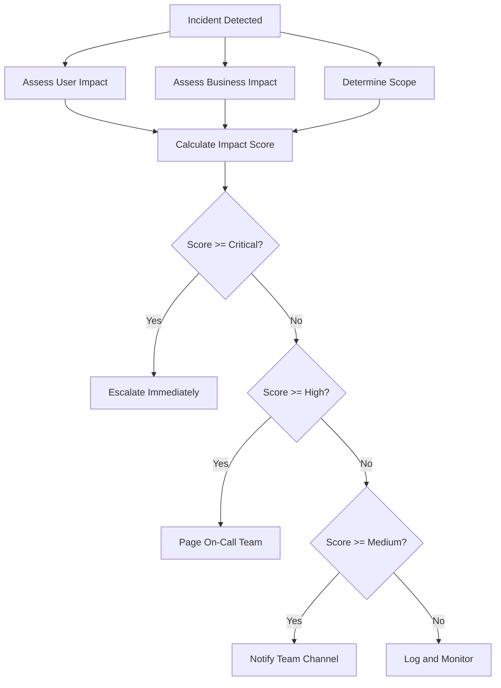
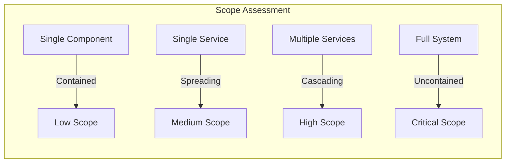
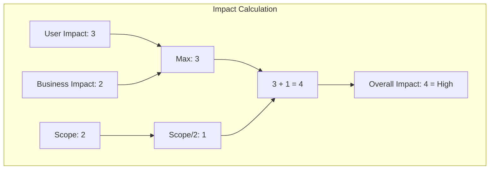

# How to Build Impact Assessment

Author: [nawazdhandala](https://github.com/nawazdhandala)

Tags: Incident Management, Impact, Assessment, SRE

Description: A practical guide to building impact assessment frameworks that help teams quantify incident severity, prioritize response, and communicate effectively with stakeholders.

---

## Why Impact Assessment Matters

When an incident hits, the first question everyone asks is: "How bad is it?" Without a structured way to answer this question, teams waste time debating severity levels instead of fixing problems. Worse, they over-escalate minor issues or under-respond to critical ones.

Impact assessment gives you a repeatable method to:
- Quantify the scope and severity of incidents
- Prioritize response efforts based on actual damage
- Communicate clearly with stakeholders and customers
- Make data-driven decisions about resource allocation
- Build historical baselines for future planning

## The Impact Assessment Framework

A solid impact assessment framework has three dimensions: **User Impact**, **Business Impact**, and **Scope**. Each dimension gets scored, and the combination determines overall severity.



## Dimension 1: User Impact

User impact measures how the incident affects the people using your service. This is the most important dimension because users are why your service exists.

### User Impact Scoring Matrix

| Score | Level | Definition | Example |
|-------|-------|------------|---------|
| 4 | Critical | All users cannot access the service | Complete outage, login broken for everyone |
| 3 | High | Large segment of users affected | Payments failing for 30%+ of users |
| 2 | Medium | Specific user cohort affected | Mobile users experiencing slow load times |
| 1 | Low | Small number of users affected | Single-region degradation, <5% users |
| 0 | None | No user-facing impact | Internal tooling issue, backend optimization |

### Questions to Ask

When assessing user impact, work through these questions:

1. **Who is affected?** All users, a segment, or a small subset?
2. **What functionality is broken?** Core features or edge cases?
3. **Can users work around it?** Is there an alternative path?
4. **How are they discovering the problem?** Errors, slowness, or silent failures?

### Measuring User Impact

The best way to measure user impact is through your observability stack. Set up dashboards that show:

- Error rates segmented by user cohort
- Latency percentiles (p50, p95, p99) by journey
- Successful transaction rates for critical flows
- Geographic distribution of failures

If you use OpenTelemetry, these metrics flow naturally from your traces and can be visualized in OneUptime.

## Dimension 2: Business Impact

Business impact translates technical problems into organizational consequences. This helps non-technical stakeholders understand severity and justifies resource allocation.

### Business Impact Categories

**Revenue Impact**
- Direct: Checkout failures, subscription issues, payment processing errors
- Indirect: Cart abandonment due to slowness, customer churn risk

**Reputation Impact**
- Public visibility of the outage
- Media coverage risk
- Social media amplification
- Customer trust erosion

**Operational Impact**
- Support ticket volume spike
- Manual workarounds required
- Staff overtime and context switching
- Delayed feature releases

**Compliance Impact**
- SLA violations and penalties
- Regulatory reporting requirements
- Audit trail gaps
- Data integrity concerns

### Business Impact Scoring

| Score | Level | Indicators |
|-------|-------|------------|
| 4 | Critical | Revenue loss >$X/hour, SLA breach imminent, exec escalation required |
| 3 | High | Revenue loss >$Y/hour, elevated support volume, customer complaints |
| 2 | Medium | Some revenue impact, manageable support load, isolated complaints |
| 1 | Low | Minimal financial impact, normal support volume |
| 0 | None | No business impact, internal visibility only |

Replace $X and $Y with thresholds that make sense for your organization. A startup might use $1,000/hour as critical while an enterprise might use $100,000/hour.

## Dimension 3: Scope Determination

Scope measures how much of your infrastructure is affected and how difficult the problem is to contain.



### Scope Factors

**Blast Radius**
- How many services are affected?
- Are dependencies failing in cascade?
- Is the problem spreading or contained?

**Data Impact**
- Is data being corrupted or lost?
- Are backups affected?
- Is there data inconsistency across systems?

**Recovery Complexity**
- Can you rollback?
- Is the fix known?
- How long will recovery take?

### Scope Scoring

| Score | Level | Definition |
|-------|-------|------------|
| 4 | Critical | System-wide failure, cascade in progress, no clear fix |
| 3 | High | Multiple services affected, spreading likely without intervention |
| 2 | Medium | Single service affected, contained but root cause unclear |
| 1 | Low | Single component affected, fix identified |
| 0 | None | Isolated issue, no spread risk |

## Calculating Overall Impact

Combine the three dimensions into a single impact score. Here is a simple formula:

```
Overall Impact = max(User Impact, Business Impact) + (Scope / 2)
```

This weights user and business impact equally while using scope as a multiplier for situations where problems are spreading.



### Severity Mapping

Map the overall impact score to severity levels:

| Score Range | Severity | Response |
|-------------|----------|----------|
| 5.0 - 6.0 | Critical (Sev-1) | All hands, exec notification, customer comms |
| 3.5 - 4.9 | High (Sev-2) | On-call team engaged, status page updated |
| 2.0 - 3.4 | Medium (Sev-3) | Team notified, tracked during business hours |
| 0.5 - 1.9 | Low (Sev-4) | Logged, addressed in normal workflow |
| 0.0 - 0.4 | Informational | Documented for awareness |

## Building Impact Assessment into Your Workflow

### Pre-Incident Setup

1. **Define your thresholds.** Work with stakeholders to agree on what "critical" means for your organization. Document the dollar amounts, user percentages, and SLA terms.

2. **Create scoring templates.** Build runbooks that guide responders through the assessment. Include the questions and scoring matrices.

3. **Instrument your systems.** Make sure you can answer the assessment questions quickly. If you cannot measure user impact in under 2 minutes, improve your observability.

4. **Train your team.** Practice impact assessment during game days. Run scenarios where responders must assess impact under time pressure.

### During Incidents

The incident commander (or first responder) should assess impact within the first 5 minutes. Use a structured approach:

```
IMPACT ASSESSMENT - [Incident ID]
Time: [HH:MM UTC]

User Impact: [Score] - [Brief justification]
Business Impact: [Score] - [Brief justification]
Scope: [Score] - [Brief justification]

Overall: [Score] -> Severity [Level]

Recommended Actions:
- [Action 1]
- [Action 2]
```

Update the assessment as conditions change. An incident that starts as Sev-3 might escalate to Sev-1 as more information becomes available.

### Post-Incident Review

After resolution, validate your initial assessment:

- Was the severity level appropriate?
- Did you over or under-estimate impact?
- What signals were missing that would have improved accuracy?
- How can you measure this type of incident faster next time?

Use this feedback to refine your thresholds and instrumentation.

## Real-World Impact Assessment Examples

### Example 1: Database Connection Pool Exhaustion

**Situation:** Application servers cannot connect to the primary database.

| Dimension | Score | Justification |
|-----------|-------|---------------|
| User Impact | 4 | All authenticated features broken |
| Business Impact | 4 | $50K/hour revenue at risk, checkout down |
| Scope | 2 | Single database affected, read replicas healthy |

**Overall:** max(4, 4) + (2/2) = 5 = **Sev-1 Critical**

**Response:** All hands engagement, failover to read replica for read-heavy features, emergency database restart, customer communication.

### Example 2: Third-Party Payment Processor Degradation

**Situation:** Payment processor returning intermittent 500 errors, 15% of payments failing.

| Dimension | Score | Justification |
|-----------|-------|---------------|
| User Impact | 2 | 15% of checkout users affected |
| Business Impact | 3 | Revenue loss estimated $8K/hour |
| Scope | 1 | Contained to payment service, other flows healthy |

**Overall:** max(2, 3) + (1/2) = 3.5 = **Sev-2 High**

**Response:** On-call engaged, retry logic enabled, status page updated, payment team notified, customer support briefed.

### Example 3: Slow Dashboard Load Times

**Situation:** Admin dashboard taking 10+ seconds to load, internal users complaining.

| Dimension | Score | Justification |
|-----------|-------|---------------|
| User Impact | 0 | No external user impact |
| Business Impact | 1 | Reduced internal productivity |
| Scope | 1 | Single internal service, no spread risk |

**Overall:** max(0, 1) + (1/2) = 1.5 = **Sev-4 Low**

**Response:** Logged in backlog, assigned to next sprint, no immediate action required.

## Common Pitfalls

**Over-relying on automated severity.** Automation helps, but humans should validate. An alert might fire for a minor blip that looks like a major outage.

**Ignoring slow-burn incidents.** Not all incidents are sudden. A gradual degradation that affects 1% more users each hour can become critical before anyone notices.

**Forgetting downstream dependencies.** Your service might be healthy, but if your biggest customer's integration is failing, the business impact is real.

**Letting politics influence scoring.** Senior stakeholders might pressure for higher severity to get faster response. Stick to your criteria.

**Not updating assessments.** Conditions change. What starts as low impact might cascade. Reassess every 15-30 minutes during active incidents.

## Tools and Automation

### Automated Impact Detection

Use your observability platform to automatically surface impact data:

- Error rate anomaly detection
- Latency degradation alerts
- User-facing SLO burn rate
- Business metric deviations

OneUptime can aggregate these signals and provide a unified view during incidents, making assessment faster and more accurate.

### Impact Templates in Runbooks

Create runbook templates that pre-populate known information:

```yaml
incident_type: database_outage
default_scores:
  user_impact: 4
  business_impact: 4
  scope: 2
auto_escalation: true
required_responders:
  - database-oncall
  - platform-oncall
```

When an incident matches a known pattern, start with these defaults and adjust based on actual conditions.

### Integration with Status Pages

Connect your impact assessment to customer communication:

| Severity | Status Page Update |
|----------|-------------------|
| Sev-1 | Major Outage, customer email |
| Sev-2 | Partial Outage, status page |
| Sev-3 | Degraded Performance |
| Sev-4 | No public update |

This removes the guesswork from communication decisions.

## Building Your Assessment Culture

Impact assessment only works if teams use it consistently. Here is how to build the habit:

1. **Start simple.** Begin with three severity levels (Critical, High, Low) and expand as teams get comfortable.

2. **Make it visible.** Display current incident severity in Slack channels, dashboards, and status pages.

3. **Reward accurate assessment.** Celebrate when teams correctly identify severity, even if it means downgrading an incident.

4. **Review regularly.** Include impact assessment accuracy in postmortem discussions.

5. **Iterate on thresholds.** Your first thresholds will be wrong. Adjust quarterly based on actual incident data.

## Summary

Impact assessment transforms incident response from gut feelings to structured decisions. By measuring user impact, business impact, and scope, you get a repeatable process that works whether you are handling your first incident or your thousandth.

Start with the framework in this post, customize the thresholds for your organization, and practice until assessment becomes second nature. Your stakeholders will thank you for the clarity, and your team will thank you for the focus.

The goal is not perfection in scoring. The goal is consistency in response. Get impact assessment right, and everything else in incident management becomes easier.

---

**Related Reading:**

- [Effective Incident Postmortem Templates](https://oneuptime.com/blog/post/2025-09-09-effective-incident-postmortem-templates-ready-to-use-examples/view)
- [12 SRE Best Practices That Actually Move the Needle](https://oneuptime.com/blog/post/2025-11-28-sre-best-practices/view)
- [18 SRE Metrics Worth Tracking](https://oneuptime.com/blog/post/2025-11-28-sre-metrics-to-track/view)
