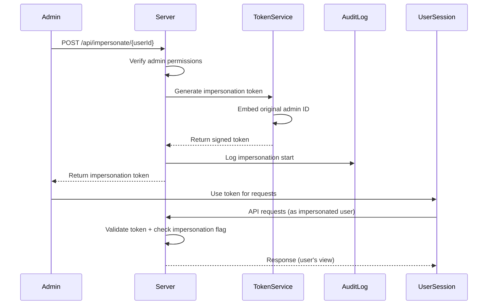
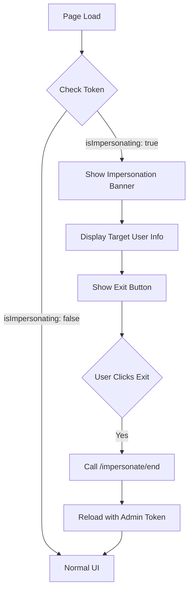

# How to Build Impersonation Implementation

Author: [nawazdhandala](https://github.com/nawazdhandala)

Tags: Security, Impersonation, Admin, Support

Description: Learn to build impersonation implementation for admin and support user switching.

---

User impersonation is a feature that allows administrators or support staff to view and operate an application as if they were a specific user. This capability is invaluable for debugging user-reported issues, providing customer support, and verifying permission configurations without asking users to share their credentials.

This guide walks through building a secure impersonation system from the ground up, covering architecture decisions, token management, session handling, and audit logging.

---

## Why Impersonation Matters

Support teams often struggle to reproduce user-reported bugs. Asking users to share screenshots or screen recordings rarely captures the full picture. With impersonation, a support engineer can experience the exact interface, permissions, and data state that the user sees.

Common use cases include:

- **Customer support**: Troubleshoot issues by viewing the application exactly as the customer does
- **Permission verification**: Confirm that role-based access controls work correctly
- **Demo environments**: Show prospects how their account would look with specific configurations
- **Quality assurance**: Test user-specific workflows without creating dozens of test accounts

---

## Architecture Overview

A well-designed impersonation system maintains a clear separation between the admin's original session and the impersonated session. The following diagram shows the high-level flow:



The key insight here is that the impersonation token carries both identities: the target user (for authorization decisions) and the original admin (for audit trails).

---

## Database Schema

Before writing any code, you need a place to store impersonation sessions. This table tracks who impersonated whom and when:

```sql
-- Table to track active and historical impersonation sessions
CREATE TABLE impersonation_sessions (
    id UUID PRIMARY KEY DEFAULT gen_random_uuid(),
    admin_user_id UUID NOT NULL REFERENCES users(id),
    target_user_id UUID NOT NULL REFERENCES users(id),
    reason TEXT,
    started_at TIMESTAMP WITH TIME ZONE DEFAULT NOW(),
    ended_at TIMESTAMP WITH TIME ZONE,
    ip_address INET,
    user_agent TEXT,
    is_active BOOLEAN DEFAULT TRUE,

    -- Prevent the same admin from having multiple active sessions
    CONSTRAINT unique_active_session
        UNIQUE (admin_user_id, is_active)
        WHERE is_active = TRUE
);

-- Index for quick lookups of active sessions
CREATE INDEX idx_impersonation_active
    ON impersonation_sessions(admin_user_id)
    WHERE is_active = TRUE;
```

---

## Token Structure

The impersonation token must encode several pieces of information. Using JWT (JSON Web Tokens) provides a standard format that can be verified without database lookups:

```typescript
// types/impersonation.ts
interface ImpersonationTokenPayload {
    // The user being impersonated (used for authorization)
    sub: string;

    // The admin who initiated impersonation (used for audit)
    adminId: string;

    // Session ID for tracking and revocation
    sessionId: string;

    // Flag to identify this as an impersonation token
    isImpersonation: true;

    // Standard JWT fields
    iat: number;
    exp: number;
}
```

This structure allows your authorization layer to use `sub` for permission checks while your audit layer uses `adminId` for logging.

---

## Starting an Impersonation Session

The endpoint to begin impersonation must verify that the requester has permission to impersonate and that the target user exists:

```typescript
// routes/impersonation.ts
import express from 'express';
import jwt from 'jsonwebtoken';
import { v4 as uuidv4 } from 'uuid';
import { db } from '../database';
import { requireAdmin } from '../middleware/auth';

const router = express.Router();

router.post('/impersonate/:userId', requireAdmin, async (req, res) => {
    const adminId = req.user.id;
    const targetUserId = req.params.userId;
    const { reason } = req.body;

    // Prevent self-impersonation
    if (adminId === targetUserId) {
        return res.status(400).json({
            error: 'Cannot impersonate yourself'
        });
    }

    // Verify target user exists
    const targetUser = await db.users.findById(targetUserId);
    if (!targetUser) {
        return res.status(404).json({ error: 'User not found' });
    }

    // Check if admin already has an active impersonation session
    const existingSession = await db.impersonationSessions.findActive(adminId);
    if (existingSession) {
        return res.status(409).json({
            error: 'End current impersonation session first'
        });
    }

    // Create the session record
    const sessionId = uuidv4();
    await db.impersonationSessions.create({
        id: sessionId,
        adminUserId: adminId,
        targetUserId: targetUserId,
        reason: reason || null,
        ipAddress: req.ip,
        userAgent: req.headers['user-agent'],
    });

    // Generate the impersonation token
    const token = jwt.sign(
        {
            sub: targetUserId,
            adminId: adminId,
            sessionId: sessionId,
            isImpersonation: true,
        },
        process.env.JWT_SECRET,
        { expiresIn: '1h' }
    );

    // Log the action for compliance
    console.log(`Impersonation started: admin=${adminId} target=${targetUserId}`);

    res.json({
        token,
        targetUser: {
            id: targetUser.id,
            email: targetUser.email,
            name: targetUser.name,
        },
        expiresIn: 3600,
    });
});

export default router;
```

---

## Authentication Middleware

Your authentication middleware needs to handle both regular tokens and impersonation tokens. The middleware extracts the effective user while preserving the admin identity for audit purposes:

```typescript
// middleware/auth.ts
import jwt from 'jsonwebtoken';
import { Request, Response, NextFunction } from 'express';

interface AuthenticatedRequest extends Request {
    user: {
        id: string;
        isImpersonating: boolean;
        impersonatedBy?: string;
        sessionId?: string;
    };
}

export function authenticateToken(
    req: AuthenticatedRequest,
    res: Response,
    next: NextFunction
) {
    const authHeader = req.headers.authorization;
    const token = authHeader?.split(' ')[1];

    if (!token) {
        return res.status(401).json({ error: 'No token provided' });
    }

    try {
        const decoded = jwt.verify(token, process.env.JWT_SECRET);

        // Check if this is an impersonation token
        if (decoded.isImpersonation) {
            req.user = {
                id: decoded.sub,              // Effective user ID
                isImpersonating: true,
                impersonatedBy: decoded.adminId,
                sessionId: decoded.sessionId,
            };
        } else {
            req.user = {
                id: decoded.sub,
                isImpersonating: false,
            };
        }

        next();
    } catch (error) {
        return res.status(403).json({ error: 'Invalid token' });
    }
}
```

---

## Ending an Impersonation Session

Users should always have a clear way to exit impersonation mode. This endpoint terminates the session and returns the admin to their normal view:

```typescript
// routes/impersonation.ts
router.post('/impersonate/end', authenticateToken, async (req, res) => {
    // Only allow ending if currently impersonating
    if (!req.user.isImpersonating) {
        return res.status(400).json({
            error: 'Not currently impersonating'
        });
    }

    const sessionId = req.user.sessionId;
    const adminId = req.user.impersonatedBy;

    // Mark the session as ended
    await db.impersonationSessions.update(sessionId, {
        isActive: false,
        endedAt: new Date(),
    });

    // Generate a fresh token for the admin
    const adminToken = jwt.sign(
        { sub: adminId },
        process.env.JWT_SECRET,
        { expiresIn: '24h' }
    );

    console.log(`Impersonation ended: admin=${adminId} session=${sessionId}`);

    res.json({ token: adminToken });
});
```

---

## Visual Indicator in the UI

Users must always know when they are in impersonation mode. A persistent banner prevents confusion and accidental actions:



A simple React component handles this display:

```tsx
// components/ImpersonationBanner.tsx
import React from 'react';
import { useAuth } from '../hooks/useAuth';

export function ImpersonationBanner() {
    const { user, endImpersonation } = useAuth();

    // Only render when impersonating
    if (!user?.isImpersonating) {
        return null;
    }

    return (
        <div className="impersonation-banner">
            <span>
                You are viewing as: <strong>{user.name}</strong>
            </span>
            <button onClick={endImpersonation}>
                Exit Impersonation
            </button>
        </div>
    );
}
```

---

## Audit Logging

Every action taken during impersonation must be logged with both identities. This middleware attaches impersonation context to all audit logs:

```typescript
// middleware/auditLog.ts
import { Request, Response, NextFunction } from 'express';
import { db } from '../database';

export function auditLog(
    req: Request,
    res: Response,
    next: NextFunction
) {
    // Capture response to log after completion
    const originalSend = res.send;

    res.send = function(body) {
        // Build the audit entry
        const entry = {
            timestamp: new Date(),
            method: req.method,
            path: req.path,
            userId: req.user?.id,
            statusCode: res.statusCode,
            ipAddress: req.ip,

            // Include impersonation context when present
            isImpersonation: req.user?.isImpersonating || false,
            adminUserId: req.user?.impersonatedBy || null,
            sessionId: req.user?.sessionId || null,
        };

        // Write to audit log asynchronously
        db.auditLogs.create(entry).catch(console.error);

        return originalSend.call(this, body);
    };

    next();
}
```

---

## Security Considerations

Building impersonation requires careful attention to security:

**Permission restrictions**: Not all admins should be able to impersonate all users. Consider role hierarchies where support staff can only impersonate regular users, while super-admins can impersonate anyone except other super-admins.

**Action limitations**: Some actions should be blocked during impersonation. Password changes, two-factor authentication modifications, and billing updates typically fall into this category.

**Session timeouts**: Impersonation tokens should have shorter lifetimes than regular tokens. One hour is a reasonable default.

**Audit retention**: Impersonation audit logs may need longer retention periods for compliance. Check your industry regulations.

**Notification options**: Some organizations notify users when their account is being impersonated. This adds transparency but may cause confusion if not communicated properly.

---

## Summary

| Component | Purpose |
|-----------|---------|
| **Impersonation token** | Carries both user and admin identities |
| **Session table** | Tracks active and historical impersonations |
| **Auth middleware** | Extracts effective user while preserving admin context |
| **UI banner** | Provides visual indication of impersonation mode |
| **Audit logging** | Records all actions with full identity context |

Impersonation is a powerful tool that makes support and debugging significantly easier. With proper token design, clear UI indicators, and comprehensive audit logging, you can implement it safely while maintaining user trust and regulatory compliance.

---

**Related Reading:**

- [Secure your status page: authentication options explained](https://oneuptime.com/blog/post/2025-11-20-secure-your-status-page-authentication-options/view)
- [Stop Paywalling Security: SSO Is a Basic Right, Not an Enterprise Perk](https://oneuptime.com/blog/post/2025-08-19-sso-is-a-security-basic-not-an-enterprise-perk/view)
